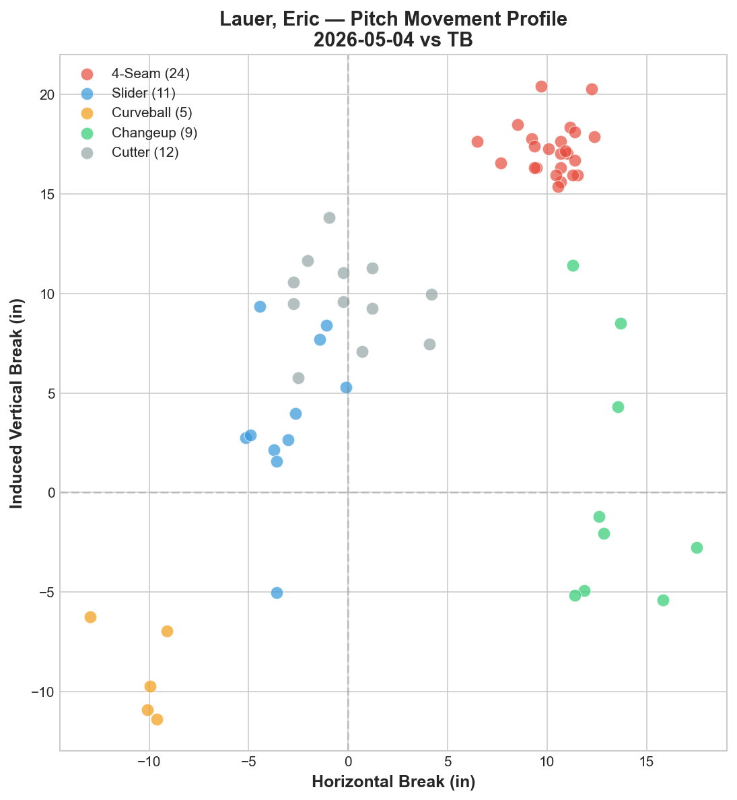
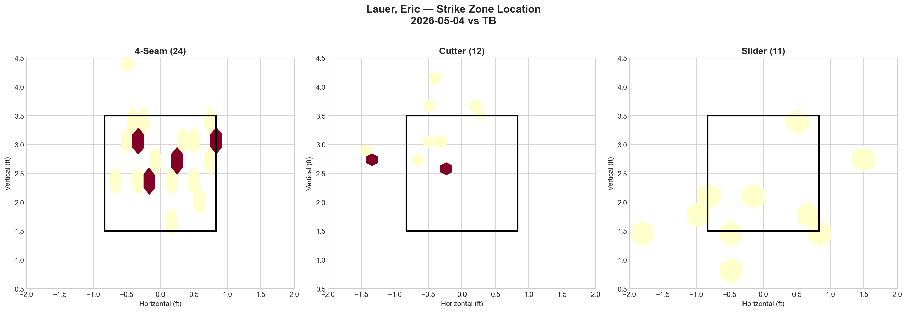
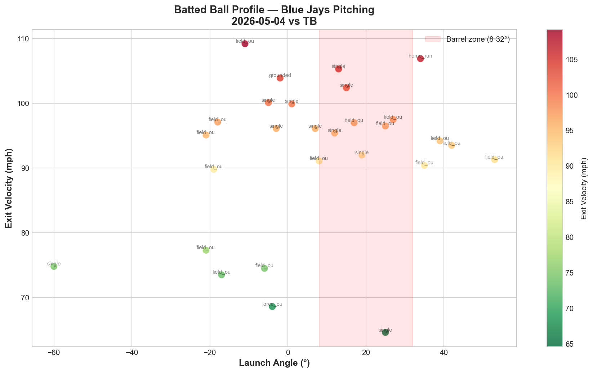

# Toronto Blue Jays — Daily Game Reports

Statcast-powered pitching and batting analysis for every Blue Jays game, updated daily.

## Overview

This project generates analytical game reports using MLB Statcast data (via [pybaseball](https://github.com/jldbc/pybaseball)), with a focus on starting pitcher evaluation, batted ball quality, and actionable scouting insights. Each report is designed to mirror the depth and format of professional front-office game summaries.

## Report Sections

Each daily report includes:

- **Starting Pitcher Breakdown** — Pitch arsenal, velocity, movement profile (IVB/HB), and usage rates
- **Strike Zone Heat Map** — Pitch location density by zone for top 3 pitch types
- **LHB/RHB Splits** — Platoon performance with whiff rates
- **Count-Based Pitch Sequencing** — Pitch selection by count situation (ahead, behind, even, full)
- **Batter-by-Batter Top 3** — Detailed matchup analysis for the most impactful opposing hitters
- **Batted Ball Analysis** — Exit velocity, launch angle, hard-hit rate, and barrel zone mapping
- **Offensive Summary** — Team slash line, RISP performance, and key contributors
- **Series Pitching Comparison** — Cross-game starter evaluation across a series

## Repository Structure

```
bluejays-daily-reports/
├── reports/           # Markdown game reports (one per game)
├── visualizations/    # Pitch movement, zone heatmap, and batted ball charts
├── notebooks/         # Jupyter notebook template for data extraction
├── data/              # Raw Statcast CSV exports per game
├── scripts/           # Utility scripts
└── charts/            # Legacy chart outputs
```

## Sample Visualizations

| Pitch Movement Profile | Strike Zone Heat Map | Batted Ball Profile |
|:-:|:-:|:-:|
|  |  |  |

## Data Source

All pitch-level data is sourced from [MLB Statcast](https://baseballsavant.mlb.com/) via the `pybaseball` Python library. Reports cover the 2026 MLB season.

## Tools & Stack

- **Python** — pandas, matplotlib, numpy
- **pybaseball** — Statcast data extraction
- **Jupyter Notebook** — Interactive analysis workflow
- **GitHub** — Version control and report hosting

---

*Built by [@seongji-park](https://github.com/seongji-park)*
