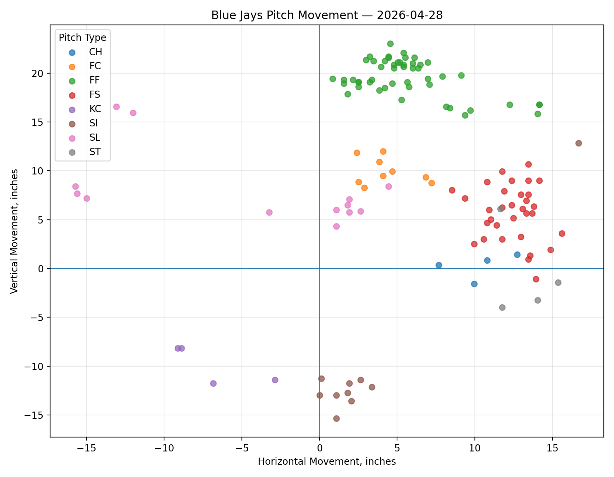
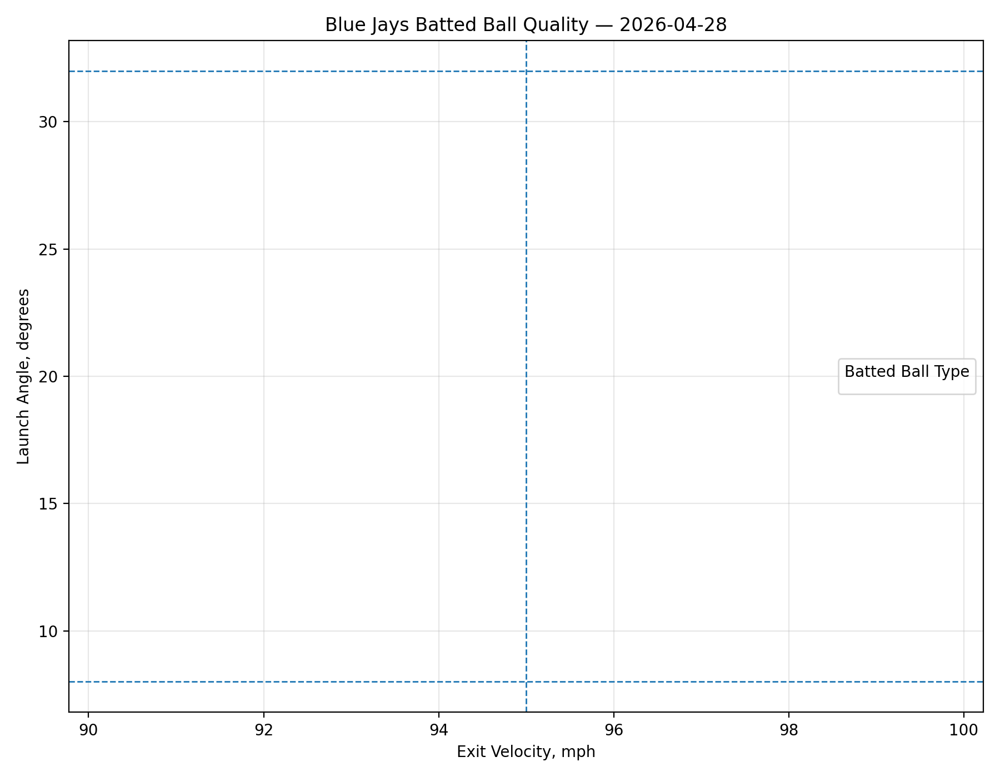
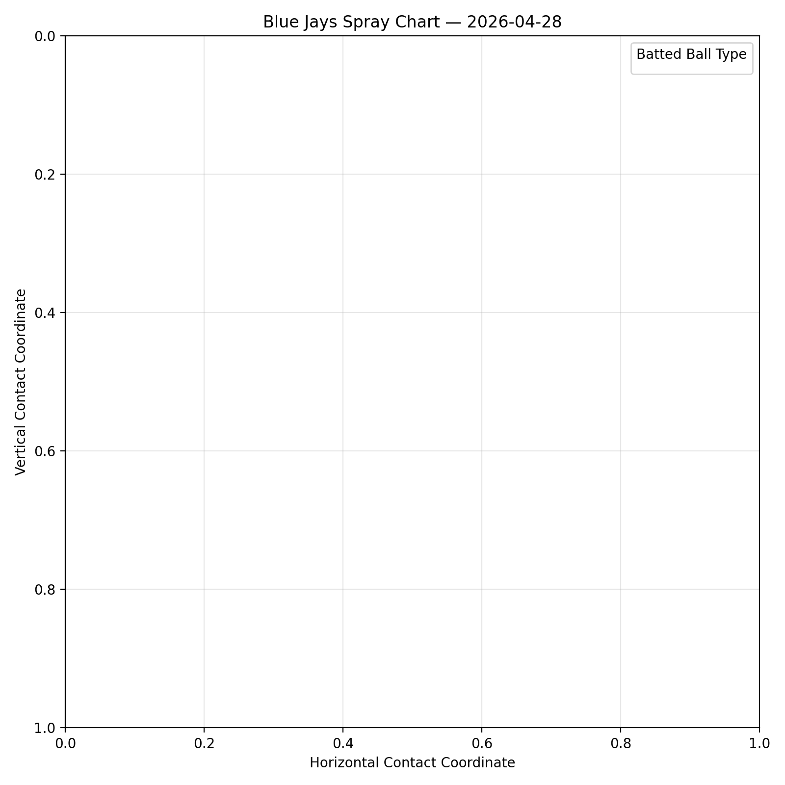

# Toronto Blue Jays Advanced Game Report — 2026-04-28

## Data Scope

This report uses Statcast pitch-level data for the Toronto Blue Jays game on 2026-04-28. It separates Blue Jays pitching and Blue Jays hitting, then summarizes pitch movement, swing decisions, batted-ball quality, and situational trends.

## Key Metric Definitions

- **H-Mov / V-Mov:** horizontal and vertical pitch movement in inches.
- **Whiff/Swing%:** whiffs divided by swings.
- **Chase Rate:** swings at pitches outside the strike zone.
- **Hard-Hit Rate:** batted balls with exit velocity of 95 mph or higher.
- **Barrel Rate:** batted balls classified as barrels by Statcast launch speed/angle zone.
- **Sweet-Spot Rate:** batted balls with launch angle between 8 and 32 degrees.

## Game Review Summary

This report reviews the Toronto Blue Jays' 2026-04-28 game through Statcast pitch-level data. The dataset includes **126 Blue Jays pitching events** and **0 Blue Jays hitting events**, with a focus on pitch movement, swing decisions, batted-ball quality, and situational hitting.

## Key Takeaways

1. **Pitching swing-and-miss note:** Jeff Hoffman's **FF** generated the strongest whiff profile in this sample, producing a **50.0% whiff-per-swing rate** on 2 swings.
2. **Best contact-quality note:** There were no tracked batted balls available for contact-quality analysis.
3. **Team contact-quality note:** Blue Jays hitters produced **0 tracked batted balls**, with a **0.0% hard-hit rate** and a **0.0% barrel rate**.
4. **Plate-discipline note:** There was not enough out-of-zone pitch data to identify a clear chase-rate leader.

_Note: This is a single-game sample, so the takeaways should be treated as descriptive rather than predictive._

## Blue Jays Pitching

## Visual Summary

### Pitch Movement Plot

This chart shows the horizontal and vertical movement profile of Blue Jays pitches. It helps identify how each pitch type separated from the rest of the arsenal.

### Exit Velocity vs. Launch Angle

This chart shows the quality of contact produced by Blue Jays hitters. The vertical reference lines help separate hard contact and optimal launch-angle ranges.

### Spray Chart

This chart shows where Blue Jays batted balls were hit on the field. It provides an initial view of pull-side, middle-field, and opposite-field contact distribution.

### Jeff Hoffman

Jeff Hoffman threw **10 tracked pitches**.

#### Pitch Movement and Swing Profile

| pitch_type | stand | pitches | avg_velocity | avg_h_mov | avg_v_mov | swing_rate | whiff_per_swing | chase_rate_generated |
|---|---|---|---|---|---|---|---|---|
| FS | L | 3 | 89.7 | 14.1 | 0.6 | 33.3 | 0.0 | 0.0 |
| FF | L | 2 | 96.4 | 13.2 | 16.8 | 100.0 | 0.0 | 100.0 |
| FF | R | 2 | 97.9 | 14.1 | 16.3 | 100.0 | 50.0 | 100.0 |
| SL | L | 2 | 87.8 | -1.1 | 5.0 | 0.0 | 0.0 | 0.0 |
| SI | R | 1 | 96.8 | 16.7 | 12.8 | 0.0 | 0.0 | 0.0 |

#### Contact Allowed

| pitch_type | stand | bbe | avg_ev | max_ev | avg_la | hard_hit_rate | barrel_rate | sweet_spot_rate |
|---|---|---|---|---|---|---|---|---|
| FF | L | 1 | 61.0 | 61.0 | 33.0 | 0.0 | 0.0 | 0.0 |
| FF | R | 1 | 84.6 | 84.6 | 37.0 | 0.0 | 0.0 | 0.0 |
| FS | L | 1 | 82.1 | 82.1 | -41.0 | 0.0 | 0.0 | 0.0 |

**Automated note:** Jeff Hoffman's most-used pitch was the **FS**, accounting for 3 tracked pitches. It averaged 89.7 mph with 14.1 inches of horizontal movement and 0.6 inches of vertical movement.

---

### Louis Varland

Louis Varland threw **15 tracked pitches**.

#### Pitch Movement and Swing Profile

| pitch_type | stand | pitches | avg_velocity | avg_h_mov | avg_v_mov | swing_rate | whiff_per_swing | chase_rate_generated |
|---|---|---|---|---|---|---|---|---|
| FF | L | 5 | 99.2 | 8.2 | 16.4 | 40.0 | 0.0 | 0.0 |
| CH | L | 4 | 92.9 | 10.3 | 0.3 | 100.0 | 50.0 | 100.0 |
| FF | R | 2 | 99.0 | 4.8 | 18.4 | 100.0 | 0.0 | 100.0 |
| KC | L | 2 | 87.1 | -5.9 | -9.8 | 0.0 | 0.0 | 0.0 |
| KC | R | 2 | 86.4 | -8.0 | -10.0 | 50.0 | 100.0 | 100.0 |

#### Contact Allowed

| pitch_type | stand | bbe | avg_ev | max_ev | avg_la | hard_hit_rate | barrel_rate | sweet_spot_rate |
|---|---|---|---|---|---|---|---|---|
| FF | L | 2 | 74.6 | 81.1 | 38.5 | 0.0 | 0.0 | 0.0 |
| FF | R | 2 | 76.4 | 78.4 | 35.0 | 0.0 | 0.0 | 50.0 |
| CH | L | 1 | 65.7 | 65.7 | -43.0 | 0.0 | 0.0 | 0.0 |

**Automated note:** Louis Varland's most-used pitch was the **FF**, accounting for 5 tracked pitches. It averaged 99.2 mph with 8.2 inches of horizontal movement and 16.4 inches of vertical movement.

---

### Mason Fluharty

Mason Fluharty threw **13 tracked pitches**.

#### Pitch Movement and Swing Profile

| pitch_type | stand | pitches | avg_velocity | avg_h_mov | avg_v_mov | swing_rate | whiff_per_swing | chase_rate_generated |
|---|---|---|---|---|---|---|---|---|
| FC | L | 6 | 90.6 | 4.1 | 10.1 | 16.7 | 100.0 | 0.0 |
| ST | L | 4 | 82.2 | 13.2 | -0.6 | 50.0 | 0.0 | 0.0 |
| FC | R | 3 | 90.8 | 4.7 | 9.7 | 66.7 | 0.0 | 0.0 |

#### Contact Allowed

| pitch_type | stand | bbe | avg_ev | max_ev | avg_la | hard_hit_rate | barrel_rate | sweet_spot_rate |
|---|---|---|---|---|---|---|---|---|
| FC | R | 2 | 78.2 | 84.3 | -3.0 | 0.0 | 0.0 | 50.0 |
| ST | L | 2 | 85.4 | 91.6 | -29.0 | 0.0 | 0.0 | 0.0 |

**Automated note:** Mason Fluharty's most-used pitch was the **FC**, accounting for 6 tracked pitches. It averaged 90.6 mph with 4.1 inches of horizontal movement and 10.1 inches of vertical movement.

---

### Trey Yesavage

Trey Yesavage threw **74 tracked pitches**.

#### Pitch Movement and Swing Profile

| pitch_type | stand | pitches | avg_velocity | avg_h_mov | avg_v_mov | swing_rate | whiff_per_swing | chase_rate_generated |
|---|---|---|---|---|---|---|---|---|
| FF | L | 24 | 94.2 | 4.6 | 20.3 | 50.0 | 0.0 | 38.5 |
| FS | L | 19 | 82.3 | 12.2 | 7.0 | 42.1 | 25.0 | 20.0 |
| FF | R | 15 | 94.4 | 4.6 | 20.3 | 60.0 | 0.0 | 42.9 |
| FS | R | 10 | 81.7 | 12.3 | 4.7 | 40.0 | 25.0 | 28.6 |
| SL | R | 5 | 87.0 | 2.4 | 6.5 | 80.0 | 25.0 | 50.0 |
| SL | L | 1 | 88.3 | 1.9 | 7.1 | 100.0 | 0.0 | 100.0 |

#### Contact Allowed

| pitch_type | stand | bbe | avg_ev | max_ev | avg_la | hard_hit_rate | barrel_rate | sweet_spot_rate |
|---|---|---|---|---|---|---|---|---|
| FF | L | 10 | 80.6 | 100.7 | 33.7 | 10.0 | 0.0 | 20.0 |
| FF | R | 8 | 83.3 | 104.3 | 46.5 | 12.5 | 12.5 | 12.5 |
| FS | L | 6 | 78.8 | 97.1 | 37.2 | 16.7 | 0.0 | 16.7 |
| SL | R | 3 | 62.0 | 92.5 | -3.0 | 0.0 | 0.0 | 0.0 |
| FS | R | 2 | 67.9 | 74.0 | 61.0 | 0.0 | 0.0 | 0.0 |
| SL | L | 1 | 79.1 | 79.1 | 26.0 | 0.0 | 0.0 | 100.0 |

**Automated note:** Trey Yesavage's most-used pitch was the **FF**, accounting for 24 tracked pitches. It averaged 94.2 mph with 4.6 inches of horizontal movement and 20.3 inches of vertical movement.

---

### Tyler Rogers

Tyler Rogers threw **14 tracked pitches**.

#### Pitch Movement and Swing Profile

| pitch_type | stand | pitches | avg_velocity | avg_h_mov | avg_v_mov | swing_rate | whiff_per_swing | chase_rate_generated |
|---|---|---|---|---|---|---|---|---|
| SI | L | 5 | 84.9 | 1.2 | -13.5 | 60.0 | 0.0 | 100.0 |
| SL | R | 5 | 75.0 | -14.3 | 11.2 | 40.0 | 50.0 | 40.0 |
| SI | R | 4 | 84.0 | 2.0 | -11.6 | 75.0 | 0.0 | 0.0 |

#### Contact Allowed

| pitch_type | stand | bbe | avg_ev | max_ev | avg_la | hard_hit_rate | barrel_rate | sweet_spot_rate |
|---|---|---|---|---|---|---|---|---|
| SI | R | 3 | 87.9 | 93.7 | 20.3 | 0.0 | 0.0 | 33.3 |
| SI | L | 1 | 71.8 | 71.8 | -34.0 | 0.0 | 0.0 | 0.0 |
| SL | R | 1 | 86.6 | 86.6 | 6.0 | 0.0 | 0.0 | 0.0 |

**Automated note:** Tyler Rogers's most-used pitch was the **SI**, accounting for 5 tracked pitches. It averaged 84.9 mph with 1.2 inches of horizontal movement and -13.5 inches of vertical movement.

---

## Blue Jays Hitting

## Situational Hitting

This section compares Blue Jays hitters with runners on base versus no runners on base.

_No data available._

## Spray Chart Data

Spray chart raw data was saved to `reports/tables/2026-04-28-spray-chart-data.csv`. The next step is to turn `hc_x` and `hc_y` into a visual spray chart.

## Next Development Steps

- Add movement scatter plots for each pitcher.
- Add exit velocity vs. launch angle charts for batted balls.
- Add spray charts for Blue Jays hitters.
- Add game context: inning, count, score, leverage, and result.
- Add rolling multi-game trends instead of single-game-only analysis.
