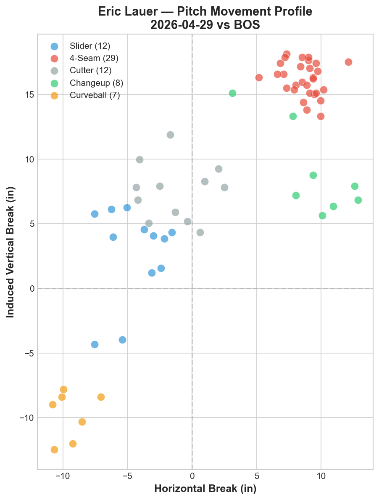
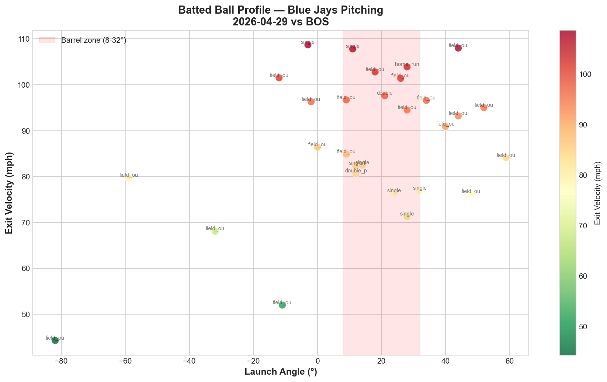

# Blue Jays Game Report: April 29, 2026

**Toronto Blue Jays 8, Boston Red Sox 1** | Rogers Centre, Toronto

---

## Game Summary

The Blue Jays completed a dominant series against Boston with an 8-1 victory, led by Vladimir Guerrero Jr.'s 3-hit performance and a strong collective effort from the pitching staff. Eric Lauer started and pitched 4.1 innings of 1-run ball before turning it over to a lights-out bullpen.

**Line Score:**

| | 1 | 2 | 3 | 4 | 5 | 6 | 7 | 8 | 9 | R | H | E |
|---|---|---|---|---|---|---|---|---|---|---|---|---|
| BOS | 1 | 0 | 0 | 0 | 0 | 0 | 0 | 0 | 0 | 1 | 9 | 0 |
| TOR | 0 | 0 | 3 | 2 | 2 | 0 | 0 | 1 | X | 8 | 10 | 0 |

---

## Starting Pitcher: Eric Lauer

**Line:** 4.1 IP, 5 H, 1 ER, 1 BB, 1 K — 68 pitches | ERA: 2.08

### Pitch Arsenal (68 pitches)

| Pitch | Count | Usage % | Avg Velo | H-Break (in) | V-Break (in) |
|---|---|---|---|---|---|
| Four-seam (FF) | 29 | 42.6% | 90.8 mph | +8.7 | +16.2 |
| Slider (SL) | 12 | 17.6% | 82.7 mph | -4.5 | +2.8 |
| Cutter (FC) | 12 | 17.6% | 86.6 mph | -1.3 | +7.5 |
| Changeup (CH) | 8 | 11.8% | 84.1 mph | +9.3 | +8.9 |
| Curveball (CU) | 7 | 10.3% | 75.5 mph | -9.5 | -9.8 |

### LHB/RHB Splits

| Split | Pitches | Avg Velo | Swinging Strikes | Whiff/Pitch |
|---|---|---|---|---|
| vs LHB | 14 | 87.2 mph | 0 | 0.0% |
| vs RHB | 54 | 86.0 mph | 4 | 7.4% |

**Pitch Mix vs LHB:** FF 50.0%, SL 35.7%, FC 14.3%

**Pitch Mix vs RHB:** FF 40.7%, FC 18.5%, CH 14.8%, SL 13.0%, CU 13.0%

### Pitching Analysis

Lauer's approach showed clear platoon awareness. Against left-handed hitters, he simplified to a three-pitch mix dominated by his four-seam fastball and slider. Against right-handers, he deployed all five pitches, with notably increased changeup and curveball usage — the two pitches that generate the most movement differential against same-side hitters.

His four-seam fastball averaged 90.8 mph with strong vertical break (+16.2 inches), clustering in the upper-right quadrant of the movement chart. The curveball showed dramatic downward action (-9.8 inches vertical) — providing the maximum vertical separation from the fastball at 26 inches of total differential.

The 0.0% whiff rate against lefties is a concern in a small sample (14 pitches), though the limited exposure makes it difficult to draw definitive conclusions.

---

## Bullpen Performance

| Pitcher | IP | PC | H | R | K | ERA |
|---|---|---|---|---|---|---|
| Spencer Miles | 2.0 | 26 | 0 | 0 | 3 | 0.00 |
| Joe Mantiply | 0.1 | 10 | 2 | 0 | 1 | 0.00 |
| Tommy Nance | 0.2 | 7 | 1 | 0 | 0 | 0.00 |
| Braydon Fisher (W) | 1.2 | 17 | 1 | 0 | 1 | 0.00 |

Spencer Miles was the standout reliever, striking out 3 in 2 hitless innings on just 26 pitches — an efficient and dominant outing.

---

## Batted Ball Analysis (Blue Jays Pitching)

| Metric | Value |
|---|---|
| Total balls in play | 29 |
| Avg exit velocity | 87.6 mph |
| Avg launch angle | 13.5° |
| Hard hit rate (95+ mph) | 12/29 (41.4%) |

The 41.4% hard-hit rate is elevated, indicating Boston made solid contact in several at-bats despite the 1-run result. The pitching staff was effective at limiting damage, with much of the hard contact resulting in outs — likely aided by defensive positioning and favorable batted ball direction.

---

## Blue Jays Batting — Pitch Result Breakdown

| Pitch Type | Ball | Called Strike | Foul | In Play | Whiff | Other |
|---|---|---|---|---|---|---|
| CH (Changeup) | 14 | 0 | 4 | 5 | 1 | 2 |
| CU (Curveball) | 2 | 1 | 1 | 0 | 1 | 0 |
| FC (Cutter) | 0 | 0 | 2 | 1 | 1 | 0 |
| FF (Four-seam) | 11 | 5 | 4 | 8 | 2 | 0 |
| SI (Sinker) | 14 | 13 | 13 | 10 | 1 | 0 |
| SL (Slider) | 0 | 0 | 0 | 3 | 0 | 0 |
| ST (Sweeper) | 4 | 3 | 1 | 3 | 0 | 0 |

Blue Jays hitters showed excellent discipline against Boston's sinker-heavy approach, seeing a high volume of sinkers (51 total) and putting 10 in play. The changeup was taken for a ball on 14 of 26 offerings, suggesting the Jays lineup recognized the off-speed pitch well and refused to chase.

---

## Player Spotlight: Vladimir Guerrero Jr.

**3-for-4, 1 2B, 1 RBI, 2 R**

Guerrero was the offensive catalyst, reaching base in four of five plate appearances. His double was the extra-base highlight in a game where the Blue Jays manufactured runs through consistent contact and baserunning.

---

## Key Takeaway

Eric Lauer continues to demonstrate the post-KBO reinvention documented in our pitching staff analysis. His five-pitch arsenal with clear platoon adjustments reflects a pitcher who compensates for modest velocity (90.8 mph fastball) with pitch diversity and sequencing intelligence. The bullpen's collective 4.2 scoreless innings with 5 strikeouts sealed a comfortable victory and preserved the bullpen's health heading into the next series.

---

*Report generated using MLB Statcast data via pybaseball. Full analysis notebook available in the repository.*
