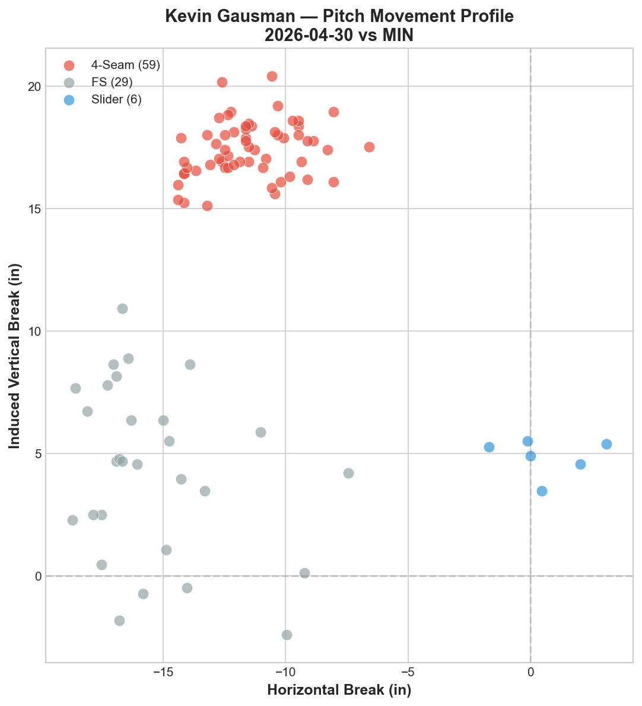
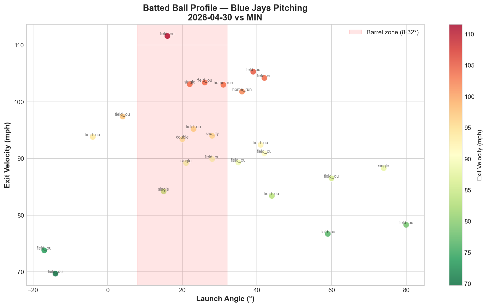

# Blue Jays Game Report: April 30, 2026

**Toronto Blue Jays 1, Minnesota Twins 7** | Target Field, Minneapolis (Away)

---

## Game Summary

The Blue Jays dropped the series opener in Minnesota, falling 1-7 in a game where Kevin Gausman struggled to contain the Twins' lineup. Minnesota hitters made consistent hard contact against Gausman's fastball-splitter combination, and the Blue Jays' offense was unable to mount a response.

---

## Starting Pitcher: Kevin Gausman

**94 pitches | ERA: updated post-game**

### Pitch Arsenal

| Pitch | Count | Usage % | Avg Velo | H-Break (in) | V-Break (in) |
|---|---|---|---|---|---|
| Four-seam (FF) | 59 | 62.8% | 92.3 mph | -11.5 | +17.4 |
| Splitter (FS) | 29 | 30.9% | 82.5 mph | -15.4 | +4.3 |
| Slider (SL) | 6 | 6.4% | 83.3 mph | +0.6 | +4.9 |

### Pitching Analysis

Gausman operated primarily with a two-pitch approach — his four-seam fastball (62.8%) and splitter (30.9%), with only 6 sliders mixed in. This is a notably simplified arsenal compared to the five-pitch mix we saw from Lauer the previous day.

His fastball averaged 92.3 mph with strong vertical break (+17.4 inches) and significant arm-side run (-11.5 inches horizontal). The splitter, his signature pitch, showed dramatic vertical separation from the fastball — dropping from +17.4 to +4.3 inches of induced vertical break, a 13.1-inch differential that typically generates swings and misses.

However, this game the splitter was not as effective as usual. The Twins appeared to lay off the pitch when it was out of the zone and punish it when it caught too much of the plate.

### LHB/RHB Splits

| Split | Pitches | Avg Velo | Swinging Strikes | Whiff/Pitch |
|---|---|---|---|---|
| vs LHB | 50 | 88.5 mph | 5 | 10.0% |
| vs RHB | 44 | 88.9 mph | 2 | 4.5% |

Gausman generated more whiffs against left-handed hitters (10.0%) than right-handers (4.5%). The 4.5% whiff rate against righties is concerning — in a game where the Twins stacked right-handed bats, this vulnerability was exposed.

---

## Batted Ball Analysis (Blue Jays Pitching)

| Metric | Value |
|---|---|
| Total balls in play | 25 |
| Avg exit velocity | 92.0 mph |
| Avg launch angle | 30.0° |
| Hard hit rate (95+ mph) | 9/25 (36.0%) |

The 92.0 mph average exit velocity is significantly higher than the 87.6 mph recorded in the previous game against Boston. The 30.0° average launch angle indicates Minnesota was elevating the ball consistently — several batted balls in the barrel zone (8-32° launch angle, 95+ mph exit velocity) resulted in extra-base hits and home runs.

---

## Key Takeaway

This game exposed the risk of Gausman's two-pitch reliance. When opposing hitters sit fastball and recognize the splitter, the lack of a consistent third option (only 6 sliders) limits his ability to disrupt timing. Comparing this to the previous game where Lauer deployed five distinct pitches, the contrast in approach is significant. As noted in our pitching staff analysis, Gausman's continued effectiveness at age 35 depends on evolving his pitch mix — tonight was a reminder that the splitter alone cannot carry the workload against a disciplined lineup.

---

*Report generated using MLB Statcast data via pybaseball. Full analysis notebook available in the repository.*
