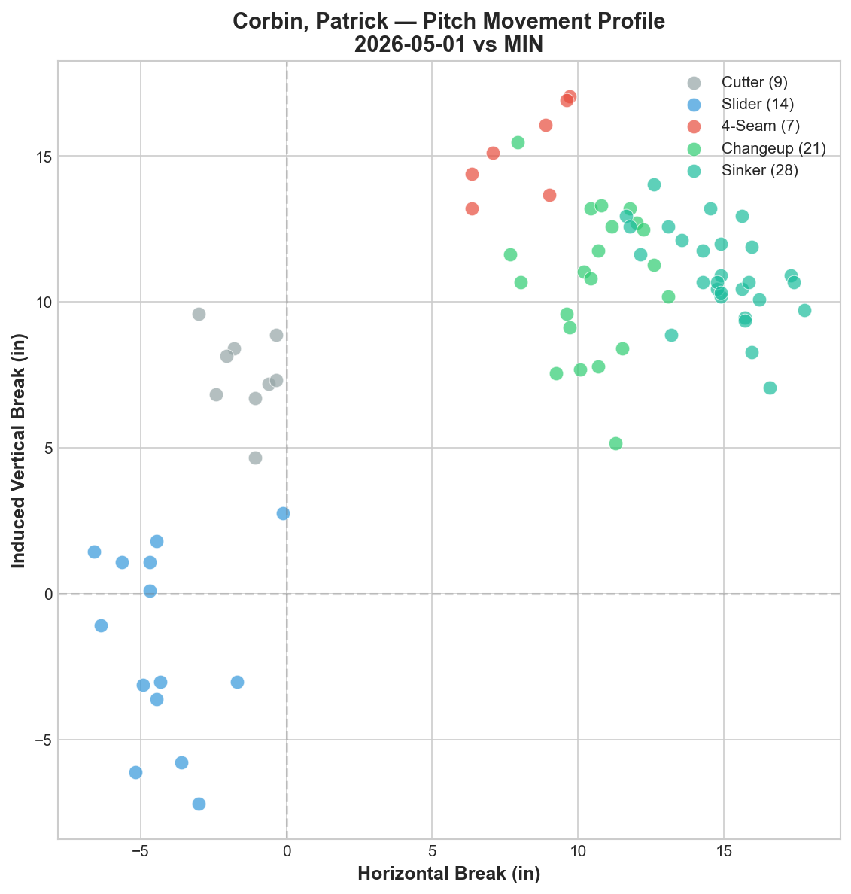
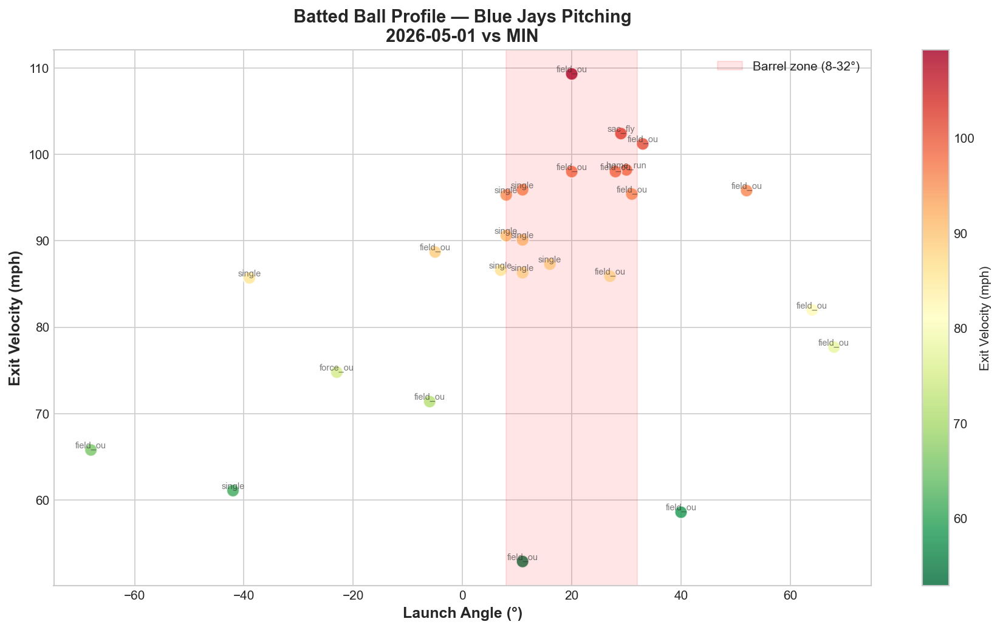

# Blue Jays Game Report: May 1, 2026

**Toronto Blue Jays vs Minnesota Twins** | Target Field, Minneapolis (Away)

---

## Starting Pitcher: Patrick Corbin

**79 pitches**

### Pitch Arsenal

| Pitch | Count | Usage % | Avg Velo | H-Break (in) | V-Break (in) |
|---|---|---|---|---|---|
| Sinker (SI) | 28 | 35.4% | 91.5 mph | +14.8 | +11.0 |
| Changeup (CH) | 21 | 26.6% | 76.5 mph | +10.5 | +10.7 |
| Slider (SL) | 14 | 17.7% | 77.1 mph | -4.3 | -1.8 |
| Cutter (FC) | 9 | 11.4% | 87.0 mph | -1.4 | +7.5 |
| Four-seam (FF) | 7 | 8.9% | 91.6 mph | +8.1 | +15.2 |

### Pitching Analysis

Corbin operated as a sinker-first pitcher, using his sinker (35.4%) as the primary offering rather than a traditional four-seam fastball (only 8.9%). His sinker at 91.5 mph showed heavy arm-side run (+14.8 inches horizontal) — the most horizontal movement of any pitch in his arsenal.

His changeup was a significant secondary weapon at 26.6% usage. At 76.5 mph, it creates a 15.0 mph speed differential from his sinker — a massive velocity gap that disrupts timing. The changeup's movement profile (+10.5 horizontal, +10.7 vertical) mirrors the sinker's arm-side action but with less velocity, creating an effective pitch tunnel.

The slider was his lone glove-side offering, showing the only negative horizontal break (-4.3 inches) and the only negative vertical break (-1.8 inches) in his arsenal. This gives hitters a completely different look compared to the sinker/changeup combination that dominates the right side of the movement chart.

### LHB/RHB Splits

| Split | Pitches | Avg Velo | Swinging Strikes | Whiff/Pitch |
|---|---|---|---|---|
| vs LHB | 6 | 82.2 mph | 0 | 0.0% |
| vs RHB | 73 | 84.6 mph | 3 | 4.1% |

Corbin faced predominantly right-handed hitters (73 of 79 pitches). The 4.1% whiff rate against righties is low, and the 0-for-6 whiff rate against lefties (small sample) suggests limited swing-and-miss ability in this outing. As a left-handed pitcher, Corbin is typically expected to have a platoon advantage against LHB — the limited exposure (only 6 pitches) makes it difficult to evaluate this split.

---

## Batted Ball Analysis (Blue Jays Pitching)

| Metric | Value |
|---|---|
| Total balls in play | 26 |
| Avg exit velocity | 86.0 mph |
| Avg launch angle | 13.2° |
| Hard hit rate (95+ mph) | 10/26 (38.5%) |

The 86.0 mph average exit velocity is the lowest of the three games reported this series, suggesting Blue Jays pitching generated softer contact overall. However, the 38.5% hard-hit rate remains elevated, with several barrel-zone batted balls resulting in extra-base hits. The batted ball chart shows a cluster of hard contact (95+ mph) in the 15-30° launch angle range — the danger zone for extra-base hits and home runs.

---

## Three-Game Pitching Comparison (Apr 29 – May 1)

| Date | Starter | Pitches | Avg FB Velo | Pitch Types | Result |
|---|---|---|---|---|---|
| Apr 29 | Lauer | 68 | 90.8 mph | 5 (FF/SL/FC/CH/CU) | W 8-1 |
| Apr 30 | Gausman | 94 | 92.3 mph | 3 (FF/FS/SL) | L 1-7 |
| May 1 | Corbin | 79 | 91.5 mph | 5 (SI/CH/SL/FC/FF) | TBD |

The rotation's pitch diversity continues to vary significantly from start to start. Lauer and Corbin both deployed five pitch types but with fundamentally different arsenals — Lauer as a four-seam pitcher and Corbin as a sinker-first pitcher. Gausman's two-pitch approach (93.7% fastball + splitter) stands in stark contrast.

---

## Key Takeaway

Corbin's sinker-changeup tunnel is the defining feature of his arsenal. The two pitches share similar arm-side movement but differ by 15 mph in velocity — when sequenced effectively, this pairing can be devastating. The movement chart clearly shows three distinct clusters: sinker/changeup on the right side, cutter in the middle, and slider on the left — giving him coverage across the horizontal spectrum despite modest velocity.

---

*Report generated using MLB Statcast data via pybaseball. Full analysis notebook available in the repository.*
