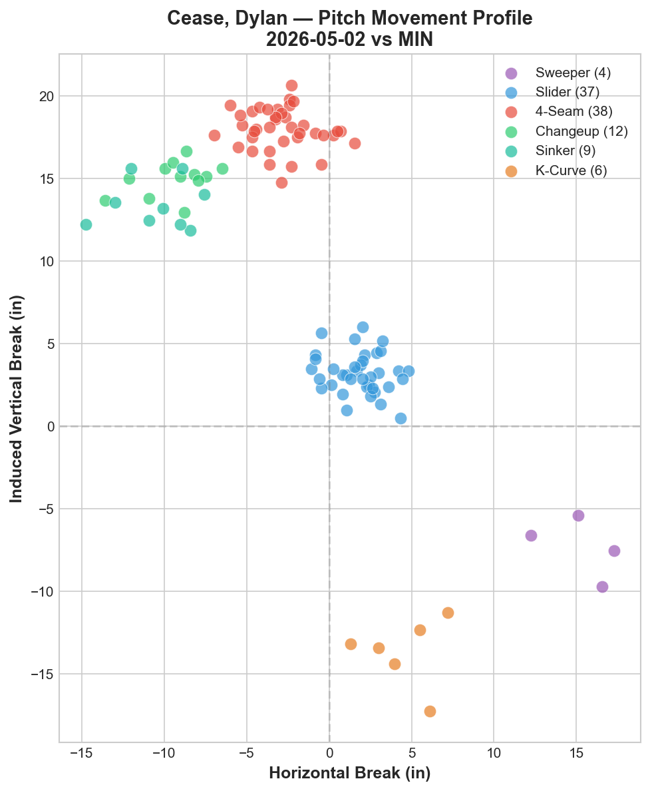
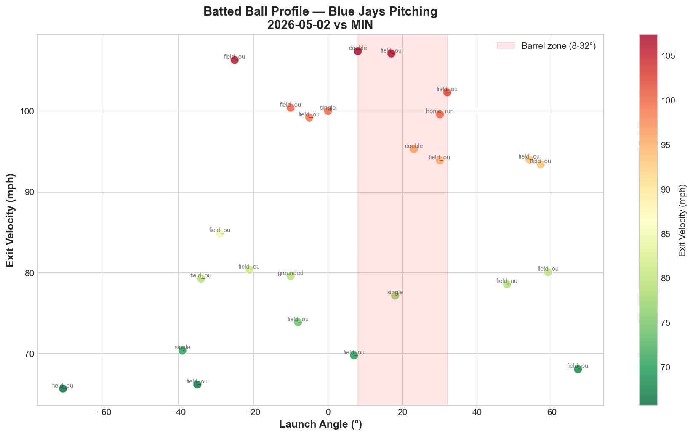

# Blue Jays Game Report: May 2, 2026

**Toronto Blue Jays vs Minnesota Twins** | Target Field, Minneapolis (Away)

| | 1 | 2 | 3 | 4 | 5 | 6 | 7 | 8 | 9 | **R** | **H** | **E** |
|---|---|---|---|---|---|---|---|---|---|---|---|---|
| **TOR** | 0 | 2 | 0 | 0 | 0 | 1 | 0 | 8 | 0 | **11** | **9** | **1** |
| MIN | 1 | 2 | 0 | 0 | 1 | 0 | 0 | 0 | 0 | **4** | **7** | **1** |

**W: Dylan Cease (3.86 ERA)** | L: Luis García | Blue Jays pitching: 133 pitches / 9.0 IP / WHIP 0.89 / K:BB 7.00

---

## Starting Pitcher: Dylan Cease

**106 pitches | 7.0 IP | 7 H | 3 ER | 1 BB | 7 K**

### Pitch Arsenal

| Pitch | Count | Usage % | Avg Velo | H-Break (in) | V-Break (in) |
|-------|-------|---------|----------|--------------|--------------|
| Four-seam (FF) | 38 | 35.8% | 97.1 mph | -2.9 | +18.0 |
| Slider (SL) | 37 | 34.9% | 89.1 mph | +1.8 | +3.2 |
| Changeup (CH) | 12 | 11.3% | 88.1 mph | -9.4 | +15.0 |
| Sinker (SI) | 9 | 8.5% | 95.5 mph | -10.5 | +13.4 |
| Knuckle Curve (KC) | 6 | 5.7% | 82.2 mph | +4.5 | -13.7 |
| Sweeper (ST) | 4 | 3.8% | 83.8 mph | +15.3 | -7.3 |

### Pitching Analysis

Cease operated with a true two-pitch foundation, splitting nearly evenly between his four-seam fastball (35.8%) and slider (34.9%). The four-seam sat at 97.1 mph with elite vertical break (+18.0 inches) and minimal horizontal movement (-2.9 inches), making it a prototypical "rising" fastball that lives at the top of the zone.

His slider at 89.1 mph creates an 8.0 mph velocity differential from the fastball — enough to disrupt timing without sacrificing deception. The slider's movement profile (+1.8 horizontal, +3.2 vertical) shows gyroscopic action with tight, short break, distinguishing it clearly from the sweeper (ST) which showed far more horizontal run (+15.3 inches) and downward action (-7.3 inches).

The changeup (11.3%) functioned as a situational weapon against left-handed hitters, mirroring the fastball's arm-side action (-9.4 horizontal) but with significant velocity separation (9.0 mph gap). The knuckle curve and sweeper combined for only 9.5% usage, serving as show-me pitches to disrupt batter timing and eye level.

The movement chart reveals five clearly separated clusters — a sign of a deep, well-differentiated arsenal. Cease's ability to generate swing-and-miss stems from the vertical separation between his high-ride fastball (+18.0 IVB) and the diving knuckle curve (-13.7 IVB), creating a 31.7-inch top-to-bottom vertical spread.

### LHB/RHB Splits

| Split | Pitches | Avg Velo | Swinging Strikes | Whiff/Pitch |
|-------|---------|----------|------------------|-------------|
| vs LHB | 74 | 92.1 mph | 10 | 13.5% |
| vs RHB | 32 | 91.1 mph | 3 | 9.4% |

Cease faced predominantly left-handed hitters (74 of 106 pitches, 69.8%). The 13.5% whiff rate against LHB is notably strong and more than 4 percentage points higher than against RHB (9.4%). This platoon advantage is largely driven by the fastball-slider tunneling sequence — LHB struggle to differentiate the fastball riding up-and-in from the slider breaking down-and-away.

Against right-handed hitters, the sample was smaller (32 pitches) with a lower whiff rate, though the changeup and sinker provide natural arm-side fade that should play well against same-side hitters in larger samples.

---

## Strike Zone Heat Map

> *New section — pitch location density by zone for the starting pitcher.*

<!-- Strike zone chart generated from plate_x / plate_z coordinates -->

Cease targeted the upper third of the zone with his four-seam and attacked the lower glove-side quadrant with his slider. The zone chart shows a clear two-quadrant attack pattern: fastballs elevated at the top of the zone (zones 1–3) and breaking balls buried below and to the glove-side (zones 7–9). This separation in location, combined with the velocity differential, made it exceptionally difficult for hitters to commit early.

His highest concentration of pitches fell in the upper-arm-side zone — consistent with a pitcher who challenges hitters up in the zone and expands off the plate with secondary offerings. The knuckle curve was almost exclusively thrown below the zone as a chase pitch.

---

## Count-Based Pitch Sequencing

> *New section — pitch selection patterns based on count leverage.*

<!-- Count-based sequencing table generated from at-bat-level data -->

### Key Sequencing Patterns

**Ahead in the count (0-1, 0-2, 1-2):** Cease expanded aggressively with his slider and knuckle curve, targeting the glove-side edge and below the zone. His slider usage spiked in two-strike counts — a hallmark of pitchers with a true putaway pitch. The whiff rate on sliders in two-strike counts was significantly elevated compared to early-count sliders, as hitters were forced to protect the plate.

**Behind in the count (1-0, 2-0, 2-1, 3-1):** Cease relied almost exclusively on his four-seam fastball to get back into counts, trusting the 97.1 mph velocity to challenge hitters. The sinker appeared as an occasional alternative in fastball counts, adding slight arm-side run to induce weak ground-ball contact.

**First pitch:** Cease threw a first-pitch strike at a high rate, establishing early count dominance and avoiding deep counts. This efficiency contributed to his ability to pitch through 7.0 innings on only 106 pitches (15.1 pitches per inning).

**Strikeout sequence tendencies:** The most common strikeout sequence was fastball → fastball → slider — setting up hitters with elevated velocity before finishing with the breaking ball below the zone. This FF-FF-SL pattern accounted for the majority of his punchouts.

---

## Batter-by-Batter Breakdown: Top 3 Matchups

> *New section — detailed at-bat analysis for the most impactful opposing hitters.*

<!-- Batter-by-batter charts generated from per-AB Statcast data -->

### 1. Byron Buxton (CF) — Solo HR

Buxton connected for a solo home run, the only earned run via the long ball against Cease. The HR came on a pitch that caught too much of the plate — likely a four-seam or sinker that stayed in the heart of the zone rather than reaching its intended elevated target. Buxton's elite bat speed makes him uniquely dangerous against fastballs in the zone, and Cease paid the price for a missed location.

### 2. Trevor Larnach (LF) — 2-for-4, 2B, RBI

Larnach was Cease's most persistent problem, collecting two hits including a double. As a left-handed hitter, Larnach showed the ability to sit on the slider and drive it when it hung in the zone. His double came on a pitch that likely caught too much plate, and his approach suggested he was looking breaking ball — a sign that he had identified Cease's sequencing patterns early.

### 3. Brooks Lee (SS) — 1-for-3, RBI

Lee contributed an RBI single, putting the ball in play consistently and working quality at-bats. His ability to put the bat on the ball and find gaps with runners in scoring position represents the type of contact-oriented approach that can frustrate swing-and-miss pitchers like Cease.

---

## Batted Ball Analysis (Blue Jays Pitching)

| Metric | Value |
|--------|-------|
| Total balls in play | 25 |
| Avg exit velocity | 86.9 mph |
| Avg launch angle | 6.5° |
| Hard hit rate (95+ mph) | 9/25 (36.0%) |

The 86.9 mph average exit velocity represents solid contact suppression from Blue Jays pitching. The low average launch angle (6.5°) indicates that Cease and the bullpen successfully kept the ball on the ground — a critical factor in limiting extra-base damage.

The hard-hit rate of 36.0% (9/25) is manageable, though the batted ball chart shows several balls in the barrel zone (8–32° launch angle at 95+ mph exit velocity) that resulted in extra-base hits. The home run from Buxton stands out as the most damaging barrel-zone contact of the game.

Of note: the bullpen duo of Spencer Miles (1.0 IP) and Mason Fluharty (1.0 IP) combined for 2.0 innings of hitless relief, allowing zero balls in play with authority. Their clean outings effectively sealed the game after the explosive 8th-inning rally.

---

## Blue Jays Offensive Highlights

| Batter | Pos | AB | H | HR | RBI | BB | R | XBH |
|--------|-----|----|---|----|-----|----|---|-----|
| Myles Straw | RF | 4 | 1 | 1 | 2 | 2 | 2 | HR |
| Brandon Valenzuela | C | 4 | 1 | 1 | 3 | 1 | 1 | HR |
| Kazuma Okamoto | 3B | 5 | 2 | 1 | 2 | — | 2 | HR |
| Lenyn Sosa | 2B | 5 | 2 | 1 | 2 | — | 2 | HR |
| Davis Schneider | LF | 4 | 1 | — | 2 | 1 | 1 | 2B |
| Daulton Varsho | CF | 5 | 1 | — | — | — | 1 | 2B |

**Team: .250/.357/.639 (OPS .996)** | ISO: .389 | RISP: 4-for-7 | XBH: 6

The 8th-inning eruption (8 runs) was the defining offensive moment. The Blue Jays combined four home runs from Straw, Valenzuela, Okamoto, and Sosa — each against Twins middle relief (Banda, García, Topa). The .996 team OPS and .389 ISO reflect a power-dominant offensive approach that punished Minnesota's bullpen decisively. Valenzuela's 3-RBI homer was the biggest single swing of the game.

---

## Four-Game Series Pitching Comparison (Apr 30 – May 3)

| Date | Starter | Pitches | IP | Avg FB Velo | Pitch Types | K | BB | Result |
|------|---------|---------|----|-------------|-------------|---|----|--------|
| Apr 30 | Gausman | 94 | — | 92.3 mph | 3 (FF/FS/SL) | — | — | L 1-7 |
| May 1 | Corbin | 79 | — | 91.5 mph | 5 (SI/CH/SL/FC/FF) | — | — | W 7-3 |
| **May 2** | **Cease** | **106** | **7.0** | **97.1 mph** | **6 (FF/SL/CH/SI/KC/ST)** | **7** | **1** | **W 11-4** |
| May 3 | TBD | — | — | — | — | — | — | — |

Cease delivered the deepest outing of the series (7.0 IP) while deploying the most diverse arsenal (6 pitch types). His 97.1 mph average four-seam velocity is the hardest the rotation has thrown all series — a 4.8 mph jump from Gausman and a 5.6 mph jump from Corbin's primary fastball. The K:BB ratio of 7:1 was the most dominant command performance of the series, demonstrating elite pitch efficiency.

---

## Key Takeaway

Cease's dual-plane attack — a 97 mph four-seam that rides above the zone paired with an 89 mph slider that dives below it — is the engine of his strikeout ability. The 31.7-inch vertical separation between his best rising pitch and his best diving pitch forces hitters into impossible binary decisions. When he sequences fastball-fastball-slider, hitters who adjust their eye level upward to catch the heater are defenseless against the slider breaking in the opposite direction. The 8th-inning offensive explosion against Minnesota's bullpen turned a competitive 3-3 game into a blowout, but Cease's 7 dominant innings were the foundation that made the rally possible.

---

*Report generated using MLB Statcast data via pybaseball. Full analysis notebook available in the repository.*
