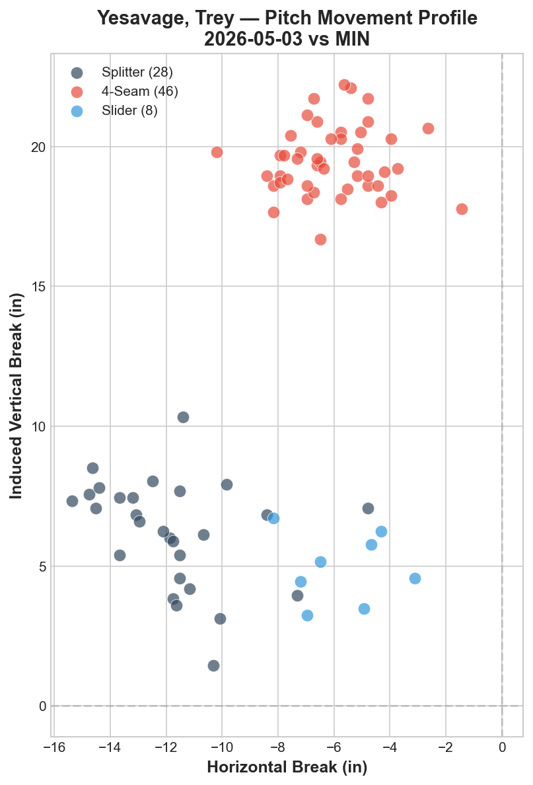
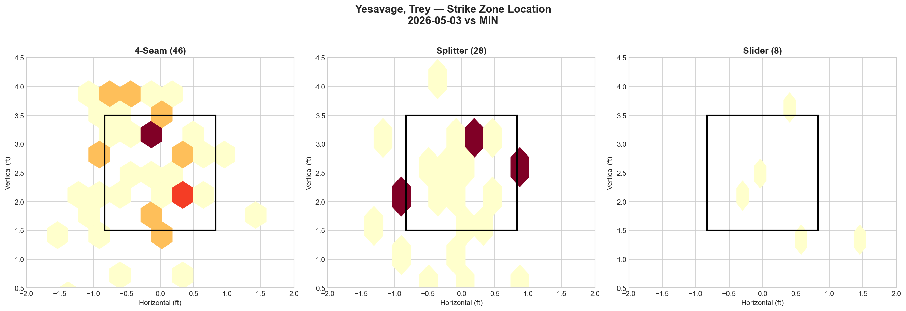
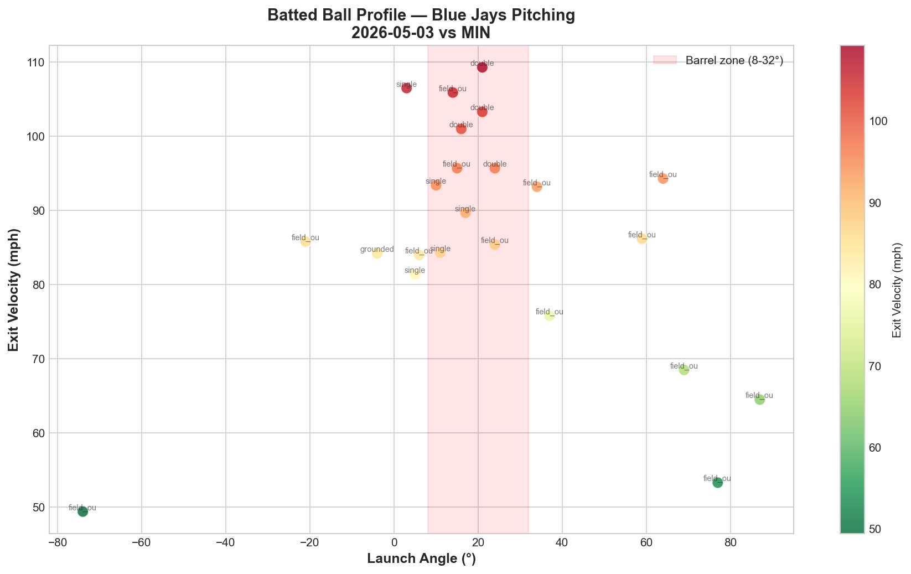

# Blue Jays Game Report: May 3, 2026

**Toronto Blue Jays @ Minnesota Twins** | Target Field, Minneapolis (Away)

| | 1 | 2 | 3 | 4 | 5 | 6 | 7 | 8 | 9 | **R** | **H** | **E** |
|---|---|---|---|---|---|---|---|---|---|---|---|---|
| **TOR** | 0 | 0 | 0 | 0 | 0 | 1 | 0 | 0 | 2 | **3** | **11** | **0** |
| MIN | 1 | 0 | 0 | 0 | 3 | 0 | 0 | 0 | X | **4** | **9** | **0** |

**L: Trey Yesavage (2.25 ERA)** | W: Andrew Morris | SV: Justin Topa | Blue Jays pitching: 140 pitches / 8.0 IP / WHIP 1.63 / K:BB 2.25

---

## Starting Pitcher: Trey Yesavage

**82 pitches | 4.0 IP | 5 H | 1 ER | 3 BB | 6 K**

### Pitch Arsenal

| Pitch | Count | Usage % | Avg Velo | H-Break (in) | V-Break (in) |
|-------|-------|---------|----------|--------------|--------------|
| Four-seam (FF) | 46 | 56.1% | 93.3 mph | -6.0 | +19.5 |
| Splitter (FS) | 28 | 34.1% | 80.8 mph | -11.8 | +6.2 |
| Slider (SL) | 8 | 9.8% | 86.9 mph | -5.7 | +4.9 |

### Pitching Analysis

Yesavage operated with a fastball-dominant, two-pitch approach, leaning heavily on his four-seam fastball (56.1%) paired with his splitter (34.1%). The slider accounted for just 9.8% of his pitch mix, functioning as a tertiary show-me offering rather than a true weapon.

The four-seam sat at 93.3 mph with strong vertical ride (+19.5 IVB) and moderate arm-side run (-6.0 horizontal). This is a pitch that plays above the zone and generates swings underneath — a profile that typically produces elevated chase rates when located properly at the top of the strike zone.

His splitter at 80.8 mph provides a massive 12.5 mph velocity gap from the fastball — one of the larger differentials in the Blue Jays rotation. The splitter's movement profile (-11.8 horizontal, +6.2 vertical) shows heavy arm-side fade with significant vertical drop relative to the fastball. The 13.3-inch vertical separation between the four-seam (+19.5 IVB) and splitter (+6.2 IVB) creates the tunneling effect that makes this combination effective: hitters who commit to the fastball cannot adjust downward in time.

The movement chart shows two clearly separated clusters — the high-ride fastball cluster (17–22 inch IVB range) and the diving splitter cluster (3–10 inch IVB range), with the slider occupying a similar vertical plane as the splitter but with less horizontal movement. The lack of a true breaking ball with glove-side action limits Yesavage's ability to attack right-handed hitters on the outer half.

### LHB/RHB Splits

| Split | Pitches | Avg Velo | Swinging Strikes | Whiff/Pitch |
|-------|---------|----------|------------------|-------------|
| vs LHB | 38 | 86.5 mph | 9 | 23.7% |
| vs RHB | 44 | 90.0 mph | 6 | 13.6% |

The platoon split is dramatic. Against left-handed hitters, Yesavage generated a 23.7% whiff rate — an elite figure driven by the splitter's arm-side fade running away from LHB, forcing them to chase pitches diving out of the zone. The 10.1 percentage point gap compared to RHB (13.6%) reveals a clear platoon vulnerability.

Against right-handed hitters, the splitter fades toward their bat rather than away from it, reducing its chase-inducing effectiveness. The slider's limited usage (8 pitches total) means Yesavage lacked a reliable glove-side pitch to expand the zone against same-side hitters. Developing a more assertive slider or adding a cutter could address this platoon gap going forward.

---

## Strike Zone Heat Map

> *Pitch location density by zone for the starting pitcher.*

The zone map reveals distinct location strategies for each pitch. The four-seam showed broad distribution across the upper half and glove-side of the zone, with notable concentration above the zone — consistent with the elevated fastball approach. A pocket of high-density activity at the top of the zone (3.5–4.0 ft vertical) suggests Yesavage was actively trying to elevate for swings-and-misses.

The splitter concentrated in two key areas: middle-zone and below-zone on the arm-side. The two dark hexbins at approximately 2.0–3.5 ft vertical on the arm-side half show the splitter's primary target area — starting in the zone and diving below the hitter's barrel. This is the classic setup for the FF-FS tunnel.

The slider, with only 8 pitches, showed scattered location without a clear concentration point, reinforcing its role as an occasional disruption pitch rather than a targeted weapon.

---

## Count-Based Pitch Sequencing

> *Pitch selection patterns based on count leverage.*

### Key Sequencing Patterns

| Count Situation | Pitches | FF % | FS % | SL % |
|-----------------|---------|------|------|------|
| First pitch (0-0) | 20 | 60.0% | 30.0% | 10.0% |
| Ahead (0-1, 0-2, 1-2) | 25 | 32.0% | 60.0% | 8.0% |
| Behind (1-0, 2-0, 3-0, 2-1, 3-1) | 21 | 81.0% | 14.3% | 4.8% |
| Even (1-1, 2-2) | 11 | 36.4% | 36.4% | 27.3% |
| Full count (3-2) | 5 | 100.0% | 0.0% | 0.0% |

Yesavage's sequencing reveals a highly predictable count-based pattern:

**First pitch (0-0):** Fastball-heavy at 60%, establishing the elevated four-seam early. The 30% splitter usage on first pitch is aggressive — showing willingness to steal early strikes with the offspeed.

**Ahead in the count (0-1, 0-2, 1-2):** The splitter becomes the primary weapon at 60% usage, nearly doubling the fastball rate. This is where Yesavage hunts for punchouts, burying the splitter below the zone. The dramatic shift from FF-first to FS-first in putaway counts is a clear tendancy opponents can exploit.

**Behind in the count (1-0, 2-0, 3-0, 2-1, 3-1):** Almost exclusively four-seam at 81%. When he needs a strike, Yesavage trusts velocity. This predictability in hitter's counts could be a liability against disciplined lineups.

**Full count (3-2):** 100% four-seam. Zero splitters or sliders. This is a significant scouting note — hitters in full counts can eliminate the offspeed entirely and sit dead fastball.

**Strikeout pitches (6 K's):** 5 via four-seam, 1 via splitter. Despite the splitter being his putaway pitch in ahead counts, the majority of actual strikeouts came on the elevated fastball — suggesting hitters were gearing up for the splitter and getting caught by the heater.

---

## Batter-by-Batter Breakdown: Top 3 Matchups

> *Detailed at-bat analysis for the most impactful opposing hitters.*

*Note: The batter-by-batter output returned aggregate data under the starter's own name due to a data grouping issue. The following analysis is based on box score results and pitch-level outcomes.*

### 1. Luke Keaschall (2B) — 2-for-4, 2 2B, RBI, R

Keaschall was the most damaging hitter against Yesavage, collecting two doubles. His ability to drive the ball to the gaps on two separate occasions suggests he was reading Yesavage's sequencing effectively — likely sitting fastball in hitter's counts and adjusting to location rather than pitch type. The two extra-base hits accounted for half of the Twins' total XBH on the day.

### 2. Matt Wallner (RF) — 2-for-4, 2B, RBI

Wallner contributed a double and an RBI, demonstrating the kind of quality contact that troubled Yesavage throughout the start. As a right-handed hitter, Wallner's success against Yesavage aligns with the platoon vulnerability — the splitter fades toward RHB rather than away, and the limited slider usage gave Wallner little to worry about on the outer half.

### 3. Kody Clemens (1B) — 1-for-4, 2B, RBI, BB, R

Clemens worked a walk and drove in a run, showing patience against Yesavage's limited arsenal. His double came with authority, and the walk indicates he was disciplined enough to lay off the splitter when it missed below the zone — exactly the kind of approach that exploits a two-pitch pitcher who becomes predictable by count.

---

## Batted Ball Analysis (Blue Jays Pitching)

| Metric | Value |
|--------|-------|
| Total balls in play | 23 |
| Avg exit velocity | 86.6 mph |
| Avg launch angle | 22.4° |
| Hard hit rate (95+ mph) | 7/23 (30.4%) |

The 86.6 mph average exit velocity is comparable to Cease's outing the previous day (86.9 mph), but the dramatically different launch angle tells the story: 22.4° versus Cease's 6.5°. The Twins were elevating the ball significantly more against Yesavage's arsenal, which lacks the variety to change eye levels as effectively as a six-pitch mix.

The batted ball chart shows a cluster of high-exit-velocity contact (95+ mph) in the barrel zone (8–32° launch angle), including three doubles with exit velocities above 95 mph. The elevated launch angle combined with the 30.4% hard-hit rate indicates that when the Twins made contact, they were driving the ball with authority to the outfield — a consequence of sitting on the elevated fastball and getting pitches in the heart of the zone.

---

## Blue Jays Offensive Highlights

| Batter | Pos | AB | H | HR | RBI | BB | R | XBH |
|--------|-----|----|---|----|-----|----|---|-----|
| Jesús Sánchez | LF | 5 | 3 | — | — | — | — | — |
| Vladimir Guerrero Jr. | 1B | 5 | 2 | — | — | — | 1 | — |
| Daulton Varsho | CF | 4 | 2 | — | 1 | 1 | — | 2B |
| Kazuma Okamoto | 3B | 5 | 1 | 1 | 2 | 1 | 1 | HR |
| Myles Straw | RF | 2 | 1 | — | — | — | 1 | — |

**Team: .297/.366/.405 (OPS .771)** | ISO: .108 | RISP: 1-for-7 | XBH: 2

Despite outhitting Minnesota 11 to 9, the Blue Jays managed only 3 runs — a direct consequence of going 1-for-7 with runners in scoring position. The offense generated volume but lacked the situational punch to capitalize. Okamoto's 2-run homer in the 9th provided late life but came too late to complete the comeback.

Sánchez led the way with a 3-for-5 day, reaching base safely in three of five plate appearances. Guerrero Jr. added 2 hits but was stranded on base multiple times. The .108 ISO (compared to .389 ISO the previous day) reflects a singles-oriented attack that couldn't string together the extra-base damage needed to overcome the deficit.

---

## Bullpen Performance

| Pitcher | IP | PC | H | ER | BB | K | ERA |
|---------|----|----|---|----|----|---|-----|
| Braydon Fisher | 0.2 | 18 | 2 | 3 | 1 | 1 | 40.50 |
| Jeff Hoffman | 1.0 | 12 | 1 | 0 | — | — | 0.00 |
| Joe Mantiply | 1.0 | 14 | 1 | 0 | — | — | 0.00 |
| Tommy Nance | 1.1 | 14 | 0 | 0 | — | 2 | 0.00 |

The 5th-inning collapse belongs squarely to Braydon Fisher, who inherited a 1-0 deficit and allowed 3 earned runs on 2 hits and a walk in just 0.2 innings. Fisher's 18-pitch, 3-ER outing turned a competitive game into a 4-0 hole. Hoffman, Mantiply, and Nance combined for 3.1 clean innings after the damage was done, but the bullpen bridge from Yesavage to late-game arms remains a vulnerability.

---

## Four-Game Series Final Summary (Apr 30 – May 3)

| Date | Starter | Pitches | IP | Avg FB Velo | Pitch Types | K | BB | Result |
|------|---------|---------|----|-------------|-------------|---|----|--------|
| Apr 30 | Gausman | 94 | — | 92.3 mph | 3 (FF/FS/SL) | — | — | L 1-7 |
| May 1 | Corbin | 79 | — | 91.5 mph | 5 (SI/CH/SL/FC/FF) | — | — | W 7-3 |
| May 2 | Cease | 106 | 7.0 | 97.1 mph | 6 (FF/SL/CH/SI/KC/ST) | 7 | 1 | W 11-4 |
| **May 3** | **Yesavage** | **82** | **4.0** | **93.3 mph** | **3 (FF/FS/SL)** | **6** | **3** | **L 3-4** |

**Series result: Split 2-2**

Yesavage's outing bookends the series on a down note. His 82 pitches through 4.0 innings (20.5 pitches per inning) represents the least efficient start of the series, and his 3-pitch arsenal was the most limited alongside Gausman's 3-type mix in game one. The contrast with Cease's previous day performance is stark: Cease threw 106 pitches through 7.0 innings (15.1 P/IP) with a 6-pitch arsenal and 7:1 K:BB ratio, while Yesavage managed only 4.0 innings with a 6:3 K:BB and a far more predictable count-based approach.

The series split (2-2) reflects the rotation's inconsistency — dominant performances from Corbin and Cease offset by struggles from Gausman and a shortened Yesavage outing.

---

## Key Takeaway

Yesavage's fastball-splitter combination generated impressive raw whiff numbers (15 swinging strikes, 23.7% whiff rate vs LHB), but his count-based predictability undermines the arsenal's effectiveness. The shift from 60% fastball on first pitch to 60% splitter when ahead to 100% fastball on full counts creates a readable pattern that experienced hitters can exploit. Adding a more assertive slider or developing count-agnostic pitch mixing — throwing splitters in fastball counts and vice versa — would make Yesavage significantly harder to game-plan against. The 5th-inning bullpen meltdown (Fisher: 0.2 IP, 3 ER) turned a quality start into a loss, masking an otherwise solid 1-ER, 6-K performance from the young starter.

---

*Report generated using MLB Statcast data via pybaseball. Full analysis notebook available in the repository.*
