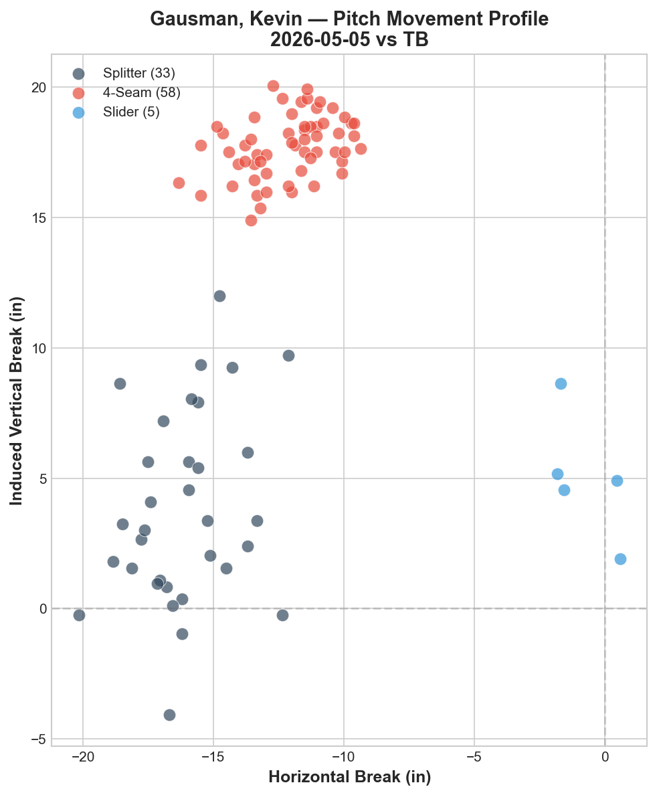
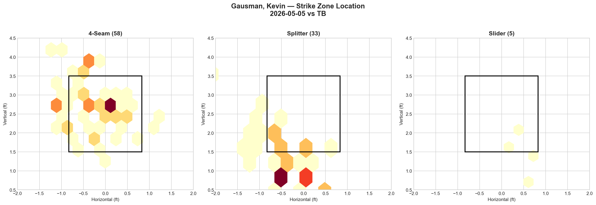
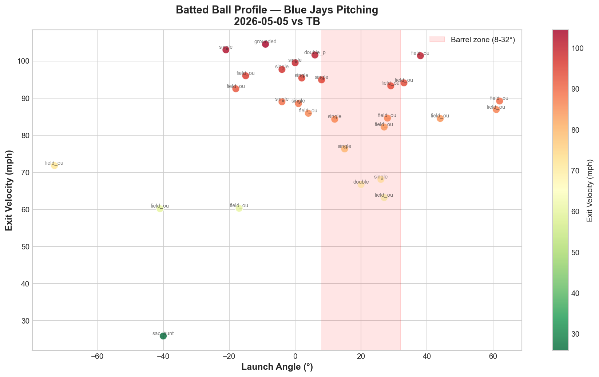

# Blue Jays Game Report: May 5, 2026

**Toronto Blue Jays @ Tampa Bay Rays** | Tropicana Field, St. Petersburg (Away)

| | 1 | 2 | 3 | 4 | 5 | 6 | 7 | 8 | 9 | **R** | **H** | **E** |
|---|---|---|---|---|---|---|---|---|---|---|---|---|
| **TOR** | 1 | 1 | 0 | 0 | 1 | 0 | 0 | 0 | 0 | **3** | **8** | **1** |
| TB | 0 | 0 | 1 | 1 | 0 | 0 | 0 | 2 | X | **4** | **11** | **0** |

**L: Tyler Rogers (54.00 ERA)** | W: Casey Legumina | SV: Cole Sulser | Blue Jays pitching: 142 pitches / 8.0 IP / WHIP 1.50 / K:BB 5.00

---

## Starting Pitcher: Kevin Gausman

**96 pitches | 6.0 IP | 6 H | 2 ER | 1 BB | 3 K**

### Pitch Arsenal

| Pitch | Count | Usage % | Avg Velo | H-Break (in) | V-Break (in) |
|-------|-------|---------|----------|--------------|--------------|
| Four-seam (FF) | 58 | 60.4% | 94.4 mph | -12.2 | +17.7 |
| Splitter (FS) | 33 | 34.4% | 83.8 mph | -16.1 | +3.8 |
| Slider (SL) | 5 | 5.2% | 85.3 mph | -0.8 | +5.0 |

### Pitching Analysis

Gausman's approach is the purest fastball-splitter combination in the Blue Jays rotation — a two-pitch foundation that accounted for 94.8% of all pitches thrown. The four-seam (60.4%) and splitter (34.4%) operated as a vertical tunneling pair, with the slider (5.2%) serving as an occasional disruptor.

The four-seam at 94.4 mph is a significant velocity upgrade from his April 30 start against Minnesota (92.3 mph), suggesting improved arm health or adjustments in his delivery. The movement profile (-12.2 horizontal, +17.7 IVB) shows heavy arm-side run with strong vertical ride — a pitch designed to live on the glove side of the plate against right-handed hitters and bore inside against lefties.

The splitter at 83.8 mph creates a 10.6 mph velocity gap from the fastball — the largest primary-secondary differential in the rotation. The splitter's movement (-16.1 horizontal, +3.8 vertical) shares the same arm-side direction as the fastball but with dramatically less vertical carry, creating a 13.9-inch vertical separation. This tunneling is the engine of Gausman's swing-and-miss: the fastball rides up while the splitter falls out of the zone on a similar trajectory until the last moment.

The movement chart shows the splitter cluster spanning a wide vertical range (from -4 to +12 IVB), indicating significant pitch-to-pitch variability. The tighter the splitter clusters near the 0–5 IVB range, the more effective it is as a chase pitch. The outliers with higher vertical break resemble "firm changeups" more than true splitters, potentially reducing deception.

### LHB/RHB Splits

| Split | Pitches | Avg Velo | Swinging Strikes | Whiff/Pitch |
|-------|---------|----------|------------------|-------------|
| vs LHB | 57 | 90.5 mph | 7 | 12.3% |
| vs RHB | 39 | 90.0 mph | 3 | 7.7% |

Gausman faced a lefty-heavy lineup (57 of 96 pitches, 59.4%). The 12.3% whiff rate against LHB is moderate — solid but not dominant — while the 7.7% rate against RHB is below average for a pitcher of his caliber. The platoon gap (4.6 percentage points) is narrower than Yesavage's (10.1 pp) or Lauer's (20.6 pp), reflecting the splitter's ability to generate chase regardless of batter handedness due to its arm-side-and-down action.

The key concern is the total whiff picture: 10 swinging strikes on 96 pitches (10.4% overall) is a below-average swing-and-miss rate for a starter with Gausman's stuff. The 3-strikeout, 6-inning line suggests hitters were able to make contact, even if some of it was weak.

---

## Strike Zone Heat Map

> *Pitch location density by zone for the starting pitcher.*

The four-seam heat map shows concentration in two zones: the arm-side middle of the plate (around -0.5 to 0.0 horizontal, 2.5–3.0 ft vertical) and elevated above the zone on the glove side. Gausman was working the middle-to-arm-side quadrant — consistent with a pitcher who uses natural arm-side run to move the fastball from the center of the plate toward the corner.

The splitter location map is particularly revealing. There are two distinct clusters: one in the lower zone (around 2.0 ft vertical) and one well below the zone (around 1.0 ft). The below-zone cluster represents the chase splitter — the pitch designed to fall off the table and generate empty swings. The in-zone cluster represents a more competitive splitter that Gausman throws for called strikes early in counts.

The slider showed minimal presence in the zone chart (5 pitches), with scattered locations that don't suggest a targeted approach.

---

## Count-Based Pitch Sequencing

> *Pitch selection patterns based on count leverage.*

### Key Sequencing Patterns

| Count Situation | Pitches | FF % | FS % | SL % |
|-----------------|---------|------|------|------|
| First pitch (0-0) | 24 | 79.2% | 16.7% | 4.2% |
| Ahead (0-1, 0-2, 1-2) | 29 | 48.3% | 48.3% | 3.4% |
| Behind (1-0, 2-0, 3-0, 2-1, 3-1) | 21 | 57.1% | 33.3% | 9.5% |
| Even (1-1, 2-2) | 15 | 46.7% | 46.7% | 6.7% |
| Full count (3-2) | 7 | 85.7% | 14.3% | — |

Gausman's sequencing shares a structural similarity with Yesavage — both rely on a fastball-offspeed binary that shifts predictably by count. However, Gausman's pattern is less extreme:

**First pitch (0-0):** Gausman is heavily fastball-first at 79.2%, significantly higher than his overall 60.4% usage. This telegraphs his approach — opposing hitters can sit fastball on the first pitch with high confidence.

**Ahead in the count:** The split becomes perfectly even at 48.3% FF / 48.3% FS. This is where Gausman is most dangerous — when hitters can't predict which of the two pitches is coming, the tunneling effect is maximized. The near-equal distribution keeps hitters honest.

**Behind in the count:** Fastball rises to 57.1% but the splitter stays relevant at 33.3%. This is notably better than Yesavage's approach (81% FF when behind), showing more willingness to throw offspeed in hitter's counts.

**Full count (3-2):** The fastball dominates at 85.7% with only one splitter thrown. Similar to Yesavage, Gausman defaults to his heater when the at-bat is on the line — a pattern hitters can exploit.

**Strikeout pitches (3 K's):** 2 via splitter, 1 via four-seam. The splitter is the true putaway weapon, despite the fastball being the higher-volume pitch.

---

## Batter-by-Batter Breakdown: Top 3 Matchups

> *Detailed at-bat analysis for the most impactful opposing hitters.*

### 1. Yandy Díaz (1B) — 0-for-4, 3 Field Outs (16 pitches)

Díaz saw the most pitches of any Rays hitter (16) but went hitless, making Gausman's approach against him a clear success story. Gausman attacked him with a fastball-heavy mix (11 FF, 3 FS, 2 SL), generating 2 whiffs and 3 called strikes. Díaz's 77.1 mph average exit velocity suggests he was consistently off-balance and unable to square the ball up. Three at-bats, three field outs — Gausman dominated this matchup through elevated fastballs that Díaz could only get on top of.

### 2. Ben Williamson (2B) — 1-for-3, Single, K, RBI (14 pitches)

Williamson saw a splitter-heavy approach (7 FS, 6 FF, 1 SL) — a deliberate shift from the Díaz matchup. He struck out once and collected a single, with 4 fouls indicating competitive at-bats. The 84.2 mph average exit velocity was moderate. Gausman's willingness to go splitter-first against Williamson suggests a scouting report that identified him as a fastball-focused hitter, and the strategy partially worked (1 K) even though Williamson adapted for a single and an RBI.

### 3. Hunter Feduccia (C) — 0-for-2, GIDP + Field Out (13 pitches)

Feduccia faced a pure fastball-splitter diet (8 FF, 5 FS) with zero sliders. Despite seeing 13 pitches across two plate appearances, he produced zero offensive value — grounding into a double play and recording a field out. His 81.5 mph average exit velocity confirms weak contact. The GIDP is particularly damaging from a lineup perspective, erasing a baserunner and providing Gausman a cost-free out. This matchup showcased the splitter at its best: inducing ground-ball contact on pitches that started in the zone and dove below the barrel.

---

## Batted Ball Analysis (Blue Jays Pitching)

| Metric | Value |
|--------|-------|
| Total balls in play | 29 |
| Avg exit velocity | 84.2 mph |
| Avg launch angle | 6.9° |
| Hard hit rate (95+ mph) | 8/29 (27.6%) |

A significant improvement from the previous game's alarming 91.9 mph / 53.6% hard-hit profile. The 84.2 mph average exit velocity is the lowest of the Tampa Bay series and represents genuine contact suppression from Gausman and the bullpen. The 27.6% hard-hit rate (8/29) is manageable and well below league average.

The batted ball chart shows a wide spread across launch angles, with fewer dangerous barrel-zone contacts compared to the Lauer start. There are still a handful of 95+ mph batted balls in the barrel zone (resulting in singles and a double), but the majority of contact clustered at lower exit velocities (70–90 mph range) — evidence that the splitter was successfully inducing off-center contact.

One notable outlier: a sac bunt at approximately -35° launch angle and 28 mph exit velocity, reflecting Tampa Bay's willingness to play small ball in this series.

---

## Blue Jays Offensive Highlights

| Batter | Pos | AB | H | HR | RBI | BB | R | XBH |
|--------|-----|----|---|----|-----|----|---|-----|
| Kazuma Okamoto | 3B | 4 | 2 | 1 | 1 | — | 1 | HR |
| Andrés Giménez | SS | 4 | 2 | — | 1 | — | 1 | — |
| Daulton Varsho | CF | 4 | 1 | — | — | — | 1 | — |
| Yohendrick Piñango | LF | 4 | 1 | — | 1 | — | — | — |
| Ernie Clement | 2B | 4 | 1 | — | — | — | — | — |

**Team: .235/.297/.324 (OPS .621)** | ISO: .089 | RISP: 2-for-6 | XBH: 1

The Blue Jays showed marginal improvement in RISP hitting (2-for-6 vs 1-for-8 yesterday) but continued to struggle offensively. Okamoto provided the only extra-base hit with a solo home run, continuing his strong series. The .621 OPS is essentially identical to yesterday's .622 — the offense remains stuck in a low-production pattern.

Springer's 0-for-5 day was the most costly in the lineup, as the DH slot produced nothing despite 5 plate appearances. Sánchez also went hitless (0-for-4), and Guerrero Jr. was limited to a single at-bat.

---

## Bullpen Performance

| Pitcher | IP | PC | H | ER | BB | K | Result |
|---------|----|----|---|----|----|---|--------|
| Jeff Hoffman | 1.0 | 17 | 1 | 0 | — | 1 | Hold |
| Tyler Rogers | 0.1 | 22 | 4 | 2 | — | — | **Loss (54.00 ERA)** |
| Louis Varland | 0.2 | 7 | 0 | 0 | — | 1 | — |

The 8th-inning meltdown belongs to Tyler Rogers, who allowed 4 hits and 2 earned runs in just 0.1 innings (22 pitches). Rogers' inability to record more than one out turned a 3-2 Blue Jays deficit into a 4-2 hole and effectively ended the game. This is the second consecutive game where a bullpen arm (Fisher on May 3, Miles on May 4, Rogers today) has surrendered the deciding runs in a one-run margin.

Hoffman delivered a clean 7th inning (1 IP, 1 H, 1 K), maintaining his status as the most reliable high-leverage arm. Varland cleaned up Rogers' mess with a scoreless 0.2 IP.

---

## Two-Game Series Pitching Comparison (May 4–5 vs TB)

| Date | Starter | Pitches | IP | Avg FB Velo | Pitch Types | K | BB | Result |
|------|---------|---------|----|-------------|-------------|---|----|--------|
| May 4 | Lauer | 61 | 4.1 | 90.3 mph | 5 (FF/FC/SL/CH/CU) | 2 | 1 | L 1-5 |
| **May 5** | **Gausman** | **96** | **6.0** | **94.4 mph** | **3 (FF/FS/SL)** | **3** | **1** | **L 3-4** |
| May 6 | TBD | — | — | — | — | — | — | — |

Gausman provided a more competitive outing than Lauer across every metric: deeper into the game (6.0 vs 4.1 IP), more efficient (16.0 vs 14.0 P/IP), better fastball velocity (+4.1 mph), and a dramatically better batted ball profile (84.2 vs 91.9 mph avg EV, 27.6% vs 53.6% hard-hit rate). The loss was not on Gausman — his 2-ER, 6-inning line is a quality outing. The game was lost in the bullpen (Rogers: 0.1 IP, 4 H, 2 ER) and by an offense that managed only 3 runs on 8 hits.

---

## Key Takeaway

Gausman delivered a legitimate quality start — 6 IP, 2 ER, with the splitter generating weak contact and the fastball reaching 94.4 mph. The vertical tunnel between his four-seam (+17.7 IVB) and splitter (+3.8 IVB) created the 13.9-inch separation that is the foundation of his approach. However, the 10.4% overall whiff rate and only 3 strikeouts suggest the Rays were able to make contact, even if it was largely weak. The story of this game — and increasingly of this road trip — is the bullpen bridge. Three consecutive losses have featured a bullpen arm surrendering decisive runs in high-leverage situations (Fisher May 3, Miles May 4, Rogers May 5). Until the late-inning bridge stabilizes, Gausman and the rotation's competitive starts will continue to be wasted.

---

*Report generated using MLB Statcast data via pybaseball. Full analysis notebook available in the repository.*
