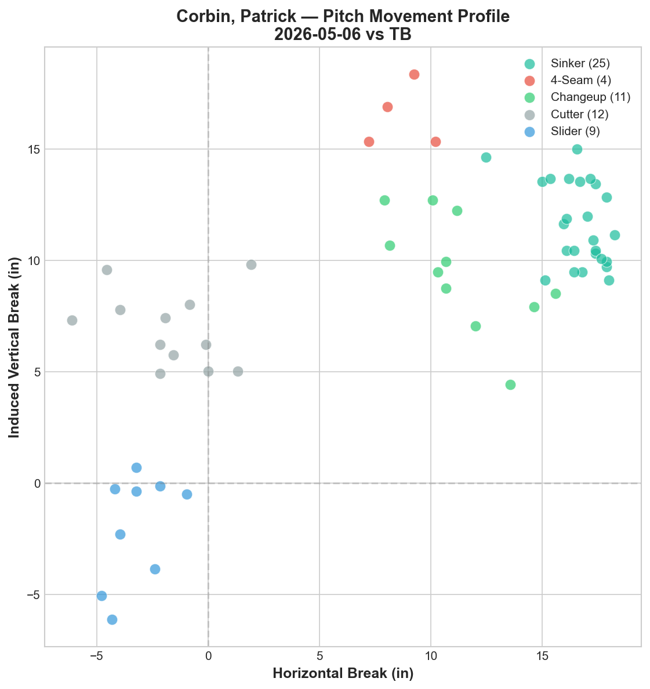
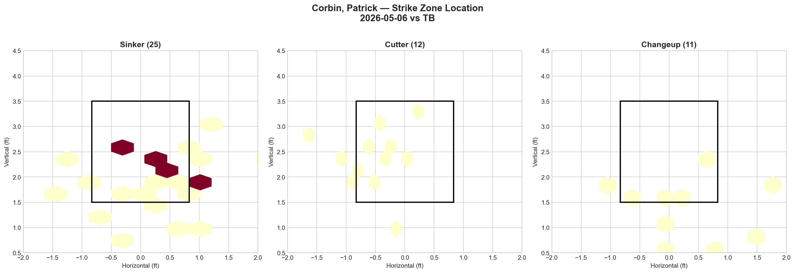
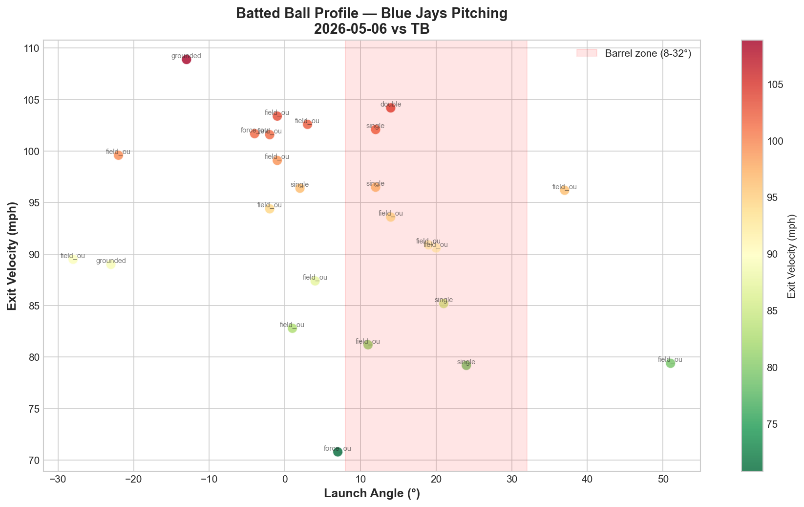

# Blue Jays Game Report: May 6, 2026

**Toronto Blue Jays @ Tampa Bay Rays** | Tropicana Field, St. Petersburg (Away)

| | 1 | 2 | 3 | 4 | 5 | 6 | 7 | 8 | 9 | **R** | **H** | **E** |
|---|---|---|---|---|---|---|---|---|---|---|---|---|
| **TOR** | 0 | 0 | 0 | 0 | 0 | 0 | 0 | 0 | 0 | **0** | **4** | **1** |
| TB | 0 | 0 | 0 | 0 | 0 | 2 | 0 | 1 | X | **3** | **9** | **0** |

**L: Patrick Corbin (1-1)** | W: Shane McClanahan (4-2) | SV: Ian Seymour (1) | Blue Jays pitching: 121 pitches / 8.0 IP

---

## Starting Pitcher: Patrick Corbin

**61 pitches | 5.0 IP | 4 H | 0 ER | 2 BB | 1 K**

### Pitch Arsenal

| Pitch | Count | Usage % | Avg Velo | H-Break (in) | V-Break (in) |
|-------|-------|---------|----------|--------------|--------------|
| Sinker (SI) | 25 | 41.0% | 90.6 mph | +16.7 | +11.6 |
| Cutter (FC) | 12 | 19.7% | 86.4 mph | -1.7 | +6.9 |
| Changeup (CH) | 11 | 18.0% | 77.0 mph | +11.3 | +9.5 |
| Slider (SL) | 9 | 14.8% | 76.5 mph | -3.3 | -2.0 |
| Four-seam (FF) | 4 | 6.6% | 90.5 mph | +8.7 | +16.5 |

### Pitching Analysis

Corbin operated as a sinker-first left-hander, leaning on his sinker for 41.0% of all pitches — a ground-ball-oriented approach fundamentally different from the fastball-splitter profiles of Gausman and Yesavage. The sinker at 90.6 mph showed heavy arm-side run (+16.7 horizontal) with moderate vertical drop (+11.6 IVB), a pitch designed to bore inside on right-handed hitters and induce ground balls.

The movement chart reveals five clearly separated clusters, giving Corbin the most diverse pitch shapes in recent rotation starts. The sinker cluster sits in the upper-right quadrant (high arm-side run, moderate vertical), while the slider occupies the only below-zero vertical territory (-2.0 IVB) — creating a 13.6-inch vertical spread from sinker to slider. The cutter bridges the gap between the fastball family and breaking balls, sitting near the center of the movement chart (-1.7 horizontal, +6.9 vertical) with minimal horizontal movement.

The changeup at 77.0 mph provides a 13.6 mph velocity gap from the sinker — an enormous differential. Its movement profile (+11.3 horizontal, +9.5 vertical) mirrors the sinker's arm-side direction but with less vertical carry, creating the classic "same tunnel, different destination" effect against right-handed batters. However, the similar horizontal break between sinker (+16.7) and changeup (+11.3) means both pitches fade to the arm side, potentially making the combination less deceptive than a pairing with opposite-direction movement.

The four-seam appeared only 4 times (6.6%), serving as an occasional elevated fastball to disrupt eye level. Its +16.5 IVB provides the highest vertical ride in the arsenal, contrasting with the sinker's ground-ball action.

### LHB/RHB Splits

| Split | Pitches | Avg Velo | Swinging Strikes | Whiff/Pitch |
|-------|---------|----------|------------------|-------------|
| vs LHB | 12 | 85.7 mph | 0 | 0.0% |
| vs RHB | 49 | 85.1 mph | 2 | 4.1% |

The whiff numbers are alarmingly low across the board. Zero swinging strikes against left-handed hitters (12 pitches) and only 2 against right-handed hitters (49 pitches) for a 4.1% whiff rate. The overall whiff rate of 3.3% (2/61) is the lowest of any Blue Jays starter this road trip and among the lowest in any single start this season.

Despite the minimal swing-and-miss, Corbin delivered 5 scoreless innings on only 61 pitches (12.2 P/IP) — the most efficient outing of the series. This reflects a pitch-to-contact philosophy: inducing weak contact and ground balls rather than chasing punchouts. The 1 strikeout in 5 innings is not sustainable at the MLB level, but for this particular outing, the approach worked through 5 frames.

---

## Strike Zone Heat Map

> *Pitch location density by zone for the starting pitcher.*

The sinker heat map shows heavy concentration in the lower-to-middle zone (1.5–2.5 ft vertical), centered between -0.5 and +0.5 horizontal. This is textbook sinker location — keeping the ball down in the zone to generate ground balls. The dark hexbins at approximately 2.0–2.5 ft vertical suggest Corbin found his target area consistently.

The cutter scattered across the glove side of the zone (left side for a left-handed pitcher), targeting the back hip of right-handed hitters. The low density suggests Corbin was using the cutter situationally rather than as a primary weapon.

The changeup showed diffuse distribution across the lower half, with some pitches landing below the zone — the intended chase location. However, the lack of concentrated density suggests command inconsistency with the offspeed.

---

## Count-Based Pitch Sequencing

> *Pitch selection patterns based on count leverage.*

### Key Sequencing Patterns

| Count Situation | Pitches | SI % | SL % | CH % | FC % | FF % |
|-----------------|---------|------|------|------|------|------|
| First pitch (0-0) | 22 | 40.9% | 27.3% | 13.6% | 13.6% | 4.5% |
| Ahead (0-1, 0-2, 1-2) | 12 | 25.0% | — | 41.7% | 16.7% | 16.7% |
| Behind (1-0, 2-0, 3-0, 2-1, 3-1) | 19 | 42.1% | 10.5% | 10.5% | 31.6% | 5.3% |
| Even (1-1, 2-2) | 7 | 57.1% | 14.3% | 14.3% | 14.3% | — |
| Full count (3-2) | 1 | 100.0% | — | — | — | — |

Corbin's sequencing is uniquely slider-heavy on first pitches compared to every other starter analyzed this series:

**First pitch (0-0):** The slider appears at a striking 27.3% — the highest first-pitch breaking ball rate of any Blue Jays starter this road trip. Combined with the sinker at 40.9%, Corbin uses the first pitch to establish either ground-ball contact (sinker) or early called strikes from the glove side (slider). This unpredictability on the first pitch is a strength.

**Ahead in the count:** The changeup becomes the go-to weapon at 41.7%, taking over from the sinker as the primary offering. This is a deliberate shift — Corbin uses the velocity gap (77 mph changeup vs 90.6 mph sinker) to get hitters to chase when ahead. The slider disappears entirely in ahead counts, replaced by the four-seam (16.7%) as the occasional elevated pitch to change eye level.

**Behind in the count:** The sinker (42.1%) and cutter (31.6%) dominate, combining for 73.7% of pitches. This is a contact-seeking approach — both pitches induce ground balls at the top of the zone rather than trying to overpower with velocity.

**Strikeout pitch (1 K):** The lone strikeout came on a four-seam fastball — suggesting that even in Corbin's limited K opportunities, the elevated fastball is the swing-and-miss generator, not the breaking balls.

---

## Batter-by-Batter Breakdown: Top 3 Matchups

> *Detailed at-bat analysis for the most impactful opposing hitters.*

### 1. Ryan Vilade (RF) — 0-for-2, Walk, 2 Field Outs (10 pitches)

Vilade saw the highest pitch count against Corbin (10) but was held hitless. Corbin attacked him with a diverse mix (4 SI, 2 FC, 2 CH, 1 FF, 1 SL), keeping him off-balance. Vilade's 88.8 mph average exit velocity and zero whiffs suggest he was making contact, but Corbin's sinker-heavy approach directed the contact to ground balls. The walk indicates Vilade was disciplined enough to lay off borderline pitches, but Corbin limited the damage.

### 2. Jonathan Aranda (1B) — 0-for-1, Walk, HBP (8 pitches)

Aranda reached base twice without recording a hit — via a walk and a hit-by-pitch. His at-bats against Corbin generated zero whiffs on a sinker-heavy diet (4 SI, 2 FF, 2 SL), with 5 balls indicating command issues from Corbin in this matchup. The 102.6 mph average exit velocity on his one ball in play is the highest of any Rays hitter — a warning sign that when Aranda does connect, the contact is authoritative. Corbin escaped without damage, but the underlying quality of contact suggests Aranda had Corbin's timing.

### 3. Junior Caminero (3B) — 0-for-3, K, Field Out, GIDP (8 pitches)

Caminero was the one matchup Corbin clearly won. A strikeout, a field out, and a ground-ball double play in three plate appearances — exactly the kind of contact suppression a sinker-baller needs. Corbin used all five pitch types against him (3 SI, 2 CH, 1 FF, 1 SL, 1 FC), preventing Caminero from establishing timing on any single pitch. The GIDP was particularly valuable, erasing a baserunner and providing a cost-free inning exit.

---

## Batted Ball Analysis (Blue Jays Pitching)

| Metric | Value |
|--------|-------|
| Total balls in play | 25 |
| Avg exit velocity | 93.1 mph |
| Avg launch angle | 6.2° |
| Hard hit rate (95+ mph) | 12/25 (48.0%) |

The batted ball profile tells a contradictory story. The 93.1 mph average exit velocity is the second-highest of the Tampa Bay series (behind Lauer's 91.9) and the 48.0% hard-hit rate is dangerously high. However, the 6.2° average launch angle — the lowest of the series — indicates that the contact was predominantly on the ground, which is exactly what a sinker-oriented approach produces.

The chart shows a cluster of high-velocity contact (100+ mph) in both the barrel zone and at negative launch angles. Multiple batted balls exceeded 100 mph exit velocity but were hit on the ground (-10° to -20° launch angle), resulting in ground outs and a grounded into double play rather than extra-base hits. This is the sinker doing its job — hitters are squaring the ball up but hitting it into the dirt.

The concerning data point: within the barrel zone (8-32°), there are several 95+ mph contacts that produced singles and a double. As the game progressed beyond Corbin's 5 innings, the Rays began elevating their launch angles, resulting in the 6th and 8th inning runs.

---

## Blue Jays Offensive Highlights

**Team: .111/.167/.111 (OPS .278)** | 4 H | 0 XBH | RISP: 0-for-3

The Blue Jays were shut out for the first time this road trip, managing only 4 hits against Shane McClanahan and four Rays relievers. McClanahan extended his scoreless streak to 16.2 innings, yielding just 2 hits over 5.2 innings with 4 strikeouts. The .278 team OPS is the lowest of the season for the Blue Jays and represents a complete offensive shutdown.

The RISP drought continued at 0-for-3, capping a dismal road trip trend: 1-for-8, 1-for-7, 2-for-6, 1-for-8, 0-for-3 across the five most recent games. The only run production during the Tampa Bay series came from solo shots and small-ball singles — the lineup could not string together multi-hit rallies against quality pitching.

---

## Bullpen Performance

Corbin's relief turned over a 0-0 game. The bullpen allowed 3 runs over the final 3.0 innings, with the 6th inning (2 runs) and 8th inning (1 run on Clement's throwing error) providing the Rays' scoring. Corbin took the loss despite throwing 5 scoreless innings — a consequence of the offense's inability to support a quality start.

---

## Three-Game Series Final Summary (May 4–6 vs TB)

| Date | Starter | Pitches | IP | Avg FB Velo | Pitch Types | K | BB | Result |
|------|---------|---------|----|-------------|-------------|---|----|--------|
| May 4 | Lauer | 61 | 4.1 | 90.3 mph | 5 (FF/FC/SL/CH/CU) | 2 | 1 | L 1-5 |
| May 5 | Gausman | 96 | 6.0 | 94.4 mph | 3 (FF/FS/SL) | 3 | 1 | L 3-4 |
| **May 6** | **Corbin** | **61** | **5.0** | **90.6 mph** | **5 (SI/FC/CH/SL/FF)** | **1** | **2** | **L 0-3** |

**Series result: Swept 0-3**

The three-game sweep caps a brutal road trip. Corbin was the most efficient starter of the series (12.2 P/IP) and the only one to post 5+ scoreless innings, yet received zero run support. The rotation's collective performance was adequate — Gausman's 2-ER quality start and Corbin's 5 scoreless innings were both competitive — but the offense produced only 4 runs across three games (.207/.263/.275 series OPS) and was repeatedly shut down by Tampa Bay's pitching staff.

The sweep extends the Blue Jays' losing streak and highlights the team's fundamental problem: the pitching can keep games close, but the lineup cannot produce enough runs to win in one-run and low-scoring affairs.

---

## Key Takeaway

Corbin's sinker-first approach represents a philosophical opposite to the rest of the rotation. Where Cease generates vertical separation through elevated fastballs and diving sliders, and Gausman tunnels through fastball-splitter vertical deception, Corbin operates horizontally — using the sinker's arm-side run and the cutter's glove-side action to work both edges of the plate at the same eye level. The 0.0% whiff rate against LHB and 4.1% against RHB is concerning long-term, but his ability to generate ground-ball contact (6.2° avg launch angle) and work efficiently (61 pitches through 5 innings) provides value as a pitch-to-contact innings-eater. The road trip ends on a sour note — 5 losses in the last 5 games — with the offensive drought, not pitching, as the primary culprit.

---

*Report generated using MLB Statcast data via pybaseball. Full analysis notebook available in the repository.*
