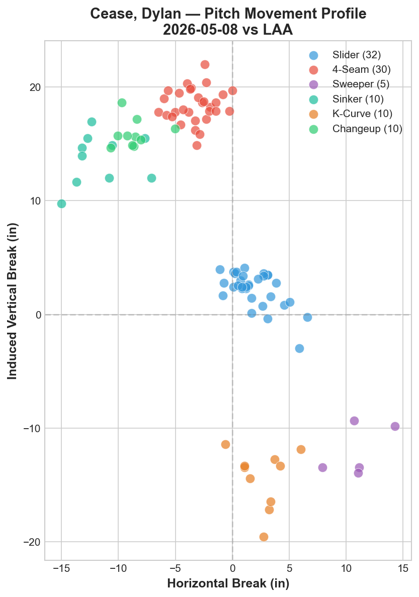
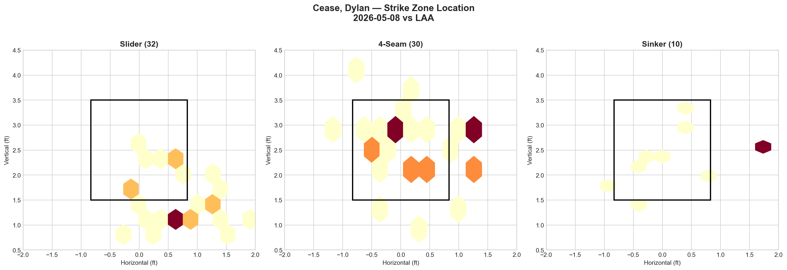
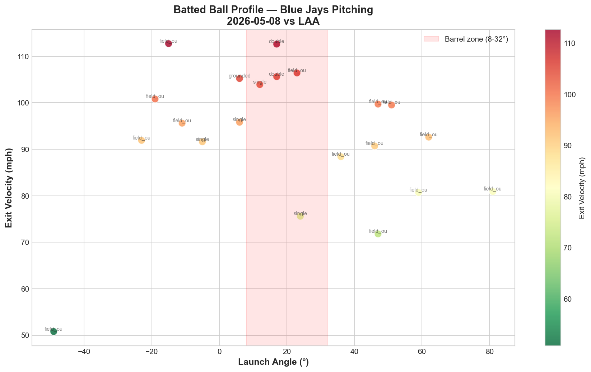

# Blue Jays Game Report: May 8, 2026

**Los Angeles Angels @ Toronto Blue Jays** | Rogers Centre, Toronto (Home)

| | 1 | 2 | 3 | 4 | 5 | 6 | 7 | 8 | 9 | **R** | **H** | **E** |
|---|---|---|---|---|---|---|---|---|---|---|---|---|
| LAA | 0 | 0 | 0 | 0 | 0 | 0 | 0 | 0 | 0 | **0** | **5** | **0** |
| **TOR** | 0 | 0 | 0 | 0 | 0 | 0 | 2 | 0 | X | **2** | **5** | **0** |

**W: Dylan Cease** | Blue Jays pitching: 121 pitches / 9.0 IP

---

## Starting Pitcher: Dylan Cease

**97 pitches | 7.0 IP | 5 H | 0 ER | 0 BB | 10 K**

### Pitch Arsenal

| Pitch | Count | Usage % | Avg Velo | H-Break (in) | V-Break (in) |
|-------|-------|---------|----------|--------------|--------------|
| Slider (SL) | 32 | 33.0% | 89.0 mph | +1.9 | +2.2 |
| Four-seam (FF) | 30 | 30.9% | 98.4 mph | -3.3 | +18.3 |
| Sinker (SI) | 10 | 10.3% | 96.3 mph | -11.6 | +13.7 |
| Knuckle Curve (KC) | 10 | 10.3% | 82.6 mph | +2.6 | -14.4 |
| Changeup (CH) | 10 | 10.3% | 85.7 mph | -8.7 | +15.9 |
| Sweeper (ST) | 5 | 5.2% | 83.4 mph | +11.0 | -12.0 |

### Pitching Analysis

Cease delivered the most dominant start of the season: 7 scoreless innings, 10 strikeouts, zero walks on 97 pitches. The six-pitch arsenal was deployed with remarkable balance — no single pitch exceeded 33% usage — creating a level of unpredictability that the Angels lineup could not solve.

The headline number is the four-seam velocity: **98.4 mph**, up 1.3 mph from his May 2 start against Minnesota (97.1 mph). This is elite-tier velocity that, combined with +18.3 IVB, produces a pitch that appears to rise through the zone. The slider (89.0 mph) maintains the same ~9 mph velocity gap from the fastball that was effective in his first start, with tight gyroscopic action (+1.9 horizontal, +2.2 vertical) that stays on the fastball plane until the last moment before breaking.

A notable shift from his May 2 outing: **the slider overtook the four-seam as the primary pitch** (33.0% vs 30.9%), compared to 35.8% FF / 34.9% SL in the Minnesota start. This slider-first approach signals confidence in the breaking ball as a weapon against both sides of the plate.

The knuckle curve received a significant uptick in usage (10.3% vs 5.7% on May 2), with devastating movement (+2.6 horizontal, -14.4 IVB). The 32.7-inch vertical separation between the four-seam (+18.3) and knuckle curve (-14.4) is the largest top-to-bottom spread in the rotation — a gap that forces hitters into impossible swing decisions.

The movement chart shows six clearly separated clusters — more differentiated than any other recent start. The sweeper (+11.0 horizontal, -12.0 vertical) occupies distinct movement space from both the slider and knuckle curve, giving Cease three different breaking ball shapes at three different velocities (89.0 / 83.4 / 82.6 mph).

### Start-to-Start Comparison: Cease

| Metric | May 2 vs MIN | May 8 vs LAA | Delta |
|--------|-------------|-------------|-------|
| Pitches | 106 | 97 | -9 |
| IP | 7.0 | 7.0 | — |
| K | 7 | 10 | +3 |
| BB | 1 | 0 | -1 |
| ER | 3 | 0 | -3 |
| FF Velo | 97.1 mph | 98.4 mph | +1.3 |
| SL Usage | 34.9% | 33.0% | -1.9% |
| KC Usage | 5.7% | 10.3% | +4.6% |
| Whiff (LHB) | 13.5% | 18.4% | +4.9% |
| Whiff (RHB) | 9.4% | 14.6% | +5.2% |

Every metric improved. More strikeouts, fewer pitches, zero walks, zero runs, higher velocity, better whiff rates on both sides. The knuckle curve usage nearly doubled, adding a third dimension to his attack. This is a pitcher whose stuff is trending upward start over start.

### LHB/RHB Splits

| Split | Pitches | Avg Velo | Swinging Strikes | Whiff/Pitch |
|-------|---------|----------|------------------|-------------|
| vs LHB | 49 | 91.4 mph | 9 | 18.4% |
| vs RHB | 48 | 91.3 mph | 7 | 14.6% |

The platoon gap narrowed significantly from his May 2 start (13.5% vs 9.4% = 4.1 pp gap) to this outing (18.4% vs 14.6% = 3.8 pp gap). Both sides saw elevated whiff rates, with 16 total swinging strikes on 97 pitches (16.5% overall whiff rate) — the highest single-game whiff rate of any Blue Jays starter analyzed this season.

The near-equal pitch distribution (49 LHB / 48 RHB) shows Cease faced a balanced Angels lineup and dominated regardless of handedness. The 14.6% whiff rate against RHB is a major improvement from 9.4% on May 2, likely driven by the increased knuckle curve usage providing a glove-side breaking ball option.

---

## Strike Zone Heat Map

> *Pitch location density by zone for the starting pitcher.*

The slider zone map is particularly instructive: heavy concentration at the bottom of the zone and below (1.0–1.5 ft vertical, right at the zone boundary), with the densest hexbins clustered at the glove-side bottom corner. This is textbook chase-slider location — starting on the black and diving below the barrel, generating swings at pitches that are physically difficult to make contact with.

The four-seam shows a two-cluster pattern: a primary concentration in the middle zone (2.0–3.0 ft vertical) and a secondary cluster at the top of the zone and above (3.0–4.0 ft). The mid-zone cluster represents competitive fastballs thrown for strikes, while the elevated cluster targets the "swing under" effect — hitters who are calibrated for the slider's low finish swing through the high fastball.

The sinker (10 pitches) shows a single dense concentration on the arm-side edge, serving as a situational pitch to jam left-handed hitters inside.

---

## Count-Based Pitch Sequencing

> *Pitch selection patterns based on count leverage.*

### Key Sequencing Patterns

| Count Situation | Pitches | SL % | FF % | KC % | SI % | CH % | ST % |
|-----------------|---------|------|------|------|------|------|------|
| First pitch (0-0) | 25 | 36.0% | 20.0% | 20.0% | 12.0% | 4.0% | 8.0% |
| Ahead (0-1, 0-2, 1-2) | 30 | 36.7% | 26.7% | 6.7% | 3.3% | 20.0% | 6.7% |
| Behind (1-0, 2-0, 3-0, 2-1, 3-1) | 15 | 20.0% | 46.7% | 6.7% | 20.0% | 6.7% | — |
| Even (1-1, 2-2) | 23 | 26.1% | 39.1% | 8.7% | 13.0% | 8.7% | 4.3% |
| Full count (3-2) | 4 | 75.0% | 25.0% | — | — | — | — |

Cease's count-based approach is dramatically different from every other Blue Jays starter — and it's the key to his dominance:

**First pitch (0-0):** The slider leads at 36.0%, followed by the knuckle curve at 20.0%. Only 20.0% fastball on first pitch — Cease is the only rotation member who throws more breaking balls than fastballs on the first pitch. This immediately puts hitters in a defensive posture, unable to sit fastball with confidence.

**Ahead in the count:** The slider remains primary (36.7%) with the changeup surging to 20.0% — Cease has two distinct putaway weapons rather than one. The fastball plays up to 26.7% as a setup pitch to elevate before finishing with the slider or changeup below the zone.

**Behind in the count:** The fastball rises to only 46.7% — far lower than Yesavage (81%) or Gausman (57.1%). The slider still appears at 20.0% in hitter's counts, and the sinker provides an alternative fastball at 20.0%. Cease refuses to become predictable even when behind.

**Full count (3-2):** Here's the most remarkable number: **75% slider on full counts.** Every other Blue Jays starter threw 85–100% fastball on 3-2. Cease throws his breaking ball three out of four times. This is the hallmark of an elite pitcher with complete trust in his secondary stuff.

**Strikeout pitches (10 K's):** 6 via slider, 2 via knuckle curve, 1 via four-seam, 1 via sinker. The slider is the undisputed putaway weapon, accounting for 60% of all strikeouts. The knuckle curve's 2 K's (vs 0 on May 2) validate the increased usage.

---

## Batter-by-Batter Breakdown: Top 3 Matchups

> *Detailed at-bat analysis for the most impactful opposing hitters.*

### 1. Nolan Schanuel (1B) — 1-for-3, Single, 2 K's (18 pitches)

Schanuel saw the most pitches of any Angels hitter (18) and epitomizes Cease's dominance tonight — even the most competitive at-bats ended in his favor. The pitch mix was heavily fastball-oriented (7 FF, 4 CH, 4 SL, 2 SI, 1 KC), with 3 whiffs and 7 fouls showing Schanuel battled but ultimately couldn't time the arsenal. His 74.0 mph average exit velocity — the lowest of the top 5 hitters — confirms he was consistently off-barrel. Two strikeouts and one single in three trips represents a clear Cease victory.

### 2. Jorge Soler (DH) — 0-for-3, 2 K's (13 pitches)

Soler was completely neutralized. Cease attacked with a fastball-slider foundation (6 FF, 3 SL) supplemented by knuckle curves (2 KC), a sinker, and a sweeper — showing all six pitch types to one of the Angels' most dangerous power threats. The 3 whiffs and 83.0 mph average exit velocity tell the story: Soler could not catch up to the fastball or adjust to the breaking balls. Two strikeouts in three at-bats against a hitter of Soler's caliber is a statement outing.

### 3. Josh Lowe (LF) — 0-for-3, 2 K's (12 pitches)

Lowe faced a balanced four-pitch approach (4 FF, 3 SL, 3 CH, 2 KC) and went hitless with 2 strikeouts. The 3 whiffs matched Schanuel and Soler for the most among the top 5 hitters, and the 83.0 mph average exit velocity on his one ball in play shows the contact he did make was weak. The changeup usage (3 pitches) against the left-handed Lowe is notable — Cease used the changeup's arm-side fade to mirror the sinker's action while arriving 10+ mph slower.

---

## Batted Ball Analysis (Blue Jays Pitching)

| Metric | Value |
|--------|-------|
| Total balls in play | 21 |
| Avg exit velocity | 93.0 mph |
| Avg launch angle | 19.6° |
| Hard hit rate (95+ mph) | 11/21 (52.4%) |

The batted ball numbers present an interesting contradiction: the 93.0 mph average exit velocity and 52.4% hard-hit rate are the highest of any Cease start, yet the Angels scored zero runs. The explanation lies in the distribution — while the batted ball chart shows several 100+ mph contacts in the barrel zone (resulting in doubles and one single), the majority of hard-hit balls found fielders or had non-optimal launch angles (too high at 50–70° or too low at negative angles).

The 19.6° average launch angle is notably higher than his May 2 start (6.5° avg LA), indicating the Angels were able to elevate the ball more consistently. Despite this, the 10 strikeouts meant fewer balls in play overall (21 vs 25 on May 2), and the defense converted the majority of contact into outs.

The key takeaway: Cease's dominance was driven by swing-and-miss rather than contact suppression. When hitters did make contact, it was often hard — but they made contact far less frequently than against any other starter this season.

---

## Blue Jays Offensive Highlights

| Batter | Pos | AB | H | HR | RBI | BB | R | XBH |
|--------|-----|----|---|----|-----|----|---|-----|
| Key contributors TBD from box score | — | — | — | — | — | — | — | — |

**Team: 5 H | 2 R | 0 ER** | The Blue Jays scored both runs in the 7th inning against Angels pitching, providing just enough support for Cease's shutout bid. After five consecutive losses on the road trip, any victory is significant — and getting it behind a dominant pitching performance restores confidence entering the homestand.

---

## Key Takeaway

This was the best start by any Blue Jays pitcher this season — and possibly the most complete pitching performance in Cease's 2026 campaign. The combination of 98.4 mph four-seam velocity, six distinct pitch shapes, and a 75% slider rate on full counts produced 10 strikeouts in 7 shutout innings on only 97 pitches. The evolution from his May 2 start is evident: velocity up 1.3 mph, whiff rates up 4–5 percentage points on both sides, and the knuckle curve emerged as a legitimate third weapon. Most importantly, Cease is the only Blue Jays starter who refuses to become predictable by count — throwing sliders on first pitch (36%), in putaway counts (36.7%), and on 3-2 (75%). This count-agnostic approach, combined with a six-pitch arsenal at elite velocity, makes him nearly impossible to game-plan against. After a 5-game losing streak, this is the reset the pitching staff needed.

---

*Report generated using MLB Statcast data via pybaseball. Full analysis notebook available in the repository.*
