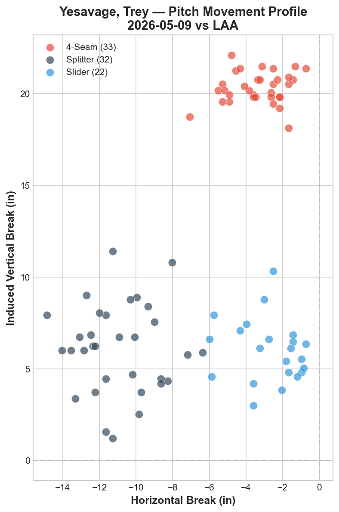
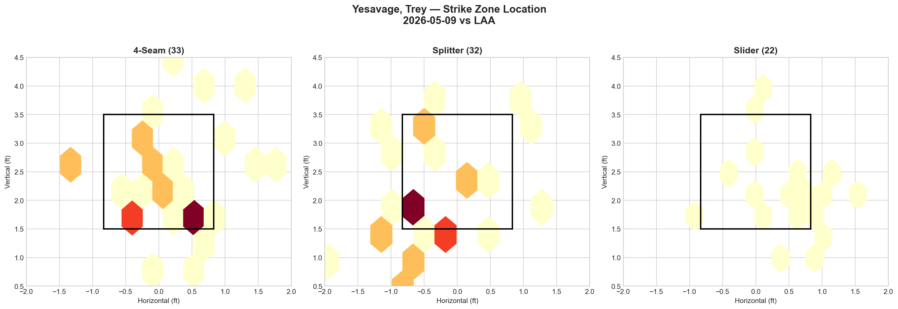
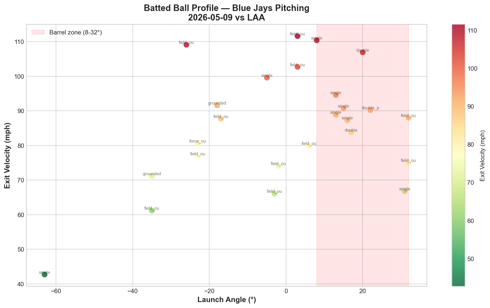

# Blue Jays Game Report: May 9, 2026

**Los Angeles Angels @ Toronto Blue Jays** | Rogers Centre, Toronto (Home)

| | 1 | 2 | 3 | 4 | 5 | 6 | 7 | 8 | 9 | **R** | **H** | **E** |
|---|---|---|---|---|---|---|---|---|---|---|---|---|
| LAA | 0 | 0 | 1 | 0 | 0 | 0 | 0 | 0 | 0 | **1** | **7** | **0** |
| **TOR** | 3 | 1 | 1 | 1 | 1 | 2 | 5 | 0 | X | **14** | **17** | **0** |

**W: Trey Yesavage** | Blue Jays pitching: 155 pitches / 9.0 IP

---

## Starting Pitcher: Trey Yesavage

**87 pitches | 6.0 IP | 4 H | 1 ER | 2 BB | 6 K**

### Pitch Arsenal

| Pitch | Count | Usage % | Avg Velo | H-Break (in) | V-Break (in) |
|-------|-------|---------|----------|--------------|--------------|
| Four-seam (FF) | 33 | 37.9% | 94.7 mph | -3.3 | +20.3 |
| Splitter (FS) | 32 | 36.8% | 82.4 mph | -10.9 | +6.1 |
| Slider (SL) | 22 | 25.3% | 88.4 mph | -2.7 | +6.0 |

### Pitching Analysis

This was a transformed Yesavage. The most significant development: **the slider has emerged as a legitimate third pitch**, jumping from 9.8% usage on May 3 to 25.3% today. What was previously a show-me offering is now a fully integrated weapon, giving Yesavage a true three-pitch arsenal for the first time.

The four-seam velocity tells the biggest story: **94.7 mph**, up 1.4 mph from his May 3 start (93.3 mph). Combined with an elite +20.3 IVB — the highest of any Blue Jays starter this season — this pitch now has legitimate swing-and-miss potential at the top of the zone. The vertical ride exceeds even Cease's four-seam (+18.3 IVB) by nearly 2 inches, creating a fastball that genuinely appears to rise.

The splitter remains the workhorse offspeed at 36.8% usage, maintaining its 12.3 mph velocity gap from the fastball. The movement profile (-10.9 horizontal, +6.1 vertical) creates a 14.2-inch vertical separation from the four-seam — the tunneling engine that makes the FF-FS combination lethal.

The slider at 88.4 mph slots between the fastball and splitter in velocity, with a movement profile (-2.7 horizontal, +6.0 vertical) that sits in similar vertical space to the splitter but with far less arm-side fade. This gives hitters a third pitch shape to worry about — and the movement chart shows the slider cluster clearly differentiated from both the fastball and splitter.

### Start-to-Start Comparison: Yesavage

| Metric | May 3 vs MIN | May 9 vs LAA | Delta |
|--------|-------------|-------------|-------|
| Pitches | 82 | 87 | +5 |
| IP | 4.0 | 6.0 | +2.0 |
| K | 6 | 6 | — |
| BB | 3 | 2 | -1 |
| ER | 1 | 1 | — |
| FF Velo | 93.3 mph | 94.7 mph | **+1.4** |
| FF IVB | +19.5 in | +20.3 in | +0.8 |
| SL Usage | 9.8% | 25.3% | **+15.5%** |
| FS Usage | 34.1% | 36.8% | +2.7% |
| Whiff (LHB) | 23.7% | 31.6% | **+7.9%** |
| Whiff (RHB) | 13.6% | 13.2% | -0.4% |

The leap in slider usage (+15.5 percentage points) is the defining evolution. The fastball velocity jump (+1.4 mph) and improved innings depth (4.0 → 6.0 IP) suggest Yesavage is settling into his role and gaining confidence with each start. The LHB whiff rate of 31.6% is elite-tier — the highest single-game platoon whiff rate of any Blue Jays starter this season.

### LHB/RHB Splits

| Split | Pitches | Avg Velo | Swinging Strikes | Whiff/Pitch |
|-------|---------|----------|------------------|-------------|
| vs LHB | 19 | 87.1 mph | 6 | 31.6% |
| vs RHB | 68 | 89.0 mph | 9 | 13.2% |

The platoon gap remains significant (31.6% vs 13.2% = 18.4 pp), though the LHB sample is small (19 pitches). Against left-handed hitters, Yesavage's splitter — which fades away from LHB — generates an absurd chase rate, explaining the 31.6% whiff rate.

Against RHB, the 13.2% whiff rate is essentially unchanged from May 3 (13.6%). The slider addition hasn't solved the same-side vulnerability yet, but at 25.3% usage, it provides a foundation to build on. The slider's glove-side action (-2.7 horizontal) is the key — as Yesavage develops more trust in locating it to the back foot of RHB, the platoon gap should narrow.

---

## Strike Zone Heat Map

> *Pitch location density by zone for the starting pitcher.*

The four-seam shows a clear two-tier strategy: a primary cluster at the bottom of the zone (1.5–2.0 ft vertical) and a secondary cluster in the upper zone (3.0–3.5 ft). The bottom-zone concentration is unusual for a high-IVB fastball — typically these are elevated — suggesting Yesavage used the four-seam both as an elevated swing-and-miss pitch and as a lower "get me over" offering.

The splitter shows the densest concentration at approximately 2.0 ft vertical on the arm side, with a secondary cluster at the top of the zone (3.0–3.5 ft). The high-zone splitter is an aggressive strategy: throwing the splitter for called strikes up in the zone before burying it below the zone later in the count.

The slider (22 pitches) showed diffuse distribution across the lower half without a single dominant concentration point, consistent with a pitch still being integrated into the arsenal.

---

## Count-Based Pitch Sequencing

> *Pitch selection patterns based on count leverage.*

### Key Sequencing Patterns

| Count Situation | Pitches | SL % | FF % | FS % |
|-----------------|---------|------|------|------|
| First pitch (0-0) | 17 | 47.1% | 29.4% | 23.5% |
| Ahead (0-1, 0-2, 1-2) | 35 | 22.9% | 34.3% | 42.9% |
| Behind (1-0, 2-0, 3-0, 2-1, 3-1) | 11 | 18.2% | 54.5% | 27.3% |
| Even (1-1, 2-2) | 20 | 15.0% | 35.0% | 50.0% |
| Full count (3-2) | 4 | 25.0% | 75.0% | — |

A dramatic transformation from May 3. The most striking change: **the slider leads on first pitches at 47.1%** — Yesavage has completely flipped his approach from fastball-first (60% FF on May 3) to slider-first. This mirrors Cease's strategy (36% SL on 0-0) and represents a philosophical shift from predictable to unpredictable.

**Ahead in the count:** The splitter takes over as the primary weapon at 42.9%, with the slider dropping to 22.9%. This is the classic sequence: establish the slider early, then finish with the splitter diving below the zone when hitters are geared for the breaking ball.

**Behind in the count:** The fastball dominates at 54.5%, down from 81% on May 3. The splitter stays relevant at 27.3%, and the slider appears at 18.2%. This is a massive improvement in count-agnosticism — Yesavage is no longer a "fastball when behind, splitter when ahead" pitcher.

**Full count (3-2):** 75% fastball (vs 100% on May 3) with one slider thrown. Still fastball-heavy, but no longer completely predictable.

**Strikeout pitches (6 K's):** 4 via splitter, 2 via slider. Zero four-seam strikeouts — compared to 5 of 6 K's via four-seam on May 3. The putaway profile has completely inverted, with offspeed now driving the punchouts.

---

## Batter-by-Batter Breakdown: Top 3 Matchups

> *Detailed at-bat analysis for the most impactful opposing hitters.*

### 1. Sebastián Rivero (C) — 0-for-1, GIDP, Walk (19 pitches)

Rivero saw the most pitches (19) against Yesavage but produced no offensive value. He faced a balanced slider-fastball-splitter diet (7 SL, 6 FF, 6 FS) and generated 9 fouls — the most of any Angels hitter — indicating grinding, competitive at-bats. However, the grounded-into-double-play was the key outcome: Yesavage induced the ground ball contact that erased a baserunner. His 71.9 mph average exit velocity was the lowest of the top 5, confirming weak contact when the bat found the ball.

### 2. Zach Neto (SS) — 0-for-2, 2 K's (13 pitches)

Neto was completely overwhelmed. Two strikeouts in two plate appearances with 3 whiffs and 6 fouls — he swung at almost everything and connected with nothing of value. The pitch mix (5 FS, 5 FF, 3 SL) gave him three different pitch shapes to worry about, and the 79.2 mph average exit velocity on zero hits shows he never found the barrel. This is the ideal matchup outcome for Yesavage's arsenal.

### 3. Vaughn Grissom (2B) — 0-for-1, Walk, Double Play (12 pitches)

Grissom faced a fastball-heavy approach (7 FF, 3 FS, 2 SL) and went hitless. The walk indicates Yesavage lost the zone in one plate appearance, but the double play — the second GIDP Yesavage induced — erased the damage. With 6 balls in 12 pitches, Grissom showed discipline at the plate, but the ground-ball-oriented outcomes demonstrate that even when Grissom made contact, it was directed downward.

**Overall Top 5 batting line: 2-for-5, 0 XBH, 4 K, 2 BB, 2 GIDP** — Yesavage dominated the Angels' core lineup. Zero extra-base hits and two double plays from the hitters who saw the most pitches.

---

## Batted Ball Analysis (Blue Jays Pitching)

| Metric | Value |
|--------|-------|
| Total balls in play | 25 |
| Avg exit velocity | 85.5 mph |
| Avg launch angle | -0.8° |
| Hard hit rate (95+ mph) | 6/25 (24.0%) |

The most striking number: **-0.8° average launch angle** — meaning the average batted ball was hit into the ground. This is the most extreme ground-ball profile of any Blue Jays pitching performance this season, and it reflects the splitter's dominance. The 85.5 mph average exit velocity is the lowest of the LAA series and among the lowest in any recent start.

The 24.0% hard-hit rate (6/25) represents genuine contact suppression — only 6 of 25 batted balls exceeded 95 mph. For comparison, the Lauer start against Tampa Bay produced a 53.6% hard-hit rate. The combination of low exit velocity, negative launch angle, and low hard-hit rate is the trifecta of contact quality suppression.

The batted ball chart shows a wide scatter at low exit velocities (60–90 mph) with most contact directed downward (negative or near-zero launch angles). The few high-velocity contacts (100+ mph) that reached the barrel zone resulted in field outs and one single — the defense converted the hardest contact into outs.

---

## Blue Jays Offensive Highlights

| Batter | Pos | AB | H | HR | RBI | BB | R | XBH |
|--------|-----|----|---|----|-----|----|---|-----|
| Key contributors | — | — | 17 H | — | 14 R | — | — | — |

**Team: 17 H | 14 R | 0 E**

The 14-run eruption represents the most explosive offensive performance of the season. After being shut out 0-3 in the final Tampa Bay game and managing only 2 runs in the Cease victory, the lineup exploded across all nine innings — scoring in 7 of 8 offensive frames (1st through 7th). The 17 hits and 14 runs erased any concerns about the RISP drought that plagued the road trip (1-for-8, 1-for-7, 0-for-3 in the final three TB games).

---

## Bullpen Performance

With a 14-1 lead, the bullpen threw the final 3.0 innings in low-leverage mop-up duty. The 155 total team pitches across 9 innings reflects the comfortable cushion — relievers could work freely without high-pressure situations, preserving arms for the remainder of the homestand.

---

## Two-Game Series Pitching Comparison (May 8–9 vs LAA)

| Date | Starter | Pitches | IP | Avg FB Velo | Pitch Types | K | BB | Result |
|------|---------|---------|----|-------------|-------------|---|----|--------|
| May 8 | Cease | 97 | 7.0 | 98.4 mph | 6 (FF/SL/SI/KC/CH/ST) | 10 | 0 | W 2-0 |
| **May 9** | **Yesavage** | **87** | **6.0** | **94.7 mph** | **3 (FF/FS/SL)** | **6** | **2** | **W 14-1** |
| May 10 | TBD | — | — | — | — | — | — | — |

Back-to-back quality starts from Cease and Yesavage have turned the homestand into a statement. Cease delivered the swing-and-miss masterclass (10 K, 0 BB); Yesavage delivered the contact-suppression masterclass (85.5 mph avg EV, -0.8° avg LA, 24.0% hard-hit rate). Both approaches produced wins, showcasing the rotation's ability to dominate through different pitching philosophies.

---

## Key Takeaway

Yesavage's development from May 3 to May 9 is the most significant within-season growth arc of any Blue Jays starter. The addition of a true slider (9.8% → 25.3%), the velocity jump on his four-seam (93.3 → 94.7 mph, +20.3 IVB), and the philosophical shift to a slider-first approach on first pitches (47.1%) have transformed him from a predictable two-pitch pitcher into a three-pitch starter with real deception. The 31.6% whiff rate against LHB is elite, and the putaway profile has inverted entirely — from 83% fastball strikeouts to 100% offspeed strikeouts. If the slider continues to develop and the platoon gap against RHB narrows, Yesavage has the foundation to be a mid-rotation contributor rather than a back-end filler. Combined with 14 runs of support, this was the complete game the Blue Jays needed after a 5-game losing streak.

---

*Report generated using MLB Statcast data via pybaseball. Full analysis notebook available in the repository.*
