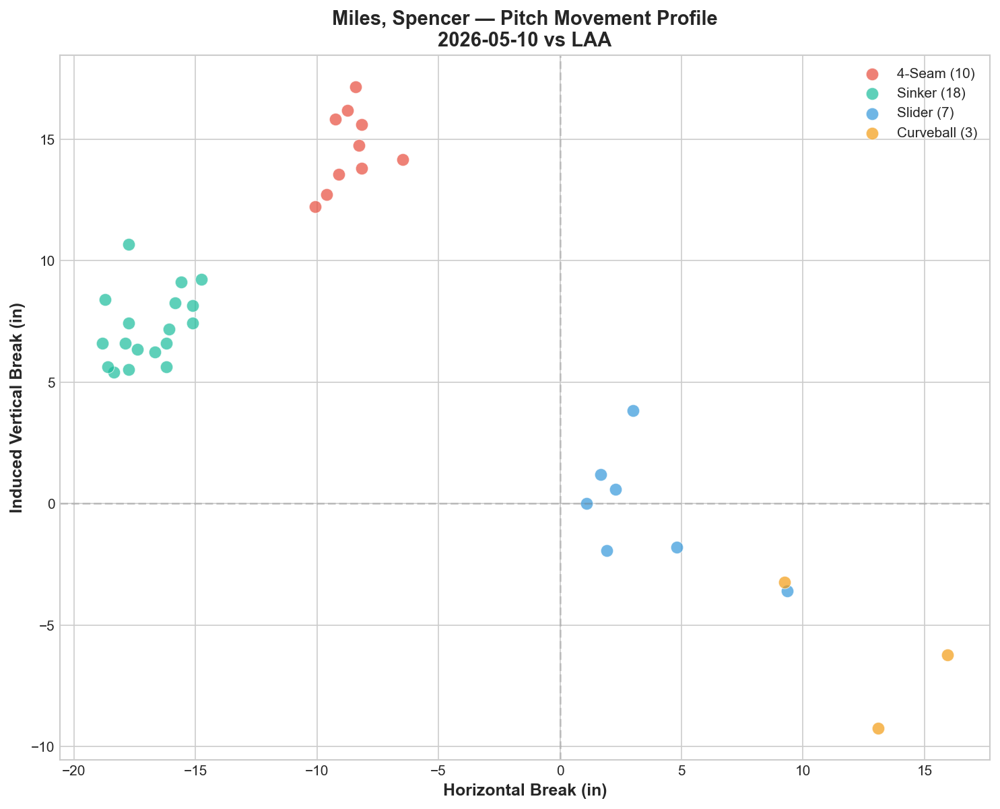
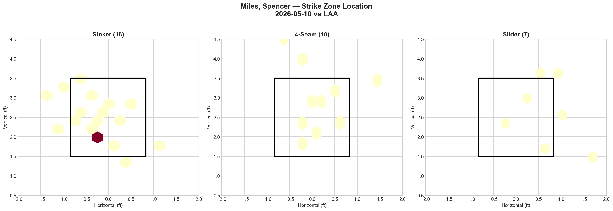
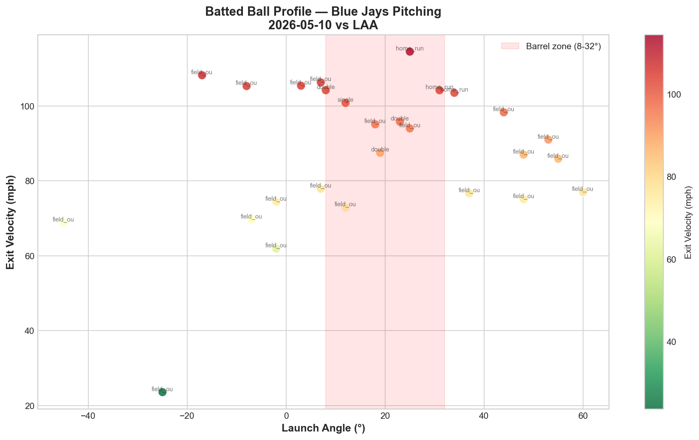

# Blue Jays Game Report: May 10, 2026

**Los Angeles Angels @ Toronto Blue Jays** | Rogers Centre, Toronto (Home)

| | 1 | 2 | 3 | 4 | 5 | 6 | 7 | 8 | 9 | **R** | **H** | **E** |
|---|---|---|---|---|---|---|---|---|---|---|---|---|
| LAA | 1 | 2 | 1 | 0 | 0 | 2 | 0 | 0 | 0 | **6** | **12** | **0** |
| **TOR** | 0 | 0 | 0 | 0 | 0 | 1 | 0 | 0 | 0 | **1** | **5** | **0** |

**L: Spencer Miles** | Blue Jays pitching: 126 pitches / 9.0 IP

---

## Starting Pitcher: Spencer Miles

**38 pitches | 2.0 IP | 3 H | 3 ER | 0 BB | 2 K**

### Pitch Arsenal

| Pitch | Count | Usage % | Avg Velo | H-Break (in) | V-Break (in) |
|-------|-------|---------|----------|--------------|--------------|
| Sinker (SI) | 18 | 47.4% | 96.5 mph | -16.9 | +7.3 |
| Four-seam (FF) | 10 | 26.3% | 96.8 mph | -8.6 | +14.6 |
| Slider (SL) | 7 | 18.4% | 87.8 mph | +3.4 | -0.2 |
| Curveball (CU) | 3 | 7.9% | 81.2 mph | +12.8 | -6.2 |

### Pitching Analysis

Miles made his first start of the season after exclusively pitching in relief, and the outing lasted just 2.0 innings on 38 pitches (19.0 P/IP). The sinker-heavy approach (47.4%) mirrors Corbin's ground-ball philosophy, but at 96.5 mph — 6 mph harder than Corbin's sinker — Miles possesses raw velocity that is among the highest in the rotation's fastball family.

The movement chart reveals four clearly separated clusters. The sinker (-16.9 horizontal, +7.3 vertical) shows extreme arm-side run — the most horizontal movement of any primary pitch in the rotation. This creates natural boring action against right-handed hitters, but the heavy run also means the pitch can miss arm-side when command wavers. The four-seam at 96.8 mph (-8.6 horizontal, +14.6 vertical) sits in a different quadrant with less horizontal movement and more vertical ride, giving Miles two distinct fastball shapes.

The slider (+3.4 horizontal, -0.2 vertical) is essentially a zero-IVB sweeping pitch that moves to the glove side — a true horizontal breaker with no vertical component. This provides opposite-direction action from the sinker, creating a 20.3-inch horizontal spread between the two primary offerings. The curveball (+12.8 horizontal, -6.2 vertical) appeared only 3 times but adds a show-me slow ball at 81.2 mph.

Despite the promising stuff, 38 pitches through 2 innings with 3 earned runs represents an unsustainable pace. The 19.0 P/IP rate is the highest of any Blue Jays starter this season, suggesting Miles was unable to put hitters away efficiently and fell into deep counts.

### LHB/RHB Splits

| Split | Pitches | Avg Velo | Swinging Strikes | Whiff/Pitch |
|-------|---------|----------|------------------|-------------|
| vs LHB | 4 | 94.3 mph | 0 | 0.0% |
| vs RHB | 34 | 93.7 mph | 2 | 5.9% |

Only 2 swinging strikes in the entire outing — despite 96+ mph velocity, the Angels tracked and made contact consistently. The absence of a changeup or splitter limits Miles' ability to generate vertical deception and empty swings.

---

## Strike Zone Heat Map

> *Pitch location density by zone for the starting pitcher.*

The sinker shows concentration at the lower-middle zone (~2.0 ft vertical) on the arm side — textbook sinker location. The four-seam and slider show diffuse distribution without clear targeting, consistent with a pitcher still developing starter-level zone command.

---

## Count-Based Pitch Sequencing

> *Pitch selection patterns based on count leverage.*

### Key Sequencing Patterns

| Count Situation | Pitches | SI % | FF % | SL % | CU % |
|-----------------|---------|------|------|------|------|
| First pitch (0-0) | 11 | 45.5% | 27.3% | 27.3% | — |
| Ahead (0-1, 0-2, 1-2) | 10 | 30.0% | 40.0% | 20.0% | 10.0% |
| Behind (1-0, 2-0, 3-0, 2-1, 3-1) | 8 | 87.5% | — | 12.5% | — |
| Even (1-1, 2-2) | 9 | 33.3% | 33.3% | 11.1% | 22.2% |

The critical vulnerability: **87.5% sinker when behind in the count** — the most predictable behind-count approach of any Blue Jays starter this season. With 8 of 38 pitches (21.1%) coming in hitter's counts, Miles fell behind frequently, and when he did, he became a one-pitch pitcher. For context, Cease throws only 46.7% fastball when behind, maintaining unpredictability even in disadvantaged counts.

**Strikeout pitches (2 K's):** One via slider, one via four-seam — two different putaway options, though the sample is too small to identify tendencies.

---

## Batter-by-Batter Breakdown: Top 3 Matchups

> *Detailed at-bat analysis for the most impactful opposing hitters.*

### 1. Zach Neto (SS) — 0-for-2, K, Field Out (8 pitches)

The one matchup Miles won cleanly. Neto faced a diverse mix (3 SI, 2 SL, 2 FF, 1 CU) and produced a strikeout and a field out with zero hits. His 88.7 mph average exit velocity was moderate. Neto has now gone hitless in all three games this series — 0-for-7 with 5 strikeouts against Cease, Yesavage, and Miles combined.

### 2. Mike Trout (DH) — 0-for-2, K, Field Out (7 pitches)

Miles held Trout hitless — a significant positive from an otherwise difficult outing. Trout faced a fastball-heavy approach (3 FF, 2 SI, 2 SL), generating 2 whiffs — accounting for 100% of Miles' total swinging strikes. The 79.8 mph average exit velocity is remarkably soft for a hitter of Trout's caliber. Despite the overall poor start, neutralizing Trout is a genuine accomplishment.

### 3. Sebastián Rivero (C) — 0-for-1, Field Out (5 pitches)

Rivero faced a near-exclusively sinker diet (4 SI, 1 FF) and grounded out in his only appearance. The 77.0 mph average exit velocity confirms the sinker's ground-ball action produced the desired weak contact.

**Key note:** The top 3 hitters combined to go 0-for-5 with 2 K's — Miles actually dominated the individual matchups he faced most frequently. The 3 earned runs came from hitters who saw fewer pitches but made more impactful contact, suggesting the damage occurred in shorter, more efficient at-bats where Miles couldn't establish his sequencing.

---

## Batted Ball Analysis (Blue Jays Pitching)

| Metric | Value |
|--------|-------|
| Total balls in play | 27 |
| Avg exit velocity | 87.6 mph |
| Avg launch angle | 17.1° |
| Hard hit rate (95+ mph) | 12/27 (44.4%) |

The full-game batted ball profile (including 7.0 bullpen innings) shows a 44.4% hard-hit rate with two home runs in the barrel zone. The 17.1° average launch angle represents a significant adjustment from the Angels compared to the previous day's -0.8° against Yesavage — they went from ground-ball weak contact to elevated, driven swings.

The chart shows a wide scatter with multiple high-velocity contacts (95+ mph) clustered in the barrel zone, producing doubles and home runs. The bullpen absorbed the majority of innings (7.0 of 9.0), making it difficult to isolate Miles' batted ball contribution from the relievers.

---

## Three-Game Series Final Summary (May 8–10 vs LAA)

| Date | Starter | Pitches | IP | Avg FB Velo | Pitch Types | K | BB | Result |
|------|---------|---------|----|-------------|-------------|---|----|--------|
| May 8 | Cease | 97 | 7.0 | 98.4 mph | 6 (FF/SL/SI/KC/CH/ST) | 10 | 0 | W 2-0 |
| May 9 | Yesavage | 87 | 6.0 | 94.7 mph | 3 (FF/FS/SL) | 6 | 2 | W 14-1 |
| **May 10** | **Miles** | **38** | **2.0** | **96.8 mph** | **4 (SI/FF/SL/CU)** | **2** | **0** | **L 1-6** |

**Series result: Won 2-1**

The series win masks the fifth-starter vulnerability. Cease and Yesavage combined for 13.0 IP, 1 ER, and 16 K in back-to-back dominant starts. Miles' 2.0-inning, 3-ER outing forced the bullpen into 7 innings of work, undoing much of the arm preservation gained from the previous two efficient starts.

The rotation hierarchy is clear: Cease is the ace producing swing-and-miss dominance, Yesavage is developing into a legitimate mid-rotation arm, and the fifth starter slot (Miles/Lauer) remains the rotation's weakest link.

---

## Key Takeaway

Spencer Miles' starting debut exposed the gap between bullpen-caliber stuff and starter-level execution. His 96+ mph sinker-four-seam combination generates elite raw velocity, but the 5.3% overall whiff rate, the 87.5% sinker rate when behind in counts, and the absence of a true offspeed pitch (changeup/splitter) made him one-dimensional after the first time through. The contrast with Cease is instructive: both throw 96+ mph, but Cease deploys six pitch types with count-agnostic mixing (even throwing 75% sliders on 3-2), while Miles defaulted to 87.5% sinkers when behind. The path forward for Miles: develop an offspeed offering that creates vertical separation from his fastball family, and learn to trust secondary pitches in hitter's counts. Until then, his highest-value role remains as a high-leverage bullpen arm.

---

*Report generated using MLB Statcast data via pybaseball. Full analysis notebook available in the repository.*
