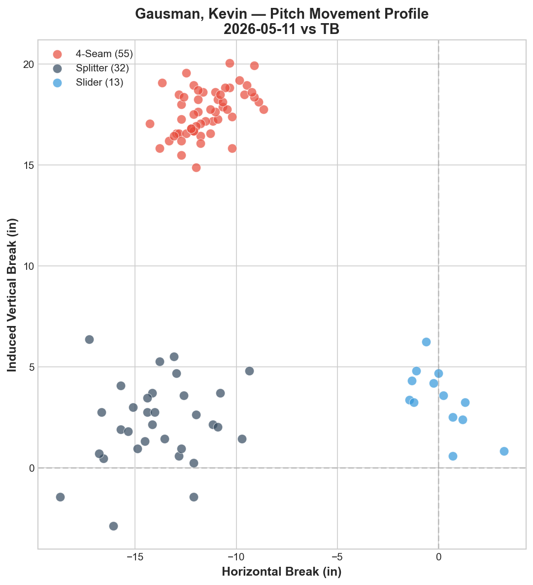
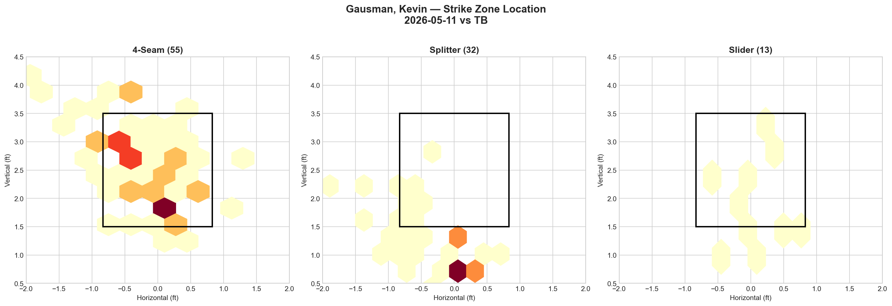
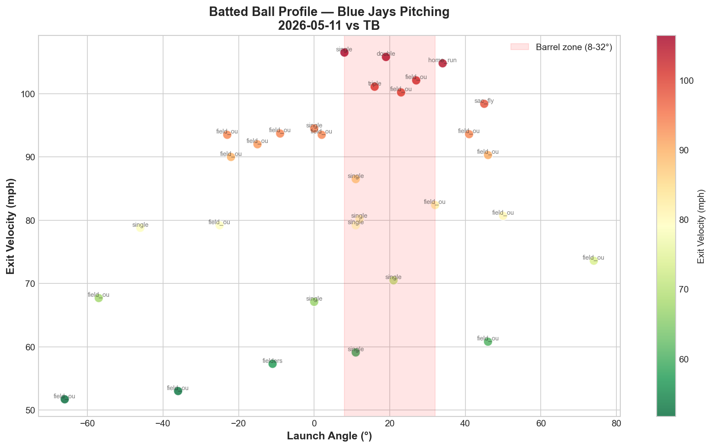

# Blue Jays Game Report: May 11, 2026

**Tampa Bay Rays @ Toronto Blue Jays** | Rogers Centre, Toronto (Home)

| | 1 | 2 | 3 | 4 | 5 | 6 | 7 | 8 | 9 | **R** | **H** | **E** |
|---|---|---|---|---|---|---|---|---|---|---|---|---|
| TB | 1 | 1 | 0 | 1 | 1 | 1 | 0 | 3 | 0 | **8** | **13** | **0** |
| **TOR** | 1 | 0 | 0 | 0 | 2 | 0 | 0 | 2 | 0 | **5** | **9** | **0** |

**L: Kevin Gausman** | Blue Jays pitching: 164 pitches / 9.0 IP

---

## Starting Pitcher: Kevin Gausman

**100 pitches | 5.0 IP | 8 H | 5 ER | 1 BB | 5 K**

### Pitch Arsenal

| Pitch | Count | Usage % | Avg Velo | H-Break (in) | V-Break (in) |
|-------|-------|---------|----------|--------------|--------------|
| Four-seam (FF) | 55 | 55.0% | 94.6 mph | -11.5 | +17.6 |
| Splitter (FS) | 32 | 32.0% | 85.1 mph | -13.9 | +2.2 |
| Slider (SL) | 13 | 13.0% | 85.5 mph | +0.1 | +3.4 |

### Pitching Analysis

Gausman's worst start of the season — 5 innings, 8 hits, 5 earned runs against a Tampa Bay lineup that has now seen him twice in six days. The Rays' familiarity with his approach was evident: 13 hits (8 against Gausman) on a night where his stuff showed only marginal changes from the May 5 outing.

The four-seam velocity held steady at 94.6 mph (vs 94.4 on May 5), and the movement profile was essentially identical: -11.5 horizontal / +17.6 IVB vs -12.2 / +17.7 in the previous start. The splitter velocity ticked up slightly to 85.1 mph (from 83.8), narrowing the velocity gap from 10.6 to 9.5 mph — a potentially meaningful reduction in deception.

The most notable change: **the slider nearly tripled in usage** from 5.2% (5 pitches) on May 5 to 13.0% (13 pitches) today. This was a deliberate adjustment to add a third pitch dimension, and the movement chart shows the slider cluster clearly separated from the splitter — the slider breaks to the glove side (+0.1 horizontal) while the splitter fades arm-side (-13.9). However, the slider's vertical profile (+3.4 IVB) overlaps with the splitter (+2.2 IVB), meaning both pitches arrive at similar vertical planes despite moving in opposite horizontal directions.

The movement chart reveals the fundamental issue with Gausman's arsenal: only two vertical tiers. The four-seam lives at +17.6 IVB and the secondary pitches cluster at +2 to +4 IVB. There is no pitch occupying the 8-14 IVB middle ground — no changeup, no sinker, no cutter to bridge the gap. This binary vertical structure becomes predictable against a lineup that has seen it before.

### Start-to-Start Comparison: Gausman vs TB

| Metric | May 5 @ TB | May 11 vs TB | Delta |
|--------|-----------|-------------|-------|
| Pitches | 96 | 100 | +4 |
| IP | 6.0 | 5.0 | **-1.0** |
| H | 6 | 8 | **+2** |
| ER | 2 | 5 | **+3** |
| K | 3 | 5 | +2 |
| BB | 1 | 1 | — |
| FF Velo | 94.4 mph | 94.6 mph | +0.2 |
| SL Usage | 5.2% | 13.0% | +7.8% |
| Whiff (LHB) | 12.3% | 8.3% | **-4.0%** |
| Whiff (RHB) | 7.7% | 10.7% | +3.0% |

The rematch went decisively to Tampa Bay. Despite adding more slider usage (+7.8%) and gaining 2 additional strikeouts, Gausman allowed 3 more earned runs and lasted 1 fewer inning. The most concerning number: the LHB whiff rate dropped from 12.3% to 8.3%, suggesting the Rays' left-handed hitters adjusted to the splitter's arm-side fade — the pitch that was supposed to be his weapon against opposite-side hitters.

### LHB/RHB Splits

| Split | Pitches | Avg Velo | Swinging Strikes | Whiff/Pitch |
|-------|---------|----------|------------------|-------------|
| vs LHB | 72 | 90.3 mph | 6 | 8.3% |
| vs RHB | 28 | 90.6 mph | 3 | 10.7% |

The platoon split has inverted from his May 5 start. Previously, Gausman whiffed LHB at a higher rate (12.3%) than RHB (7.7%). Today, RHB generated more whiffs (10.7%) than LHB (8.3%). With 72 of 100 pitches (72%) against left-handed hitters, the Rays stacked their lineup to exploit Gausman's now-diminished LHB effectiveness.

The 8.3% LHB whiff rate — down from 12.3% six days ago — is the smoking gun of scouting-report adjustment. The Rays' left-handed hitters were no longer chasing the splitter below the zone; they either laid off it for balls or put it in play for hits.

---

## Strike Zone Heat Map

> *Pitch location density by zone for the starting pitcher.*

The four-seam heat map shows a broad distribution across the entire zone — from 1.5 to 4.0 ft vertical, spanning glove side to arm side. The concentration clusters in the middle zone (2.0–3.0 ft) suggest Gausman was living in the heart of the plate rather than targeting edges. At 94.6 mph without elite vertical ride, middle-zone fastballs become very hittable.

The splitter zone chart reveals an alarming pattern: the densest concentration sits well below the zone (around 0.5–1.0 ft vertical) on the center-arm side. While below-zone splitters should generate chases, the dense cluster at that location suggests Gausman was burying the pitch too far below — resulting in balls rather than competitive chases. The lack of in-zone splitter concentration means he wasn't using the splitter as a called-strike weapon early in counts.

The slider (13 pitches) shows diffuse distribution without clear targeting — a pitch still being integrated rather than precisely commanded.

---

## Count-Based Pitch Sequencing

> *Pitch selection patterns based on count leverage.*

### Key Sequencing Patterns

| Count Situation | Pitches | FF % | SL % | FS % |
|-----------------|---------|------|------|------|
| First pitch (0-0) | 24 | 54.2% | 25.0% | 20.8% |
| Ahead (0-1, 0-2, 1-2) | 42 | 40.5% | 11.9% | 47.6% |
| Behind (1-0, 2-0, 3-0, 2-1, 3-1) | 13 | 69.2% | 7.7% | 23.1% |
| Even (1-1, 2-2) | 18 | 72.2% | 5.6% | 22.2% |
| Full count (3-2) | 3 | 100.0% | — | — |

**First pitch (0-0):** Fastball-first at 54.2% — down from 79.2% on May 5. The slider absorbed the difference (25.0% vs 4.2%), showing Gausman's attempt to diversify his first-pitch approach. However, the Rays may have expected this adjustment.

**Ahead in the count:** The splitter leads at 47.6% — consistent with his May 5 approach (48.3%). This is Gausman's comfort zone: fastball to set up, splitter to finish. The pattern is now extremely well-documented across three starts and is the most predictable element of his game.

**Even counts (1-1, 2-2):** Fastball dominates at 72.2% — up from 46.7% on May 5. This is a significant regression toward predictability. When the count is level, Gausman reverted to a fastball-heavy approach rather than maintaining the balanced FF/FS split that worked in earlier starts.

**Full count (3-2):** 100% fastball for the third consecutive start. This is now a fully established tendency that opposing teams can exploit with certainty.

**Strikeout pitches (5 K's):** 4 via four-seam, 1 via splitter. The fastball accounted for 80% of strikeouts — a reversal from May 5 (2 FS, 1 FF). This suggests the splitter was not generating the chase swings needed for putaway, forcing Gausman to rely on the four-seam to finish at-bats.

---

## Batter-by-Batter Breakdown: Top 3 Matchups

> *Detailed at-bat analysis for the most impactful opposing hitters.*

### 1. Junior Caminero (3B) — 1-for-3, Single, 2 Field Outs (16 pitches)

Caminero saw the highest pitch count (16) with a balanced FF/FS/SL diet (7 FF, 6 FS, 3 SL). He generated 2 whiffs — tied for the most of any Rays hitter — but his 86.4 mph average exit velocity produced only one single amid two field outs. This was a neutral matchup: Gausman couldn't dominate him, but Caminero couldn't inflict major damage. Across the two TB series, Caminero has been the most persistent at-bat for Blue Jays pitching — always competitive, always grinding.

### 2. Jake Fraley (LF) — 1-for-3, Double, 2 K's (16 pitches)

Fraley represents the dual-outcome hitter: 2 strikeouts but also a double. He faced the identical pitch distribution as Caminero (7 FF, 6 FS, 3 SL), with 2 whiffs and 6 fouls indicating extended, grinding at-bats. The double is the key outcome — it represents exactly the type of extra-base hit that Gausman's 5/5 start avoided. Fraley found the barrel at least once, and the 84.2 mph average exit velocity suggests the double came on well-placed contact rather than brute force.

### 3. Chandler Simpson (LF) — 2-for-3, 2 Singles, Fielder's Choice (13 pitches)

Simpson was the most damaging hitter against Gausman, reaching base twice on two singles. He faced a fastball-heavy approach (8 FF, 4 FS, 1 SL) and generated 0 whiffs in 13 pitches — he never swung and missed. The 60.2 mph average exit velocity suggests the singles were soft contact that found holes, but a 0% whiff rate across 13 pitches from a hitter seeing the same pitcher for the second time in a week is a scouting-report win for Tampa Bay.

---

## Batted Ball Analysis (Blue Jays Pitching)

| Metric | Value |
|--------|-------|
| Total balls in play | 31 |
| Avg exit velocity | 83.5 mph |
| Avg launch angle | 7.1° |
| Hard hit rate (95+ mph) | 7/31 (22.6%) |

The surface-level batted ball numbers are actually the best of any Blue Jays outing against Tampa Bay this season: 83.5 mph average exit velocity (lowest) and 22.6% hard-hit rate (lowest). However, 8 runs scored despite this soft contact profile — a reminder that volume of contact matters more than quality when hits pile up.

The chart shows a wide distribution with most contact clustered at low exit velocities (60–90 mph range). The exceptions are critical: a home run at approximately 103 mph / 25° launch angle in the barrel zone, and several singles and a double in the 95-105 mph range. The 13 hits allowed by Blue Jays pitching (8 by Gausman, 5 by relievers) reflect a death-by-singles approach from Tampa Bay — they didn't need to barrel the ball to score runs; they just needed to put it in play consistently.

---

## Blue Jays Offensive Highlights

**Team: 9 H | 5 R**

The Blue Jays' 5 runs represented their highest output against Tampa Bay pitching since the May 2 Minnesota finale (11 runs). The offense showed signs of life, but the 8 runs allowed negated any comeback potential. The late 8th-inning push (2 runs) came too late against a 3-run deficit.

---

## Gausman Season Trend: Three-Start Comparison

| Date | Opponent | IP | H | ER | K | BB | FF Velo | FS Velo | SL % | Whiff LHB | Whiff RHB | Result |
|------|----------|----|---|----|----|-----|---------|---------|------|-----------|-----------|--------|
| Apr 30 | MIN | — | — | — | — | — | 92.3 | — | — | — | — | L 1-7 |
| May 5 | @ TB | 6.0 | 6 | 2 | 3 | 1 | 94.4 | 83.8 | 5.2% | 12.3% | 7.7% | L 3-4 |
| **May 11** | **vs TB** | **5.0** | **8** | **5** | **5** | **1** | **94.6** | **85.1** | **13.0%** | **8.3%** | **10.7%** | **L 5-8** |

The trend is concerning: despite stable velocity (94.4 → 94.6), Gausman is becoming less effective with each start. The velocity differential between fastball and splitter narrowed from 10.6 to 9.5 mph, the LHB whiff rate dropped from 12.3% to 8.3%, and hits allowed jumped from 6 to 8 against the same lineup. The rematch effect is real — Tampa Bay solved Gausman's two-pitch approach.

---

## Key Takeaway

Gausman's rematch against Tampa Bay exposed the vulnerability of a two-pitch starter facing the same lineup twice in six days. The Rays' scouting adjustment was surgical: their left-handed hitters stopped chasing the splitter below the zone (LHB whiff: 12.3% → 8.3%), and Simpson's 0% whiff rate across 13 pitches epitomizes how thoroughly they had downloaded his tendencies. The increased slider usage (5.2% → 13.0%) was the right idea — adding a third pitch dimension — but 13 pitches in a single start isn't enough to establish credibility with a new offering. Gausman's path forward requires either (a) developing the slider into a 20%+ weapon that changes his sequencing profile, or (b) adding a true fourth pitch to break the fastball-splitter binary that opposing teams are now successfully decoding. At 100% four-seam on 3-2 counts across three consecutive starts, his full-count predictability alone gives hitters a decisive advantage in the game's highest-leverage moments.

---

*Report generated using MLB Statcast data via pybaseball. Full analysis notebook available in the repository.*
