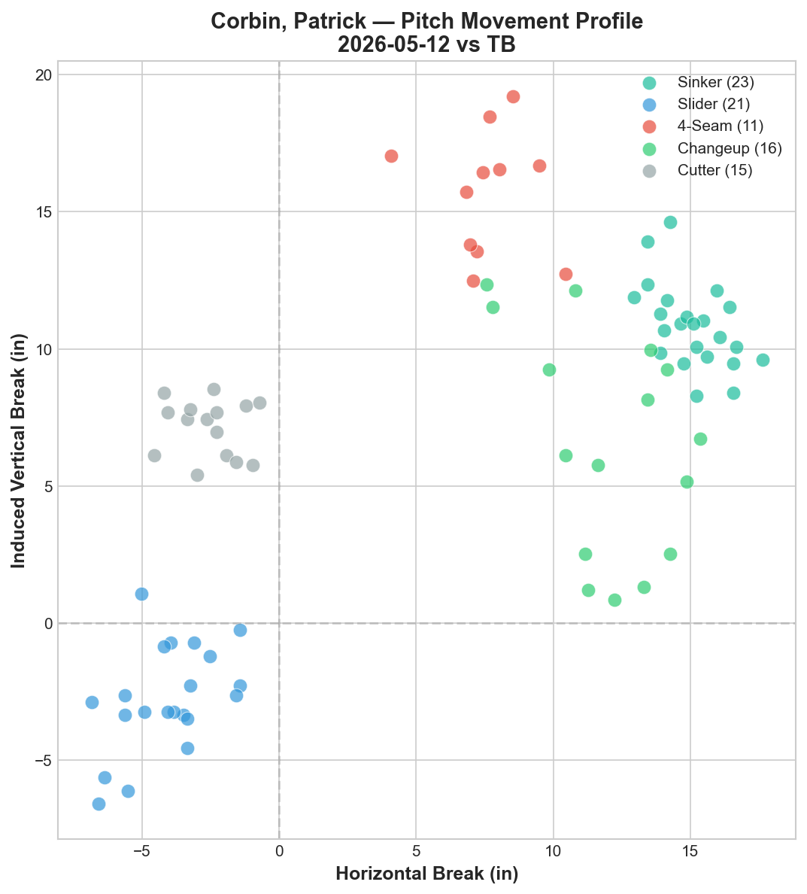
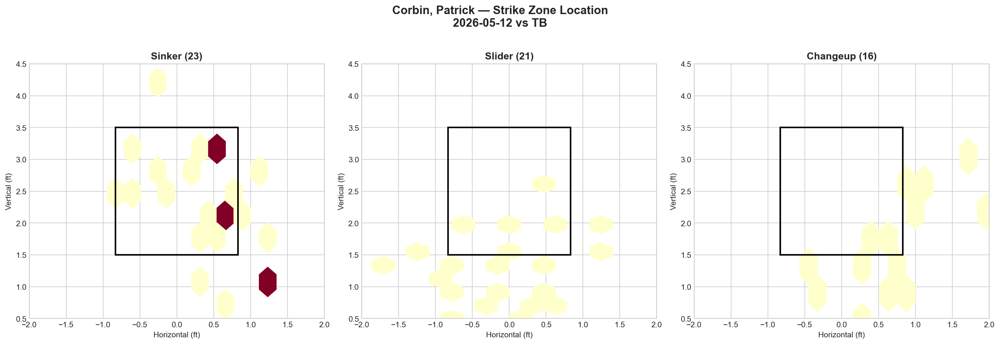
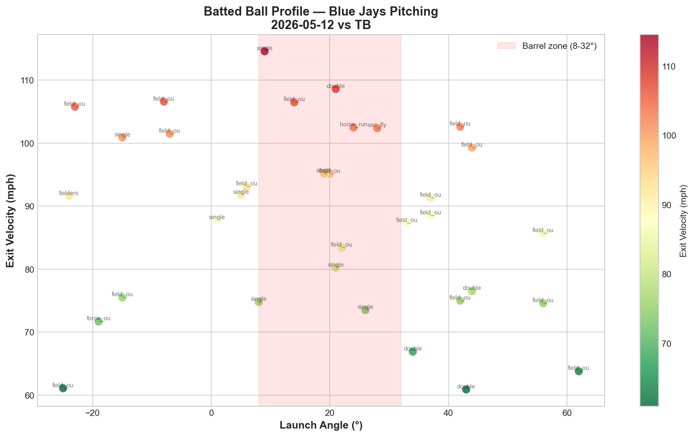

# Blue Jays Game Report: May 12, 2026

**Tampa Bay Rays @ Toronto Blue Jays** | Rogers Centre, Toronto (Home)

| | 1 | 2 | 3 | 4 | 5 | 6 | 7 | 8 | 9 | 10 | **R** | **H** | **E** |
|---|---|---|---|---|---|---|---|---|---|---|---|---|---|
| TB | 1 | 0 | 2 | 0 | 0 | 1 | 1 | 0 | 0 | 2 | **7** | **13** | **2** |
| **TOR** | 0 | 0 | 0 | 0 | 0 | 0 | 5 | 0 | 0 | 1 | **6** | **6** | **0** |

**L: Braydon Fisher** | W: Ian Seymour | SV: Garrett Cleavinger

Blue Jays pitching: 212 pitches / 10.0 IP

---

## Starting Pitcher: Patrick Corbin (L)

**86 pitches | 4.1 IP | 9 H | 3 ER | 1 BB | 1 K | ERA: 6.23**

### Pitch Arsenal

| Pitch | Count | Usage % | Avg Velo | H-Break (in) | V-Break (in) |
|-------|-------|---------|----------|--------------|--------------|
| Sinker (SI) | 23 | 26.7% | 90.6 mph | +15.1 | +10.9 |
| Slider (SL) | 21 | 24.4% | 77.9 mph | -4.1 | -2.8 |
| Changeup (CH) | 16 | 18.6% | 77.4 mph | +12.0 | +6.5 |
| Cutter (FC) | 15 | 17.4% | 85.8 mph | -2.6 | +7.1 |
| Four-seam (FF) | 11 | 12.8% | 90.3 mph | +7.6 | +15.7 |

### Pitching Analysis

Patrick Corbin lasted only 4.1 innings against a Tampa Bay lineup that tagged him for 9 hits and 3 earned runs on 86 pitches. In a game that ultimately went to extras, Corbin's short outing forced the bullpen into 5.2 innings of work — a burden that contributed directly to the loss.

Unlike most starters in the Blue Jays rotation, Corbin operates with a true five-pitch mix: sinker (26.7%), slider (24.4%), changeup (18.6%), cutter (17.4%), and four-seam (12.8%). The arsenal diversity is encouraging on paper — five distinct pitch types with clear movement separation across the horizontal and vertical planes. The movement chart shows clean clustering: the slider breaks glove-side at -4.1 inches horizontal with -2.8 IVB (the only pitch with negative vertical break), the cutter sits at -2.6 horizontal / +7.1 IVB, and the sinker-changeup pair both fade arm-side but separate vertically (+10.9 vs +6.5 IVB).

However, the execution tells a different story. **9 hits on 86 pitches — a contact rate that suggests the Rays had little trouble identifying and squaring up his offerings.** The four-seam sits at 90.3 mph — well below MLB average for a fastball — and the sinker at 90.6 isn't generating enough weak contact. Despite throwing five pitch types, Corbin's velocity ceiling is roughly 91 mph, meaning opposing hitters face a relatively compressed velocity band across his entire arsenal.

The single strikeout is the most alarming statistic. Against a Rays lineup that struck out only once off Corbin in 4.1 innings, he generated almost no swing-and-miss. This aligns with the overall whiff profile: just 4 swinging strikes across 86 pitches — a **4.7% whiff rate** that is unsustainable at any level.

---

## Strike Zone Heat Map

The strike zone heat maps reveal Corbin's command patterns across his three most-used pitches:

**Sinker (23 pitches):** Heavily concentrated in two zones — middle-up around 3.0-3.2 ft vertical and middle-down around 2.0-2.1 ft. The clustering is too predictable, with almost no sinkers placed on the glove-side edge. A sinker's value comes from its ability to generate groundballs on the lower part of the zone, but Corbin left several in the heart of the plate.

**Slider (21 pitches):** Distributed along the lower half and below the zone, which is the intended location. However, the spread is wide — ranging from -1.5 to +1.0 ft horizontally — indicating inconsistent command. Several sliders landed in the dirt well below the zone, reducing their effectiveness as chase pitches.

**Changeup (16 pitches):** Scattered across a broad area from mid-zone to below the zone. The lack of a consistent command target is evident: some changeups sit in hittable locations (2.5-3.5 ft vertical, center horizontal) while others dive well below the zone. The inconsistency likely contributed to the Rays' ability to lay off the pitches that missed and punish the ones that stayed up.

---

## LHB/RHB Splits

| Stand | Pitches | Avg Velo | Swinging Strikes | Whiff/Pitch % |
|-------|---------|----------|-----------------|---------------|
| L | 18 | 83.9 | 2 | 11.1% |
| R | 68 | 84.2 | 2 | 2.9% |

The platoon splits expose Corbin's fundamental vulnerability as a left-handed pitcher: **right-handed hitters dominated the at-bat.** Tampa Bay stacked 68 of 86 pitches (79.1%) against right-handed batters, and Corbin generated only 2 swinging strikes against them — a 2.9% whiff rate that borders on batting practice.

Against lefties, Corbin was marginally better at 11.1% whiff rate, but the sample is small (18 pitches). The Rays' lineup construction clearly exploited the platoon matchup, and Corbin had no answer for right-handed bats.

---

## Count-Based Pitch Sequencing

| Count Situation | Pitches | Primary Pitch | Secondary | Third |
|----------------|---------|---------------|-----------|-------|
| First pitch (0-0) | 23 | Cutter 26.1% | Slider 21.7% / Sinker 21.7% | 4-Seam 17.4% |
| Ahead (0-1, 0-2, 1-2) | 18 | Changeup 33.3% | 4-Seam 22.2% / Slider 22.2% | Cutter 11.1% |
| Behind (1-0, 2-0, 3-0, 2-1, 3-1) | 27 | Sinker 40.7% | Cutter 22.2% | Slider 18.5% |
| Even (1-1, 2-2) | 17 | Slider 41.2% | Sinker 29.4% | Changeup 17.6% |
| Full count (3-2) | 1 | 4-Seam 100% | — | — |

**Scouting observations:**

Corbin shows clear count-dependent tendencies that an advance scouting team could exploit:

1. **First pitch diversity is a strength** — no single pitch exceeds 26.1% on 0-0, making him harder to sit on early in the count. The cutter as a first-pitch weapon is an unconventional choice that adds unpredictability.

2. **Ahead counts lean heavily on the changeup (33.3%)** — this is his primary put-away approach, but with only 1 strikeout on the night, the changeup wasn't finishing at-bats. The Rays likely identified the changeup tendency in ahead counts and adjusted.

3. **Behind counts become sinker-dominant (40.7%)** — when he falls behind, Corbin abandons offspeed almost entirely. The sinker-cutter combo accounts for 62.9% of pitches when behind, giving hitters a clear velocity range to anticipate (86-91 mph).

4. **Only 1 full-count pitch the entire outing** — Corbin rarely worked deep into counts, which sounds positive but actually reflects early-count contact. The Rays were jumping on pitches early rather than working counts, suggesting they were comfortable with what they saw.

**Strikeout pitch: Sinker (1 K)** — the lone strikeout came on a sinker, not a traditional swing-and-miss offering.

---

## Batter-by-Batter Breakdown: Top Opposing Hitters

| Batter | Pitches | Hits | K | BB | Avg Exit Velo |
|--------|---------|------|---|-----|---------------|
| Jonny DeLuca | 15 | 1 | 0 | 0 | 81.0 mph |
| Yandy Díaz | 14 | 0 | 0 | 0 | 83.6 mph |
| Ryan Vilade | 14 | 1 | 1 | 0 | 75.2 mph |
| Cedric Mullins | 12 | 1 | 1 | 0 | 70.8 mph |
| Junior Caminero | 10 | 2 | 0 | 0 | 95.6 mph |

### 1. Jonny DeLuca (15 pitches)

**Pitches faced:** SI 4, CH 4, SL 3, FF 2, FC 2
**Results:** 1 whiff, 1 foul, 3 called strikes, 7 balls, 3 in play
**Outcomes:** field_out, field_out, double

DeLuca saw the most pitches of any Rays hitter against Corbin. The pitch distribution was remarkably even across all five offerings, suggesting Corbin had no clear plan of attack. DeLuca's patience is notable — 7 balls out of 15 pitches means Corbin missed the zone nearly half the time. The double shows DeLuca's ability to capitalize when Corbin does come into the zone.

### 2. Yandy Díaz (14 pitches)

**Pitches faced:** FF 4, FC 3, CH 3, SI 3, SL 1
**Results:** 0 whiffs, 4 fouls, 0 called strikes, 7 balls, 3 in play
**Outcomes:** field_out, field_out, field_out

While Díaz went 0-for on results, the underlying quality of contact should concern the pitching staff. Zero swinging strikes and zero called strikes across 14 pitches means Díaz was either fouling off strikes or putting the ball in play — never fooled, never frozen. His 83.6 mph average exit velocity on contact suggests solid contact on every ball in play, and the 7 balls indicate Corbin couldn't locate against him.

### 3. Ryan Vilade (14 pitches)

**Pitches faced:** SI 5, SL 3, CH 3, FC 2, FF 1
**Results:** 1 whiff, 5 fouls, 2 called strikes, 4 balls, 2 in play
**Outcomes:** double, field_out, strikeout

Vilade produced the most diverse plate appearance outcomes: a double, a field out, and Corbin's lone strikeout. The sinker-heavy approach (5 of 14 pitches) suggests Corbin tried to keep Vilade on the ground, but the double shows the sinker wasn't commanding down consistently. The strikeout is the lone bright spot — Corbin found a way to finish one at-bat.

---

## Batted Ball Profile (All Blue Jays Pitching)

| Metric | Value |
|--------|-------|
| Total balls in play | 34 |
| Avg exit velocity | 88.1 mph |
| Avg launch angle | 18.2° |
| Hard hit (95+ mph) | 13/34 (38%) |

The batted ball chart reveals a troubling pattern for the entire Blue Jays pitching staff: 34 balls in play with an average exit velocity of 88.1 mph and 38% hard-hit rate (95+ mph). Multiple balls in play clustered in the barrel zone (8-32° launch angle, 95+ mph exit velo), including a home run and several extra-base hits.

The distribution shows Tampa Bay generated solid contact across a wide range of launch angles, with several dangerous batted balls in the 15-30° range at 100+ mph — prime conditions for extra-base hits and home runs. The scatter of results includes singles, doubles, and a home run all within the barrel zone.

---

## Bullpen Performance

| Pitcher | IP | Pitches | K | BB | H | ER | ERA |
|---------|-----|---------|---|-----|---|-----|------|
| Tommy Nance | 1.2 | 32 | 3 | 2 | 0 | 1 | 5.40 |
| Louis Varland | 1.0 | 27 | 1 | 1 | 1 | 0 | 0.00 |
| Braydon Fisher (L) | 1.0 | 24 | 0 | 1 | 1 | 1 | 9.00 |
| Jeff Hoffman | 1.0 | 27 | 2 | 0 | 2 | 1 | 9.00 |
| Tyler Rogers | 1.0 | 16 | 1 | 1 | 0 | 0 | 0.00 |

The bullpen absorbed 5.2 innings of work after Corbin's early exit, which is an unreasonable burden for a relief corps. Tommy Nance provided the most impactful performance — 1.2 scoreless innings with 3 strikeouts, though the 2 walks indicate some command issues. Tyler Rogers delivered an efficient 16-pitch inning in the 10th.

The loss falls on Braydon Fisher, who allowed the go-ahead runs in the 10th inning. Jeff Hoffman surrendered a home run in his inning of work — the second outing in a row where Hoffman has given up a long ball, a concerning trend for a high-leverage reliever.

---

## Offensive Summary

| Batter | Pos | AB | H | HR | RBI | BB | R | XBH |
|--------|-----|----|---|----|-----|----|---|-----|
| George Springer | DH | 5 | 2 | 0 | 1 | 0 | 2 | 0 |
| Ernie Clement | 2B | 4 | 2 | 0 | 0 | 0 | 1 | 0 |
| Jesús Sánchez | LF | 2 | 1 | 0 | 1 | 0 | 1 | 1 (2B) |
| Yohendrick Piñango | LF | 3 | 1 | 0 | 2 | 0 | 1 | 1 (2B) |
| Vladimir Guerrero Jr. | 1B | 5 | 0 | 0 | 1 | 0 | 0 | 0 |
| Daulton Varsho | CF | 4 | 0 | 0 | 0 | 0 | 0 | 0 |
| Kazuma Okamoto | 3B | 5 | 0 | 0 | 0 | 1 | 0 | 0 |
| Brandon Valenzuela | C | 4 | 0 | 0 | 0 | 1 | 1 | 0 |
| Andrés Giménez | SS | 3 | 0 | 0 | 0 | 0 | 0 | 0 |

**Team hitting:** .162 AVG | .220 OBP | .436 OPS | 2 XBH

The Blue Jays offense was largely dormant for six innings against Shane McClanahan, who was masterful — 5.0 IP, 1 H, 0 ER, 7 K. The bottom of the 7th inning provided a 5-run explosion that briefly tied the game, led by Piñango's 2-RBI double and contributions from Springer and Sánchez.

However, the overall team OPS of .436 tells the real story: outside of the 7th-inning rally, the offense generated almost nothing. Vladdy Guerrero Jr. went 0-for-5 with 1 RBI (likely a groundout or sacrifice), and the top of the lineup (Giménez, Varsho) combined for 0 hits in 7 at-bats.

---

## Game Narrative

This was a game defined by two contrasting collapses. Corbin's inability to go deep into the game (4.1 IP) put immediate pressure on the bullpen, and Tampa Bay's 13-hit assault (5 extra-base hits) meant the pitching staff was in damage-control mode from the first inning.

The 5-run 7th inning — Toronto's best single-inning offensive outburst in the series — temporarily masked the underlying problems. But extra innings exposed the bullpen's fatigue: Fisher couldn't hold in the 10th, and the offense managed only a single run in response.

**Back-to-back losses to Tampa Bay** (8-5 on May 11, 7-6 today) raise systemic concerns about the pitching staff's ability to contain this Rays lineup. Tampa Bay has now scored 15 runs on 26 hits across two games at Rogers Centre.

---

## Key Takeaways

1. **Corbin's five-pitch mix lacks a put-away weapon** — five distinct pitch types mean nothing without swing-and-miss. The 4.7% whiff rate and 1 K in 4.1 IP suggest his stuff, while varied, is hittable at current velocity levels.

2. **McClanahan dominated** — the opposing starter threw 5 shutout innings with 7 strikeouts on just 80 pitches. The Blue Jays offense couldn't solve him until after he left the game.

3. **Bullpen strain is compounding** — after Gausman's 5-IP outing yesterday and Corbin's 4.1-IP outing today, the bullpen has worked 10.2 innings in two days. This workload will carry into tomorrow's series finale.

4. **Right-handed bats exploited Corbin** — the 2.9% whiff rate against RHB is a roster construction issue. If Corbin continues in the rotation, lineup stacking will be a persistent vulnerability.

5. **The 7th-inning rally showed offensive potential** — Piñango and Springer demonstrated the lineup has the capability to produce in bunches, but the inconsistency (5 runs in one inning, 1 run in the other nine) remains the core offensive problem.

---

*Report generated using MLB Statcast data via pybaseball. Full analysis notebook available in the repository.*
