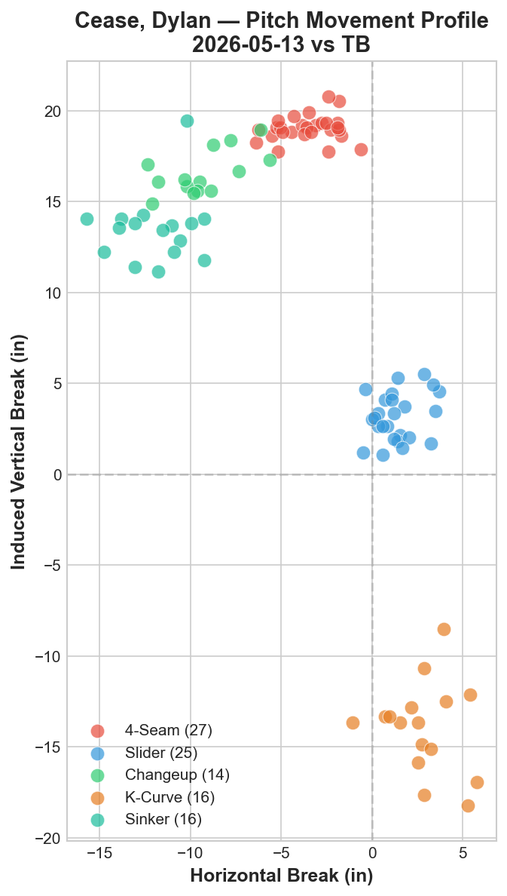
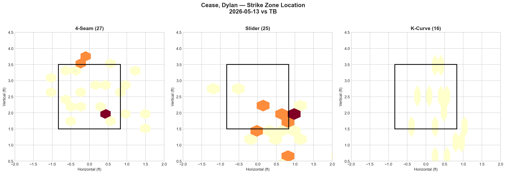
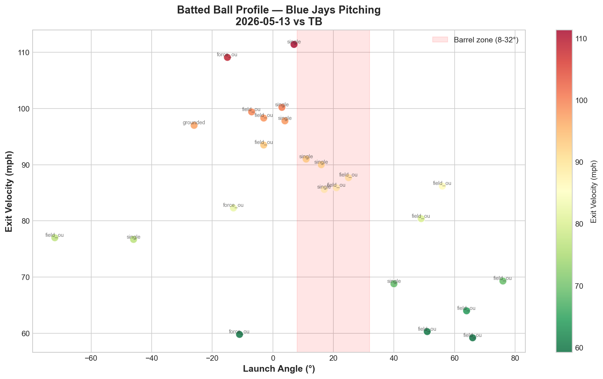

# Blue Jays Game Report: May 13, 2026

**Tampa Bay Rays @ Toronto Blue Jays** | Rogers Centre, Toronto (Home)

| | 1 | 2 | 3 | 4 | 5 | 6 | 7 | 8 | 9 | 10 | **R** | **H** | **E** |
|---|---|---|---|---|---|---|---|---|---|---|---|---|---|
| TB | 0 | 0 | 0 | 0 | 0 | 0 | 1 | 0 | 0 | 2 | **3** | **8** | **0** |
| **TOR** | 0 | 0 | 0 | 0 | 0 | 0 | 0 | 1 | 0 | 4 | **5** | **6** | **0** |

**W: Jeff Hoffman** | L: Aaron Brooks

Blue Jays pitching: 156 pitches / 10.0 IP | Team ERA: 1.80

---

## Starting Pitcher: Dylan Cease (R)

**99 pitches | 7.0 IP | 3 H | 1 ER | 3 BB | 9 K | ERA: 1.29**

### Pitch Arsenal

| Pitch | Count | Usage % | Avg Velo | H-Break (in) | V-Break (in) |
|-------|-------|---------|----------|--------------|--------------|
| Four-seam (FF) | 27 | 27.3% | 97.9 mph | -3.5 | +19.0 |
| Slider (SL) | 25 | 25.3% | 89.4 mph | +1.4 | +3.2 |
| Sinker (SI) | 16 | 16.2% | 96.9 mph | -12.0 | +13.5 |
| K-Curve (KC) | 16 | 16.2% | 83.0 mph | +2.8 | -13.9 |
| Changeup (CH) | 14 | 14.1% | 83.4 mph | -9.3 | +16.6 |
| Sweeper (ST) | 1 | 1.0% | — | — | — |

### Pitching Analysis

Dylan Cease delivered exactly the outing the Blue Jays needed: 7 innings, 3 hits, 1 earned run, 9 strikeouts on 99 pitches. After back-to-back starts where Gausman (5 IP) and Corbin (4.1 IP) failed to go deep, Cease gave the bullpen the reset it desperately needed — and did so against the hottest team in baseball.

The movement chart tells the story of why Cease is elite: **five distinct vertical tiers.** The four-seam sits at +19.0 IVB, the changeup at +16.6, the sinker at +13.5, the slider at +3.2, and the knuckle curve drops to -13.9. That's a 33-inch vertical spread from top to bottom — hitters are tracking five different planes of approach on every at-bat. Compare this to Corbin's compressed arsenal (everything between -2.8 and +15.7 IVB) or Gausman's binary FF/FS structure, and the difference is immediately apparent.

The velocity profile adds another layer of deception. Cease operates with a 97.9 mph four-seam and 96.9 mph sinker at the top, then drops to 89.4 (slider), 83.4 (changeup), and 83.0 (K-curve). That's a 15-mph velocity gap between his fastest and slowest offerings — enough to disrupt timing on every pitch sequence.

The pitch mix was remarkably balanced: no single pitch exceeded 27.3% usage. Cease used his four-seam (27.3%) and slider (25.3%) as primary weapons, with the sinker (16.2%), knuckle curve (16.2%), and changeup (14.1%) all contributing meaningfully. This five-pitch diversity is what makes Cease nearly impossible to game-plan against — there is no single pitch to sit on.

---

## Strike Zone Heat Map

The zone heat maps reveal Cease's command precision across his three most-used pitches:

**Four-seam (27 pitches):** Concentrated in two distinct clusters — up-and-in around 3.5 ft vertical (above the zone, designed to generate swings-and-misses on elevated heat) and down-and-center around 2.0 ft (in the lower strike zone for called strikes). The vertical separation between clusters creates a two-level fastball attack that keeps hitters off-balance.

**Slider (25 pitches):** Targeted at the bottom of the zone and below, ranging from 1.5 to 2.5 ft vertical. The clustering around the lower-right quadrant (from the catcher's perspective) indicates Cease was burying sliders to lefties' back foot — exactly where the pitch generates the most swing-and-miss. Several sliders dipped below the zone, functioning as effective chase pitches.

**K-Curve (16 pitches):** Distributed across a vertical range from just above the zone to well below it. The pitch's -13.9 IVB (the only pitch with negative vertical break) means it looks like a fastball out of the hand and then falls off a cliff. The zone chart shows Cease landing several K-curves at the knees and below — prime strikeout territory.

---

## LHB/RHB Splits

| Stand | Pitches | Avg Velo | Swinging Strikes | Whiff/Pitch % |
|-------|---------|----------|-----------------|---------------|
| L | 80 | 90.8 | 11 | 13.8% |
| R | 19 | 91.6 | 0 | 0.0% |

The platoon splits reveal that Tampa Bay stacked heavily left-handed against Cease — 80 of 99 pitches (80.8%) were thrown to lefties. This reflects the Rays' lineup construction (Simpson, Aranda, Fraley, Feduccia, Palacios — all LHB or switch-hitters batting left).

Against left-handed hitters, Cease was devastating: **13.8% whiff rate with 11 swinging strikes.** His ability to sequence the sinker (arm-side run) with the slider (glove-side break) creates a horizontal tunnel that lefties struggled to identify. The changeup at +16.6 IVB provides another arm-side option that mirrors the fastball's trajectory before fading down — a classic LHB-killer.

The 0.0% whiff rate against righties is notable but context-dependent: only 19 pitches to RHB in the entire outing, reflecting the Rays' lineup stacking rather than a vulnerability. Cease's knuckle curve (-13.9 IVB) and slider (+3.2 IVB) provide two breaking ball options against same-side hitters.

---

## Count-Based Pitch Sequencing

| Count Situation | Pitches | Primary Pitch | Secondary | Third |
|----------------|---------|---------------|-----------|-------|
| First pitch (0-0) | 27 | 4-Seam 33.3% | K-Curve 22.2% | Slider 18.5% |
| Ahead (0-1, 0-2, 1-2) | 28 | 4-Seam 25.0% / CH 25.0% | Sinker 21.4% | KC/SL 14.3% |
| Behind (1-0, 2-0, 3-0, 2-1, 3-1) | 18 | Slider 33.3% | 4-Seam 27.8% / KC 27.8% | Sinker 11.1% |
| Even (1-1, 2-2) | 22 | 4-Seam 27.3% / SL 27.3% | Sinker 22.7% | CH 18.2% |
| Full count (3-2) | 4 | Slider 100% | — | — |

**Scouting observations:**

1. **First pitch: four-seam dominant but unpredictable** — 33.3% four-seam on 0-0 is the highest single-pitch usage, but it still leaves nearly 70% uncertainty. The K-curve at 22.2% as a first-pitch weapon is particularly bold — an 83 mph curveball as a first-pitch strike sets a completely different timing expectation than the 98 mph heater.

2. **Ahead counts show true five-pitch balance** — no pitch exceeds 25% when Cease is ahead. The 4-seam and changeup tie at 25%, sinker at 21.4%, with KC and SL at 14.3% each. This is scouting-proof sequencing: there is literally no pitch to eliminate when behind in the count.

3. **Behind counts favor the slider (33.3%)** — counterintuitive for most pitchers who lean on fastballs when behind, Cease trusts his slider even in pitcher-unfriendly counts. The K-curve also appears at 27.8% behind — he's throwing offspeed when most pitchers would go fastball. This willingness to throw breaking balls in hitter's counts is what generates the swing-and-miss.

4. **Full count: 100% slider (4 pitches)** — this is a stark departure from Gausman's 100% four-seam on 3-2. Where Gausman becomes completely predictable in full counts, Cease goes to his put-away pitch. All four full-count sliders — and the Rays were unable to adjust.

**Strikeout pitches (9 K's):** SI 4, FF 2, SL 2, CH 1 — the sinker led all strikeout pitches, which is unusual. Cease is generating swinging strikes with a 97 mph pitch that dives arm-side, suggesting hitters are gearing up for the high four-seam and getting caught by the sinker's downward plane.

---

## Batter-by-Batter Breakdown: Top Opposing Hitters

| Batter | Pitches | Hits | K | BB | Avg Exit Velo |
|--------|---------|------|---|-----|---------------|
| Jonathan Aranda | 15 | 1 | 1 | 1 | 73.6 mph |
| Hunter Feduccia | 15 | 0 | 3 | 0 | 61.4 mph |
| Jake Fraley | 15 | 0 | 2 | 1 | 64.9 mph |
| Junior Caminero | 12 | 1 | 0 | 0 | 100.3 mph |
| Richie Palacios | 12 | 1 | 2 | 0 | 88.4 mph |

### 1. Hunter Feduccia — Completely Dominated (15 pitches, 0 H, 3 K)

**Pitches faced:** FF 6, SL 5, CH 2, SI 1, KC 1
**Results:** 3 whiffs, 4 fouls, 5 called strikes, 3 balls, 0 in play
**Outcomes:** strikeout, strikeout, strikeout

This is what total dominance looks like. Feduccia faced 15 pitches and struck out all three times. He never put a single ball in play. The pitch breakdown shows Cease attacked primarily with the four-seam (6) and slider (5), generating 3 whiffs and 5 called strikes. The 61.4 mph average exit velocity (on foul balls) suggests even his contact was weak. Feduccia was unable to identify any pitch in the zone — frozen on called strikes and swinging through everything else.

### 2. Jake Fraley — Neutralized (15 pitches, 0 H, 2 K, 1 BB)

**Pitches faced:** KC 4, SL 3, CH 3, SI 2, FF 2, ST 1
**Results:** 2 whiffs, 3 fouls, 4 called strikes, 6 balls, 0 in play
**Outcomes:** walk, strikeout, strikeout

Fraley also never put a ball in play against Cease. The pitch mix was heavily offspeed — K-curve (4), slider (3), changeup (3) accounted for 10 of 15 pitches. Cease clearly identified Fraley as vulnerable to breaking balls and attacked accordingly. The one walk came on a patient at-bat, but the two strikeouts show Cease's ability to adjust.

### 3. Jonathan Aranda — Mixed Results (15 pitches, 1 H, 1 K, 1 BB)

**Pitches faced:** FF 5, KC 4, SL 3, CH 2, SI 1
**Results:** 1 whiff, 1 foul, 4 called strikes, 8 balls, 1 in play
**Outcomes:** walk, single, strikeout

Aranda was the most competitive hitter against Cease, managing a single and drawing a walk. The 8 balls out of 15 pitches indicate Cease had more difficulty locating against him — the four-seam heavy approach (5 FF) suggests Cease tried to establish the heater but couldn't find the zone consistently. Still, the strikeout shows Cease found a way to finish one at-bat.

---

## Batted Ball Profile (All Blue Jays Pitching)

| Metric | Value |
|--------|-------|
| Total balls in play | 24 |
| Avg exit velocity | 84.6 mph |
| Avg launch angle | 12.9° |
| Hard hit (95+ mph) | 7/24 (29%) |

The batted ball profile shows a massive improvement from the previous two games. Compare to yesterday's numbers:

| Metric | May 12 (Corbin) | May 13 (Cease) | Change |
|--------|----------------|----------------|--------|
| Balls in play | 34 | 24 | -10 |
| Avg exit velo | 88.1 mph | 84.6 mph | -3.5 mph |
| Hard hit % | 38% | 29% | -9pp |

Cease reduced the total balls in play by 10 (more strikeouts, fewer contact at-bats), lowered the average exit velocity by 3.5 mph, and cut the hard-hit rate from 38% to 29%. The scatter chart shows most contact clustered at lower exit velocities (70-90 mph range) with limited damage in the barrel zone. The few hard-hit balls (95+ mph) were mostly field outs or groundouts — exactly the type of manageable contact a dominant starter produces.

---

## Bullpen Performance

| Pitcher | IP | Pitches | K | BB | H | ER | ERA |
|---------|-----|---------|---|-----|---|-----|------|
| Jeff Hoffman (W) | 1.0 | 18 | 0 | 0 | 2 | 1 | 9.00 |
| Tyler Rogers | 0.2 | 14 | 1 | 1 | 1 | 0 | 0.00 |
| Louis Varland | 1.0 | 23 | 2 | 1 | 2 | 0 | 0.00 |
| Mason Fluharty | 0.1 | 2 | 0 | 0 | 0 | 0 | 0.00 |

With Cease going 7 strong, the bullpen only needed 3 innings — a huge relief after the 10.2 combined innings over the previous two days. Hoffman surrendered 2 hits and an earned run in the 10th but earned the win when the offense exploded for 4 runs in the bottom of the inning. Varland continues to impress with 2 strikeouts in a clean inning. Fluharty needed only 2 pitches to record the final out.

---

## Offensive Summary

| Batter | Pos | AB | H | HR | RBI | BB | R | XBH |
|--------|-----|----|---|----|-----|----|---|-----|
| Daulton Varsho | CF | 5 | 1 | 1 | 4 | 1 | 1 | 1 (HR) |
| Jesús Sánchez | RF | 2 | 2 | 0 | 0 | 0 | 0 | 0 |
| Ernie Clement | 2B | 4 | 1 | 0 | 0 | 0 | 0 | 0 |
| Andrés Giménez | SS | 4 | 1 | 0 | 0 | 0 | 0 | 0 |
| Yohendrick Piñango | LF | 5 | 1 | 0 | 0 | 1 | 0 | 0 |
| George Springer | DH | 5 | 0 | 0 | 0 | 2 | 2 | 0 |
| Vladimir Guerrero Jr. | 1B | 5 | 0 | 0 | 0 | 3 | 1 | 0 |
| Kazuma Okamoto | 3B | 5 | 0 | 0 | 1 | 2 | 1 | 0 |

**Team hitting:** .214 AVG | .425 OBP | .746 OPS | 1 XBH

**The Daulton Varsho Game.** After going 0-for-4 with nothing to show in yesterday's loss, Varsho delivered the defining moment of the series: a **walk-off grand slam** in the 10th inning off Aaron Brooks that turned a 1-1 extras situation into a 5-3 victory. Four RBI on one swing — the kind of moment that can change a season's trajectory.

The team OBP of .425 is the real story of the offensive approach tonight. Despite hitting only .214, the Blue Jays drew **10 walks** (Vladdy 3, Okamoto 2, Springer 2, Varsho 1, Piñango 1, Straw 1). This is a complete reversal from the previous two games' aggressive, swing-first approach. The patience paid off in the 10th: Brooks walked Springer and Vladdy to load the bases before Varsho's grand slam.

Griffin Jax held the Jays scoreless for 5 innings on just 66 pitches — exactly the efficient outing we expected from a stretched reliever. But the lineup's discipline kept the game close enough for extras, and when Brooks entered in the 10th with control issues (2 BB in 0.1 IP), the dam broke.

---

## Game Narrative & Series Context

This game encapsulated the entire TB series in microcosm: elite opposing pitching (Jax 5 IP, 0 ER), Toronto's offense struggling to generate runs through conventional means, and the game ultimately decided in extras.

But the critical difference was Dylan Cease.

Where Gausman (5 IP) and Corbin (4.1 IP) couldn't go deep enough to protect the bullpen, Cease's 7-inning gem changed the equation. He gave up 1 run on 3 hits while striking out 9 — a quality start in every sense. The bullpen, which had worked 10.2 innings over the previous two days, only needed 3 innings to close this one out.

**Tampa Bay Series Summary (May 11-13):**

| Game | Starter | IP | ER | K | Result |
|------|---------|----|----|---|--------|
| May 11 | Gausman | 5.0 | 5 | 5 | L 5-8 |
| May 12 | Corbin | 4.1 | 3 | 1 | L 6-7 (10) |
| May 13 | Cease | 7.0 | 1 | 9 | **W 5-3 (10)** |

The trend is clear: when the starter goes deep and limits damage, the Blue Jays can compete. Cease's 99-pitch, 7-inning masterclass is the blueprint.

---

## Key Takeaways

1. **Cease is the ace — and it's not close.** 7 IP, 1 ER, 9 K against the hottest team in baseball. His five-pitch arsenal with 33 inches of vertical spread is scouting-proof. The 100% slider on 3-2 counts (vs Gausman's 100% four-seam) shows a pitcher who trusts every offering in every situation.

2. **The plate discipline in this game was transformative.** 10 walks drawn by the offense created the conditions for the 10th-inning rally. Vladdy's 3 BB without a hit demonstrates the right approach — take what the pitcher gives you and wait for your pitch.

3. **Varsho's grand slam changes the narrative.** After going 0-for-9 combined over the previous two games, Varsho delivered the biggest hit of the homestand. Clutch performance in extras separates good players from impact players.

4. **Feduccia is the hitter to attack in future matchups.** Three strikeouts, zero balls in play, 61.4 mph average exit velocity. Cease's plan against Feduccia — four-seam up, slider down — is a blueprint that the rest of the staff should study.

5. **The Blue Jays avoided the sweep and stopped the Rays' run at 16-of-18.** In the context of an 18-24 season, avoiding 0-6 against your division leader is psychologically significant heading into Detroit.

---

*Report generated using MLB Statcast data via pybaseball. Full analysis notebook available in the repository.*
