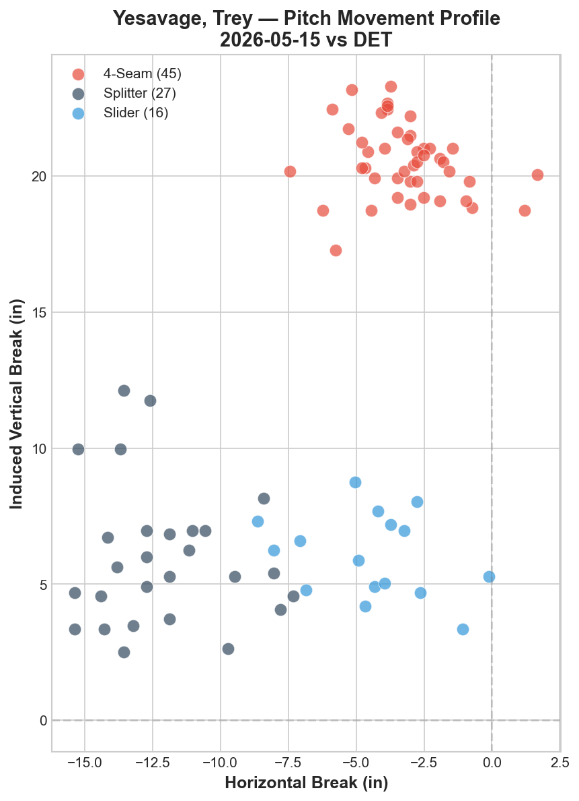
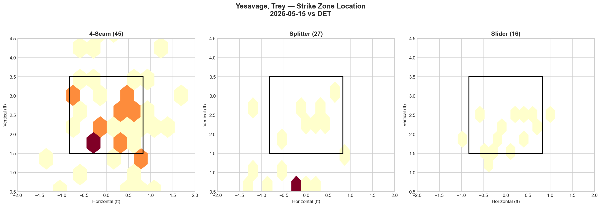
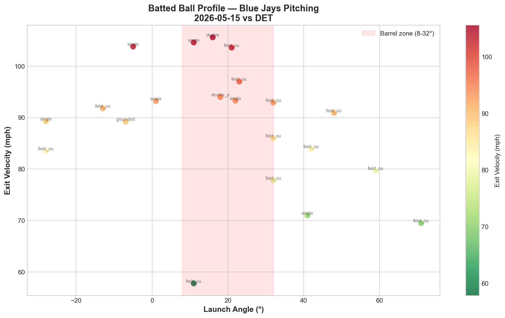

# Blue Jays Game Report: May 15, 2026

**Toronto Blue Jays @ Detroit Tigers** | Comerica Park, Detroit (Away)

| | 1 | 2 | 3 | 4 | 5 | 6 | 7 | 8 | 9 | **R** | **H** | **E** |
|---|---|---|---|---|---|---|---|---|---|---|---|---|
| **TOR** | 0 | 2 | 0 | 0 | 0 | 0 | 0 | 0 | 0 | **2** | **5** | **1** |
| DET | 0 | 0 | 1 | 0 | 0 | 1 | 0 | 0 | 1 | **3** | **7** | **0** |

**L: Jeff Hoffman** | W: Kenley Jansen | Blue Jays fall to 19-25

Blue Jays pitching: 135 pitches / 8.2 IP

---

## Starting Pitcher: Trey Yesavage (R)

**88 pitches | 6.0 IP | 4 H | 2 ER | 3 BB | 6 K | ERA: 1.47**

### Pitch Arsenal

| Pitch | Count | Usage % | Avg Velo | H-Break (in) | V-Break (in) |
|-------|-------|---------|----------|--------------|--------------|
| Four-seam (FF) | 45 | 51.1% | 93.7 mph | -3.2 | +20.6 |
| Splitter (FS) | 27 | 30.7% | 82.2 mph | -12.1 | +6.0 |
| Slider (SL) | 16 | 18.2% | 87.7 mph | -4.5 | +6.1 |

### Pitching Analysis

Trey Yesavage delivered a quality start in his fourth major league outing — 6 innings, 4 hits, 2 earned runs, 6 strikeouts on 88 pitches. The ERA ticked up from 0.68 to 1.47, but make no mistake: this was a dominant performance wasted by an offense that scored 2 runs and nothing more.

Yesavage operates with a stripped-down, three-pitch arsenal: four-seam (51.1%), splitter (30.7%), and slider (18.2%). Where Cease works with five pitches and Gausman with a binary FF/FS system, Yesavage sits in between — three distinct offerings with massive vertical separation.

The movement chart is remarkably clean. The four-seam sits at +20.6 IVB — one of the highest induced vertical break numbers on the staff — creating the perception of a "rising" fastball at 93.7 mph. The splitter drops to +6.0 IVB with -12.1 inches of arm-side run, mimicking the fastball out of the hand before diving below the zone. That's a **14.6-inch vertical gap** between the four-seam and splitter on the same arm-side trajectory — hitters must decide whether the ball will stay at the top of the zone (FF) or drop out the bottom (FS) before it's physically possible to read the spin.

The slider at +6.1 IVB and -4.5 horizontal break sits in a completely different quadrant from both the fastball and splitter, giving Yesavage a third look that prevents hitters from simply timing the FF-FS tunnel.

The overall whiff numbers confirm the arsenal's effectiveness: **17 swinging strikes on 88 pitches — a 19.3% whiff rate.** Compare this to the rotation:

| Starter | Whiff Rate | Pitch Count |
|---------|-----------|-------------|
| Yesavage (5/15) | 19.3% | 3 pitches |
| Cease (5/13) | 11.1% | 5 pitches |
| Corbin (5/12) | 4.7% | 5 pitches |
| Gausman (5/11) | — | 2 pitches |

Yesavage generated the highest per-pitch whiff rate of any Blue Jays starter this week — with three pitches, not five. The simplicity is the weapon.

---

## Strike Zone Heat Map

**Four-seam (45 pitches):** Distributed across the entire strike zone with heavy concentrations at two vertical levels — up around 3.0-3.5 ft (elevated heat) and down at 1.5-2.0 ft (low fastballs for called strikes and groundballs). The horizontal spread covers both corners of the plate, indicating Yesavage was working both sides. The clustering at the lower portion of the zone is intentional: setting up the splitter by establishing the fastball in the same arm-side location.

**Splitter (27 pitches):** Almost entirely concentrated below the strike zone, with a tight cluster around 0.7-0.8 ft vertical. This is textbook splitter execution — the pitch starts on the same plane as the low four-seam and then drops out of the zone. The tight clustering below the zone explains the high whiff rate: hitters committed to swinging at what looked like a hittable fastball and found air instead.

**Slider (16 pitches):** Scattered across the lower half of the zone and glove-side, providing the horizontal element that the FF-FS tunnel lacks. The slider sits at roughly the same vertical plane as the splitter (+6.1 vs +6.0 IVB) but breaks to the opposite side — giving hitters a lateral decision to make on top of the vertical one.

---

## LHB/RHB Splits

| Stand | Pitches | Avg Velo | Swinging Strikes | Whiff/Pitch % |
|-------|---------|----------|-----------------|---------------|
| L | 50 | 88.0 | 8 | 16.0% |
| R | 38 | 90.6 | 9 | 23.7% |

This is the most encouraging split of the entire week. **Yesavage generated elite whiff rates against both sides of the plate** — 16.0% vs LHB and 23.7% vs RHB. Detroit sent a left-heavy lineup (McGonigle, Greene, Keith, Vierling switch), and Yesavage handled them with 8 swinging strikes in 50 pitches.

The 23.7% whiff rate against righties is exceptional. The splitter's arm-side run (-12.1 inches horizontal) moves away from RHB, creating a chase pitch that same-side hitters can't lay off. This is the opposite of Corbin's problem — where Corbin generated just 2.9% whiff against RHB, Yesavage nearly touches 24%.

---

## Count-Based Pitch Sequencing

| Count Situation | Pitches | Primary Pitch | Secondary | Third |
|----------------|---------|---------------|-----------|-------|
| First pitch (0-0) | 24 | 4-Seam 58.3% | Splitter 25.0% | Slider 16.7% |
| Ahead (0-1, 0-2, 1-2) | 21 | Splitter 52.4% | 4-Seam 33.3% | Slider 14.3% |
| Behind (1-0, 2-0, 3-0, 2-1, 3-1) | 23 | 4-Seam 56.5% | Slider 26.1% | Splitter 17.4% |
| Even (1-1, 2-2) | 16 | 4-Seam 56.2% | Splitter 31.2% | Slider 12.5% |
| Full count (3-2) | 4 | 4-Seam 50.0% | Slider 25.0% | Splitter 25.0% |

**Scouting observations:**

Yesavage's sequencing is built on one principle: **fastball to establish, splitter to finish.**

1. **First pitch: fastball dominant (58.3%)** — Yesavage wants strike one with his four-seam. But the 25% splitter on 0-0 adds uncertainty: one in four first pitches is a diving splitter that hitters aren't expecting. This keeps the first-pitch swing rate honest.

2. **Ahead counts flip to splitter (52.4%)** — when Yesavage gets ahead, the splitter becomes the primary weapon. This is the put-away pitch — 52.4% usage when ahead, designed to generate chases below the zone. The 33.3% four-seam in ahead counts acts as a change-of-eye: after showing the splitter diving down, the elevated four-seam looks even higher.

3. **Behind counts return to four-seam (56.5%)** — when behind, Yesavage leans on velocity to get back into counts. But the slider jumps to 26.1% when behind — a surprising choice that shows confidence in his breaking ball even in hitter's counts.

4. **Full count: all three pitches in play** — FF 50%, SL 25%, FS 25%. Unlike Gausman (100% FF on 3-2) or Cease (100% SL on 3-2), Yesavage remains unpredictable in full counts. Small sample (4 pitches), but the willingness to go offspeed on 3-2 is notable for a 22-year-old.

**Strikeout pitches (6 K's):** FF 4, FS 2 — the four-seam was the primary strikeout weapon, not the splitter. This suggests Yesavage is freezing hitters with elevated four-seams for called strike three after establishing the splitter as a chase pitch below the zone. The sequencing works both directions: splitter makes the fastball look higher, fastball makes the splitter look lower.

---

## Batter-by-Batter Breakdown: Top Opposing Hitters

| Batter | Pitches | Hits | K | BB | Avg Exit Velo |
|--------|---------|------|---|-----|---------------|
| Kevin McGonigle | 14 | 0 | 0 | 1 | 83.1 mph |
| Riley Greene | 13 | 1 | 1 | 0 | 94.5 mph |
| Dillon Dingler | 11 | 2 | 0 | 1 | 98.5 mph |
| Matt Vierling | 11 | 0 | 1 | 0 | 83.2 mph |
| Colt Keith | 10 | 1 | 1 | 0 | 74.7 mph |

### 1. Kevin McGonigle — Contained Despite Command Struggles (14 pitches, 0 H)

**Pitches faced:** FF 9, FS 5
**Results:** 1 whiff, 1 foul, 2 called strikes, 8 balls, 2 in play
**Outcomes:** double_play, walk, field_out

McGonigle saw the most pitches of any Detroit hitter and came away hitless. The 8 balls in 14 pitches reveals Yesavage's command wavered against the leadoff man — he walked McGonigle once — but the double play erased a baserunner, and the approach was straightforward: fastball and splitter only, no slider. The field out in the third at-bat shows Yesavage adjusted.

### 2. Riley Greene — The Dangerous One (13 pitches, 1 H, 1 2B)

**Pitches faced:** FS 10, FF 3
**Results:** 3 whiffs, 2 fouls, 1 called strike, 5 balls, 2 in play
**Outcomes:** double, field_out, strikeout

Greene was the most competitive hitter against Yesavage and the most concerning. The pitch mix tells the story: **10 of 13 pitches were splitters.** Yesavage clearly identified Greene as a splitter target and went after him relentlessly. The 3 whiffs and 1 strikeout show the approach worked twice, but Greene's double (94.5 mph exit velo) proves he can square up the splitter when Yesavage leaves it in the zone. This is the scouting note for the next start: Greene has seen 10 splitters and has the timing figured out.

### 3. Dillon Dingler — The Damage Source (11 pitches, 2 H, 1 BB)

**Pitches faced:** FF 6, SL 3, FS 2
**Results:** 1 whiff, 1 foul, 2 called strikes, 5 balls, 2 in play
**Outcomes:** single, single, walk

Dingler was the one hitter Yesavage couldn't solve. Two singles and a walk in three plate appearances, with a 98.5 mph average exit velocity — the hardest contact of any Detroit hitter. The pitch mix was more balanced (FF 6, SL 3, FS 2), suggesting Yesavage tried multiple approaches. But Dingler reached base in all three PAs, creating a problem that Yesavage's stuff couldn't overcome with command alone.

---

## Batted Ball Profile (All Blue Jays Pitching)

| Metric | Value |
|--------|-------|
| Total balls in play | 21 |
| Avg exit velocity | 88.5 mph |
| Avg launch angle | 19.0° |
| Hard hit (95+ mph) | 5/21 (24%) |

The batted ball profile is favorable for the pitching staff: 21 balls in play with a 24% hard-hit rate is below league average. The scatter chart shows most contact clustered at moderate exit velocities (80-95 mph) with few balls in the barrel zone at dangerous velocities. The 19.0° average launch angle is slightly elevated, suggesting some fly ball contact, but the limited hard-hit rate means these were mostly harmless fly outs rather than extra-base threats.

**Pitching staff comparison across the last 4 games:**

| Game | Hard Hit % | Avg EV | Balls in Play |
|------|-----------|--------|---------------|
| Gausman 5/11 | — | — | — |
| Corbin 5/12 | 38% | 88.1 | 34 |
| Cease 5/13 | 29% | 84.6 | 24 |
| Yesavage 5/15 | 24% | 88.5 | 21 |

The hard-hit rate has improved each game: 38% → 29% → 24%. The pitching staff is trending in the right direction.

---

## Bullpen Performance

| Pitcher | IP | Pitches | K | BB | H | ER | ERA |
|---------|-----|---------|---|-----|---|-----|------|
| Jeff Hoffman (L) | 0.2 | 23 | 2 | 0 | 2 | 1 | 13.50 |
| Braydon Fisher | 1.0 | 10 | 1 | 1 | 0 | 0 | 0.00 |
| Joe Mantiply | 1.0 | 14 | 0 | 0 | 1 | 0 | 0.00 |

**Jeff Hoffman continues to be a concern.** The right-hander entered in the 9th inning protecting a 2-2 tie and surrendered the walk-off hit on 23 pitches. Two hits and an earned run in 0.2 innings — his ERA now sits at 13.50 across his recent appearances. The 2 strikeouts show he still has stuff, but the inability to get the final out in high-leverage situations is a pattern. Hoffman has now allowed the deciding run in two of the last three Blue Jays losses.

Fisher and Mantiply both delivered clean innings in lower-leverage situations, which is encouraging depth but doesn't solve the closer problem.

---

## Offensive Summary

| Batter | Pos | AB | H | HR | RBI | BB | R | XBH |
|--------|-----|----|---|----|-----|----|---|-----|
| Andrés Giménez | SS | 3 | 1 | 0 | 2 | 0 | 0 | 1 (2B) |
| Kazuma Okamoto | 3B | 4 | 1 | 0 | 0 | 0 | 1 | 1 (2B) |
| Jesús Sánchez | RF | 3 | 1 | 0 | 0 | 0 | 0 | 0 |
| Yohendrick Piñango | LF | 4 | 1 | 0 | 0 | 0 | 0 | 0 |
| Brandon Valenzuela | C | 3 | 1 | 0 | 0 | 1 | 0 | 0 |
| George Springer | DH | 4 | 0 | 0 | 0 | 0 | 0 | 0 |
| Daulton Varsho | CF | 3 | 0 | 0 | 0 | 0 | 0 | 0 |
| Ernie Clement | 2B | 3 | 0 | 0 | 0 | 1 | 1 | 0 |
| Vladimir Guerrero Jr. | 1B | 4 | 0 | 0 | 0 | 0 | 0 | 0 |

**Team hitting:** .172 AVG | .226 OBP | .467 OPS | 2 XBH

The offense was the problem. Period.

The Blue Jays scored 2 runs in the 2nd inning on Giménez's RBI double and produced absolutely nothing for the remaining 7 innings. Detroit's pitching staff — a bullpen-day patchwork of Hanifee (1 IP), Madden (0.1 IP), Anderson (4 IP), Burch Smith (2 IP), Hurter (0.2 IP), and Jansen (1 IP) — held Toronto to a .172 average.

The most damning stat: **the Blue Jays went 1-for-4 with runners in scoring position.** Giménez's 2nd-inning double was the only RISP hit. The lineup had opportunities and couldn't convert.

**Vladimir Guerrero Jr. went 0-for-4 again.** He's now 0-for-14 over the last three games (0-for-5 on 5/12, 0-for-5 on 5/13, 0-for-4 tonight). The Jays' best hitter is in a slump at the worst possible time. Springer also went hitless (0-for-4), and Varsho came back to earth (0-for-3) after his walk-off grand slam.

---

## Game Narrative

This was the kind of loss that defines a struggling team. Yesavage gave the Blue Jays everything they needed — 6 innings, 2 earned runs, 6 strikeouts, elite whiff rates from both sides of the plate. A 22-year-old rookie in his fourth career start delivered a quality start on the road at Comerica Park.

And the offense gave him 2 runs.

Detroit cobbled together a bullpen day with six different pitchers, none of whom threw more than 4 innings. Drew Anderson — a journeyman reliever — held the Jays to 1 hit over 4 scoreless innings. The Blue Jays couldn't solve a replacement-level pitching staff that was designed to be exploitable.

The 9th-inning walk-off was the cruelest part. Hoffman entered in a tie game, surrendered two hits, and Detroit celebrated. The Blue Jays are now 19-25, 10 games behind the Rays in the AL East, with the same record as the team that just beat them.

---

## Key Takeaways

1. **Yesavage is the real deal.** Four starts into his major league career: 1.47 ERA, 19.3% whiff rate, elite splits against both LHB and RHB. His three-pitch arsenal (FF/FS/SL) is simple, deceptive, and effective. The FF-FS tunnel — +20.6 to +6.0 IVB on the same trajectory — is among the best vertical separation combos on the staff. He's building innings each start (88 pitches tonight, up from 69 in his debut) and profiles as a front-of-rotation arm alongside Cease.

2. **The offense is in crisis.** .172 AVG / .226 OBP / .467 OPS against a bullpen day. Vladdy is 0-for-14 in three games. The lineup scored 2 runs or fewer in 3 of the last 5 games. The TB series showed flashes (10 walks on 5/13), but the consistency is gone.

3. **Hoffman's high-leverage problem needs a solution.** 13.50 ERA in recent outings with walk-off losses in two of the last three. Whether it's a role change or an IL stint to reset, the current setup isn't working.

4. **Yesavage's 3-2 count diversity is an advanced trait.** At 22, most pitchers default to fastball on full counts. Yesavage threw FF 50%, SL 25%, FS 25% — three-pitch full count at-bats. This kind of sequencing maturity is rare for a rookie and suggests the development plan is well ahead of schedule.

5. **Road record now 6-14.** The Blue Jays are a fundamentally different team away from Rogers Centre. Comerica Park plays big, but the offense's struggles aren't park-related — they're lineup-wide.

---

*Report generated using MLB Statcast data via pybaseball. Full analysis notebook available in the repository.*
