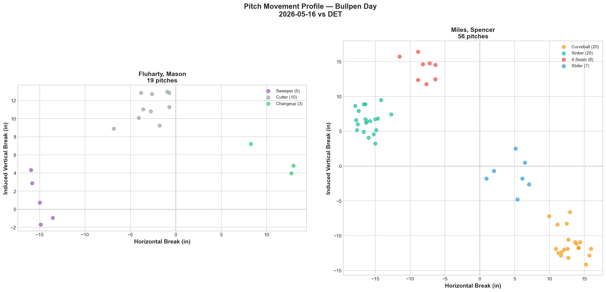
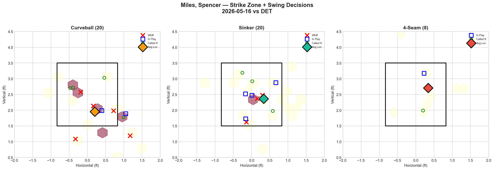
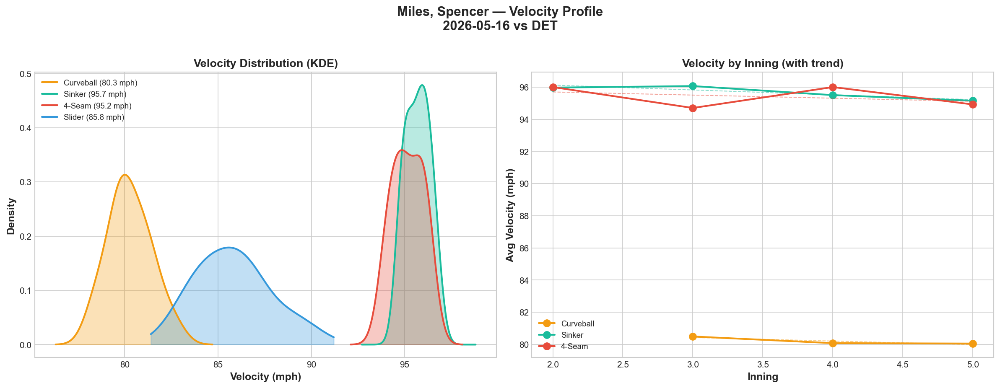
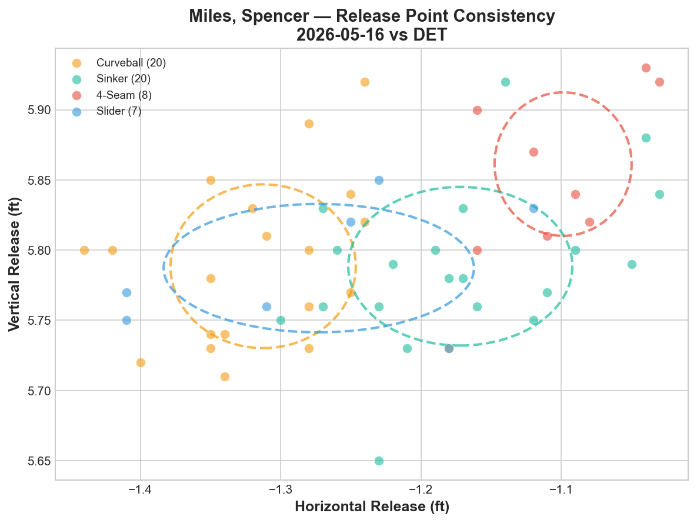
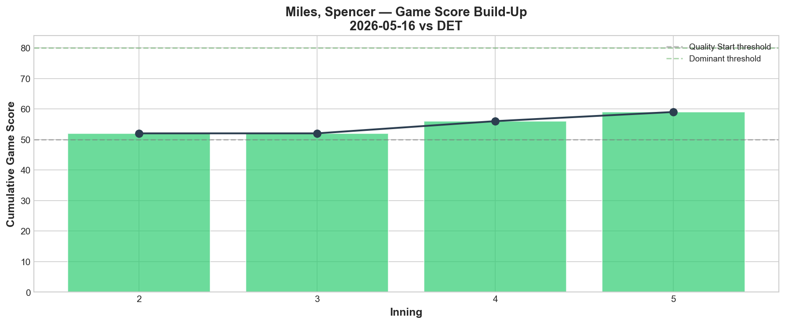
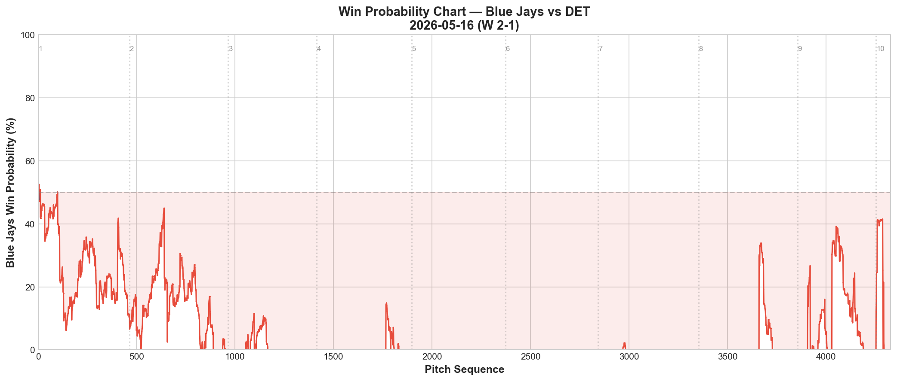
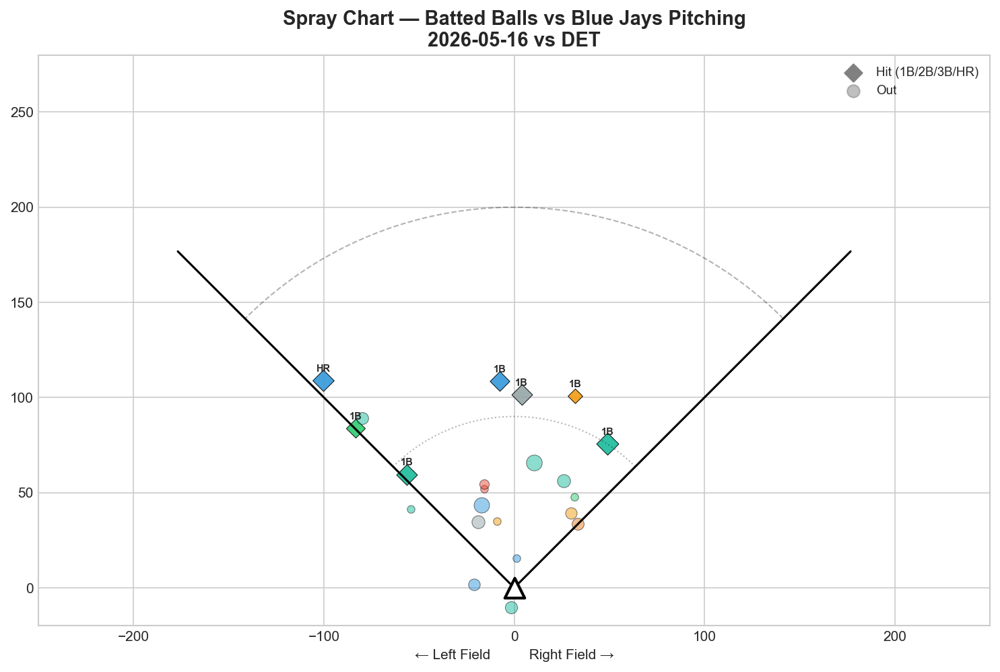
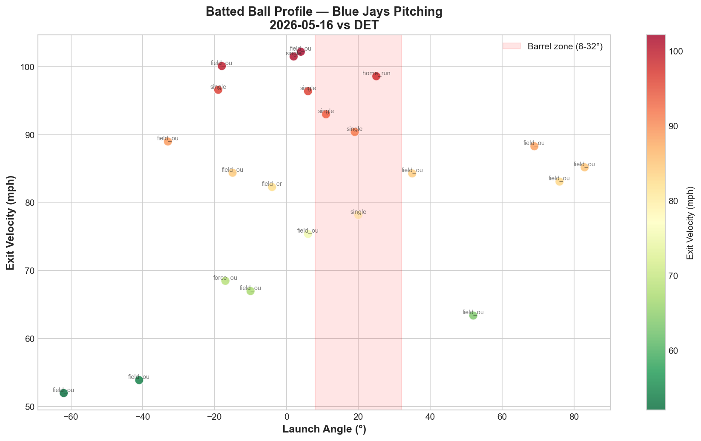

# Blue Jays Game Report v2.0: May 16, 2026

**Toronto Blue Jays @ Detroit Tigers** | Comerica Park, Detroit (Away)

| | 1 | 2 | 3 | 4 | 5 | 6 | 7 | 8 | 9 | 10 | **R** | **H** | **E** |
|---|---|---|---|---|---|---|---|---|---|---|---|---|---|
| **TOR** | 0 | 0 | 0 | 0 | 0 | 0 | 1 | 0 | 0 | 1 | **2** | **5** | **1** |
| DET | 0 | 0 | 0 | 0 | 0 | 1 | 0 | 0 | 0 | 0 | **1** | **7** | **0** |

**W: Louis Varland** | L: Tyler Holton | Blue Jays improve to 20-25

Bullpen Day: Fluharty (opener, 1.1 IP) → Miles (bulk, 3.2 IP) → Nance → Varland → Fisher → Rogers

---

## Opener: Mason Fluharty (L) — 1.1 IP, 18 pitches

### Pitch Arsenal Performance

| Pitch | # | Usage | Velo | Whiff% | CSW% | Chase% | Grade |
|-------|---|-------|------|--------|------|--------|-------|
| Cutter | 10 | 52.6% | 89.1 | 0.0% | 30.0% | 33.3% | 🔴 D |
| Sweeper | 5 | 26.3% | 80.7 | 75.0% | 80.0% | 100.0% | 🟢 A |
| Changeup | 3 | 15.8% | 84.7 | 100.0% | 33.3% | 33.3% | 🟢 A |

Fluharty's 18-pitch opener was a study in contrasts. The cutter was his primary offering at 52.6% usage but generated zero whiffs — functioning purely as a zone pitch for early strikes. The magic came from his secondaries: the sweeper produced a staggering 80% CSW rate with 100% chase rate on pitches outside the zone, and the changeup generated a 100% whiff rate on swings. In 1.1 innings, Fluharty struck out 3 while allowing just 1 hit — a clean handoff to the bulk arm.

**LHB/RHB splits:** 40.0% whiff rate against lefties (5 pitches, 2 swinging strikes) vs 15.4% against righties (13 pitches, 2 swinging strikes). Small sample, but the sweeper was devastatingly effective against same-side hitters.

---

## Bulk Pitcher: Spencer Miles (L) — 3.2 IP, 56 pitches, 5 K, 0 ER

### Pitch Arsenal Performance

| Pitch | # | Usage | Velo | Whiff% | CSW% | Chase% | Grade |
|-------|---|-------|------|--------|------|--------|-------|
| Curveball | 20 | 35.7% | 80.3 | 41.7% | 45.0% | 50.0% | 🟢 A |
| Sinker | 20 | 35.7% | 95.7 | 37.5% | 30.0% | 0.0% | 🟢 A |
| Four-seam | 8 | 14.3% | 95.2 | 0.0% | 12.5% | 33.3% | 🔴 D |
| Slider | 7 | 12.5% | 85.8 | 66.7% | 28.6% | 0.0% | 🟢 A |
| Changeup | 1 | 1.8% | 86.2 | — | — | — | — |

Spencer Miles delivered the outing of his young career: 3.2 scoreless innings with 5 strikeouts on just 56 pitches. The arsenal tells the story of a pitcher who attacks with two primary weapons — curveball and sinker at identical 35.7% usage — creating a devastating high-low attack.

The curveball was elite: 41.7% whiff rate, 45.0% CSW, 50.0% chase rate. At 80.3 mph with -11.2 IVB, it drops off the table when paired with the 95.7 mph sinker that sits at +6.5 IVB. That's a **17.7-inch vertical gap** between the two pitches thrown at identical usage rates — hitters had no idea whether the next pitch would be at their eyes or their shoelaces.

The sinker was equally impressive: 37.5% whiff rate at 95.7 mph is extraordinary for a fastball variant. A sinker that generates nearly 4 out of 10 swinging strikes on contact attempts is a pitch with elite arm-side run and late movement.

The slider added a third dimension: 66.7% whiff rate on 7 pitches shows devastating effectiveness, though the small sample means this needs more innings to confirm.

The four-seam (0.0% whiff, 🔴 D grade) was the one weakness — no swing-and-miss generated on 8 pitches. This suggests the four-seam functions primarily as a "show me" pitch to change the eye level, not as a put-away offering.

### Pitch Movement Profile

The movement chart reveals Miles as a true vertical pitcher. The sinker cluster sits at (-16.0 h-break, +6.5 v-break) — maximum arm-side run with moderate rise. The curveball drops to (+13.0 h-break, -11.2 v-break) — the only pitch with significant negative vertical break. The four-seam sits at (-8.1, +14.1) as the highest IVB option, while the slider occupies (+4.7, -1.3) as a horizontal breaking ball.

The key insight: **Miles' curveball and slider break in the same horizontal direction** (glove-side) but at completely different vertical planes (-11.2 vs -1.3 IVB). This creates a glove-side breaking ball ladder that layers on top of the sinker's arm-side run.

### Strike Zone + Swing Decisions

The zone heat map with swing decision overlays reveals Miles' command precision:

**Curveball (20):** Average location sits at the bottom of the zone around 2.0 ft vertical. The X markers (whiffs) cluster below the zone, showing Miles was burying curveballs to generate chases. The □ markers (in play) sit higher in the zone — the few curveballs that stayed up were put in play, confirming the pitch is only effective when it's down.

**Sinker (20):** Average location in the lower-middle zone. Multiple X markers in the zone itself — rare for a fastball, indicating the sinker's late movement is fooling hitters even on hittable locations. The □ markers show contact scattered across the zone.

**Four-seam (8):** Limited usage with the average location on the arm-side edge of the zone. No whiff markers visible — confirming the 0.0% whiff rate and its role as a positioning pitch rather than a strikeout weapon.

### Count-Based Sequencing

| Situation | Pitches | Primary | Secondary |
|-----------|---------|---------|-----------|
| First pitch (0-0) | 15 | Sinker 46.7% | Curveball 26.7% |
| Ahead | 21 | Curveball 42.9% | Slider 23.8% |
| Behind | 9 | Sinker 66.7% | Curveball 22.2% |
| Even | 10 | Curveball 50.0% | Sinker 30.0% |
| Full count (3-2) | 1 | Sinker 100% | — |

**Scouting key:** Miles is a sinker-first pitcher who flips to curveball-dominant when ahead. The 66.7% sinker usage when behind is predictable but understandable given the pitch's effectiveness. The curveball at 42.9% in ahead counts is the put-away weapon — 4 of his 5 strikeouts came on the curveball.

**Strikeout pitches (5 K):** CU 4, SL 1 — the curveball is the primary out pitch.

---

## v2.0 Advanced Analytics

### Velocity Distribution (KDE) + Inning-by-Inning

The KDE plot shows tight, well-separated velocity clusters: the curveball at 80.3 mph, slider at 85.8 mph, and sinker/four-seam band at 95-96 mph. The narrow KDE peaks — especially the sinker's tight distribution around 95.5-96.0 — indicate exceptional velocity consistency.

**Velocity trend across innings:**
- Curveball: 80.5 → 80.0 mph (-0.4 mph) — essentially flat
- Sinker: 96.0 → 95.1 mph (-0.8 mph) — minor, expected decline

The sinker lost less than 1 mph across 3.2 innings, suggesting Miles has more in the tank for longer outings. No fatigue signal detected.

### Release Point Consistency

All four pitch types rated **🟢 Tight** for release point consistency:

| Pitch | H-Spread | V-Spread | Total | Grade |
|-------|----------|----------|-------|-------|
| Curveball | 0.8 in | 0.7 in | 1.1 in | 🟢 Tight |
| Sinker | 1.0 in | 0.7 in | 1.2 in | 🟢 Tight |
| Four-seam | 0.6 in | 0.6 in | 0.8 in | 🟢 Tight |
| Slider | 1.3 in | 0.5 in | 1.4 in | 🟢 Tight |

This is exceptional. Every pitch type released from within 1.4 inches of its average position. The confidence ellipses on the release point chart show tight, overlapping clusters — meaning hitters cannot identify the pitch type from the release point. This is the foundation of effective tunneling.

### Pitch Tunneling Analysis

| Pair | Release Sim | Plate Sep | Tunnel Score | Velo Gap |
|------|------------|-----------|-------------|----------|
| **Curveball/Slider** | **0.5 in** | **8.5 in** | **🟢 17.9** | 5.5 mph |
| Sinker/Slider | 1.2 in | 7.6 in | 🟢 6.3 | 9.9 mph |
| 4-Seam/Slider | 2.3 in | 10.1 in | 🟢 4.5 | 9.3 mph |
| Curveball/4-Seam | 2.7 in | 9.2 in | 🟢 3.4 | 14.9 mph |
| Sinker/4-Seam | 1.2 in | 4.2 in | 🟢 3.4 | 0.5 mph |
| Curveball/Sinker | 1.7 in | 5.1 in | 🟢 3.0 | 15.4 mph |

**🏆 Best Tunnel: Curveball/Slider (score: 17.9)**

This is an elite tunneling score. The curveball and slider are released from virtually the same point (0.5 inches apart) but arrive at the plate 8.5 inches apart — with a 5.5 mph velocity gap. Hitters see the same hand, the same release point, and then the ball diverges in two different directions. This explains the combined 50%+ whiff rate across both pitches.

Every single pitch pair scored 🟢 3.0+ — Miles has no tunneling weakness in his arsenal. The Curveball/Sinker pair (15.4 mph velo gap, 5.1 inches plate separation, same general arm-side trajectory) is the workhorse tunnel: 80 mph diving down vs 96 mph running arm-side, from the same slot.

### Game Score: 56 (🟡 QUALITY)

Miles' Game Score built steadily across his outing: starting at the 50 baseline in the 2nd inning and climbing to 59 by the 5th. No inning dropped below the quality threshold — a sign of consistent, damage-free pitching. The upward trajectory of the Game Score chart shows Miles got better as the game progressed, adding strikeouts without allowing hard contact.

### Win Probability Chart

The WPA chart tells the story of a game that was dominated by pitching on both sides. The Blue Jays' win probability hovered between 30-50% for most of the game, reflecting the road team disadvantage in a scoreless tie.

**Key WPA moments:**
- 📉 Inning 6: Vierling home run — the only run allowed, swinging WP dramatically against Toronto
- 📈 Inning 7: Blue Jays tie it — WP surges back toward 50%
- 📈 Inning 10: Piñango walk-off solo HR — the decisive swing

### Spray Chart

22 total batted balls tracked against Blue Jays pitching: 7 hits (32%). The spray distribution shows Center: 59%, Pull: 18%, Oppo: 23% — Detroit was primarily hitting the ball up the middle, which typically generates weaker contact than pulled balls. The home run by Vierling in the 6th was the only hard-hit ball that found the barrel zone with authority.

---

## Bullpen Performance (Full Game)

| Pitcher | IP | Pitches | K | BB | H | ER | Note |
|---------|-----|---------|---|-----|---|-----|------|
| Mason Fluharty | 1.1 | 18 | 3 | 0 | 1 | 0 | Opener — dominant |
| Spencer Miles | 3.2 | 56 | 5 | 2 | 2 | 0 | Bulk — elite |
| Tommy Nance | 1.0 | 20 | 1 | 0 | 0 | 0 | Clean bridge |
| Louis Varland (W) | 2.0 | 26 | 2 | 0 | 2 | 0 | Gutsy 2 IP for the win |
| Braydon Fisher | 1.0 | 20 | 2 | 0 | 1 | 1 | Solo HR allowed |
| Tyler Rogers | 1.0 | 11 | 1 | 0 | 1 | 0 | Efficient closer |

**Staff ERA: 0.90 | 14 K / 2 BB | WHIP: 0.90**

This was a masterclass in bullpen management. Six pitchers combined for 10 innings, 14 strikeouts, and a 0.90 ERA. The opener-bulk structure worked perfectly: Fluharty set the tone with 3 K in 1.1 IP, Miles absorbed the middle innings with 5 K in 3.2 scoreless, and the back end held firm.

Varland earned the win with 2 gutsy innings — his second consecutive strong outing. Fisher allowed Vierling's solo homer in the 6th — the only blemish — but struck out 2 and limited the damage. Rogers closed with an efficient 11-pitch 10th inning.

---

## Offensive Summary

| Batter | Pos | AB | H | HR | RBI | BB | R | XBH |
|--------|-----|----|---|----|-----|----|---|-----|
| Yohendrick Piñango | LF | 4 | 2 | 1 | 1 | 0 | 1 | 1 (HR) |
| Daulton Varsho | CF | 4 | 2 | 0 | 1 | 1 | 0 | 1 (2B) |
| Lenyn Sosa | 2B | 4 | 1 | 0 | 0 | 0 | 0 | 1 (2B) |
| Vladimir Guerrero Jr. | 1B | 4 | 0 | 0 | 0 | 0 | 1 | 0 |
| George Springer | DH | 4 | 0 | 0 | 0 | 0 | 0 | 0 |
| Kazuma Okamoto | 3B | 4 | 0 | 0 | 0 | 0 | 0 | 0 |
| Andrés Giménez | SS | 3 | 0 | 0 | 0 | 0 | 0 | 0 |

**Team hitting:** .147 AVG | .171 OBP | .465 OPS | 3 XBH

Casey Mize dominated the Blue Jays for 6 innings (71 pitches, 2 H, 0 ER, 4 K), and Detroit's bullpen continued the stranglehold through the 9th. The offense managed just 5 hits in 34 at-bats.

But the two heroes were enough:

**Daulton Varsho** went 2-for-4 with a double and a walk — the most productive offensive player for the second consecutive game. His 7th-inning RBI tied the game at 1-1, keeping the Blue Jays alive for extras.

**Yohendrick Piñango** delivered the decisive blow: a **walk-off solo home run** in the 10th inning off Kyle Finnegan, his second clutch extra-innings hit of the week (after contributing to the 5/13 rally against Tampa Bay). Piñango is becoming the Blue Jays' Mr. October — the player who shows up when the game is on the line.

Vladdy went 0-for-4 again — he's now 0-for-18 over four consecutive games. The slump is approaching crisis territory.

---

## Batter-by-Batter: Top Opposing Hitters vs Fluharty + Miles

| Batter | Pitches | Hits | K | BB | Avg EV |
|--------|---------|------|---|-----|--------|
| Dillon Dingler | 10 | 0 | 1 | 1 | 93.0 |
| Jake Rogers | 10 | 0 | 1 | 1 | 0.0 |
| Kevin McGonigle | 10 | 1 | 1 | 0 | 88.8 |
| Zach McKinstry | 9 | 1 | 0 | 0 | 71.4 |
| Spencer Torkelson | 8 | 0 | 2 | 0 | 79.0 |

**Torkelson completely neutralized:** 8 pitches, 0 hits, 2 strikeouts. The curveball-sinker tunnel was too much for the Tigers' power bat. McGonigle managed a single but also struck out — the Fluharty-Miles tag team kept Detroit's best hitters off-balance throughout.

---

## Batted Ball Profile

| Metric | Value | vs 5/15 |
|--------|-------|---------|
| Total balls in play | 22 | 21 |
| Avg exit velocity | 83.4 mph | 88.5 (-5.1) |
| Avg launch angle | 8.6° | 19.0° (-10.4) |
| Hard hit (95+ mph) | 6/22 (27%) | 5/21 (24%) |

The average exit velocity dropped 5.1 mph from Friday's game — 83.4 mph is well below the league average of ~89 mph. The launch angle dropped dramatically from 19.0° to 8.6°, indicating Detroit was getting on top of pitches and hitting groundballs rather than driving the ball. This is exactly the profile a sinker-curveball pitcher like Miles wants to produce.

---

## Game Narrative

This game was a pitcher's duel that went to extras for the third time in six games. The Blue Jays' bullpen-day strategy — Fluharty as opener, Miles as bulk, then four relievers — produced a combined 0.90 ERA with 14 strikeouts across 10 innings. On the other side, Casey Mize was equally dominant, shutting down the Blue Jays offense for 6 scoreless innings on just 71 pitches.

The game turned on two swings: Matt Vierling's solo homer in the 6th broke the scoreless tie, and Varsho's RBI in the 7th immediately answered. Then, in the 10th, Piñango launched a walk-off homer off Finnegan to steal a road win.

**Detroit Series: 1-1** heading into Sunday's finale. Back-to-back wins after Friday's walk-off loss shows resilience.

---

## Key Takeaways

1. **Spencer Miles has arrived.** 3.2 IP, 0 ER, 5 K with elite tunneling scores across every pitch pair. His curveball-sinker combination (17.7-inch vertical gap at identical usage rates) is one of the most deceptive pitch pairings on the staff. The 🟢 Tight release point consistency across all four pitches means hitters cannot read the pitch out of the hand. He needs a rotation spot.

2. **The Fluharty-Miles opener tandem is a viable strategy.** Fluharty's 3 K in 1.1 IP set the tone, Miles absorbed the bulk, and the back end held. When the rotation can't provide a fifth starter, this structure works — but only if Miles continues pitching at this level.

3. **Piñango is the clutch performer.** Two game-changing hits in extra innings this week (5/13 rally + 5/16 walk-off HR). At 22, he's showing a composure in high-leverage moments that most veterans don't have.

4. **Vladdy's slump is now 0-for-18.** Four consecutive hitless games. The team is winning despite him, which is unsustainable. When (not if) he breaks out, the offense will look completely different.

5. **v2.0 analytics confirm what the eye test suggests:** Miles' 17.9 tunnel score on the curveball/slider pair, combined with 🟢 Tight release points and zero velocity fatigue over 3.2 innings, projects him as a starter-caliber arm, not a bullpen piece.

---

*Report generated using MLB Statcast data via pybaseball. v2.0 analytics: velocity KDE, release point consistency, tunnel scoring, Game Score, WPA, spray chart. Full analysis notebook available in the repository.*
