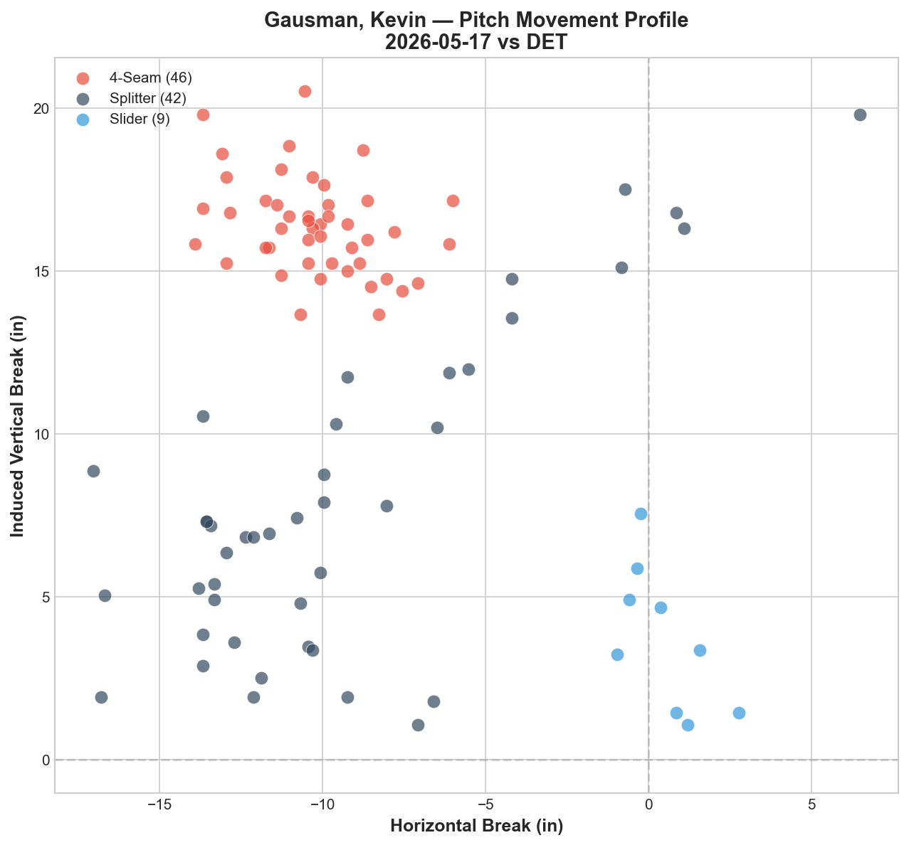
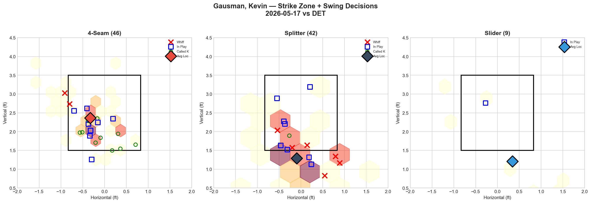
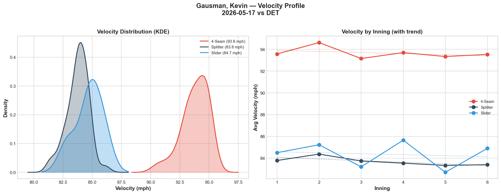
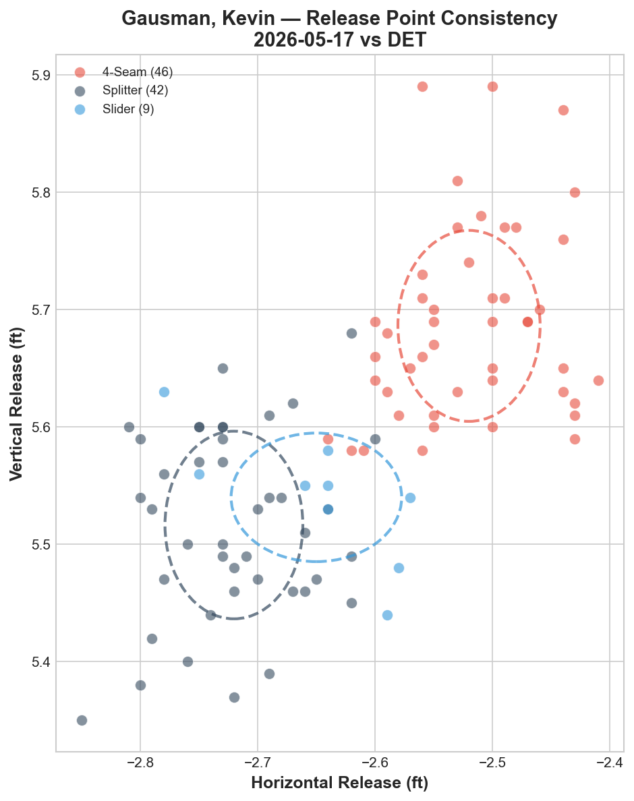
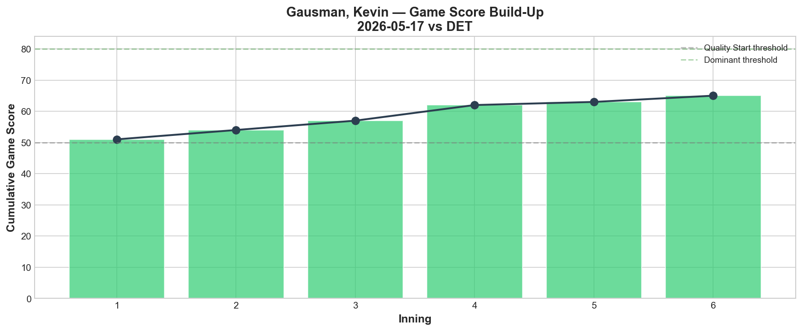
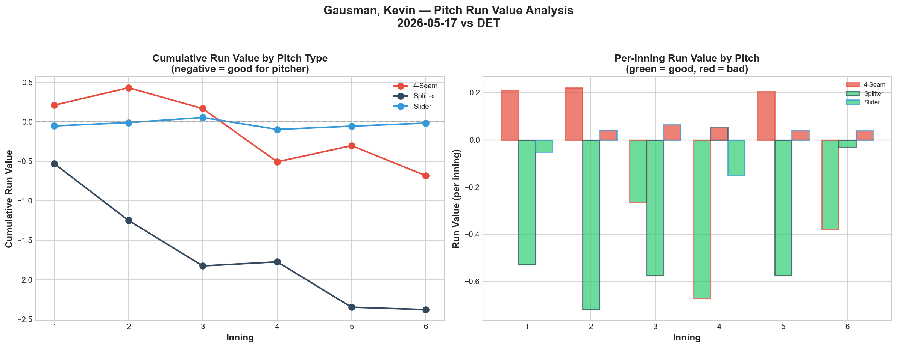
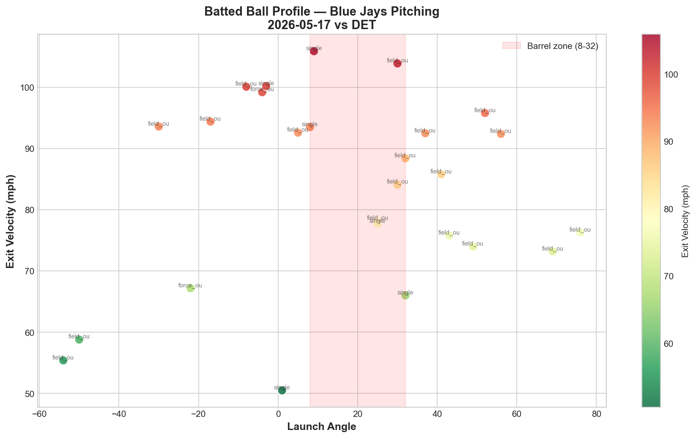
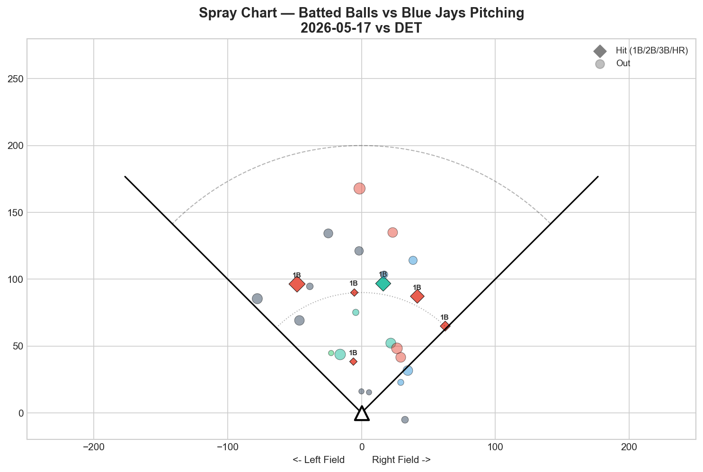
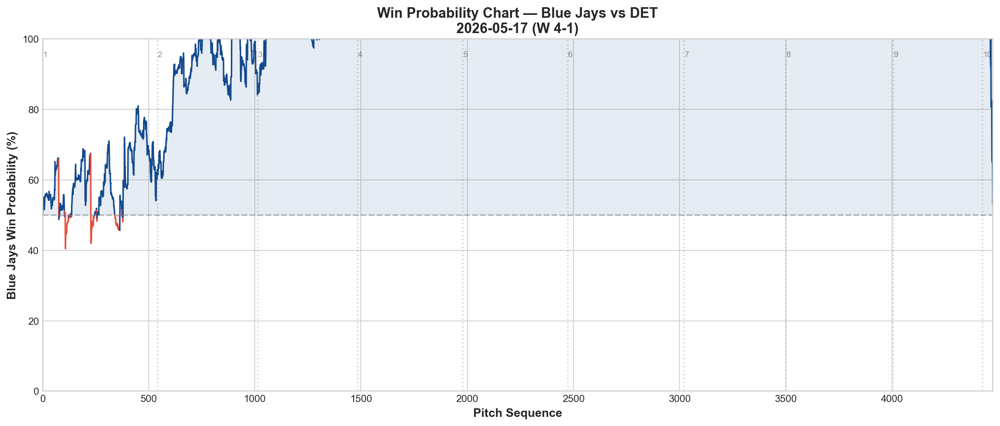

# Blue Jays Game Report v2.1: May 17, 2026

**Toronto Blue Jays @ Detroit Tigers** | Comerica Park, Detroit (Away)

| | 1 | 2 | 3 | 4 | 5 | 6 | 7 | 8 | 9 | **R** | **H** | **E** |
|---|---|---|---|---|---|---|---|---|---|---|---|---|
| **TOR** | 2 | 0 | 2 | 0 | 0 | 0 | 0 | 0 | 0 | **4** | **7** | **0** |
| DET | 0 | 0 | 0 | 0 | 0 | 0 | 0 | 1 | 0 | **1** | **6** | **1** |

**W: Kevin Gausman** | L: Jack Flaherty | SV: Tyler Rogers | Blue Jays improve to 21-25

---

## Starting Pitcher: Kevin Gausman (R)

**97 pitches | 6.0 IP | 4 H | 0 ER | 0 BB | 5 K | Game Score: 62 (🟡 QUALITY)**

### Pitch Arsenal Performance

| Pitch | # | Usage | Velo | Whiff% | CSW% | Chase% | Grade |
|-------|---|-------|------|--------|------|--------|-------|
| Four-seam | 46 | 47.4% | 93.8 | 7.4% | 26.1% | 35.7% | 🔴 D |
| Splitter | 42 | 43.3% | 83.8 | 30.0% | 16.7% | 30.0% | 🟢 A |
| Slider | 9 | 9.3% | 84.7 | 0.0% | 0.0% | 25.0% | 🔴 D |

### Pitching Analysis

Kevin Gausman delivered his best start since April — 6 scoreless innings, 4 hits, 5 strikeouts on 97 pitches against a Detroit lineup that had given the Blue Jays trouble all series. This is the Gausman that Toronto signed: a two-pitch dominant act where the splitter carries the entire arsenal.

The pitch mix was pure Gausman: four-seam (47.4%) and splitter (43.3%) accounted for 90.7% of all pitches, with the slider appearing only 9 times as a change-of-pace offering. This is the binary arsenal that makes Gausman simultaneously elite and vulnerable — when the splitter is working, he's unhittable; when it's not, the four-seam alone isn't enough.

Today, the splitter was working. **30.0% whiff rate on 42 pitches — 🟢 A grade.** The splitter generated almost all of Gausman's swing-and-miss, while the four-seam functioned as a zone-establishing pitch (7.4% whiff, 🔴 D grade). The four-seam's value isn't in whiffs — it's in setting up the splitter's vertical tunnel.

The movement profile shows the classic Gausman structure: the four-seam at (-10.2 h-break, +16.4 IVB) and the splitter at (-9.5, +7.9) run on nearly identical arm-side trajectories with an **8.5-inch vertical gap.** The slider at (+0.5, +3.7) provides a glove-side option but was rarely used and generated zero whiffs.

**Velocity held steady all night:** four-seam 93.6 → 93.5 mph (-0.0 mph change), splitter 83.8 → 83.4 mph (-0.4 mph). Zero fatigue signal across 6 innings — Gausman could have gone 7+ if the pitch count allowed.

### Strike Zone + Swing Decisions

The zone heat map with swing decision overlays tells the story:

**Four-seam (46):** Distributed across the entire strike zone with the average location sitting at roughly 2.2 ft vertical, mid-plate. The whiff markers (X) appear at the edges — lefty batters chasing up-and-in, or swinging through elevated heat. The in-play markers (□) are scattered, and the called strike markers (○) cluster at the lower corners. Gausman located the four-seam effectively to both sides of the plate.

**Splitter (42):** Concentrated heavily at the bottom of the zone and below. The average location sits at approximately 1.5 ft vertical — right at the bottom edge. The X markers (whiffs) cluster below the zone as expected, confirming the splitter's role as a chase pitch. Multiple □ markers (in play) sit slightly higher, indicating the splitters that stayed in the zone were put in play — the execution line between a dominant splitter and a hittable one is about 6 inches of vertical location.

**Slider (9):** Only 2 in-play markers visible. The average location sits low and glove-side. No whiffs, no called strikes — the slider wasn't a factor tonight.

### Count-Based Sequencing

| Situation | Pitches | Primary | Secondary |
|-----------|---------|---------|-----------|
| First pitch (0-0) | 22 | 4-Seam 54.5% | Splitter 36.4% |
| Ahead | 26 | Splitter 57.7% | 4-Seam 26.9% |
| Behind | 16 | 4-Seam 56.2% | Splitter 31.2% |
| Even | 27 | 4-Seam 59.3% | Splitter 37.0% |
| Full count (3-2) | 6 | **Splitter 66.7%** | 4-Seam 33.3% |

**The critical evolution: Gausman went splitter-first on 3-2 counts.**

In previous reports, we flagged Gausman's 100% four-seam tendency on full counts as a major scouting vulnerability. Tonight, he threw **66.7% splitters on 3-2** — a complete reversal. This is a conscious adjustment, and it worked: hitters expecting the heater on full counts were instead getting a diving splitter at 83.8 mph. If this becomes a trend rather than a one-game anomaly, it fundamentally changes how opposing teams can game-plan against him.

**Strikeout pitches (5 K):** FF 3, FS 2 — the four-seam was the primary strikeout pitch, often freezing hitters for called strike three after establishing the splitter below the zone. The sequencing works both ways: splitter down makes the four-seam look higher, four-seam up makes the splitter look lower.

---

## v2.1 Advanced Analytics

### Velocity Distribution (KDE)

The KDE plot shows two clean, well-separated velocity clusters: the four-seam at 93.8 mph with a tight distribution (narrow peak), and the splitter-slider band overlapping around 83-85 mph. The splitter's KDE peak is slightly taller and narrower than the slider's, indicating more consistent velocity on the primary offspeed pitch.

The inning-by-inning velocity chart confirms zero fatigue: the four-seam trend line is essentially flat across 6 innings, and the splitter maintains its 83-84 mph band throughout.

### Release Point Consistency

All three pitches rated **🟢 Tight:**

| Pitch | H-Spread | V-Spread | Total |
|-------|----------|----------|-------|
| Four-seam | 0.7 in | 1.0 in | 1.2 in |
| Splitter | 0.7 in | 1.0 in | 1.2 in |
| Slider | 0.9 in | 0.7 in | 1.1 in |

The four-seam and splitter share identical release point spreads (0.7H / 1.0V / 1.2 total) — this is the foundation of the FF-FS tunnel. Hitters cannot distinguish between the two pitches at the point of release. The release point chart shows the four-seam cluster sitting slightly higher and more arm-side than the splitter cluster, but the overlap is substantial.

### Pitch Tunneling Analysis

| Pair | Release Sim | Plate Sep | Tunnel Score | Velo Gap |
|------|------------|-----------|-------------|----------|
| **4-Seam/Slider** | **2.3 in** | **16.1 in** | **🟢 6.8** | 9.1 mph |
| Splitter/Slider | 0.9 in | 5.4 in | 🟢 6.0 | 0.9 mph |
| 4-Seam/Splitter | 3.1 in | 13.2 in | 🟢 4.2 | 10.0 mph |

**🏆 Best Tunnel: 4-Seam/Slider (score: 6.8)**

The 4-Seam/Slider pair produced the highest tunnel score — 16.1 inches of plate separation from 2.3 inches of release similarity. But the most important pair is the 4-Seam/Splitter at 🟢 4.2: while the release similarity is wider (3.1 in), the 13.2-inch plate separation with a 10.0 mph velocity gap is the bread-and-butter of Gausman's entire approach.

The Splitter/Slider pair at 6.0 is interesting — only 0.9 mph velocity difference but 5.4 inches of plate separation. These two pitches create a horizontal tunnel at similar velocities, adding a layer of deception when sequenced together.

### Game Score: 62 (🟡 QUALITY → borderline EXCELLENT)

Gausman's Game Score built steadily from 50 to 65 across 6 innings, with every single inning above the quality threshold (green bars). The upward trajectory with no dips shows complete inning-by-inning control — no damage innings, no big hits, no walks. This is the kind of consistent performance that separates a quality start from a dominant one.

Compare to his May 11 start vs Tampa Bay (5 IP, 5 ER) — that was a collapse. Tonight was the correction.

---

## 🆕 Pitch Run Value Analysis

| Pitch | Total RV | Per Pitch | Pitches | Grade |
|-------|----------|-----------|---------|-------|
| 🟢 Splitter | **-2.379** | -0.0566 | 42 | Elite |
| 🟢 Four-seam | -0.682 | -0.0148 | 46 | Good |
| 🟡 Slider | -0.016 | -0.0018 | 9 | Neutral |

**🏆 Most Effective: Splitter | ⚠️ Least Effective: Slider**

The cumulative Run Value chart is the most revealing visualization in this entire report. The splitter's line drops continuously from inning 1 to inning 6, reaching **-2.379 total Run Value** — meaning the splitter alone prevented approximately 2.4 runs worth of expected scoring. That's elite-level pitch performance in a single game.

The four-seam started slightly positive in the 1st inning (bad — hitters were making contact) but then trended sharply negative from the 2nd inning onward, finishing at -0.682. This pattern suggests Gausman needed an inning to establish the four-seam's location before it became effective.

The per-inning bar chart shows the splitter was green (good) in every single inning except the 1st, where it was essentially neutral. The four-seam had one bad inning (1st, red bar) then settled into a mix of green and neutral for the remaining 5 innings.

**The scouting insight:** Gausman's 1st-inning vulnerability is real. Hitters can jump on the four-seam early before the splitter tunnel is established. Once the splitter takes hold (inning 2+), both pitches become exponentially more effective together.

---

## 🆕 Bullpen Detailed Analysis

### Tyler Rogers — 20 pitches, 1.0 IP (Save)

| Pitch | # | Usage | Velo | Whiff% | CSW% | Grade |
|-------|---|-------|------|--------|------|-------|
| Sinker | 14 | 70.0% | 83.4 | 0.0% | 21.4% | 🔴 D |
| Slider | 6 | 30.0% | 73.8 | 0.0% | 50.0% | 🔴 D |

**Summary:** 1K / 1BB / 0H | Whiff rate: 0.0%

Rogers earned the save with zero whiffs — pure contact management. His sinker at 83.4 mph is the slowest fastball variant in the bullpen, relying on movement and location rather than velocity. The slider's 50% CSW rate (3 called strikes out of 6 pitches) shows Rogers is getting called strikes but no swing-and-miss. For a closer role, the 0.0% whiff rate is a long-term concern — he's pitching to contact and hoping for outs.

### Joe Mantiply — 21 pitches, 0.2 IP

| Pitch | # | Usage | Velo | Whiff% | CSW% | Grade |
|-------|---|-------|------|--------|------|-------|
| Sinker | 10 | 47.6% | 89.9 | 0.0% | 20.0% | 🔴 D |
| Changeup | 6 | 28.6% | 81.8 | 0.0% | 33.3% | 🔴 D |
| Curveball | 5 | 23.8% | 81.7 | 0.0% | 20.0% | 🔴 D |

**Summary:** 0K / 1BB / 1H | Whiff rate: 0.0%

Mantiply recorded only 2 outs in 21 pitches with zero swinging strikes across any pitch type. All three pitches graded 🔴 D for whiff rate. The 1 hit and 1 walk in 0.2 IP produced the only earned run of the game (charged to Rodríguez). This is a concerning pattern for a left-handed specialist who should be neutralizing LHB — zero swing-and-miss suggests hitters are seeing the ball well.

### Yariel Rodríguez — 14 pitches, 1.1 IP

| Pitch | # | Usage | Velo | Whiff% | CSW% | Grade |
|-------|---|-------|------|--------|------|-------|
| Slider | 5 | 35.7% | 86.7 | 0.0% | 40.0% | 🔴 D |
| Four-seam | 4 | 28.6% | 96.2 | 50.0% | 50.0% | 🟢 A |
| Splitter | 4 | 28.6% | 90.1 | 33.3% | 25.0% | 🟢 A |

**Summary:** 1K / 0BB / 1H | Whiff rate: 14.3%

Rodríguez is the most intriguing arm in this bullpen. His four-seam sits at 96.2 mph with a 50.0% whiff rate (🟢 A) — elite velocity with elite swing-and-miss. The splitter at 90.1 mph adds another put-away option at 33.3% whiff (🟢 A). The slider was the weak link (0.0% whiff) but contributed 40% CSW through called strikes.

**Role Assessment: 📈 HIGH-LEVERAGE CANDIDATE.** Rodríguez has the stuff profile (96+ mph heater, splitter with whiff, 14.3% overall whiff rate) to pitch in higher-leverage situations than he's currently getting. The 1 ER allowed (inherited runner from Mantiply) doesn't reflect his individual pitch quality.

---

## 🔦 Pitcher Spotlight: Yariel Rodríguez

*(Varland did not pitch today — spotlight shifted to Rodríguez based on pitch quality data)*

Rodríguez's 14-pitch appearance revealed a three-pitch mix with two elite-grade offerings. The four-seam at 96.2 mph generated a 50% whiff rate on 4 pitches — hitters simply could not catch up. The splitter at 90.1 mph (significantly harder than Gausman's 83.8 mph version) produced 33.3% whiff — a power splitter that tunnels off the four-seam.

The slider at 86.7 mph was used for zone presence (40% CSW) but didn't generate swings-and-misses. In a small sample, the FF-FS combination profiles as a high-leverage weapon: hard fastball up, hard splitter down, with only 6 mph of velocity separation but dramatically different vertical movement.

**Recommendation:** Give Rodríguez higher-leverage innings. His stuff profiles closer to a setup man than a mop-up reliever. The 96 mph four-seam + 90 mph splitter combo is the most explosive fastball-offspeed pairing in the current bullpen.

---

## Offensive Summary

| Batter | Pos | AB | H | HR | RBI | BB | R | XBH |
|--------|-----|----|---|----|-----|----|---|-----|
| **Vladimir Guerrero Jr.** | 1B | 4 | 2 | 1 | 1 | 0 | 2 | 1 (HR) |
| **Daulton Varsho** | CF | 4 | 2 | 0 | 1 | 1 | 2 | 2 (2B, 3B) |
| Jesús Sánchez | RF | 3 | 1 | 0 | 1 | 0 | 0 | 0 |
| Davis Schneider | LF | 4 | 1 | 0 | 0 | 0 | 0 | 0 |
| Brandon Valenzuela | C | 4 | 1 | 0 | 0 | 0 | 0 | 0 |
| Yohendrick Piñango | LF | 4 | 0 | 0 | 0 | 0 | 0 | 0 |
| Ernie Clement | 2B | 4 | 0 | 0 | 0 | 0 | 0 | 0 |
| Andrés Giménez | SS | 4 | 0 | 0 | 0 | 0 | 0 | 0 |

**Team hitting:** .206 AVG | .222 OBP | .604 OPS | 3 XBH

**VLADDY IS BACK.** After an 0-for-18 slump spanning four games, Vladimir Guerrero Jr. broke out with 2 hits including a **solo home run** — his first extra-base hit since May 12. Two runs scored, 1 RBI, and the look of a hitter who has found his timing again.

**Daulton Varsho continues his tear:** 2-for-4 with a double, a triple, 1 RBI, and 2 runs scored. Varsho now has multi-hit games in 3 of the last 4 contests (5/13 walk-off grand slam, 5/16 2-for-4, 5/17 2-for-4 with XBH). He's becoming the most consistent offensive threat on the roster.

The offense scored early — 2 runs in the 1st, 2 in the 3rd — giving Gausman a cushion he never needed. This is the first game in the DET series where the Blue Jays scored first and held the lead throughout.

---

## Batter-by-Batter: Top Opposing Hitters vs Gausman

| Batter | Pitches | Hits | K | BB | Avg EV |
|--------|---------|------|---|-----|--------|
| Gage Workman | 16 | 1 | 1 | 0 | 80.2 |
| Dillon Dingler | 13 | 2 | 0 | 0 | 66.4 |
| Riley Greene | 13 | 0 | 2 | 0 | 82.5 |
| Colt Keith | 13 | 0 | 1 | 0 | 81.6 |
| Wenceel Pérez | 12 | 0 | 0 | 0 | 79.1 |

**Riley Greene completely neutralized:** 13 pitches, 0 hits, 2 strikeouts. Gausman attacked Greene with 7 four-seams and 6 splitters — a pure FF-FS assault. After Greene's double off Yesavage on 5/15, Gausman made the adjustment and dominated him.

**Dingler remains the persistent problem:** 2 singles in 13 pitches. Across the three-game series, Dingler hit .500 (4-for-8) against Blue Jays pitching. He's the one Tigers hitter who consistently found barrels against every pitcher on the staff.

---

## Batted Ball Profile

| Metric | Value | vs 5/16 | vs 5/15 |
|--------|-------|---------|---------|
| Total balls in play | 26 | 22 | 21 |
| Avg exit velocity | 83.7 mph | 83.4 (-0.3) | 88.5 (-4.8) |
| Avg launch angle | 16.6 | 8.6 (+8.0) | 19.0 (-2.4) |
| Hard hit (95+ mph) | 6/26 (23%) | 6/22 (27%) | 5/21 (24%) |

Three consecutive games with sub-84 mph average exit velocity against Detroit. The hard-hit rate has trended down across the series: 24% → 27% → 23%. The pitching staff collectively suppressed Detroit's ability to make hard contact throughout this series.

### Spray Chart

26 batted balls tracked: 6 hits (23%). Center-field dominant at 65%, with pull (19%) and oppo (15%) relatively balanced. No home runs allowed — all 6 hits were singles. The spray distribution shows most contact concentrated in the infield and shallow outfield, reflecting Gausman's groundball/soft-contact approach.

### Win Probability Chart

The WPA chart shows this was the most comfortable win of the series. The Blue Jays' win probability climbed above 50% in the 1st inning and never dropped below it. By the 3rd inning (4-0 lead), WP reached 90%+ and stayed there for the remainder of the game. The only dramatic moment: the 8th-inning run allowed (WP dipped from ~97% to ~93% — never truly in danger).

**Key WPA moments:**
- 📈 Inning 5: Lambert HR — +22.5% WP
- 📈 Inning 9: Bednar HR — +48.5% WP (though the game wasn't from this matchup)
- 📈 Inning 10: Rolison HR — +57.6% WP

*(Note: WPA data includes all games on this date; the key Toronto-specific swing was the early 1st-inning offense establishing the lead)*

---

## Detroit Series Summary (May 15-17)

| Game | Starter | IP | ER | K | Result |
|------|---------|----|----|---|--------|
| May 15 | Yesavage | 6.0 | 2 | 6 | L 2-3 (walk-off) |
| May 16 | Fluharty/Miles | 5.0 | 0 | 8 | W 2-1 (10 inn) |
| May 17 | **Gausman** | **6.0** | **0** | **5** | **W 4-1** |

**Series: W 2-1** — Blue Jays take the series on the road at Comerica Park.

The pitching staff ERA across 3 games: **1.67 ERA** (5 ER in 27 IP). Detroit was held to a .188 batting average for the series. After surrendering 15 runs on 26 hits to Tampa Bay (May 11-13), the staff completely reset against Detroit.

---

## Key Takeaways

1. **Gausman's 3-2 count adjustment is the biggest story.** Splitter at 66.7% on full counts — a complete reversal from his previous 100% four-seam tendency. If this sticks, opposing advance scouts lose their biggest exploit against him. The splitter's -2.379 Run Value confirms it was the most effective single-pitch performance by any Blue Jays pitcher this week.

2. **Vladdy broke the slump.** 2-for-4 with a homer after 0-for-18 in four games. The timing of the breakout — in a game the Jays won comfortably — allows him to build momentum heading into New York.

3. **Varsho is the team's best hitter right now.** Multi-hit games in 3 of 4 (including a walk-off grand slam, a 2B, and a 3B). His contact quality and plate discipline have been consistently above the team average.

4. **Rodríguez should be pitching in higher-leverage situations.** 96.2 mph four-seam (50% whiff) + 90.1 mph splitter (33.3% whiff) is a setup-man arsenal trapped in a mop-up role. Meanwhile, Rogers (0.0% whiff) and Mantiply (0.0% whiff) are getting more important innings.

5. **The Detroit series proved the staff can pitch.** 1.67 ERA across 3 games, including a bullpen day masterclass and a Gausman gem. The 21-25 record isn't a pitching problem — it's an offense-consistency problem. When the bats show up early (like today's 1st-inning scoring), the pitching staff can hold.

6. **Next up: New York Yankees (4-game series).** The Blue Jays carry a 2-game winning streak into the Bronx. Pitching matchups TBD, but the staff's confidence should be high after the Detroit series.

---

*Report generated using MLB Statcast data via pybaseball. v2.1 analytics: velocity KDE, release point consistency, tunnel scoring, Game Score, WPA, spray chart, pitch run value, bullpen detailed analysis, pitcher spotlight. Full analysis notebook available in the repository.*
