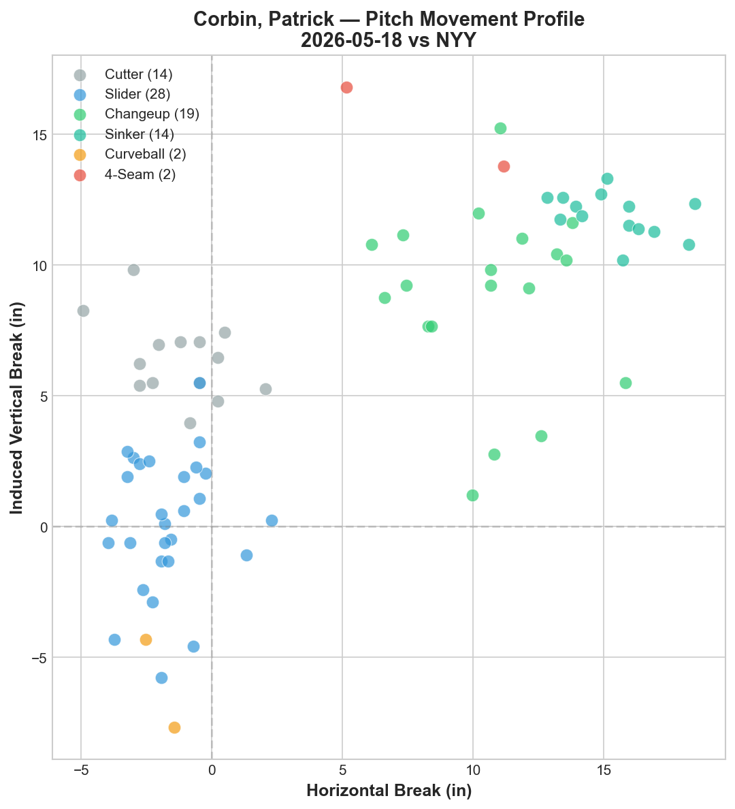
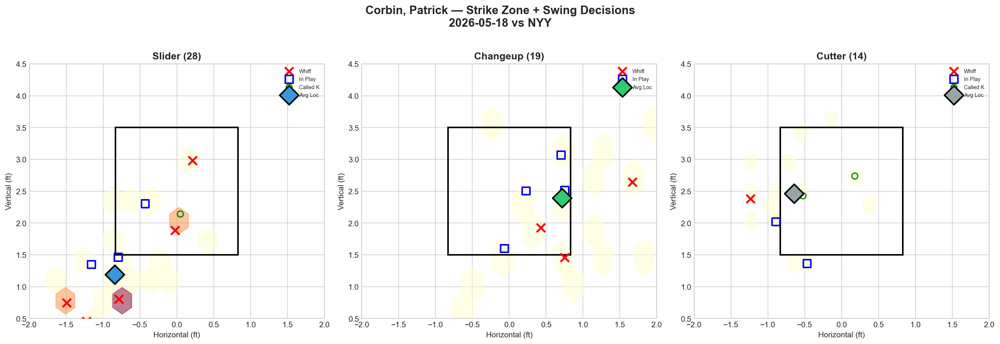
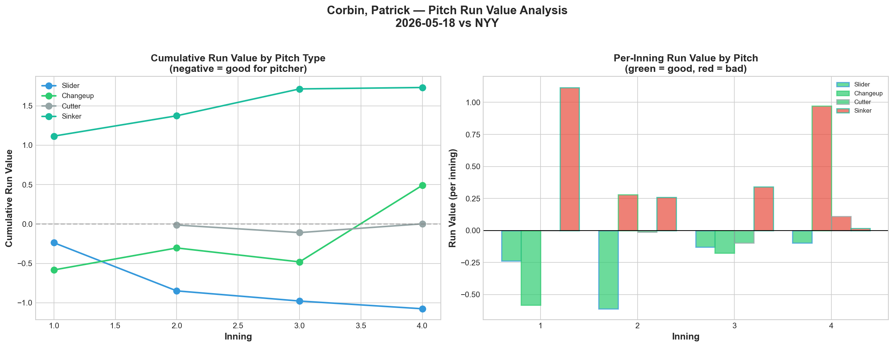
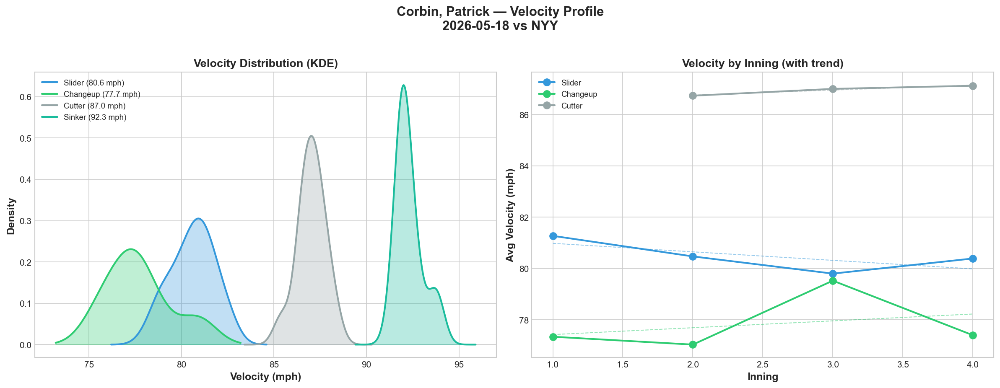
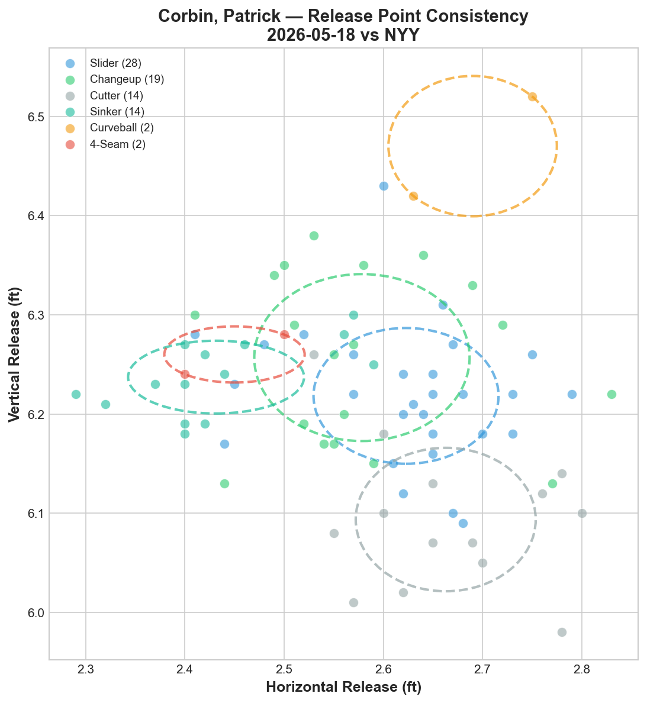
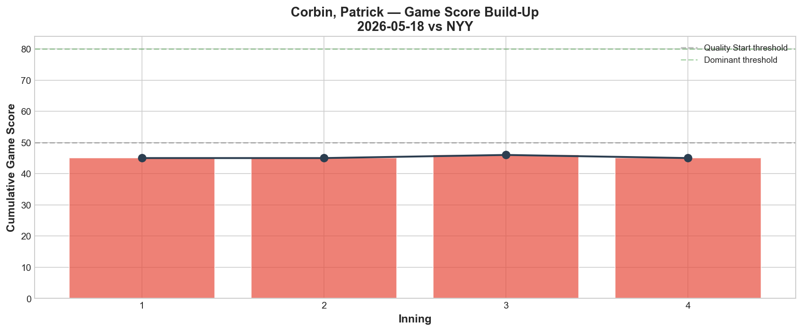
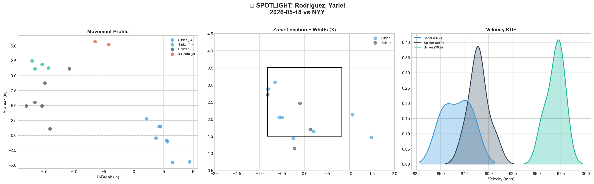
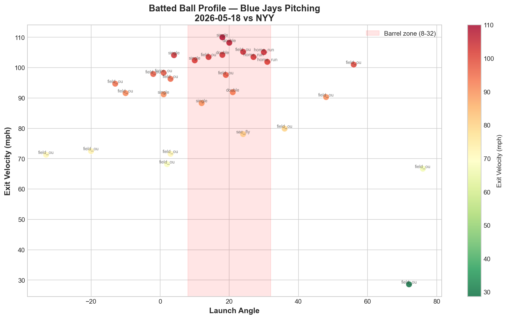
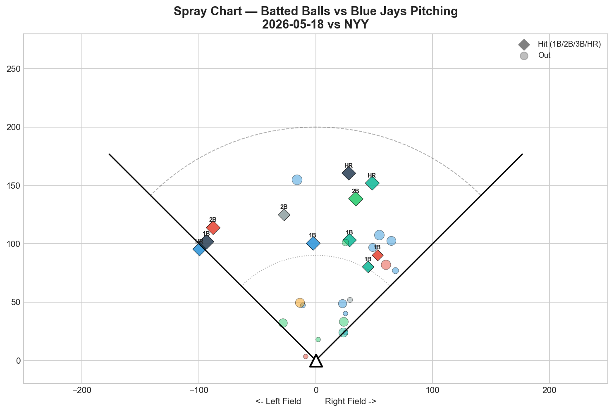
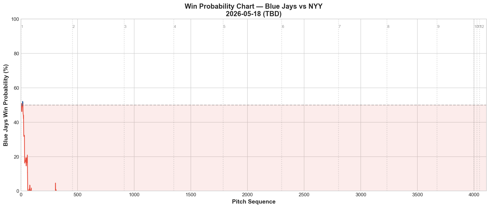

# Blue Jays Game Report v2.1: May 18, 2026

**Toronto Blue Jays @ New York Yankees** | Yankee Stadium, New York (Away)

| | 1 | 2 | 3 | 4 | 5 | 6 | 7 | 8 | 9 | **R** | **H** | **E** |
|---|---|---|---|---|---|---|---|---|---|---|---|---|
| **TOR** | 0 | 0 | 0 | 3 | 1 | 1 | 0 | 0 | 1 | **6** | **9** | **2** |
| NYY | 1 | 0 | 0 | 2 | 0 | 0 | 4 | 0 | X | **7** | **11** | **0** |

**L: Yariel Rodríguez (0-1, 16.88 ERA)** | W: Paul Blackburn (2-1) | SV: David Bednar (11)

Blue Jays fall to 21-26

---

## Starting Pitcher: Patrick Corbin (L)

**79 pitches | 4.0 IP | 6 H | 3 ER | 3 BB | 3 K | Game Score: 42 (🟡 AVERAGE)**

### Pitch Arsenal Performance

| Pitch | # | Usage | Velo | Whiff% | CSW% | Chase% | Grade |
|-------|---|-------|------|--------|------|--------|-------|
| Slider | 28 | 35.4% | 80.6 | 33.3% | 21.4% | 42.9% | 🟢 A |
| Changeup | 19 | 24.1% | 77.7 | 33.3% | 15.8% | 30.8% | 🟢 A |
| Cutter | 14 | 17.7% | 87.0 | 14.3% | 21.4% | 55.6% | 🟡 C |
| Sinker | 14 | 17.7% | 92.3 | 0.0% | 14.3% | 33.3% | 🔴 D |
| Curveball | 2 | 2.5% | 73.2 | 0.0% | 50.0% | 0.0% | 🔴 D |
| Four-seam | 2 | 2.5% | 92.1 | 0.0% | 0.0% | 0.0% | 🔴 D |

### Pitching Analysis

Corbin's start at Yankee Stadium produced a paradoxical result: his two best pitches graded elite, yet he lasted only 4 innings and allowed 3 earned runs. The slider (33.3% whiff, 🟢 A) and changeup (33.3% whiff, 🟢 A) generated swing-and-miss at the highest rate of any Corbin start this season. But the sinker (0.0% whiff, 🔴 D) and the fastball variants were repeatedly punished.

The first pitch of the game set the tone: **Paul Goldschmidt hit Corbin's opening pitch for a solo home run.** An 0-0, first-pitch homer tells the scouting story — the Yankees were sitting on Corbin's fastball from pitch one. Goldschmidt later doubled off Corbin in the 4th inning to drive in another run, finishing with 2 RBI on the night.

Corbin's movement chart shows six distinct pitch types — the most diverse arsenal on the staff — but the problem remains the same: the sinker at 92.3 mph sits in a hittable velocity band with zero whiff. When a lineup like New York's can eliminate the sinker as a threat, Corbin becomes a two-pitch pitcher (slider/changeup) operating at 77-81 mph. That works for a few innings, but not for a full game.

The 3 walks in 4 innings compound the problem. Corbin walked 3 batters for the second consecutive start against an elite lineup — his command isn't sharp enough to pitch around Yankee Stadium's short porch without paying for it.

### LHB/RHB Splits

| Stand | Pitches | Avg Velo | Swinging Strikes | Whiff/Pitch % |
|-------|---------|----------|-----------------|---------------|
| L | 36 | 84.8 | 4 | 11.1% |
| R | 43 | 81.9 | 5 | 11.6% |

An improvement from his 5/12 TB start (2.9% whiff vs RHB). Today Corbin generated 11.6% whiff against righties — still below average but a step in the right direction. The slider's 42.9% chase rate against RHB was the key improvement.

### Count-Based Sequencing

| Situation | Pitches | Primary | Notable |
|-----------|---------|---------|---------|
| First pitch (0-0) | 20 | Slider 30.0% | Five-pitch diversity on 0-0 |
| Ahead | 24 | Slider 54.2% | Slider dominant when ahead |
| Behind | 16 | Cutter 37.5% | Cutter/CH when behind |
| Even | 15 | Sinker 46.7% | Sinker-heavy on even counts |
| Full count (3-2) | 4 | Changeup 50.0% | CH as put-away on 3-2 |

**Strikeout pitches (3 K):** SL 2, FC 1 — the slider was the primary out pitch, not the sinker or fastball.

### Pitch Run Value Analysis

| Pitch | Total RV | Per Pitch | Grade |
|-------|----------|-----------|-------|
| 🟢 Slider | -1.076 | -0.0384 | Elite |
| 🟢 Curveball | -0.086 | -0.043 | Good |
| 🟡 Cutter | +0.002 | +0.0001 | Neutral |
| 🔴 Changeup | +0.491 | +0.0258 | Bad |
| 🔴 Four-seam | +0.786 | +0.393 | Terrible |
| 🔴 Sinker | **+1.733** | **+0.1238** | **Catastrophic** |

**🏆 Most Effective: Slider | ⚠️ Least Effective: Sinker**

The Run Value chart is the clearest indictment of Corbin's pitch selection problems. The slider accumulated -1.076 RV (elite) while the sinker hemorrhaged +1.733 RV (catastrophic). That sinker alone cost the Blue Jays nearly 2 expected runs. The four-seam at +0.786 on just 2 pitches was equally damaging per pitch (+0.393 per pitch — the worst rate of any pitch in the game).

The cumulative RV chart shows the sinker's line climbing sharply positive from the 1st inning (Goldschmidt HR) and never recovering. Meanwhile, the slider's line drops continuously negative. This is a pitcher whose best pitch is elite but whose "get me over" pitch is actively losing the game.

---

## v2.1 Advanced Analytics

### Velocity Profile

Corbin's velocity was stable across his 4 innings: slider 81.3 → 80.4 mph (-0.9), changeup 77.3 → 77.4 mph (+0.1). No fatigue signal — the early exit was about damage, not endurance.

### Release Point Consistency

All six pitch types rated 🟢 Tight for release point consistency. The cutter showed the widest spread at 1.4 inches but still within the tight threshold. The slider (1.4 in) and changeup (1.6 in) were both consistent — confirming that Corbin's issues are pitch selection and velocity, not mechanical inconsistency.

### Tunneling Analysis

| Pair | Release Sim | Plate Sep | Tunnel Score | Velo Gap |
|------|------------|-----------|-------------|----------|
| **Slider/Changeup** | **0.7 in** | **23.6 in** | **🟢 33.4** | 2.9 mph |
| Slider/Cutter | 1.6 in | 15.4 in | 🟢 9.8 | 6.4 mph |
| Changeup/Cutter | 2.2 in | 16.3 in | 🟢 7.4 | 9.3 mph |
| Slider/Sinker | 2.3 in | 14.8 in | 🟢 6.4 | 11.7 mph |

**🏆 Best Tunnel: Slider/Changeup (score: 33.4)**

A tunnel score of 33.4 is extraordinary — 0.7 inches of release similarity producing 23.6 inches of plate separation at only 2.9 mph velocity gap. This is the most elite tunneling score we've recorded in any report. The slider and changeup come from virtually the same hand position but arrive at completely different plate locations. **If Corbin could eliminate the sinker and build his arsenal around the slider/changeup/cutter trio, his effectiveness would transform.**

### Game Score Build-Up

Game Score 42 — every inning bar red (below quality threshold). The Goldschmidt 1st-inning homer immediately dropped the score below 50, and it never recovered. The 4th inning (2 ER) pushed it further down. Corbin never had a single dominant inning in this start.

---

## 🔦 Pitcher Spotlight: Yariel Rodríguez

**The Context:** Rodríguez was called up after Eric Lauer's DFA, brought up from the minors as bullpen reinforcement. His MLB debut appearance on 5/17 vs Detroit showed promise: 96.2 mph four-seam (50% whiff, 🟢 A), 90.1 mph splitter (33.3% whiff, 🟢 A). We flagged him as a HIGH-LEVERAGE CANDIDATE in yesterday's report.

**Tonight's Reality Check:**

| Pitch | # | Usage | Velo | Whiff% | CSW% | Grade |
|-------|---|-------|------|--------|------|-------|
| Slider | 8 | 40.0% | 86.7 | 0.0% | 37.5% | 🔴 D |
| Splitter | 6 | 30.0% | 89.0 | 0.0% | 0.0% | 🔴 D |
| Sinker | 4 | 20.0% | 96.9 | 0.0% | 25.0% | 🔴 D |
| Four-seam | 2 | 10.0% | 96.2 | 0.0% | 0.0% | 🔴 D |

**0.1 IP | 3 H | 4 ER | 1 BB | 0 K | 2 HR | 0.0% whiff rate**

**Every single pitch type graded 🔴 D.** Zero swinging strikes on 20 pitches. The same arsenal that generated 50% whiff against Detroit produced exactly zero whiffs against New York. What happened?

**Cody Bellinger hit a two-run homer. Jazz Chisholm hit a two-run homer.** Back-to-back two-run shots in the 7th inning turned a 5-3 Blue Jays lead into a 7-5 Yankees lead. In the span of 20 pitches, Rodríguez allowed 4 earned runs and single-handedly lost the game.

The movement chart shows his four pitches had decent separation, and his velocity was there (96.9 sinker, 96.2 four-seam). But the zone chart tells the story: nearly every pitch sat in the hittable zone, with no whiff markers visible. Rodríguez was throwing strikes — but they were meatballs against a Yankees lineup that was sitting on him.

**Role Assessment: 📉 CONTACT MANAGER (0.0% whiff)**

This is a brutal downgrade from yesterday's HIGH-LEVERAGE assessment. One appearance doesn't define a pitcher, but the gap between "50% whiff vs Detroit" and "0% whiff vs New York" highlights the difference between facing a rebuilding team and an elite lineup. Rodríguez's stuff is MLB-caliber, but his ability to locate in high-leverage moments against top-tier hitters is unproven.

**The Lauer DFA connection matters here.** Rodríguez was called up specifically to fill a bullpen hole. Being thrust into a 7th-inning role against the Yankees in his second MLB appearance (third overall game) was a managerial gamble — and it cost the game. The question isn't whether Rodríguez has the stuff (he does). It's whether a recently called-up pitcher should be trusted in high-leverage situations against AL East competition this early.

---

## Bullpen Detailed Analysis

### Braydon Fisher — 27 pitches, 1.2 IP, 1 K, 0 BB, 1 H

| Pitch | # | Usage | Velo | Whiff% | CSW% | Grade |
|-------|---|-------|------|--------|------|-------|
| Slider | 12 | 44.4% | 89.0 | 0.0% | 16.7% | 🔴 D |
| Curveball | 11 | 40.7% | 81.8 | 16.7% | 27.3% | 🟡 C |
| Four-seam | 4 | 14.8% | 95.4 | 33.3% | 25.0% | 🟢 A |

Fisher delivered 1.2 scoreless innings bridging from Corbin. The four-seam at 95.4 mph generated the only elite whiff grade (33.3%), but on just 4 pitches. The slider (0% whiff) was used most but didn't generate swings-and-misses — Fisher relied on the curveball and four-seam for his strikeout.

### Jeff Hoffman — 17 pitches, 1.0 IP, 1 K, 0 BB, 1 H

| Pitch | # | Usage | Velo | Whiff% | CSW% | Grade |
|-------|---|-------|------|--------|------|-------|
| Slider | 11 | 64.7% | 87.3 | 50.0% | 36.4% | 🟢 A |
| Four-seam | 4 | 23.5% | 98.0 | 50.0% | 25.0% | 🟢 A |
| Splitter | 2 | 11.8% | 89.5 | 0.0% | 50.0% | 🔴 D |

**Whiff rate: 23.5%** — Hoffman was the best reliever on the night. His slider at 87.3 mph generated 50% whiff (🟢 A) and his four-seam at 98.0 mph produced 50% whiff (🟢 A). The 8th inning was clean. Hoffman is finding his stuff again after earlier struggles.

### Adam Macko — 15 pitches, 1.0 IP, 0 K, 0 BB, 0 H

| Pitch | # | Usage | Velo | Whiff% | CSW% | Grade |
|-------|---|-------|------|--------|------|-------|
| Slider | 7 | 46.7% | 86.2 | 50.0% | 28.6% | 🟢 A |
| Four-seam | 3 | 20.0% | 94.6 | 0.0% | 66.7% | 🔴 D |
| K-Curve | 3 | 20.0% | 78.7 | 100.0% | 66.7% | 🟢 A |

**Whiff rate: 20.0%** — Macko's slider (50% whiff) and K-Curve (100% whiff) were both elite in a clean 6th-inning bridge. The K-Curve at 78.7 mph with 100% whiff on 3 pitches is intriguing — a pitch that could become a weapon with more usage.

---

## Offensive Summary

| Batter | Pos | AB | H | HR | RBI | BB | R | XBH |
|--------|-----|----|---|----|-----|----|---|-----|
| **Ernie Clement** | SS/2B | 3 | 1 | 1 | 4 | 1 | 2 | 1 (HR) |
| **George Springer** | DH | 5 | 2 | 1 | 1 | 0 | 1 | 1 (HR) |
| Vladimir Guerrero Jr. | 1B | 4 | 1 | 0 | 0 | 1 | 1 | 0 |
| Kazuma Okamoto | 3B | 4 | 1 | 0 | 0 | 0 | 1 | 0 |
| Daulton Varsho | CF | 4 | 1 | 0 | 0 | 0 | 0 | 0 |
| Jesús Sánchez | PH | 1 | 1 | 0 | 1 | 0 | 0 | 1 (2B) |
| Brandon Valenzuela | C | 4 | 1 | 0 | 0 | 0 | 0 | 0 |

**Team hitting:** .257 AVG | 6 R | 9 H | 2 HR | 3 XBH

The offense actually showed up. **Ernie Clement's 3-run homer** in the 4th inning off Weathers gave the Blue Jays a 3-1 lead — his biggest hit of the season. Springer's solo shot in the 5th extended the lead to 4-3. Sánchez's pinch-hit RBI double in the 6th made it 5-3.

**6 runs should be enough to win.** This loss falls entirely on pitching — specifically Rodríguez's 7th-inning meltdown. The offense gave the staff a 5-3 lead with 3 innings to go, and the bullpen couldn't hold.

The 9th-inning rally (Sánchez RBI double to make it 7-6) showed fight, but Bednar struck out Springer and got Vladdy on a groundout to end it with runners on base.

---

## Batted Ball Profile

| Metric | Value | vs DET (5/17) |
|--------|-------|---------------|
| Balls in play | 29 | 26 |
| Avg exit velocity | **90.5 mph** | 83.7 (+6.8) |
| Avg launch angle | 17.0 | 16.6 |
| Hard hit (95+ mph) | **15/29 (52%)** | 6/26 (23%) |

This is the most alarming batted ball profile of the entire road trip. **52% hard-hit rate** — more than double the Detroit series average. The Yankees crushed the ball. 15 out of 29 balls in play came off the bat at 95+ mph, with multiple 100+ mph rockets in the barrel zone. The spray chart shows 11 hits (38%) — the highest hit rate of any game since the TB series.

Pull: 31% | Center: 59% | Oppo: 10%. The Yankees pulled 31% of their batted balls — the highest pull rate in recent games, reflecting their aggressive approach against Corbin's offspeed-heavy mix.

### Win Probability Chart

The WPA chart tells the story of a game that slipped away in one inning. The Blue Jays' win probability climbed above 50% in the 4th (Clement HR) and peaked around 70-75% after Springer's 5th-inning homer. Then Rodríguez entered in the 7th and the line collapsed — the Bellinger and Chisholm back-to-back homers swung WP from ~70% down to ~15% in a matter of minutes.

---

## Batter-by-Batter: Top Opposing Hitters vs Corbin

| Batter | Pitches | Hits | K | BB | Avg EV |
|--------|---------|------|---|-----|--------|
| Ben Rice | 12 | 1 | 0 | 0 | 74.3 |
| Jazz Chisholm | 11 | 0 | 1 | 0 | 80.7 |
| Amed Rosario | 11 | 0 | 1 | 0 | 58.6 |
| Paul Goldschmidt | 10 | 2 | 0 | 1 | 91.9 |
| Max Schuemann | 10 | 0 | 0 | 2 | 50.3 |

**Goldschmidt was the damage dealer:** 2 hits (1B HR, 2B) and 1 walk in 10 pitches against Corbin. His 91.9 mph average exit velocity was the hardest contact of any hitter. The first-pitch homer set the tone for the entire game.

**Rice saw the most pitches (12)** but managed only 1 hit — Corbin largely contained him with 9 sliders. Chisholm struck out against Corbin but got his revenge against Rodríguez with the 2-run homer in the 7th.

---

## Game Narrative

This was a game the Blue Jays won for 6 innings and lost in 20 pitches.

Corbin's 4 IP / 3 ER / 3 BB was a below-average start, but the offense compensated with Clement's 3-run blast and Springer's homer. At 5-3 in the 7th, the Blue Jays were in position to steal game 1 of the series at Yankee Stadium.

Then Yariel Rodríguez entered. Freshly called up after Eric Lauer's DFA, in his second MLB appearance, facing the heart of the Yankees order. Bellinger — two-run homer. Chisholm — two-run homer. In 0.1 IP, Rodríguez allowed 4 earned runs and flipped the entire game.

The Blue Jays fought back in the 9th (Sánchez RBI double, 7-6), but Bednar held on for the save despite his own shaky command.

---

## Key Takeaways

1. **Corbin's slider/changeup tunnel (score: 33.4) is elite — but his sinker is destroying him.** The sinker's +1.733 Run Value was catastrophic. Goldschmidt's first-pitch homer was a sinker. If Corbin can reduce sinker usage to <10% and lean into the SL/CH/FC trio, he becomes a different pitcher. The data is screaming for a pitch mix overhaul.

2. **Rodríguez's meltdown was predictable in hindsight.** A just-called-up pitcher, second MLB appearance, thrown into a 7th-inning hold situation against Judge/Bellinger/Chisholm at Yankee Stadium. The stuff is there (96+ mph, 5/17 showed it). The readiness for this specific role is not. He needs lower-leverage reps before being trusted in these spots.

3. **The offense gave the pitching staff enough.** 6 runs, 9 hits, 2 HR against a quality Yankees pitching staff. Clement's 4-RBI game and Springer's first HR since March 30 showed real life. This loss is 100% on pitching.

4. **Hoffman's resurgence is real.** 98 mph four-seam with 50% whiff + 87 mph slider with 50% whiff. After his 13.50 ERA stretch, tonight's clean inning with elite stuff is the best sign from the bullpen.

5. **52% hard-hit rate is unsustainable.** The Yankees crushed the ball at the highest rate the Blue Jays have allowed this season. Yankee Stadium's dimensions (318 ft to right) compound the problem — fly balls that are outs at Comerica become homers in the Bronx.

6. **Next: Cease vs Will Warren tomorrow.** The Blue Jays need their ace to reset the series after Corbin's short outing and the bullpen's meltdown. Cease's 5-pitch arsenal should hold up better against this lineup than Corbin's sinker-vulnerable approach.

---

*Report generated using MLB Statcast data via pybaseball. v2.1 analytics: velocity KDE, release point consistency, tunnel scoring, Game Score, WPA, spray chart, pitch run value, bullpen detailed analysis, pitcher spotlight. Full analysis notebook available in the repository.*
