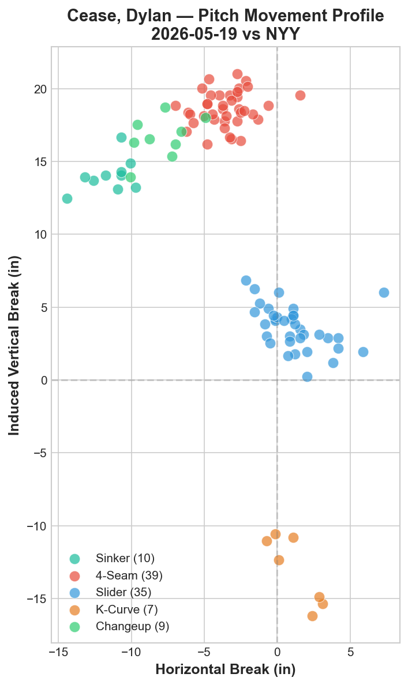
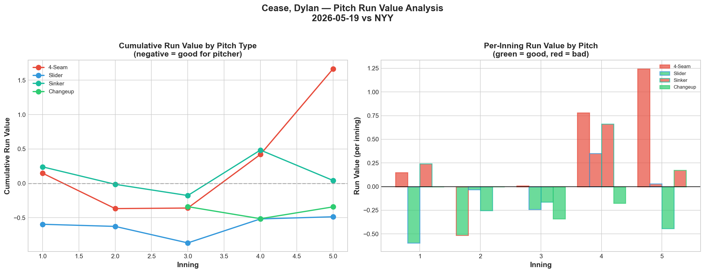
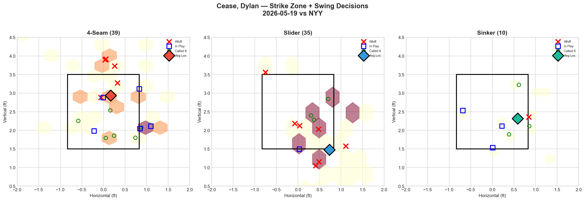
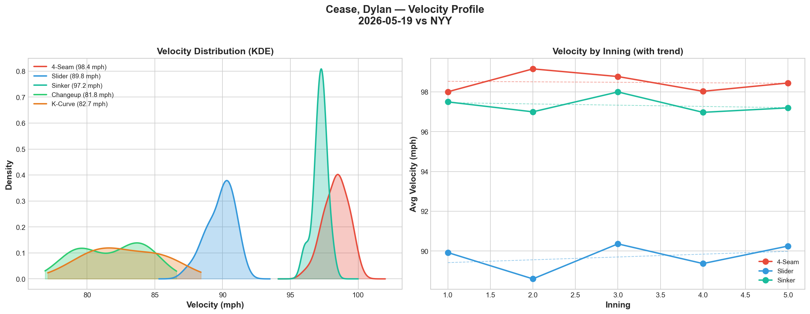
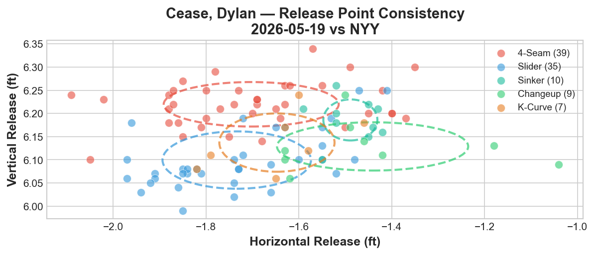
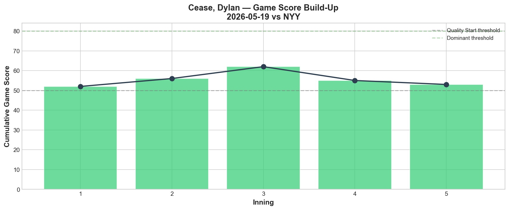
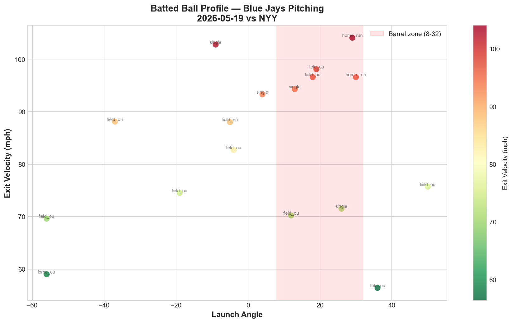
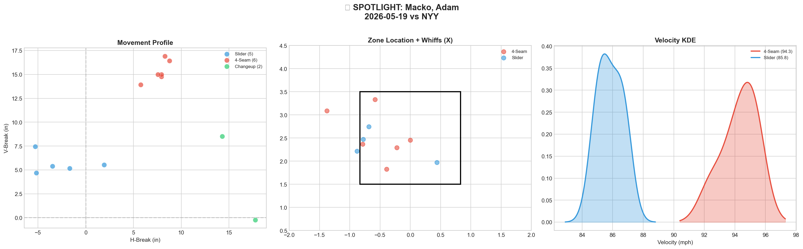
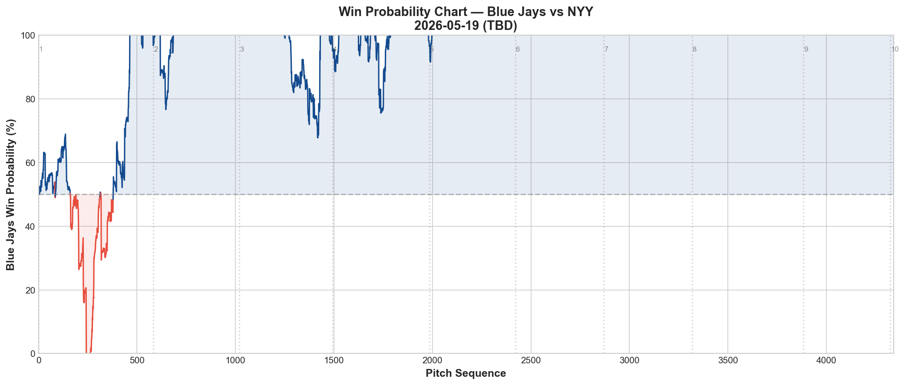
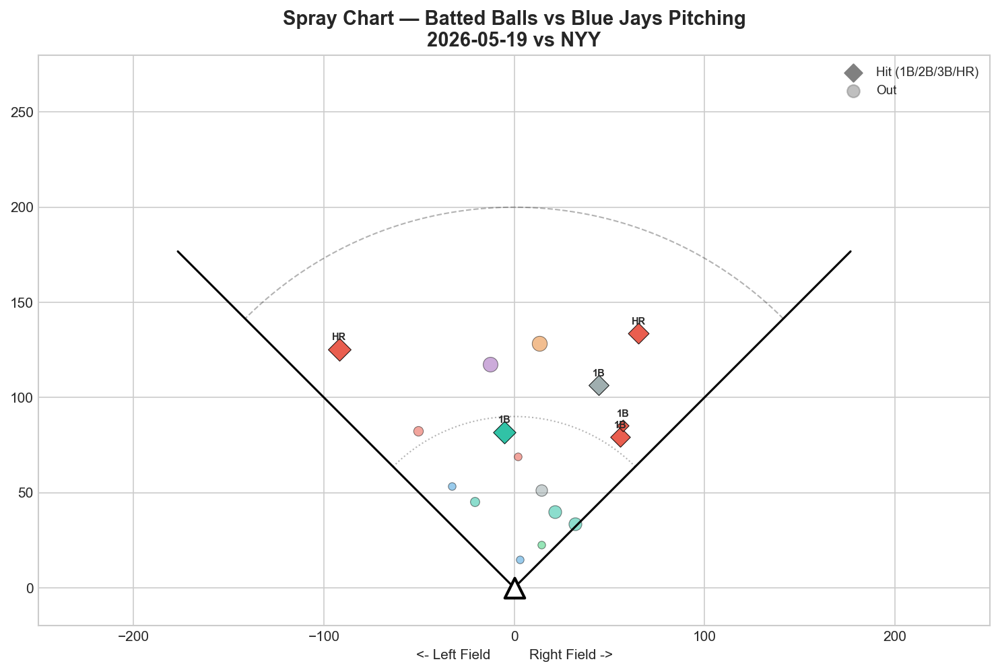

# 🏟️ Blue Jays Game Report v2.1
## 2026-05-19 | TOR @ NYY | L 4-5

---

## 📋 Game Overview

| | |
|---|---|
| **Date** | 2026-05-19 |
| **Matchup** | Toronto Blue Jays @ New York Yankees |
| **Result** | **L 4-5** |
| **Starter** | Dylan Cease (100 pitches, 5.0 IP) |
| **Spotlight Pitcher** | Adam Macko (MLB debut) |
| **Season Record** | 21W-26L |

---

## 🔥 Key Storylines

### 1. Dylan Cease Delivered a Quality Outing — And Still Got the Loss

Cease threw 100 pitches over 5 innings with a **Game Score of 54 (QUALITY rating)**. He struck out 9, generated a 25% whiff rate on his 4-seam and an elite 53.8% whiff rate on his slider. His 4-Seam/Slider tunnel scored **12.6 (best tunnel of the game)**. The problem? His 4-seam accumulated a **Run Value of +1.665** — nearly all of the damage came on that one pitch. The slider (-0.486 RV) and changeup (-0.342 RV) were dominant; the fastball was not.

### 2. Adam Macko Made History in His MLB Debut

Macko became the **third player of Slovak nationality in MLB history, and the first in roughly 70 years**. A dual Slovak-Canadian citizen who grew up in Canada, Macko entered in relief and threw 14 pitches. The stat line — 1K, 0BB, 1H, **0.0% whiff rate** — tells an incomplete story. His role assessment: **CONTACT MANAGER**, relying on weak contact rather than swing-and-miss. The debut is the milestone; the development trajectory is what matters next.

### 3. The Bullpen Couldn't Hold a Lead

The WPA chart tells the story: Toronto held win probability above 80% for stretches of the mid-game, then the bullpen surrendered critical runs. Key negative WPA moments included a **Matt Gage HR in the 9th (WP 81.3%)** and an **O'Brien GIDP that dropped WP to 27.8%**. The game was there for the taking and the relief corps let it slip.

---

## ⚾ Starter Pitch Arsenal Analysis — Dylan Cease

### Pitch Arsenal Performance (100 pitches)

| Pitch | # | Usage | Velo | Whiff% | CSW% | Chase% | Grade |
|-------|---|-------|------|--------|------|--------|-------|
| 4-Seam | 39 | 39.0% | 98.4 | 25.0% | 28.2% | 38.1% | 🟢 B |
| Slider | 35 | 35.0% | 89.8 | 53.8% | 28.6% | 25.0% | 🟢 A |
| Sinker | 10 | 10.0% | 97.2 | 25.0% | 40.0% | 20.0% | 🟢 B |
| Changeup | 9 | 9.0% | 81.8 | 100.0% | 66.7% | 0.0% | 🟢 A |
| K-Curve | 7 | 7.0% | 82.7 | 0.0% | 14.3% | 16.7% | 🔴 D |

### Pitch Movement (inches)

| Pitch | H-Break | V-Break | Count |
|-------|---------|---------|-------|
| Changeup (CH) | -8.0 | 16.6 | 9 |
| 4-Seam (FF) | -3.5 | 18.6 | 39 |
| K-Curve (KC) | 1.3 | -13.0 | 7 |
| Sinker (SI) | -11.5 | 14.0 | 10 |
| Slider (SL) | 1.2 | 3.6 | 35 |

### Pitch Tunneling Analysis

| Pair | Release Sim | Plate Sep | Tunnel | Velo Gap |
|------|-------------|-----------|--------|----------|
| **4-Seam/Slider** | **1.5in** | **18.7in** | **🟢 12.6** | **8.5mph** |
| 4-Seam/K-Curve | 1.2in | 14.3in | 🟢 12.0 | 15.6mph |
| Sinker/Changeup | 0.9in | 7.1in | 🟢 7.9 | 15.4mph |
| Slider/K-Curve | 1.1in | 5.0in | 🟢 4.4 | 7.1mph |
| 4-Seam/Changeup | 3.3in | 13.3in | 🟢 4.0 | 16.5mph |
| 4-Seam/Sinker | 2.6in | 9.0in | 🟢 3.5 | 1.2mph |
| Slider/Changeup | 3.5in | 7.2in | 🟡 2.0 | 8.0mph |
| Changeup/K-Curve | 2.5in | 2.4in | 🔴 1.0 | 0.9mph |

**🏆 Best Tunnel: 4-Seam/Slider (score: 12.6)** — 1.5in release similarity expanding to 18.7in plate separation with an 8.5mph velocity gap. This is an elite tunnel combination.

### Pitch Run Value by Type

| Pitch | Total RV | Per Pitch | Pitches | Assessment |
|-------|----------|-----------|---------|------------|
| 4-Seam | +1.665 | +0.0427 | 39 | ⚠️ Costly |
| Slider | -0.486 | -0.0139 | 35 | ✅ Dominant |
| Sinker | +0.042 | +0.0042 | 10 | — Neutral |
| Changeup | -0.342 | -0.038 | 9 | ✅ Dominant |
| K-Curve | +0.126 | +0.018 | 7 | ⚠️ Ineffective |

- 🏆 **Most Effective:** Slider
- ⚠️ **Least Effective:** 4-Seam

### Pitch Selection by Count

| Situation | Primary | Secondary | Notes |
|-----------|---------|-----------|-------|
| First Pitch (0-0) | 4-Seam 43.5% | Slider 26.1% | K-Curve 17.4% shows early-count willingness |
| Ahead (0-1, 0-2, 1-2) | Slider 36.4% | 4-Seam 30.3% | Slider becomes the weapon |
| Behind (1-0, 2-0, 3-0, 2-1, 3-1) | 4-Seam 62.5% | Slider 25.0% | Fastball-heavy when chasing strikes |
| Even (1-1, 2-2) | 4-Seam 47.1% | Slider 35.3% | Balanced approach |
| Full Count (3-2) | Slider 63.6% | Sinker 27.3% | Trusts slider as putaway pitch |

**Strikeout Pitches (9 K's):** FF 3, SL 3, CH 2, SI 1 — diverse K arsenal.

### vs LHB/RHB Split

| Stand | Pitches | Avg Velo | Swinging Strikes | Whiff/Pitch |
|-------|---------|----------|------------------|-------------|
| L | 77 | 92.5 | 15 | 19.5% |
| R | 23 | 93.2 | 2 | 8.7% |

Cease was significantly more effective against left-handed hitters (19.5% whiff rate vs 8.7% against RHB). The slider's glove-side break is a natural weapon against LHH.

### Top Opposing Batters vs Cease

| Batter | Pitches | Hits | K | BB | Avg EV |
|--------|---------|------|---|-----|--------|
| Aaron Judge | 19 | 0 | 2 | 1 | 79.0 |
| Cody Bellinger | 15 | 0 | 0 | 1 | 78.5 |
| Jazz Chisholm | 13 | 0 | 1 | 1 | 90.3 |
| Ben Rice | 12 | 1 | 1 | 0 | 80.4 |
| Austin Wells | 12 | 0 | 2 | 0 | 78.5 |

**Judge:** 19 pitches, 0 hits, 2K, 1BB — Cease won this matchup. Faced SL 9, FF 8, KC 1, CH 1. Outcomes: strikeout, walk, strikeout.

**Bellinger:** 15 pitches, 0 hits, 0K, 1BB — Cease survived. Faced FF 7, SI 3, SL 3, KC 2. Outcomes: field_out, field_out, walk.

**Chisholm:** 13 pitches, 0 hits, 1K, 1BB — Controlled. Faced SL 7, FF 3, SI 2, CH 1. Outcomes: walk, strikeout.

### Velocity Profile

- **4-Seam:** 98.0 → 98.4 mph (+0.4 mph gain through outing)
- **Slider:** 89.9 → 90.2 mph (+0.3 mph gain)
- Velocity held steady through all 5 innings — no fatigue indicators.

### Release Point Consistency

| Pitch | H-Spread | V-Spread | Total | Rating |
|-------|----------|----------|-------|--------|
| 4-Seam | 2.3in | 0.6in | 2.3in | 🟢 Tight |
| Slider | 1.9in | 0.7in | 2.1in | 🟢 Tight |
| Sinker | 0.7in | 0.5in | 0.9in | 🟢 Tight |
| Changeup | 2.5in | 0.6in | 2.5in | 🟢 Tight |
| K-Curve | 1.5in | 0.8in | 1.7in | 🟢 Tight |

All five pitches showed tight release point consistency — elite-level mechanical repeatability.

### Game Score Build-Up

| Inning | Cumulative GS | Trend |
|--------|---------------|-------|
| 1 | 52 | Clean |
| 2 | 56 | Building |
| 3 | 62 | Peak |
| 4 | 55 | Damage taken |
| 5 | 52 | Settled |

**Final: 54 (QUALITY).** Peaked at 62 in the 3rd inning before the 4-seam started leaking run value in the 4th and 5th.

### Batted Ball Profile

| Metric | Value |
|--------|-------|
| Total BIP | 17 |
| Avg Exit Velo | 83.6 mph |
| Avg Launch Angle | 3.0° |
| Hard Hit (95+ mph) | 5/17 (29%) |
| Hits | 6 (35%) |
| Pull/Center/Oppo | 29% / 53% / 18% |

### Actionable Insight

Cease's outing reveals a clear arsenal hierarchy: his slider and changeup are elite pitches that generate swings-and-misses and negative run values. His 4-seam, despite sitting 98+ mph, accumulated +1.665 in run value — nearly all of the game's damage came on that pitch. The 4-Seam/Slider tunnel (12.6) is his best weapon, but the fastball itself is hittable when it doesn't set up the slider. The K-Curve (0.0% whiff, Grade D) may need to be shelved in favor of more changeups, which posted 100% whiff rate on 9 pitches.

---

## 🔍 Spotlight Pitcher — Adam Macko (MLB Debut)

| | |
|---|---|
| **Entry** | Relief appearance |
| **Pitch Count** | 14 |
| **Line** | 1K / 0BB / 1H / 0HR |
| **Whiff%** | 0.0% |
| **Role Assessment** | CONTACT MANAGER — low whiff rate, relies on weak contact |

### Historical Significance

Adam Macko became the **third Slovak-born player in MLB history and the first in approximately 70 years.** A dual Slovak-Canadian citizen who spent formative years in Canada, his debut represents a remarkable pathway to the majors.

### Pitch Arsenal

| Pitch | # | Usage | Velo | Whiff% | CSW% | Grade |
|-------|---|-------|------|--------|------|-------|
| 4-Seam | 6 | 42.9% | 94.3 | 0.0% | 50.0% | 🔴 D |
| Slider | 5 | 35.7% | 85.8 | 0.0% | 40.0% | 🔴 D |
| Changeup | 2 | 14.3% | 84.9 | 0.0% | 0.0% | 🔴 D |

### Assessment

The 0.0% whiff rate across all three pitches is the headline concern, but debut nerves and a 14-pitch sample make this more of a baseline than a verdict. The 94.3 mph fastball shows arm strength, and the slider at 85.8 provides a viable speed differential. The key development question: can he evolve from a contact manager into a swing-and-miss reliever, or does his path run through pitch design refinement to generate more deception? The debut is the story today; the trajectory is what matters for the organization.

---

## 📊 Bullpen Detailed Analysis

| Pitcher | Pitches | Line | Whiff% | Grade Summary |
|---------|---------|------|--------|---------------|
| **Louis Varland** | 6 | 1K / 0BB / 0H / 0HR | 50.0% | FF: 🟢A, CH: 🟢A |
| **Mason Fluharty** | 9 | 1K / 0BB / 1H / 0HR | 33.3% | Sweeper: 🟢A (66.7% whiff), Cutter: 🟢A |
| **Chase Lee** | 13 | 0K / 2BB / 0H / 0HR | 7.7% | FF: 🟢A (100% whiff), Sweeper: 🔴D, SI: 🔴D |
| **Adam Macko** | 14 | 1K / 0BB / 1H / 0HR | 0.0% | FF: 🔴D, SL: 🔴D, CH: 🔴D |

### Bullpen Notes

- **Varland** was electric in a tiny sample — 100% whiff on his 4-seam, 50% on his changeup. The most impressive reliever of the night.
- **Fluharty** was equally impressive — his sweeper generated a 66.7% whiff rate, and his cutter backed it up at 33.3%. Both pitches graded A.
- **Chase Lee** was a mixed bag — his 4-seam was untouchable (100% whiff) but his sweeper and sinker generated 0.0% whiffs. The 2 walks hurt.
- **Macko's** debut showed contact management without swing-and-miss — a development starting point.

---

## 📈 Win Probability Analysis

### WPA Chart Summary

The Jays held significant win probability advantages through the middle innings, with WP exceeding 80% at multiple points. The collapse came late:

### Key WPA Moments

| Inning | Event | WP at Moment | Impact |
|--------|-------|--------------|--------|
| 6 | Sisk, Evan — home_run | 35.6% | 📈 Positive (TOR) |
| 7 | Winn, Keaton — GIDP | 28.6% | 📉 Negative |
| 8 | Kilian, Caleb — GIDP | 37.8% | 📉 Negative |
| 9 | Gage, Matt — home_run | 81.3% | 📈 Positive (TOR) |
| 9 | O'Brien, Riley — GIDP | 27.8% | 📉 Critical collapse |
| 9 | O'Brien, Riley — single | 31.4% | 📉 Game slipped away |

---

## 📊 Spray Chart & Batted Ball Summary

| Metric | Value |
|--------|-------|
| Total batted balls tracked | 17 |
| Hits | 6 (35%) |
| Pull | 5 (29%) |
| Center | 9 (53%) |
| Oppo | 3 (18%) |

2 home runs allowed, both to the pull side. The majority of contact was center-field oriented, consistent with Cease's slider-heavy approach pushing hitters to the middle of the field.

---

## 🎯 Analytical Takeaways

1. **Cease's 4-Seam Is His Achilles Heel** — Despite sitting 98.4 mph, his fastball posted +1.665 Run Value while his slider (-0.486) and changeup (-0.342) dominated. The FF/SL tunnel score of 12.6 is elite, meaning the fastball works best as a *setup pitch* for the slider, not as a primary weapon. Reducing 4-seam usage in favor of more changeups (100% whiff rate tonight) could be the optimization.

2. **Cease Won the Marquee Matchups** — Judge: 0-for-3 with 2K. Bellinger: 0-for-3. Chisholm: 0-for-2 with 1K. Cease neutralized the Yankees' three most dangerous hitters. The damage came from deeper in the lineup.

3. **Macko's Debut Is a Historical Milestone** — The third Slovak-born MLB player in history, and first in ~70 years. The 0.0% whiff rate is a development data point, not a career verdict. His 94.3 mph fastball provides a foundation; pitch design work on his slider shape could unlock swing-and-miss potential.

4. **Bullpen Polarity** — Varland (50% whiff) and Fluharty (33.3% whiff) were dominant. Lee and Macko combined for 27 pitches with minimal swing-and-miss. The bullpen has clear tiers emerging.

5. **Game Classification: Bullpen Loss** — Cease delivered a Quality outing (GS 54, 9K). The offense scored 4 runs. The bullpen couldn't hold late-inning leads — the WPA chart shows the Jays were winning this game before relief failures surrendered it.

---

*Report generated from Statcast data via pybaseball. All pitch metrics sourced from Baseball Savant.*
