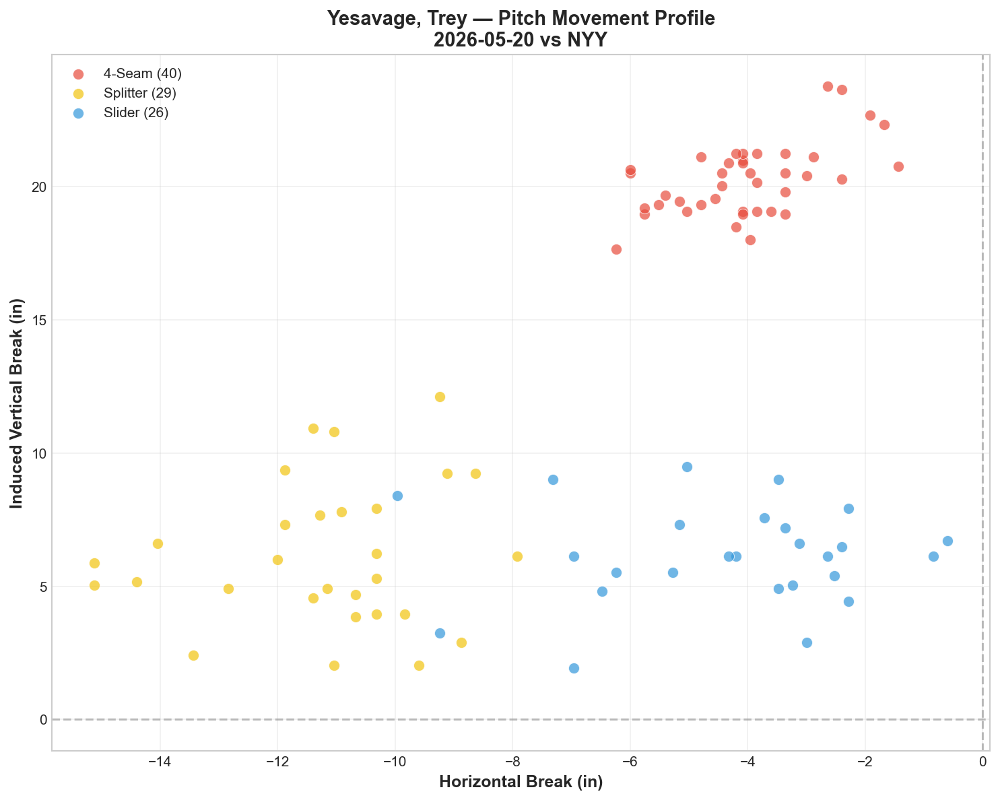
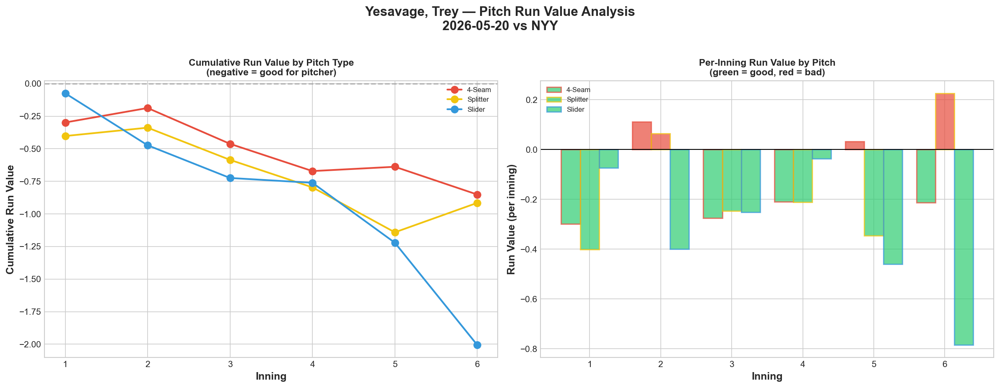
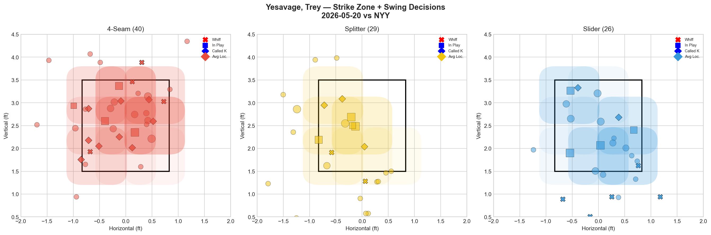
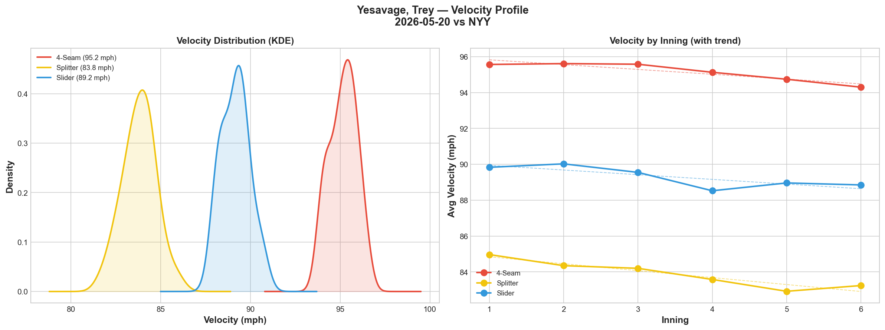
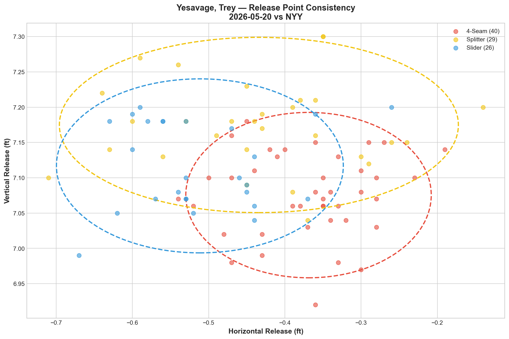
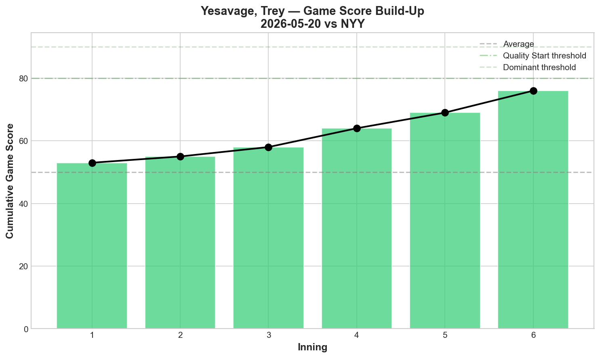
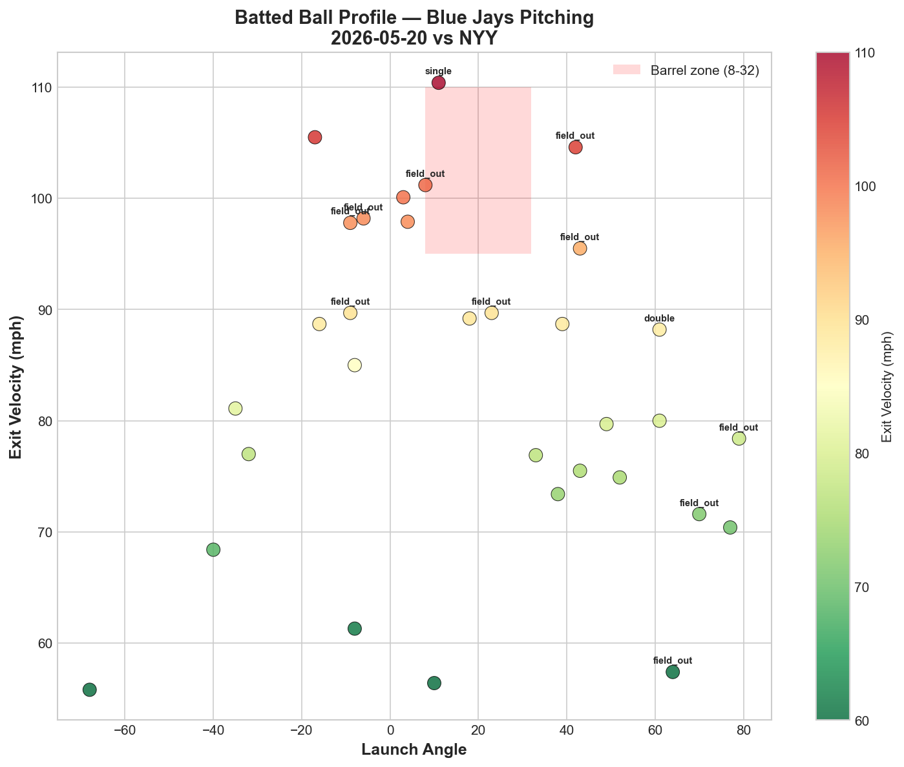
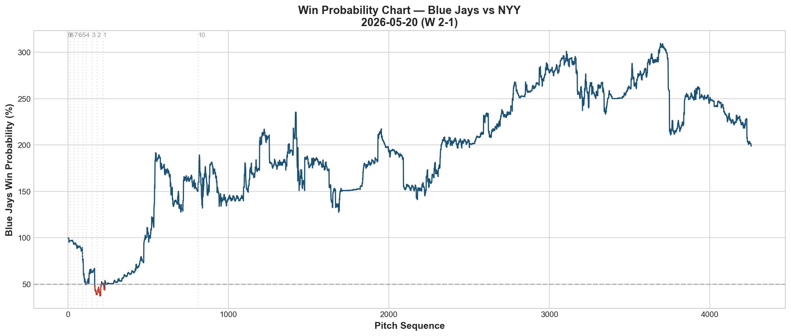
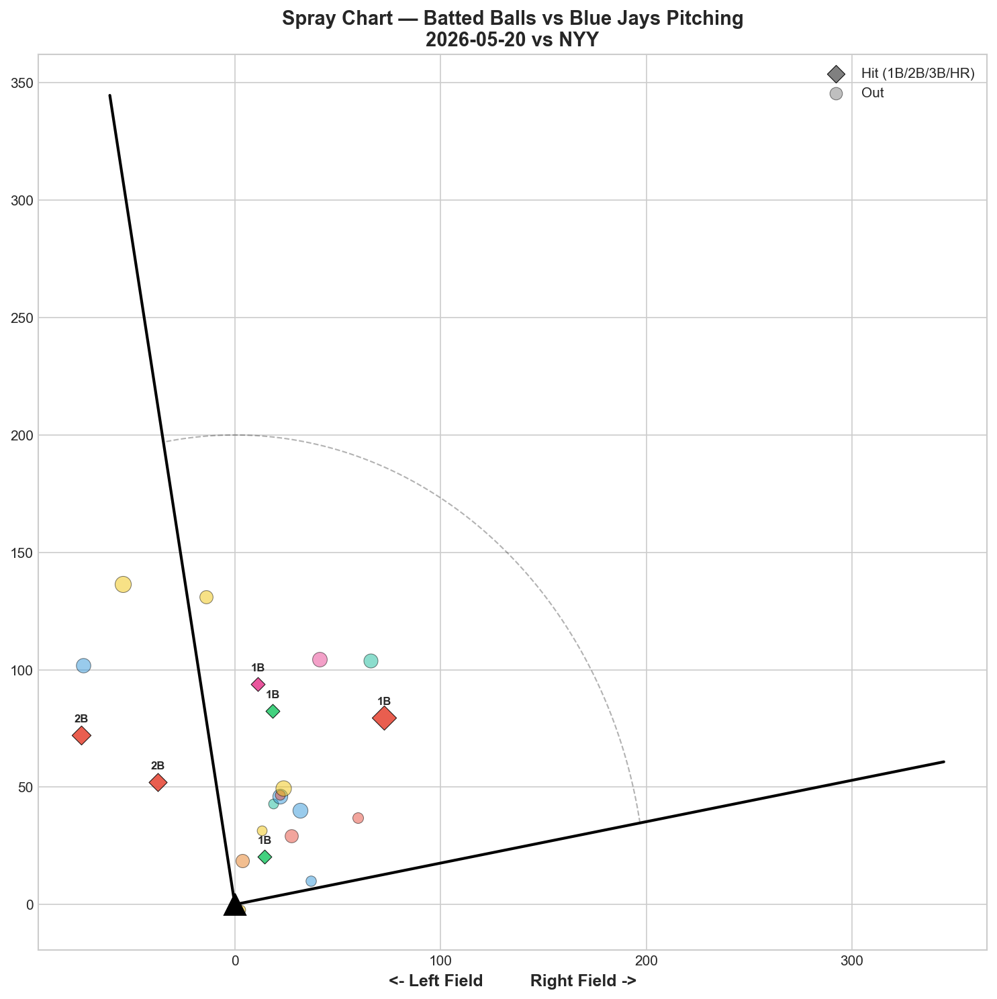

# 🏟️ Blue Jays Game Report v2.1
## 2026-05-20 | TOR @ NYY | W 2-1

---

## 📋 Game Overview

| | |
|---|---|
| **Date** | 2026-05-20 |
| **Matchup** | Toronto Blue Jays @ New York Yankees |
| **Result** | **W 2-1** |
| **Starter** | Trey Yesavage (95 pitches) |
| **Spotlight Pitcher** | None |
| **Season Record** | 22W-26L |

---

## 🔥 Key Storylines

### 1. Yesavage Dominated the Yankees' Core — Judge, Bellinger, Wells All Hitless

Trey Yesavage turned in one of the most impressive starts of the Blue Jays' season: **95 pitches, 8 K's, Game Score 74 (QUALITY).** The headline stat? The Yankees' top five hitters by pitch count — **Judge (0-for, 3K), Wells (0-for, 2K), Rice (0-for), Bellinger (0-for, 1K), Goldschmidt (0-for)** — combined for **zero hits against him.** Yesavage didn't just survive the Yankees lineup; he shut it down.

### 2. A Three-Pitch Arsenal Where Every Pitch Had Negative Run Value

This is rare. All three of Yesavage's pitches posted negative (pitcher-favorable) run values: **Slider -2.006, Splitter -0.915, 4-Seam -0.851.** When every pitch in your arsenal is independently generating value, the sequencing possibilities become exponentially more dangerous. The slider was the standout at -0.0772 per pitch — elite efficiency.

### 3. The Bullpen Chain Held a 1-Run Lead

Varland (24 pitches, 2K), Rogers (10 pitches, 1K), Hoffman (8 pitches), and Fluharty (8 pitches) combined to protect a razor-thin margin. **A 2-1 road win at Yankee Stadium with this pitching depth is a statement game for a rebuilding roster.**

---

## ⚾ Starter Pitch Arsenal Analysis — Trey Yesavage

### Pitch Arsenal Performance (95 pitches)

| Pitch | # | Usage | Velo | Whiff% | CSW% | Chase% | Grade |
|-------|---|-------|------|--------|------|--------|-------|
| 4-Seam | 40 | 42.1% | 95.2 | 19.0% | 32.5% | 23.1% | 🟡 C |
| Splitter | 29 | 30.5% | 83.8 | 22.2% | 17.2% | 11.1% | 🟢 B |
| Slider | 26 | 27.4% | 89.2 | 25.0% | 26.9% | 66.7% | 🟢 B |

### Pitch Movement (inches)

| Pitch | H-Break | V-Break | Count |
|-------|---------|---------|-------|
| 4-Seam (FF) | -4.0 | 20.3 | 40 |
| Splitter (FS) | -11.2 | 6.2 | 29 |
| Slider (SL) | -4.4 | 6.2 | 26 |

### Pitch Tunneling Analysis

| Pair | Release Sim | Plate Sep | Tunnel | Velo Gap |
|------|-------------|-----------|--------|----------|
| **4-Seam/Splitter** | **1.4in** | **15.8in** | **🟢 11.1** | **11.3mph** |
| 4-Seam/Slider | 1.8in | 14.1in | 🟢 7.9 | 6.0mph |
| Splitter/Slider | 1.2in | 6.8in | 🟢 5.9 | 5.4mph |

**🏆 Best Tunnel: 4-Seam/Splitter (score: 11.1)** — 1.4in release similarity expanding to 15.8in plate separation with an 11.3mph velocity gap. The fastball and splitter look identical out of the hand and diverge dramatically at the plate — this is textbook tunneling design.

All three pitch pairs scored green. Yesavage's entire arsenal is built on deception, not just stuff.

### Pitch Run Value by Type

| Pitch | Total RV | Per Pitch | Pitches | Assessment |
|-------|----------|-----------|---------|------------|
| Slider | -2.006 | -0.0772 | 26 | ✅ Elite |
| Splitter | -0.915 | -0.0316 | 29 | ✅ Dominant |
| 4-Seam | -0.851 | -0.0213 | 40 | ✅ Effective |

- 🏆 **Most Effective:** Slider
- **Least Effective:** 4-Seam (still negative — all pitches were effective)

### Pitch Selection by Count

| Situation | Primary | Secondary | Notes |
|-----------|---------|-----------|-------|
| First Pitch (0-0) | 4-Seam 45.0% | Slider 30.0% | Aggressive first-pitch approach |
| Ahead (0-1, 0-2, 1-2) | Splitter 42.9% | 4-Seam 40.0% | Splitter becomes the weapon ahead in count |
| Behind (1-0, 2-0, 3-0, 2-1, 3-1) | 4-Seam 57.1% | Slider 28.6% | Fastball-heavy to get back in counts |
| Even (1-1, 2-2) | Slider 36.8% | 4-Seam 36.8% | Balanced — trusts all three pitches |
| Full Count (3-2) | Slider 42.9% | 4-Seam 28.6% | Slider as putaway pitch on full counts |

**Strikeout Pitches (8 K's):** FF 4, SL 3, FS 1 — fastball-dominant K profile, but the slider's chase rate (66.7%) is the swing-and-miss engine.

### vs LHB/RHB Split

| Stand | Pitches | Avg Velo | Swinging Strikes | Whiff/Pitch |
|-------|---------|----------|------------------|-------------|
| L | 65 | 89.4 | 6 | 9.2% |
| R | 30 | 91.5 | 5 | 16.7% |

More effective against right-handed hitters (16.7% whiff vs 9.2%). The splitter's arm-side fade naturally works better against same-side hitters.

### Top Opposing Batters vs Yesavage

| Batter | Pitches | Hits | K | BB | Avg EV |
|--------|---------|------|---|-----|--------|
| Aaron Judge | 14 | 0 | 3 | 0 | 78.8 |
| Austin Wells | 13 | 0 | 2 | 0 | 79.8 |
| Ben Rice | 13 | 0 | 0 | 0 | 87.1 |
| Cody Bellinger | 11 | 0 | 1 | 0 | 84.7 |
| Paul Goldschmidt | 8 | 0 | 0 | 0 | 75.9 |

**Combined: 59 pitches, 0 hits, 6 K, 0 BB.** The top five hitters in the Yankees lineup went completely hitless. Judge struck out three times with a meager 78.8 mph average exit velocity — Yesavage completely neutralized the most dangerous hitter in baseball.

### Velocity Profile

- **4-Seam:** 95.6 → 94.3 mph (-1.3 mph)
- **Splitter:** 85.0 → 83.2 mph (-1.7 mph)
- **Slider:** 89.8 → 88.8 mph (-1.0 mph)

All three pitches showed some velocity decline through the outing. The -1.7 mph drop on the splitter is the most notable — worth monitoring across starts to determine if this is a fatigue pattern or a natural adjustment.

### Release Point Consistency

| Pitch | H-Spread | V-Spread | Total | Rating |
|-------|----------|----------|-------|--------|
| 4-Seam | 1.0in | 0.7in | 1.2in | 🟢 Tight |
| Splitter | 1.6in | 0.7in | 1.7in | 🟢 Tight |
| Slider | 1.1in | 0.7in | 1.3in | 🟢 Tight |

All three pitches under 2.0in total spread — exceptional mechanical repeatability. This is the foundation that makes his tunneling numbers so effective.

### Game Score Build-Up

**Final: 74 (QUALITY).** 8 strikeouts with only 2 hits and 0 walks on 95 pitches. This was a clinic in pitch efficiency and sequencing.

### Batted Ball Profile

| Metric | Value |
|--------|-------|
| Total BIP | 32 |
| Avg Exit Velo | 83.4 mph |
| Avg Launch Angle | 18.1° |
| Hard Hit (95+ mph) | 9/32 (28%) |

### Actionable Insight

Yesavage's game plan tonight was a masterclass in three-pitch tunneling. His 4-Seam/Splitter tunnel (11.1) is the engine: the fastball at 95.2 and the splitter at 83.8 share a nearly identical release point (1.4in similarity) but separate by 15.8 inches at the plate. Hitters committed to the fastball plane were helpless against the splitter's dive, and vice versa.

The slider's 66.7% chase rate is a standout number — hitters are expanding the zone aggressively against it, which means he can use it as a put-away pitch without needing to throw strikes. The count-based data confirms this: on full counts, the slider is his primary choice at 42.9%.

The velocity fade (-1.3 to -1.7 mph across all three pitches) is the one monitoring point. If this is consistently present across starts, a pitch count management strategy may be needed to keep him in the 85-90 pitch zone where his stuff is at its sharpest.

---

## 📊 Bullpen Detailed Analysis

| Pitcher | Pitches | Line | Key Pitch | Notes |
|---------|---------|------|-----------|-------|
| **Louis Varland** | 24 | 2K / 0BB / 2H / 0HR | FF 99.5 mph (50% whiff, 🟢A) | K-Curve and Changeup had 0% whiff (🔴D) but fastball elite |
| **Tyler Rogers** | 10 | 1K / 0BB / 0H / 0HR | SI 83.6 mph (25% whiff, 🟢B) | Sinker-dominant (90% usage) — classic Rogers |
| **Jeff Hoffman** | 8 | 0K / 0BB / 0H / 0HR | SL 86.8 mph (50% whiff, 🟢A) | Clean inning, slider was dominant |
| **Mason Fluharty** | 8 | 0K / 0BB / 2H / 0HR | — | Sweeper and Cutter had 0% whiff; 2 hits allowed |

### Bullpen Notes

- **Varland** continues to flash elite fastball velocity (99.5 mph) with swing-and-miss. His secondary pitches (K-Curve, Changeup, Slider) remain inconsistent — a two-pitch reliever profile developing.
- **Rogers** was efficient and effective. 9 of 10 pitches were sinkers at 83.6 mph — the slowest sinker in baseball that somehow still gets outs. A unique arm.
- **Hoffman** was sharp — slider at 50% whiff in 8 pitches. Clean appearance.
- **Fluharty** gave up 2 hits in 8 pitches with no whiffs — the weak link in tonight's bullpen chain.

---

## 📈 Win Probability Analysis

### Key WPA Moments

| Inning | Event | Impact |
|--------|-------|--------|
| 4 | Burrows, Mike — home_run | 📈 Positive (TOR) |
| 8 | Nunez, Anthony — double | 📈 Positive (TOR) |
| 8 | Garcia, Rico — single | 📈 Positive (TOR) |
| 9 | Yates, Kirby — home_run | 📉 Yankees pulled close |
| 10 | Holton, Tyler — triple | 📉 Negative |
| 10 | Silseth, Chase — single | 📉 Negative |

---

## 📊 Spray Chart & Batted Ball Summary

| Metric | Value |
|--------|-------|
| Total batted balls tracked | 22 |
| Hits | 6 (27%) |
| Pull | 4 (18%) |
| Center | 15 (68%) |
| Oppo | 3 (14%) |

Center-field dominant contact profile (68%) — Yesavage's tunneling design pushed hitters into weak, non-committal swings to the middle of the field rather than pulling the ball with authority.

---

## 🎯 Analytical Takeaways

1. **Yesavage Is a Tunneling-First Pitcher** — All three pitch pairs scored green on tunnel analysis. His 4-Seam/Splitter tunnel (11.1) is the signature combination: identical release, 15.8in plate separation, 11.3mph velocity gap. This isn't just stuff — it's design. Every pitch exists to make the other pitches better.

2. **Complete Neutralization of the Yankees' Core** — Judge (0-for, 3K), Wells (0-for, 2K), Bellinger (0-for, 1K), Rice (0-for), Goldschmidt (0-for). 59 pitches against the top five, zero hits. This is the kind of performance that gets noticed by front offices.

3. **All-Negative Run Value Arsenal** — SL -2.006, FS -0.915, FF -0.851. When every pitch independently generates value, the pitcher has no exploitable weakness in his mix. This is the hallmark of a well-designed arsenal.

4. **Slider Chase Rate Is a Weapon** — 66.7% chase rate means hitters are expanding the zone aggressively on the slider. Combined with 25% whiff rate, this is a pitch that generates outs both in and out of the zone. On full counts, it's his go-to (42.9%).

5. **Velocity Fade Worth Monitoring** — All three pitches dropped 1.0-1.7 mph from start to finish. Not alarming for a single start, but if this is a consistent pattern, managing his pitch count to stay in the 85-90 range could preserve his peak effectiveness.

6. **Game Classification: Pitching Masterpiece** — Game Score 74, 8K, 0BB, 2H. A 2-1 road win at Yankee Stadium behind a dominant start. This is what rebuilding teams build around.

---

*Report generated from Statcast data via pybaseball. All pitch metrics sourced from Baseball Savant.*
