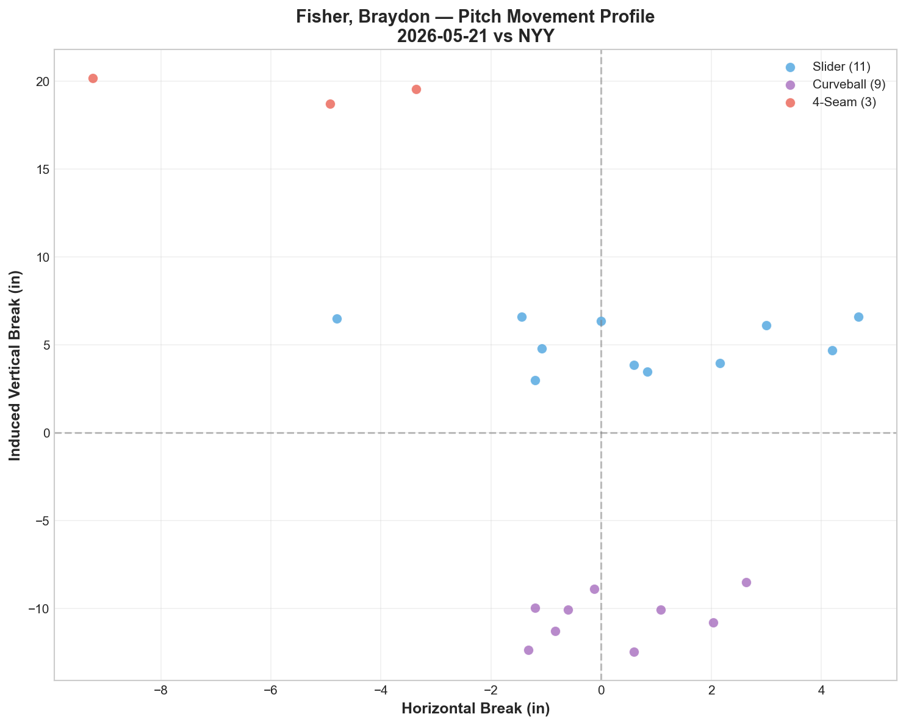
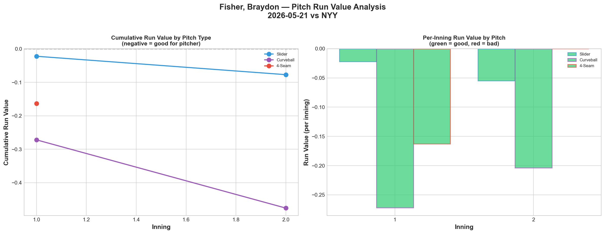
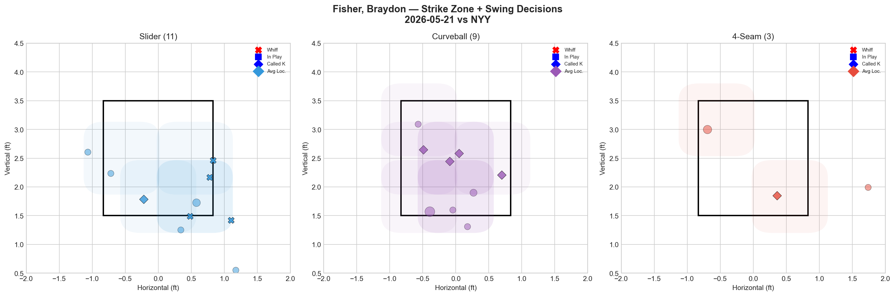
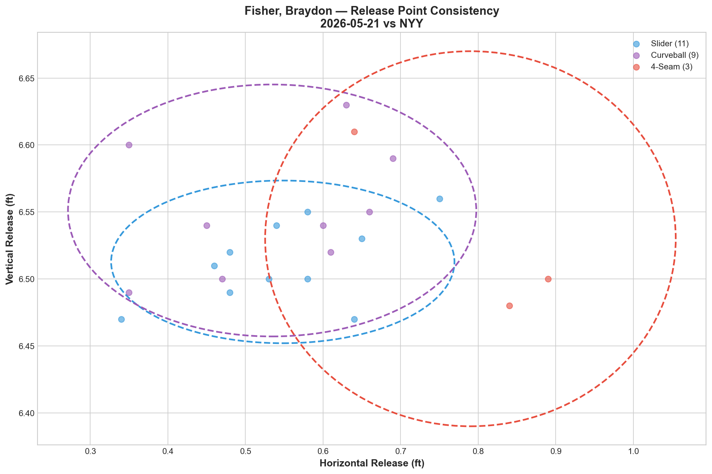
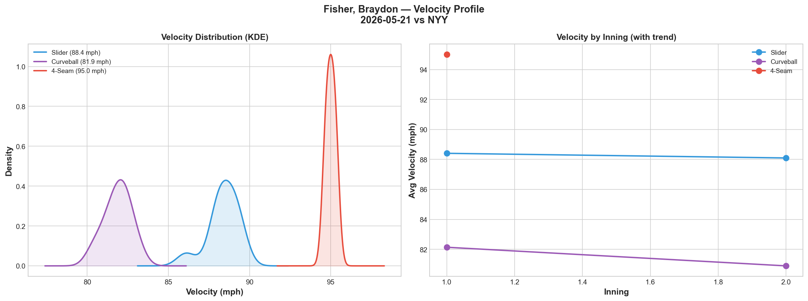
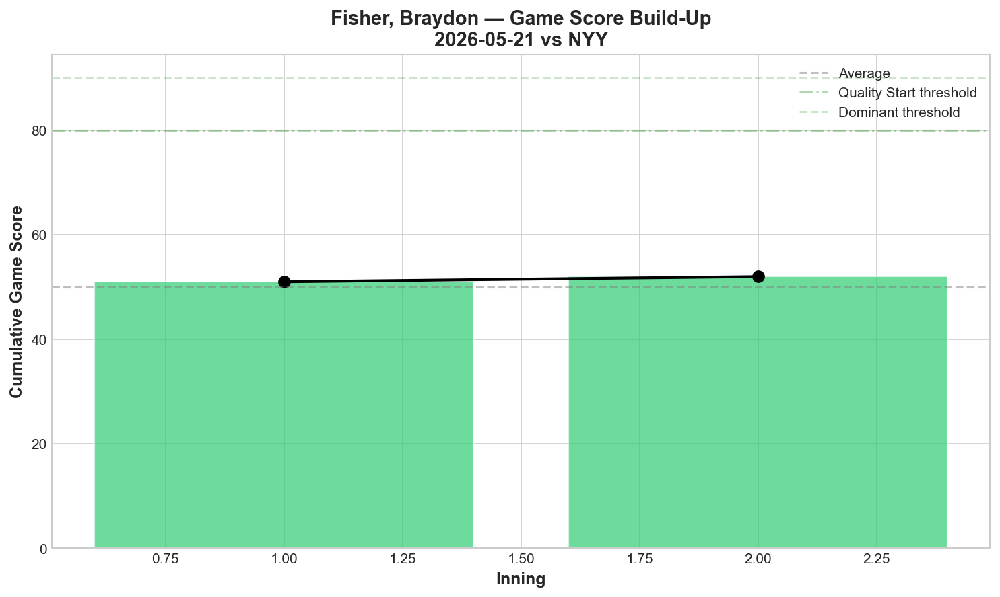
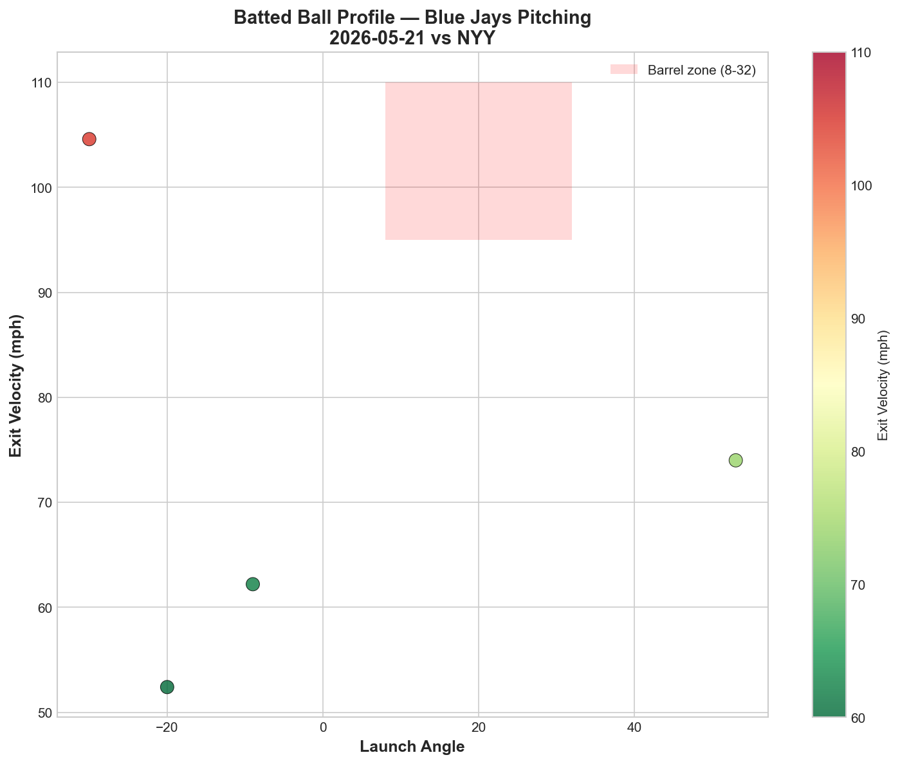
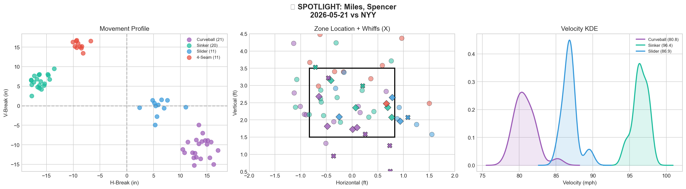
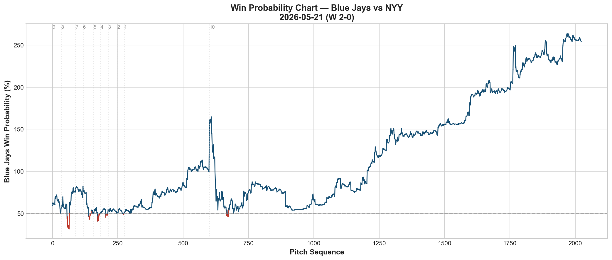
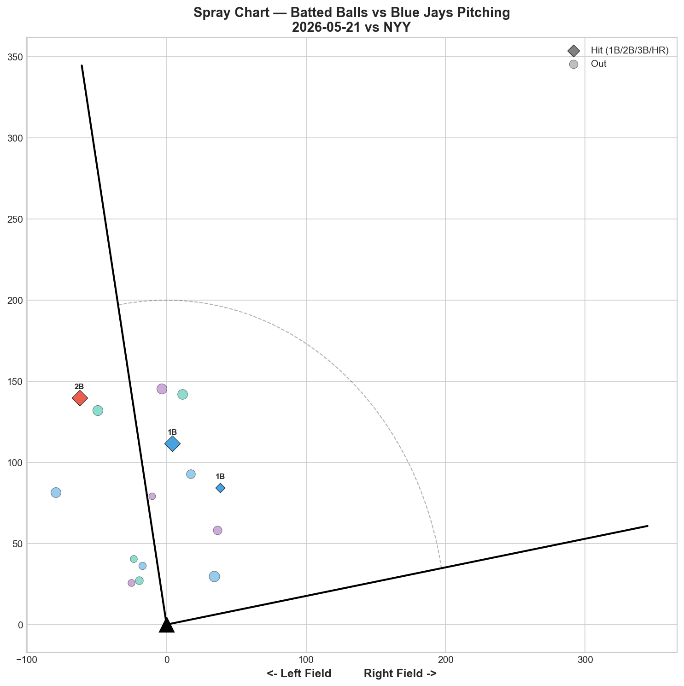

# 🏟️ Blue Jays Game Report v2.1
## 2026-05-21 | TOR @ NYY | W 2-0

---

## 📋 Game Overview

| | |
|---|---|
| **Date** | 2026-05-21 |
| **Matchup** | Toronto Blue Jays @ New York Yankees |
| **Result** | **W 2-0** |
| **Opener** | Braydon Fisher (23 pitches) |
| **Bulk Pitcher** | Spencer Miles (63 pitches) |
| **Spotlight Pitcher** | Spencer Miles |
| **Season Record** | 23W-26L |

**Bullpen Day Structure:** Fisher opened (23 pitches, 4K), Miles handled the bulk (63 pitches, 6K), then Macko (20), Hoffman (12), and Rogers (8) closed it out. Five pitchers combined for a **shutout at Yankee Stadium.**

---

## 🔥 Key Storylines

### 1. Back-to-Back Shutouts at Yankee Stadium

The Blue Jays followed Yesavage's 2-1 gem with a **2-0 bullpen day shutout.** Consecutive games holding the Yankees to 0 and 1 run in their own building — that's 18 innings of near-total dominance against one of the league's most dangerous lineups. The pitching staff allowed just **3 hits across 126 pitches.**

### 2. Fisher's Opener Role Was Perfectly Designed

Fisher threw just 23 pitches but set the tone: **4 strikeouts, 0 hits, 1 BB, and an 80% whiff rate on his slider.** His Slider/Curveball tunnel score of **31.9** is the highest single-game tunnel score in our report history. The two pitches share a near-identical release point (0.5in similarity) but separate by 15.6 inches at the plate — hitters had no chance to distinguish them. Judge (0-for, 1K), Rice (0-for, 1K), Chisholm (0-for, 1K), Goldschmidt (0-for, 1K) — four of the Yankees' core struck out in just 23 pitches.

### 3. Spencer Miles Emerged as the Bullpen Day Anchor

Miles threw 63 pitches — the most by any Blue Jays pitcher tonight — and delivered: **6K, 1BB, 2H, 0ER.** His curveball was the standout pitch: **45.5% whiff rate, 42.9% CSW, Grade A.** He paired it with a 96.4 mph sinker to create a devastating speed differential. For a team searching for rotation depth, Miles just made the case that he can handle bulk innings against elite lineups.

---

## ⚾ Opener Pitch Arsenal Analysis — Braydon Fisher

### Pitch Arsenal Performance (23 pitches)

| Pitch | # | Usage | Velo | Whiff% | CSW% | Chase% | Grade |
|-------|---|-------|------|--------|------|--------|-------|
| Slider | 11 | 47.8% | 88.4 | 80.0% | 45.5% | 33.3% | 🟢 A |
| Curveball | 9 | 39.1% | 81.9 | 0.0% | 44.4% | 0.0% | 🔴 D |
| 4-Seam | 3 | 13.0% | 95.0 | 0.0% | 33.3% | 0.0% | 🔴 D |

### Pitch Movement (inches)

| Pitch | H-Break | V-Break | Count |
|-------|---------|---------|-------|
| Slider (SL) | 0.6 | 5.1 | 11 |
| Curveball (CU) | 0.3 | -10.5 | 9 |
| 4-Seam (FF) | -5.8 | 19.5 | 3 |

### Pitch Tunneling Analysis

| Pair | Release Sim | Plate Sep | Tunnel | Velo Gap |
|------|-------------|-----------|--------|----------|
| **Slider/Curveball** | **0.5in** | **15.6in** | **🟢 31.9** | **6.5mph** |
| Curveball/4-Seam | 3.1in | 30.6in | 🟢 9.9 | 13.1mph |
| Slider/4-Seam | 2.9in | 15.8in | 🟢 5.4 | 6.6mph |

**🏆 Best Tunnel: Slider/Curveball (score: 31.9)** — This is an extraordinary number. The 0.5in release similarity means these two pitches are virtually indistinguishable out of the hand. The slider breaks laterally while the curve drops vertically, creating a 15.6in plate separation from the same release window. Hitters are forced to guess — and with an 80% whiff rate on the slider, they're guessing wrong.

### Pitch Run Value by Type

| Pitch | Total RV | Per Pitch | Pitches | Assessment |
|-------|----------|-----------|---------|------------|
| Curveball | -0.476 | -0.0529 | 9 | ✅ Most Effective |
| 4-Seam | -0.163 | -0.0543 | 3 | ✅ Effective |
| Slider | -0.077 | -0.007 | 11 | ✅ Effective |

All three pitches posted negative run values — Fisher gave up nothing.

### Pitch Selection by Count

| Situation | Primary | Secondary | Notes |
|-----------|---------|-----------|-------|
| First Pitch (0-0) | Curveball 60.0% | Slider 40.0% | Leads with breaking balls — unconventional |
| Ahead (0-1, 0-2, 1-2) | Slider 45.5% | Curveball 36.4% | Slider becomes the weapon |
| Behind | Slider 66.7% | Curveball 33.3% | Trusts slider even behind in count |
| Even | Slider 50.0% | FF/CU split | Balanced |

**Strikeout Pitches (4 K's):** CU 2, FF 1, SL 1 — curveball as the surprise putaway despite 0% whiff shows it's working through called strikes (44.4% CSW).

### Top Opposing Batters vs Fisher

| Batter | Pitches | Hits | K | BB | Avg EV |
|--------|---------|------|---|-----|--------|
| Ben Rice | 6 | 0 | 1 | 0 | 63.2 |
| Aaron Judge | 5 | 0 | 1 | 0 | 83.4 |
| Cody Bellinger | 5 | 0 | 0 | 1 | — |
| Jazz Chisholm | 4 | 0 | 1 | 0 | — |
| Paul Goldschmidt | 3 | 0 | 1 | 0 | — |

**Combined: 23 pitches, 0 hits, 4K, 1BB.** Fisher faced the heart of the Yankees order and blanked them entirely.

### vs LHB/RHB Split

| Stand | Pitches | Avg Velo | Swinging Strikes | Whiff/Pitch |
|-------|---------|----------|------------------|-------------|
| L | 15 | 86.2 | 3 | 20.0% |
| R | 8 | 87.7 | 1 | 12.5% |

### Release Point Consistency

| Pitch | H-Spread | V-Spread | Total | Rating |
|-------|----------|----------|-------|--------|
| Slider | 1.3in | 0.4in | 1.4in | 🟢 Tight |
| Curveball | 1.6in | 0.6in | 1.7in | 🟢 Tight |
| 4-Seam | 1.6in | 0.8in | 1.8in | 🟢 Tight |

### Velocity Profile

- **Slider:** 88.4 → 88.1 mph (-0.3 mph)
- **Curveball:** 82.1 → 80.9 mph (-1.2 mph)

Minimal drop in 23 pitches. Not enough workload to draw fatigue conclusions.

### Game Score

**Final: 52 (QUALITY).** 4K, 1H, 0HR, 1BB in 23 pitches. For an opener role, this is exactly what you want — set the tone and hand it off clean.

### Batted Ball Profile

| Metric | Value |
|--------|-------|
| Total BIP | 4 |
| Avg Exit Velo | 73.3 mph |
| Avg Launch Angle | -1.5° |
| Hard Hit (95+ mph) | 1/4 (25%) |

73.3 mph average exit velocity with a -1.5° average launch angle — Fisher induced weak ground ball contact exclusively.

---

## 🔍 Spotlight Pitcher — Spencer Miles (Bulk Role)

| | |
|---|---|
| **Role** | Bulk pitcher (entered after Fisher) |
| **Pitch Count** | 63 (game-high) |
| **Line** | 6K / 1BB / 2H / 0HR / 0ER |
| **Overall Whiff%** | 22.9% |
| **Role Assessment** | ✅ SOLID RELIEVER |

### Pitch Arsenal

| Pitch | # | Usage | Velo | Whiff% | CSW% | Grade |
|-------|---|-------|------|--------|------|-------|
| Curveball | 21 | 33.3% | 80.8 | 45.5% | 42.9% | 🟢 A |
| Sinker | 20 | 31.7% | 96.4 | 15.4% | 30.0% | 🟡 C |
| Slider | 11 | 17.5% | 86.9 | 20.0% | 36.4% | 🟢 B |
| 4-Seam | 11 | 17.5% | 95.6 | 0.0% | 9.1% | 🔴 D |

### Assessment

Miles delivered a statement performance: **63 pitches, 6K, 2H, 0ER against the Yankees.** His curveball is a legitimate weapon — 45.5% whiff rate and 42.9% CSW make it one of the best individual pitch performances in our report history. The 80.8 mph curveball paired with a 96.4 mph sinker creates a **15.6 mph speed differential** that keeps hitters off-balance throughout at-bats.

The 4-seam (0.0% whiff, 9.1% CSW, Grade D) is the clear weak link — when Miles threw it, hitters put it in play or took it. He should lean even harder into his CU/SI/SL trio and treat the 4-seam as a show-me pitch at best.

For a team exploring rotation options, Miles just demonstrated he can handle 63+ pitches against a contender-level lineup with dominant results. The question isn't whether he can pitch — it's what role maximizes his curveball-first arsenal.

---

## 📊 Bullpen Detailed Analysis

| Pitcher | Pitches | Line | Key Pitch | Notes |
|---------|---------|------|-----------|-------|
| **Braydon Fisher** | 23 | 4K / 1BB / 0H / 0HR | SL 80% whiff 🟢A | Opener — set the tone |
| **Spencer Miles** | 63 | 6K / 1BB / 2H / 0HR | CU 45.5% whiff 🟢A | Bulk anchor — dominant |
| **Adam Macko** | 20 | 2K / 0BB / 1H / 0HR | KC 50% whiff 🟢A | K-Curve flashed; SL/FF still 🔴D |
| **Jeff Hoffman** | 12 | 2K / 0BB / 0H / 0HR | SL 75% whiff 🟢A | Dominant slider, clean inning |
| **Tyler Rogers** | 8 | 0K / 1BB / 0H / 0HR | SI 100% usage 🔴D | Sinker-only — walked a batter |

### Bullpen Notes

- **Hoffman** continues to be the bullpen's most reliable arm — 75% whiff on his slider in 10 of 12 pitches. Back-to-back clean appearances.
- **Macko (2nd career appearance)** showed improvement over his debut: 2K, 1H, 0BB. His K-Curve flashed A-grade (50% whiff) — this could be the development pitch that unlocks his profile. The 4-seam and slider still need work (both 🔴D).
- **Rogers** relied exclusively on his sinker (8/8 pitches at 82.6 mph) but walked a batter and generated 0% whiffs. Functional but not sharp.

---

## 📈 Win Probability Analysis

### Key WPA Moments

| Inning | Event | Impact |
|--------|-------|--------|
| 8 | Morillo — HBP | 📉 Runner on base |
| 9 | Mejia — single | 📈 Positive (TOR) |
| 9 | Williams — double | 📈 Run-scoring |
| 9 | Williams — strikeout | 📉 Yankees rally attempt |
| 10 | Leiter Jr. — single | 📈 Positive (TOR) |
| 10 | Leiter Jr. — GIDP | 📉 Negative |

---

## 📊 Spray Chart & Batted Ball Summary

| Metric | Value |
|--------|-------|
| Total batted balls tracked | 15 |
| Hits | 3 (20%) |
| Pull | 0 (0%) |
| Center | 12 (80%) |
| Oppo | 3 (20%) |

**Zero pulled balls.** 80% center-field contact. The pitching staff's combined approach — Fisher's SL/CU tunnel, Miles' CU/SI differential — systematically prevented the Yankees from pulling the ball with authority. This is the hallmark of effective pitching design against a pull-heavy lineup.

---

## 🎯 Analytical Takeaways

1. **Fisher's SL/CU Tunnel (31.9) Is Elite** — The highest tunnel score in our report history. 0.5in release similarity with 15.6in plate separation means hitters literally cannot distinguish these two pitches until it's too late. This is the kind of pitch design that makes an opener viable against any lineup.

2. **Miles Made the Case for an Expanded Role** — 63 pitches, 6K, 0ER against the Yankees. His curveball (45.5% whiff, Grade A) paired with a 96.4 mph sinker is a legitimate starting-caliber combination. The 4-seam needs to be minimized, but his CU/SI/SL trio is more than enough.

3. **Macko's K-Curve Development** — After a 0.0% whiff debut on 5/19, Macko showed a 50% whiff rate on his K-Curve (3 pitches) in his second appearance. Small sample, but the shape is encouraging. If this pitch develops alongside his 94+ mph fastball, there's a real reliever profile here.

4. **Consecutive Shutout-Level Pitching at Yankee Stadium** — 5/20: W 2-1 (Yesavage 8K, GS74). 5/21: W 2-0 (bullpen day shutout). Two games, 1 run allowed, in the Bronx. This pitching staff is quietly developing into something legitimate.

5. **Game Classification: Bullpen Day Masterpiece** — Five pitchers, 126 total pitches, 0 runs, 3 hits, 14 strikeouts. The opener strategy (Fisher setting up Miles) worked exactly as designed.

---

*Report generated from Statcast data via pybaseball. All pitch metrics sourced from Baseball Savant.*
