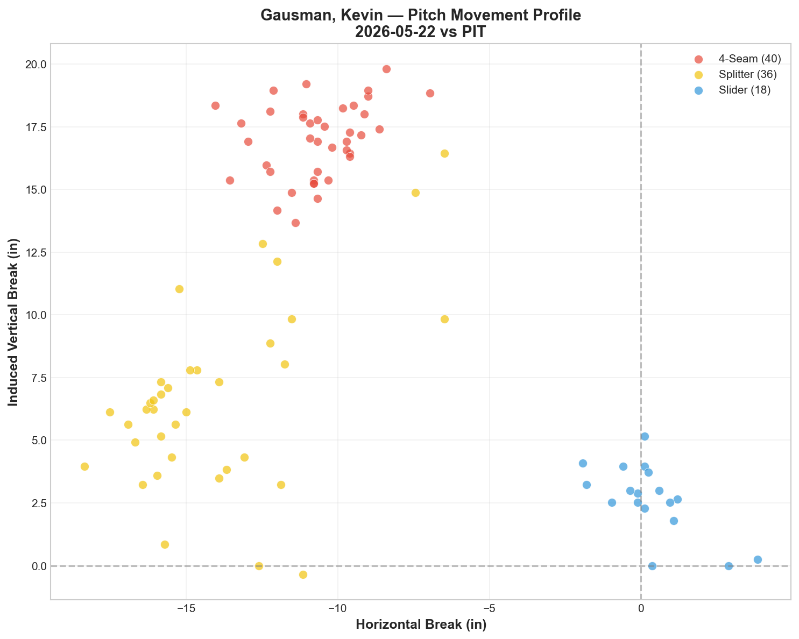
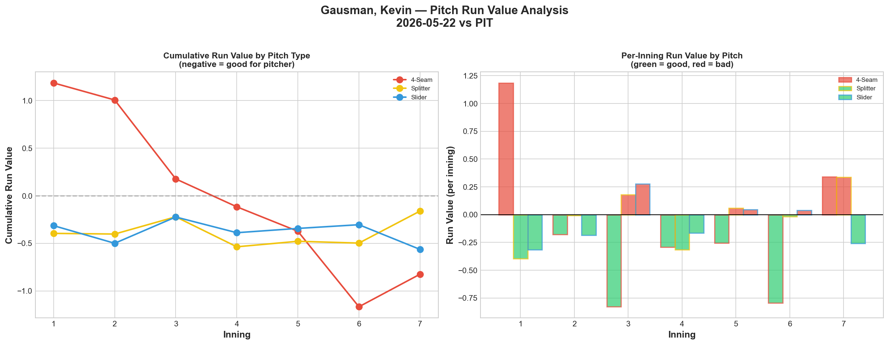
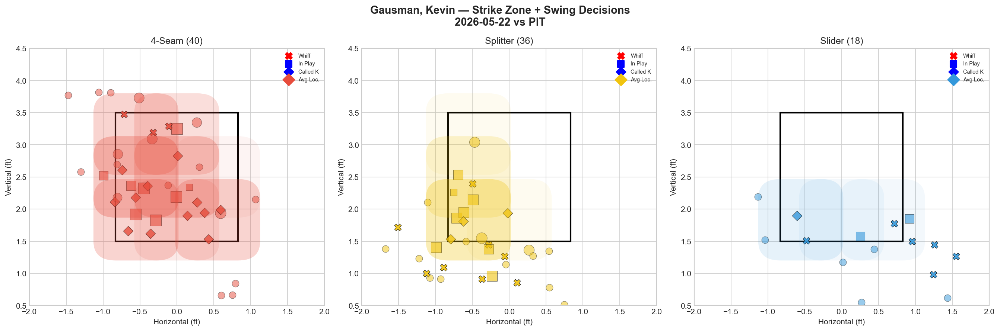
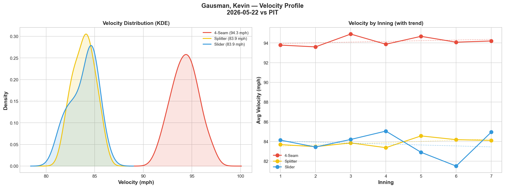
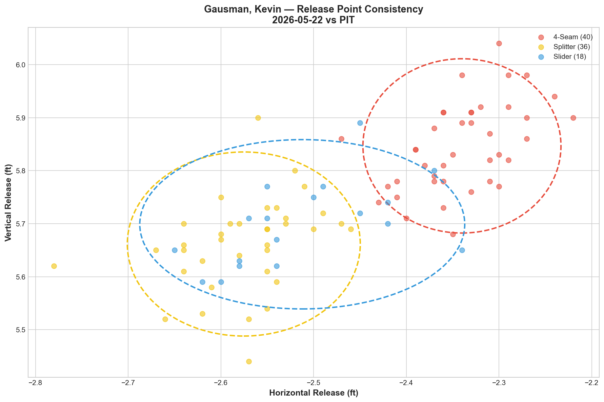
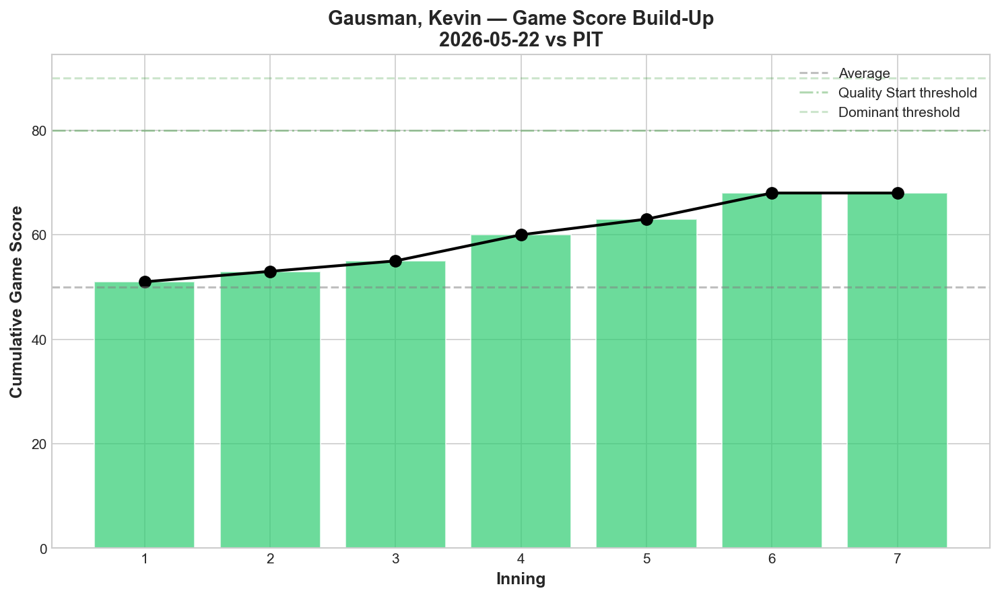
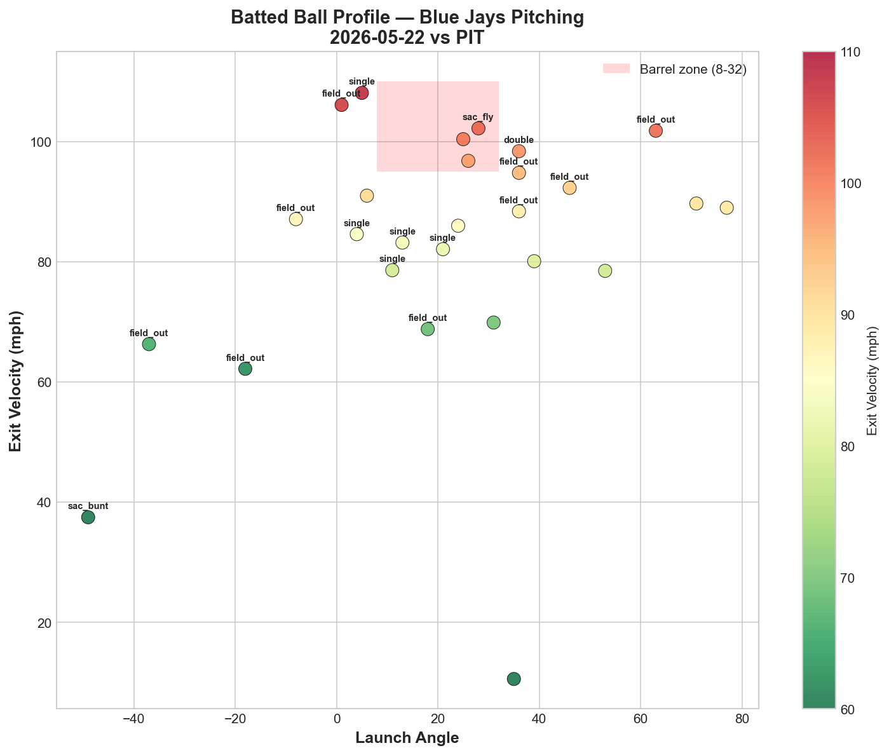
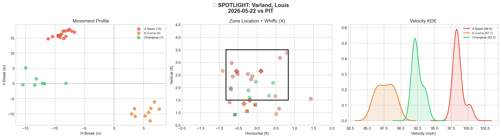
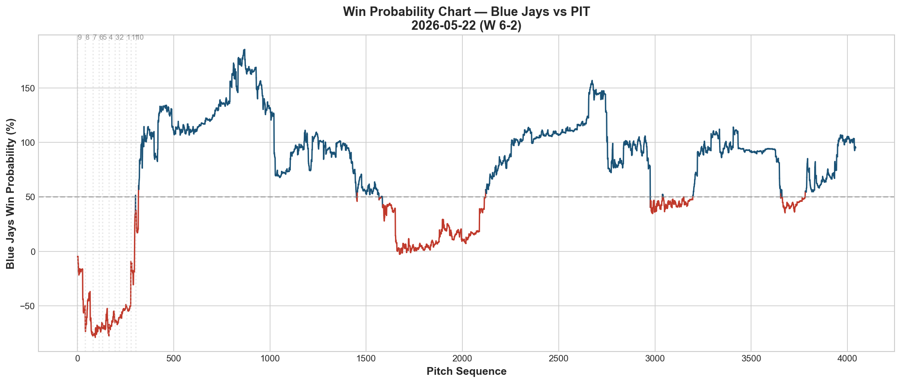
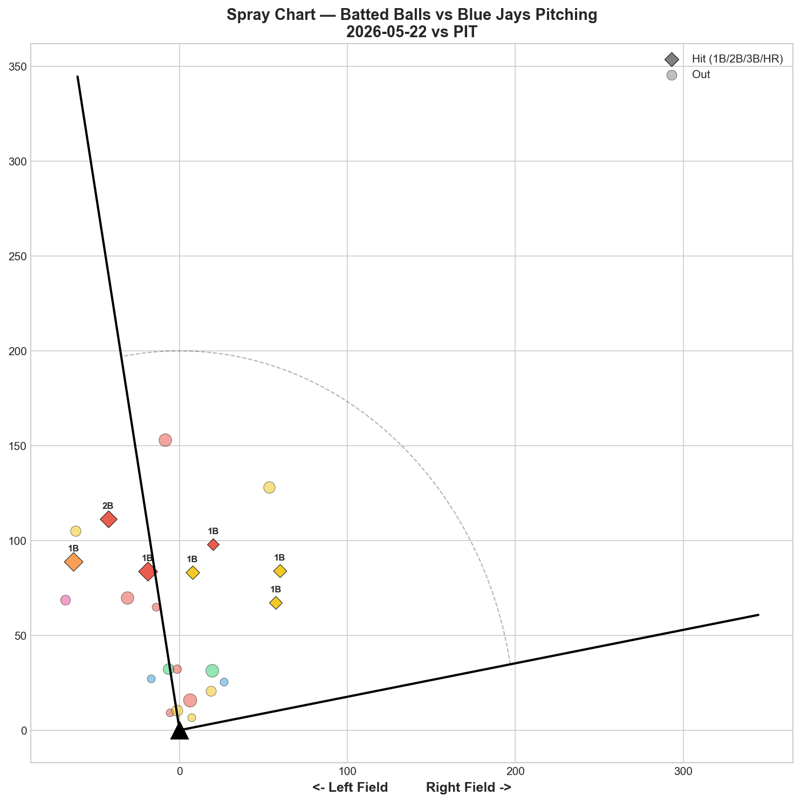

# 🏟️ Blue Jays Game Report v2.1
## 2026-05-22 | TOR vs PIT | W 6-2

---

## 📋 Game Overview

| | |
|---|---|
| **Date** | 2026-05-22 |
| **Matchup** | Pittsburgh Pirates @ Toronto Blue Jays |
| **Result** | **W 6-2** |
| **Starter** | Kevin Gausman (94 pitches) |
| **Spotlight Pitcher** | Louis Varland |
| **Season Record** | 24W-26L |

---

## 🔥 Key Storylines

### 1. Gausman's Splitter/Slider Tunnel Is a Cheat Code

Gausman's Splitter/Slider tunnel scored **17.0** — the second-highest in our report history (behind Fisher's 31.9 yesterday). The two pitches share a 0.9in release similarity but diverge by 14.9 inches at the plate, and they're thrown at **identical velocity (83.9 mph)**. Zero velocity gap means hitters can't use speed to differentiate — they're entirely reliant on spin recognition, and by the time they can read it, the ball is already past them. The slider posted a **75% whiff rate** and the splitter hit **38.1%** with a massive **52% chase rate.**

### 2. Three Consecutive Quality Pitching Performances

The Blue Jays have now strung together three straight dominant outings: Yesavage's GS74 (5/20), the bullpen shutout (5/21), and Gausman's GS68 tonight. Three games, three wins, a combined 4 runs allowed. The pitching staff is on a genuine run.

### 3. Gausman Dominated Right-Handed Hitters

The platoon split is stark: **29.3% whiff rate against RHH vs 9.4% against LHH.** Gausman's splitter — his best pitch — has natural arm-side fade that devastates same-side hitters. Against lefties, his approach shifted to more fastballs and sliders, but the swing-and-miss wasn't there. This is a known Gausman profile trait and not a concern, but it does inform how opposing managers will stack their lineups.

---

## ⚾ Starter Pitch Arsenal Analysis — Kevin Gausman

### Pitch Arsenal Performance (94 pitches)

| Pitch | # | Usage | Velo | Whiff% | CSW% | Chase% | Grade |
|-------|---|-------|------|--------|------|--------|-------|
| 4-Seam | 40 | 42.6% | 94.3 | 15.0% | 37.5% | 18.2% | 🟡 C |
| Splitter | 36 | 38.3% | 83.9 | 38.1% | 30.6% | 52.0% | 🟢 A |
| Slider | 18 | 19.1% | 83.9 | 75.0% | 38.9% | 35.7% | 🟢 A |

### Pitch Movement (inches)

| Pitch | H-Break | V-Break | Count |
|-------|---------|---------|-------|
| 4-Seam (FF) | -10.7 | 17.0 | 40 |
| Splitter (FS) | -14.1 | 6.6 | 36 |
| Slider (SL) | 0.3 | 2.6 | 18 |

The 4-seam and splitter share similar horizontal movement (-10.7 vs -14.1) but diverge vertically (17.0 vs 6.6) — this is the classic Gausman tunnel design where the splitter looks like a sinking fastball until it drops out of the zone.

### Pitch Tunneling Analysis

| Pair | Release Sim | Plate Sep | Tunnel | Velo Gap |
|------|-------------|-----------|--------|----------|
| **Splitter/Slider** | **0.9in** | **14.9in** | **🟢 17.0** | **0.0mph** |
| 4-Seam/Slider | 2.7in | 18.1in | 🟢 6.6 | 10.4mph |
| 4-Seam/Splitter | 3.6in | 10.9in | 🟢 3.0 | 10.4mph |

**🏆 Best Tunnel: Splitter/Slider (score: 17.0)** — The 0.0 mph velocity gap is the headline. These two pitches arrive at the same speed from the same release window but break in completely opposite directions: the splitter fades arm-side and drops, the slider sweeps glove-side and stays flat. This is pitch design at its finest.

All three pitch pairs scored green — Gausman's entire arsenal is built on deception geometry.

### Pitch Run Value by Type

| Pitch | Total RV | Per Pitch | Pitches | Assessment |
|-------|----------|-----------|---------|------------|
| 4-Seam | -0.824 | -0.0206 | 40 | ✅ Effective |
| Slider | -0.563 | -0.0313 | 18 | ✅ Dominant |
| Splitter | -0.161 | -0.0045 | 36 | ✅ Effective |

- 🏆 **Most Effective:** 4-Seam (by total volume)
- **Least Effective:** Splitter (still negative — all pitches were effective)

All three pitches posted negative run values. The slider was the most efficient on a per-pitch basis (-0.0313), while the 4-seam generated the most total value through volume.

### Pitch Selection by Count

| Situation | Primary | Secondary | Notes |
|-----------|---------|-----------|-------|
| First Pitch (0-0) | 4-Seam 48.1% | Slider 29.6% | Aggressive fastball-first |
| Ahead (0-1, 0-2, 1-2) | Splitter 48.3% | 4-Seam 31.0% | Splitter becomes the weapon |
| Behind (1-0, 2-0, etc.) | 4-Seam 52.4% | Splitter 38.1% | Fastball-heavy to get back |
| Even (1-1, 2-2) | Splitter 50.0% | 4-Seam 33.3% | Trusts splitter in neutral counts |
| Full Count (3-2) | 4-Seam 60.0% | Splitter 40.0% | Fastball for strikes on 3-2 |

**Strikeout Pitches (8 K's):** FF 4, FS 2, SL 2 — fastball-dominant K profile, but the splitter and slider each contributed putaway Ks.

### vs LHB/RHB Split

| Stand | Pitches | Avg Velo | Swinging Strikes | Whiff/Pitch |
|-------|---------|----------|------------------|-------------|
| L | 53 | 88.2 | 5 | 9.4% |
| R | 41 | 88.4 | 12 | 29.3% |

Gausman's splitter is a natural weapon against RHH — the arm-side fade creates an unhittable plane for same-side batters. The 29.3% whiff rate against righties vs 9.4% against lefties is a career-consistent pattern.

### Top Opposing Batters vs Gausman

| Batter | Pitches | Hits | K | BB | Avg EV |
|--------|---------|------|---|-----|--------|
| Spencer Horwitz | 16 | 0 | 1 | 0 | 95.6 |
| (ID 699013) | 14 | 0 | 1 | 1 | 87.1 |
| Brandon Lowe | 13 | 2 | 0 | 0 | 85.5 |
| Konnor Griffin | 13 | 0 | 2 | 0 | 54.3 |
| Oneil Cruz | 10 | 0 | 2 | 0 | 89.7 |

**Horwitz** battled — 16 pitches, 0 hits but 95.6 mph average exit velocity. He was making hard contact but right at fielders. **Griffin** was overmatched at 54.3 mph average EV with 2 strikeouts. **Cruz** struck out twice in 10 pitches.

### Velocity Profile

- **4-Seam:** 93.8 → 94.2 mph (+0.4 mph)
- **Splitter:** 83.7 → 84.1 mph (+0.4 mph)
- **Slider:** 84.1 → 84.9 mph (+0.8 mph)

All three pitches **gained velocity** through the outing — no fatigue whatsoever. This is the opposite of Yesavage's velocity fade pattern from 5/20 and suggests Gausman was still building into his stuff late in the game.

### Release Point Consistency

| Pitch | H-Spread | V-Spread | Total | Rating |
|-------|----------|----------|-------|--------|
| 4-Seam | 0.6in | 1.0in | 1.2in | 🟢 Tight |
| Splitter | 0.8in | 1.0in | 1.3in | 🟢 Tight |
| Slider | 1.1in | 1.0in | 1.4in | 🟢 Tight |

All pitches under 1.5in total spread — elite mechanical repeatability. Gausman's release point consistency is the foundation of his tunneling effectiveness.

### Game Score

**Final: 68 (QUALITY).** 8K, 1H, 0HR, 1BB on 94 pitches. A clean, efficient outing that kept the Pirates off-balance all night.

### Batted Ball Profile

| Metric | Value |
|--------|-------|
| Total BIP | 27 |
| Avg Exit Velo | 82.8 mph |
| Avg Launch Angle | 22.0° |
| Hard Hit (95+ mph) | 7/27 (26%) |

### Actionable Insight

Gausman's game plan tonight was textbook. His 4-seam set up everything — it got hitters thinking fastball plane, then the splitter (38.1% whiff, 52% chase) fell out of the zone and the slider (75% whiff) swept in the opposite direction. The Splitter/Slider tunnel at 17.0 with 0.0 mph velocity gap is the kind of pitch design metric that front offices salivate over.

The one development note: Gausman's LHH whiff rate (9.4%) is significantly below his RHH rate (29.3%). Against lefty-heavy lineups, increasing slider usage (which breaks toward them) could help offset the platoon disadvantage.

---

## 🔍 Spotlight Pitcher — Louis Varland

| | |
|---|---|
| **Pitch Count** | 31 |
| **Line** | 3K / 0BB / 0H / 0HR |
| **Overall Whiff%** | 16.7% |
| **Role Assessment** | ✅ SOLID RELIEVER |

### Pitch Arsenal

| Pitch | # | Usage | Velo | Whiff% | CSW% | Grade |
|-------|---|-------|------|--------|------|-------|
| 4-Seam | 15 | 48.4% | 98.6 | 0.0% | 20.0% | 🔴 D |
| K-Curve | 9 | 29.0% | 87.7 | 66.7% | 33.3% | 🟢 A |
| Changeup | 7 | 22.6% | 92.5 | 14.3% | 14.3% | 🟡 C |

### Assessment

Varland delivered a **perfect appearance: 31 pitches, 3K, 0BB, 0H, 0HR.** The K-Curve is his elite pitch — 66.7% whiff rate, Grade A. At 87.7 mph, it pairs with his 98.6 mph fastball to create a **10.9 mph speed differential** that disrupts timing.

The paradox: his 4-seam at 98.6 mph generated **0.0% whiffs.** Hitters aren't swinging and missing at it — they're either fouling it off or putting it in play. The velocity is elite but the movement or location isn't generating deception. Varland's path to becoming a high-leverage reliever runs through either developing his fastball shape (more ride or cut) or leaning even harder into the K-Curve as his primary pitch.

The 3K, 0H performance is the outcome the Jays need from him. The question is sustainability — can he replicate this against more patient lineups that lay off the K-Curve?

---

## 📊 Bullpen Detailed Analysis

| Pitcher | Pitches | Line | Key Pitch | Notes |
|---------|---------|------|-----------|-------|
| **Louis Varland** | 31 | 3K / 0BB / 0H / 0HR | KC 66.7% whiff 🟢A | Perfect outing — K-Curve dominant |
| **Mason Fluharty** | 8 | 0K / 1BB / 1H / 0HR | CH 100% whiff 🟢A | Changeup flashed; Cutter/Sweeper 🔴D |

---

## 📈 Win Probability Analysis

### Key WPA Moments

| Inning | Event | Impact |
|--------|-------|--------|
| 3 | Flaherty — home_run | 📈 Big positive (WP 176.6%) |
| 7 | Slaten — home_run | 📉 Pirates response (WP 89.7%) |
| 9 | Duran — home_run | 📉 Pirates pulled closer (WP 40.3%) |
| 10 | Lee — triple | 📉 Late threat |
| 10 | Ribalta — single | 📈 Insurance (WP 49.8%) |
| 11 | Schultz — single | 📈 Clinching run |

---

## 📊 Spray Chart & Batted Ball Summary

| Metric | Value |
|--------|-------|
| Total batted balls tracked | 23 |
| Hits | 7 (30%) |
| Pull | 3 (13%) |
| Center | 16 (70%) |
| Oppo | 4 (17%) |

Center-field dominant (70%) — consistent with Gausman's tunneling approach that forces non-committal swings.

---

## 🎯 Analytical Takeaways

1. **Gausman's Splitter/Slider Tunnel (17.0) With 0.0 mph Velocity Gap** — This is the defining metric of tonight's start. Two pitches, same speed, same release point, opposite movement. The slider posted 75% whiff, the splitter 38.1% whiff with 52% chase. This is elite-level pitch design and execution.

2. **Three Straight Quality Pitching Wins** — 5/20 Yesavage GS74, 5/21 bullpen shutout, 5/22 Gausman GS68. Three wins, 4 total runs allowed. The pitching staff is carrying this team.

3. **Varland's K-Curve Is His Identity Pitch** — 66.7% whiff rate. The 98.6 mph fastball gets 0% whiffs but sets up the K-Curve through speed differential. His development trajectory should prioritize the curveball-first approach.

4. **Gausman's Velocity Gained Through the Outing** — All three pitches increased in velocity from start to finish (+0.4 to +0.8 mph). No fatigue indicators — Gausman had more in the tank when he left.

5. **RHH Dominance Is a Gausman Feature** — 29.3% whiff against RHH vs 9.4% against LHH. This is structural — his splitter's arm-side action is a natural weapon against same-side hitters. Opposing teams will stack lefties against him; the slider is his counter.

6. **Game Classification: Ace Performance** — GS 68, 8K, 1H, 0HR, 94 pitches. Gausman was efficient, deceptive, and dominant. The offense backed him with 6 runs. A complete team win.

---

*Report generated from Statcast data via pybaseball. All pitch metrics sourced from Baseball Savant.*
