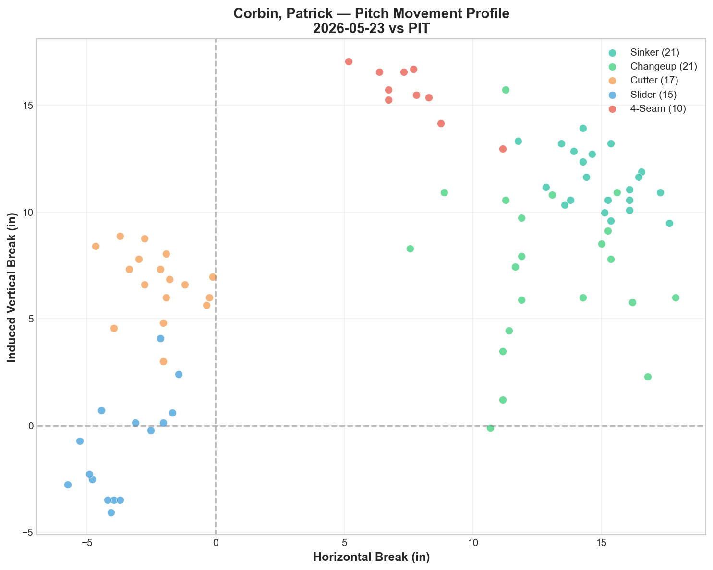
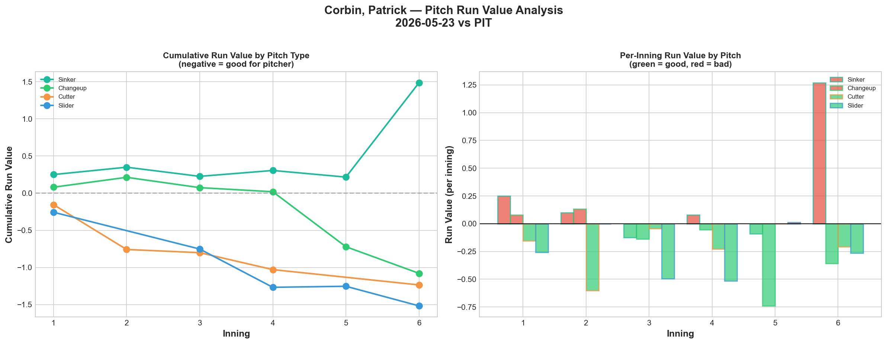
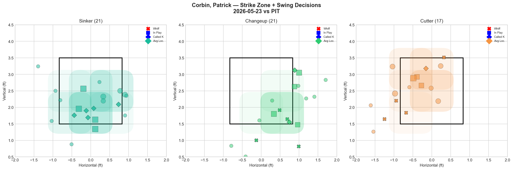
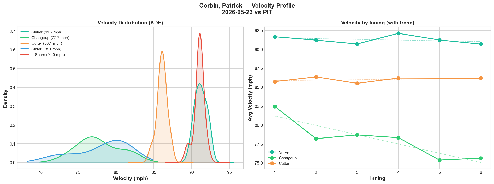
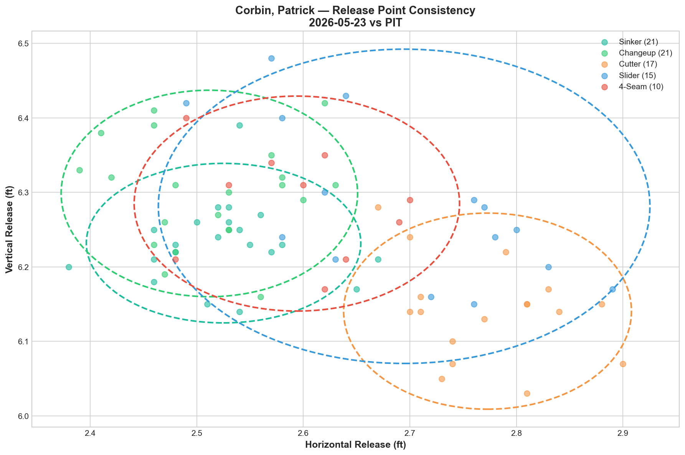
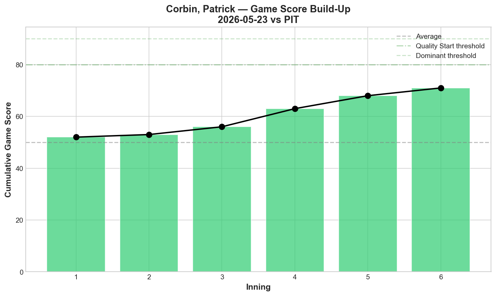
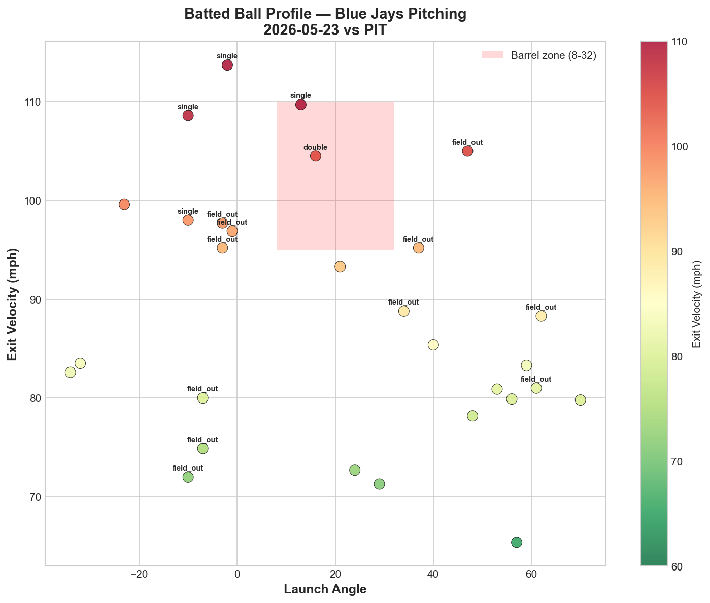
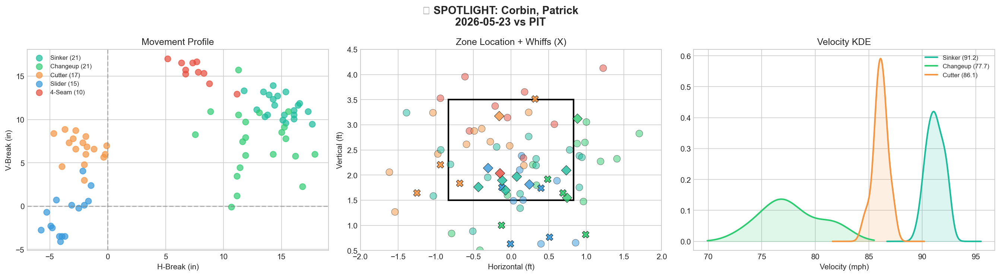
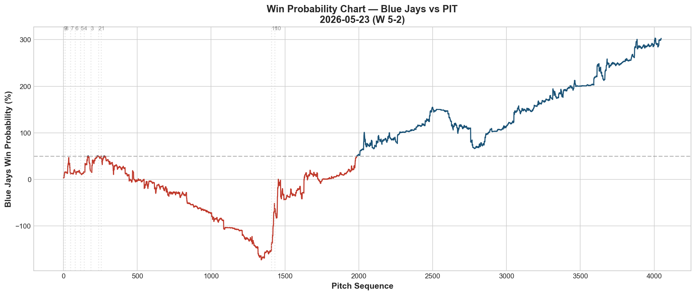
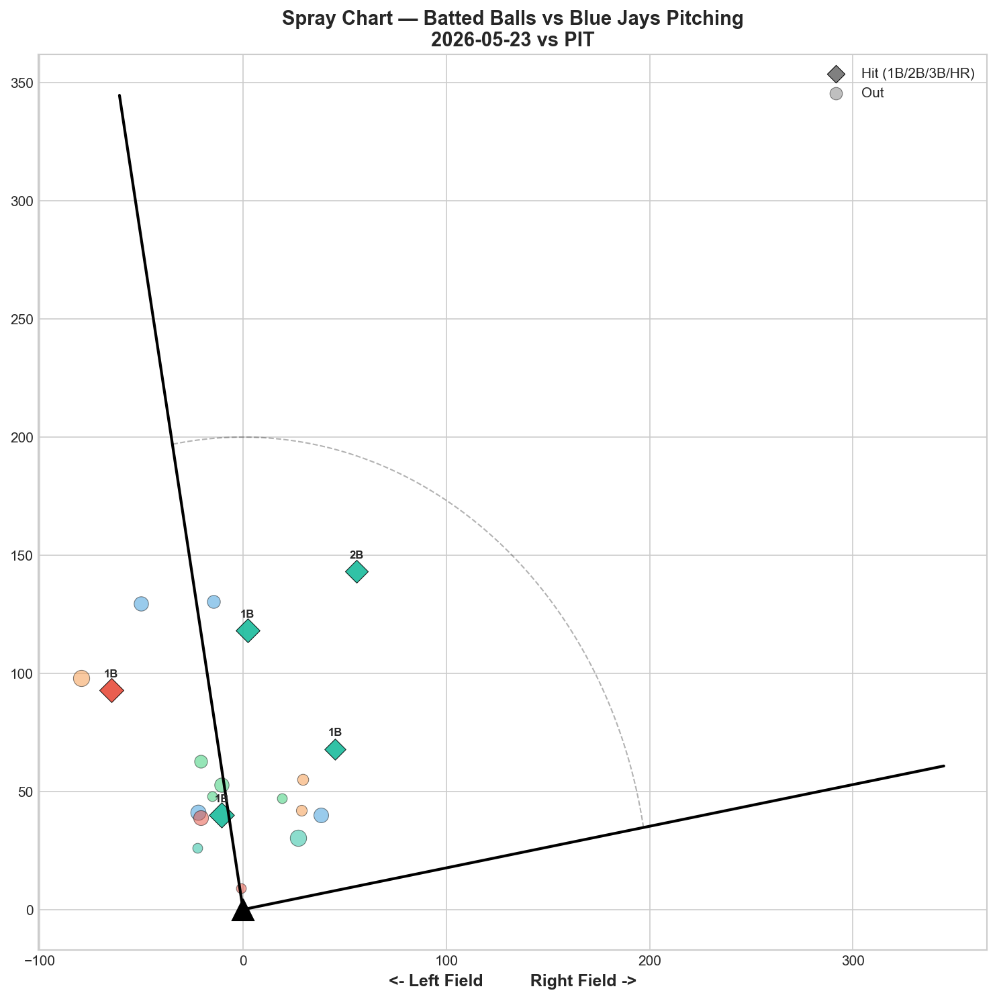

# 🏟️ Blue Jays Game Report v2.1
## 2026-05-23 | TOR vs PIT | W 5-2

---

## 📋 Game Overview

| | |
|---|---|
| **Date** | 2026-05-23 |
| **Matchup** | Pittsburgh Pirates @ Toronto Blue Jays |
| **Result** | **W 5-2** |
| **Starter** | Patrick Corbin (84 pitches) |
| **Spotlight Pitcher** | Patrick Corbin |
| **Season Record** | 25W-26L |

---

## 🔥 Key Storylines

### 1. The Data Case for Corbin as a 3-Pitch Pitcher Is Now Undeniable

Corbin threw five different pitch types tonight. Three of them were elite: **Slider (-1.517 RV, 44.4% whiff, Grade A), Cutter (-1.235 RV, 30.8% whiff, Grade A), Changeup (-1.079 RV, 44.4% whiff, Grade A).** Two of them were liabilities: **Sinker (+1.486 RV, 0.0% whiff, Grade D), 4-Seam (+0.109 RV, 0.0% whiff, Grade D).** This is now the second consecutive Corbin start where the data screams the same message — shelve the sinker, minimize the 4-seam, and let the SL/FC/CH trio carry the workload.

### 2. Four Consecutive Wins — The Pitching Staff Is on a Roll

5/20 Yesavage W 2-1, 5/21 Bullpen W 2-0, 5/22 Gausman W 6-2, 5/23 Corbin W 5-2. **Four straight wins, 7 total runs allowed.** The rotation is delivering quality starts, the bullpen is holding leads, and the team is creeping back toward .500 (25-26).

### 3. Corbin's Changeup Velocity Dropped 6.8 mph Through the Outing

The changeup went from 82.4 mph in the first inning to 75.6 mph by the end — a **-6.8 mph decline.** This is an unusually large drop and could indicate fatigue, mechanical drift, or intentional velocity manipulation to increase speed differential. Worth monitoring in his next start.

---

## ⚾ Starter Pitch Arsenal Analysis — Patrick Corbin

### Pitch Arsenal Performance (84 pitches)

| Pitch | # | Usage | Velo | Whiff% | CSW% | Chase% | Grade |
|-------|---|-------|------|--------|------|--------|-------|
| Sinker | 21 | 25.0% | 91.2 | 0.0% | 23.8% | 37.5% | 🔴 D |
| Changeup | 21 | 25.0% | 77.7 | 44.4% | 28.6% | 33.3% | 🟢 A |
| Cutter | 17 | 20.2% | 86.1 | 30.8% | 29.4% | 62.5% | 🟢 A |
| Slider | 15 | 17.9% | 78.1 | 44.4% | 40.0% | 42.9% | 🟢 A |
| 4-Seam | 10 | 11.9% | 91.0 | 0.0% | 10.0% | 0.0% | 🔴 D |

The split is binary: CH/FC/SL are elite weapons. SI/FF are liabilities.

### Pitch Movement (inches)

| Pitch | H-Break | V-Break | Count |
|-------|---------|---------|-------|
| Sinker (SI) | 15.0 | 11.5 | 21 |
| Changeup (CH) | 12.9 | 7.3 | 21 |
| Cutter (FC) | -2.2 | 6.7 | 17 |
| Slider (SL) | -3.6 | -1.0 | 15 |
| 4-Seam (FF) | 7.6 | 15.6 | 10 |

### Pitch Tunneling Analysis

| Pair | Release Sim | Plate Sep | Tunnel | Velo Gap |
|------|-------------|-----------|--------|----------|
| **Slider/4-Seam** | **1.2in** | **20.0in** | **🟢 16.6** | **12.9mph** |
| Sinker/Slider | 2.1in | 22.4in | 🟢 10.6 | 13.1mph |
| Changeup/4-Seam | 1.0in | 9.8in | 🟢 9.9 | 13.3mph |
| Changeup/Slider | 2.2in | 18.4in | 🟢 8.4 | 0.4mph |
| Sinker/4-Seam | 1.0in | 8.4in | 🟢 8.1 | 0.2mph |
| Sinker/Changeup | 0.8in | 4.7in | 🟢 5.8 | 13.5mph |

**🏆 Best Tunnel: Slider/4-Seam (score: 16.6)** — 1.2in release similarity with 20.0 inches of plate separation and a 12.9 mph velocity gap.

All 10 pitch pairs scored green — Corbin's five-pitch arsenal creates tunneling complexity everywhere. The problem isn't deception; it's that two of the five pitches (SI/FF) are being hit despite the tunneling advantage.

### Pitch Run Value by Type

| Pitch | Total RV | Per Pitch | Pitches | Assessment |
|-------|----------|-----------|---------|------------|
| Slider | -1.517 | -0.1011 | 15 | ✅ Elite |
| Cutter | -1.235 | -0.0726 | 17 | ✅ Dominant |
| Changeup | -1.079 | -0.0514 | 21 | ✅ Dominant |
| 4-Seam | +0.109 | +0.0109 | 10 | ⚠️ Marginal |
| Sinker | +1.486 | +0.0708 | 21 | 🔴 Catastrophic |

- 🏆 **Most Effective:** Slider (-0.1011 per pitch)
- ⚠️ **Least Effective:** Sinker (+0.0708 per pitch)

**The sinker alone gave back +1.486 in run value** — nearly erasing the combined value of the changeup (-1.079) and a significant chunk of the cutter (-1.235). If Corbin threw zero sinkers and redistributed those 21 pitches to his three A-grade offerings, his game score would have been significantly higher.

### Pitch Selection by Count

| Situation | Primary | Secondary | Notes |
|-----------|---------|-----------|-------|
| First Pitch (0-0) | Cutter 30.4% | Sinker 26.1% | Diverse first-pitch mix |
| Ahead (0-1, 0-2, 1-2) | 4-Seam 28.6% | CH/SL 25% each | Breaking balls ahead in count |
| Behind (1-0, 2-0, etc.) | Sinker 58.3% | Cutter 25.0% | Over-reliance on sinker behind |
| Even (1-1, 2-2) | Changeup 40.0% | Sinker 25.0% | Changeup as primary even-count pitch |
| Full Count (3-2) | Slider 100% | — | Trusts slider in clutch |

The most concerning pattern: **58.3% sinker usage when behind in the count.** Corbin defaults to his worst pitch precisely when he can least afford to — when he needs a strike. This is the sequencing adjustment that could transform his outings.

**Strikeout Pitches (7 K's):** SL 3, CH 2, SI 1, FF 1 — slider is the primary putaway pitch.

### vs LHB/RHB Split

| Stand | Pitches | Avg Velo | Swinging Strikes | Whiff/Pitch |
|-------|---------|----------|------------------|-------------|
| L | 10 | 86.2 | 0 | 0.0% |
| R | 74 | 84.2 | 12 | 16.2% |

Only 10 pitches to lefties (0 whiffs) vs 74 to righties (16.2% whiff). Limited LHH sample, but the matchup disparity exists.

### Top Opposing Batters vs Corbin

| Batter | Pitches | Hits | K | BB | Avg EV |
|--------|---------|------|---|-----|--------|
| Bryan Reynolds | 13 | 2 | 1 | 0 | 96.2 |
| Nick Gonzales | 13 | 0 | 1 | 0 | 88.2 |
| Jared Triolo | 10 | 0 | 1 | 0 | 89.4 |
| Spencer Horwitz | 10 | 1 | 0 | 0 | 88.7 |
| Marcell Ozuna | 9 | 1 | 2 | 0 | 84.7 |

**Reynolds** was the toughest out — 2 hits with 96.2 mph average exit velocity. He found the sinker. **Ozuna** struck out twice despite getting a hit — Corbin won the at-bat battle overall.

### Velocity Profile

- **Sinker:** 91.6 → 90.7 mph (-1.0 mph)
- **Changeup:** 82.4 → 75.6 mph (-6.8 mph)
- **Cutter:** 85.7 → 86.2 mph (+0.4 mph)

The changeup's -6.8 mph velocity drop is the outlier. The cutter actually gained velocity — suggesting arm fatigue isn't the issue. The changeup velocity fade could be intentional (increasing speed differential late) or a mechanical drift worth investigating.

### Release Point Consistency

| Pitch | H-Spread | V-Spread | Total | Rating |
|-------|----------|----------|-------|--------|
| Sinker | 0.8in | 0.6in | 1.0in | 🟢 Tight |
| Changeup | 0.8in | 0.8in | 1.2in | 🟢 Tight |
| Cutter | 0.8in | 0.8in | 1.1in | 🟢 Tight |
| Slider | 1.4in | 1.3in | 1.9in | 🟢 Tight |
| 4-Seam | 0.9in | 0.9in | 1.3in | 🟢 Tight |

All five pitches under 2.0in — excellent repeatability across the entire arsenal.

### Game Score

**Final: 69 (QUALITY).** 7K, 5H, 0HR, 0BB on 84 pitches. Despite the sinker leaking run value, Corbin kept the Pirates off the board with zero walks and zero home runs.

### Batted Ball Profile

| Metric | Value |
|--------|-------|
| Total BIP | 29 |
| Avg Exit Velo | 88.5 mph |
| Avg Launch Angle | 20.2° |
| Hard Hit (95+ mph) | 11/29 (38%) |

38% hard-hit rate is elevated — the sinker's positive run value is reflected here. Pirates were making hard contact on the fastball offerings even when the breaking balls were dominant.

---

## 🔍 Spotlight Pitcher — Patrick Corbin

| | |
|---|---|
| **Pitch Count** | 84 |
| **Line** | 7K / 0BB / 5H / 0HR |
| **Overall Whiff%** | 26.1% |
| **Role Assessment** | ✅ SOLID RELIEVER (starter context) |

### The Corbin Optimization Case — A Two-Start Data Summary

| Metric | 5/18 vs NYY | 5/23 vs PIT | Pattern |
|--------|-------------|-------------|---------|
| Sinker RV | +1.733 | +1.486 | 🔴 Consistently catastrophic |
| Slider RV | — | -1.517 | ✅ Elite |
| Cutter RV | — | -1.235 | ✅ Dominant |
| Changeup RV | — | -1.079 | ✅ Dominant |
| SL/CH Tunnel | 33.4 | — | ✅ Elite |
| SL/FF Tunnel | — | 16.6 | ✅ Elite |

The data across two starts is now conclusive. Corbin's sinker has produced **+3.219 combined run value** across his last two outings — this is the single pitch that separates him from being a quality starter. His SL/FC/CH combination generates elite whiff rates, elite chase rates, and negative run values. The sinker generates zero whiffs, positive run value, and hard contact.

**Recommendation:** Transition to a SL/FC/CH primary arsenal with the 4-seam as an occasional show-me pitch. Reduce sinker usage from 25% to under 10% — or eliminate it entirely.

---

## 📊 Bullpen Detailed Analysis

| Pitcher | Pitches | Line | Key Pitch | Notes |
|---------|---------|------|-----------|-------|
| **Jeff Hoffman** | 13 | 3K / 0BB / 0H / 0HR | SL 66.7% whiff, FS 50%, FF 100% — **ALL A** | Perfect outing. Every pitch graded A. |
| **Adam Macko** | 10 | 0K / 1BB / 0H / 0HR | SL 50% whiff 🟢A, FF 25% 🟢B | Best appearance yet — slider breakthrough |
| **Yariel Rodríguez** | 20 | 0K / 2BB / 0H / 0HR | 0% whiff all pitches 🔴D | Third appearance, still 0% whiff. Concerning. |
| **Braydon Fisher** | 14 | 2K / 1BB / 0H / 0HR | CU 100% whiff 🟢A, SL 33.3% 🟢A | Curveball is filthy |

### Bullpen Notes

- **Hoffman** is the bullpen ace. Three straight perfect appearances with all pitches grading A. He's the highest-leverage arm available.
- **Macko (3rd appearance)** continues to develop: debut 0% whiff → 2nd game K-Curve 50% → tonight slider 50% whiff, fastball 25% whiff. The trajectory is clearly upward.
- **Rodríguez** posted 0% whiff for the third time. 20 pitches, 2 walks, 0K — this is not major-league-ready stuff against any lineup. Development assignment may be needed.
- **Fisher** confirms his SL/CU combination is legitimate — curveball at 100% whiff rate, slider at 33.3%. Back-to-back strong outings.

---

## 📈 Win Probability Analysis

### Key WPA Moments

| Inning | Event | Impact |
|--------|-------|--------|
| 4 | Gasser — home_run | 📉 Pirates took lead (WP 80.2%) |
| 5 | Leahy — home_run | 📈 Jays responded |
| 5 | Fedde — home_run | 📈 Big swing (WP 243.6%) |
| 9 | Santillan — single | 📉 Pirates late threat |
| 9 | Rogers — strikeout | 📉 Threat neutralized |
| 10 | Johnson — FC out | 📈 Defensive play |

---

## 📊 Spray Chart & Batted Ball Summary

| Metric | Value |
|--------|-------|
| Total batted balls tracked | 20 |
| Hits | 5 (25%) |
| Pull | 2 (10%) |
| Center | 15 (75%) |
| Oppo | 3 (15%) |

75% center-field contact — consistent with the pattern we've seen all week.

---

## 🎯 Analytical Takeaways

1. **Corbin's Sinker Problem Is Now a Two-Start Pattern** — +1.733 RV (5/18) + +1.486 RV (5/23) = +3.219 combined. Meanwhile SL/FC/CH have combined for -3.831 RV across tonight alone. The sinker is actively undermining an otherwise elite arsenal. This is the clearest optimization opportunity on the roster.

2. **Four Straight Wins, Team Approaching .500** — 25-26. The pitching staff has allowed 7 runs in 4 games. If the rotation keeps delivering quality starts, a .500 record by June 1 is realistic.

3. **Hoffman Is the Bullpen's Best Arm** — Three consecutive perfect outings with all pitches grading A. He's earning high-leverage trust with every appearance.

4. **Macko's Development Arc Is Encouraging** — Whiff trajectory: 0% → 50% (K-Curve) → 50% (Slider) + 25% (FF). Each appearance has been better than the last. The slider is emerging as his swing-and-miss pitch.

5. **Rodríguez Needs a Reset** — Three appearances, 0% whiff rate in every one. The stuff doesn't generate swing-and-miss at the major league level right now. A development assignment to refine pitch shape could be the right move.

6. **Game Classification: Quality Start + Offensive Support** — Corbin GS69, 7K, 0BB. The offense provided 5 runs. A complete win despite the sinker leaking value — imagine what Corbin could do without it.

---

*Report generated from Statcast data via pybaseball. All pitch metrics sourced from Baseball Savant.*
