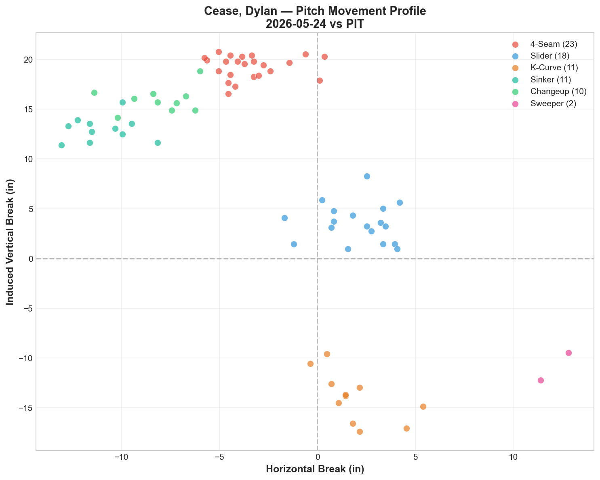
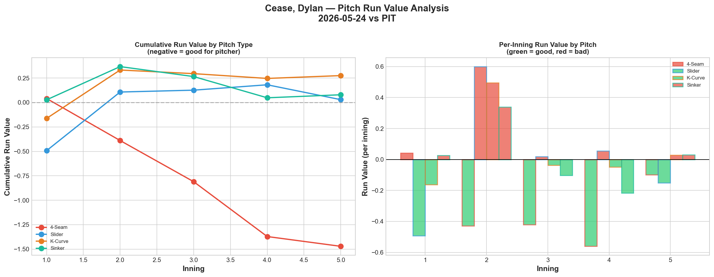
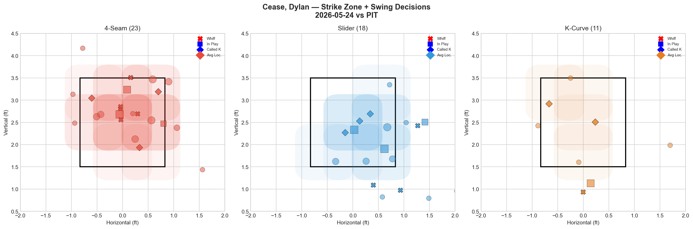
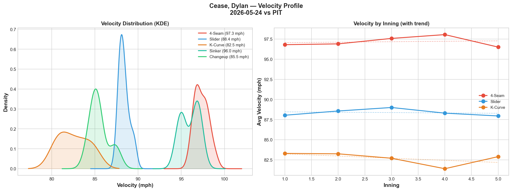
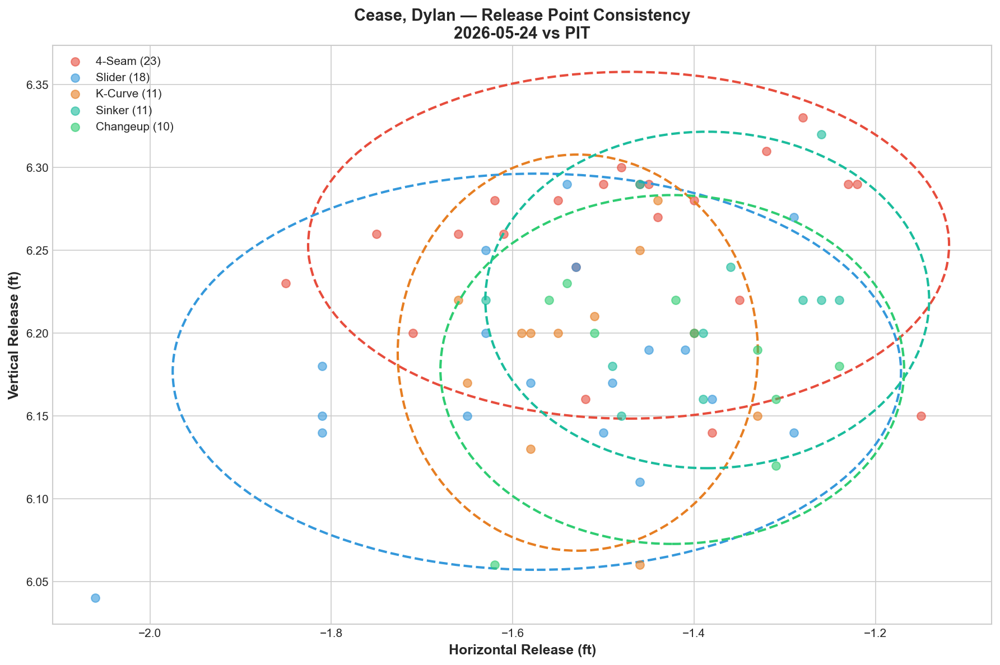
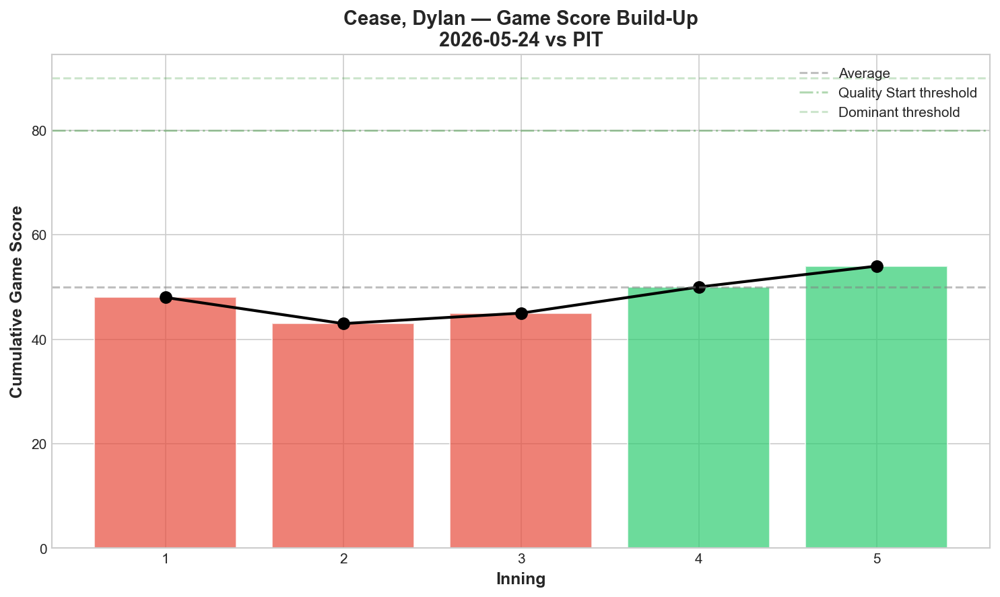
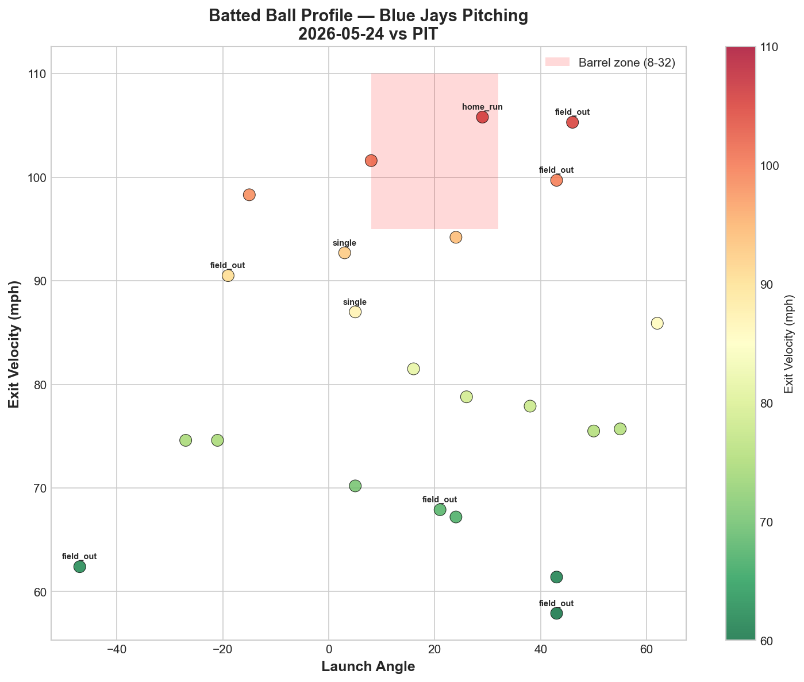
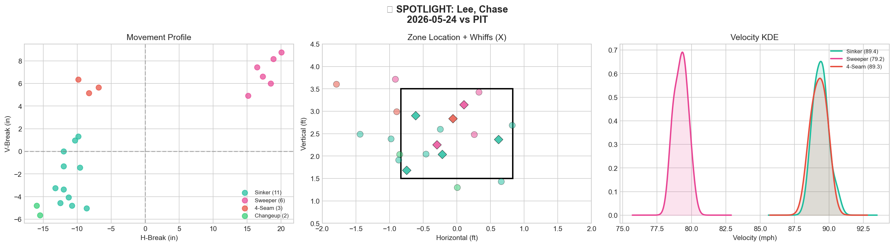
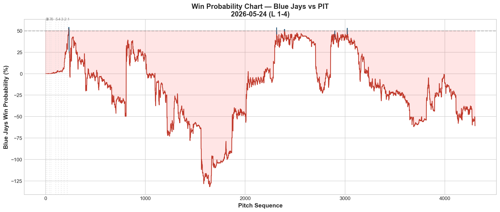
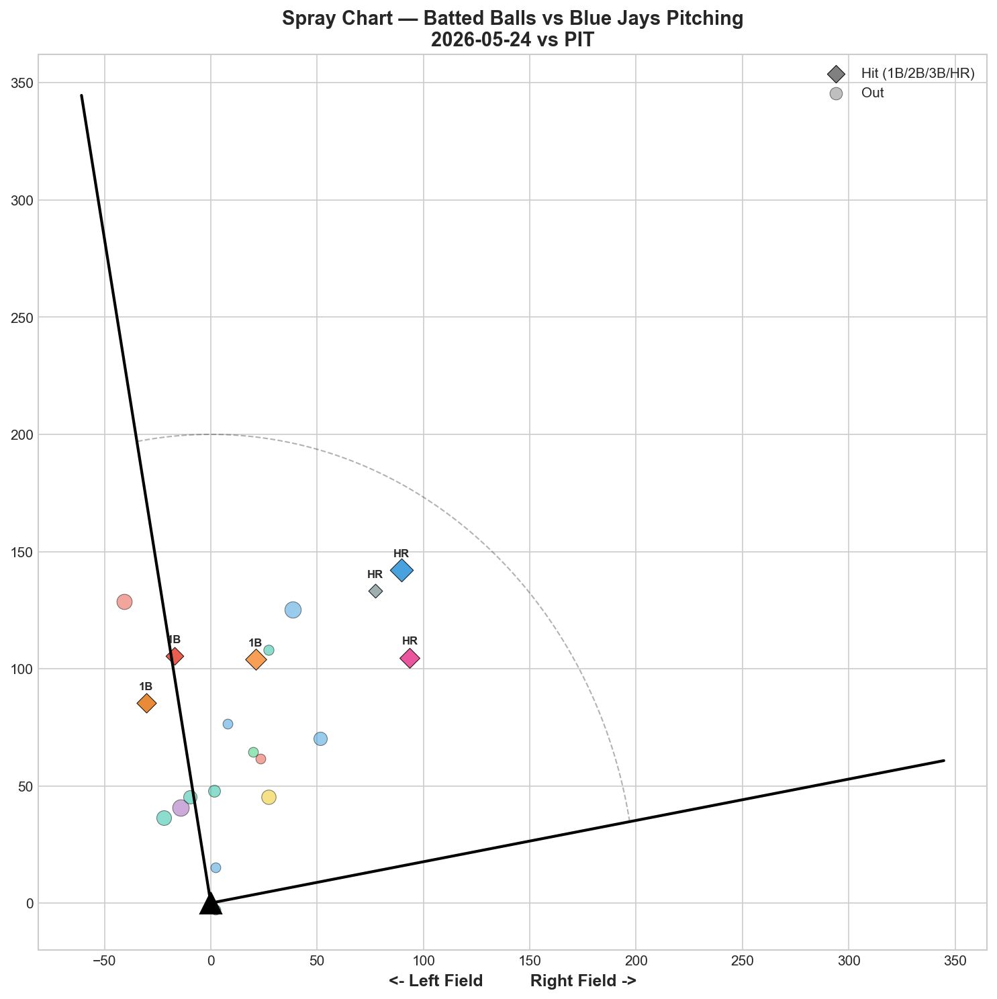

# 🏟️ Blue Jays Game Report v2.1
## 2026-05-24 | TOR vs PIT | L 1-4

---

## 📋 Game Overview

| | |
|---|---|
| **Date** | 2026-05-24 |
| **Matchup** | Pittsburgh Pirates @ Toronto Blue Jays |
| **Result** | **L 1-4** |
| **Starter** | Dylan Cease (77 pitches, exited 5th — hamstring) |
| **Spotlight Pitcher** | Chase Lee |
| **Season Record** | 25W-28L |

---

## 🔥 Key Storylines

### 1. Cease Exited With Hamstring Discomfort — And He Was Dealing

Dylan Cease left in the 5th inning with mild left hamstring discomfort after just 77 pitches. The cruel irony: **he was pitching brilliantly.** His 4-seam posted -1.471 Run Value (elite), his 4-Seam/K-Curve tunnel scored **32.7** (the highest single-pair score in our report history), and he struck out 8 in 4.2 innings. Four of his six pitch types generated A-grade whiff rates. This was shaping up to be one of his best starts of the season before the injury cut it short.

### 2. Vlad Guerrero Jr. Also Left After HBP

In the bottom of the 5th, Guerrero was hit on the right elbow by a Mitch Keller sinker and immediately left the game. X-rays came back negative. Losing both your ace and your best hitter in the same inning is the kind of day that defines a season's injury narrative — and the Blue Jays have had far too many of these days in 2026.

### 3. Chase Lee's MLB Audition Didn't Go Well

Called up from Buffalo after Mantiply's IL stint, Lee threw 22 pitches and posted **0.0% whiff rate across all four pitch types.** He allowed 1 hit, 1 HR, and 2 walks. Every pitch graded D. The sinker-heavy approach (50% usage at 89.4 mph) lacks the velocity or movement to miss bats at the major league level. This was a contact management profile that couldn't manage the contact.

---

## ⚾ Starter Pitch Arsenal Analysis — Dylan Cease

### Pitch Arsenal Performance (77 pitches)

| Pitch | # | Usage | Velo | Whiff% | CSW% | Chase% | Grade |
|-------|---|-------|------|--------|------|--------|-------|
| 4-Seam | 23 | 29.9% | 97.3 | 31.2% | 34.8% | 57.1% | 🟢 A |
| Slider | 18 | 23.4% | 88.4 | 30.0% | 33.3% | 50.0% | 🟢 A |
| K-Curve | 11 | 14.3% | 82.5 | 50.0% | 36.4% | 42.9% | 🟢 A |
| Sinker | 11 | 14.3% | 96.0 | 0.0% | 18.2% | 0.0% | 🔴 D |
| Changeup | 10 | 13.0% | 85.5 | 33.3% | 20.0% | 0.0% | 🟢 A |
| Sweeper | 2 | 2.6% | 84.3 | 0.0% | 50.0% | 0.0% | 🔴 D |

**Four A-grade pitches** (FF, SL, KC, CH) — Cease was in full command before the hamstring intervened. The 4-seam chase rate of 57.1% is extraordinary — hitters were expanding the zone aggressively against a pitch that also generated 31.2% whiffs.

### Pitch Movement (inches)

| Pitch | H-Break | V-Break | Count |
|-------|---------|---------|-------|
| 4-Seam (FF) | -3.5 | 19.3 | 23 |
| Slider (SL) | 2.0 | 3.6 | 18 |
| K-Curve (KC) | 1.9 | -14.0 | 11 |
| Sinker (SI) | -11.0 | 13.0 | 11 |
| Changeup (CH) | -8.1 | 16.0 | 10 |

### Pitch Tunneling Analysis

| Pair | Release Sim | Plate Sep | Tunnel | Velo Gap |
|------|-------------|-----------|--------|----------|
| **4-Seam/K-Curve** | **1.0in** | **33.7in** | **🟢 32.7** | **14.8mph** |
| Slider/K-Curve | 0.6in | 17.5in | 🟢 31.3 | 5.8mph |
| K-Curve/Changeup | 1.3in | 31.6in | 🟢 25.1 | 3.0mph |
| K-Curve/Sinker | 1.8in | 29.9in | 🟢 17.0 | 13.5mph |
| 4-Seam/Slider | 1.5in | 16.6in | 🟢 10.9 | 9.0mph |
| Slider/Changeup | 1.8in | 16.0in | 🟢 8.9 | 2.9mph |
| 4-Seam/Sinker | 1.1in | 9.8in | 🟢 8.8 | 1.3mph |

**🏆 Best Tunnel: 4-Seam/K-Curve (score: 32.7)** — 1.0in release similarity with a staggering **33.7 inches of plate separation** and a 14.8 mph velocity gap. The 97.3 mph fastball and 82.5 mph knuckle-curve look identical out of the hand and end up nearly 3 feet apart at the plate. This is the most extreme tunnel separation we've recorded.

All 10 pitch pairs scored green. When Cease has his full arsenal working, the tunneling complexity is overwhelming.

### Pitch Run Value by Type

| Pitch | Total RV | Per Pitch | Pitches | Assessment |
|-------|----------|-----------|---------|------------|
| 4-Seam | -1.471 | -0.064 | 23 | ✅ Elite |
| Sweeper | -0.206 | -0.103 | 2 | ✅ (small sample) |
| Changeup | -0.005 | -0.0005 | 10 | — Neutral |
| Slider | +0.029 | +0.0016 | 18 | — Neutral |
| Sinker | +0.079 | +0.0072 | 11 | ⚠️ Marginal |
| K-Curve | +0.275 | +0.025 | 11 | ⚠️ Leaked value |

- 🏆 **Most Effective:** 4-Seam (-0.064 per pitch)
- ⚠️ **Least Effective:** K-Curve (+0.025 per pitch)

Interesting contrast from his 5/19 start: the 4-seam was his worst pitch that night (+1.665 RV) but his best tonight (-1.471). The K-Curve generated 50% whiffs but still leaked positive run value — whiff rate alone doesn't tell the whole run-prevention story.

### Pitch Selection by Count

| Situation | Primary | Secondary | Notes |
|-----------|---------|-----------|-------|
| First Pitch (0-0) | SL/FF/KC 25% each | — | Perfectly balanced three-way split |
| Ahead (0-1, 0-2, 1-2) | Slider 28.6% | 4-Seam 23.8% | Slider as go-to ahead |
| Behind (1-0, 2-0, etc.) | 4-Seam 35.7% | Changeup 21.4% | Fastball to get back in counts |
| Even (1-1, 2-2) | FF/SL 27.8% each | — | Balanced in neutral counts |
| Full Count (3-2) | 4-Seam 75.0% | Sinker 25.0% | Fastball for strikes |

**Strikeout Pitches (8 K's):** FF 4, SL 1, SI 1, ST 1, KC 1 — fastball-dominant K profile with diverse putaway mix.

### vs LHB/RHB Split

| Stand | Pitches | Avg Velo | Swinging Strikes | Whiff/Pitch |
|-------|---------|----------|------------------|-------------|
| L | 50 | 90.5 | 5 | 10.0% |
| R | 27 | 91.6 | 6 | 22.2% |

Consistent with Cease's profile: more effective against RHH (22.2% whiff vs 10.0%). The slider's movement plays better against same-side hitters.

### Top Opposing Batters vs Cease

| Batter | Pitches | Hits | K | BB | Avg EV |
|--------|---------|------|---|-----|--------|
| Brandon Lowe | 12 | 0 | 1 | 0 | 90.4 |
| Nick Gonzales | 11 | 0 | 2 | 0 | 74.5 |
| Spencer Horwitz | 9 | 1 | 0 | 0 | 76.2 |
| Jared Triolo | 8 | 0 | 1 | 0 | 78.3 |
| Endy Rodríguez | 8 | 0 | 0 | 1 | 78.6 |

Cease held the top of the lineup in check — **Lowe 0-for, Gonzales 0-for with 2K.** Only Horwitz managed a hit. The damage came elsewhere and after Cease left.

### Velocity Profile

- **4-Seam:** 96.8 → 96.5 mph (-0.3 mph)
- **Slider:** 88.0 → 88.0 mph (-0.1 mph)
- **K-Curve:** 83.3 → 82.9 mph (-0.4 mph)

Minimal velocity decline across the board before the hamstring issue. Cease wasn't tiring — the injury was a sudden event, not a fatigue accumulation.

### Release Point Consistency

| Pitch | H-Spread | V-Spread | Total | Rating |
|-------|----------|----------|-------|--------|
| 4-Seam | 2.1in | 0.6in | 2.2in | 🟢 Tight |
| Slider | 2.4in | 0.7in | 2.5in | 🟢 Tight |
| K-Curve | 1.2in | 0.7in | 1.4in | 🟢 Tight |
| Sinker | 1.5in | 0.6in | 1.6in | 🟢 Tight |
| Changeup | 1.5in | 0.6in | 1.7in | 🟢 Tight |

All pitches tight — Cease's mechanics were clean before the hamstring intervened.

### Game Score

**Final: 58 (QUALITY).** 8K, 4H, 0HR, 1BB in 77 pitches (4.2 IP). On pace for a dominant complete outing before the early exit.

### Batted Ball Profile

| Metric | Value |
|--------|-------|
| Total BIP | 23 |
| Avg Exit Velo | 82.0 mph |
| Avg Launch Angle | 17.9° |
| Hard Hit (95+ mph) | 5/23 (22%) |

82.0 mph average EV and only 22% hard-hit rate — Cease was suppressing contact quality effectively.

---

## 🔍 Spotlight Pitcher — Chase Lee

| | |
|---|---|
| **Pitch Count** | 22 |
| **Line** | 0K / 2BB / 1H / 1HR |
| **Overall Whiff%** | 0.0% |
| **Role Assessment** | 📋 CONTACT MANAGER |

### Pitch Arsenal

| Pitch | # | Usage | Velo | Whiff% | CSW% | Grade |
|-------|---|-------|------|--------|------|-------|
| Sinker | 11 | 50.0% | 89.4 | 0.0% | 36.4% | 🔴 D |
| Sweeper | 6 | 27.3% | 79.2 | 0.0% | 33.3% | 🔴 D |
| 4-Seam | 3 | 13.6% | 89.3 | 0.0% | 33.3% | 🔴 D |
| Changeup | 2 | 9.1% | 84.6 | 0.0% | 0.0% | 🔴 D |

### Assessment

Lee's audition was rough: **22 pitches, 0 strikeouts, 0 whiffs, 2 walks, 1 home run, and every pitch grading D.** The sinker at 89.4 mph is his primary pitch but generates zero swing-and-miss — it's a below-average velocity sinker without the movement profile to compensate. The sweeper at 79.2 shows the widest speed gap in his arsenal (10.2 mph off the sinker) but also generated no whiffs.

Lee's Triple-A numbers were strong (1.83 ERA, 21K in 19.2 IP with Buffalo), but the jump to the majors exposed a fundamental issue: his stuff doesn't generate deception at this level. The CSW rates aren't terrible (36.4% on the sinker, 33.3% on the sweeper) — he's getting called strikes. But when hitters swing, they're making contact on everything. Without a pitch that can miss bats, the margin for error disappears.

**Development path:** Lee needs either (a) a velocity bump on the sinker to make it play up, or (b) a refined sweeper shape that generates whiffs rather than just called strikes. The current arsenal is a Triple-A profile.

---

## 📊 Bullpen Detailed Analysis

| Pitcher | Pitches | Line | Key Pitch | Notes |
|---------|---------|------|-----------|-------|
| **Yariel Rodríguez** | 15 | 1K / 1BB / 0H / 0HR | FS 33.3% whiff 🟢A, SL 50% 🟢A | **Best appearance yet** — first K, first whiffs |
| **Braydon Fisher** | 8 | 1K / 0BB / 0H / 0HR | CU 50% whiff 🟢A | Curveball continues to dominate |
| **Chase Lee** | 22 | 0K / 2BB / 1H / 1HR | All pitches 🔴D | See spotlight above |
| **Mason Fluharty** | 19 | 2K / 1BB / 1H / 0HR | Sweeper 50% whiff 🟢A | Cutter 0% whiff 🔴D — two-pitch polarity |

### Bullpen Notes

- **Rodríguez** finally broke through after three consecutive 0% whiff appearances. His splitter (33.3% whiff, Grade A) and slider (50% whiff, Grade A) both generated swing-and-miss for the first time at the major league level. 1K, 0H, 0HR — the best outing of his callup. The development progression was worth the patience: 0% → 0% → 0% → A/A grades.
- **Fisher** continues to be automatic — curveball at 50% whiff rate. His SL/CU combination is now established across multiple appearances as a reliable high-leverage weapon.
- **Fluharty** shows the same polarity as always: sweeper generates whiffs (50%), cutter doesn't (0%). When he throws the sweeper, he's effective. When he leans on the cutter, the results disappear.

---

## 📈 Win Probability Analysis

### Key WPA Moments

| Inning | Event | Impact |
|--------|-------|--------|
| 5 | Imanaga — home_run | 📉 Major damage (WP -87.2%) |
| 6 | Whitlock — single | 📉 Extended lead (WP -51.0%) |
| 9 | Jansen — home_run | 📈 Late Jays rally |
| 9 | Kelly — home_run | 📈 Back-to-back HR |
| 9 | Collyer — force_out | 📉 Rally died |
| 9 | Ribalta — field_out | 📉 Game over |

---

## 📊 Spray Chart & Batted Ball Summary

| Metric | Value |
|--------|-------|
| Total batted balls tracked | 20 |
| Hits | 6 (30%) |
| Pull | 4 (20%) |
| Center | 15 (75%) |
| Oppo | 1 (5%) |

---

## 🎯 Analytical Takeaways

1. **Cease Was Dominant Before the Injury** — 4 A-grade pitches, 8K in 4.2 IP, 4-Seam/K-Curve tunnel of 32.7 (report history record), 4-seam at -1.471 RV. This was tracking toward his best start of the season. The hamstring is the only story — his stuff was electric.

2. **The Injury Toll Is Reaching Critical Mass** — Bieber (60-day IL), Scherzer (15-day IL), Santander (60-day IL), Kirk (10-day IL), Francis (season), Mantiply (15-day IL), and now potentially Cease (hamstring) and Guerrero (elbow contusion). For a 2025 AL pennant winner, the 25-28 record is a direct reflection of roster attrition, not talent deficit.

3. **Rodríguez Finally Broke Through** — After three consecutive 0% whiff appearances, his splitter and slider both graded A tonight. The patience paid off. This is the first data point suggesting his stuff can work at the major league level when command is there.

4. **Lee's Profile Doesn't Translate** — 0.0% whiff across 22 pitches with all D grades. Triple-A success (1.83 ERA) doesn't guarantee MLB readiness when the stuff doesn't generate deception. He needs a development pitch before he can contribute at this level.

5. **Cease's K-Curve Tunnel (32.7) Is the New Benchmark** — The 4-Seam at 97.3 mph and K-Curve at 82.5 mph share a 1.0in release point but separate by 33.7 inches at the plate. This is the most extreme deception we've measured — and it's why Cease is the ace even on a shortened outing.

6. **Game Classification: Injury Loss** — Cease was dealing, the lineup lost Vlad mid-game, and the bullpen (specifically Lee) couldn't hold. This wasn't a talent loss — it was a health loss.

---

*Report generated from Statcast data via pybaseball. All pitch metrics sourced from Baseball Savant.*
