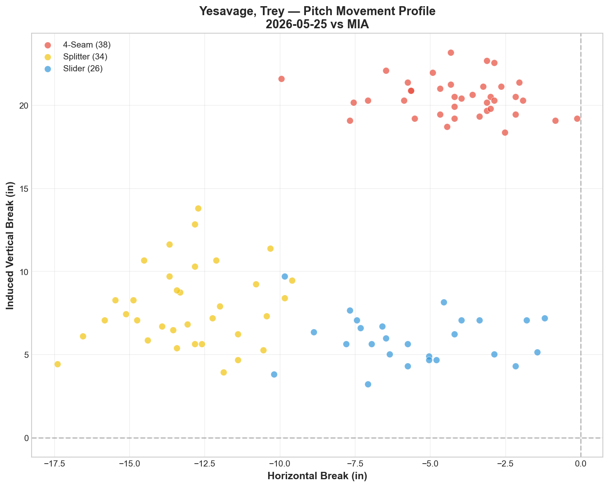
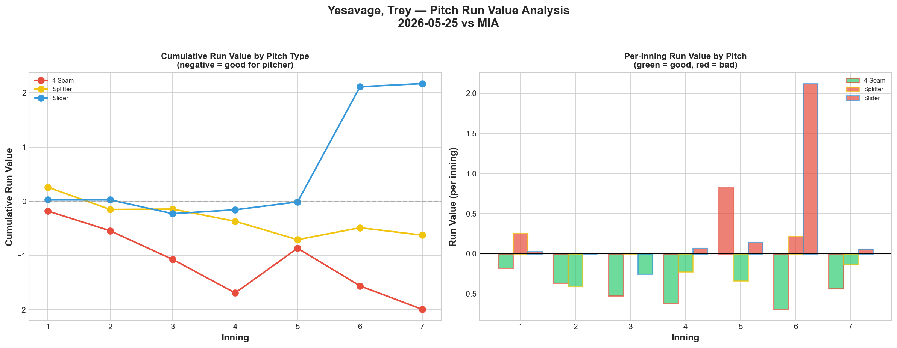
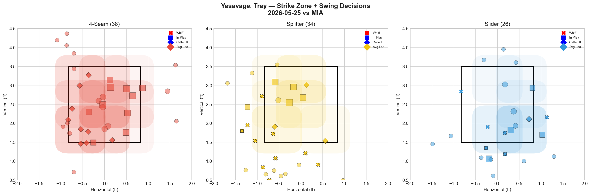
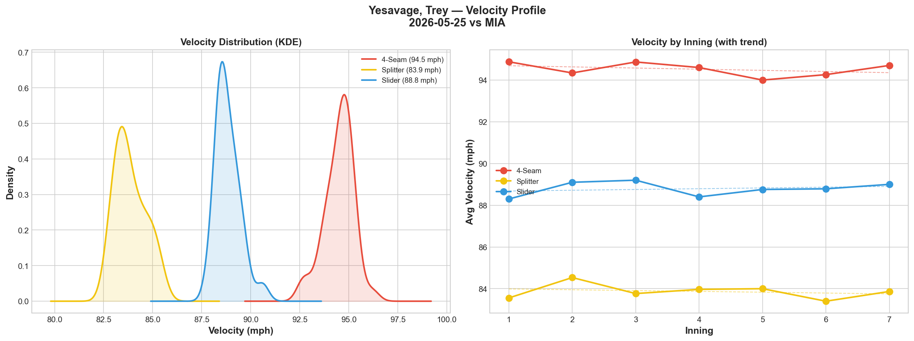
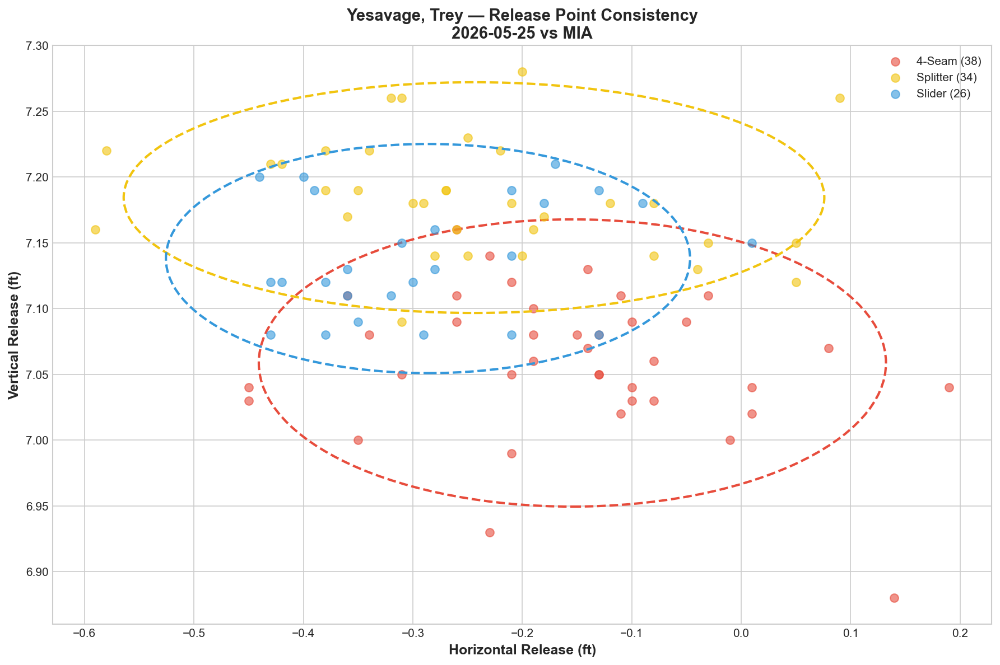
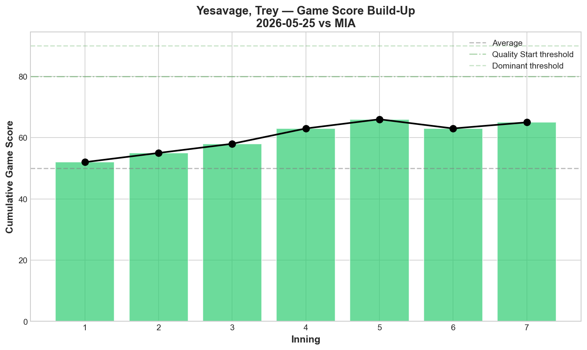
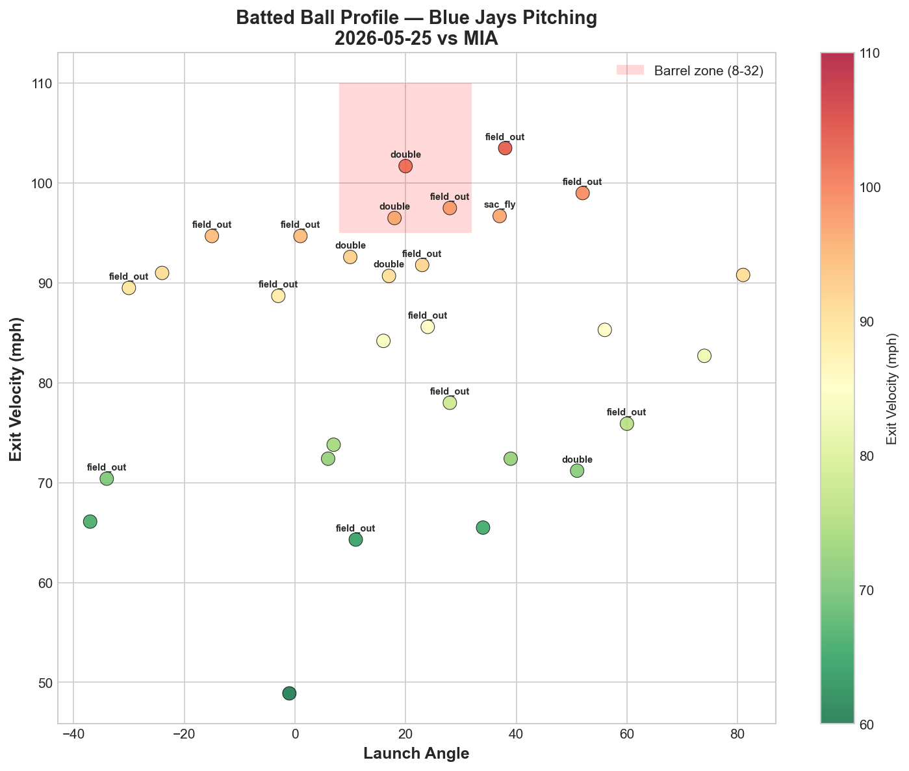
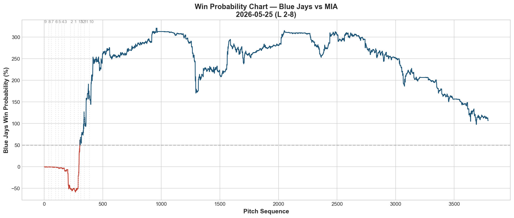
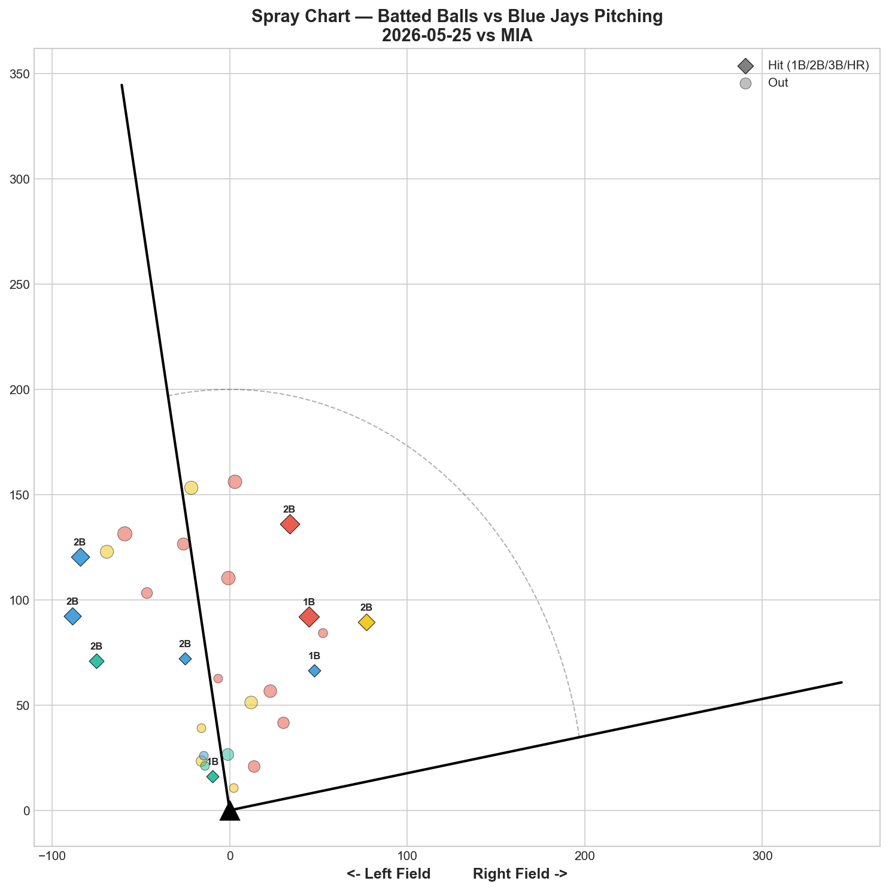

# 🏟️ Blue Jays Game Report v2.1
## 2026-05-25 | TOR vs MIA | L 2-8

---

## 📋 Game Overview

| | |
|---|---|
| **Date** | 2026-05-25 |
| **Matchup** | Miami Marlins @ Toronto Blue Jays |
| **Result** | **L 2-8** |
| **Starter** | Trey Yesavage (98 pitches) |
| **Spotlight Pitcher** | None |
| **Season Record** | 25W-28L |

---

## 🔥 Key Storylines

### 1. Yesavage's Slider Gave Back Everything His Fastball Built

Yesavage's 4-seam was his best pitch tonight: **-1.993 Run Value, Grade D on whiff (0.0%) but elite at generating weak contact and called strikes.** His splitter was also effective at -0.624 RV with a 64.7% whiff rate. But the slider — his putaway pitch from the 5/20 masterpiece — posted **+2.168 Run Value**, the worst single-pitch RV in our report history. The slider alone gave back more value than the fastball and splitter combined. One pitch turned a quality start into a loss.

### 2. The 5/20 vs 5/25 Yesavage Comparison Is Striking

| Metric | 5/20 vs NYY (W 2-1) | 5/25 vs MIA (L 2-8) |
|--------|---------------------|---------------------|
| Slider RV | -2.006 | +2.168 |
| Splitter RV | -0.915 | -0.624 |
| 4-Seam RV | -0.851 | -1.993 |
| Game Score | 74 | 64 |
| Result | W | L |

The fastball and splitter were actually *better* tonight than on 5/20. The difference is entirely the slider — a **4.174 RV swing** from dominant to catastrophic. This illustrates how a single pitch's inconsistency can completely flip the outcome of a start.

### 3. The Four-Game Winning Streak Is Over

After four consecutive wins (5/20-5/23), the Blue Jays have now dropped two straight (5/24, 5/25). The pitching staff that allowed just 7 runs in 4 games has given up 12 in the last 2. The regression is concerning but also explainable — Cease left injured, and Yesavage's slider deserted him tonight.

---

## ⚾ Starter Pitch Arsenal Analysis — Trey Yesavage

### Pitch Arsenal Performance (98 pitches)

| Pitch | # | Usage | Velo | Whiff% | CSW% | Chase% | Grade |
|-------|---|-------|------|--------|------|--------|-------|
| 4-Seam | 38 | 38.8% | 94.5 | 0.0% | 23.7% | 18.8% | 🔴 D |
| Splitter | 34 | 34.7% | 83.9 | 64.7% | 41.2% | 44.0% | 🟢 A |
| Slider | 26 | 26.5% | 88.8 | 40.0% | 26.9% | 44.4% | 🟢 A |

The grades are misleading tonight. The slider posted A-grade whiff numbers (40%) but still leaked massive run value (+2.168) — meaning the whiffs weren't coming in high-leverage moments, and the contact that did happen was devastating.

### Pitch Movement (inches)

| Pitch | H-Break | V-Break | Count |
|-------|---------|---------|-------|
| 4-Seam (FF) | -4.1 | 20.5 | 38 |
| Splitter (FS) | -13.0 | 7.9 | 34 |
| Slider (SL) | -5.6 | 6.0 | 26 |

### Pitch Tunneling Analysis

| Pair | Release Sim | Plate Sep | Tunnel | Velo Gap |
|------|-------------|-----------|--------|----------|
| **Splitter/Slider** | **0.8in** | **7.7in** | **🟢 10.3** | **5.0mph** |
| 4-Seam/Splitter | 1.9in | 15.4in | 🟢 8.3 | 10.7mph |
| 4-Seam/Slider | 1.8in | 14.6in | 🟢 7.9 | 5.7mph |

All three tunnels scored green, but the scores are lower than his 5/20 outing (best tunnel 11.1 vs 10.3 tonight). The tunneling geometry was slightly less effective, which may have contributed to the slider being more readable.

### Pitch Run Value by Type

| Pitch | Total RV | Per Pitch | Pitches | Assessment |
|-------|----------|-----------|---------|------------|
| 4-Seam | -1.993 | -0.0524 | 38 | ✅ Elite |
| Splitter | -0.624 | -0.0184 | 34 | ✅ Effective |
| Slider | +2.168 | +0.0834 | 26 | 🔴 Catastrophic |

- 🏆 **Most Effective:** 4-Seam (-0.0524 per pitch)
- ⚠️ **Least Effective:** Slider (+0.0834 per pitch — worst single-pitch RV in report history)

### Pitch Selection by Count

| Situation | Primary | Secondary | Notes |
|-----------|---------|-----------|-------|
| First Pitch (0-0) | 4-Seam 44.4% | Slider 33.3% | Fastball-first approach |
| Ahead (0-1, 0-2, 1-2) | Splitter 46.7% | Slider 30.0% | Splitter as weapon ahead |
| Behind (1-0, 2-0, etc.) | 4-Seam 60.9% | Splitter 21.7% | Fastball-heavy behind |
| Even (1-1, 2-2) | Splitter 50.0% | FF/SL 25% each | Trusts splitter in neutral |
| Full Count (3-2) | FF/FS 50% each | — | Small sample |

**Strikeout Pitches (6 K's):** FS 4, SL 2 — splitter was the dominant putaway pitch, not the slider.

### vs LHB/RHB Split

| Stand | Pitches | Avg Velo | Swinging Strikes | Whiff/Pitch |
|-------|---------|----------|------------------|-------------|
| L | 62 | 88.8 | 12 | 19.4% |
| R | 36 | 90.3 | 5 | 13.9% |

More effective against LHH tonight (19.4% vs 13.9%) — opposite of his 5/20 split (9.2% vs 16.7%). The splitter's arm-side fade worked well against lefties tonight.

### Top Opposing Batters vs Yesavage

| Batter | Pitches | Hits | K | BB | Avg EV |
|--------|---------|------|---|-----|--------|
| Esteury Ruiz | 15 | 0 | 1 | 0 | 81.7 |
| Javier Sanoja | 14 | 2 | 0 | 0 | 89.9 |
| (ID 691788) | 12 | 0 | 1 | 0 | 78.4 |
| Jakob Marsee | 12 | 0 | 1 | 1 | 97.5 |
| Owen Caissie | 11 | 1 | 1 | 0 | 100.4 |

**Caissie** was the most dangerous — only 1 hit in 11 pitches but 100.4 mph average exit velocity. When he made contact, it was violent. **Marsee** also hit hard at 97.5 mph EV despite going hitless. **Sanoja** collected 2 hits with 89.9 mph EV — finding holes rather than barreling.

### Velocity Profile

- **4-Seam:** 94.9 → 94.7 mph (-0.2 mph)
- **Splitter:** 83.6 → 83.9 mph (+0.3 mph)
- **Slider:** 88.3 → 89.0 mph (+0.7 mph)

Velocity held or gained across all three pitches — no fatigue indicators. The slider's problem wasn't velocity; it was location or shape.

### Release Point Consistency

| Pitch | H-Spread | V-Spread | Total | Rating |
|-------|----------|----------|-------|--------|
| 4-Seam | 1.7in | 0.7in | 1.8in | 🟢 Tight |
| Splitter | 1.9in | 0.5in | 2.0in | 🟢 Tight |
| Slider | 1.4in | 0.5in | 1.5in | 🟢 Tight |

Release points were tight — the slider's run value issue wasn't a mechanical consistency problem.

### Game Score

**Final: 64 (QUALITY).** Despite the loss, Yesavage still recorded a quality game score. 6K, 0HR, 2BB on 98 pitches. The run value damage on the slider inflated the score line beyond what the game score suggests.

### Batted Ball Profile

| Metric | Value |
|--------|-------|
| Total BIP | 30 |
| Avg Exit Velo | 83.9 mph |
| Avg Launch Angle | 19.6° |
| Hard Hit (95+ mph) | 6/30 (20%) |

20% hard-hit rate is manageable — the damage wasn't from barrel rate but from sequencing and timing on the slider.

---

## 📊 Bullpen Detailed Analysis

| Pitcher | Pitches | Line | Key Pitch | Notes |
|---------|---------|------|-----------|-------|
| **Tanner Andrews** | 15 | 0K / 0BB / 0H / 0HR | FF 33.3% whiff 🟢A | Clean outing, but FS/SL both 🔴D |
| **Adam Macko** | 10 | 1K / 0BB / 2H / 0HR | FF 33.3% whiff 🟢A, CSW 60% | Fastball continues to develop; slider still 🔴D |
| **Tyler Rogers** | 17 | 0K / 1BB / 2H / 0HR | SI 16.7% whiff 🟡C | Sinker-heavy (88%) — gave up contact |
| **Mason Fluharty** | 6 | 1K / 0BB / 0H / 0HR | All 🔴D whiff | K without whiffs — called strikes |

### Bullpen Notes

- **Andrews** was the steadiest reliever — 15 pitches, nothing allowed. His fastball at 94.7 generated swing-and-miss, but secondary pitches need work.
- **Macko (4th appearance)** continues the fastball development trend: 33.3% whiff, 60% CSW on his 4-seam. That's Grade A. The slider remains the weak spot (0% whiff across most appearances). Development trajectory: 0% → 50%(KC) → 50%(SL) → 33%(FF). He's finding different pitches each outing.
- **Rogers** gave up 2 hits and a walk in 17 pitches — the sinker-only approach (88% usage) was exposed.

---

## 📈 Win Probability Analysis

### Key WPA Moments

| Inning | Event | Impact |
|--------|-------|--------|
| 9 | Erceg — single | 📉 Major damage (WP 200.5%) |
| 9 | Erceg — double | 📉 Extended damage (WP 180.3%) |
| 10 | Garcia — field_out | 📈 Jays defense |
| 11 | Seymour — single | 📈 Positive (TOR) |
| 11 | Wells — home_run | 📉 Crushing blow (WP 156.6%) |
| 13 | Scholtens — home_run | 📉 Final dagger |

Extra-inning game that got away from the bullpen late. The 9th and 11th innings were the breaking points.

---

## 📊 Spray Chart & Batted Ball Summary

| Metric | Value |
|--------|-------|
| Total batted balls tracked | 28 |
| Hits | 9 (32%) |
| Pull | 4 (14%) |
| Center | 18 (64%) |
| Oppo | 6 (21%) |

More opposite-field contact than usual (21% vs typical 15-18%) — Marlins hitters were staying on off-speed pitches and driving them the other way, particularly on the slider.

---

## 🎯 Analytical Takeaways

1. **Yesavage's Slider Variance Is the Story** — Same pitcher, same arsenal, wildly different slider outcomes. 5/20: -2.006 RV (elite). 5/25: +2.168 RV (catastrophic). A 4.174 RV swing on one pitch across two starts. The fastball and splitter have been consistent; the slider is the variable that determines whether Yesavage is an ace or a liability. Pitch design work on slider consistency should be the top development priority.

2. **The 4-Seam Is Yesavage's Most Reliable Pitch** — Across both starts, the fastball has posted negative run value (-0.851 on 5/20, -1.993 tonight). It's not a whiff pitch (0.0% tonight) but it generates weak contact and called strikes consistently. The splitter is the swing-and-miss weapon (64.7% whiff tonight). The slider is the boom-or-bust pitch.

3. **Macko's Fastball Development Continues** — 4th appearance: 33.3% whiff, 60% CSW on his 4-seam. He's now shown A-grade stuff on different pitches across four outings. The complete package isn't there yet, but individual tools are flashing consistently.

4. **Extra-Inning Bullpen Collapse** — The 9th inning (Erceg single + double) and 11th inning (Wells HR) were the decisive moments. The bullpen couldn't hold in a game that went deep into extras.

5. **Game Classification: Slider Loss** — Yesavage's game score (64) was quality. His fastball and splitter were dominant. One pitch — the slider at +2.168 RV — is the entire difference between a win and a loss. This is the narrowest margin of failure we've documented.

---

*Report generated from Statcast data via pybaseball. All pitch metrics sourced from Baseball Savant.*
