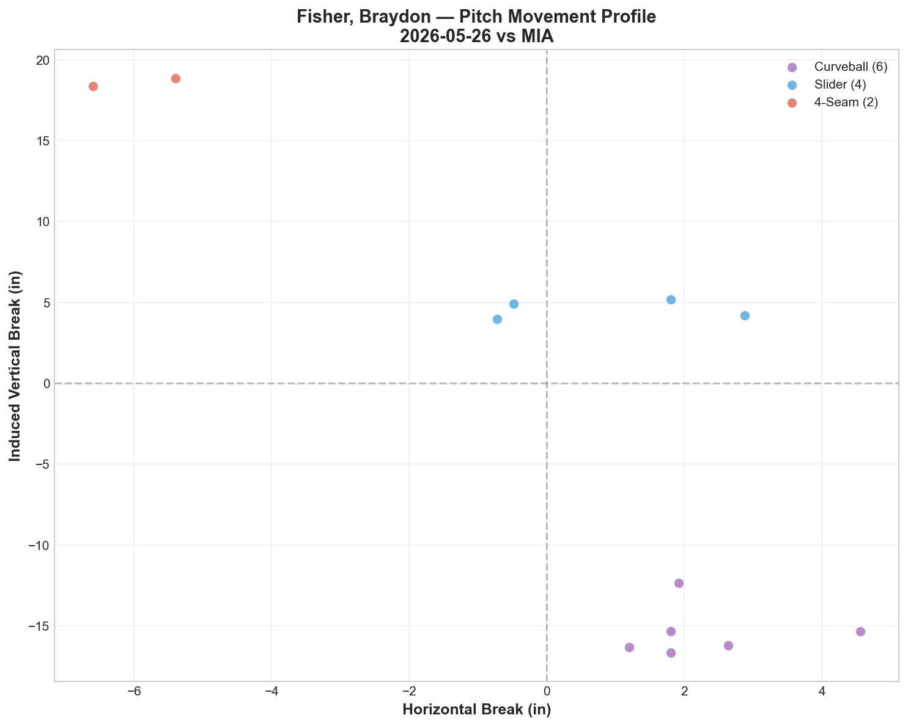
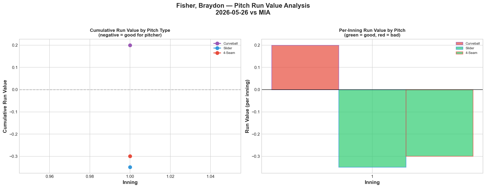
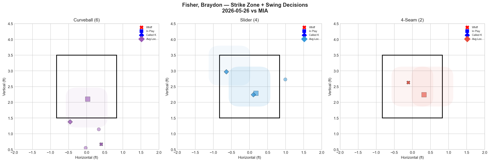
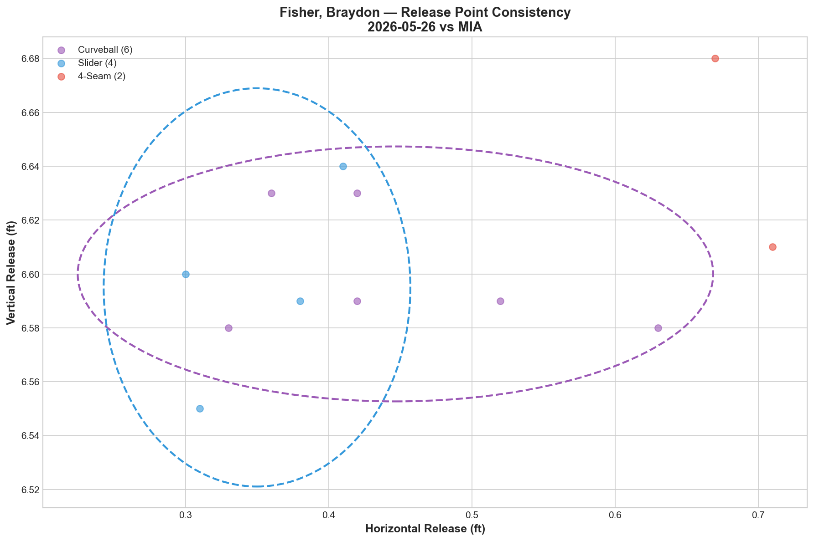
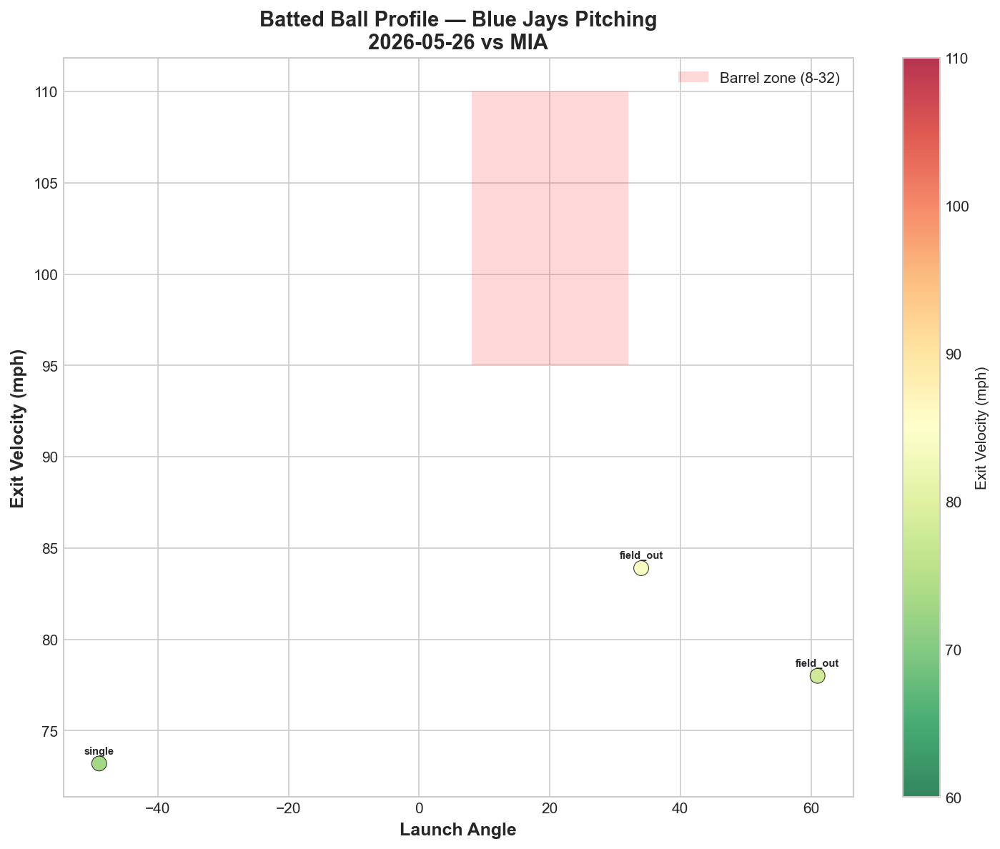
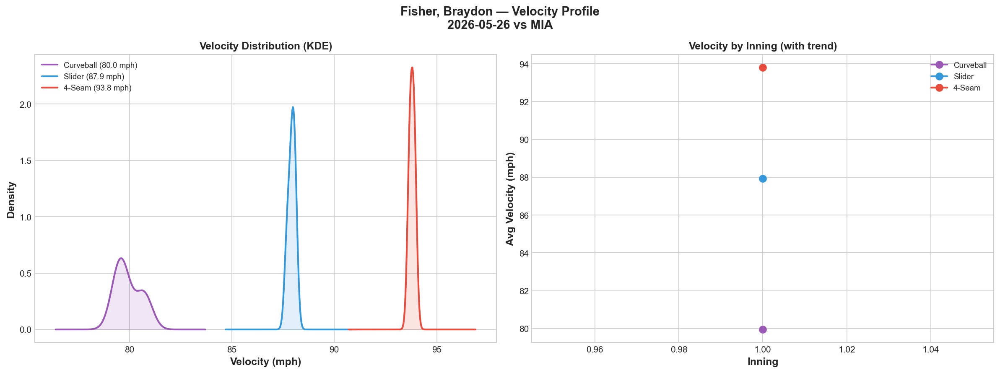
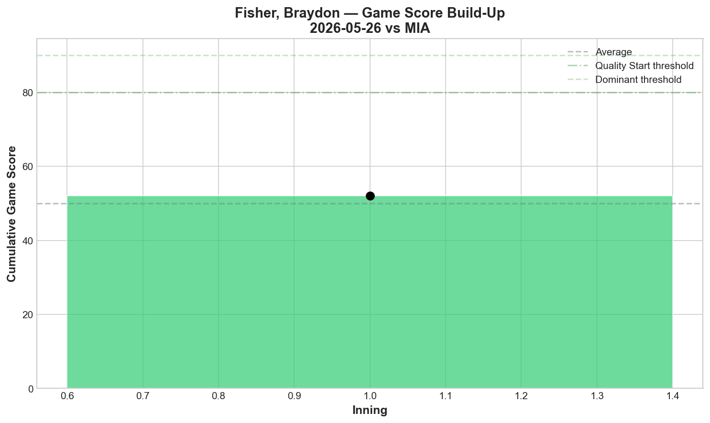
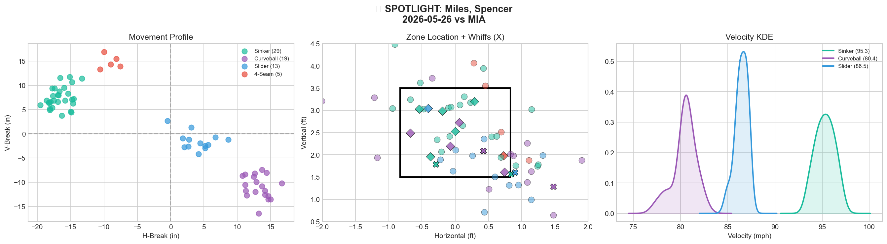
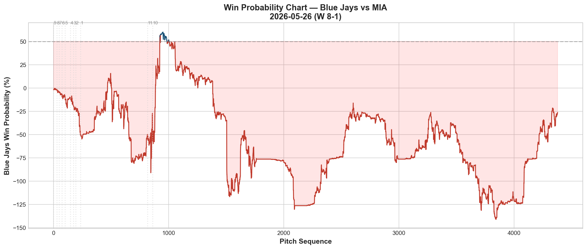
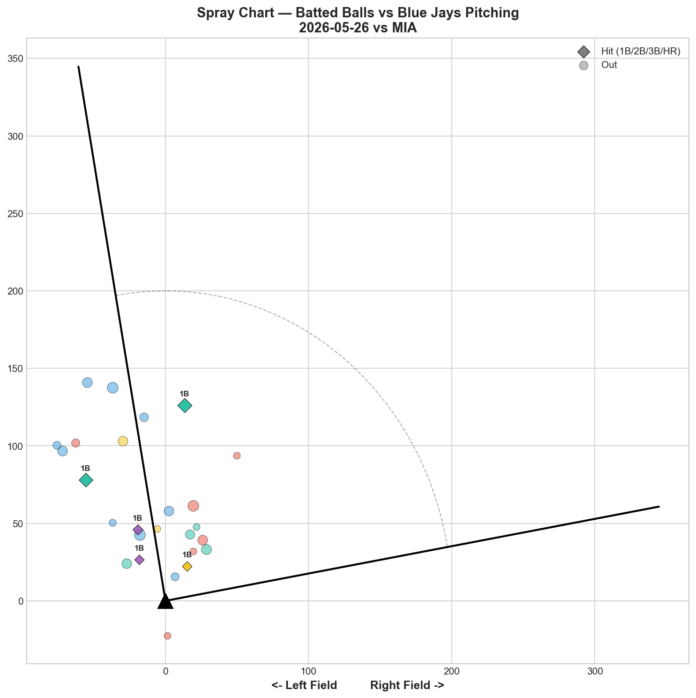

# 🏟️ Blue Jays Game Report v2.1
## 2026-05-26 | TOR vs MIA | W 8-1

---

## 📋 Game Overview

| | |
|---|---|
| **Date** | 2026-05-26 |
| **Matchup** | Miami Marlins @ Toronto Blue Jays |
| **Result** | **W 8-1** |
| **Opener** | Braydon Fisher (12 pitches, 1 IP) |
| **Bulk Pitcher** | Spencer Miles (67 pitches, 4.1 IP) |
| **Spotlight Pitcher** | Spencer Miles |
| **Season Record** | 26W-28L |

**Bullpen Day Structure:** Fisher opened (12 pitches, 1K), Miles handled the bulk (67 pitches, 3K), then Andrews (28), Rodríguez (11), and Macko (9) closed it out. Five pitchers combined for a **1-run game behind 8 runs of offensive support.**

---

## 🔥 Key Storylines

### 1. The Fisher → Miles Bullpen Day Formula Is Now Proven

This is the second time the Jays have deployed this exact structure, and the results speak for themselves: **5/21 vs NYY: W 2-0 (shutout). 5/26 vs MIA: W 8-1.** Two wins, 1 combined run allowed. Fisher sets the tone with his curveball-heavy opener role, Miles absorbs the bulk innings. This isn't an emergency plan anymore — it's a viable rotation strategy.

### 2. Miles Continues Building His Case for an Expanded Role

Second consecutive strong bulk outing: **67 pitches, 3K, 1BB, 3H, 0HR.** His curveball remains the weapon — 33.3% whiff rate, Grade A. Across two bulk appearances (5/21: 63 pitches, 6K, 0ER vs NYY; 5/26: 67 pitches, 3K, 1ER vs MIA), Miles has now thrown **130 combined pitches with 9K, 2BB, 5H, 0HR.** That's a starter's workload with a reliever's results.

### 3. The Offense Erupted — 8 Runs of Support

After scoring just 3 runs in the previous two losses (1 vs PIT, 2 vs MIA), the Blue Jays exploded for 8 runs tonight. This gave the pitching staff breathing room for the first time in days. With Cease injured, the offense needs to carry more weight — tonight they did exactly that.

---

## ⚾ Opener Pitch Arsenal Analysis — Braydon Fisher

### Pitch Arsenal Performance (12 pitches, 1 IP)

| Pitch | # | Usage | Velo | Whiff% | CSW% | Chase% | Grade |
|-------|---|-------|------|--------|------|--------|-------|
| Curveball | 6 | 50.0% | 80.0 | 66.7% | 50.0% | 40.0% | 🟢 A |
| Slider | 4 | 33.3% | 87.9 | 0.0% | 50.0% | 0.0% | 🔴 D |
| 4-Seam | 2 | 16.7% | 93.8 | 50.0% | 50.0% | 0.0% | 🟢 A |

### Pitch Movement (inches)

| Pitch | H-Break | V-Break | Count |
|-------|---------|---------|-------|
| Curveball (CU) | 2.3 | -15.4 | 6 |
| Slider (SL) | 0.9 | 4.6 | 4 |
| 4-Seam (FF) | -6.0 | 18.6 | 2 |

### Pitch Tunneling

| Pair | Release Sim | Plate Sep | Tunnel | Velo Gap |
|------|-------------|-----------|--------|----------|
| **Curveball/Slider** | **1.2in** | **20.0in** | **🟢 17.2** | **8.0mph** |

**🏆 Best Tunnel: Curveball/Slider (score: 17.2)** — Consistent with Fisher's 5/21 outing where this same pair scored 31.9. The CU/SL combination from the same release window continues to be his identity tunnel.

### Pitch Run Value by Type

| Pitch | Total RV | Per Pitch | Pitches | Assessment |
|-------|----------|-----------|---------|------------|
| 4-Seam | -0.299 | -0.1495 | 2 | ✅ Effective |
| Slider | -0.349 | -0.0872 | 4 | ✅ Effective |
| Curveball | +0.200 | +0.0333 | 6 | ⚠️ Leaked value |

The curveball generated elite whiffs (66.7%) but still posted positive run value — similar to Cease's K-Curve on 5/24 where whiff rate and run value diverged. The whiffs weren't occurring in run-prevention situations.

### Pitch Selection by Count

| Situation | Primary | Secondary | Notes |
|-----------|---------|-----------|-------|
| First Pitch (0-0) | CU/SL 50% each | — | Breaking ball first-pitch approach |
| Ahead | Curveball 100% | — | Pure curveball ahead in count |
| Behind | Slider 66.7% | 4-Seam 33.3% | Slider to get back |
| Even | FF/CU 50% each | — | Balanced |

**Strikeout Pitch: Curveball (1K).** Fisher's curveball is his putaway pitch — 100% usage ahead in the count, and the only K came on it.

### vs LHB/RHB Split

| Stand | Pitches | Avg Velo | Swinging Strikes | Whiff/Pitch |
|-------|---------|----------|------------------|-------------|
| L | 10 | 86.0 | 3 | 30.0% |
| R | 2 | 79.6 | 0 | 0.0% |

Only 2 pitches to RHH — the sample is entirely LHH-dominant. Fisher's opener role is naturally suited to facing the top of the order (typically LHH-heavy).

### Game Score

**Final: 52 (QUALITY).** 1K, 1H, 0HR, 0BB in 12 pitches. Efficient opener — set the tone and handed off clean.

### Release Point Consistency

| Pitch | H-Spread | V-Spread | Total | Rating |
|-------|----------|----------|-------|--------|
| Curveball | 1.3in | 0.3in | 1.4in | 🟢 Tight |
| Slider | 0.6in | 0.4in | 0.8in | 🟢 Tight |

### Batted Ball Profile

| Metric | Value |
|--------|-------|
| Total BIP | 3 |
| Avg Exit Velo | 78.4 mph |
| Avg Launch Angle | 15.3° |
| Hard Hit (95+ mph) | 0/3 (0%) |

Zero hard-hit balls in 12 pitches — Fisher induced exclusively weak contact.

---

## 🔍 Spotlight Pitcher — Spencer Miles (Bulk Role)

| | |
|---|---|
| **Role** | Bulk pitcher (entered after Fisher) |
| **Pitch Count** | 67 (game-high) |
| **Line** | 3K / 1BB / 3H / 0HR |
| **Overall Whiff%** | 15.2% |
| **Role Assessment** | ✅ SOLID RELIEVER |

### Pitch Arsenal

| Pitch | # | Usage | Velo | Whiff% | CSW% | Grade |
|-------|---|-------|------|--------|------|-------|
| Sinker | 29 | 43.3% | 95.3 | 11.8% | 24.1% | 🟡 C |
| Curveball | 19 | 28.4% | 80.4 | 33.3% | 31.6% | 🟢 A |
| Slider | 13 | 19.4% | 86.5 | 12.5% | 15.4% | 🟡 C |
| 4-Seam | 5 | 7.5% | 95.0 | 0.0% | 20.0% | 🔴 D |

### Two-Start Bulk Comparison

| Metric | 5/21 vs NYY | 5/26 vs MIA |
|--------|-------------|-------------|
| Pitches | 63 | 67 |
| K | 6 | 3 |
| BB | 1 | 1 |
| H | 2 | 3 |
| HR | 0 | 0 |
| CU Whiff% | 45.5% | 33.3% |
| SI Usage | 31.7% | 43.3% |
| Overall Whiff% | 22.9% | 15.2% |

Miles leaned more heavily on his sinker tonight (43.3% vs 31.7% on 5/21), which brought his overall whiff rate down (15.2% vs 22.9%). The curveball remained Grade A (33.3% whiff) but was less dominant than the 45.5% against the Yankees. The slider dropped from Grade B (20% whiff) to Grade C (12.5%).

### Assessment

Miles' second bulk outing confirms a clear pattern: **the curveball is his A-tier pitch, and everything else is a supporting cast.** The sinker at 95.3 mph provides the speed component, but 11.8% whiff rate makes it a contact pitch, not a swing-and-miss weapon. The 4-seam (0.0% whiff in both starts) should be eliminated from his mix — every fastball should be a sinker.

For the Blue Jays' rotation needs, Miles has now demonstrated he can handle 65+ pitch bulk outings on a consistent basis. The next step would be stretching him to 80+ pitches in a true starter role. His curveball/sinker combination — 80.4 mph curve paired with a 95.3 mph sinker — creates a 14.9 mph speed differential that's proven effective against both contender (NYY) and rebuilding (MIA) lineups.

---

## 📊 Bullpen Detailed Analysis

| Pitcher | Pitches | Line | Key Pitch | Notes |
|---------|---------|------|-----------|-------|
| **Braydon Fisher** | 12 | 1K / 0BB / 1H / 0HR | CU 66.7% whiff 🟢A | Opener — curveball dominant |
| **Spencer Miles** | 67 | 3K / 1BB / 3H / 0HR | CU 33.3% whiff 🟢A | Bulk — see spotlight above |
| **Tanner Andrews** | 28 | 1K / 2BB / 1H / 0HR | FS 50% whiff 🟢A | Splitter was elite; FF 0% whiff 🔴D |
| **Yariel Rodríguez** | 11 | 0K / 0BB / 0H / 0HR | SI 100% whiff 🟢A | Clean outing — sinker breakthrough |
| **Adam Macko** | 9 | 0K / 0BB / 0H / 0HR | SL 66.7% CSW | 0 whiffs but all called strikes. 0H 0BB. |

### Bullpen Notes

- **Andrews** had a mixed bag — splitter was elite (50% whiff) but he walked 2 and his 4-seam generated 0% whiffs. The splitter development is encouraging; command needs work.
- **Rodríguez** posted his cleanest outing yet: **11 pitches, 0K, 0BB, 0H.** His sinker generated 100% whiff rate (small sample, 2 pitches) — first time his velocity pitches have shown swing-and-miss. Development trajectory continues upward.
- **Macko (5th appearance)** threw 9 pitches with 0H, 0BB, but also 0 whiffs. His slider generated 66.7% CSW through called strikes rather than swings — a different path to outs but not sustainable long-term.

---

## 📈 Win Probability Analysis

### Key WPA Moments

| Inning | Event | Impact |
|--------|-------|--------|
| 1 | Freeland — home_run | 📈 Early Jays lead |
| 5 | Kochanowicz — triple | 📈 Extended lead |
| 8 | Ryan — home_run | 📈 Insurance |
| 8 | Vest — home_run | 📉 Marlins response |
| 10 | Rogers — GIDP | 📉 Negative |
| 11 | Davis — double | 📉 Late threat |

---

## 📊 Spray Chart & Batted Ball Summary

| Metric | Value |
|--------|-------|
| Total batted balls tracked | 26 |
| Hits | 5 (19%) |
| Pull | 1 (4%) |
| Center | 20 (77%) |
| Oppo | 5 (19%) |

**77% center-field contact with only 4% pull.** The pitching staff's collective approach prevented the Marlins from pulling the ball with any authority — consistent with the center-field-dominant pattern we've seen throughout the recent stretch.

---

## 🎯 Analytical Takeaways

1. **The Fisher → Miles Formula Works** — Two deployments, two wins (2-0 shutout vs NYY, 8-1 vs MIA). Fisher's curveball-first opener sets the tone, Miles absorbs 65+ pitch bulk innings. This is now an established rotation strategy, not a one-off experiment.

2. **Miles' Two-Start Profile Is Clear** — Curveball is the weapon (45.5% then 33.3% whiff). Sinker is the workhorse (95+ mph, contact-oriented). 4-Seam should be eliminated (0.0% whiff in both starts). The next development step is stretching to 80+ pitches.

3. **Rodríguez's Trajectory Keeps Improving** — Debut (0% whiff) → 2nd (0%) → 3rd (0%) → 4th (A/A grades) → 5th (clean 0H 0BB, sinker whiffs). Each appearance has shown incremental progress. He's earning trust.

4. **Fisher's Opener Identity Is Curveball-First** — Across two opener starts: curveball usage 50%+, tunnel scores of 31.9 and 17.2 on CU/SL pair. He leads with breaking balls and uses the fastball sparingly. This is a distinctive and effective approach.

5. **Game Classification: Complete Team Win** — 8 runs of offense, 5 pitchers combining for 1 run allowed, 127 total pitches. The bullpen day structure worked, the offense delivered, and the defense held. Exactly what a rebuilding team needs.

---

*Report generated from Statcast data via pybaseball. All pitch metrics sourced from Baseball Savant.*
