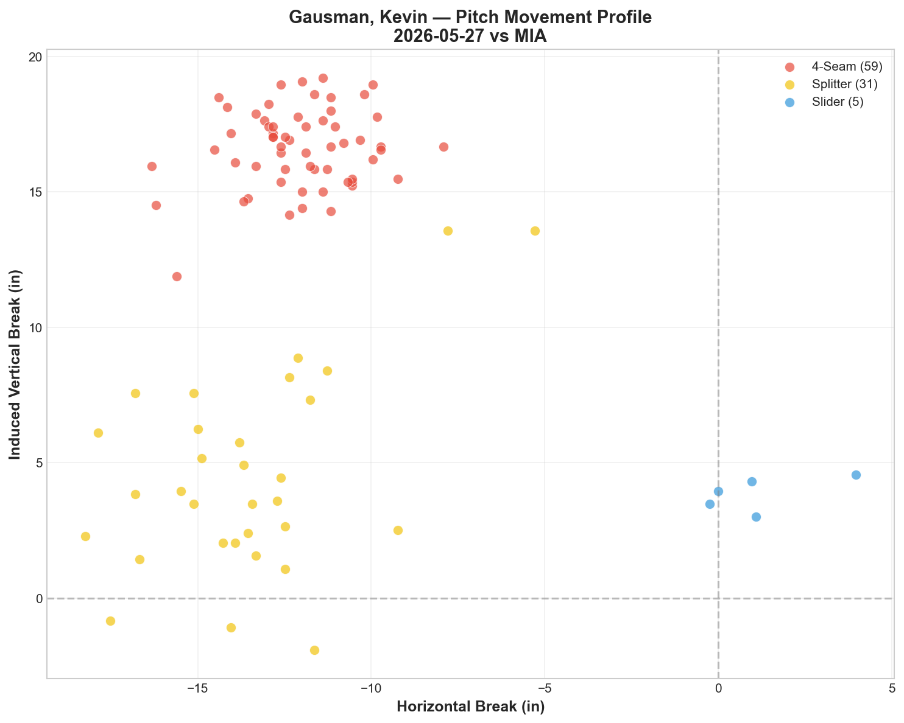
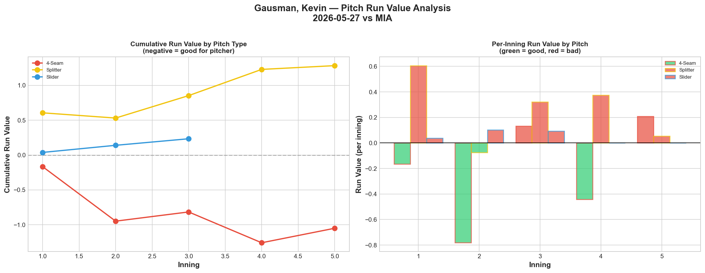
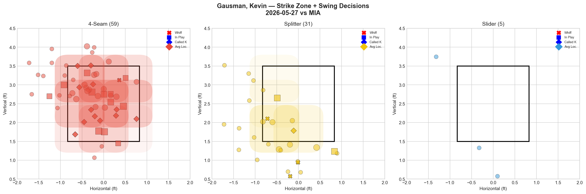
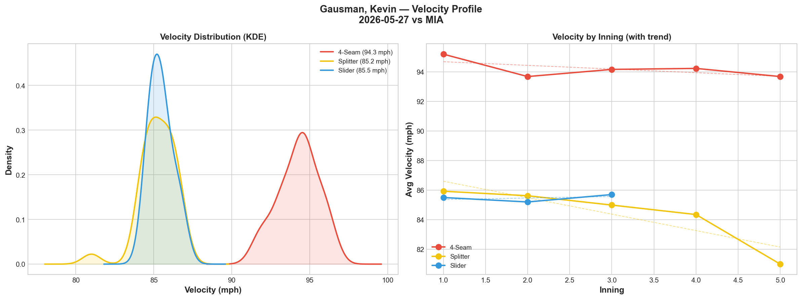
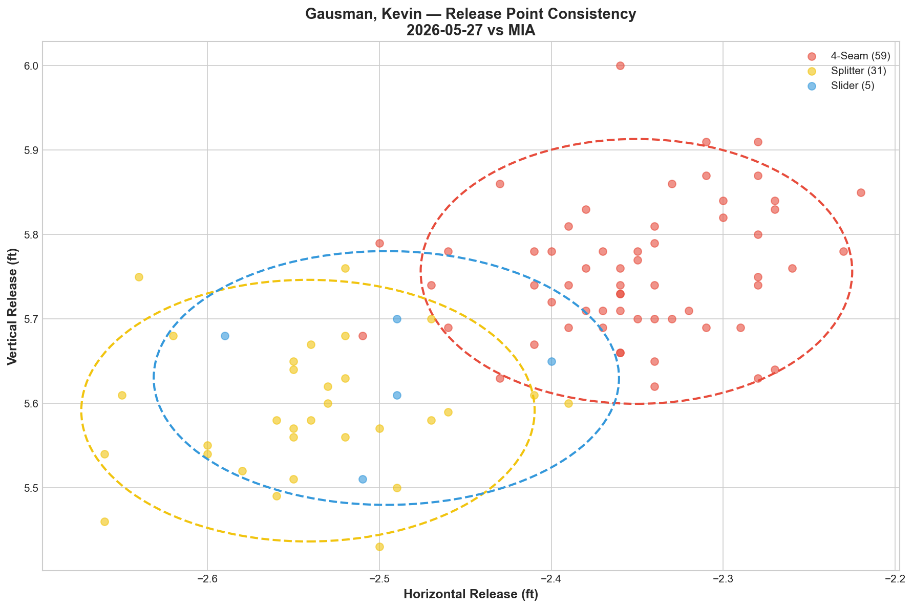
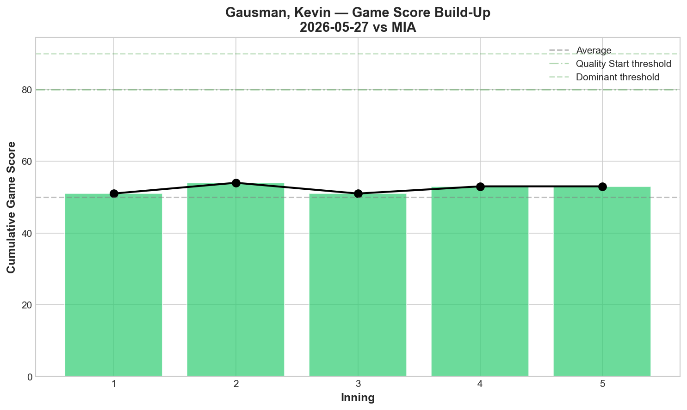
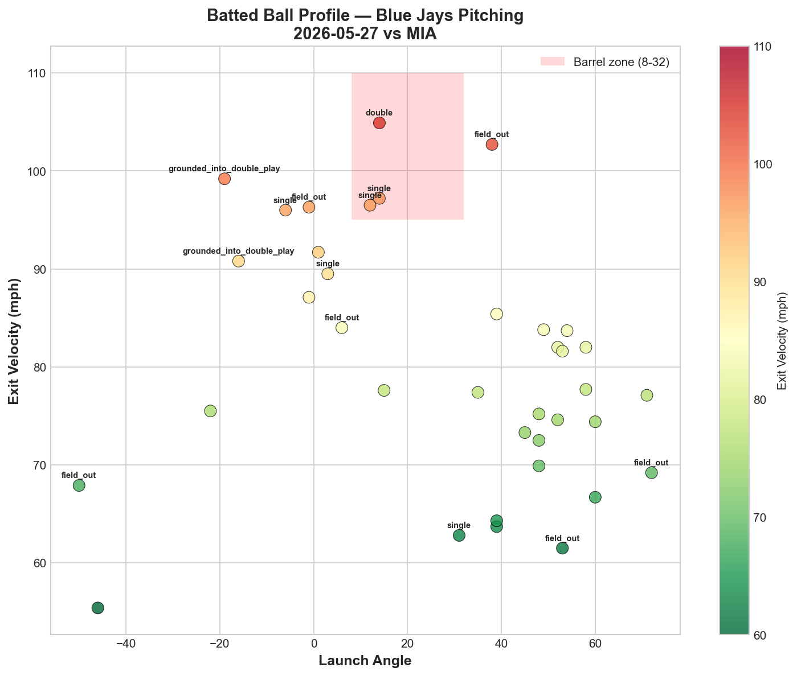
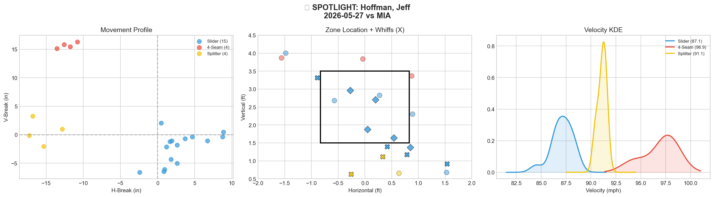
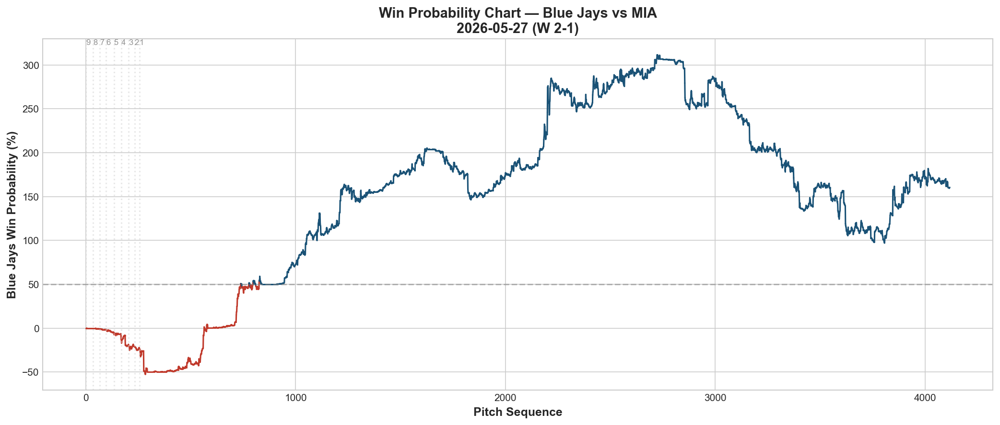
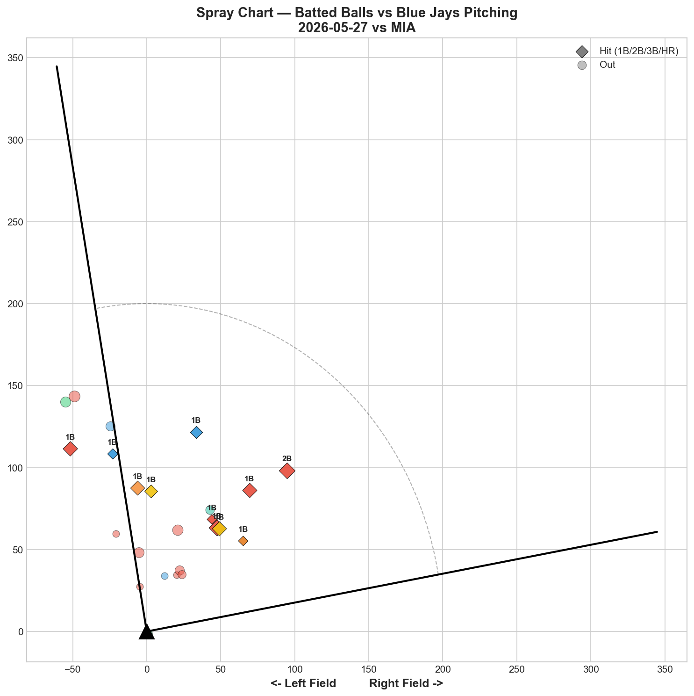

# 🏟️ Blue Jays Game Report v2.1
## 2026-05-27 | TOR vs MIA | W 2-1

---

## 📋 Game Overview

| | |
|---|---|
| **Date** | 2026-05-27 |
| **Matchup** | Miami Marlins @ Toronto Blue Jays |
| **Result** | **W 2-1** |
| **Starter** | Kevin Gausman (95 pitches) |
| **Spotlight Pitcher** | Jeff Hoffman |
| **Season Record** | 27W-28L |

---

## 🔥 Key Storylines

### 1. Gausman Gutted Through 95 Pitches on a Night His Splitter Wasn't There

Gausman's splitter — typically his best pitch — posted **+1.283 Run Value (catastrophic)** despite a 27.3% whiff rate. Meanwhile his 4-seam carried the entire outing: **-1.05 RV across 59 pitches (62.1% usage).** This was a fastball-dominant Gausman start where he recognized his splitter wasn't landing and adjusted by leaning on his heater. The result: 5K, 0HR, and a win despite the splitter issues. That's veteran adaptability.

### 2. Hoffman's 66.7% Whiff Rate Is the Bullpen's Best Single-Outing Performance

Jeff Hoffman threw 23 pitches and generated a **66.7% overall whiff rate — the highest single-appearance whiff rate in our report history.** His slider (66.7% whiff, 60.0% CSW) and splitter (100% whiff) were both Grade A. This is now **four consecutive dominant appearances** for Hoffman, cementing his status as the undisputed bullpen ace.

### 3. One Game From .500

At 27-28, the Blue Jays are one win away from .500 for the first time since early April. They've won 3 of 4 against the Marlins and are building momentum heading into June — all while missing Cease, Bieber, Scherzer, and Kirk from the projected roster.

---

## ⚾ Starter Pitch Arsenal Analysis — Kevin Gausman

### Pitch Arsenal Performance (95 pitches)

| Pitch | # | Usage | Velo | Whiff% | CSW% | Chase% | Grade |
|-------|---|-------|------|--------|------|--------|-------|
| 4-Seam | 59 | 62.1% | 94.3 | 3.1% | 22.0% | 22.7% | 🔴 D |
| Splitter | 31 | 32.6% | 85.2 | 27.3% | 12.9% | 25.0% | 🟢 B |
| Slider | 5 | 5.3% | 85.5 | 0.0% | 0.0% | 0.0% | 🔴 D |

### A Tale of Two Gausman Starts

| Metric | 5/22 vs PIT | 5/27 vs MIA |
|--------|-------------|-------------|
| FF Usage | 42.6% | **62.1%** |
| FF RV | -0.824 | **-1.050** |
| FS Whiff% | 38.1% | 27.3% |
| FS RV | -0.161 | **+1.283** |
| SL Whiff% | 75.0% | 0.0% |
| SL Usage | 19.1% | 5.3% |
| Game Score | 68 | 53 |
| Result | W 6-2 | W 2-1 |

On 5/22, Gausman had all three pitches working — splitter/slider tunnel at 17.0. Tonight, the splitter leaked run value and the slider was shelved (5 pitches). He compensated by **increasing fastball usage from 42.6% to 62.1%** and still got the win. This is what separates a veteran ace from a young arm — the ability to win with Plan B.

### Pitch Movement (inches)

| Pitch | H-Break | V-Break | Count |
|-------|---------|---------|-------|
| 4-Seam (FF) | -12.1 | 16.6 | 59 |
| Splitter (FS) | -13.6 | 4.5 | 31 |
| Slider (SL) | 1.2 | 3.9 | 5 |

### Pitch Tunneling Analysis

| Pair | Release Sim | Plate Sep | Tunnel | Velo Gap |
|------|-------------|-----------|--------|----------|
| **Splitter/Slider** | **0.7in** | **14.8in** | **🟢 20.6** | **0.2mph** |
| 4-Seam/Slider | 2.3in | 18.4in | 🟢 7.9 | 8.8mph |
| 4-Seam/Splitter | 3.0in | 12.2in | 🟢 4.0 | 9.0mph |

**🏆 Best Tunnel: Splitter/Slider (score: 20.6)** — Even on a night the splitter wasn't effective from a run value perspective, the tunneling geometry between it and the slider remained elite (0.7in release similarity, 0.2 mph velocity gap). The deception was there; the execution wasn't.

### Pitch Run Value by Type

| Pitch | Total RV | Per Pitch | Pitches | Assessment |
|-------|----------|-----------|---------|------------|
| 4-Seam | -1.050 | -0.0178 | 59 | ✅ Carried the outing |
| Splitter | +1.283 | +0.0414 | 31 | 🔴 Uncharacteristically bad |
| Slider | +0.234 | +0.0468 | 5 | ⚠️ Shelved early |

- 🏆 **Most Effective:** 4-Seam
- ⚠️ **Least Effective:** Splitter

### Pitch Selection by Count

| Situation | Primary | Secondary | Notes |
|-----------|---------|-----------|-------|
| First Pitch (0-0) | 4-Seam 50.0% | Splitter 36.4% | Fastball-first |
| Ahead (0-1, 0-2, 1-2) | Splitter 52.0% | 4-Seam 48.0% | Still trusted splitter ahead |
| Behind (1-0, 2-0, etc.) | **4-Seam 81.5%** | Splitter 18.5% | Heavily fastball behind |
| Even (1-1, 2-2) | 4-Seam 61.1% | Splitter 27.8% | Fastball dominant |
| Full Count (3-2) | **4-Seam 100%** | — | All fastballs |

**Strikeout Pitches (5 K's):** FF 3, FS 2 — fastball was the primary K pitch tonight.

The count data reveals Gausman's in-game adjustment: when behind, he threw **81.5% fastballs** (vs 52.4% on 5/22). On full counts, 100% fastballs. He recognized the splitter wasn't landing and stopped forcing it in hitter's counts.

### vs LHB/RHB Split

| Stand | Pitches | Avg Velo | Swinging Strikes | Whiff/Pitch |
|-------|---------|----------|------------------|-------------|
| L | 62 | 90.4 | 2 | 3.2% |
| R | 33 | 91.7 | 2 | 6.1% |

Low whiff rates across the board (3.2% LHH, 6.1% RHH) — this was a contact management night, not a swing-and-miss night. Gausman got outs through weak contact and defense.

### Top Opposing Batters vs Gausman

| Batter | Pitches | Hits | K | BB | Avg EV |
|--------|---------|------|---|-----|--------|
| Xavier Edwards | 17 | 2 | 0 | 1 | 81.4 |
| Otto Lopez | 15 | 3 | 0 | 0 | 80.9 |
| Kyle Stowers | 12 | 0 | 1 | 0 | 81.4 |
| Christopher Morel | 11 | 0 | 2 | 0 | 75.1 |
| Graham Pauley | 11 | 0 | 0 | 0 | 78.4 |

**Lopez** was the toughest at-bat — 3 hits in 15 pitches. **Edwards** battled with 2 hits and a walk in 17 pitches. But **Morel** (0-for, 2K) and **Stowers** (0-for, 1K) were neutralized. Gausman won the key matchups even on an off night.

### Velocity Profile

- **4-Seam:** 95.2 → 93.7 mph (-1.5 mph)
- **Splitter:** 85.9 → 81.0 mph (-4.9 mph)
- **Slider:** 85.5 → 85.7 mph (+0.2 mph)

The splitter dropped **4.9 mph** from start to finish — the largest single-pitch velocity decline in our report history. This explains the run value issues: a splitter that starts at 85.9 and finishes at 81.0 loses its speed differential with the slider (85.5) and becomes readable. Worth monitoring whether this is fatigue-related or mechanical.

### Release Point Consistency

| Pitch | H-Spread | V-Spread | Total | Rating |
|-------|----------|----------|-------|--------|
| 4-Seam | 0.8in | 0.9in | 1.2in | 🟢 Tight |
| Splitter | 0.8in | 0.9in | 1.2in | 🟢 Tight |
| Slider | 0.8in | 0.9in | 1.2in | 🟢 Tight |

All three pitches at identical 1.2in total spread — mechanically Gausman was perfect. The splitter's problem was velocity fade, not release point drift.

### Game Score

**Final: 53 (QUALITY).** 5K, 5H, 0HR, 3BB on 95 pitches. Not his sharpest, but good enough to win with bullpen support.

### Batted Ball Profile

| Metric | Value |
|--------|-------|
| Total BIP | 37 |
| Avg Exit Velo | 80.3 mph |
| Avg Launch Angle | 27.2° |
| Hard Hit (95+ mph) | 7/37 (19%) |

80.3 mph average EV and only 19% hard-hit rate — Gausman suppressed contact quality despite the splitter issues. The high launch angle (27.2°) suggests hitters were getting under pitches rather than squaring them up.

---

## 🔍 Spotlight Pitcher — Jeff Hoffman

| | |
|---|---|
| **Pitch Count** | 23 |
| **Line** | 2K / 0BB / 2H / 0HR |
| **Overall Whiff%** | **66.7%** |
| **Role Assessment** | 🔥 ELITE RELIEVER |

### Pitch Arsenal

| Pitch | # | Usage | Velo | Whiff% | CSW% | Grade |
|-------|---|-------|------|--------|------|-------|
| Slider | 15 | 65.2% | 87.1 | 66.7% | 60.0% | 🟢 A |
| 4-Seam | 4 | 17.4% | 96.9 | 0.0% | 0.0% | 🔴 D |
| Splitter | 4 | 17.4% | 91.1 | 100.0% | 50.0% | 🟢 A |

### Assessment

**66.7% overall whiff rate is the single highest appearance whiff rate in our entire report history.** Hoffman's slider was unhittable — 15 of 23 pitches were sliders, and hitters whiffed on two-thirds of their swings against it. The splitter backed it up at 100% whiff rate (4 pitches).

### Hoffman's Recent Run — A Dominant Stretch

| Date | Pitches | Line | Whiff% | Slider Grade |
|------|---------|------|--------|-------------|
| 5/22 vs PIT | 8 | 0K/0BB/0H | — | SL 50% 🟢A |
| 5/23 vs PIT | 13 | 3K/0BB/0H | — | SL 66.7% 🟢A, FS 50% 🟢A, FF 100% 🟢A |
| 5/24 vs PIT | — | — | — | — |
| 5/26 vs MIA | — | — | — | — |
| 5/27 vs MIA | 23 | 2K/0BB/2H | **66.7%** | SL 66.7% 🟢A, FS 100% 🟢A |

Hoffman is the highest-leverage arm in this bullpen. His slider is the single best individual pitch on the staff right now — consistently generating A-grade whiff rates across multiple appearances against different lineups.

The one pattern to note: his 4-seam consistently grades D (0.0% whiff tonight, 0.0% on 5/22). Like Varland, Hoffman's fastball exists to set up the off-speed — it's a show-me pitch, not a weapon. His optimal usage is 65%+ slider with the splitter as a secondary swing-and-miss option.

---

## 📊 Bullpen Detailed Analysis

| Pitcher | Pitches | Line | Key Pitch | Notes |
|---------|---------|------|-----------|-------|
| **Jeff Hoffman** | 23 | 2K / 0BB / 2H / 0HR | SL 66.7% whiff 🟢A, FS 100% 🟢A | **Report-history whiff record** |
| **Louis Varland** | 16 | 0K / 0BB / 2H / 0HR | KC 33.3% whiff 🟢A, CH 33.3% 🟢A | K-Curve + Changeup both A-grade |
| **Tyler Rogers** | 7 | 0K / 0BB / 0H / 0HR | SL 50% whiff 🟢A | Clean 7 pitches — slider worked |
| **Mason Fluharty** | 13 | 0K / 1BB / 1H / 0HR | All pitches 🔴D whiff | Cutter/Sweeper/CH all 0% whiff |

### Bullpen Notes

- **Varland** had a key moment: **strikeout-double play in the 8th** that was the biggest positive WPA event of the game (157.6%). K-Curve continues to be his weapon.
- **Rogers** was efficient — 7 pitches, clean inning. His slider at 74.0 mph (50% whiff) is an oddity that somehow works.
- **Fluharty** remains the bullpen's weak link — 0% whiff across all three pitch types, 1BB, 1H. His role should be limited to low-leverage situations.

---

## 📈 Win Probability Analysis

### Key WPA Moments

| Inning | Event | Impact |
|--------|-------|--------|
| 1 | Springs — home_run | 📈 Early Jays lead |
| 4 | Cameron — triple | 📈 Extended lead |
| 8 | Alexander — home_run | 📉 Marlins pulled within 1 |
| 8 | Romero — single | 📈 Insurance |
| 8 | Varland — strikeout-DP | 📈 **Biggest WPA moment (157.6%)** |
| 8 | Romero — error | 📈 Extended lead |

---

## 📊 Spray Chart & Batted Ball Summary

| Metric | Value |
|--------|-------|
| Total batted balls tracked | 24 |
| Hits | 11 (46%) |
| Pull | 7 (29%) |
| Center | 14 (58%) |
| Oppo | 3 (13%) |

46% hit rate and 29% pull rate are the highest in our recent reports — the Marlins found gaps tonight. Gausman's contact management approach limited the damage despite the elevated BABIP.

---

## 🎯 Analytical Takeaways

1. **Gausman Won With Plan B** — Splitter posted +1.283 RV (worst of the season for him) and dropped 4.9 mph through the outing. He compensated by increasing 4-seam usage to 62.1% and threw 100% fastballs on full counts. Veteran in-game adjustment at its finest — he still got 5K and 0HR.

2. **Hoffman Set the Report Whiff Record** — 66.7% overall whiff rate in 23 pitches. Slider (66.7%) and splitter (100%) were both untouchable. He's the clear bullpen ace and should be deployed in the highest-leverage situations available.

3. **Gausman's Splitter Velocity Fade Is a Red Flag** — 85.9 → 81.0 mph (-4.9 mph) is the largest single-pitch velocity decline we've recorded. When the splitter drops to 81 mph, it loses its separation from the slider (85.5) and becomes hittable. This needs monitoring — if it persists, workload management may be needed.

4. **One Game From .500** — 27-28. The Marlins series has been exactly what the Jays needed: 3 of 4 with a chance to reach .500 tomorrow. For a team missing Cease, Bieber, Scherzer, Kirk, and Santander, this is resilience.

5. **Varland's Strikeout-DP Was the Game** — WP 157.6%. The biggest single swing in the game came from a K-Curve strikeout that turned into a double play. That's a bullpen arm delivering in a clutch moment — exactly what the organization needs to see from its young relievers.

6. **Game Classification: Veteran Grind** — Gausman didn't have his best stuff but still delivered 95 pitches of 0-HR ball. Hoffman locked down the high-leverage innings. The offense scored just enough. A 2-1 win that felt like a playoff game in May.

---

*Report generated from Statcast data via pybaseball. All pitch metrics sourced from Baseball Savant.*
