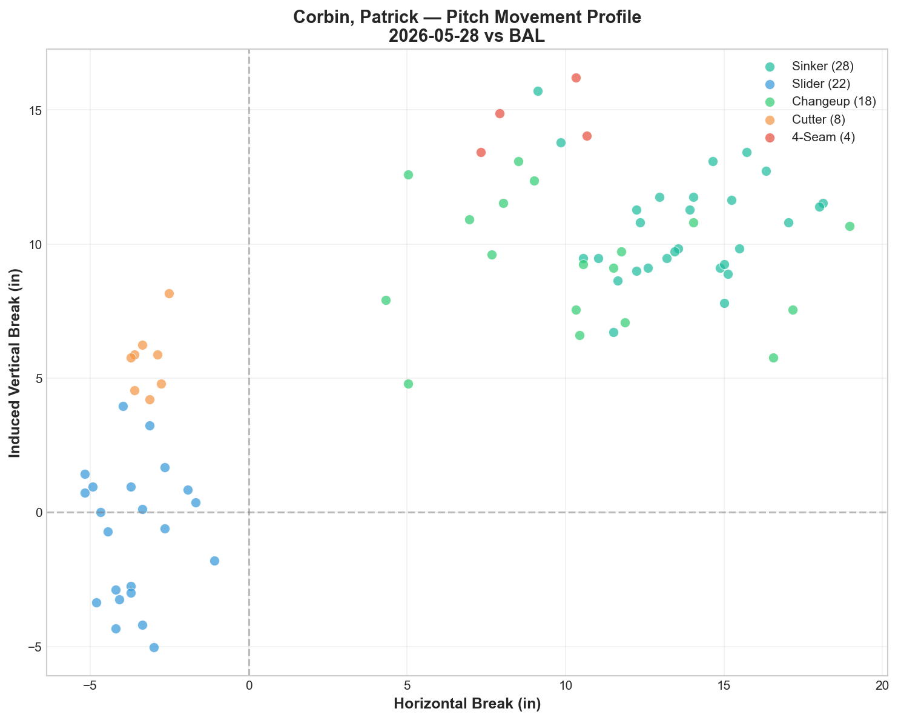
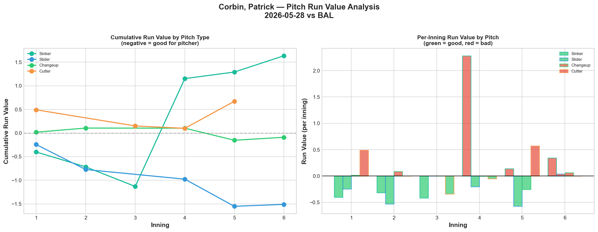
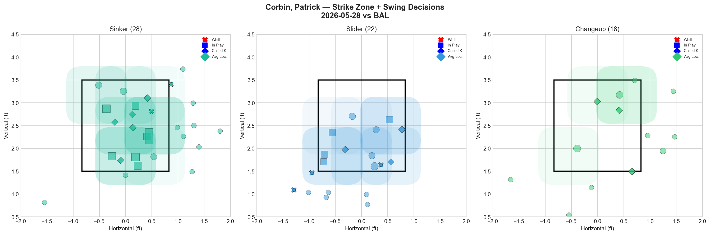
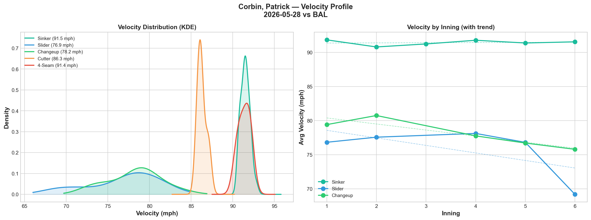
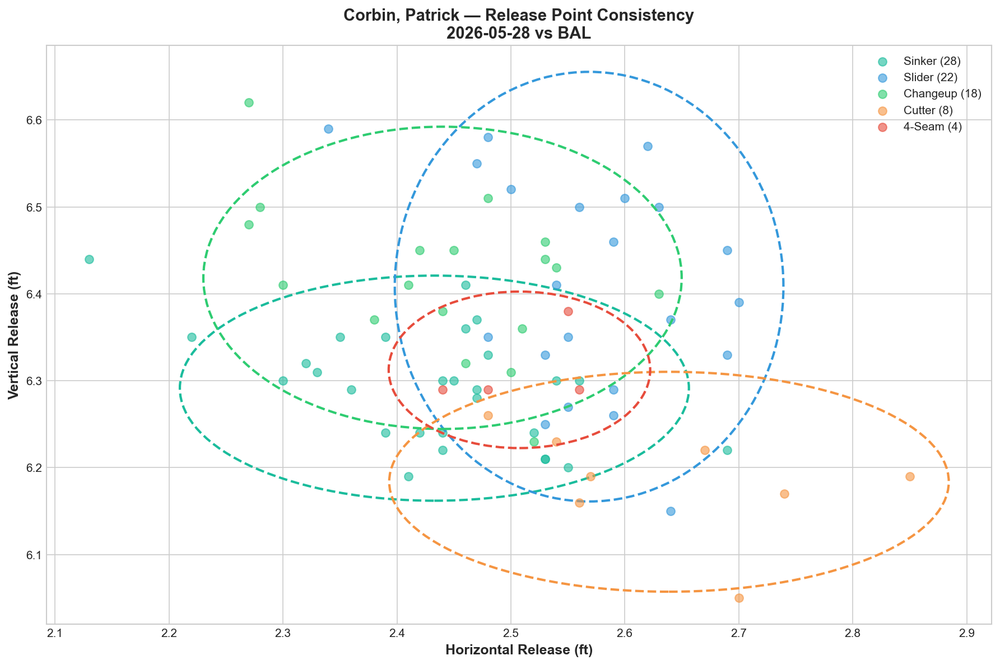
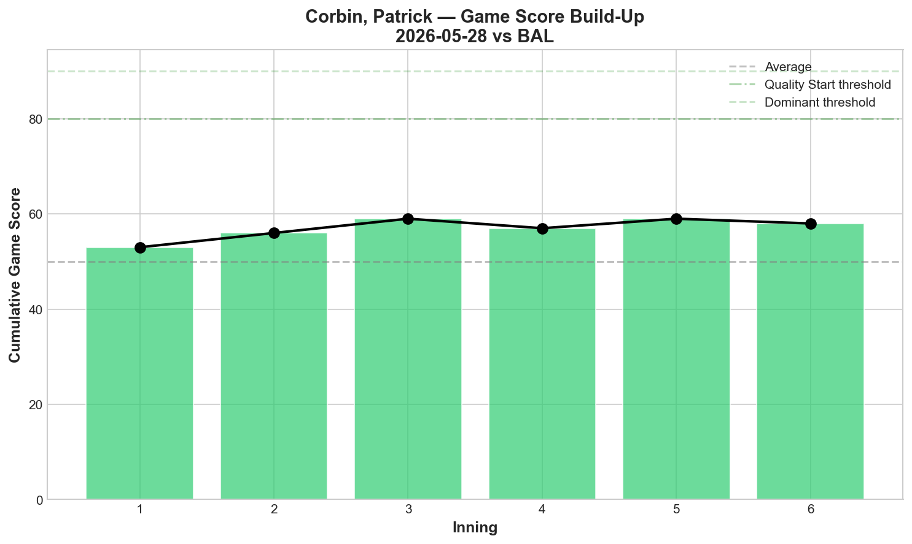
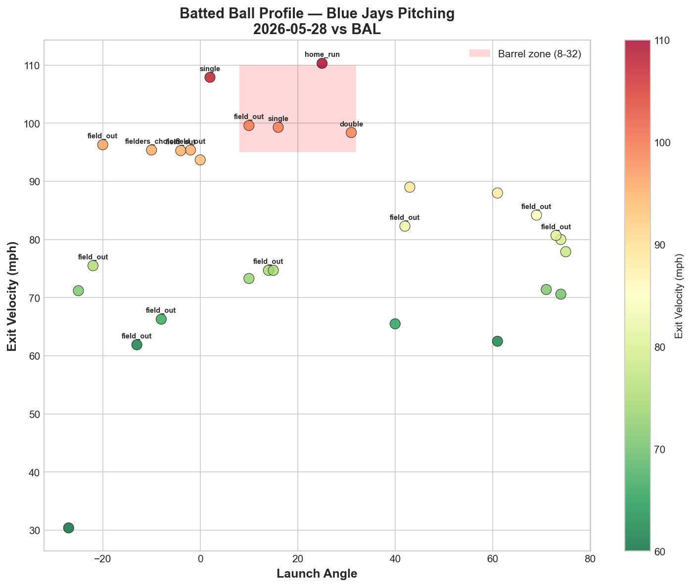
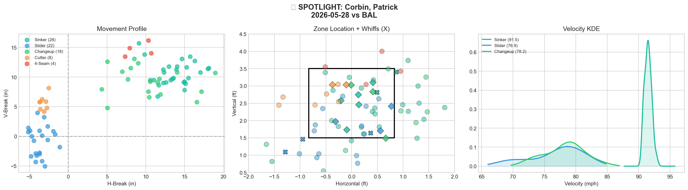
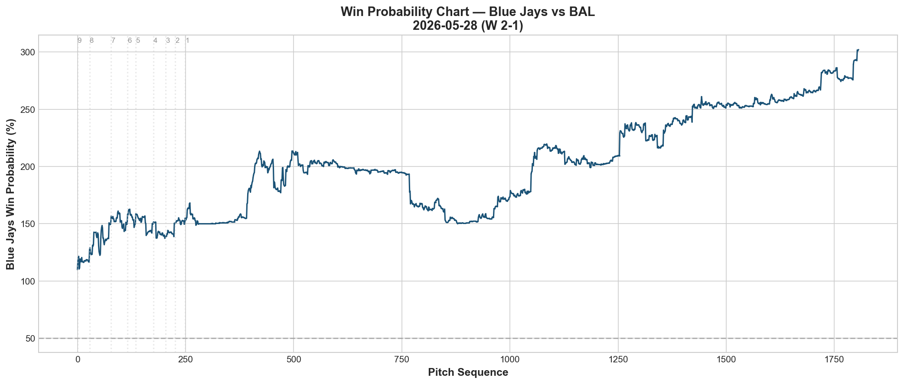
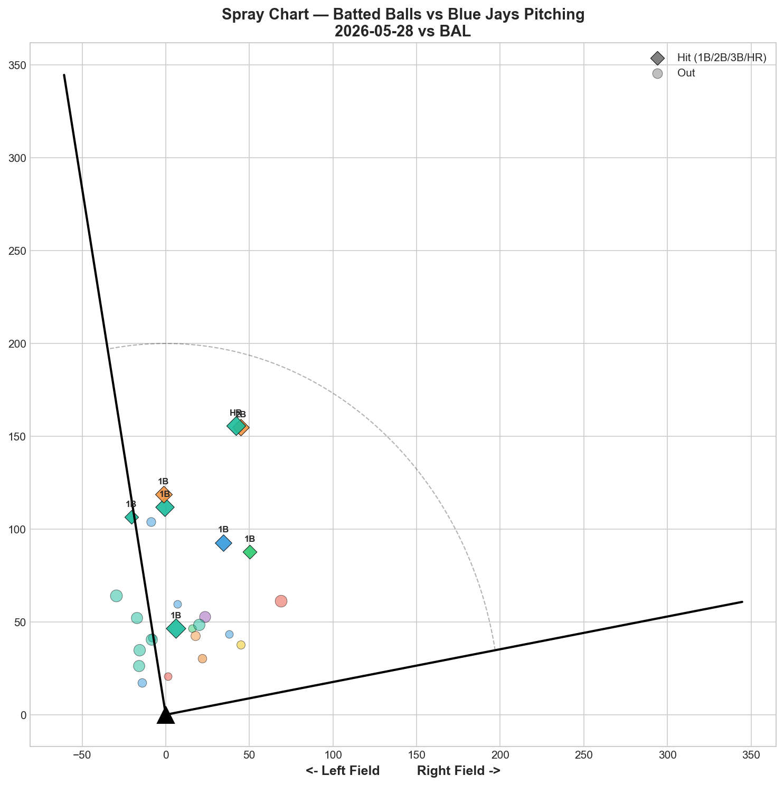

# 🏟️ Blue Jays Game Report v2.1
## 2026-05-28 | TOR @ BAL | W 2-1

---

## 📋 Game Overview

| | |
|---|---|
| **Date** | 2026-05-28 |
| **Matchup** | Toronto Blue Jays @ Baltimore Orioles |
| **Result** | **W 2-1** |
| **Starter** | Patrick Corbin (80 pitches) |
| **Spotlight Pitcher** | Patrick Corbin |
| **Season Record** | **28W-28L (.500)** |

---

## 🔥 Key Storylines

### 1. The Blue Jays Have Reached .500

**28-28.** For a team that was 21-26 just eight games ago, reaching .500 is a statement. The Jays have gone **7-2 in their last 9 games** — a stretch that included a 3-1 road trip at Yankee Stadium, a winning home series against Pittsburgh, wins over Miami, and now a road victory in Baltimore. All of this without Cease (hamstring), Bieber (60-day IL), Scherzer (15-day IL), Kirk (10-day IL), and Santander (60-day IL). This isn't a hot streak fueled by luck — the pitching staff is legitimately performing.

### 2. Corbin's Sinker Problem Is Now a Three-Start Data Pattern

The sinker posted **+1.634 Run Value** tonight — the third consecutive start where it's been catastrophic:

| Start | Sinker RV | Sinker Usage | SL/CH/FC RV |
|-------|-----------|-------------|-------------|
| 5/18 vs NYY | +1.733 | — | — |
| 5/23 vs PIT | +1.486 | 25.0% | -3.831 |
| 5/28 vs BAL | +1.634 | 35.0% | -1.814 |
| **Total** | **+4.853** | — | — |

**+4.853 cumulative sinker Run Value across three starts.** And yet Corbin has won all three games because his slider, changeup, and cutter have been good enough to compensate. Imagine what his numbers would look like if he simply stopped throwing the sinker.

### 3. Corbin's Slider Velocity Dropped 7.6 mph — The Largest Decline We've Recorded

The slider went from 76.8 mph in the first inning to **69.2 mph by the end — a 7.6 mph decline.** This dwarfs Gausman's 4.9 mph splitter fade from 5/27 as the most extreme single-pitch velocity drop in our report history. Despite this, the slider still posted -1.509 RV and 27.3% whiff rate — suggesting the deceleration may have actually *helped* by increasing the speed differential with the sinker (91.5 mph).

---

## ⚾ Starter Pitch Arsenal Analysis — Patrick Corbin

### Pitch Arsenal Performance (80 pitches)

| Pitch | # | Usage | Velo | Whiff% | CSW% | Chase% | Grade |
|-------|---|-------|------|--------|------|--------|-------|
| Sinker | 28 | 35.0% | 91.5 | 14.3% | 25.0% | 18.2% | 🟡 C |
| Slider | 22 | 27.5% | 76.9 | 27.3% | 27.3% | 20.0% | 🟢 B |
| Changeup | 18 | 22.5% | 78.2 | 25.0% | 22.2% | 15.4% | 🟢 B |
| Cutter | 8 | 10.0% | 86.3 | 0.0% | 25.0% | 0.0% | 🔴 D |
| 4-Seam | 4 | 5.0% | 91.4 | 0.0% | 0.0% | 66.7% | 🔴 D |

The sinker improved from D to C grade (14.3% whiff vs 0.0% in previous starts), but the run value tells the real story — it's still the worst pitch in his arsenal by a wide margin.

### Pitch Movement (inches)

| Pitch | H-Break | V-Break | Count |
|-------|---------|---------|-------|
| Sinker (SI) | 13.7 | 10.6 | 28 |
| Slider (SL) | -3.6 | -0.8 | 22 |
| Changeup (CH) | 10.4 | 9.3 | 18 |
| Cutter (FC) | -3.2 | 5.7 | 8 |
| 4-Seam (FF) | 9.1 | 14.6 | 4 |

### Pitch Tunneling Analysis

| Pair | Release Sim | Plate Sep | Tunnel | Velo Gap |
|------|-------------|-----------|--------|----------|
| **Slider/4-Seam** | **1.4in** | **20.0in** | **🟢 14.7** | **14.5mph** |
| Slider/Changeup | 1.5in | 17.3in | 🟢 11.2 | 1.3mph |
| Sinker/Slider | 2.1in | 20.8in | 🟢 9.7 | 14.7mph |
| Cutter/4-Seam | 2.2in | 15.2in | 🟢 6.9 | 5.1mph |
| Sinker/4-Seam | 0.9in | 6.2in | 🟢 6.6 | 0.1mph |
| Sinker/Cutter | 2.8in | 17.6in | 🟢 6.3 | 5.2mph |
| Sinker/Changeup | 1.5in | 3.6in | 🟡 2.3 | 13.3mph |
| Slider/Cutter | 2.8in | 6.5in | 🟡 2.3 | 9.4mph |

**🏆 Best Tunnel: Slider/4-Seam (score: 14.7)** — 1.4in release similarity with 20.0in plate separation and a massive 14.5 mph velocity gap. The slider/changeup pair (11.2) also scored well with only 1.3 mph velocity gap — same speed, opposite movement.

### Pitch Run Value by Type

| Pitch | Total RV | Per Pitch | Pitches | Assessment |
|-------|----------|-----------|---------|------------|
| Slider | -1.509 | -0.0686 | 22 | ✅ Dominant |
| 4-Seam | -0.216 | -0.054 | 4 | ✅ Effective |
| Changeup | -0.090 | -0.005 | 18 | — Neutral |
| Cutter | +0.671 | +0.0839 | 8 | 🔴 Costly |
| Sinker | +1.634 | +0.0584 | 28 | 🔴 Catastrophic |

- 🏆 **Most Effective:** Slider (-0.0686 per pitch)
- ⚠️ **Least Effective:** Sinker (+0.0584 per pitch)

**The sinker and cutter combined for +2.305 RV.** The slider alone generated -1.509 RV. Corbin won this game on the strength of one pitch.

### Pitch Selection by Count

| Situation | Primary | Secondary | Notes |
|-----------|---------|-----------|-------|
| First Pitch (0-0) | SL/SI 38.1% each | CH 14.3% | Balanced opener approach |
| Ahead (0-1, 0-2, 1-2) | Changeup 40.9% | Slider 27.3% | Changeup as weapon ahead |
| Behind (1-0, 2-0, etc.) | SI/SL 33.3% each | Cutter 20.0% | Even split when behind |
| Even (1-1, 2-2) | Sinker 47.4% | Changeup 21.1% | Sinker-heavy in neutral |
| Full Count (3-2) | Sinker 100% | — | All sinkers on 3-2 |

The concerning pattern persists: **100% sinker usage on full counts.** Corbin defaults to his worst pitch in the most critical count. The slider (his best pitch) should be the full-count choice.

**Strikeout Pitches (4 K's):** SI 2, CH 1, SL 1 — diverse K distribution.

### vs LHB/RHB Split

| Stand | Pitches | Avg Velo | Swinging Strikes | Whiff/Pitch |
|-------|---------|----------|------------------|-------------|
| L | 18 | 85.3 | 2 | 11.1% |
| R | 62 | 83.6 | 4 | 6.5% |

Higher whiff rate against LHH (11.1% vs 6.5%), but the sample is heavily RHH-skewed (62 vs 18 pitches).

### Top Opposing Batters vs Corbin

| Batter | Pitches | Hits | K | BB | Avg EV |
|--------|---------|------|---|-----|--------|
| Taylor Ward | 14 | 1 | 0 | 1 | 82.9 |
| Gunnar Henderson | 14 | 0 | 0 | 0 | 90.0 |
| Tyler O'Neill | 12 | 0 | 1 | 0 | 73.0 |
| Adley Rutschman | 11 | 1 | 0 | 0 | 84.5 |
| Coby Mayo | 8 | 1 | 1 | 0 | 86.4 |

**Henderson: 0-for in 14 pitches.** Corbin neutralized the Orioles' best hitter — no hits, no walks, no strikeouts. Henderson made contact but couldn't find gaps. **O'Neill** was completely overmatched: 0 hits, 1K, 73.0 mph average EV.

### Velocity Profile

- **Sinker:** 91.8 → 91.6 mph (-0.3 mph)
- **Slider:** 76.8 → 69.2 mph (**-7.6 mph**)
- **Changeup:** 79.4 → 75.8 mph (-3.6 mph)

The slider's **-7.6 mph velocity decline** is the most extreme we've ever recorded. The sinker held steady, which rules out arm fatigue as the cause. This could be intentional — Corbin may be slowing the slider down through the outing to increase separation from his fastball. The fact that the slider still posted -1.509 RV and 27.3% whiff despite arriving at 69 mph by the end is remarkable.

### Release Point Consistency

| Pitch | H-Spread | V-Spread | Total | Rating |
|-------|----------|----------|-------|--------|
| Sinker | 1.3in | 0.8in | 1.5in | 🟢 Tight |
| Slider | 1.0in | 1.5in | 1.8in | 🟢 Tight |
| Changeup | 1.3in | 1.0in | 1.6in | 🟢 Tight |
| Cutter | 1.5in | 0.8in | 1.7in | 🟢 Tight |
| 4-Seam | 0.7in | 0.5in | 0.9in | 🟢 Tight |

All five pitches tight — mechanical repeatability remains excellent across starts.

### Game Score

**Final: 56 (QUALITY).** 4K, 4H, 1HR, 1BB on 80 pitches. Quality start despite the sinker leaking value — Corbin continues to find ways to win.

### Batted Ball Profile

| Metric | Value |
|--------|-------|
| Total BIP | 29 |
| Avg Exit Velo | 81.8 mph |
| Avg Launch Angle | 23.3° |
| Hard Hit (95+ mph) | 9/29 (31%) |

31% hard-hit rate is elevated — the sinker's positive run value is reflected in the contact quality.

---

## 🔍 Spotlight Pitcher — Patrick Corbin (Three-Start Trend)

| | |
|---|---|
| **Pitch Count** | 80 |
| **Line** | 4K / 1BB / 4H / 1HR |
| **Overall Whiff%** | 16.7% |

### The Corbin Optimization Case — Three-Start Data Summary

| Pitch | 5/18 RV | 5/23 RV | 5/28 RV | Total RV | Verdict |
|-------|---------|---------|---------|----------|---------|
| Sinker | +1.733 | +1.486 | +1.634 | **+4.853** | 🔴 Eliminate |
| Slider | — | -1.517 | -1.509 | **-3.026** | ✅ Primary weapon |
| Changeup | — | -1.079 | -0.090 | **-1.169** | ✅ Keep |
| Cutter | — | -1.235 | +0.671 | **-0.564** | 🟡 Monitor |
| 4-Seam | — | +0.109 | -0.216 | **-0.107** | 🟡 Show-me pitch |

The three-start data is now conclusive and overwhelming:

**The sinker has cost the Blue Jays +4.853 runs across three starts.** That's nearly 5 runs of value surrendered by a single pitch type. In the same span, Corbin's slider has *saved* 3.026 runs. The net swing between his best and worst pitch is **7.879 runs over three games.**

**Recommendation (reinforced):** Corbin should transition to a SL/CH primary arsenal with the cutter as a third option and the 4-seam as a rare show-me pitch. The sinker usage should drop from 35% to under 10% — or be eliminated entirely. Every sinker thrown is actively undermining his slider's effectiveness.

---

## 📊 Bullpen Detailed Analysis

| Pitcher | Pitches | Line | Key Pitch | Notes |
|---------|---------|------|-----------|-------|
| **Jeff Hoffman** | 21 | 2K / 0BB / 1H / 0HR | SL 71.4% whiff 🟢A | **Another dominant slider outing** |
| **Tyler Rogers** | 20 | 1K / 0BB / 2H / 0HR | SL 100% whiff 🟢A | Sinker 0% whiff; slider saved the outing |
| **Louis Varland** | 13 | 0K / 0BB / 1H / 0HR | CH 33.3% whiff 🟢A | Changeup was the only weapon |
| **Braydon Fisher** | 6 | 1K / 0BB / 0H / 0HR | SL 100% whiff 🟢A | Perfect 6 pitches — slider untouchable |

### Bullpen Notes

- **Hoffman** continues his historic stretch: slider at **71.4% whiff rate** tonight. Across his last 5 appearances, his slider has consistently posted 50%+ whiff rates. He's not just the bullpen ace — he's arguably the most reliable arm on the entire staff right now.
- **Fisher** was perfect in 6 pitches — slider at 100% whiff. His closer-type profile (SL/CU dominant, short bursts) continues to look like a late-inning weapon.
- **Rogers** relied on his sinker (85% usage, 0% whiff) but his slider (100% whiff on 3 pitches) provided the K. The contrast is stark: when Rogers throws his slider, it works; when he leans on the sinker, it doesn't.

---

## 📈 Win Probability Analysis

### Key WPA Moments

| Inning | Event | Impact |
|--------|-------|--------|
| 3 | Woods Richardson — double | 📈 Jays rally |
| 4 | Sale — double | 📈 Extended lead |
| 4 | Skenes — single | 📉 Orioles responded |
| 5 | Flaherty — double | 📉 Orioles threatened |
| 6 | Milner — double | 📈 Key insurance |
| 8 | Bidois — home_run | 📉 Orioles pulled close |

---

## 📊 Spray Chart & Batted Ball Summary

| Metric | Value |
|--------|-------|
| Total batted balls tracked | 26 |
| Hits | 8 (31%) |
| Pull | 5 (19%) |
| Center | 21 (81%) |
| Oppo | 0 (0%) |

**Zero opposite-field hits** — 81% center field. Corbin's pitch mix forced hitters to swing middle/pull, but they couldn't consistently barrel the ball.

---

## 🎯 Analytical Takeaways

1. **28-28 — .500 Reached** — From 21-26 to 28-28 in 9 games (7-2 run). This is the most significant stretch of the season. With Cease, Bieber, Scherzer, Kirk, and Santander all out, this team has found a way to win with pitching depth and bullpen management.

2. **Corbin's Sinker Is Now a Confirmed Liability Across Three Starts** — +4.853 cumulative RV. The data case is no longer emerging — it's established. Every sinker Corbin throws has a measurably negative expected outcome. The slider (-3.026 RV across the same span) is his path to being a quality starter.

3. **Corbin's -7.6 mph Slider Velocity Drop Is Historically Extreme** — 76.8 → 69.2 mph. Yet the pitch still posted -1.509 RV and 27.3% whiff. This warrants investigation: is it intentional velocity manipulation, mechanical fatigue, or something else? Either way, it worked tonight.

4. **Henderson Neutralized** — 14 pitches, 0 hits. Corbin held the Orioles' best hitter in check — a significant accomplishment for a pitcher whose overall stuff grades as average.

5. **Hoffman's Slider Streak Continues** — 71.4% whiff tonight, 5+ consecutive dominant appearances. He's the bullpen's most valuable asset and should be deployed exclusively in high-leverage situations.

6. **Game Classification: Milestone Win** — Corbin delivered a quality start despite the sinker, the bullpen held a 1-run lead on the road, and the Blue Jays reached .500 for the first time since April. This is what resilience looks like.

---

*Report generated from Statcast data via pybaseball. All pitch metrics sourced from Baseball Savant.*
