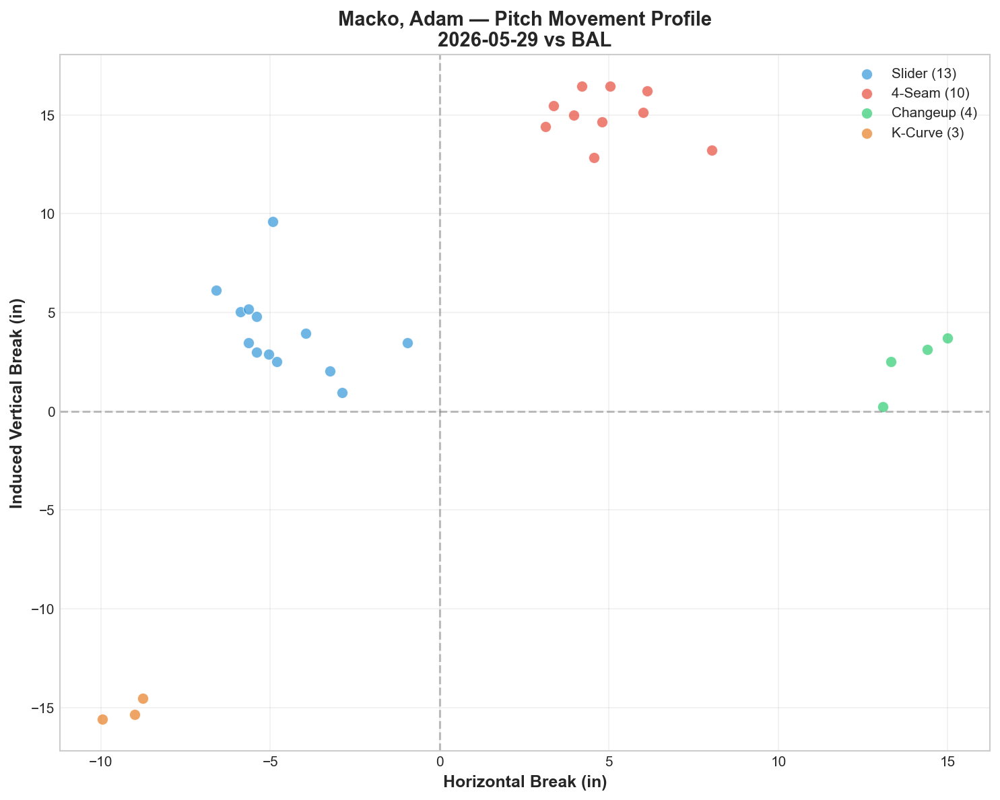
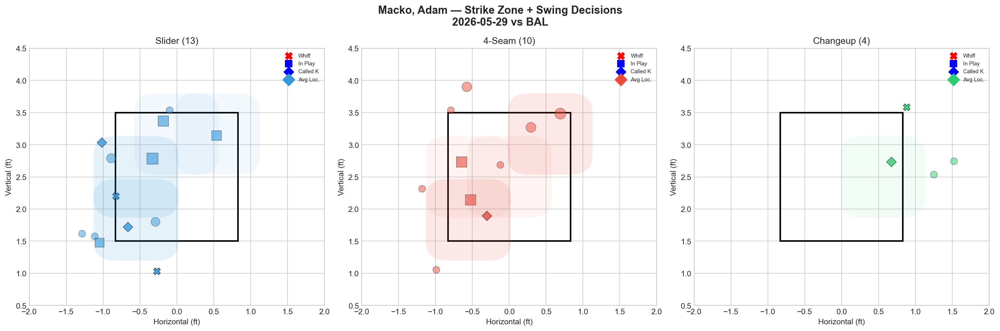
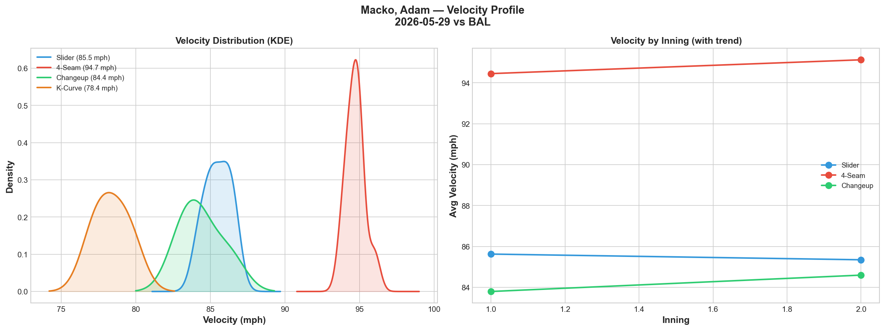
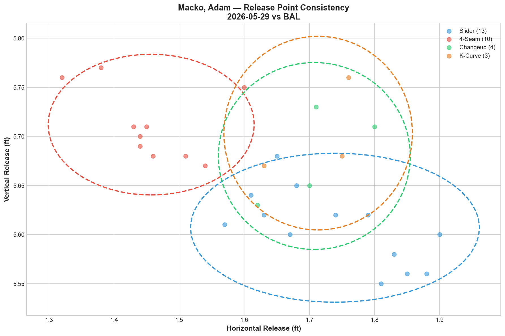
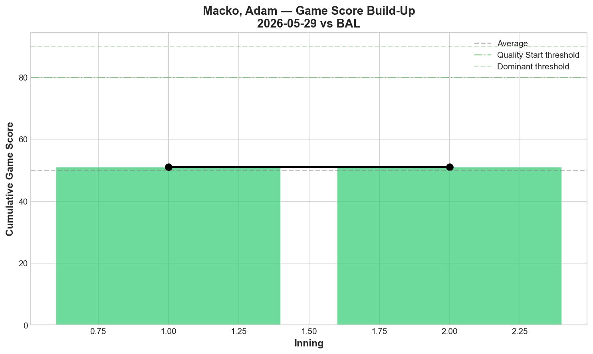
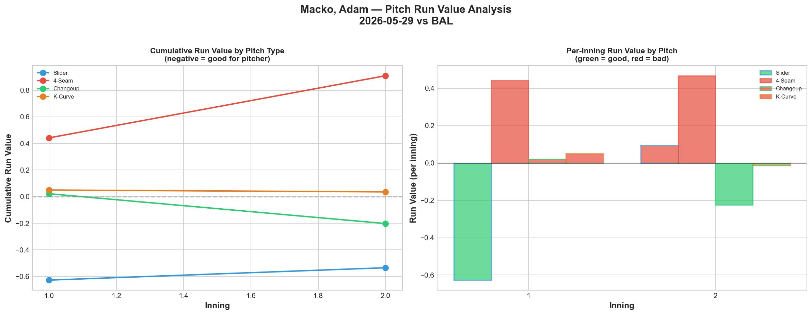
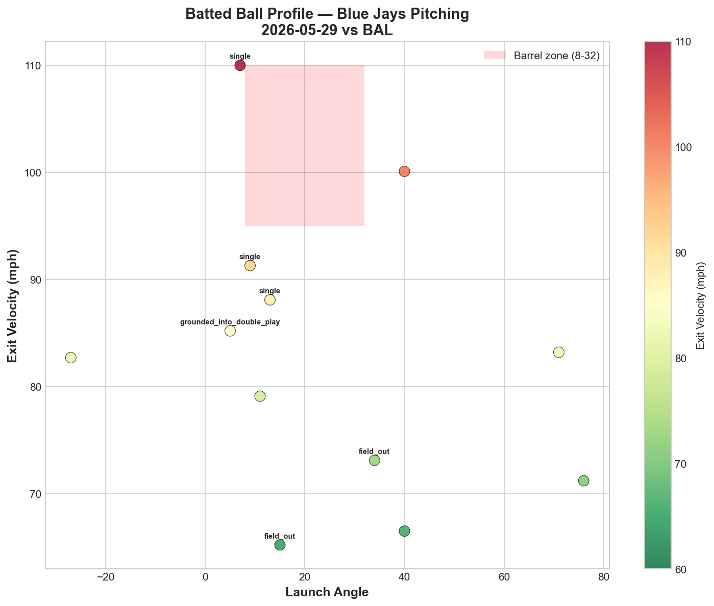
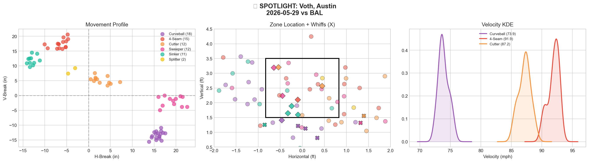
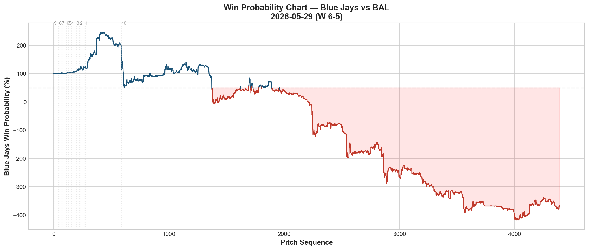
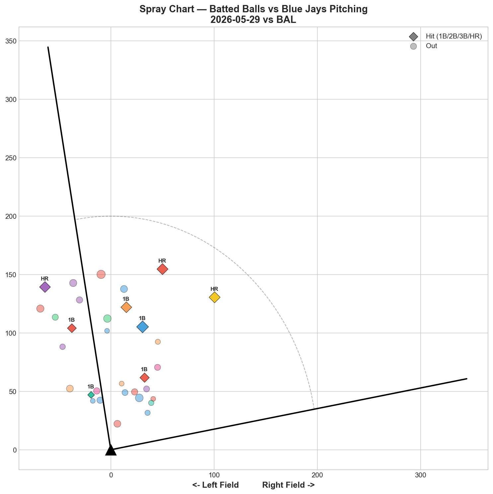

# 🏟️ Blue Jays Game Report v2.1
## 2026-05-29 | TOR @ BAL | W 6-5

---

## 📋 Game Overview

| | |
|---|---|
| **Date** | 2026-05-29 |
| **Matchup** | Toronto Blue Jays @ Baltimore Orioles |
| **Result** | **W 6-5** |
| **Opener** | Adam Macko (30 pitches) |
| **Bulk Pitcher** | Austin Voth (70 pitches) |
| **Spotlight Pitchers** | Austin Voth, Connor Seabold, Braydon Fisher |
| **Season Record** | **29W-28L** |

**Bullpen Day Structure:** Macko opened (30 pitches, 1K), Voth absorbed the bulk (70 pitches, 3.1 IP), Seabold made his Blue Jays debut (18 pitches), Fluharty bridged (20 pitches), and Fisher closed (15 pitches). Five pitchers — **above .500 for the first time this season.**

---

## 🔥 Key Storylines

### 1. Above .500 for the First Time — 29-28

The Blue Jays are now **above .500 for the first time in 2026.** From 21-26 to 29-28 in 11 games (8-3 run). This is the longest sustained stretch of winning baseball this season, and it's been built almost entirely on pitching depth, bullpen management, and creative roster construction — all while the core of the projected roster sits on the injured list.

### 2. Macko's Opener Leap — From MLB Debut to Opening Games

Adam Macko has gone from a debut where he generated 0% whiff across all pitches (5/19 vs NYY) to **opening a game on the road in Baltimore.** Tonight: 30 pitches, 1K, slider at 25% whiff (Grade B), changeup at 100% whiff (Grade A). His development arc across 7 appearances has been one of the most compelling stories of this stretch.

### 3. Voth's Bulk Outing Was a Mixed Bag — Elite Stuff, Poor Results

Austin Voth threw 70 pitches with a 23.1% overall whiff rate — his curveball (42.9% whiff, Grade A) and cutter (33.3% whiff, Grade A) were genuine swing-and-miss weapons. But the line tells a different story: **0K, 4BB, 5H, 3HR.** The whiffs weren't translating into strikeouts, and the home runs were devastating. This is a "stuff over results" outing — the arsenal has potential but the command wasn't there.

### 4. Two Debuts: Seabold's Clean First Impression + Fisher's Closer Audition

**Connor Seabold**, acquired from Detroit after a spring training DFA, made his Blue Jays debut: **18 pitches, 1K, 0BB, 0H, 0HR.** His 4-seam generated 100% whiff rate. Clean.

**Braydon Fisher** closed a game for the first time in his career: **15 pitches, 0K, 0BB, 0H, 0HR.** The curveball (33.3% whiff) provided the swing-and-miss, while the slider generated called strikes (50% CSW). A successful closer audition.

---

## ⚾ Opener Pitch Arsenal Analysis — Adam Macko

### Pitch Arsenal Performance (30 pitches)

| Pitch | # | Usage | Velo | Whiff% | CSW% | Chase% | Grade |
|-------|---|-------|------|--------|------|--------|-------|
| Slider | 13 | 43.3% | 85.5 | 25.0% | 30.8% | 42.9% | 🟢 B |
| 4-Seam | 10 | 33.3% | 94.7 | 0.0% | 10.0% | 25.0% | 🔴 D |
| Changeup | 4 | 13.3% | 84.4 | 100.0% | 50.0% | 33.3% | 🟢 A |
| K-Curve | 3 | 10.0% | 78.4 | 0.0% | 0.0% | 0.0% | 🔴 D |

### Macko's Development Arc — 7 Appearances

| Date | Pitches | Best Pitch | Whiff Highlight | Role |
|------|---------|-----------|-----------------|------|
| 5/19 vs NYY | 14 | — | 0% all pitches | Debut |
| 5/21 vs NYY | 20 | KC 50% | K-Curve breakthrough | Relief |
| 5/23 vs PIT | 10 | SL 50%, FF 25% | Slider + fastball | Relief |
| 5/24 vs PIT | 9 | — | 0% whiff, 66.7% CSW | Relief |
| 5/25 vs MIA | 10 | FF 33.3% | Fastball developing | Relief |
| 5/26 vs MIA | 9 | SL 66.7% CSW | Called strikes | Relief |
| **5/29 vs BAL** | **30** | **CH 100%** | **Slider B, Changeup A** | **Opener** |

From 14-pitch debut to 30-pitch opener in 10 days. The changeup (100% whiff tonight) is emerging as a potential third weapon alongside his slider and fastball. The K-Curve that flashed early has faded, but the changeup may be the development pitch that unlocks his profile.

### Pitch Movement (inches)

| Pitch | H-Break | V-Break | Count |
|-------|---------|---------|-------|
| Slider (SL) | -4.6 | 4.1 | 13 |
| 4-Seam (FF) | 4.9 | 15.0 | 10 |
| Changeup (CH) | 14.0 | 2.4 | 4 |
| K-Curve (KC) | -9.2 | -15.2 | 3 |

### Pitch Run Value by Type

| Pitch | Total RV | Per Pitch | Assessment |
|-------|----------|-----------|------------|
| Slider | -0.534 | -0.0411 | ✅ Effective |
| Changeup | -0.202 | -0.0505 | ✅ Effective |
| K-Curve | +0.036 | +0.012 | — Neutral |
| 4-Seam | +0.909 | +0.0909 | 🔴 Costly |

The 4-seam continues to leak value (+0.909) while the slider and changeup both posted negative RV. Macko's path mirrors what we've seen with other Jays pitchers: breaking balls work, fastballs get hit.

### Top Opposing Batters vs Macko

| Batter | Pitches | Hits | K | Avg EV |
|--------|---------|------|---|--------|
| Adley Rutschman | 7 | 0 | 0 | 75.8 |
| Leody Taveras | 6 | 1 | 0 | 80.5 |
| Gunnar Henderson | 6 | 0 | 0 | 65.2 |
| Pete Alonso | 5 | 0 | 1 | 88.7 |

**Henderson 0-for again** — 6 pitches, 65.2 mph average EV. Two consecutive games where Henderson has been completely neutralized by Blue Jays pitching.

### Velocity Profile

- **4-Seam:** 94.4 → 95.1 mph (+0.7 mph)
- **Slider:** 85.6 → 85.4 mph (-0.3 mph)
- **Changeup:** 83.8 → 84.6 mph (+0.8 mph)

Velocity gained through the outing — no fatigue in 30 pitches.

---

## 🔍 Spotlight Pitcher 1 — Austin Voth (Bulk Role)

| | |
|---|---|
| **Role** | Bulk pitcher (entered after Macko) |
| **Pitch Count** | 70 (game-high) |
| **Line** | 0K / 4BB / 5H / 3HR |
| **Overall Whiff%** | 23.1% |
| **Role Assessment** | ✅ SOLID RELIEVER (by whiff) — but results were poor |

### Pitch Arsenal

| Pitch | # | Usage | Velo | Whiff% | CSW% | Grade |
|-------|---|-------|------|--------|------|-------|
| Curveball | 18 | 25.7% | 73.9 | 42.9% | 22.2% | 🟢 A |
| 4-Seam | 15 | 21.4% | 91.9 | 0.0% | 6.7% | 🔴 D |
| Cutter | 12 | 17.1% | 87.2 | 33.3% | 25.0% | 🟢 A |
| Sweeper | 12 | 17.1% | 78.9 | 16.7% | 25.0% | 🟡 C |
| Sinker | 11 | 15.7% | 91.1 | 25.0% | 36.4% | 🟢 B |
| Splitter | 2 | 2.9% | 83.9 | 0.0% | 0.0% | 🔴 D |

### Assessment

Voth's arsenal profile is intriguing: **6 pitch types** with two A-grade offerings (curveball 42.9% whiff, cutter 33.3% whiff) and a solid sinker (25% whiff, Grade B). The 73.9 mph curveball creates an **18.0 mph speed differential** with his 91.9 mph fastball — that's a massive gap.

But the results were ugly: **0K, 4BB, 5H, 3HR in 70 pitches.** The disconnect between stuff metrics (23.1% whiff) and outcomes (3 HR) points to a command issue — Voth was generating swings-and-misses but also leaving pitches over the heart of the plate when hitters didn't chase. The 4BB confirms the command concern.

**Development question:** Can Voth clean up the walks and HR-proneness while maintaining the whiff rates? If yes, his curveball/cutter combination has genuine starter potential. If no, the stuff alone won't save him.

---

## 🔍 Spotlight Pitcher 2 — Connor Seabold (Blue Jays Debut)

| | |
|---|---|
| **Background** | Acquired from Detroit after spring training DFA |
| **Pitch Count** | 18 |
| **Line** | 1K / 0BB / 0H / 0HR |

### Pitch Arsenal

| Pitch | # | Usage | Velo | Whiff% | CSW% | Grade |
|-------|---|-------|------|--------|------|-------|
| Slider | 6 | 33.3% | 84.0 | 0.0% | 50.0% | 🔴 D |
| 4-Seam | 6 | 33.3% | 93.5 | 100.0% | 33.3% | 🟢 A |
| Changeup | 4 | 22.2% | 82.8 | 0.0% | 25.0% | 🔴 D |
| Cutter | 2 | 11.1% | 86.8 | 0.0% | 0.0% | 🔴 D |

### Assessment

Seabold's debut was clean: **18 pitches, 1K, 0H, 0HR.** His 4-seam at 93.5 mph generated 100% whiff rate — hitters couldn't touch it. The slider generated 0 whiffs but 50% CSW through called strikes. The debut is a positive data point, but 18 pitches is a minimal sample. The key question is whether the 4-seam whiff rate holds as hitters see him more.

For a pitcher who was DFA'd by Detroit and picked up on the cheap, a zero-damage debut is exactly the kind of low-risk acquisition that rebuilding teams thrive on.

---

## 🔍 Spotlight Pitcher 3 — Braydon Fisher (First Career Closer Appearance)

| | |
|---|---|
| **Role** | Closer (9th inning, protecting 1-run lead) |
| **Pitch Count** | 15 |
| **Line** | 0K / 0BB / 0H / 0HR |

### Pitch Arsenal

| Pitch | # | Usage | Velo | Whiff% | CSW% | Grade |
|-------|---|-------|------|--------|------|-------|
| Slider | 8 | 53.3% | 88.1 | 0.0% | 50.0% | 🔴 D |
| Curveball | 6 | 40.0% | 80.0 | 33.3% | 16.7% | 🟢 A |
| 4-Seam | 1 | 6.7% | 93.8 | 0.0% | 0.0% | 🔴 D |

### Assessment

Fisher's first closer audition: **15 pitches, zero damage, save secured.** The slider didn't generate whiffs (0%) but posted an elite 50% CSW through called strikes — hitters were frozen by it. The curveball provided the swing-and-miss (33.3% whiff).

Fisher's closer profile is now established across multiple high-leverage appearances:
- **5/21 vs NYY:** Opener, 23P, 4K, 0H — SL 80% whiff, SL/CU tunnel 31.9
- **5/23 vs PIT:** Relief, 14P, 2K, 0H — CU 100% whiff
- **5/26 vs MIA:** Opener, 12P, 1K, 0H — CU 66.7% whiff
- **5/28 vs BAL:** Relief, 6P, 1K, 0H — SL 100% whiff
- **5/29 vs BAL:** **Closer, 15P, 0K, 0H — CU 33.3% whiff, SL 50% CSW**

Five appearances, five zeros. **0 hits allowed across his last 5 outings.** Fisher can open, bridge, or close — the SL/CU combination works in any role.

---

## 📊 Bullpen Detailed Analysis

| Pitcher | Pitches | Line | Key Pitch | Notes |
|---------|---------|------|-----------|-------|
| **Adam Macko** | 30 | 1K / 0BB | CH 100% whiff 🟢A | Opener — biggest workload yet |
| **Austin Voth** | 70 | 0K / 4BB / 5H / 3HR | CU 42.9% 🟢A, FC 33.3% 🟢A | Bulk — stuff was there, command wasn't |
| **Connor Seabold** | 18 | 1K / 0BB / 0H | FF 100% whiff 🟢A | Blue Jays debut — clean |
| **Mason Fluharty** | 20 | 1K / 0BB / 0H | ST 100% whiff 🟢A, CH 50% 🟢A | Strong bridge outing |
| **Braydon Fisher** | 15 | 0K / 0BB / 0H | CU 33.3% whiff 🟢A | First career save — zero damage |

### Bullpen Notes

- **Fluharty** had one of his best outings: sweeper at 100% whiff, changeup at 50% whiff. Both Grade A. The cutter (0% whiff, Grade D) remains the weak pitch — when he throws the sweeper, he's dominant.
- The five-pitcher bullpen day produced a **W despite Voth giving up 3HR** — the supporting cast (Macko, Seabold, Fluharty, Fisher) combined for 0H allowed in 83 pitches.

---

## 📈 Win Probability Analysis

### Key WPA Moments

| Inning | Event | Impact |
|--------|-------|--------|
| 7 | Parker — home_run | 📉 Major damage (WP -362.9%) |
| 8 | Cano — double | 📈 Jays rally |
| 8 | Myers — home_run | 📉 Orioles responded |
| 9 | Rogers — home_run | 📈 Jays tied/took lead |
| 9 | Kilian — home_run | 📈 Insurance |
| 10 | Anderson — home_run | 📈 Clinching HR |

A wild game with massive WPA swings — the Jays trailed, rallied, fell behind again, and ultimately won on late-inning home runs.

---

## 📊 Spray Chart & Batted Ball Summary

| Metric | Value |
|--------|-------|
| Total batted balls tracked | 32 |
| Hits | 8 (25%) |
| Pull | 5 (16%) |
| Center | 23 (72%) |
| Oppo | 4 (13%) |

---

## 🎯 Analytical Takeaways

1. **29-28 — Above .500 for the First Time** — 8-3 in the last 11 games. The pitching depth strategy — bullpen days, opener/bulk combos, creative deployment — is working. This isn't a fluke; it's organizational pitching philosophy producing results.

2. **Macko's Opener Evolution Is Remarkable** — From 0% whiff debut (5/19) to opening a road game in Baltimore with A-grade changeup and B-grade slider (5/29). 10 days, 7 appearances, each one building on the last. This is the kind of development arc that gets noticed.

3. **Voth Has the Stuff But Not the Command** — 23.1% whiff rate with A-grade curveball and cutter, but 0K/4BB/3HR. The arsenal is real; the execution needs work. If the walks come down, he's a rotation option. If not, the HR vulnerability will keep him in long relief.

4. **Seabold's Quiet Debut** — 18 pitches, 0 damage, 100% whiff on his 4-seam. A DFA pickup from Detroit delivering a clean debut is exactly the kind of depth move that sustains winning stretches.

5. **Fisher's Closer Viability Is Proven** — 5 consecutive appearances with 0H allowed. He can open, bridge, or close. The SL/CU combination generates either whiffs or frozen called strikes depending on the night. He's the most versatile arm in this bullpen.

6. **Henderson Neutralized for the Second Straight Game** — 6 pitches, 0 hits, 65.2 mph average EV. Two games in Baltimore, zero hits for the Orioles' franchise player against Blue Jays pitching.

7. **Game Classification: Bullpen Day Survival Win** — Voth gave up 3HR but the supporting cast (0H in 83 combined pitches) and the offense's late-inning heroics (multiple HR) secured the win. Ugly but effective. That's .500+ baseball.

---

*Report generated from Statcast data via pybaseball. All pitch metrics sourced from Baseball Savant.*
