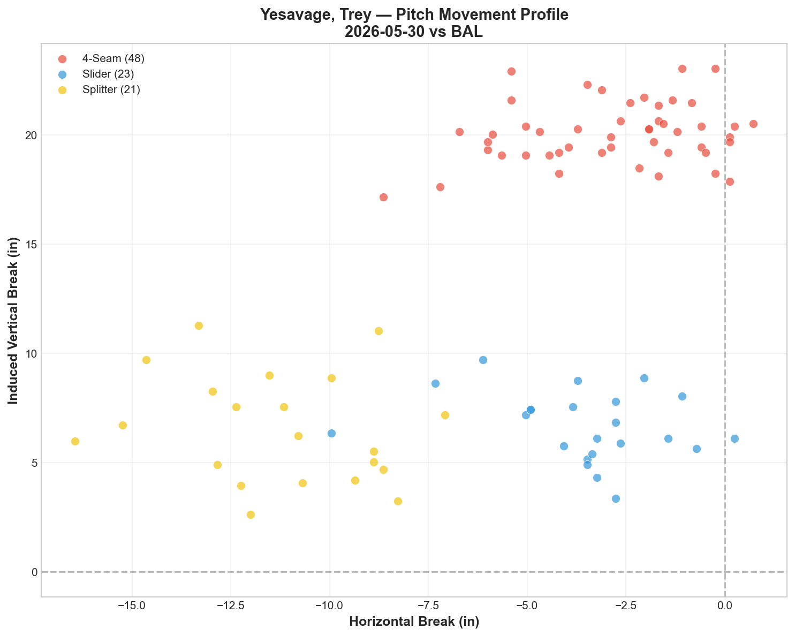
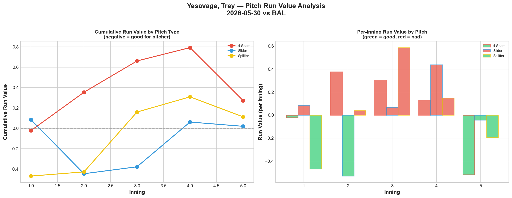
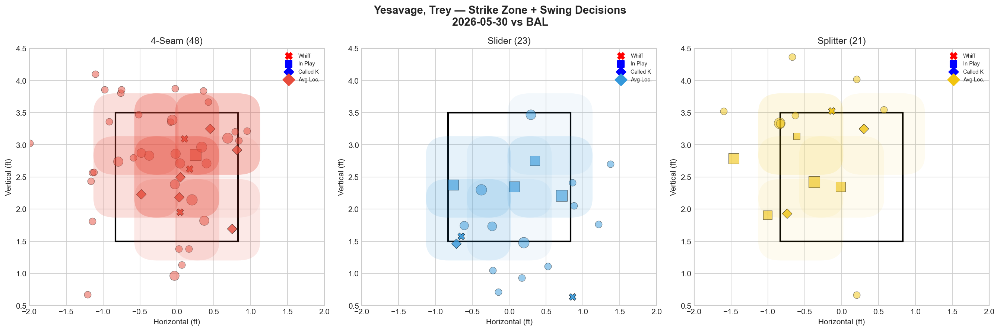
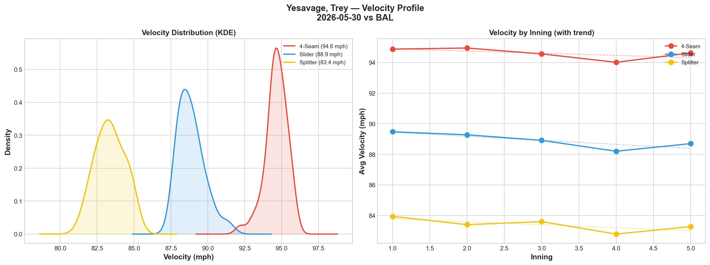
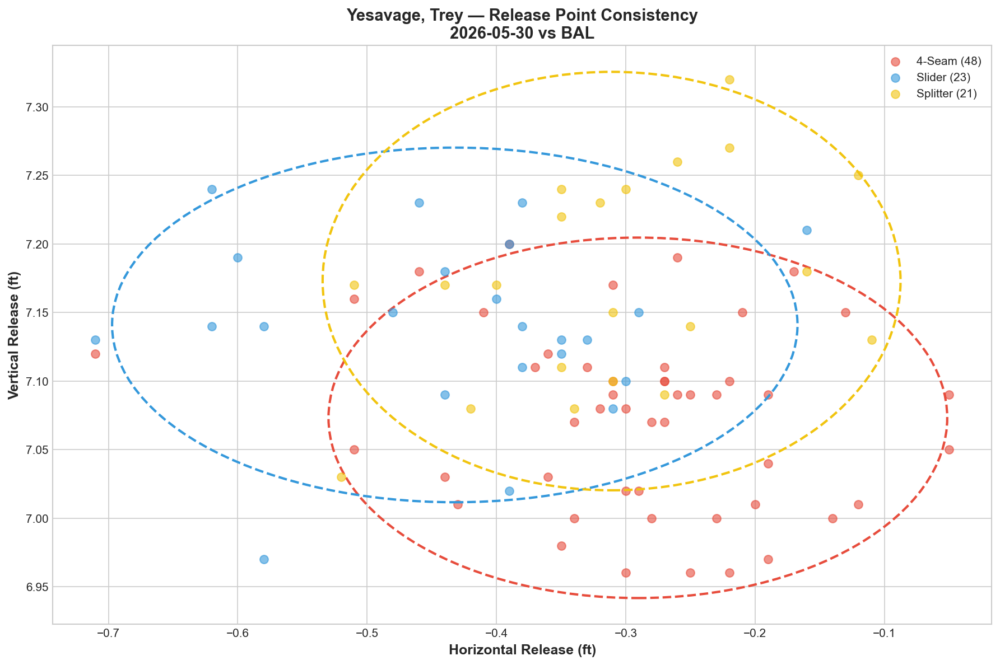
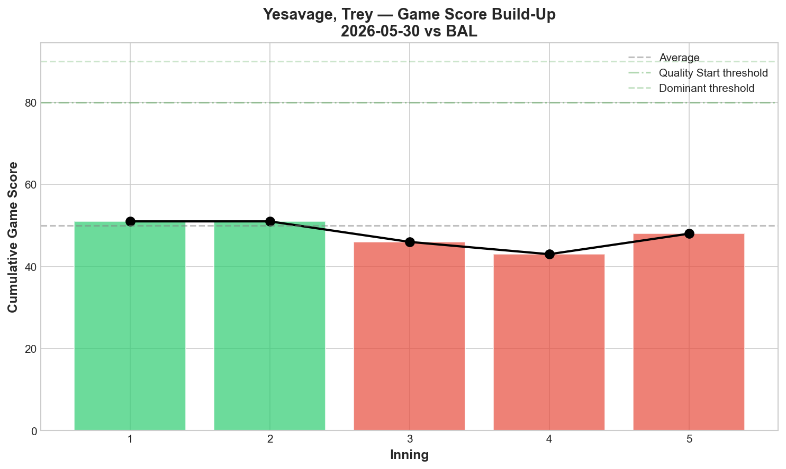
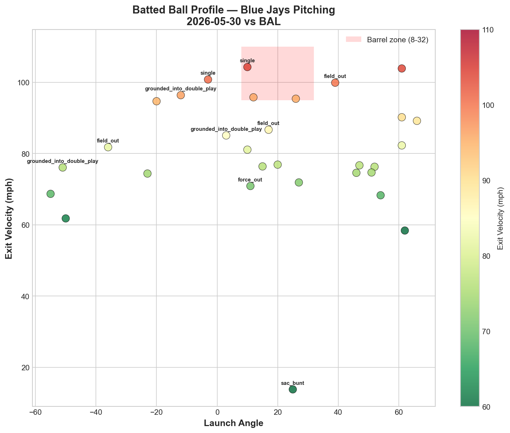
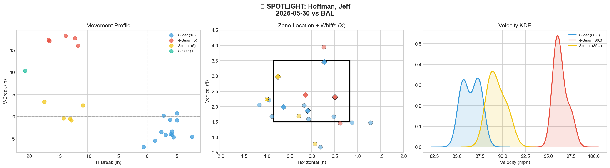
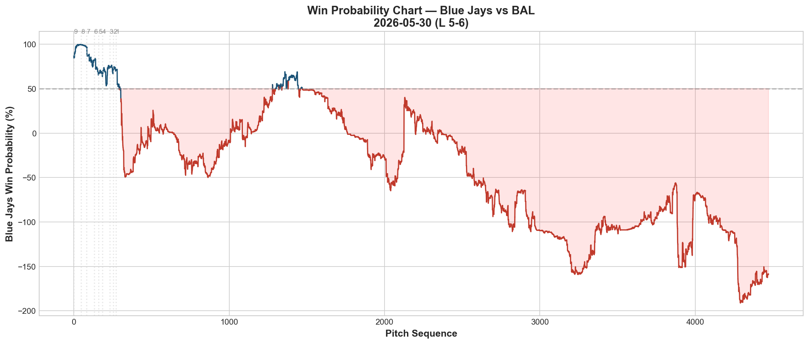
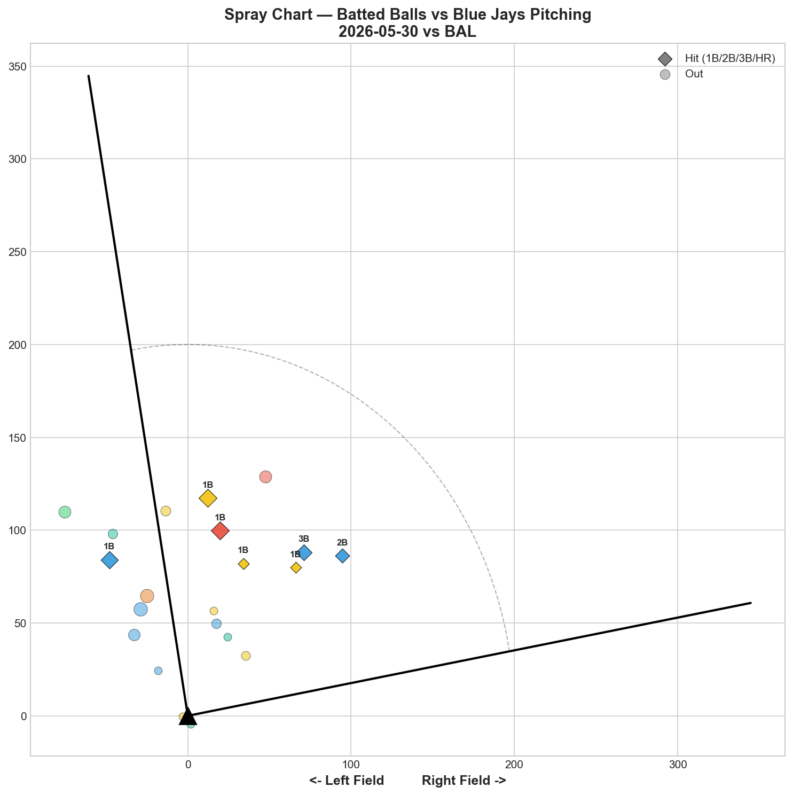

# 🏟️ Blue Jays Game Report v2.1
## 2026-05-30 | TOR @ BAL | L 5-6

---

## 📋 Game Overview

| | |
|---|---|
| **Date** | 2026-05-30 |
| **Matchup** | Toronto Blue Jays @ Baltimore Orioles |
| **Result** | **L 5-6 (walk-off)** |
| **Starter** | Trey Yesavage (92 pitches) |
| **Spotlight Pitcher** | Jeff Hoffman |
| **Season Record** | 29W-29L |

---

## 🔥 Key Storylines

### 1. Yesavage Walked 7 Batters — His Worst Command Outing of the Season

Trey Yesavage threw 92 pitches with **7 BB/HBP** — an astonishing number for a pitcher who walked just 2 in his last start (5/25 vs MIA, 98 pitches). His Game Score of 45 (AVERAGE) was dragged down entirely by free passes, not hard contact — his 80.3 mph average exit velocity against and 23% hard-hit rate were both manageable. The stuff was there (all three pitches graded C), but the command vanished. He was behind in the count on **29 of 92 pitches (31.5%)**, forcing him into fastball-heavy sequences (65.5% 4-seam when behind).

### 2. Hoffman's Dominant Streak Is Over

Jeff Hoffman entered the 9th inning as the bullpen's most reliable arm — 5+ consecutive dominant appearances with slider whiff rates of 50-71%. Tonight: **slider 0.0% whiff, 1K, 3BB, 3H in 24 pitches.** The slider that had been unhittable suddenly generated zero swing-and-miss. Only his splitter (33.3% whiff, Grade A) provided any deception.

The key WPA moment: Hoffman gave up a **double in the 9th** that swung the game (-41.4% WP). The walk-off followed.

### 3. Rodríguez Delivered His Best Outing Yet

While Hoffman struggled, **Yariel Rodríguez** posted the best appearance of his young career: **slider 50% whiff (Grade A), splitter 50% whiff (Grade A).** His development arc has been one of the most patient stories we've tracked — from 0% whiff in three straight appearances to now consistently flashing A-grade stuff. Tonight's line: 1K, 1BB, 1H in 15 pitches.

---

## ⚾ Starter Pitch Arsenal Analysis — Trey Yesavage

### Pitch Arsenal Performance (92 pitches)

| Pitch | # | Usage | Velo | Whiff% | CSW% | Chase% | Grade |
|-------|---|-------|------|--------|------|--------|-------|
| 4-Seam | 48 | 52.2% | 94.6 | 15.0% | 18.8% | 4.5% | 🟡 C |
| Slider | 23 | 25.0% | 88.9 | 18.2% | 13.0% | 14.3% | 🟡 C |
| Splitter | 21 | 22.8% | 83.4 | 12.5% | 14.3% | 33.3% | 🟡 C |

All three pitches graded C — a uniformly mediocre outing. Compare this to his 5/20 masterpiece (FF -0.851 RV, FS -0.915 RV, SL -2.006 RV — all negative). Tonight every pitch posted positive run value.

### Yesavage Start-to-Start Comparison

| Metric | 5/20 vs NYY (W 2-1) | 5/25 vs MIA (L 2-8) | 5/30 vs BAL (L 5-6) |
|--------|---------------------|---------------------|---------------------|
| Pitches | 95 | 98 | 92 |
| K | 8 | 6 | 4 |
| BB/HBP | 0 | 2 | **7** |
| Slider RV | -2.006 | +2.168 | +0.020 |
| Splitter RV | -0.915 | -0.624 | +0.113 |
| 4-Seam RV | -0.851 | -1.993 | +0.273 |
| Game Score | 74 | 64 | 45 |

The trend is concerning: GS 74 → 64 → 45. The slider variance (-2.006 to +2.168 to +0.020) continues to be the defining feature of his profile, but tonight the command issues (7 BB) were the bigger problem.

### Pitch Movement (inches)

| Pitch | H-Break | V-Break | Count |
|-------|---------|---------|-------|
| 4-Seam (FF) | -2.8 | 20.1 | 48 |
| Slider (SL) | -3.6 | 6.7 | 23 |
| Splitter (FS) | -11.2 | 6.6 | 21 |

### Pitch Tunneling Analysis

| Pair | Release Sim | Plate Sep | Tunnel | Velo Gap |
|------|-------------|-----------|--------|----------|
| **4-Seam/Splitter** | **1.2in** | **15.9in** | **🟢 13.0** | **11.3mph** |
| 4-Seam/Slider | 1.9in | 13.4in | 🟢 7.1 | 5.8mph |
| Slider/Splitter | 1.5in | 7.6in | 🟢 5.1 | 5.5mph |

The tunneling numbers were solid — 4-Seam/Splitter at 13.0 is consistent with his previous outings. The deception was there; the location was not.

### Pitch Run Value by Type

| Pitch | Total RV | Per Pitch | Pitches | Assessment |
|-------|----------|-----------|---------|------------|
| 4-Seam | +0.273 | +0.0057 | 48 | ⚠️ Marginal |
| Splitter | +0.113 | +0.0054 | 21 | ⚠️ Marginal |
| Slider | +0.020 | +0.0009 | 23 | — Neutral |

All three pitches positive — no pitch was independently effective tonight. Total run value: +0.406 across 92 pitches. Not catastrophic, but not helpful.

- 🏆 **Most Effective:** Slider (barely — +0.0009 per pitch)
- ⚠️ **Least Effective:** 4-Seam (+0.0057 per pitch)

### Pitch Selection by Count

| Situation | Primary | Secondary | Notes |
|-----------|---------|-----------|-------|
| First Pitch (0-0) | 4-Seam 52.4% | Slider 28.6% | Standard approach |
| Ahead (0-1, 0-2, 1-2) | Splitter 58.8% | 4-Seam 29.4% | Splitter as weapon — typical |
| Behind (1-0, 2-0, etc.) | **4-Seam 65.5%** | Slider 27.6% | Forced into fastballs |
| Even (1-1, 2-2) | 4-Seam 42.1% | Slider 31.6% | Balanced |
| Full Count (3-2) | 4-Seam 83.3% | — | Fastball for strikes |

**29 pitches behind in the count** forced Yesavage into a 65.5% fastball usage pattern when behind — and his 4-seam was his worst pitch tonight. A vicious cycle: fall behind → throw fastball → get hit.

**Strikeout Pitches (4 K's):** FF 3, SL 1 — fastball as primary K pitch despite positive RV.

### vs LHB/RHB Split

| Stand | Pitches | Avg Velo | Swinging Strikes | Whiff/Pitch |
|-------|---------|----------|------------------|-------------|
| L | 45 | 89.8 | 2 | 4.4% |
| R | 47 | 91.4 | 4 | 8.5% |

4.4% whiff rate against LHH is extremely low — lefties weren't swinging and missing at anything.

### Top Opposing Batters vs Yesavage

| Batter | Pitches | Hits | K | BB | Avg EV |
|--------|---------|------|---|-----|--------|
| Taylor Ward | 16 | 0 | 1 | 2 | 76.0 |
| Adley Rutschman | 13 | 0 | 0 | 1 | 81.7 |
| Coby Mayo | 13 | 1 | 1 | 0 | 84.9 |
| Jeremiah Jackson | 12 | 0 | 0 | 1 | 82.3 |
| Gunnar Henderson | 11 | 1 | 0 | 0 | 79.1 |

**Henderson got his first hit of the series** — 1-for in 11 pitches after going 0-for in the first two games. Ward drew 2 walks in 16 pitches — contributing to the BB total. Rutschman walked once. The Orioles' approach was patient, and Yesavage kept falling behind.

### Velocity Profile

- **4-Seam:** 94.9 → 94.6 mph (-0.2 mph)
- **Slider:** 89.5 → 88.7 mph (-0.8 mph)
- **Splitter:** 83.9 → 83.3 mph (-0.7 mph)

Minor declines across the board — consistent with a full 92-pitch workload. Not a fatigue concern.

### Release Point Consistency

| Pitch | H-Spread | V-Spread | Total | Rating |
|-------|----------|----------|-------|--------|
| 4-Seam | 1.4in | 0.8in | 1.6in | 🟢 Tight |
| Slider | 1.6in | 0.8in | 1.8in | 🟢 Tight |
| Splitter | 1.3in | 0.9in | 1.6in | 🟢 Tight |

Release points were tight — the command issues weren't from mechanical inconsistency but from location within the zone.

### Game Score

**Final: 45 (AVERAGE).** 4K, 4H, 0HR, 7BB on 92 pitches. The zero home runs allowed is the silver lining — the damage came from walks, not barrels.

### Batted Ball Profile

| Metric | Value |
|--------|-------|
| Total BIP | 30 |
| Avg Exit Velo | 80.3 mph |
| Avg Launch Angle | 17.5° |
| Hard Hit (95+ mph) | 7/30 (23%) |

80.3 mph EV and 23% hard-hit rate — the contact quality was actually fine. This loss was about free passes, not hard contact.

---

## 🔍 Spotlight Pitcher — Jeff Hoffman

| | |
|---|---|
| **Pitch Count** | 24 |
| **Line** | 1K / 3BB / 3H / 0HR |
| **Overall Whiff%** | 16.7% |
| **Role Assessment** | ✅ SOLID RELIEVER (down from 🔥 ELITE) |

### Pitch Arsenal

| Pitch | # | Usage | Velo | Whiff% | CSW% | Grade |
|-------|---|-------|------|--------|------|-------|
| Slider | 13 | 54.2% | 86.5 | 0.0% | 23.1% | 🔴 D |
| 4-Seam | 5 | 20.8% | 96.3 | 0.0% | 40.0% | 🔴 D |
| Splitter | 5 | 20.8% | 89.4 | 33.3% | 40.0% | 🟢 A |
| Sinker | 1 | 4.2% | 95.3 | 0.0% | 0.0% | 🔴 D |

### The Streak Ends

| Date | Pitches | SL Whiff% | Line | Assessment |
|------|---------|-----------|------|------------|
| 5/22 vs PIT | 8 | 50% | 0K/0BB/0H | 🟢 Dominant |
| 5/23 vs PIT | 13 | 66.7% | 3K/0BB/0H | 🟢 Dominant |
| 5/27 vs MIA | 23 | 66.7% | 2K/0BB/2H | 🟢 Record whiff |
| 5/28 vs BAL | 21 | 71.4% | 2K/0BB/1H | 🟢 Dominant |
| **5/30 vs BAL** | **24** | **0.0%** | **1K/3BB/3H** | **🔴 Streak broken** |

From 50-71% slider whiff across 4 straight appearances to **0.0% tonight.** The slider was his identity pitch — when it's not generating whiffs, his entire profile collapses. The 3BB in 24 pitches is especially concerning for a reliever who had been walking almost nobody.

The splitter (33.3% whiff, Grade A) was the only effective pitch and should have been the primary offering once the slider wasn't working. Instead, Hoffman continued to force the slider (54.2% usage) into situations where it wasn't getting swings.

**The 9th inning double** (WP -41.4%) was the critical moment — Hoffman couldn't hold the lead, and the Orioles walked off in extras.

---

## 📊 Bullpen Detailed Analysis

| Pitcher | Pitches | Line | Key Pitch | Notes |
|---------|---------|------|-----------|-------|
| **Yariel Rodríguez** | 15 | 1K / 1BB / 1H / 0HR | SL 50% 🟢A, FS 50% 🟢A | **Best career outing — both pitches A** |
| **Louis Varland** | 12 | 1K / 0BB / 0H / 0HR | CH 50% whiff 🟢A | Clean outing — changeup was weapon |
| **Tyler Rogers** | 9 | 0K / 0BB / 0H / 0HR | SI 40% whiff 🟢A | **Best sinker outing — 40% whiff** |
| **Connor Seabold** | 10 | 0K / 1BB / 1H / 0HR | All pitches 🔴D | Rough 2nd appearance — no whiffs |
| **Jeff Hoffman** | 24 | 1K / 3BB / 3H / 0HR | FS 33.3% 🟢A | Slider streak broken — see spotlight |

### Bullpen Notes

- **Rodríguez** continues his remarkable development arc: 0% whiff (3 straight) → A/A grades (5/24) → clean outing (5/26) → **A/A grades again tonight.** His slider (50%) and splitter (50%) are now consistently generating swing-and-miss. He's becoming a legitimate bullpen arm.
- **Rogers** posted his best sinker outing of the season: 40% whiff on 9 sinkers. For a pitcher whose sinker typically generates 0-16% whiff, this is an outlier in the positive direction.
- **Varland** was clean — changeup at 50% whiff. The K-Curve (0% whiff) and 4-seam (0% whiff) remain D-grade; the changeup is his developing secondary.
- **Seabold's** second appearance was worse than his debut — 0 whiffs, 1BB, 1H. Small samples, but the 4-seam that generated 100% whiff on debut had 0% tonight.

---

## 📈 Win Probability Analysis

### Key WPA Moments

| Inning | Event | Impact |
|--------|-------|--------|
| 1 | Rasmussen — home_run | 📈 Early Jays lead |
| 7 | Junis — single | 📉 Orioles rally (WP -96.2%) |
| 7 | Parker — home_run | 📉 Major damage (WP -362.9%) |
| 8 | Scott — home_run | 📈 Jays responded |
| 9 | Hoffman — double allowed | 📉 Lead evaporated (WP -41.4%) |
| 9 | Erceg — single | 📉 Walk-off (WP -100.9%) |

The 9th inning collapse was the story: Hoffman entered to protect a lead and gave up the tying/winning runs.

---

## 📊 Spray Chart & Batted Ball Summary

| Metric | Value |
|--------|-------|
| Total batted balls tracked | 21 |
| Hits | 7 (33%) |
| Pull | 4 (19%) |
| Center | 14 (67%) |
| Oppo | 3 (14%) |

---

## 🎯 Analytical Takeaways

1. **Yesavage's 7-Walk Outing Is a Command Anomaly** — 0 BB on 5/20, 2 BB on 5/25, 7 BB tonight. The stuff was C-grade across the board, but the walks are what killed the outing. His tunneling numbers were still solid (FF/FS at 13.0) — this was a location problem, not a deception problem. Game Score 74 → 64 → 45 is a concerning trend.

2. **Hoffman's Slider Went From 71% Whiff to 0% in Two Days** — Same ballpark, same opponent, completely different results. This is the variance inherent in relief pitching — even elite stuff can go flat. The key is whether this was a one-off or the start of a correction. The 3BB is the more worrying signal than the 0% whiff.

3. **Rodríguez Is Now Consistently Flashing A-Grade Stuff** — SL 50%, FS 50% tonight. His last 3 appearances have all featured at least one A-grade pitch. The development patience has been vindicated — he's now a legitimate bullpen option rather than a project.

4. **Back to .500 at 29-29** — The above-.500 stay lasted one game. But the broader trend remains positive: 8-4 in the last 12 games. One walk-off loss doesn't change the trajectory.

5. **Game Classification: Walk-Off Command Loss** — Yesavage's 7 walks put the team in a hole. Hoffman couldn't hold the 9th. The Orioles didn't overpower the Jays — they waited them out. Patience beat stuff tonight.

---

*Report generated from Statcast data via pybaseball. All pitch metrics sourced from Baseball Savant.*
