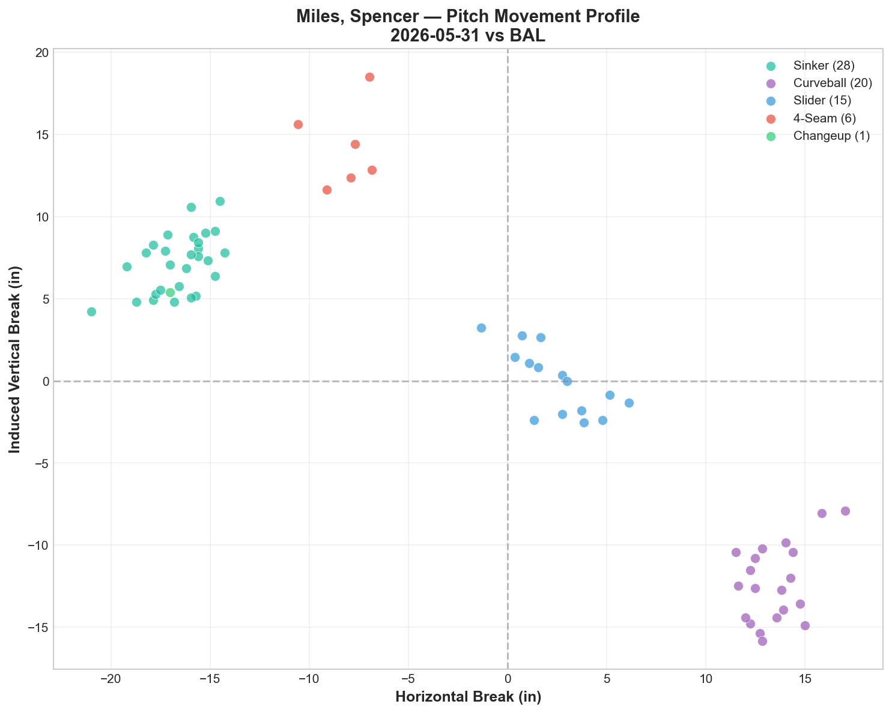
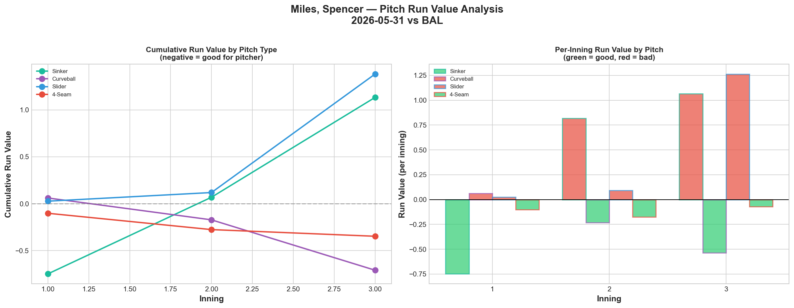
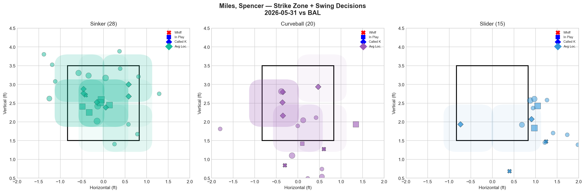
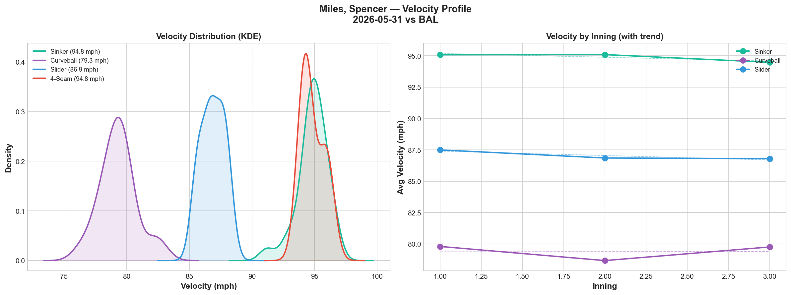
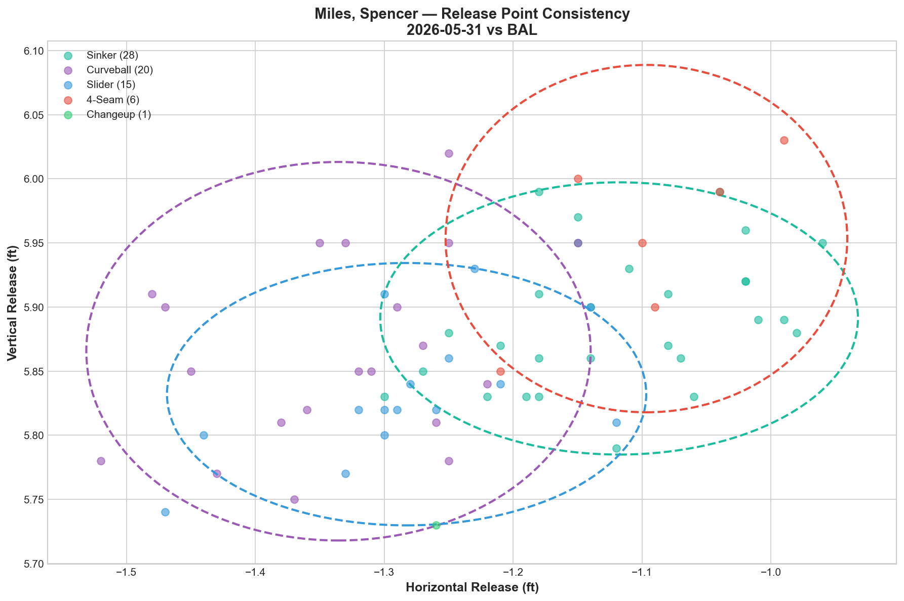
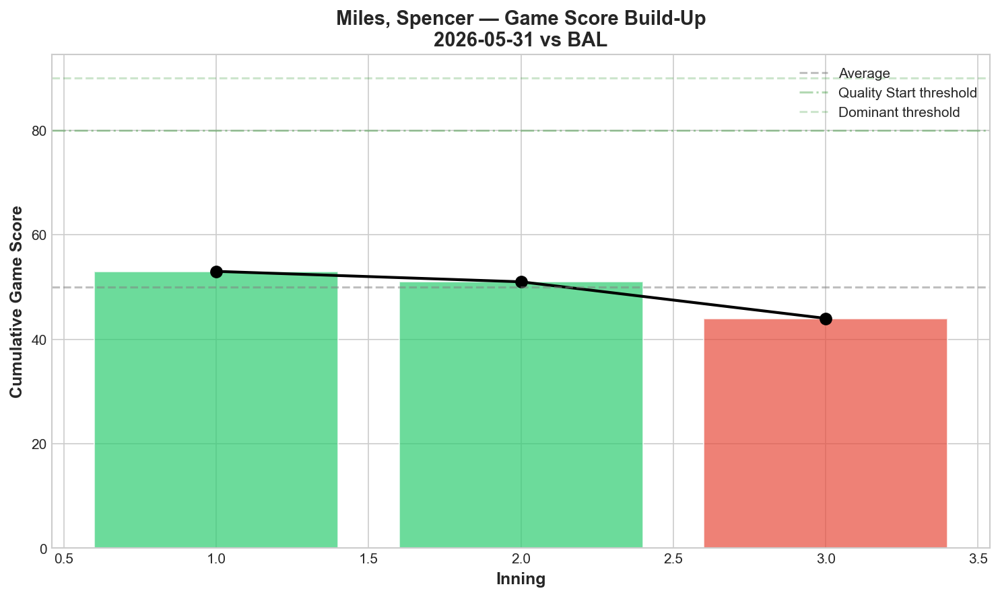
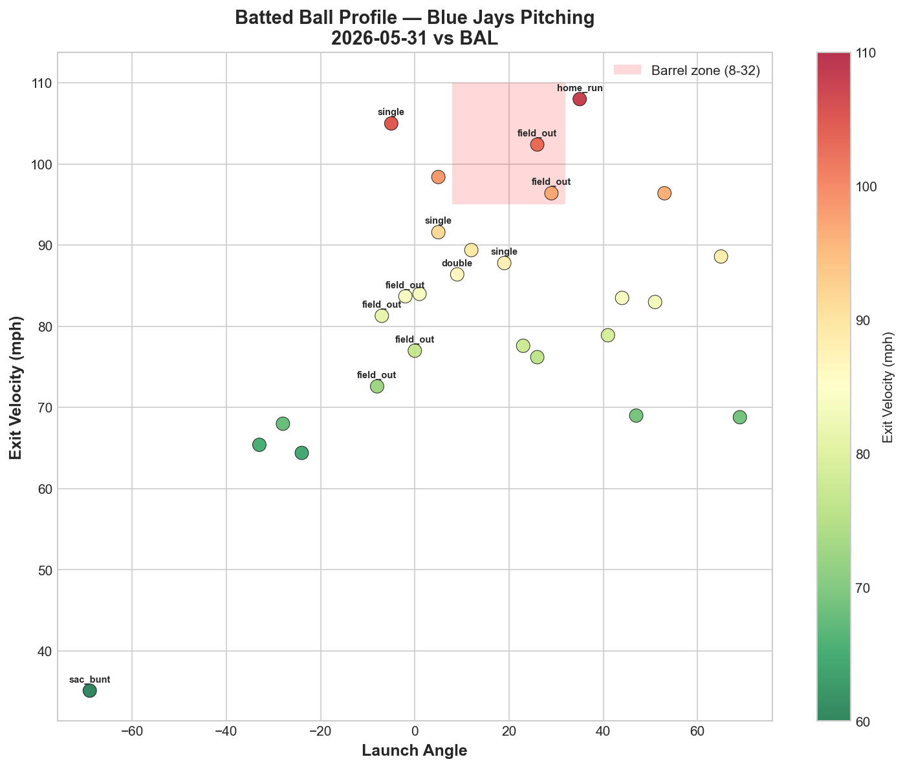
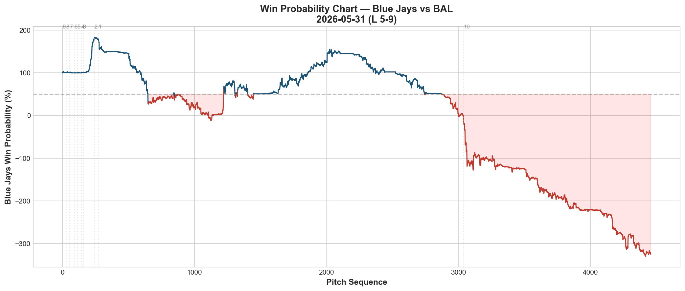
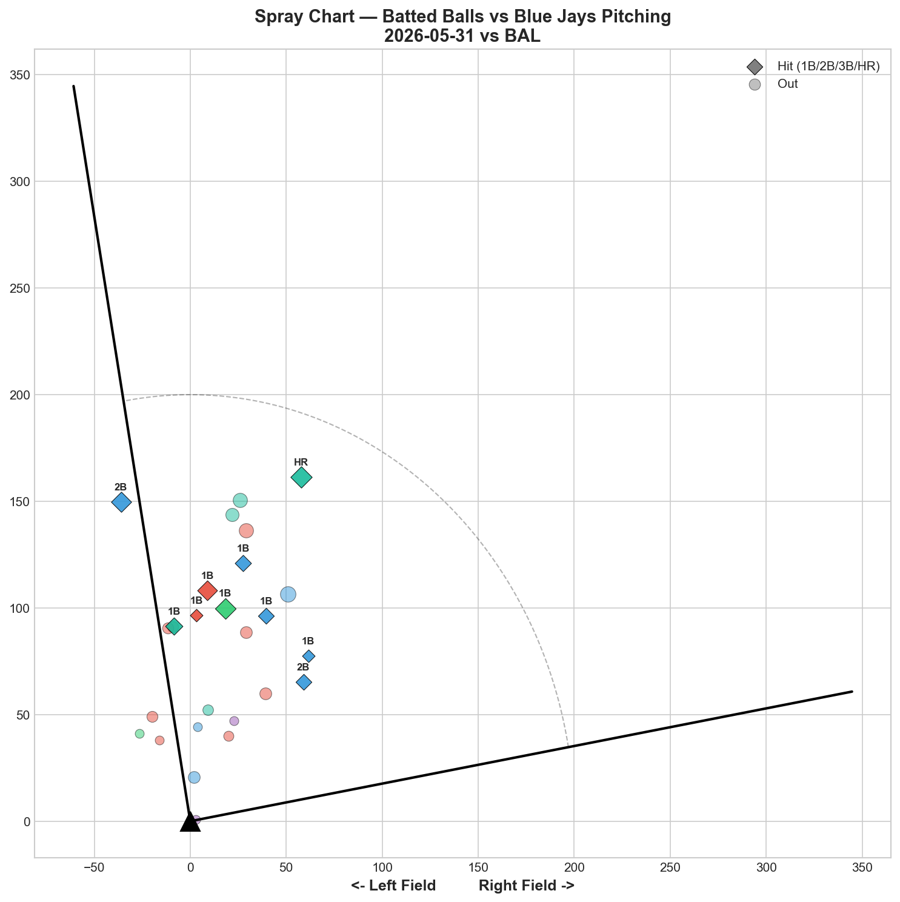

# 🏟️ Blue Jays Game Report v2.1
## 2026-05-31 | TOR @ BAL | L 5-9

---

## 📋 Game Overview

| | |
|---|---|
| **Date** | 2026-05-31 |
| **Matchup** | Toronto Blue Jays @ Baltimore Orioles |
| **Result** | **L 5-9** |
| **Starter** | Spencer Miles (70 pitches) |
| **Spotlight Pitcher** | None |
| **Season Record** | 29W-30L |

---

## 🔥 Key Storylines

### 1. Miles' Right-Handed Hitter Problem Is Now a Confirmed Weakness

Spencer Miles threw 27 pitches to right-handed hitters tonight and generated **0.0% whiff rate — zero swinging strikes.** Against lefties he was passable (11.6% whiff), but the RHH split is a fundamental issue. His curveball (79.3 mph) and sinker (94.8 mph) create a huge 15.5 mph speed differential that works against LHH, but RHH can sit on the sinker's arm-side run and time it. Until Miles develops a pitch that works against righties, his ceiling is capped.

### 2. Miles' Start vs His Bulk Outings — The Transition Isn't Working Yet

| Metric | 5/21 Bulk vs NYY | 5/26 Bulk vs MIA | 5/31 Start vs BAL |
|--------|-----------------|-----------------|-------------------|
| Pitches | 63 | 67 | 70 |
| K | 6 | 3 | 2 |
| CU Whiff% | 45.5% | 33.3% | 20.0% |
| SI Usage | 31.7% | 43.3% | 40.0% |
| Overall Whiff% | 22.9% | 15.2% | 12.7% |
| Game Score | — | — | 43 |

The curveball whiff rate has declined with each outing (45.5% → 33.3% → 20.0%). As a bulk pitcher entering mid-game against lineups seeing him for the first time, he was effective. As a starter facing the full order, hitters are adjusting to his curveball earlier in the game. This is the classic bulk-to-starter transition challenge.

### 3. The Orioles Series Ends 2-2 — Momentum Stalled

After winning the first two games in Baltimore (including reaching .500 and then above .500), the Jays dropped the last two. The pitching staff that had been carrying the team showed cracks: Yesavage walked 7, Hoffman's streak broke, and now Miles was hit around. The 8-3 hot streak has cooled to 9-5 over the last 14 games — still positive, but the margin for error is shrinking.

---

## ⚾ Starter Pitch Arsenal Analysis — Spencer Miles

### Pitch Arsenal Performance (70 pitches)

| Pitch | # | Usage | Velo | Whiff% | CSW% | Chase% | Grade |
|-------|---|-------|------|--------|------|--------|-------|
| Sinker | 28 | 40.0% | 94.8 | 8.3% | 25.0% | 14.3% | 🔴 D |
| Curveball | 20 | 28.6% | 79.3 | 20.0% | 30.0% | 50.0% | 🟢 B |
| Slider | 15 | 21.4% | 86.9 | 28.6% | 26.7% | 46.2% | 🟢 B |
| 4-Seam | 6 | 8.6% | 94.8 | 0.0% | 0.0% | 50.0% | 🔴 D |
| Changeup | 1 | 1.4% | 86.8 | 0.0% | 0.0% | 0.0% | 🔴 D |

The curveball and slider both graded B — respectable but below the A-grade curveball we saw in his bulk outings. The sinker (Grade D, 8.3% whiff) and 4-seam (Grade D, 0.0% whiff) continue to be liabilities. The consistent pattern across all three outings: **breaking balls work, fastballs don't.**

### Pitch Movement (inches)

| Pitch | H-Break | V-Break | Count |
|-------|---------|---------|-------|
| Sinker (SI) | -16.6 | 7.2 | 28 |
| Curveball (CU) | 13.5 | -12.3 | 20 |
| Slider (SL) | 2.5 | -0.1 | 15 |
| 4-Seam (FF) | -8.2 | 14.2 | 6 |

The sinker's -16.6 inches of horizontal break is extreme arm-side run — but without vertical drop, it stays in the zone and gets barreled.

### Pitch Tunneling Analysis

| Pair | Release Sim | Plate Sep | Tunnel | Velo Gap |
|------|-------------|-----------|--------|----------|
| **Curveball/Slider** | **0.8in** | **16.4in** | **🟢 21.9** | **7.5mph** |
| Sinker/4-Seam | 0.8in | 11.0in | 🟢 13.9 | 0.0mph |
| Sinker/Curveball | 2.6in | 35.8in | 🟢 13.6 | 15.5mph |
| Curveball/4-Seam | 3.1in | 34.2in | 🟢 11.2 | 15.5mph |
| Sinker/Slider | 2.1in | 20.4in | 🟢 9.7 | 8.0mph |

**🏆 Best Tunnel: Curveball/Slider (score: 21.9)** — 0.8in release similarity expanding to 16.4in plate separation. This pair continues to be his tunneling identity. The Sinker/Curveball pair shows a massive 35.8in plate separation — the widest we've recorded for any pitch pair — creating the extreme speed-break divergence that defines his arsenal.

### Pitch Run Value by Type

| Pitch | Total RV | Per Pitch | Pitches | Assessment |
|-------|----------|-----------|---------|------------|
| Curveball | -0.709 | -0.0354 | 20 | ✅ Best pitch |
| 4-Seam | -0.347 | -0.0578 | 6 | ✅ Effective (small sample) |
| Sinker | +1.133 | +0.0405 | 28 | 🔴 Costly |
| Slider | +1.382 | +0.0921 | 15 | 🔴 Worst pitch tonight |
| Changeup | +0.502 | +0.502 | 1 | 🔴 (1 pitch) |

- 🏆 **Most Effective:** Curveball (-0.0354 per pitch)
- ⚠️ **Least Effective:** Slider (+0.0921 per pitch)

The slider — usually his secondary weapon — was his worst pitch tonight at +1.382 RV. The sinker added another +1.133. Only the curveball (-0.709) provided value.

### Pitch Selection by Count

| Situation | Primary | Secondary | Notes |
|-----------|---------|-----------|-------|
| First Pitch (0-0) | Sinker 41.2% | Curveball 29.4% | Sinker-first approach |
| Ahead (0-1, 0-2, 1-2) | Curveball 38.7% | Slider 25.8% | Breaking balls ahead |
| Behind (1-0, 2-0, etc.) | **Sinker 66.7%** | Curveball 16.7% | Forced into sinkers |
| Even (1-1, 2-2) | Sinker 50.0% | Slider 25.0% | Sinker-heavy |
| Full Count (3-2) | Sinker 100% | — | All sinkers |

Same pattern as Corbin: **100% sinker on full counts, 66.7% sinker when behind.** The worst pitch gets the most usage in critical counts.

**Strikeout Pitches (2 K's):** CU 2 — only the curveball generated Ks.

### vs LHB/RHB Split

| Stand | Pitches | Avg Velo | Swinging Strikes | Whiff/Pitch |
|-------|---------|----------|------------------|-------------|
| L | 43 | 87.5 | 5 | 11.6% |
| R | 27 | 90.4 | **0** | **0.0%** |

**Zero swinging strikes in 27 pitches to RHH.** This is the defining limitation of Miles' current arsenal. Right-handed hitters can eliminate the curveball from their read and sit on the sinker/slider — neither of which generates swing-and-miss from the right side.

### Top Opposing Batters vs Miles

| Batter | Pitches | Hits | K | BB | Avg EV |
|--------|---------|------|---|-----|--------|
| Blaze Alexander | 15 | 0 | 0 | 1 | 78.3 |
| Samuel Basallo | 11 | 1 | 0 | 1 | 79.2 |
| Adley Rutschman | 10 | 0 | 0 | 1 | **102.4** |
| Colton Cowser | 9 | 1 | 0 | 0 | 85.8 |
| Pete Alonso | 7 | 2 | 0 | 0 | 91.9 |

**Rutschman** didn't get a hit but posted **102.4 mph average exit velocity** — he was barreling everything but hitting it at fielders. **Alonso** collected 2 hits in just 7 pitches at 91.9 mph EV.

### Velocity Profile

- **Sinker:** 95.1 → 94.5 mph (-0.6 mph)
- **Curveball:** 79.8 → 79.8 mph (0.0 mph)
- **Slider:** 87.5 → 86.8 mph (-0.7 mph)

Minor declines — curveball held perfectly steady. No significant fatigue in 70 pitches.

### Release Point / Game Score / Batted Ball

**Game Score: 43 (AVERAGE).** 2K, 6H, 0HR, 3BB on 70 pitches. The zero home runs allowed is a positive, but 6 hits and 3 walks in 70 pitches means too many baserunners.

| Metric | Value |
|--------|-------|
| Total BIP | 27 |
| Avg Exit Velo | 82.2 mph |
| Avg Launch Angle | 14.2° |
| Hard Hit (95+ mph) | 6/27 (22%) |

---

## 📊 Bullpen Detailed Analysis

| Pitcher | Pitches | Line | Key Pitch | Notes |
|---------|---------|------|-----------|-------|
| **Mason Fluharty** | 12 | **3K / 0BB / 0H / 0HR** | ST 50% whiff 🟢A | **Best outing of the season** |
| **Yariel Rodríguez** | 17 | 0K / 0BB / 2H / 0HR | All pitches 🔴D | Regression after A/A night |
| **Hayden Juenger** | 36 | 0K / 2BB / 2H / 0HR | FF 11.1% 🟡C | New arm — 36 pitches, command issues |
| **Adam Macko** | 19 | 1K / 0BB / 1H / 0HR | KC 100% whiff 🟢A, FF 20% 🟢B | K-Curve keeps flashing |

### Bullpen Notes

- **Fluharty** delivered his best outing: **3K, 0H, 0BB in 12 pitches.** Sweeper at 50% whiff and 57.1% CSW. When his sweeper is on, he's a genuine weapon. The cutter (0% whiff) remains the drag — his ceiling is determined by how much he leans on the sweeper.
- **Rodríguez** regressed to all-D grades after posting A/A two nights ago. The inconsistency is the challenge — he can flash elite stuff but can't sustain it across consecutive outings yet.
- **Juenger** made his first notable appearance: 36 pitches, the most by any reliever tonight. 4-seam at 94.4 mph with 11.1% whiff (Grade C). Slider and changeup both graded D. A depth arm for now.
- **Macko's K-Curve** continues to flash: 100% whiff rate on 2 pitches, 100% CSW. His fastball also showed B-grade (20% whiff). Across 8 appearances, the K-Curve has been his most reliable swing-and-miss pitch.

---

## 📈 Win Probability Analysis

### Key WPA Moments

| Inning | Event | Impact |
|--------|-------|--------|
| 4 | Imai — home_run | 📈 Jays scored |
| 7 | Anderson — home_run | 📈 Jays rally |
| 7 | Anderson — single | 📈 Extended rally |
| 7 | Herrin — single | 📉 Orioles responded |
| 8 | Castillo — sac_bunt | 📉 Orioles advanced |
| 10 | Castillo — walk-off | 📉 Game ended |

---

## 📊 Spray Chart & Batted Ball Summary

| Metric | Value |
|--------|-------|
| Total batted balls tracked | 27 |
| Hits | 10 (37%) |
| Pull | 4 (15%) |
| Center | 23 (85%) |
| Oppo | 0 (0%) |

37% hit rate with zero opposite-field contact — hitters were timing Miles' sinker and pulling/centering it.

---

## 🎯 Analytical Takeaways

1. **Miles' RHH Problem Is the Ceiling Cap** — 0.0% whiff rate against 27 right-handed pitches. His curveball works against lefties; his sinker and slider don't miss bats against righties. Until he develops a RHH weapon, his role is limited to LHH-heavy matchups or bulk duty where he can be pulled before the lineup turns over.

2. **The Bulk-to-Starter Transition Is Regressing** — Curveball whiff rate: 45.5% (bulk vs NYY) → 33.3% (bulk vs MIA) → 20.0% (start vs BAL). Hitters who see him from the first inning have more time to adjust to his curveball timing. Miles may be most effective in the Fisher→Miles opener/bulk combination rather than as a true starter.

3. **Fluharty's Sweeper Outing Shows His Upside** — 3K, 0H in 12 pitches. When he throws the sweeper (50% whiff), he's dominant. When he throws the cutter (0% whiff), he's hittable. The development path is clear: become a sweeper-first pitcher.

4. **Rodríguez's Inconsistency Persists** — A/A grades (5/30) → all D grades (5/31). He can't string together consecutive good outings. The stuff flashes but the consistency isn't there for a role beyond low-leverage.

5. **Orioles Series Split: 2-2** — Won the first two (reached .500 and above), lost the last two. The series exposed pitching vulnerabilities: Yesavage's command (7 BB), Hoffman's cold slider, and Miles' RHH gap. Still, splitting on the road in Baltimore is a respectable result.

6. **Game Classification: Starter Limitation Loss** — Miles' 0% RHH whiff rate and the bullpen's inability to hold the deficit made this a game where the pitching depth ran thin. The Jays need their injured starters back to sustain this pace.

---

*Report generated from Statcast data via pybaseball. All pitch metrics sourced from Baseball Savant.*
