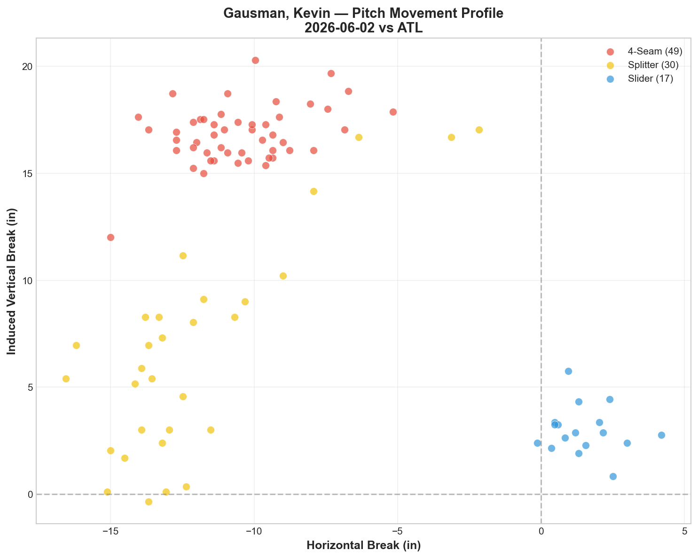
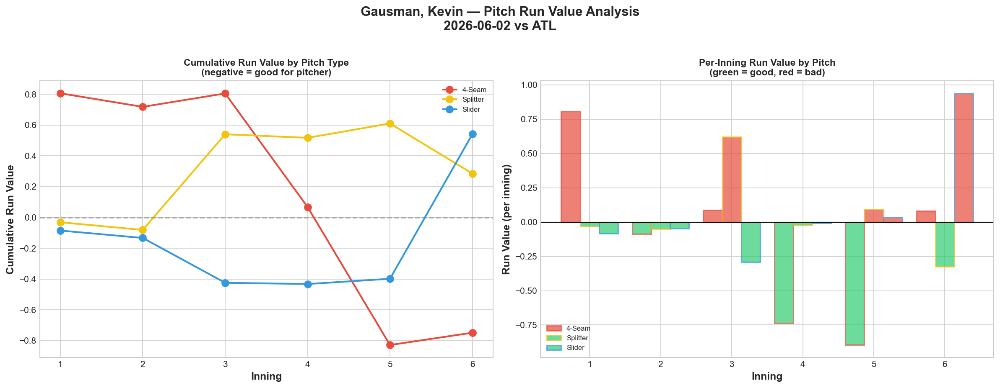
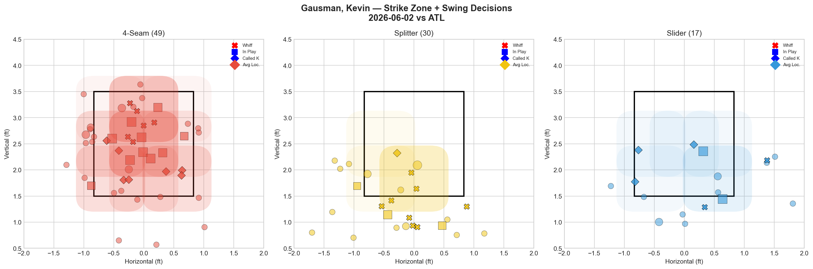
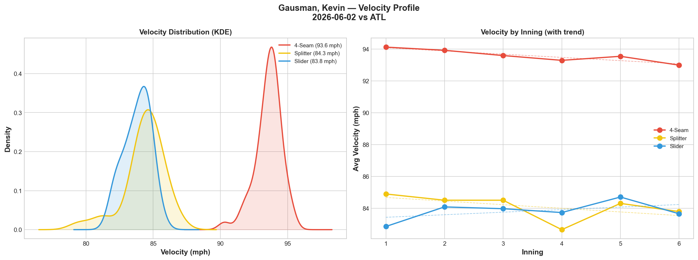
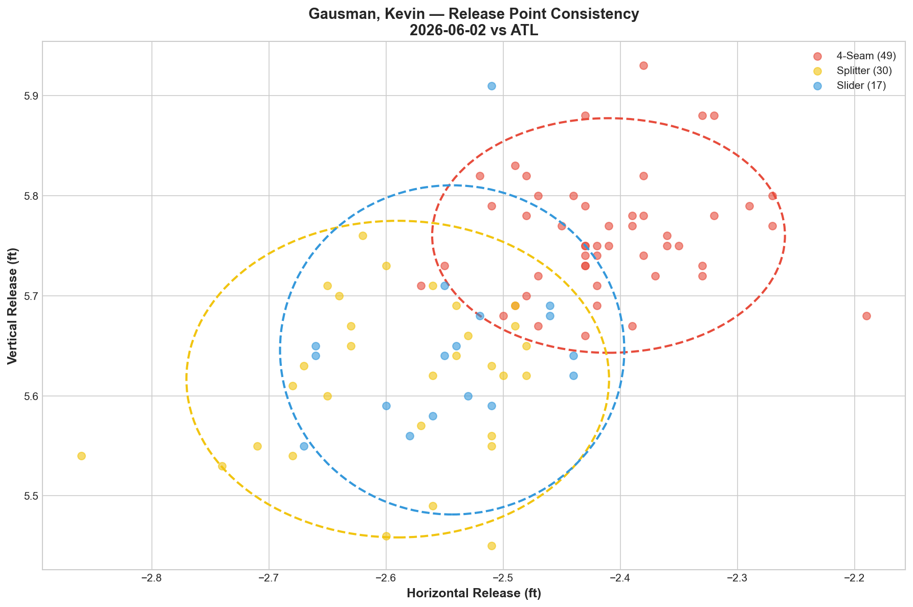
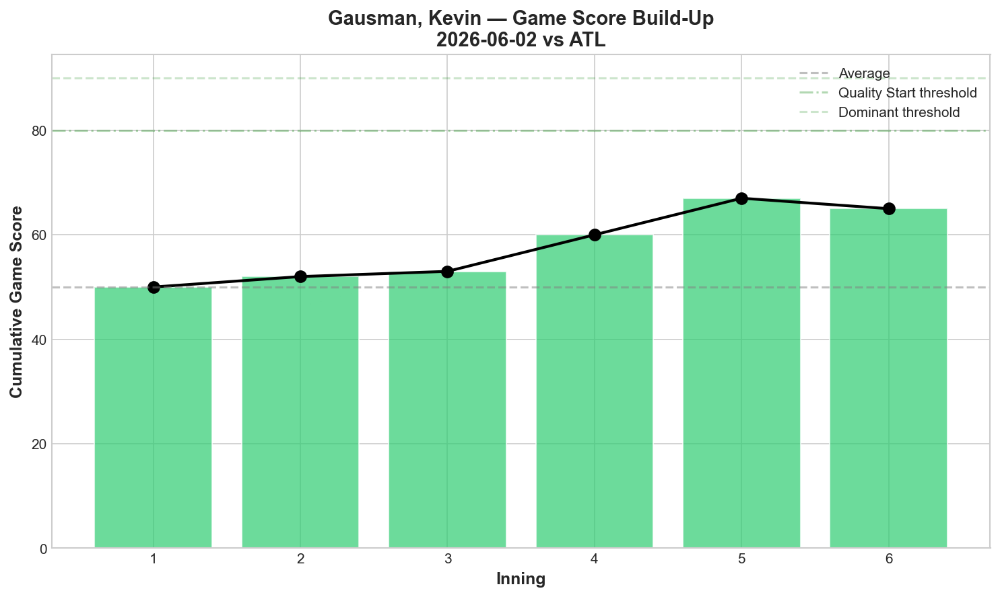
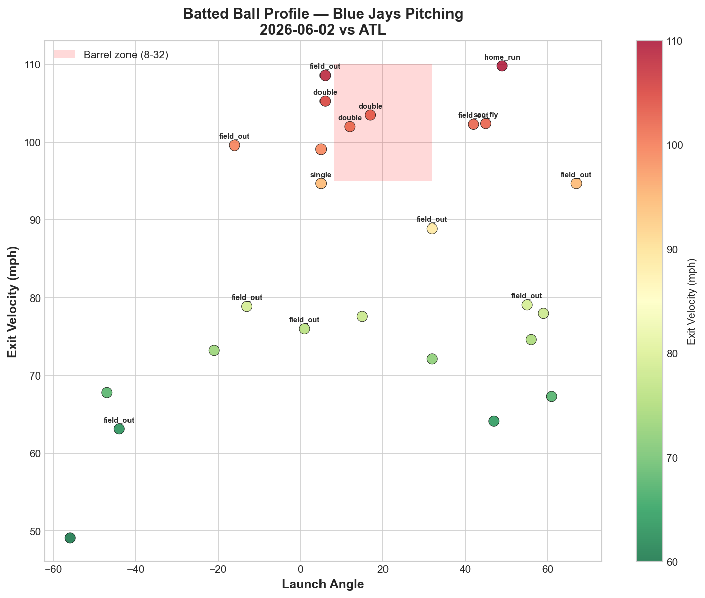
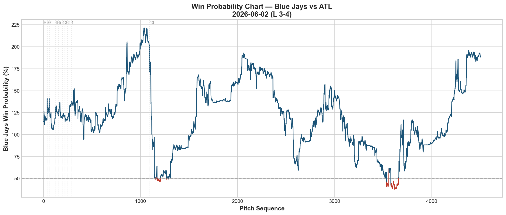
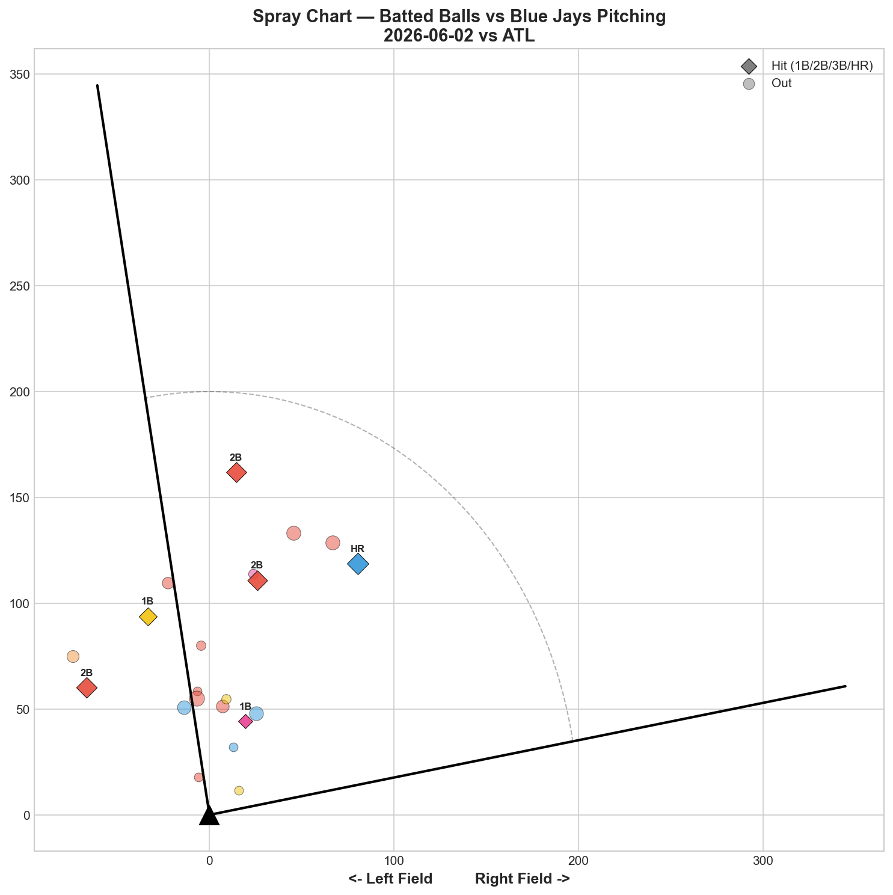

# 🏟️ Blue Jays Game Report v2.1
## 2026-06-02 | TOR @ ATL | L 3-4

---

## 📋 Game Overview

| | |
|---|---|
| **Date** | 2026-06-02 |
| **Matchup** | Toronto Blue Jays @ Atlanta Braves |
| **Result** | **L 3-4** |
| **Starter** | Kevin Gausman (96 pitches) |
| **Spotlight Pitcher** | None |
| **Season Record** | 29W-31L |

---

## 🔥 Key Storylines

### 1. Gausman's Splitter Bounced Back — 56.2% Whiff, Grade A

After the 5/27 disaster (splitter +1.283 RV, -4.9 mph velocity fade), Gausman's splitter returned to form tonight: **56.2% whiff rate, 33.3% CSW, Grade A.** This is the Gausman the Blue Jays need — his splitter is the engine of his arsenal, and when it's generating swings-and-misses at this rate, he's an ace. The velocity concern from 5/27 appears to have been a one-start anomaly.

### 2. The Fastball Was a Legitimate Weapon Tonight — 6 of 8 K's

Gausman's 4-seam posted **26.1% whiff rate (Grade B)** — a massive upgrade from 5/27's 3.1% and even 5/22's 6.4%. More importantly, **6 of his 8 strikeouts came on the fastball.** When both the fastball and splitter are working simultaneously, Gausman becomes nearly unhittable. Tonight both were on — and he still lost, which speaks to the quality of the Braves lineup.

### 3. A 1-Run Loss to the Best Team in Baseball Is Not a Failure

Atlanta is 40-20 with MLB's best pitching. Gausman threw 96 pitches with 8K, Game Score 62, and held the Braves to a 1-run margin. The loss came from the margins — a couple of hard-hit balls (36% hard-hit rate, 85.3 mph avg EV) and the Braves' ability to convert contact into runs. This is what competing with the best looks like.

---

## ⚾ Starter Pitch Arsenal Analysis — Kevin Gausman

### Pitch Arsenal Performance (96 pitches)

| Pitch | # | Usage | Velo | Whiff% | CSW% | Chase% | Grade |
|-------|---|-------|------|--------|------|--------|-------|
| 4-Seam | 49 | 51.0% | 93.6 | 26.1% | 26.5% | 20.0% | 🟢 B |
| Splitter | 30 | 31.2% | 84.3 | 56.2% | 33.3% | 45.8% | 🟢 A |
| Slider | 17 | 17.7% | 83.8 | 28.6% | 29.4% | 45.5% | 🟢 B |

**All three pitches graded B or better** — the first time in any Gausman start we've tracked where every pitch was effective. This was his most complete arsenal performance of the reporting period.

### Gausman Three-Start Trend

| Metric | 5/22 vs PIT (W 6-2) | 5/27 vs MIA (W 2-1) | 6/2 vs ATL (L 3-4) |
|--------|---------------------|---------------------|---------------------|
| FF Whiff% | 6.4% (D) | 3.1% (D) | **26.1% (B)** |
| FS Whiff% | 38.1% (A) | 27.3% (B) | **56.2% (A)** |
| SL Whiff% | 75.0% (A) | 0.0% (D) | **28.6% (B)** |
| K | 7 | 5 | **8** |
| Game Score | 68 | 53 | **62** |

Tonight was Gausman's best all-around start: highest K total (8), highest fastball whiff (26.1%), and strongest splitter whiff (56.2%). The irony is that he lost — against a 40-20 team, elite pitching doesn't guarantee wins. But the underlying metrics are his strongest yet.

### Pitch Movement (inches)

| Pitch | H-Break | V-Break | Count |
|-------|---------|---------|-------|
| 4-Seam (FF) | -10.5 | 16.8 | 49 |
| Splitter (FS) | -12.1 | 6.7 | 30 |
| Slider (SL) | 1.5 | 3.0 | 17 |

### Pitch Tunneling Analysis

| Pair | Release Sim | Plate Sep | Tunnel | Velo Gap |
|------|-------------|-----------|--------|----------|
| **Splitter/Slider** | **0.7in** | **14.0in** | **🟢 21.3** | **0.5mph** |
| 4-Seam/Slider | 2.1in | 18.3in | 🟢 8.7 | 9.8mph |
| 4-Seam/Splitter | 2.8in | 10.3in | 🟢 3.7 | 9.2mph |

**🏆 Best Tunnel: Splitter/Slider (score: 21.3)** — 0.7in release similarity, 14.0in plate separation, and only **0.5 mph velocity gap.** Same speed, same release point, opposite movement. This is the highest Gausman tunnel score we've recorded — even better than the 20.6 from 5/27 and the 17.0 from 5/22.

The FS/SL tunnel is Gausman's identity combination. When both pitches are working (tonight), the deception is elite. The 0.5 mph gap means hitters literally cannot distinguish between the two pitches until after the point of no return.

### Pitch Run Value by Type

| Pitch | Total RV | Per Pitch | Pitches | Assessment |
|-------|----------|-----------|---------|------------|
| 4-Seam | -0.748 | -0.0153 | 49 | ✅ Effective |
| Splitter | +0.285 | +0.0095 | 30 | ⚠️ Marginal despite 56% whiff |
| Slider | +0.541 | +0.0318 | 17 | 🔴 Leak |

The splitter posted positive RV (+0.285) **despite 56.2% whiff rate** — a repeat of a pattern we've seen before where high whiff rates don't translate directly into run prevention. The whiffs came in low-leverage counts; the damage came when the splitter missed its spot in high-leverage situations. The slider (+0.541) was effective at generating chases (45.5%) but gave up value on the contact that did occur.

- 🏆 **Most Effective:** 4-Seam (-0.0153 per pitch)
- ⚠️ **Least Effective:** Slider (+0.0318 per pitch)

### Pitch Selection by Count

| Situation | Primary | Secondary | Notes |
|-----------|---------|-----------|-------|
| First Pitch (0-0) | 4-Seam 48.0% | Slider 32.0% | Heavy slider usage first pitch |
| Ahead | 4-Seam 45.5% | Splitter 36.4% | Balanced FF/FS ahead |
| Behind | 4-Seam 60.9% | Splitter 26.1% | Fastball-heavy behind |
| Even | **Splitter 70.0%** | 4-Seam 30.0% | Splitter-dominant in neutral |
| Full Count (3-2) | 4-Seam 100% | — | All fastballs |

**Strikeout Pitches (8 K's):** FF 6, SL 1, FS 1 — the fastball was the primary K pitch tonight, a shift from his typical splitter-heavy K approach.

### vs LHB/RHB Split

| Stand | Pitches | Avg Velo | Swinging Strikes | Whiff/Pitch |
|-------|---------|----------|------------------|-------------|
| L | 62 | 89.1 | 9 | 14.5% |
| R | 34 | 88.7 | 8 | **23.5%** |

23.5% whiff rate against RHH — his most effective right-handed split we've tracked. The splitter's arm-side fade was devastating to righties tonight.

### Top Opposing Batters vs Gausman

| Batter | Pitches | Hits | K | BB | Avg EV |
|--------|---------|------|---|-----|--------|
| Matt Olson | 14 | 2 | 0 | 0 | **98.0** |
| Ronald Acuña Jr. | 14 | 0 | 1 | 1 | **99.6** |
| Mike Yastrzemski | 12 | 1 | 2 | 0 | 84.7 |
| Austin Riley | 12 | 0 | 1 | 0 | 83.7 |
| Dominic Smith | 11 | 0 | 1 | 0 | 69.8 |

**Acuña:** 0-for with 1K but **99.6 mph average exit velocity** — when he made contact, it was violent. Gausman survived but Acuña was squaring him up. **Olson** collected 2 hits at 98.0 mph EV — the most dangerous at-bat of the night. **Riley** was neutralized (0 hits, 1K). **Smith** was completely overmatched (69.8 mph EV).

### Velocity Profile

- **4-Seam:** 94.1 → 93.0 mph (-1.1 mph)
- **Splitter:** 84.9 → 83.8 mph (-1.1 mph)
- **Slider:** 82.8 → 83.6 mph (+0.8 mph)

Both fastball and splitter dropped 1.1 mph — proportional decline suggesting normal late-outing fatigue, not the 4.9 mph splitter collapse from 5/27. The parallel decline indicates consistent mechanics throughout.

### Release Point Consistency

| Pitch | H-Spread | V-Spread | Total | Rating |
|-------|----------|----------|-------|--------|
| 4-Seam | 0.9in | 0.7in | 1.1in | 🟢 Tight |
| Splitter | 1.1in | 0.9in | 1.4in | 🟢 Tight |
| Slider | 0.9in | 1.0in | 1.3in | 🟢 Tight |

### Game Score

**Final: 62 (QUALITY).** 8K, 5H, 1HR, 2BB on 96 pitches. A quality start against the best team in baseball.

### Batted Ball Profile

| Metric | Value |
|--------|-------|
| Total BIP | 25 |
| Avg Exit Velo | 85.3 mph |
| Avg Launch Angle | 16.6° |
| Hard Hit (95+ mph) | 9/25 (**36%**) |

**36% hard-hit rate is the highest in any Gausman start we've tracked.** This is the Braves' lineup quality — even when Gausman is pitching well (8K, 62 GS), the contact they make is louder than any other lineup the Jays have faced. 85.3 mph average EV and 36% hard-hit against a pitcher with 56% splitter whiff — that's an elite offense.

---

## 📊 Bullpen Detailed Analysis

| Pitcher | Pitches | Line | Key Pitch | Notes |
|---------|---------|------|-----------|-------|
| **Braydon Fisher** | 15 | 1K / 0BB / 0H / 0HR | SL 60% whiff 🟢A | **6 consecutive 0H appearances** |
| **Mason Fluharty** | 14 | 0K / 0BB / 1H / 0HR | ST 20% whiff 🟢B | Sweeper-first (64%) approach |
| **Connor Seabold** | 3 | 0K / 0BB / 0H / 0HR | SL 33.3% whiff 🟢A | Just 3 pitches — all sliders |

### Bullpen Notes

- **Fisher** continues his historic hitless streak: **6 consecutive appearances with 0 hits allowed.** His slider at 60% whiff and 89.9 mph is becoming one of the most reliable pitches in this bullpen. He's now been an opener, bridge, and closer — and excelled in all three.
- **Fluharty** went sweeper-first (64.3% usage) — a positive development. The sweeper (20% whiff, 44.4% CSW, Grade B) was effective through called strikes. The cutter (0% whiff, Grade D) remains the weak pitch. He's learning to lean on his strength.
- **Seabold** threw only 3 pitches — all sliders, 33.3% whiff, Grade A. Tiny sample but a clean appearance.

---

## 📈 Win Probability Analysis

### Key WPA Moments

| Inning | Event | Impact |
|--------|-------|--------|
| 5 | Mikolas — home_run | 📉 Braves took lead (WP 187.9%) |
| 6 | Burrows — home_run | 📉 Extended lead (WP 151.8%) |
| 7 | Eovaldi — double | 📈 Jays rallied |
| 8 | Klein — GIDP | 📉 Rally killed (WP 139.4%) |
| 9 | Erceg — home_run | 📈 Jays pulled close |
| 10 | Schreiber — single | 📈 Jays threatened late |

A game that swung back and forth — the Jays kept fighting back but couldn't complete the comeback against Atlanta's bullpen.

---

## 📊 Spray Chart & Batted Ball Summary

| Metric | Value |
|--------|-------|
| Total batted balls tracked | 21 |
| Hits | 6 (29%) |
| Pull | 3 (14%) |
| Center | 16 (76%) |
| Oppo | 2 (10%) |

---

## 🎯 Analytical Takeaways

1. **Gausman's Best Arsenal Outing — In a Loss** — FF 26.1% whiff (B), FS 56.2% whiff (A), SL 28.6% whiff (B). All three pitches graded B or better for the first time. 8K in 96 pitches. The splitter's 5/27 velocity fade was a one-off. Against the best lineup in baseball, this was an ace-level performance that simply didn't get enough run support.

2. **The Splitter/Slider Tunnel Hit 21.3 — New Gausman Record** — 0.7in release similarity, 0.5 mph velocity gap. These two pitches are literally indistinguishable at release. This tunnel is what makes Gausman elite — and tonight it was the sharpest it's ever been.

3. **Acuña and Olson Are a Different Level** — Combined 28 pitches, 2 hits, 98.8 mph combined avg EV. Even when Gausman was at his best, these two were squaring him up. Acuña's 99.6 mph EV on an 0-for night means he was hitting the ball violently — BABIP just didn't cooperate. Olson converted his hard contact into 2 hits.

4. **36% Hard-Hit Rate Against Elite Pitching** — This is the Braves' lineup in one number. Gausman had 56% splitter whiff and 8K, and the Braves still posted the highest hard-hit rate against him all season. Quality of competition matters.

5. **Fisher's 0H Streak Reaches 6** — Still hasn't allowed a hit across his last 6 appearances (opener, bridge, closer roles). His slider at 60% whiff tonight adds to a body of work that's becoming impossible to ignore for high-leverage deployment.

6. **Game Classification: Quality Loss** — Gausman pitched well enough to win against almost any other team. The 3-4 final against a 40-20 club is not a disappointing result — it's confirmation that the Blue Jays can compete at the highest level. The gap is razor-thin.

---

*Report generated from Statcast data via pybaseball. All pitch metrics sourced from Baseball Savant.*
