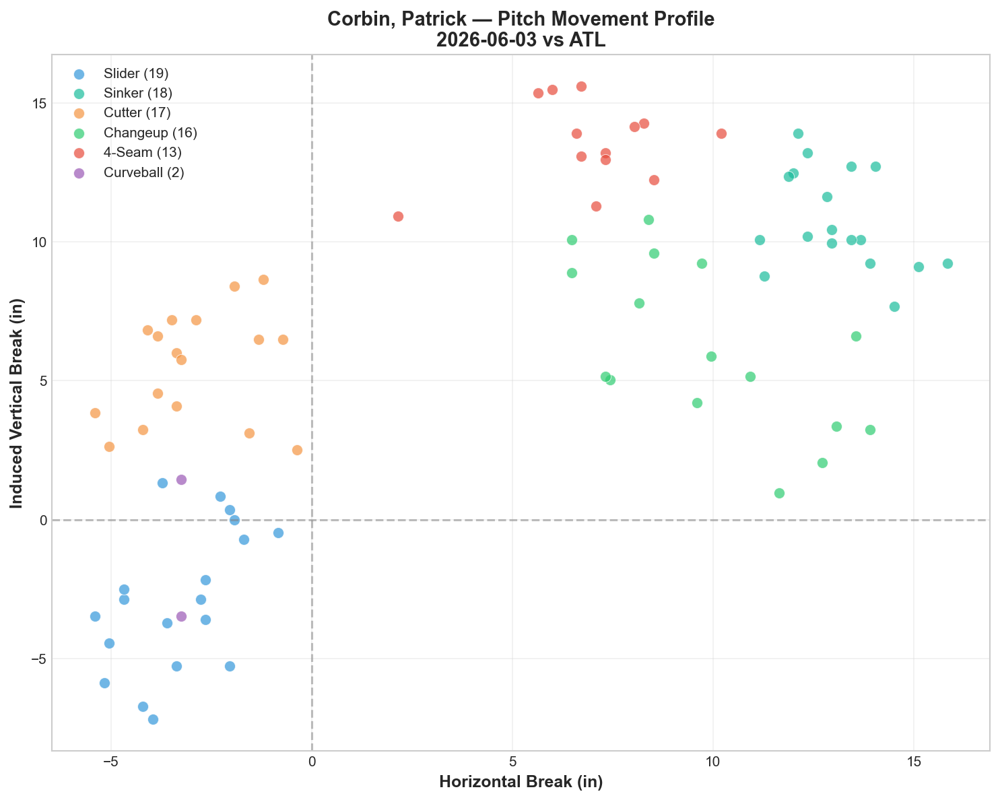
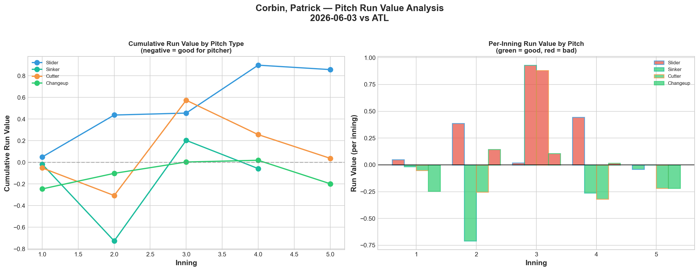
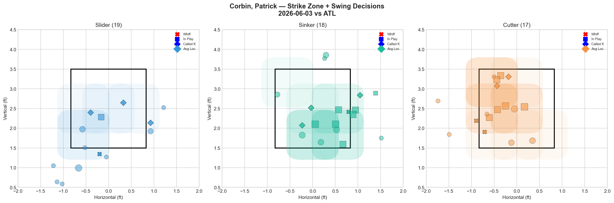
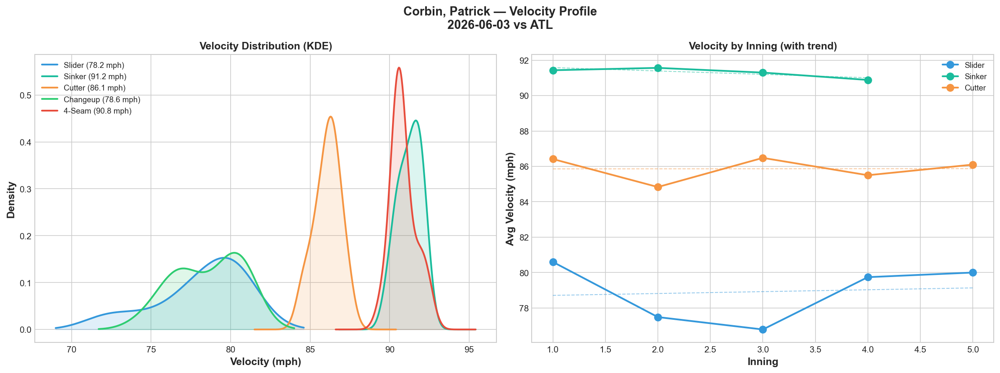
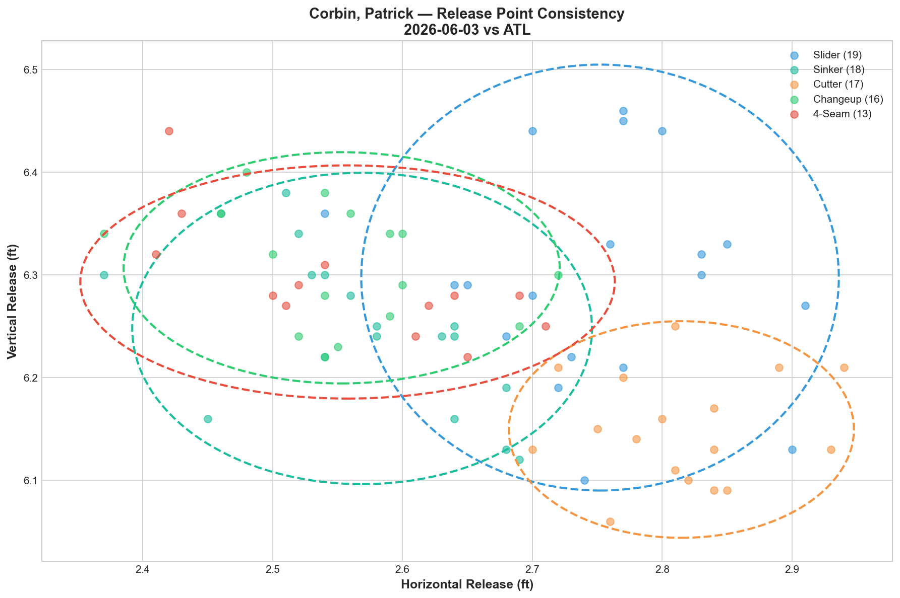
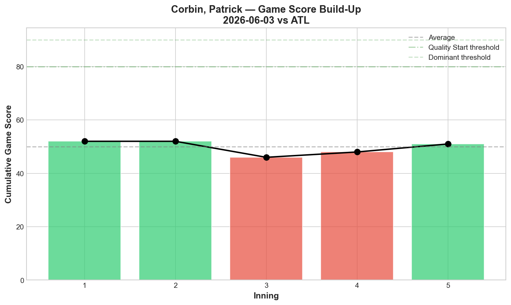
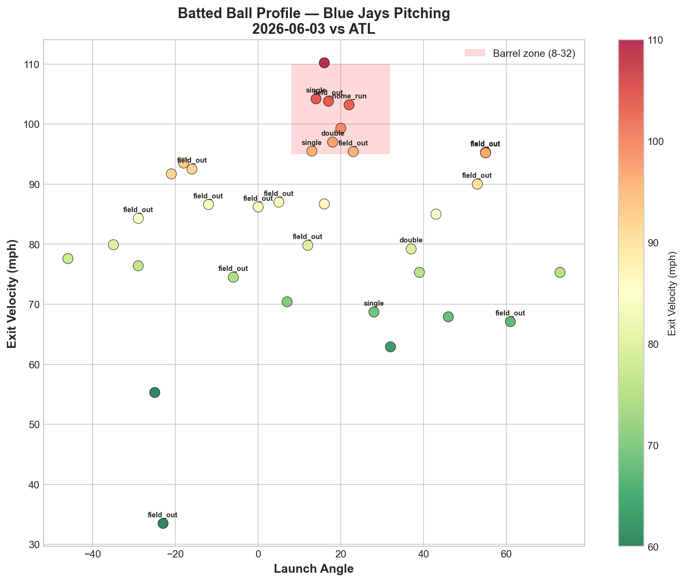
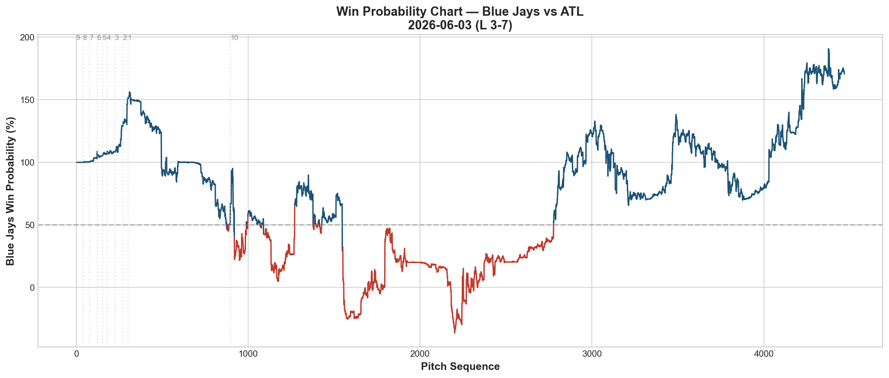
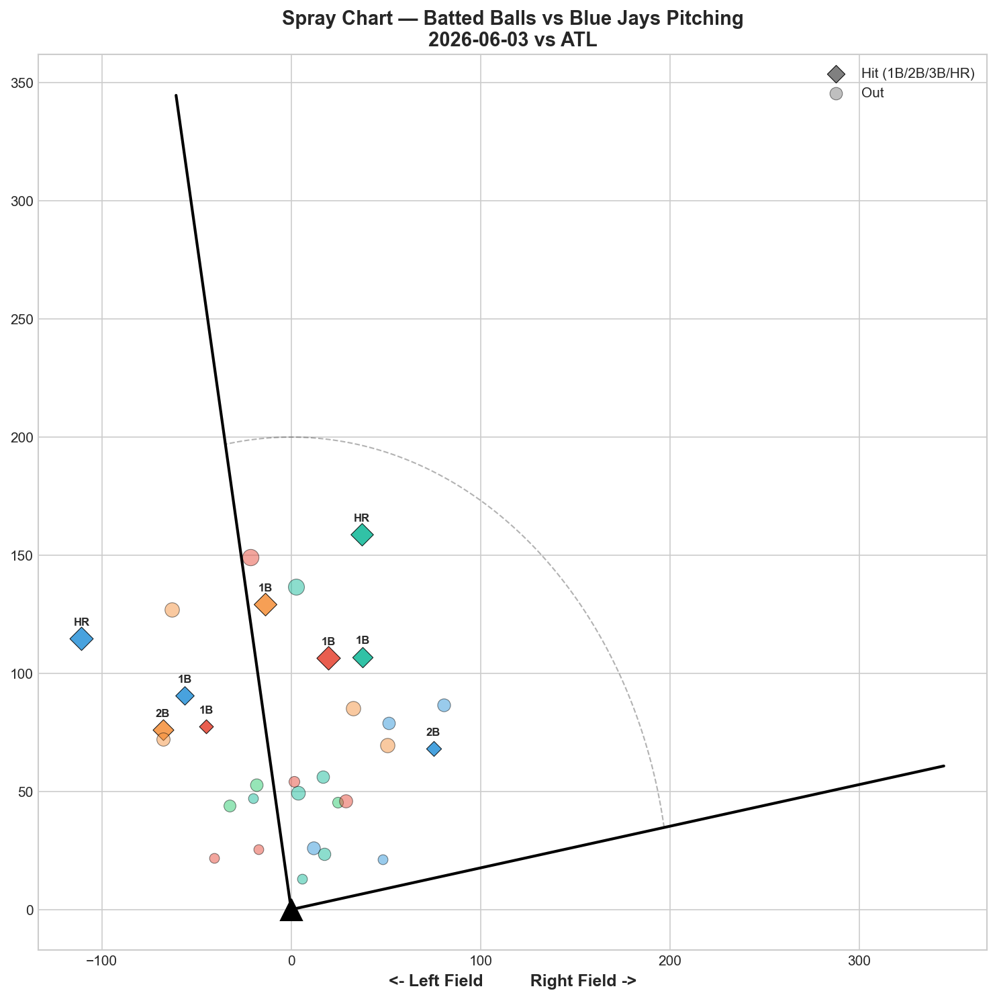

# 🏟️ Blue Jays Game Report v2.1
## 2026-06-03 | TOR @ ATL | L 3-7

---

## 📋 Game Overview

| | |
|---|---|
| **Date** | 2026-06-03 |
| **Matchup** | Toronto Blue Jays @ Atlanta Braves |
| **Result** | **L 3-7** |
| **Starter** | Patrick Corbin (85 pitches) |
| **Spotlight Pitcher** | None |
| **Season Record** | 29W-32L |

---

## 🔥 Key Storylines

### 1. Corbin's Sinker Finally Stopped Bleeding — But Everything Else Fell Apart

For the first time in four starts, Corbin's sinker posted **negative Run Value (-0.058).** After accumulating +4.853 RV across three straight starts (5/18, 5/23, 5/28), the sinker was actually neutral-to-effective tonight. The fix? Usage dropped from 35% (5/28) to 21.2% — Corbin appears to have heard the message about reducing sinker reliance.

But the slider, his best pitch in recent starts, regressed: **+0.857 RV (worst pitch tonight).** And the changeup, which was dominant on 5/28 (-0.090 → tonight -0.198), became the only effective weapon. The entire arsenal shifted rather than improved — one pitch got better, another got worse.

### 2. Only 1 Strikeout in 85 Pitches — A Contact Management Failure

Corbin recorded just **1 strikeout** tonight — his lowest K total in any start we've tracked. Whiff rates were rock-bottom: **5.6% vs LHH, 4.5% vs RHH.** The Braves simply weren't swinging and missing at anything. With 6 pitch types deployed and none generating consistent swing-and-miss, Corbin became entirely dependent on contact quality and defensive positioning.

### 3. The Braves Are Exposing the Pitching Staff's Ceiling

Two games against Atlanta: Gausman threw his best arsenal outing (8K, all pitches B+) and lost 3-4. Corbin spread across 6 pitches and lost 3-7. The Braves' 29% hit rate and 83.6 mph avg EV don't look devastating — but their ability to sequence pressure, work counts, and convert opportunities is what makes a 40-20 team different. This is the gap the Jays need to close.

---

## ⚾ Starter Pitch Arsenal Analysis — Patrick Corbin

### Pitch Arsenal Performance (85 pitches)

| Pitch | # | Usage | Velo | Whiff% | CSW% | Chase% | Grade |
|-------|---|-------|------|--------|------|--------|-------|
| Slider | 19 | 22.4% | 78.2 | 16.7% | 21.1% | 21.4% | 🟡 C |
| Sinker | 18 | 21.2% | 91.2 | 7.7% | 22.2% | 57.1% | 🔴 D |
| Cutter | 17 | 20.0% | 86.1 | 18.2% | 23.5% | 33.3% | 🟡 C |
| Changeup | 16 | 18.8% | 78.6 | 0.0% | 0.0% | 25.0% | 🔴 D |
| 4-Seam | 13 | 15.3% | 90.8 | 0.0% | 15.4% | 14.3% | 🔴 D |
| Curveball | 2 | 2.4% | 67.9 | 0.0% | 100.0% | 0.0% | 🔴 D |

Six pitch types, three graded D, two graded C — no A or B grades. The most balanced usage distribution we've seen from Corbin (no pitch above 22.4%), but balance without effectiveness is just unpredictability without deception.

### The Corbin Sinker Story — Four-Start Arc

| Start | SI Usage | SI RV | SL RV | CH RV | Best Pitch |
|-------|----------|-------|-------|-------|------------|
| 5/18 vs NYY | — | +1.733 | — | — | — |
| 5/23 vs PIT | 25.0% | +1.486 | -1.517 | -1.079 | Slider |
| 5/28 vs BAL | 35.0% | +1.634 | -1.509 | -0.090 | Slider |
| **6/3 vs ATL** | **21.2%** | **-0.058** | **+0.857** | **-0.198** | **Changeup** |
| **Total** | — | **+4.795** | — | — | — |

The sinker usage dropped from 35% to 21.2% — and for the first time, it didn't hemorrhage run value. But the slider flipped: from -1.509/-1.517 in the previous two starts to +0.857 tonight. The changeup has quietly been the most consistent pitch across the stretch, posting negative RV in three of four starts.

**Updated Recommendation:** The changeup (-0.198 tonight, -1.079 on 5/23) may be Corbin's true primary weapon — not the slider. A CH/SL/FC primary arsenal with the sinker at under 15% usage could be the optimization path.

### Pitch Movement (inches)

| Pitch | H-Break | V-Break | Count |
|-------|---------|---------|-------|
| Slider (SL) | -3.3 | -2.9 | 19 |
| Sinker (SI) | 13.1 | 10.8 | 18 |
| Cutter (FC) | -2.9 | 5.5 | 17 |
| Changeup (CH) | 9.9 | 6.1 | 16 |
| 4-Seam (FF) | 7.0 | 13.6 | 13 |
| Curveball (CU) | -3.2 | -1.0 | 2 |

### Pitch Tunneling Analysis

| Pair | Release Sim | Plate Sep | Tunnel | Velo Gap |
|------|-------------|-----------|--------|----------|
| **Changeup/4-Seam** | **0.2in** | **8.0in** | **🟢 45.8** | **12.3mph** |
| Sinker/4-Seam | 0.6in | 6.7in | 🟢 12.0 | 0.4mph |
| Slider/Sinker | 2.3in | 21.3in | 🟢 9.4 | 13.1mph |
| Slider/4-Seam | 2.3in | 19.4in | 🟢 8.3 | 12.7mph |
| Sinker/Changeup | 0.7in | 5.7in | 🟢 7.7 | 12.7mph |

**🏆 Best Tunnel: Changeup/4-Seam (score: 45.8)** — 0.2in release similarity with 12.3 mph speed gap. This is the highest single-pair tunnel score in our report history — the changeup and fastball came from virtually the same release point with dramatically different speeds. This pair should be the foundation of Corbin's sequencing strategy.

### Pitch Run Value by Type

| Pitch | Total RV | Per Pitch | Pitches | Assessment |
|-------|----------|-----------|---------|------------|
| Changeup | -0.198 | -0.0124 | 16 | ✅ Most effective |
| Curveball | -0.086 | -0.043 | 2 | ✅ (tiny sample) |
| Sinker | -0.058 | -0.0032 | 18 | — Neutral (first time!) |
| Cutter | +0.037 | +0.0022 | 17 | — Neutral |
| 4-Seam | +0.249 | +0.0192 | 13 | ⚠️ Leaked |
| Slider | +0.857 | +0.0451 | 19 | 🔴 Worst pitch |

### Pitch Selection by Count

| Situation | Primary | Secondary | Notes |
|-----------|---------|-----------|-------|
| First Pitch (0-0) | SL/SI 26.1% each | Cutter 21.7% | Three-way split |
| Ahead | Changeup 31.8% | FC/FF/SL 22.7% each | CH as putaway — good |
| Behind | Sinker 35.7% | Cutter 28.6% | Less sinker-heavy than before |
| Even | Changeup 36.8% | Sinker 21.1% | CH-dominant in neutral |
| Full Count (3-2) | Sinker 42.9% | Slider 28.6% | More diverse than 100% SI |

**Positive development:** Full count usage is now 42.9% sinker (down from 100% on 5/28). Corbin is diversifying his full-count approach. The slider (28.6%) and changeup/cutter appearing in 3-2 counts is a step in the right direction.

**Strikeout Pitches (1 K):** CH 1 — the changeup was the only K pitch.

### vs LHB/RHB Split

| Stand | Pitches | Avg Velo | Swinging Strikes | Whiff/Pitch |
|-------|---------|----------|------------------|-------------|
| L | 18 | 87.2 | 1 | 5.6% |
| R | 67 | 83.5 | 3 | 4.5% |

Sub-5% whiff rates against both sides. The Braves' lineup discipline was the story — they weren't expanding the zone, and when they swung, they made contact.

### Top Opposing Batters vs Corbin

| Batter | Pitches | Hits | K | BB | Avg EV |
|--------|---------|------|---|-----|--------|
| Ronald Acuña Jr. | 17 | 1 | 1 | 0 | 79.9 |
| Ha-Seong Kim | 12 | 1 | 0 | 0 | 83.1 |
| Matt Olson | 11 | 2 | 0 | 0 | **92.6** |
| Austin Riley | 11 | 0 | 0 | 1 | **98.4** |
| Eli White | 10 | 0 | 0 | 1 | 71.1 |

**Olson** again — 2 hits, 92.6 mph EV across 2 games (4 hits, 95.3 avg EV combined). He's been the most consistently dangerous Brave against Jays pitching. **Riley** didn't get a hit but his 98.4 mph EV means the contact was violent — Corbin survived on location, not stuff. **Acuña** was relatively contained (1-for, 1K, 79.9 EV) — better outcome than Gausman's matchup (99.6 EV).

### Velocity / Release / Game Score

- **Sinker:** 91.4 → 90.9 mph (-0.5)
- **Slider:** 80.6 → 80.0 mph (-0.6)
- **Cutter:** 86.4 → 86.1 mph (-0.3)

Minor, proportional declines — no concerning velocity drops.

**Game Score: 51 (QUALITY).** 1K, 7H, 1HR, 2BB on 85 pitches. The 1K drags the score down despite reasonable contact management.

### Batted Ball Profile

| Metric | Value |
|--------|-------|
| Total BIP | 35 |
| Avg Exit Velo | 83.6 mph |
| Avg Launch Angle | 12.7° |
| Hard Hit (95+ mph) | 10/35 (29%) |

12.7° average launch angle — the lowest in any Corbin start. Keeping the ball on the ground, but 29% hard-hit rate means the ground balls were hit with authority.

---

## 📊 Bullpen Detailed Analysis

| Pitcher | Pitches | Line | Key Pitch | Notes |
|---------|---------|------|-----------|-------|
| **Hayden Juenger** | 11 | 0K / 0BB / 0H / 0HR | All pitches 🔴D | Clean but no whiffs |
| **Adam Macko** | 17 | 0K / 0BB / 2H / 1HR | SL 20% whiff 🟢B | Gave up a HR — first career HR allowed |
| **Yariel Rodríguez** | 22 | 0K / 1BB / 1H / 0HR | All pitches 🔴D | 0% whiff across all 4 pitches |

### Bullpen Notes

- **Macko** allowed his first career home run. His slider (20% whiff, Grade B) was still his best pitch, but the fastball (0% whiff) and changeup (0% whiff) gave the Braves something to time. 9 appearances in, the slider is his only reliable weapon.
- **Rodríguez** posted all-D grades for the second time in three appearances. 0% whiff across slider, sinker, splitter, and 4-seam in 22 pitches. His inconsistency pattern (A/A → D → A/A → D → D) continues — more bad outings than good.
- **Juenger** was clean (0H) but generated 0 whiffs. His slider at 66.7% CSW came through called strikes. A contact-management arm at best.

---

## 📈 Win Probability Analysis

### Key WPA Moments

| Inning | Event | Impact |
|--------|-------|--------|
| 3 | Corbin — home_run | 📈 Jays scored early |
| 4 | Arrighetti — home_run | 📉 Braves answered |
| 8 | Beeter — single | 📉 Braves extended (WP 166.6%) |
| 8 | Soto — triple | 📈 Jays fought back |
| 9 | Santillan — single | 📉 Braves closed it out |

---

## 📊 Spray Chart & Batted Ball Summary

| Metric | Value |
|--------|-------|
| Total batted balls tracked | 31 |
| Hits | 9 (29%) |
| Pull | 5 (16%) |
| Center | 19 (61%) |
| Oppo | 7 (23%) |

23% opposite-field contact — the highest in any Corbin start. The Braves were staying on his off-speed pitches and driving them the other way, particularly the slider and changeup.

---

## 🎯 Analytical Takeaways

1. **The Sinker Is Finally Neutral — But the Slider Collapsed** — Sinker: -0.058 RV (best in 4 starts). Slider: +0.857 RV (worst in 4 starts). Corbin traded one problem for another. The encouraging sign is that the sinker usage dropped to 21.2% and the run value followed. The discouraging sign is that he can't get both the sinker and slider working in the same game.

2. **1K in 85 Pitches Is Unsustainable** — Regardless of contact quality, a starter needs to miss bats. Corbin's 4.5% whiff rate against RHH is the lowest single-game number we've recorded from any Jays starter. Against a disciplined lineup like Atlanta, no swing-and-miss means no margin for error.

3. **The CH/FF Tunnel at 45.8 Is a Blueprint** — 0.2in release similarity, 12.3 mph speed gap. This is the highest tunnel score in our entire report history. The changeup and fastball are geometrically perfect together. Corbin should build his sequencing around this pair, with the slider and cutter as secondary weapons.

4. **Olson Is the Common Thread** — 4 hits across 2 games, 95.3 combined avg EV. He's the one Brave who has consistently punished Jays pitching in this series.

5. **0-2 in Atlanta Against the Best Team in Baseball** — Both losses were competitive (3-4, 3-7). Gausman pitched his best and lost by 1. Corbin's sinker improved but the slider regressed. The Braves aren't blowing the Jays out — they're just slightly better in the margins. That's what a 40-20 team does.

6. **Game Classification: Contact Management Loss** — With 1K in 85 pitches, Corbin was pitching to contact the entire night. Against most lineups that works. Against the Braves, the contact quality (29% hard-hit, 23% oppo-field) was too high to survive on location alone.

---

*Report generated from Statcast data via pybaseball. All pitch metrics sourced from Baseball Savant.*
