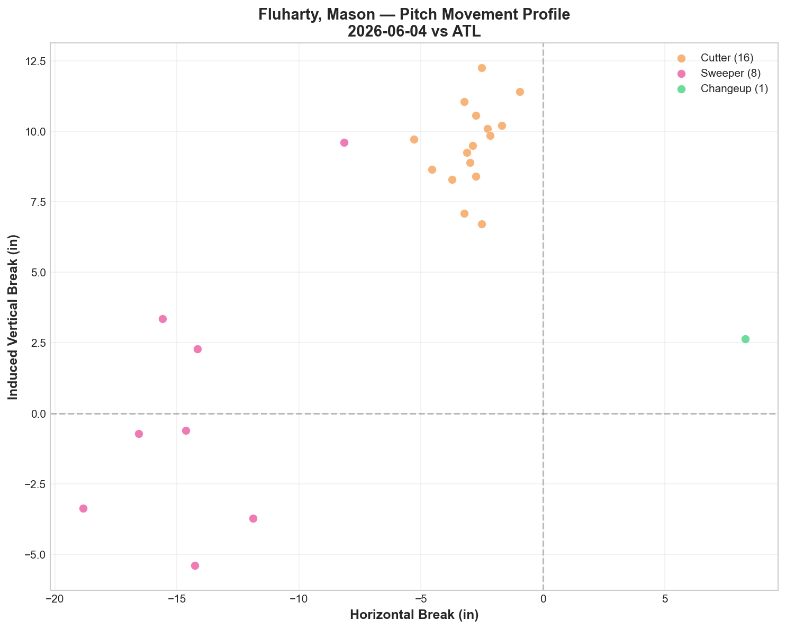
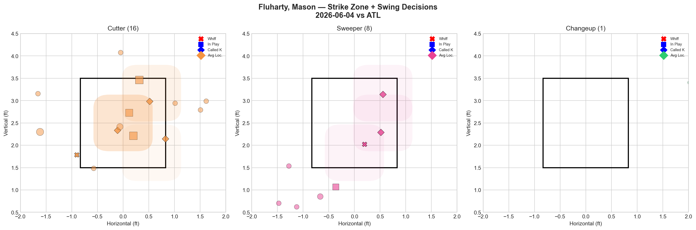
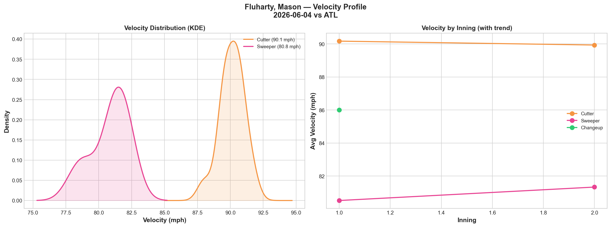
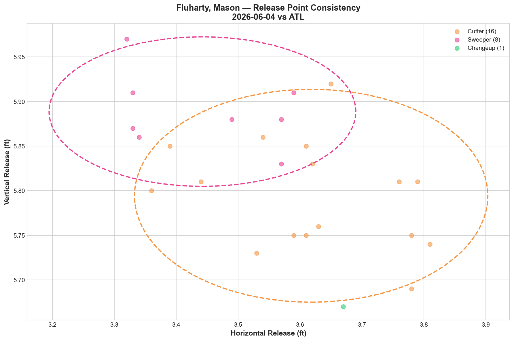
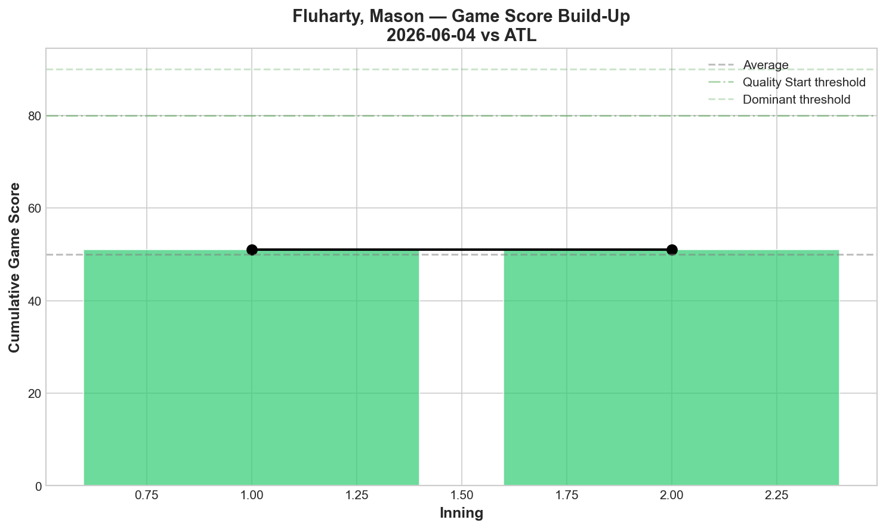
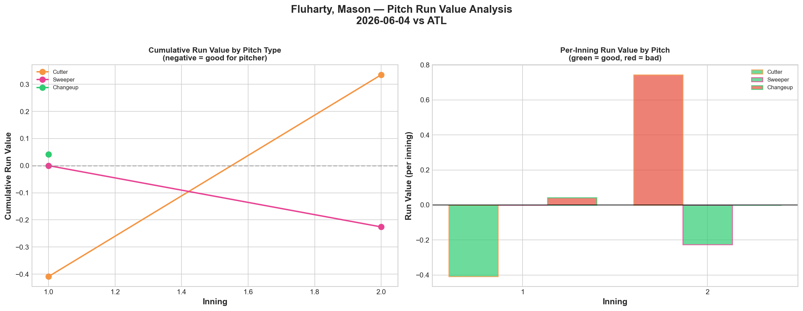
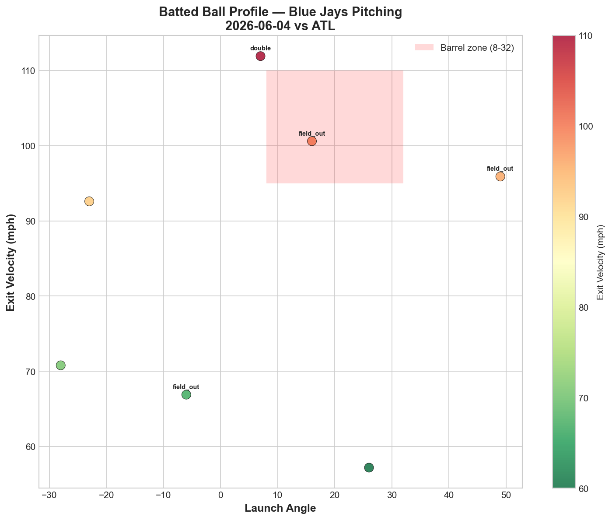
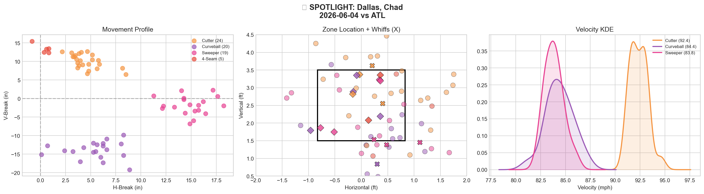
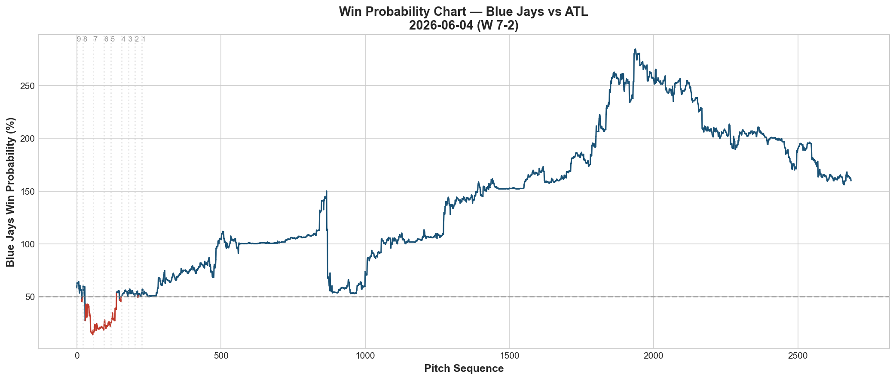
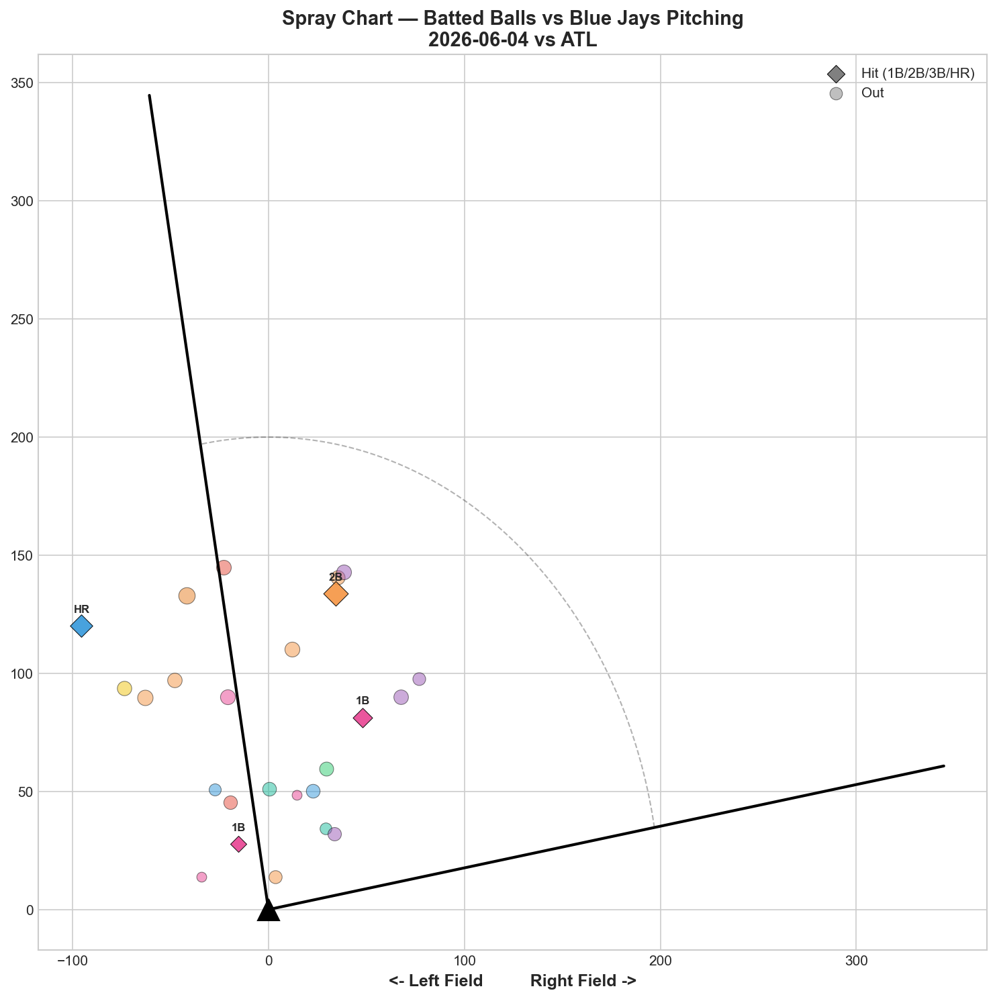

# 🏟️ Blue Jays Game Report v2.1
## 2026-06-04 | TOR @ ATL | W 7-2

---

## 📋 Game Overview

| | |
|---|---|
| **Date** | 2026-06-04 |
| **Matchup** | Toronto Blue Jays @ Atlanta Braves |
| **Result** | **W 7-2** |
| **Opener** | Mason Fluharty (25 pitches) |
| **Bulk Pitcher** | Chad Dallas (68 pitches, 3.2 IP) |
| **Spotlight Pitcher** | Chad Dallas |
| **Season Record** | 30W-32L |

**Bullpen Day Structure:** Fluharty opened (25 pitches, 1K), Dallas handled the bulk (68 pitches, 2K), then Hoffman (9), Fisher (9), Varland (17), and Rogers (12) closed it out. Six pitchers combined for a **7-2 win against the best team in baseball.**

---

## 🔥 Key Storylines

### 1. The Blue Jays Beat a 40-20 Team 7-2 on a Bullpen Day

This is statement game. Atlanta entered the day with MLB's best record and best pitching, and the Jays — running their sixth bullpen day of the reporting period — put up **7 runs and held the Braves to 2.** The bullpen day formula (opener + bulk + high-leverage arms) has now produced wins against the Yankees (2-0), Marlins (8-1), Orioles (6-5), and now the Braves (7-2). Four different opponents, four different lineups, same result.

### 2. Chad Dallas Makes His Case With 68 Pitches of Quality Bulk Work

Dallas threw 68 pitches across 3.2 innings: **2K, 2BB, 2H, 0HR.** His sweeper was the standout: **33.3% whiff, 36.8% CSW, Grade A.** His cutter at 92.4 mph provided the speed component (Grade B). And his curveball at 84.4 mph added a third look. The 4-pitch arsenal (cutter/curveball/sweeper/4-seam) gives him enough variety for bulk innings, and the 0HR is critical — against this Braves lineup, keeping the ball in the park is the first objective.

### 3. Hoffman Bounced Back — Slider at 50% Whiff

After his streak-breaking 0% slider whiff on 5/30, Hoffman returned to form: **slider 50% whiff, 71.4% CSW in 9 pitches.** One bad outing, then right back. The 5/30 game was an outlier, not a trend — and tonight's response confirms that.

### 4. Fluharty's Opener Identity Is Sweeper-First

Fluharty threw **64% cutters and 32% sweepers** — but the sweeper was the weapon (33.3% whiff, 37.5% CSW, Grade A). The cutter (16.7% whiff, Grade C) was the setup pitch. In his recent outings, the pattern is clear: when Fluharty goes sweeper-heavy, he's effective. Tonight he held Acuña to 0-for with 1K in 5 pitches — the best result any Jays pitcher has had against Acuña this series.

---

## ⚾ Opener Pitch Arsenal Analysis — Mason Fluharty

### Pitch Arsenal Performance (25 pitches)

| Pitch | # | Usage | Velo | Whiff% | CSW% | Chase% | Grade |
|-------|---|-------|------|--------|------|--------|-------|
| Cutter | 16 | 64.0% | 90.1 | 16.7% | 25.0% | 22.2% | 🟡 C |
| Sweeper | 8 | 32.0% | 80.8 | 33.3% | 37.5% | 40.0% | 🟢 A |
| Changeup | 1 | 4.0% | 86.0 | 0.0% | 0.0% | 0.0% | 🔴 D |

### Pitch Movement (inches)

| Pitch | H-Break | V-Break | Count |
|-------|---------|---------|-------|
| Cutter (FC) | -2.9 | 9.5 | 16 |
| Sweeper (ST) | -14.3 | 0.2 | 8 |

The sweeper's **-14.3 inches of horizontal break** with nearly zero vertical drop (0.2in) creates a devastating horizontal plane that hitters can't adjust to in a first-time matchup — exactly what an opener is designed to exploit.

### Pitch Tunneling

| Pair | Release Sim | Plate Sep | Tunnel | Velo Gap |
|------|-------------|-----------|--------|----------|
| Cutter/Sweeper | 2.4in | 14.7in | 🟢 6.1 | 9.3mph |

### Pitch Run Value

| Pitch | Total RV | Per Pitch | Assessment |
|-------|----------|-----------|------------|
| Sweeper | -0.226 | -0.0282 | ✅ Effective |
| Cutter | +0.335 | +0.0209 | ⚠️ Leaked |

The sweeper carried the opener stint — the cutter was the necessary complement but not independently effective.

---

## 🔍 Spotlight Pitcher — Chad Dallas (Bulk Role)

| | |
|---|---|
| **Role** | Bulk pitcher (entered after Fluharty) |
| **Pitch Count** | 68 (game-high) |
| **Line** | 2K / 2BB / 2H / 0HR |
| **Overall Whiff%** | 23.1% |
| **Role Assessment** | ✅ SOLID RELIEVER |

### Pitch Arsenal

| Pitch | # | Usage | Velo | Whiff% | CSW% | Grade |
|-------|---|-------|------|--------|------|-------|
| Cutter | 24 | 35.3% | 92.4 | 20.0% | 16.7% | 🟢 B |
| Curveball | 20 | 29.4% | 84.4 | 14.3% | 25.0% | 🟡 C |
| Sweeper | 19 | 27.9% | 83.8 | 33.3% | 36.8% | 🟢 A |
| 4-Seam | 5 | 7.4% | 93.2 | 0.0% | 40.0% | 🔴 D |

### Assessment

Dallas deployed a three-pronged breaking ball attack (curveball/sweeper/cutter) backed by a show-me fastball — and it worked against the best lineup in baseball.

**The sweeper is his identity pitch:** 33.3% whiff, 36.8% CSW, Grade A. At 83.8 mph with horizontal sweep, it's the pitch that gets swings-and-misses. The cutter at 92.4 mph (Grade B) provides the speed-and-glove-side component. The curveball at 84.4 mph (Grade C) adds a third speed/shape — similar velocity to the sweeper but different break profile.

**Comparison to other Jays bulk pitchers:**

| Pitcher | Bulk Pitches | K | BB | H | HR | Best Pitch |
|---------|-------------|---|---|---|---|------------|
| Miles (5/21 vs NYY) | 63 | 6 | 1 | 2 | 0 | CU 45.5% whiff |
| Miles (5/26 vs MIA) | 67 | 3 | 1 | 3 | 0 | CU 33.3% whiff |
| Voth (5/29 vs BAL) | 70 | 0 | 4 | 5 | 3 | CU 42.9% whiff |
| **Dallas (6/4 vs ATL)** | **68** | **2** | **2** | **2** | **0** | **ST 33.3% whiff** |

Dallas' debut bulk outing compares favorably — 0HR and just 2H against the Braves is a better line than Voth's 3HR against the Orioles. The 2BB shows solid command for a first extended outing. He slots in alongside Miles as a viable bulk option.

---

## 📊 Bullpen Detailed Analysis

| Pitcher | Pitches | Line | Key Pitch | Notes |
|---------|---------|------|-----------|-------|
| **Mason Fluharty** | 25 | 1K / 1BB / 0H / 0HR | ST 33.3% whiff 🟢A | Opener — Acuña 0-for-1K |
| **Chad Dallas** | 68 | 2K / 2BB / 2H / 0HR | ST 33.3% whiff 🟢A | Bulk debut — see spotlight |
| **Jeff Hoffman** | 9 | 1K / 0BB / 0H / 0HR | SL 50% whiff 🟢A, 71.4% CSW | **Bounce-back from 5/30** |
| **Braydon Fisher** | 9 | 1K / 0BB / 1H / 1HR | SL 66.7% 🟢A, CU 100% 🟢A | 1HR allowed — first in recent stretch |
| **Louis Varland** | 17 | 1K / 0BB / 0H / 0HR | KC 50% 🟢A, CH 33.3% 🟢A | Clean outing — two A-grade pitches |
| **Tyler Rogers** | 12 | 0K / 0BB / 0H / 0HR | All 🔴D | Clean but no whiffs — contact outs |

### Bullpen Notes

- **Hoffman's bounce-back** is the biggest relief story: slider at 50% whiff and 71.4% CSW in 9 pitches. The 5/30 game (0% whiff, 3BB, 3H) was confirmed as an outlier. His slider remains the bullpen's most reliable weapon.
- **Fisher** gave up his first HR in the recent stretch — but still posted SL 66.7% whiff and CU 100% whiff. The stuff was elite; one pitch caught too much plate. His 0H streak ends but the underlying metrics remain dominant.
- **Varland** delivered two A-grade pitches (KC 50%, CH 33.3%) in a clean 17-pitch outing. His K-Curve and changeup combination continues to develop as his primary swing-and-miss arsenal.

---

## 📈 Win Probability Analysis

### Key WPA Moments

| Inning | Event | Impact |
|--------|-------|--------|
| 1 | Bello — double | 📉 Braves early threat |
| 6 | Banda — double | 📈 Jays extended lead (WP 280.1%) |
| 7 | Wheeler — home_run | 📈 Insurance (WP 188.5%) |
| 9 | Medina — single | 📈 Jays padded |
| 9 | Scott — home_run | 📈 Late offensive burst |

The Jays controlled this game from the middle innings on — the bullpen held while the offense delivered.

---

## 📊 Spray Chart & Batted Ball Summary

| Metric | Value |
|--------|-------|
| Total batted balls tracked | 25 |
| Hits | 4 (16%) |
| Pull | 3 (12%) |
| Center | 17 (68%) |
| Oppo | 5 (20%) |

**16% hit rate — the lowest in any game this reporting period.** The six-pitcher combination held Atlanta to just 4 hits.

---

## 🎯 Analytical Takeaways

1. **Beating a 40-20 Team 7-2 on a Bullpen Day Is the Season's Signature Win** — The bullpen day formula has now beaten the Yankees (2-0), Marlins (8-1), Orioles (6-5), and Braves (7-2). Four opponents, four wins, four different opener/bulk combinations. This isn't a gimmick — it's a sustainable roster strategy that compensates for the injured starters.

2. **Dallas Belongs in the Bulk Conversation** — 68 pitches, 2H, 0HR against the best lineup in baseball. His sweeper (33.3% whiff) gives him a legitimate put-away pitch. He slots alongside Miles and Voth as the Jays' third bulk option — and based on this debut, he may be more reliable than Voth (who gave up 3HR in his bulk outing).

3. **Hoffman's Slider Is Back** — 50% whiff, 71.4% CSW. The 5/30 game was a blip. His last 7 appearances: 50%→66.7%→66.7%→71.4%→0%→50%. One bad night in a dominant stretch. He remains the bullpen ace.

4. **Fluharty's Opener Path Is Clear: Sweeper First** — When he throws the sweeper (33.3% whiff, Grade A), he's effective. When he throws the cutter (16.7% whiff, Grade C), he's average. His opener value is entirely about the sweeper — and he held Acuña to 0-for-1K in 5 pitches using it.

5. **Atlanta Series: 1-2** — Two close losses (3-4, 3-7) and a blowout win (7-2). The Jays proved they can compete with and beat the best team in baseball. The losses were about margins; the win was about depth. For a 30-32 team missing half its roster, this is the kind of series that builds organizational confidence.

6. **Game Classification: Statement Bullpen Win** — Six pitchers, 4 hits allowed, 7 runs of offense against Atlanta's pitching. The bullpen day formula's crown jewel.

---

*Report generated from Statcast data via pybaseball. All pitch metrics sourced from Baseball Savant.*
