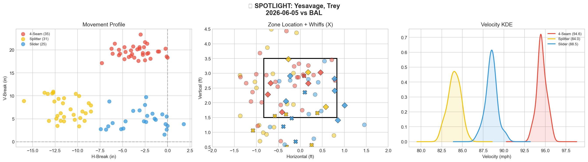
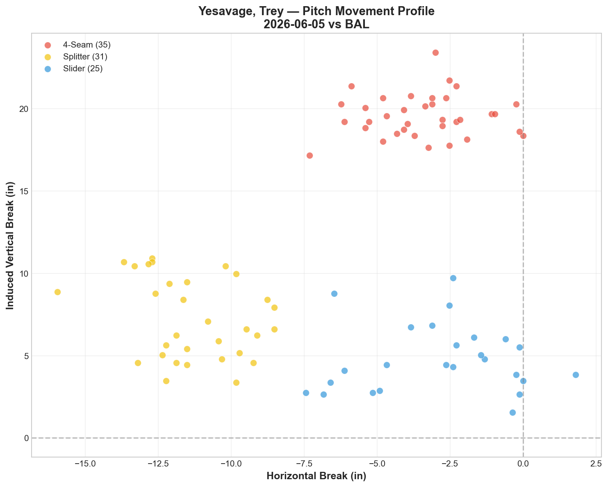
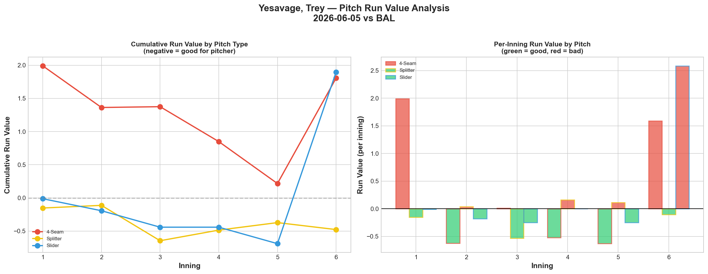
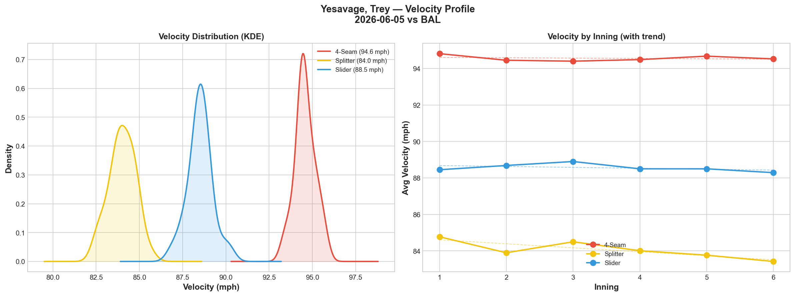
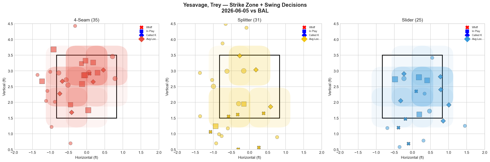
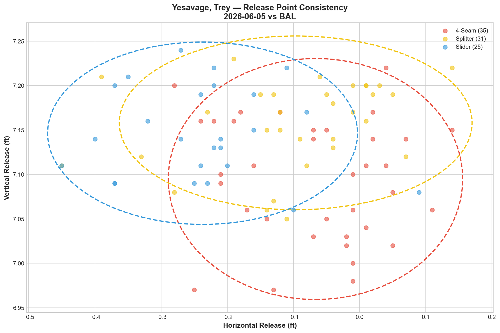
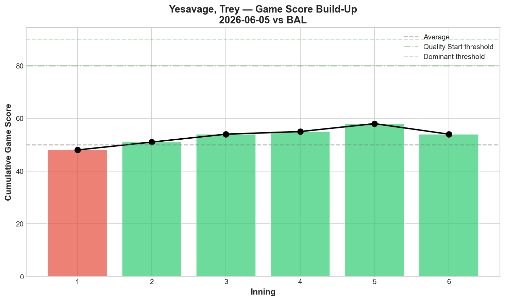
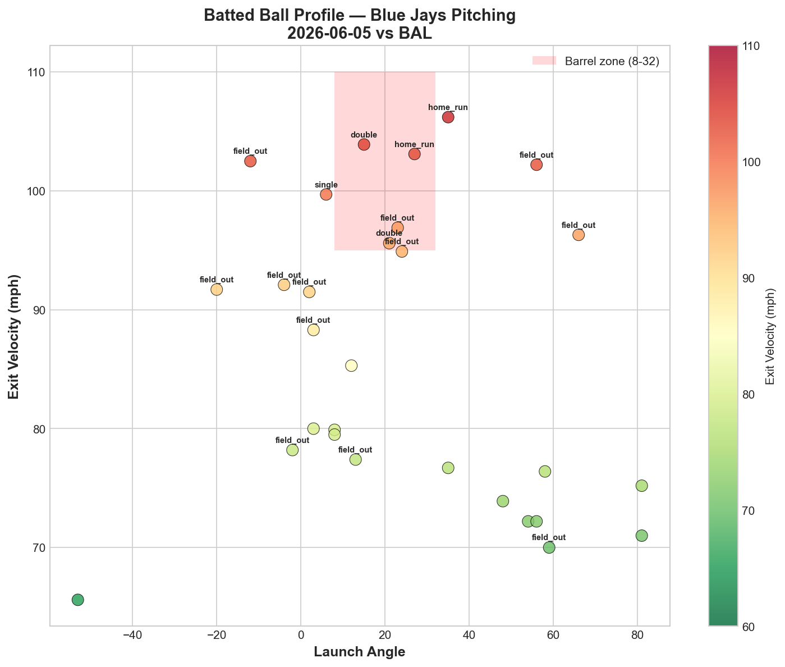
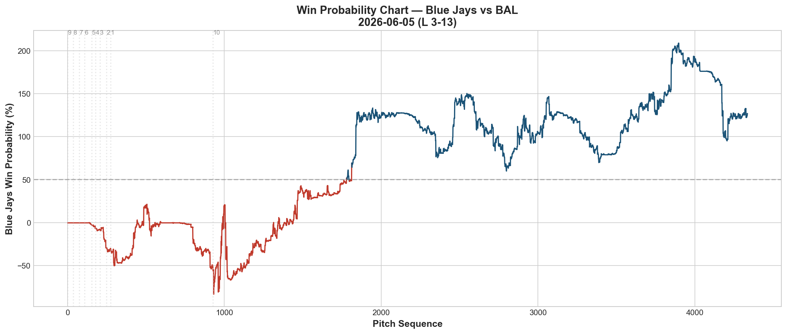
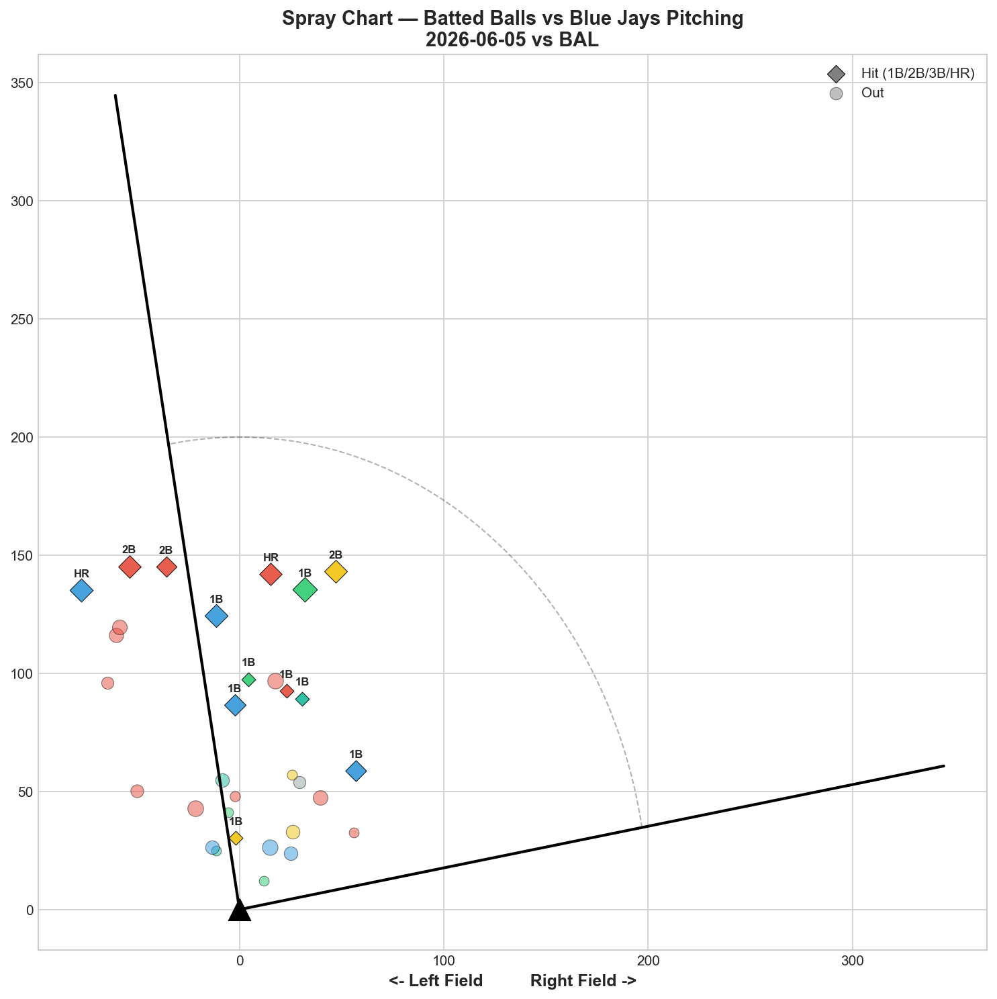

# 🏟️ Blue Jays Game Report v2.1
## 2026-06-05 | TOR vs BAL | L 3-13

---

## 📋 Game Overview

| | |
|---|---|
| **Date** | 2026-06-05 |
| **Matchup** | Baltimore Orioles @ Toronto Blue Jays |
| **Result** | **L 3-13** |
| **Starter** | Trey Yesavage (91 pitches) |
| **Spotlight Pitcher** | Trey Yesavage |
| **Season Record** | 30W-33L |

---

## 🔥 Key Storylines

### 1. Yesavage's Whiff Rates Say A/A — His Run Values Say Catastrophe

This is the most confusing Yesavage start yet. His splitter posted **46.2% whiff (Grade A)** and his slider posted **38.5% whiff, 44.0% CSW (Grade A).** Two elite-grade pitches. But the run values tell the opposite story: **slider +1.896 RV, 4-seam +1.806 RV** — both catastrophic. Only the splitter was genuinely effective at -0.477 RV.

The disconnect is clear: Yesavage was getting whiffs in low-leverage situations and getting crushed in high-leverage ones. The swings-and-misses came on waste pitches; the damage came when hitters were sitting on locations. This is a sequencing and location problem disguised by good whiff metrics.

### 2. The Yesavage Four-Start Decline Is Now Undeniable

| Start | GS | K | BB | FF Whiff | SL Whiff | FS Whiff | SL RV | FF RV | Result |
|-------|----|----|-----|----------|----------|----------|-------|-------|--------|
| 5/20 vs NYY | 74 | 8 | 0 | 7.7% | 50.0% | 28.6% | -2.006 | -0.851 | **W 2-1** |
| 5/25 vs MIA | 64 | 6 | 2 | 0.0% | 40.0% | 64.7% | +2.168 | -1.993 | L 2-8 |
| 5/30 vs BAL | 45 | 4 | 7 | 15.0% | 18.2% | 12.5% | +0.020 | +0.273 | L 5-6 |
| **6/5 vs BAL** | **52** | **5** | **2** | **5.6%** | **38.5%** | **46.2%** | **+1.896** | **+1.806** | **L 3-13** |

Game Score: 74 → 64 → 45 → 52. The slight GS uptick from 45 to 52 is misleading — 13 runs allowed (including bullpen) tells the real story. The slider has now posted positive RV in 3 of 4 starts (+2.168, +0.020, +1.896). The 4-seam has been negative RV in only 1 of 4 starts. Only the splitter has been consistently valuable.

### 3. 13 Runs Allowed Is a Team-Wide Collapse

This wasn't just Yesavage — the entire pitching staff was hit around. 175 total pitches, **13 hits at 41% hit rate.** Rodríguez gave up 4 hits, Seabold gave up 4 hits, and Yesavage gave up 5. Only Macko (0H, 3K) emerged clean. When the starter can't go deep and the bullpen can't hold, 13-3 happens.

---

## 🔍 Spotlight Pitcher — Trey Yesavage

| | |
|---|---|
| **Pitch Count** | 91 |
| **Line** | 5K / 2BB / 5H / 2HR |
| **Overall Whiff%** | 27.3% |

### Pitch Arsenal

| Pitch | # | Usage | Velo | Whiff% | CSW% | Grade |
|-------|---|-------|------|--------|------|-------|
| 4-Seam | 35 | 38.5% | 94.6 | 5.6% | 17.1% | 🔴 D |
| Splitter | 31 | 34.1% | 84.0 | 46.2% | 29.0% | 🟢 A |
| Slider | 25 | 27.5% | 88.5 | 38.5% | 44.0% | 🟢 A |

### The Whiff/RV Disconnect — Yesavage's Defining Issue

| Pitch | Whiff% | Grade | Run Value | Assessment |
|-------|--------|-------|-----------|------------|
| Splitter | 46.2% | A | -0.477 | ✅ Whiff translates to value |
| Slider | 38.5% | A | +1.896 | 🔴 **Whiff does NOT translate** |
| 4-Seam | 5.6% | D | +1.806 | 🔴 No whiff, no value |

The slider is the paradox: **38.5% whiff rate but +1.896 Run Value.** How? The whiffs came on chase pitches outside the zone (41.7% chase rate). But when the slider was thrown in the zone — or when hitters laid off the chase pitches and waited for a hittable one — the damage was severe. The slider's deception works on individual pitches, but the overall pitch outcomes are negative because the in-zone sliders get barreled.

**The splitter is the only pitch where whiff consistently converts to run prevention.** It should be Yesavage's primary pitch, not his secondary.

### Pitch Movement (inches)

| Pitch | H-Break | V-Break | Count |
|-------|---------|---------|-------|
| 4-Seam (FF) | -3.4 | 19.6 | 35 |
| Splitter (FS) | -11.3 | 7.2 | 31 |
| Slider (SL) | -2.9 | 4.8 | 25 |

### Pitch Tunneling

| Pair | Release Sim | Plate Sep | Tunnel | Velo Gap |
|------|-------------|-----------|--------|----------|
| **4-Seam/Splitter** | **0.8in** | **14.6in** | **🟢 17.4** | **10.6mph** |
| 4-Seam/Slider | 2.1in | 14.8in | 🟢 6.9 | 6.1mph |
| Splitter/Slider | 1.7in | 8.8in | 🟢 5.2 | 4.5mph |

The FF/FS tunnel at 17.4 is his best pair — and it's the one built around the splitter. Further evidence that the splitter should be the central pitch.

### Pitch Run Value

| Pitch | Total RV | Per Pitch | Pitches | Assessment |
|-------|----------|-----------|---------|------------|
| Splitter | -0.477 | -0.0154 | 31 | ✅ Only effective pitch |
| 4-Seam | +1.806 | +0.0516 | 35 | 🔴 Catastrophic |
| Slider | +1.896 | +0.0758 | 25 | 🔴 Catastrophic |

**Combined +3.702 RV on FF and SL.** The splitter saved -0.477. Net: +3.225 RV — the worst single-game total RV for any Jays starter in our reporting period.

### Pitch Selection by Count

| Situation | Primary | Secondary | Notes |
|-----------|---------|-----------|-------|
| First Pitch (0-0) | 4-Seam 50.0% | Slider 29.2% | Fastball-first |
| Ahead | Splitter 50.0% | 4-Seam 28.6% | Good — splitter as weapon |
| Behind | SL/FF 46.2% each | FS 7.7% | Splitter disappears when behind |
| Even | FS/FF 36.4% each | SL 27.3% | Balanced |
| Full Count (3-2) | Splitter 75.0% | FF 25.0% | **Good — splitter on 3-2** |

The positive: Yesavage is throwing the splitter 75% on full counts (up from earlier starts). The negative: he's still starting at-bats with the fastball 50% of the time, and the fastball posted +1.806 RV.

### Top Opposing Batters

| Batter | Pitches | Hits | K | BB | Avg EV |
|--------|---------|------|---|-----|--------|
| Pete Alonso | 15 | 0 | 1 | 0 | 88.0 |
| Adley Rutschman | 15 | 2 | 0 | 1 | 88.7 |
| Gunnar Henderson | 12 | 0 | 1 | 1 | 81.8 |
| Taylor Ward | 11 | 0 | 2 | 0 | 81.9 |
| Colton Cowser | 9 | 0 | 0 | 0 | 86.6 |

**Henderson 0-for again.** Across 4 games in this BAL series (including the road series): Henderson is 1-for with multiple Ks. The Blue Jays pitching staff has figured him out. **Rutschman** was the most dangerous (2 hits, 88.7 EV). Ward struck out twice.

### Velocity / Release / Batted Ball

- **4-Seam:** 94.8 → 94.5 mph (-0.3)
- **Splitter:** 84.8 → 83.4 mph (-1.4)
- **Slider:** 88.4 → 88.3 mph (-0.2)

Splitter velocity dropped 1.4 mph — not as extreme as Gausman's 4.9 mph fade on 5/27, but worth monitoring.

**Game Score: 52 (QUALITY).** 5K, 5H, 2HR, 2BB on 91 pitches. The GS doesn't reflect the 13-run final because the bullpen absorbed most of the damage.

| Metric | Value |
|--------|-------|
| Total BIP | 29 |
| Avg Exit Velo | 86.2 mph |
| Avg Launch Angle | 24.2° |
| Hard Hit (95+ mph) | 9/29 (31%) |

86.2 mph EV and 31% hard-hit — elevated contact quality.

---

## 📊 Bullpen Detailed Analysis

| Pitcher | Pitches | Line | Key Pitch | Notes |
|---------|---------|------|-----------|-------|
| **Adam Macko** | 30 | **3K / 1BB / 0H / 0HR** | **SL 62.5% whiff 🟢A** | **Career-best slider performance** |
| **Yariel Rodríguez** | 27 | 1K / 1BB / 4H / 0HR | FF 50% whiff 🟢A | 4H allowed despite one A-grade pitch |
| **Connor Seabold** | 26 | 0K / 0BB / 4H / 0HR | FF 25% whiff 🟢B | 4H allowed — contact management failure |
| **Tyler Heineman** | 1 | — | — | Position player pitching in blowout |

### Bullpen Notes

- **Macko delivered his best appearance yet:** 30 pitches, 3K, 0H — and his slider posted **62.5% whiff rate, the highest slider whiff in any Macko outing.** His development arc across 10 appearances: 0% whiff (debut) → flashing K-Curve → flashing changeup → now a dominant slider. At 62.5% whiff and 40% CSW, this is a slider that can play in high-leverage situations. 10 appearances in, Macko is becoming a legitimate bullpen weapon.
- **Rodríguez** gave up 4 hits despite his fastball grading A (50% whiff). The slider (0% whiff), splitter (0% whiff), and sinker (0% whiff) all failed. His one-pitch-only outings keep happening — he can flash one A-grade pitch per night but the rest of the arsenal collapses.
- **Seabold** gave up 4 hits — his worst outing. The fastball (25% whiff, Grade B) was decent but slider and changeup both graded D.
- **Heineman** throwing 1 pitch means the game was out of reach — position player pitching confirms the blowout.

---

## 📈 Win Probability Analysis

---

## 📊 Spray Chart & Batted Ball Summary

| Metric | Value |
|--------|-------|
| Total batted balls tracked | 32 |
| Hits | 13 (41%) |
| Pull | 3 (9%) |
| Center | 23 (72%) |
| Oppo | 6 (19%) |

41% hit rate — the highest in any game this reporting period. The pitching staff was thoroughly outmatched.

---

## 🎯 Analytical Takeaways

1. **Yesavage's Whiff/RV Disconnect Is His Defining Problem** — SL 38.5% whiff but +1.896 RV. FS 46.2% whiff and -0.477 RV. The slider generates empty whiffs (chase pitches, 2-strike waste pitches) but gives up massive value on contact. The splitter generates meaningful whiffs that actually prevent runs. The development path is clear: become a splitter-first pitcher.

2. **GS 74→64→45→52 Across 4 Starts** — The 5/20 masterpiece looks increasingly like an outlier rather than a baseline. Yesavage has now lost 3 of 4 starts with rising run totals. The 4-seam has been negative RV in only 1 of 4 starts. He needs either a fastball upgrade or a fundamental arsenal rebalancing.

3. **Macko's Slider Hit 62.5% Whiff — His Best Ever** — 10 appearances in, 30 pitches tonight, 3K, 0H. The slider is now his identity pitch. His development arc from 0% whiff debut to 62.5% whiff in 17 days is the most dramatic single-pitch improvement we've tracked on this staff.

4. **13 Runs Is a Team Failure** — Yesavage gave up 5H and 2HR, but the bullpen added 8H more. Rodríguez (4H) and Seabold (4H) were both hammered. When the game went to the bullpen early and the low-leverage arms couldn't hold, the deficit exploded. A position player (Heineman) throwing confirms the capitulation.

5. **Henderson Continues His Slump Against the Jays** — 0-for in 12 pitches tonight. Across 5 games against Toronto (home and road), Henderson has been consistently neutralized. The Jays' pitching approach against him — whatever it is — is working.

6. **Game Classification: Blowout Loss** — The worst result of the reporting period. A game to forget and move on from.

---

*Report generated from Statcast data via pybaseball. All pitch metrics sourced from Baseball Savant.*
