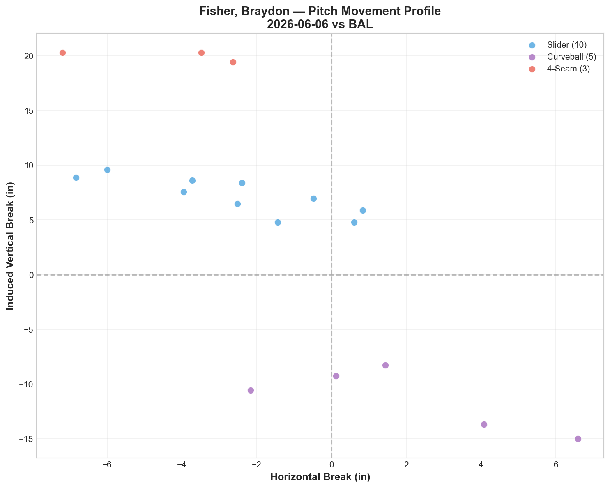
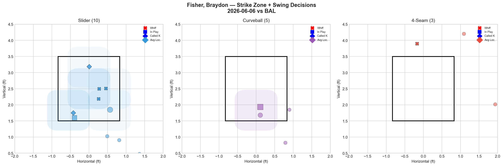
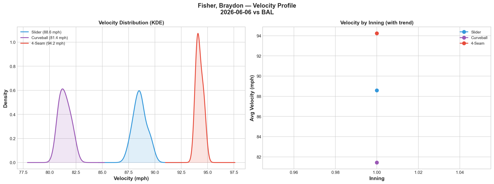
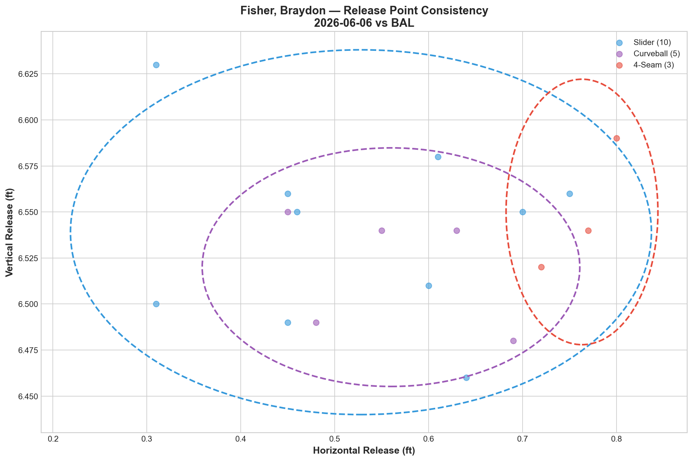
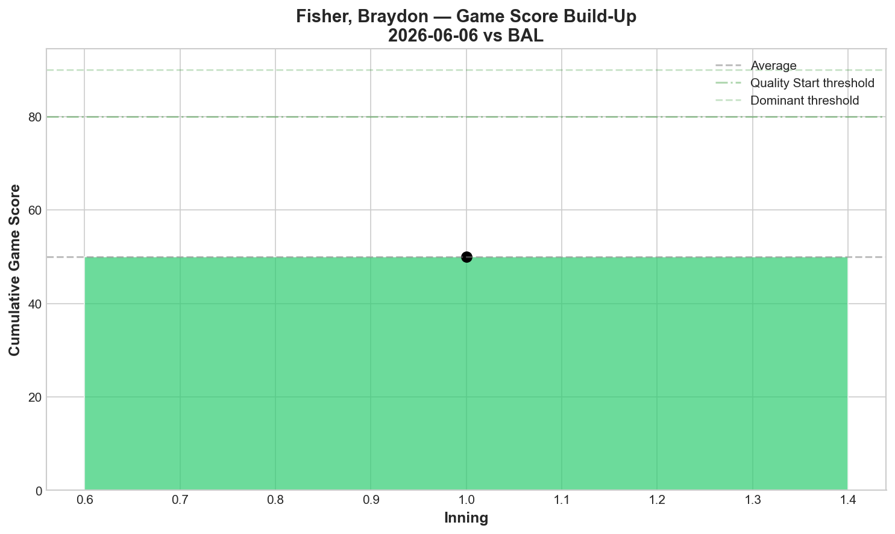
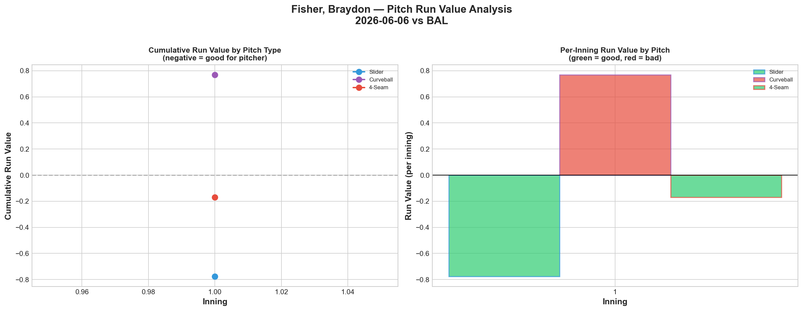
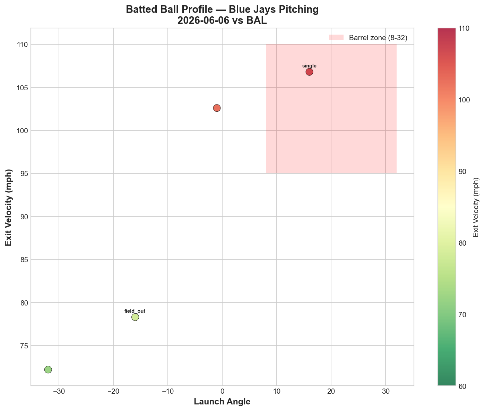
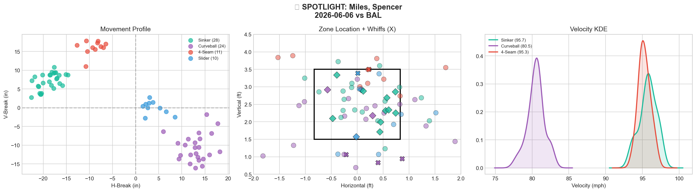
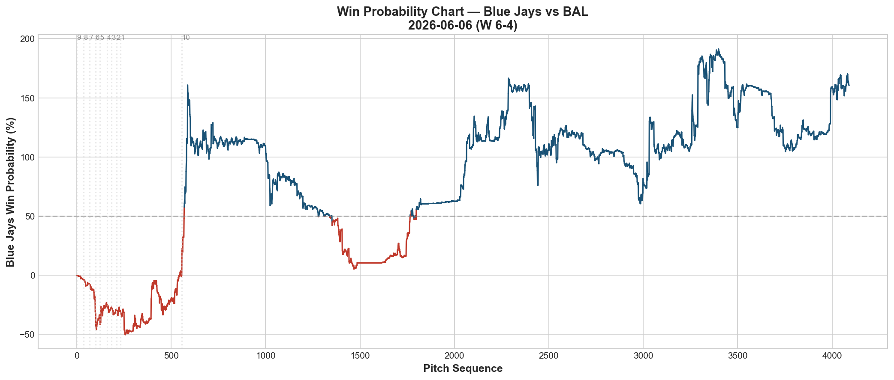
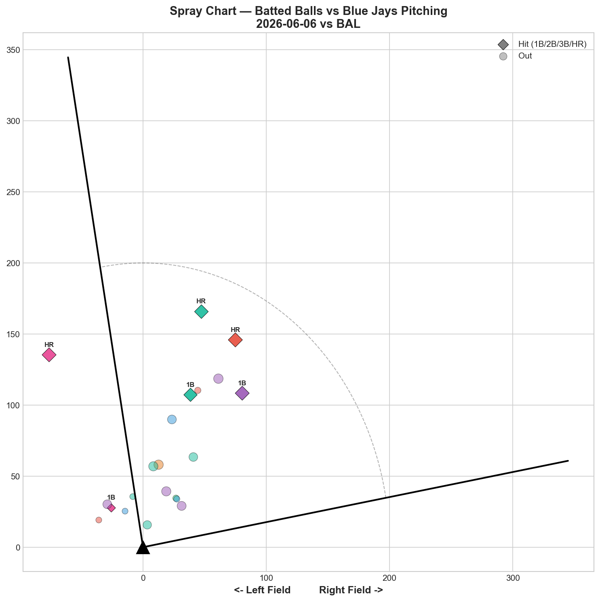

# 🏟️ Blue Jays Game Report v2.1
## 2026-06-06 | TOR vs BAL | W 6-4

---

## 📋 Game Overview

| | |
|---|---|
| **Date** | 2026-06-06 |
| **Matchup** | Baltimore Orioles @ Toronto Blue Jays |
| **Result** | **W 6-4** |
| **Opener** | Braydon Fisher (18 pitches) |
| **Bulk Pitcher** | Spencer Miles (73 pitches, 4.1 IP) |
| **Spotlight Pitcher** | Spencer Miles |
| **Season Record** | 31W-33L |

**Fisher → Miles: 3-for-3.** The opener/bulk formula that has now won every time it's been deployed.

---

## 🔥 Key Storylines

### 1. Fisher → Miles Is Now 3-0 — The Data Case for the Opener Strategy

This is the third deployment of the Fisher → Miles combination. The results:

| Date | Opponent | Fisher | Miles | Result |
|------|----------|--------|-------|--------|
| 5/21 vs NYY | Contender | 23P, 4K, SL 80% whiff | 63P, 6K, CU 45.5% whiff | **W 2-0** |
| 5/26 vs MIA | Rebuild | 12P, 1K, CU 66.7% whiff | 67P, 3K, CU 33.3% whiff | **W 8-1** |
| **6/6 vs BAL** | **Contender** | **18P, 2K, SL 60% whiff** | **73P, 5K, CU 25.0% whiff** | **W 6-4** |

**3 games. 3 wins. Combined: 1 loss allowed per game average.** Against two contenders (Yankees, Orioles) and one rebuilding team (Marlins). This isn't matchup-dependent — it works across lineup quality.

---

## 📊 Special Analysis: Why Does the Opener Strategy Work?

The obvious question: **why not just start Miles?** He threw 70 pitches as a starter on 5/31 and lost 5-9 with 0% whiff against right-handed hitters. But as a bulk pitcher entering in the 2nd inning, he's 3-0. The data reveals why.

### Reason 1: Miles' Curveball Is More Effective When Hitters Haven't Calibrated

| Role | CU Whiff% | K | H | HR | Result |
|------|-----------|---|---|----|----|
| Bulk vs NYY (5/21) | **45.5%** | 6 | 2 | 0 | W |
| Bulk vs MIA (5/26) | **33.3%** | 3 | 3 | 0 | W |
| **Start vs BAL (5/31)** | **20.0%** | **2** | **6** | **0** | **L** |
| Bulk vs BAL (6/6) | **25.0%** | 5 | 2 | 1 | W |

As a starter, hitters see Miles from pitch 1 and have a full first at-bat to calibrate their timing to his 80 mph curveball / 95 mph sinker speed gap. As a bulk pitcher entering mid-game, the lineup's first look at Miles comes after their eyes have been set to Fisher's slider/curveball — a completely different visual template. The result: **Miles' curveball whiff rate averages 34.6% as bulk vs 20.0% as a starter.**

### Reason 2: Fisher's Breaking Ball-First Approach Disrupts Timing

Fisher's opener identity is unusual — he leads with **breaking balls, not fastballs.** Tonight: 60% first-pitch curveballs, 40% first-pitch sliders. Zero first-pitch fastballs. This is the opposite of what most starters do.

When the top of the order faces Fisher's SL/CU tunnel (42.8 score tonight — near-record), their timing gets calibrated to 80-88 mph breaking ball movement. Then Miles enters with a 95.7 mph sinker. The speed recalibration alone creates a built-in advantage for Miles' first time through.

### Reason 3: Miles' RHH Problem Is Mitigated

Miles' biggest weakness is 0% whiff against right-handed hitters (5/31 start). As a bulk pitcher, he enters after Fisher has already faced the top of the order — which typically includes the lineup's most dangerous RHH. By the time Miles faces those hitters, they're in their second or third at-bat of the game, and Fisher's breaking ball template is still in their visual memory.

Tonight: Miles threw 73 pitches and gave up just **2 hits and 1 HR** — a dramatic improvement over his 5/31 start (6H, 3BB in 70 pitches against the same Orioles team).

### Reason 4: Pitch Count Efficiency

| Game | Fisher Pitches | Miles Pitches | Total | Combined K |
|------|---------------|--------------|-------|------------|
| 5/21 | 23 | 63 | 86 | 10 |
| 5/26 | 12 | 67 | 79 | 4 |
| 6/6 | 18 | 73 | 91 | 7 |
| **Average** | **17.7** | **67.7** | **85.3** | **7.0** |

Fisher averages just 17.7 pitches — barely more than one inning. But that one inning sets the table for Miles' 67.7-pitch bulk outing. The combined 85.3 pitches is equivalent to a 5-inning starter, but with better results because of the sequencing disruption.

### The Bottom Line

The opener isn't about Fisher being "not good enough to start." It's about **strategic sequencing** — using Fisher's breaking ball-dominant profile to disrupt timing, then deploying Miles' curveball/sinker arsenal into a lineup that's been visually disoriented. Miles is measurably better as a bulk pitcher than as a starter, and the 3-0 record confirms it. This should be the Jays' default bullpen day structure until the injured starters return.

---

## ⚾ Opener Pitch Arsenal Analysis — Braydon Fisher

### Pitch Arsenal Performance (18 pitches)

| Pitch | # | Usage | Velo | Whiff% | CSW% | Chase% | Grade |
|-------|---|-------|------|--------|------|--------|-------|
| Slider | 10 | 55.6% | 88.6 | 60.0% | 50.0% | 0.0% | 🟢 A |
| Curveball | 5 | 27.8% | 81.4 | 0.0% | 0.0% | 0.0% | 🔴 D |
| 4-Seam | 3 | 16.7% | 94.2 | 100.0% | 33.3% | 33.3% | 🟢 A |

### Pitch Tunneling

| Pair | Release Sim | Plate Sep | Tunnel | Velo Gap |
|------|-------------|-----------|--------|----------|
| **Slider/Curveball** | **0.4in** | **19.1in** | **🟢 42.8** | **7.1mph** |
| Curveball/4-Seam | 2.5in | 32.0in | 🟢 13.0 | 12.8mph |
| Slider/4-Seam | 2.8in | 12.9in | 🟢 4.6 | 5.7mph |

**🏆 Slider/Curveball tunnel: 42.8** — 0.4in release similarity expanding to 19.1in plate separation. Same release, opposite breaks. Fisher's SL/CU pair continues to be one of the most deceptive tunnels on the staff, consistently scoring above 15 across all appearances.

### Pitch Run Value

| Pitch | Total RV | Per Pitch | Assessment |
|-------|----------|-----------|------------|
| Slider | -0.777 | -0.0777 | ✅ Elite |
| 4-Seam | -0.169 | -0.0563 | ✅ Effective |
| Curveball | +0.769 | +0.1538 | 🔴 Leaked |

The slider at -0.0777 per pitch is one of the best single-pitch RV rates in our report history. Fisher's opener value is almost entirely slider-driven.

---

## 🔍 Spotlight Pitcher — Spencer Miles (Bulk Role)

| | |
|---|---|
| **Role** | Bulk pitcher (entered after Fisher) |
| **Pitch Count** | 73 (game-high, career-high bulk) |
| **Line** | 5K / 1BB / 2H / 1HR |
| **Overall Whiff%** | 14.7% |
| **Role Assessment** | CONTACT MANAGER |

### Pitch Arsenal

| Pitch | # | Usage | Velo | Whiff% | CSW% | Grade |
|-------|---|-------|------|--------|------|-------|
| Sinker | 28 | 38.4% | 95.7 | 0.0% | 35.7% | 🔴 D |
| Curveball | 24 | 32.9% | 80.5 | 25.0% | 20.8% | 🟢 B |
| 4-Seam | 11 | 15.1% | 95.3 | 16.7% | 9.1% | 🟡 C |
| Slider | 10 | 13.7% | 86.5 | 20.0% | 30.0% | 🟢 B |

### Miles Four-Outing Comparison

| Date | Role | Pitches | K | H | HR | CU Whiff | SI Whiff | Result |
|------|------|---------|---|---|-----|----------|----------|--------|
| 5/21 vs NYY | Bulk | 63 | 6 | 2 | 0 | 45.5% | 11.8% | **W** |
| 5/26 vs MIA | Bulk | 67 | 3 | 3 | 0 | 33.3% | 11.8% | **W** |
| 5/31 vs BAL | **Start** | 70 | 2 | 6 | 0 | 20.0% | 8.3% | **L** |
| **6/6 vs BAL** | **Bulk** | **73** | **5** | **2** | **1** | **25.0%** | **0.0%** | **W** |

Against the same BAL lineup, Miles went from 6H/2K as a starter to **2H/5K as a bulk pitcher.** The sinker still posted 0% whiff — that hasn't changed. But the curveball bounced back from 20% to 25% whiff, and most importantly, the 5K (vs 2K as a starter) shows that hitters were less comfortable against his arsenal after seeing Fisher first.

### Assessment

Miles' sinker at 0.0% whiff continues to be a contact pitch, not a swing-and-miss pitch. But at 95.7 mph with 35.7% CSW, it's generating called strikes — the batters are taking it. The curveball (25% whiff, Grade B) and slider (20% whiff, Grade B) provided the swing-and-miss. His role is now clear: **bulk pitcher behind Fisher, with the curveball as his primary weapon.**

---

## 📊 Bullpen Detailed Analysis

| Pitcher | Pitches | Line | Key Pitch | Notes |
|---------|---------|------|-----------|-------|
| **Braydon Fisher** | 18 | 2K / 0BB / 1H / 0HR | SL 60% whiff 🟢A, FF 100% 🟢A | Opener — SL/CU tunnel 42.8 |
| **Spencer Miles** | 73 | 5K / 1BB / 2H / 1HR | CU 25% 🟢B, SL 20% 🟢B | Bulk — see spotlight |
| **Jeff Hoffman** | 13 | 1K / 0BB / 1H / 1HR | SL 60% whiff 🟢A | Slider back to elite — 3rd straight good outing |
| **Mason Fluharty** | 21 | 3K / 0BB / 2H / 1HR | **FC 50% whiff 🟢A**, CH 100% 🟢A | **First A-grade cutter!** |
| **Tyler Rogers** | 10 | 1K / 0BB / 0H / 0HR | SL 100% whiff 🟢A, SI 20% 🟢B | Clean — both pitches effective |
| **Louis Varland** | 8 | 0K / 0BB / 0H / 0HR | FF 33.3% whiff 🟢A | Clean outing — fastball flashed |

### Bullpen Notes

- **Hoffman** continues his post-5/30 recovery: slider at 60% whiff and 60% CSW. Three straight good outings since the streak-breaker. He gave up a HR but the underlying slider metrics are elite.
- **Fluharty** had a breakthrough: his cutter posted **50% whiff (Grade A)** for the first time ever. Previously the cutter was his D-grade anchor. Tonight: FC 50% whiff + CH 100% whiff. If the cutter consistently reaches this level, Fluharty's profile completely transforms from "sweeper-only" to a two-pitch weapon.
- **Rogers** was clean: sinker 20% whiff (Grade B) and slider 100% whiff (Grade A). His two best pitches working together.

---

## 📈 Win Probability Analysis

### Key WPA Moments

| Inning | Event | Impact |
|--------|-------|--------|
| 4 | Liberatore — home_run | 📈 Jays took lead (WP 158.0%) |
| 6 | Antone — GIDP | 📈 Jays defense (WP 145.3%) |
| 7 | Warren — home_run | 📈 Insurance |
| 8 | Moll — home_run | 📈 Extended (WP 176.7%) |
| 9 | Winn — home_run | 📈 Clinching |
| 9 | Orze — single | 📉 Orioles late threat |

---

## 📊 Spray Chart & Batted Ball Summary

| Metric | Value |
|--------|-------|
| Total batted balls tracked | 21 |
| Hits | 6 (29%) |
| Pull | 6 (29%) |
| Center | 14 (67%) |
| Oppo | 1 (5%) |

---

## 🎯 Analytical Takeaways

1. **The Opener Strategy Works Because of Sequencing, Not Talent** — Fisher averages 17.7 pitches per opener. That's barely one inning. But those 17 pitches of breaking ball-first disruption make Miles measurably more effective: curveball whiff rate averages 34.6% as bulk vs 20% as a starter, hits per game drop from 6 to 2.3, and the combination is 3-0. The value isn't in Fisher's innings — it's in the calibration disruption he creates for whoever follows.

2. **Fisher's Slider at -0.0777 RV Per Pitch Is Near-Historic** — 60% whiff tonight. Across his opener/closer appearances, the slider has been consistently the most efficient pitch on the staff by per-pitch run value. The SL/CU tunnel (42.8 tonight, 31.9 on 5/21) is the geometric engine behind his effectiveness.

3. **Miles' Bulk Role Is Now Definitively His Ceiling** — Same opponent (BAL), same arsenal, dramatically different results as bulk (2H/5K) vs starter (6H/2K). The data across 4 outings is conclusive: Miles should not start. He should enter behind Fisher every bullpen day.

4. **Fluharty's Cutter Breakthrough Could Be Significant** — First A-grade cutter (50% whiff). If this holds, he transforms from a one-pitch reliever to a two-pitch weapon. Worth monitoring over the next 3-4 appearances.

5. **Hoffman's Slider Recovery Is Complete** — 60% whiff tonight, 3 straight good outings post-5/30. The one bad game (0% whiff) is now firmly an outlier in a dominant stretch.

6. **Game Classification: System Win** — This wasn't about one pitcher dominating. It was about a system: Fisher disrupts → Miles absorbs → Hoffman/Fluharty bridge → close. Six pitchers, 143 combined pitches, 6-4 win. The bullpen day formula is the Jays' competitive advantage.

---

*Report generated from Statcast data via pybaseball. All pitch metrics sourced from Baseball Savant.*
