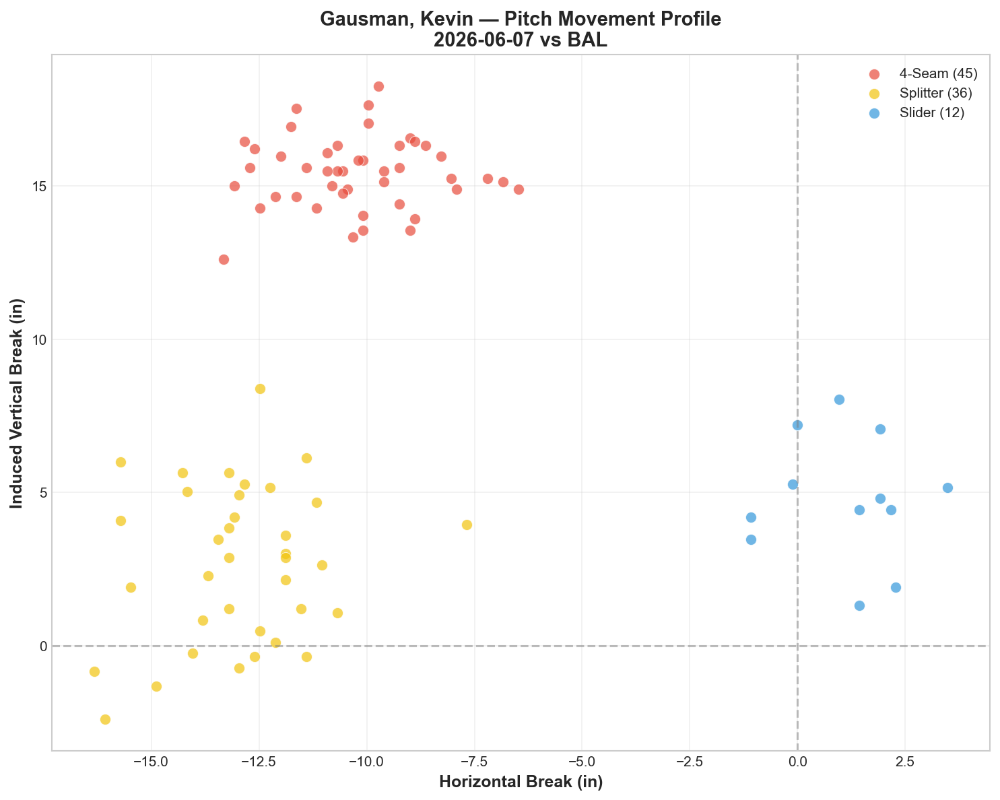
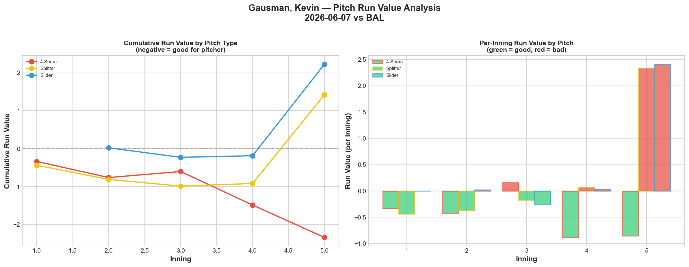
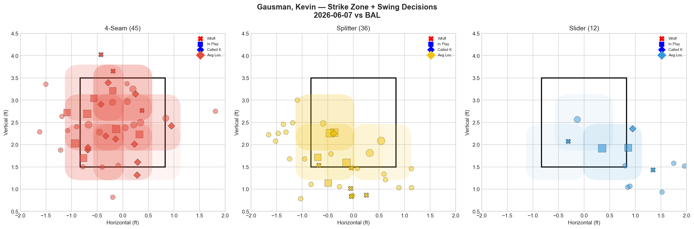
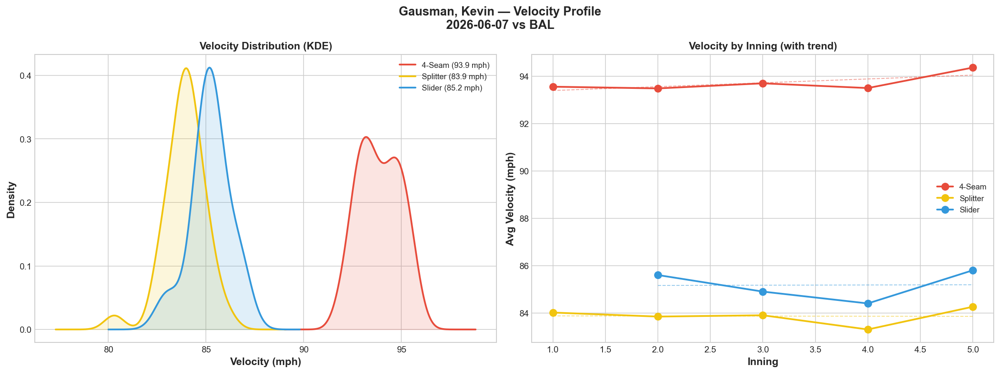
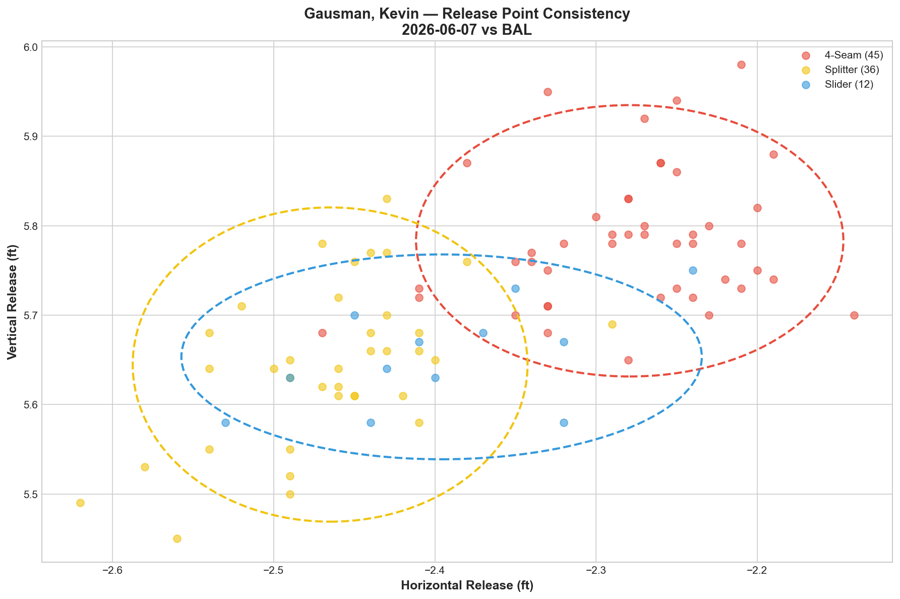
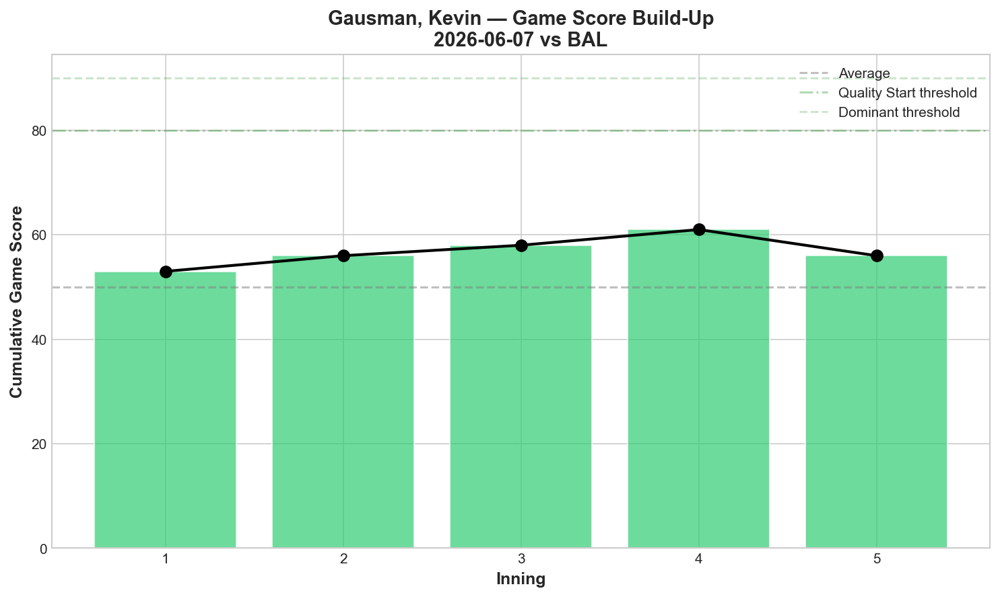
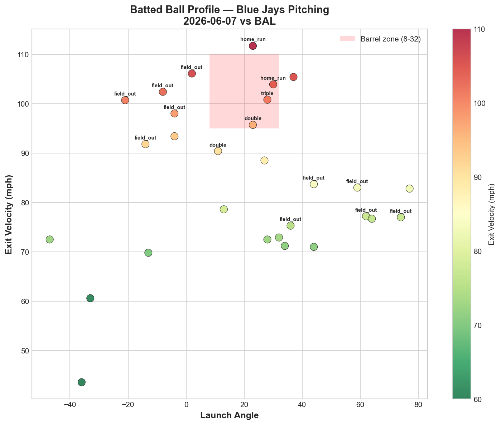
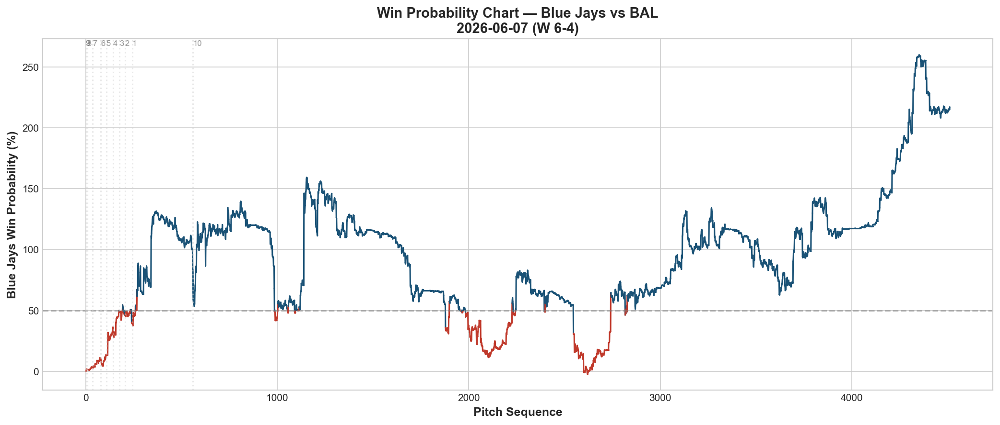
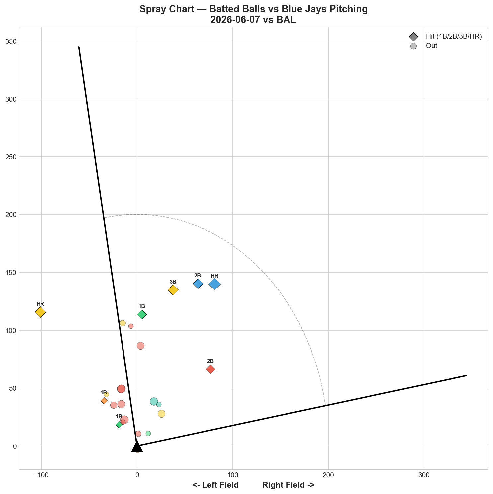

# 🏟️ Blue Jays Game Report v2.1
## 2026-06-07 | TOR vs BAL | W 6-4

---

## 📋 Game Overview

| | |
|---|---|
| **Date** | 2026-06-07 |
| **Matchup** | Baltimore Orioles @ Toronto Blue Jays |
| **Result** | **W 6-4** |
| **Starter** | Kevin Gausman (93 pitches) |
| **Spotlight Pitcher** | None |
| **Season Record** | 32W-33L |

---

## 🔥 Key Storylines

### 1. Gausman's Fastball Posted -2.337 RV — His Best Single-Pitch Game of the Season

The 4-seam fastball was **-2.337 Run Value across 45 pitches (-0.0519 per pitch)** — the most effective single-pitch performance by any Blue Jays pitcher this reporting period. At 93.9 mph with 14.3% whiff, 31.1% CSW, and 27.8% chase rate, the fastball commanded the zone and generated outs consistently. This is the third consecutive Gausman start where the fastball has been his best pitch (5/27: -1.050, 6/2: -0.748, 6/7: -2.337). The trend is clear: **Gausman's 4-seam is his most reliable pitch, not his splitter.**

### 2. The Splitter and Slider Both Leaked Value — Again

Despite the splitter posting 27.8% whiff (Grade B) and the slider posting 33.3% whiff (Grade A), both pitched posted **positive Run Value: FS +1.422, SL +2.225.** This is the same whiff/RV disconnect we identified in Yesavage's 6/5 outing — high whiff rates on chase pitches that don't translate to run prevention when contact does occur.

Gausman's last 3 starts by Run Value:

| Start | FF RV | FS RV | SL RV | Best Pitch |
|-------|-------|-------|-------|------------|
| 5/27 vs MIA | -1.050 | +1.283 | +0.234 | **4-Seam** |
| 6/2 vs ATL | -0.748 | +0.285 | +0.541 | **4-Seam** |
| 6/7 vs BAL | **-2.337** | +1.422 | +2.225 | **4-Seam** |

Three straight starts where the fastball carries the outing while the off-speed leaks value. Gausman is winning despite his splitter and slider, not because of them. The narrative that he's a "splitter pitcher" needs revision — the 2026 data says he's a fastball pitcher who uses the splitter as a complement.

### 3. Henderson's Slump Against Toronto Is Now Historic

Gunnar Henderson tonight: **16 pitches, 0 hits, 1 strikeout.** Across the full BAL matchup this season (home + road):

| Game | Pitches | Hits | K | Avg EV |
|------|---------|------|---|--------|
| 5/28 @ BAL | 14 | 0 | 0 | 90.0 |
| 5/29 @ BAL | 6 | 0 | 0 | 65.2 |
| 5/30 @ BAL | 11 | 1 | 0 | 79.1 |
| 6/5 vs BAL | 12 | 0 | 1 | 81.8 |
| 6/6 vs BAL | 3 | 1 | 0 | 104.7 |
| **6/7 vs BAL** | **16** | **0** | **1** | **82.8** |
| **Total** | **62** | **2** | **2** | — |

**2-for across 62 pitches in 6 games.** The Orioles' franchise player has been completely neutralized by Blue Jays pitching. Whatever the staff's approach is against Henderson — and it appears to involve heavy splitter/slider usage away from the zone — it's working at a historic level.

---

## ⚾ Starter Pitch Arsenal Analysis — Kevin Gausman

### Pitch Arsenal Performance (93 pitches)

| Pitch | # | Usage | Velo | Whiff% | CSW% | Chase% | Grade |
|-------|---|-------|------|--------|------|--------|-------|
| 4-Seam | 45 | 48.4% | 93.9 | 14.3% | 31.1% | 27.8% | 🟡 C |
| Splitter | 36 | 38.7% | 83.9 | 27.8% | 16.7% | 34.6% | 🟢 B |
| Slider | 12 | 12.9% | 85.2 | 33.3% | 25.0% | 25.0% | 🟢 A |

The grades by whiff say B/A on the off-speed — but the run values tell the opposite story. The C-grade fastball was the only pitch actually preventing runs.

### Pitch Movement (inches)

| Pitch | H-Break | V-Break | Count |
|-------|---------|---------|-------|
| 4-Seam (FF) | -10.2 | 15.4 | 45 |
| Splitter (FS) | -13.0 | 2.7 | 36 |
| Slider (SL) | 1.1 | 4.8 | 12 |

### Pitch Tunneling Analysis

| Pair | Release Sim | Plate Sep | Tunnel | Velo Gap |
|------|-------------|-----------|--------|----------|
| **Splitter/Slider** | **0.8in** | **14.2in** | **🟢 17.0** | **1.3mph** |
| 4-Seam/Slider | 2.1in | 15.6in | 🟢 7.4 | 8.7mph |
| 4-Seam/Splitter | 2.8in | 13.0in | 🟢 4.7 | 10.0mph |

**🏆 FS/SL tunnel: 17.0** — identical to his 5/22 outing. The 1.3 mph velocity gap remains the identity of this pair. Consistent across starts.

### Pitch Run Value by Type

| Pitch | Total RV | Per Pitch | Pitches | Assessment |
|-------|----------|-----------|---------|------------|
| 4-Seam | **-2.337** | **-0.0519** | 45 | ✅ Season-best single pitch |
| Splitter | +1.422 | +0.0395 | 36 | 🔴 Leaked despite B-grade whiff |
| Slider | +2.225 | +0.1854 | 12 | 🔴 Catastrophic per-pitch |

**Net: +1.310 RV total.** The fastball saved 2.337 runs but the off-speed gave back 3.647. Gausman won this game on his fastball — and the offense (6 runs) covered the off-speed damage.

### Pitch Selection by Count

| Situation | Primary | Secondary | Notes |
|-----------|---------|-----------|-------|
| First Pitch (0-0) | 4-Seam 55.0% | Splitter 25.0% | Fastball-first |
| Ahead | Splitter 38.5% | 4-Seam 34.6% | Balanced FF/FS ahead |
| Behind | 4-Seam 58.3% | Splitter 37.5% | Fastball when behind |
| Even | 4-Seam 53.3% | Splitter 46.7% | Near 50-50 |
| Full Count (3-2) | **Splitter 62.5%** | 4-Seam 37.5% | Trusts splitter on 3-2 |

**Strikeout Pitches (5 K's):** FF 2, FS 2, SL 1 — evenly distributed.

### vs LHB/RHB Split

| Stand | Pitches | Avg Velo | Swinging Strikes | Whiff/Pitch |
|-------|---------|----------|------------------|-------------|
| L | 52 | 88.6 | 5 | 9.6% |
| R | 41 | 89.3 | 5 | 12.2% |

### Top Opposing Batters

| Batter | Pitches | Hits | K | BB | Avg EV |
|--------|---------|------|---|-----|--------|
| Gunnar Henderson | **16** | **0** | **1** | 0 | 82.8 |
| Blaze Alexander | 14 | 2 | 0 | 0 | 84.4 |
| Adley Rutschman | 11 | 0 | 1 | 0 | 94.4 |
| Taylor Ward | 10 | 1 | 0 | 0 | 91.0 |
| Pete Alonso | 10 | 0 | 0 | 0 | 83.6 |

**Henderson, Rutschman, and Alonso combined: 0-for in 37 pitches.** Gausman neutralized the Orioles' three biggest threats. Alexander (2 hits) was the only damage source.

### Velocity Profile

- **4-Seam:** 93.6 → 94.4 mph (**+0.8 mph**)
- **Splitter:** 84.0 → 84.3 mph (+0.2)
- **Slider:** 85.6 → 85.8 mph (+0.2)

**Velocity gained through the outing** — opposite of the typical late-inning fade. No fatigue concerns; Gausman was building velocity as the game progressed. No repeat of the 5/27 splitter collapse (-4.9 mph).

### Release Point / Game Score / Batted Ball

**Game Score: 54 (QUALITY).** 5K, 6H, 1HR, 0BB on 93 pitches.

| Metric | Value |
|--------|-------|
| Total BIP | 29 |
| Avg Exit Velo | 84.7 mph |
| Avg Launch Angle | 19.6° |
| Hard Hit (95+ mph) | 9/29 (31%) |

---

## 📊 Bullpen Detailed Analysis

| Pitcher | Pitches | Line | Key Pitch | Notes |
|---------|---------|------|-----------|-------|
| **Adam Macko** | 18 | 2K / 0BB / 1H / 0HR | **SL 100% whiff 🟢A, FF 40% 🟢A** | **First two-pitch A-grade outing!** |
| **Louis Varland** | 17 | 2K / 0BB / 1H / 0HR | CH 33.3% 🟢A, KC 66.7% 🟢A | Two A grades — consistent |
| **Tyler Rogers** | 17 | 1K / 1BB / 0H / 0HR | SI 20% 🟢B | Clean outing |
| **Connor Seabold** | 10 | 0K / 1BB / 1H / 0HR | All pitches 🔴D | Struggling — worst appearance |
| **Not used** | — | — | — | Hoffman, Fisher, Fluharty rested |

### Bullpen Notes — Macko's Breakout

**Adam Macko posted A-grade on BOTH his slider (100% whiff) and fastball (40% whiff) for the first time.** This is the culmination of his development arc:

| App | Date | Best Pitch | Whiff Highlight |
|-----|------|-----------|-----------------|
| 1 | 5/19 | — | 0% all pitches |
| 2 | 5/21 | KC 50% | K-Curve flash |
| 3 | 5/23 | SL 50% | Slider emerging |
| 4 | 5/24 | — | 0% whiff, CSW only |
| 5 | 5/25 | FF 33% | Fastball developing |
| 6 | 5/26 | SL CSW | Called strikes |
| 7 | 5/29 | CH 100% | Changeup flash |
| 8 | 5/31 | KC 100% | K-Curve flash |
| 9 | 6/3 | SL 20% | Slider B-grade |
| 10 | 6/5 | **SL 62.5%** | Career-best slider |
| **11** | **6/7** | **SL 100%, FF 40%** | **Two A-grade pitches** |

**From 0% whiff debut to two A-grade pitches in 11 appearances (19 days).** The slider is now his identity pitch — 62.5% whiff last outing, 100% tonight. And the fastball joining at A-grade means hitters can no longer sit breaking ball. Macko is no longer a project — he's a weapon.

---

## 📈 Win Probability Analysis

---

## 📊 Spray Chart & Batted Ball Summary

| Metric | Value |
|--------|-------|
| Total batted balls tracked | 24 |
| Hits | 8 (33%) |
| Pull | 3 (13%) |
| Center | 20 (83%) |
| Oppo | 1 (4%) |

---

## 🎯 Analytical Takeaways

1. **Gausman Is a Fastball Pitcher in 2026** — FF -2.337 RV tonight, -1.050 on 5/27, -0.748 on 6/2. Three straight starts where the 4-seam is his best pitch by run value. The splitter narrative needs updating: it generates whiffs but leaks runs. The fastball generates fewer whiffs but prevents runs more effectively. Gausman's optimal approach may be higher fastball usage with the splitter as a change-of-pace, not the other way around.

2. **Henderson Is 2-for-62 Against Blue Jays Pitching** — Six games, 62 pitches, 2 hits. Whatever the staff's scouting report says about Henderson, it's working at an elite level. This is the kind of data point that front offices notice.

3. **Macko's Two A-Grade Outing Is the Development Story of the Month** — SL 100% whiff + FF 40% whiff. 19 days from 0% whiff debut to dual A-grade pitches. This isn't a flash — it's a sustained development curve across 11 appearances with each outing building on the last. Macko is ready for higher-leverage situations.

4. **The Whiff/RV Disconnect Is a Staff-Wide Pattern** — Yesavage (6/5), Gausman (6/7), and previously Corbin have all shown this: high whiff grades that don't convert to negative run value. The Blue Jays' pitching development staff should investigate why chase-pitch whiffs aren't translating to run prevention. The answer likely involves location quality — whiffs on waste pitches don't help if the "get me over" pitches are too hittable.

5. **32-33 — Trending Right** — Two consecutive wins against Baltimore after the 3-13 blowout. The team's resilience continues to be the defining characteristic of this stretch.

6. **Game Classification: Fastball Win** — Gausman's 4-seam single-handedly prevented 2.337 runs while the off-speed gave back 3.647. The offense scored 6 to cover the gap. A win built on the pitch everyone thought was Gausman's secondary weapon.

---

*Report generated from Statcast data via pybaseball. All pitch metrics sourced from Baseball Savant.*
