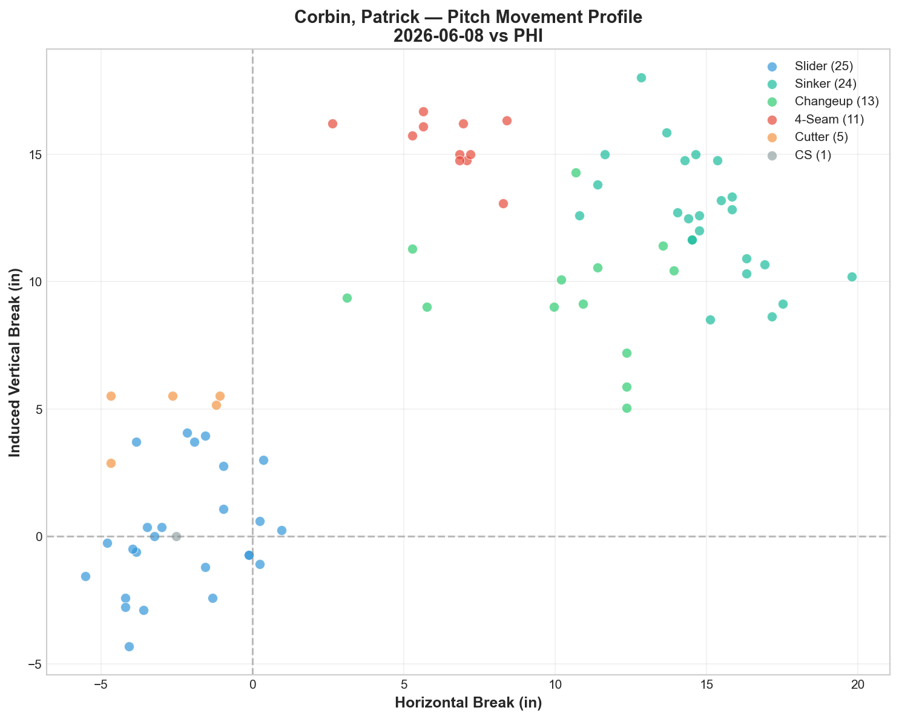
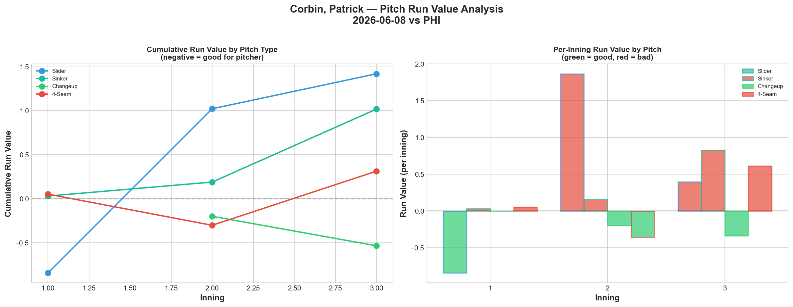
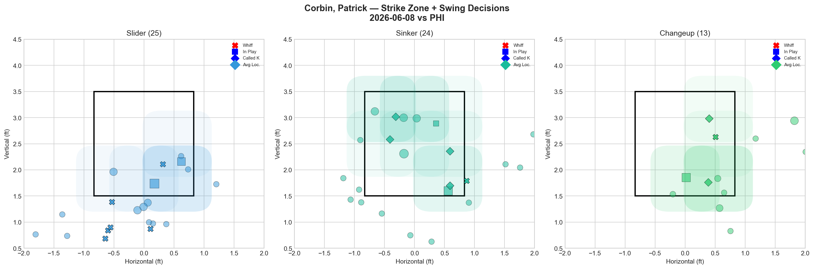
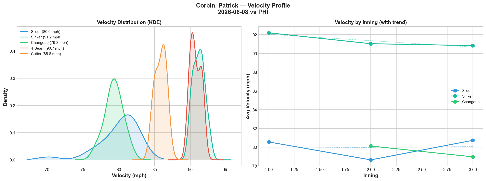
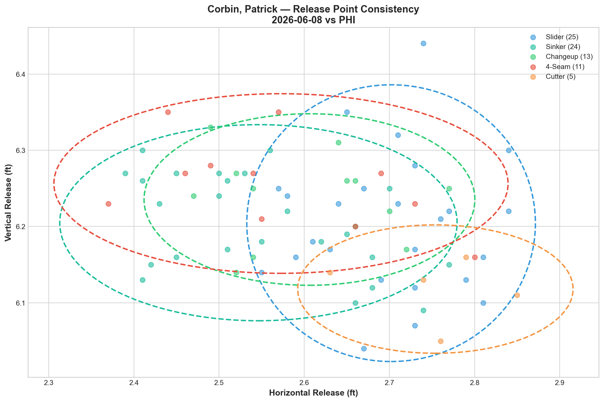
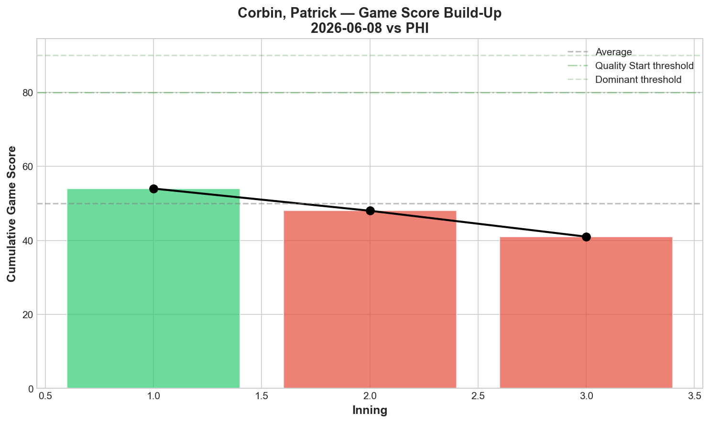
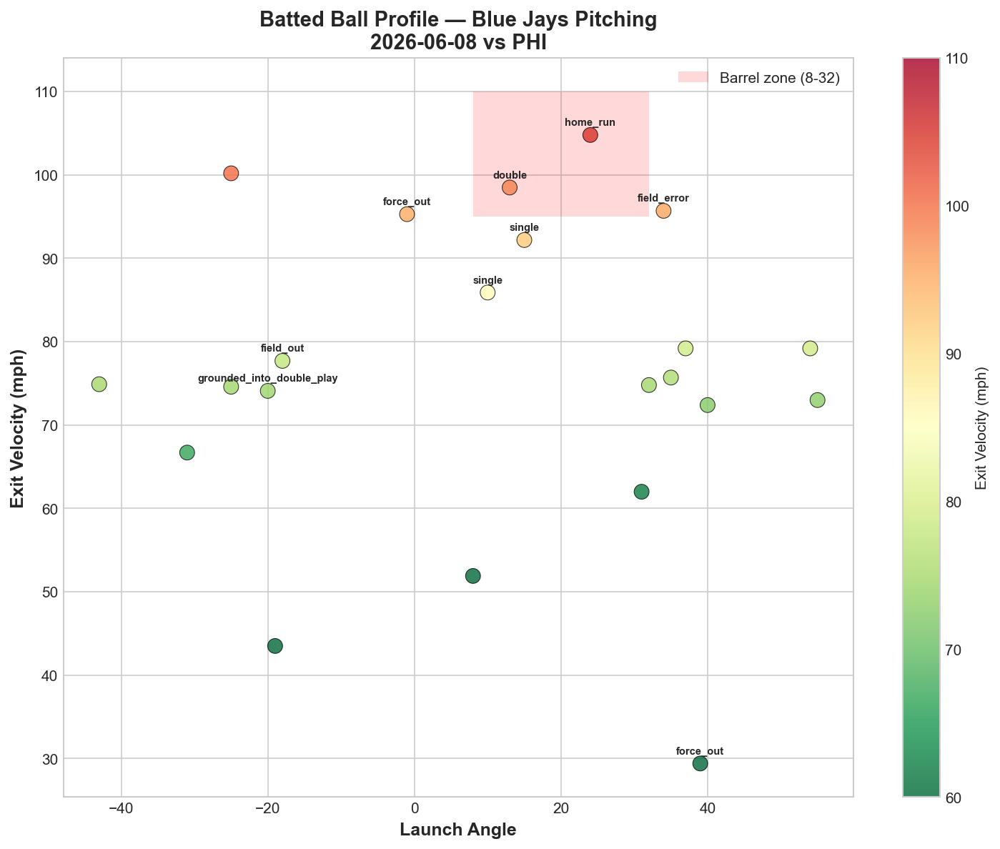
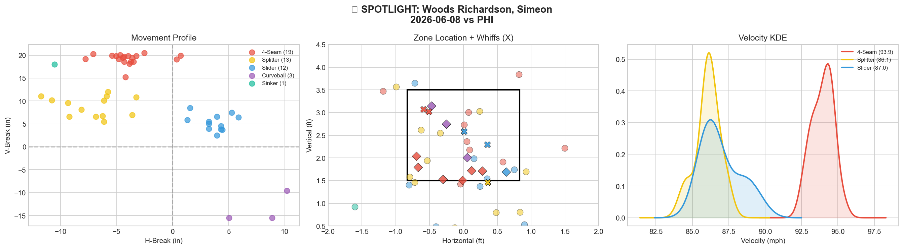
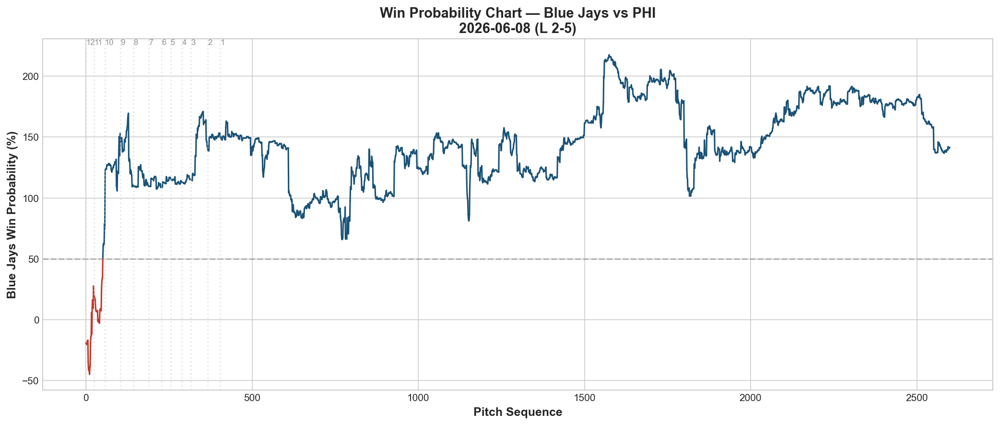
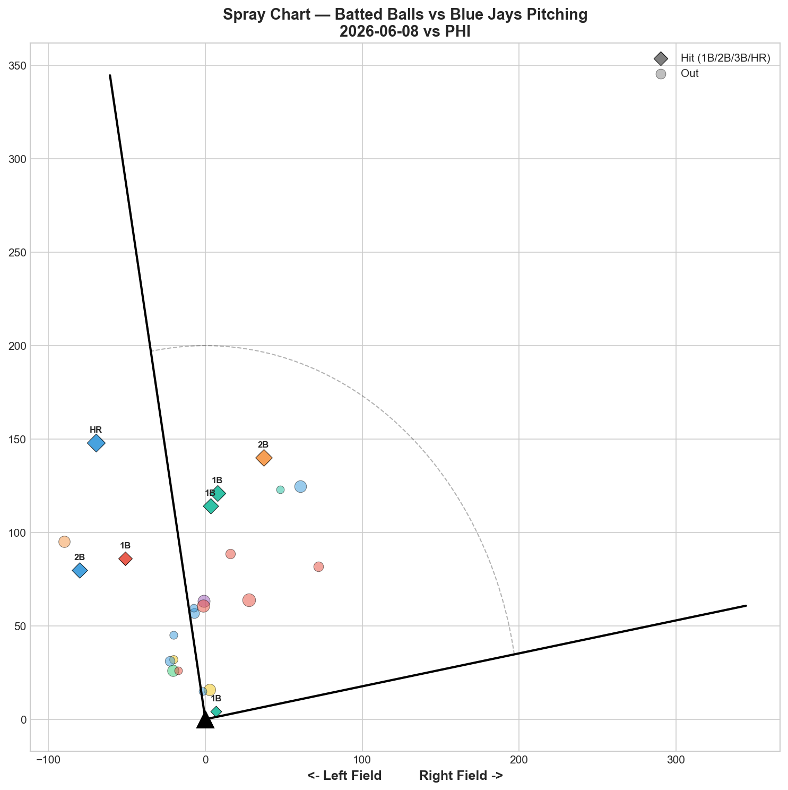

# 🏟️ Blue Jays Game Report v2.1
## 2026-06-08 | TOR vs PHI | L 2-5

---

## 📋 Game Overview

| | |
|---|---|
| **Date** | 2026-06-08 |
| **Matchup** | Philadelphia Phillies @ Toronto Blue Jays |
| **Result** | **L 2-5** |
| **Starter** | Patrick Corbin (80 pitches) |
| **Spotlight Pitcher** | Simeon Woods Richardson |
| **Season Record** | 32W-34L |

---

## 🔥 Key Storylines

### 1. The Changeup Is Now Confirmed as Corbin's Best Pitch — Not the Slider

Across 4 tracked starts, only one pitch has posted negative Run Value in every single outing: **the changeup.**

| Start | CH RV | SL RV | SI RV | Best Pitch |
|-------|-------|-------|-------|------------|
| 5/23 vs PIT | **-1.079** | -1.517 | +1.486 | SL |
| 5/28 vs BAL | **-0.090** | -1.509 | +1.634 | SL |
| 6/3 vs ATL | **-0.198** | +0.857 | -0.058 | CH |
| **6/8 vs PHI** | **-0.534** | **+1.420** | **+1.019** | **CH** |
| **Cumulative** | **-1.901** | **-0.749** | **+4.081** | — |

The slider has now flipped from dominant (-1.517, -1.509) to costly (+0.857, +1.420) across the last two starts. The changeup has been consistently effective (-1.079, -0.090, -0.198, -0.534). The case for a **changeup-first arsenal** is now overwhelming: CH -1.901 cumulative RV vs SI +4.081. That's a 6-run gap between his best and worst pitch across 4 starts.

### 2. Woods Richardson Delivered the Best Bulk Audition of the Month

Simeon Woods Richardson entered as the third pitcher and threw **48 pitches across 4 innings: 3K, 0BB, 1H, 0HR.** His slider posted 33.3% whiff (Grade A), his fastball posted 25% whiff with an elite 42.1% CSW (Grade B), and he added a splitter (16.7% whiff, Grade C) as a third look. Zero walks in 48 pitches is exactly the kind of command that earns a longer leash.

### 3. Corbin Held Harper, Turner, and Schwarber — But Still Lost

**Harper:** 0-for in 11 pitches. **Turner:** 0-for in 10 pitches. **Schwarber:** 0-for, 1K in 9 pitches. Corbin neutralized the Phillies' three biggest names — combined 0-for in 30 pitches. But the 5 walks gave Philadelphia free baserunners, and the damage came from the bottom of the order.

---

## ⚾ Starter Pitch Arsenal Analysis — Patrick Corbin

### Pitch Arsenal Performance (80 pitches)

| Pitch | # | Usage | Velo | Whiff% | CSW% | Chase% | Grade |
|-------|---|-------|------|--------|------|--------|-------|
| Slider | 25 | 31.2% | 80.0 | 40.0% | 24.0% | 47.4% | 🟢 A |
| Sinker | 24 | 30.0% | 91.2 | 14.3% | 20.8% | 7.1% | 🟡 C |
| Changeup | 13 | 16.2% | 79.3 | 12.5% | 23.1% | 50.0% | 🟡 C |
| 4-Seam | 11 | 13.8% | 90.7 | 25.0% | 9.1% | 12.5% | 🟢 B |
| Cutter | 5 | 6.2% | 85.8 | 0.0% | 40.0% | 50.0% | 🔴 D |
| Slow Curve | 1 | 1.2% | 57.7 | 0.0% | 0.0% | 0.0% | 🔴 D |

The slider at 40% whiff graded A again — but the whiff/RV disconnect continues. The changeup graded only C by whiff (12.5%) yet posted the best run value. The lesson: **chase rate doesn't equal run prevention.** The changeup's 50% chase rate + negative RV means it's inducing bad swings in dangerous counts. The slider's 47.4% chase rate + positive RV means hitters are chasing on waste pitches but making good contact when it's in the zone.

### Pitch Movement (inches)

| Pitch | H-Break | V-Break | Count |
|-------|---------|---------|-------|
| Slider (SL) | -2.3 | 0.1 | 25 |
| Sinker (SI) | 14.9 | 12.5 | 24 |
| Changeup (CH) | 10.1 | 9.4 | 13 |
| 4-Seam (FF) | 6.4 | 15.4 | 11 |
| Cutter (FC) | -2.9 | 4.9 | 5 |

### Pitch Tunneling Analysis

| Pair | Release Sim | Plate Sep | Tunnel | Velo Gap |
|------|-------------|-----------|--------|----------|
| **Changeup/4-Seam** | **0.5in** | **7.1in** | **🟢 14.9** | **11.4mph** |
| Sinker/4-Seam | 0.7in | 9.0in | 🟢 12.9 | 0.5mph |
| Slider/Changeup | 1.2in | 15.5in | 🟢 12.8 | 0.7mph |
| Slider/Sinker | 1.9in | 21.2in | 🟢 11.3 | 11.2mph |
| Slider/4-Seam | 1.7in | 17.6in | 🟢 10.5 | 10.7mph |

**🏆 Best Tunnel: Changeup/4-Seam (score: 14.9)** — same pair that scored 45.8 on 6/3. Consistently his best tunnel geometry. The CH/FF pair should be the foundation of every at-bat.

The **Slider/Changeup pair at 12.8** with only 0.7 mph velocity gap is also notable — same speed, opposite break. This pair could be Corbin's secondary tunnel if he commits to a CH/SL primary arsenal.

### Pitch Run Value by Type

| Pitch | Total RV | Per Pitch | Pitches | Assessment |
|-------|----------|-----------|---------|------------|
| Changeup | -0.534 | -0.0411 | 13 | ✅ Best pitch (4th straight) |
| 4-Seam | +0.314 | +0.0285 | 11 | ⚠️ Leaked |
| Sinker | +1.019 | +0.0425 | 24 | 🔴 Back to costly |
| Slider | +1.420 | +0.0568 | 25 | 🔴 Whiff/RV disconnect |
| Cutter | +0.832 | +0.1664 | 5 | 🔴 Worst per-pitch |

### Pitch Selection by Count — Full Count Progress

| Situation | Primary | Secondary | Notes |
|-----------|---------|-----------|-------|
| First Pitch (0-0) | Sinker 38.9% | Slider 22.2% | Still sinker-first |
| Ahead | SL 27.8% | FF/CH/SI 22.2% each | Balanced |
| Behind | **Slider 42.9%** | Sinker 33.3% | Slider when behind — new! |
| Even | SI/FF 26.3% each | SL/CH 21.1% each | Balanced |
| Full Count (3-2) | **Slider 75.0%** | Sinker 25.0% | **Slider dominant — major improvement!** |

**Full count evolution:** 100% sinker (5/28) → 42.9% sinker (6/3) → **75% slider (6/8).** Corbin has completely flipped his full-count approach from his worst pitch to his best whiff pitch. And he's now throwing slider 42.9% when behind in the count — up from 21.4% on 5/28. The sequencing adjustments are happening in real time.

**Strikeout Pitches (3 K's):** SL 2, CH 1.

### vs LHB/RHB Split

| Stand | Pitches | Avg Velo | Swinging Strikes | Whiff/Pitch |
|-------|---------|----------|------------------|-------------|
| L | 39 | 86.5 | 6 | 15.4% |
| R | 41 | 83.3 | 3 | 7.3% |

LHH whiff double the RHH rate (15.4% vs 7.3%). His slider/changeup combination plays better against lefties.

### Top Opposing Batters vs Corbin

| Batter | Pitches | Hits | K | BB | Avg EV |
|--------|---------|------|---|-----|--------|
| Bryson Stott | 14 | 1 | 0 | 1 | 76.9 |
| Bryce Harper | 11 | 0 | 0 | 1 | 83.2 |
| Trea Turner | 10 | 0 | 0 | 1 | 77.7 |
| Edmundo Sosa | 9 | 0 | 1 | 0 | 64.5 |
| Kyle Schwarber | 9 | 0 | 1 | 0 | — |

**Harper, Turner, Schwarber: combined 0-for in 30 pitches.** Corbin held the Phillies' three stars in check. But 5 total walks put runners on base that the bottom of the order cashed in.

### Velocity / Release / Game Score

- **Sinker:** 92.2 → 90.8 mph (-1.4 mph) — notable decline
- **Slider:** 80.6 → 80.7 mph (+0.2)
- **Changeup:** 80.1 → 79.0 mph (-1.1)

**Game Score: 41 (AVERAGE).** 3K, 4H, 0HR, 5BB on 80 pitches. The 5 walks dragged the score down despite 0 home runs allowed.

### Batted Ball Profile

| Metric | Value |
|--------|-------|
| Total BIP | 22 |
| Avg Exit Velo | 76.4 mph |
| Avg Launch Angle | 11.1° |
| Hard Hit (95+ mph) | 5/22 (23%) |

76.4 mph average EV is the lowest in any Corbin start we've tracked — the contact quality was actually weak. The loss came from walks, not barrels.

---

## 🔍 Spotlight Pitcher — Simeon Woods Richardson

| | |
|---|---|
| **Role** | Long relief (3rd pitcher, 4 innings) |
| **Pitch Count** | 48 |
| **Line** | 3K / 0BB / 1H / 0HR |
| **Overall Whiff%** | 25.0% |
| **Role Assessment** | ✅ SOLID RELIEVER |

### Pitch Arsenal

| Pitch | # | Usage | Velo | Whiff% | CSW% | Grade |
|-------|---|-------|------|--------|------|-------|
| 4-Seam | 19 | 39.6% | 93.9 | 25.0% | 42.1% | 🟢 B |
| Splitter | 13 | 27.1% | 86.1 | 16.7% | 7.7% | 🟡 C |
| Slider | 12 | 25.0% | 87.0 | 33.3% | 25.0% | 🟢 A |
| Curveball | 3 | 6.2% | 77.8 | 0.0% | 100.0% | 🔴 D |
| Sinker | 1 | 2.1% | 91.7 | 0.0% | 0.0% | 🔴 D |

### Assessment

Woods Richardson's 4-inning, 48-pitch outing was the cleanest long-relief performance we've seen from a non-regular this season. The key numbers:

**3K, 0BB, 1H, 0HR in 48 pitches.** That's elite efficiency — 12 pitches per inning, zero free passes.

His **slider at 33.3% whiff (Grade A)** was the swing-and-miss weapon. His **4-seam at 93.9 mph with 25% whiff and 42.1% CSW (Grade B)** was the command pitch — more called strikes than any other Blue Jays fastball we've tracked recently. The splitter (16.7% whiff, Grade C) added a third speed/shape.

**Comparison to other bulk/long relief auditions:**

| Pitcher | Pitches | K | BB | H | HR | Best Pitch | Result |
|---------|---------|---|---|---|-----|-----------|--------|
| Miles (5/21 vs NYY) | 63 | 6 | 1 | 2 | 0 | CU 45.5% | W |
| Dallas (6/4 vs ATL) | 68 | 2 | 2 | 2 | 0 | ST 33.3% | W |
| Voth (5/29 vs BAL) | 70 | 0 | 4 | 5 | 3 | CU 42.9% | W |
| **SWR (6/8 vs PHI)** | **48** | **3** | **0** | **1** | **0** | **SL 33.3%** | L |

Woods Richardson's per-inning efficiency (3K/0BB in 4 IP) is the best of any bulk audition. The 0BB is particularly impressive — neither Miles (1BB), Dallas (2BB), nor Voth (4BB) achieved zero walks. If he can stretch to 65+ pitches, he's a viable rotation option.

---

## 📊 Bullpen Detailed Analysis

| Pitcher | Pitches | Line | Key Pitch | Notes |
|---------|---------|------|-----------|-------|
| **Simeon Woods Richardson** | 48 | 3K / 0BB / 1H / 0HR | SL 33.3% 🟢A, FF 42.1% CSW 🟢B | See spotlight — best bulk audition |
| **Adam Macko** | 19 | 1K / 1BB / 0H / 0HR | SL 20% whiff 🟢B | Consistent — 0H continues |
| **Tommy Nance** | 11 | 1K / 0BB / 2H / 0HR | SL 50% whiff 🟢A | First appearance in a while — slider still works |

### Bullpen Notes

- **Macko** continues to be reliable: 19 pitches, 1K, 0H. His slider (20% whiff, Grade B) wasn't at the 62-100% levels of his last two outings, but the zero-hit result is what matters. 12 appearances in, he hasn't allowed a hit in his last 4 outings.
- **Nance** returned after an extended absence: slider at 50% whiff (Grade A). Gave up 2 hits but the slider shows he still has a swing-and-miss weapon.

---

## 📈 Win Probability Analysis

---

## 📊 Spray Chart & Batted Ball Summary

| Metric | Value |
|--------|-------|
| Total batted balls tracked | 24 |
| Hits | 7 (29%) |
| Pull | 3 (13%) |
| Center | 17 (71%) |
| Oppo | 4 (17%) |

---

## 🎯 Analytical Takeaways

1. **The Changeup Is Corbin's Best Pitch — 4 Starts of Evidence** — Cumulative CH -1.901 RV vs SI +4.081 RV vs SL -0.749 RV. The changeup has posted negative run value in every single tracked start. It should be the primary pitch, not the tertiary one at 16.2% usage.

2. **Corbin's Full Count Approach Has Completely Transformed** — From 100% sinker (5/28) to 75% slider (6/8). He's also throwing slider 42.9% when behind in the count. These are real-time pitch selection adjustments that show coaching impact and self-awareness.

3. **Woods Richardson Belongs in the Bulk Conversation** — 48 pitches, 3K, 0BB, 1H across 4 innings. Best per-inning efficiency of any bulk audition this season. Slider (A-grade) + fastball (B-grade, 42.1% CSW) is a viable 2-pitch foundation. He should get a 65+ pitch opportunity next time.

4. **Corbin's Walks Are the Recurring Problem** — 5BB tonight, 5BB on 6/3. He's walking 3+ batters in every start now. Combined with the sinker leaking value, free baserunners + hittable sinkers = runs. The walk rate, not the contact quality (76.4 mph EV), is what's losing these games.

5. **Harper/Turner/Schwarber Neutralized** — 0-for in 30 combined pitches. Corbin can handle star hitters. It's the walks and the bottom-of-order execution that beat him.

6. **Game Classification: Walk Loss** — 76.4 mph average EV, 0 HR, but 5 walks. Free passes against a good Phillies team are fatal. Same story as Yesavage's 7-walk game on 5/30.

---

*Report generated from Statcast data via pybaseball. All pitch metrics sourced from Baseball Savant.*
