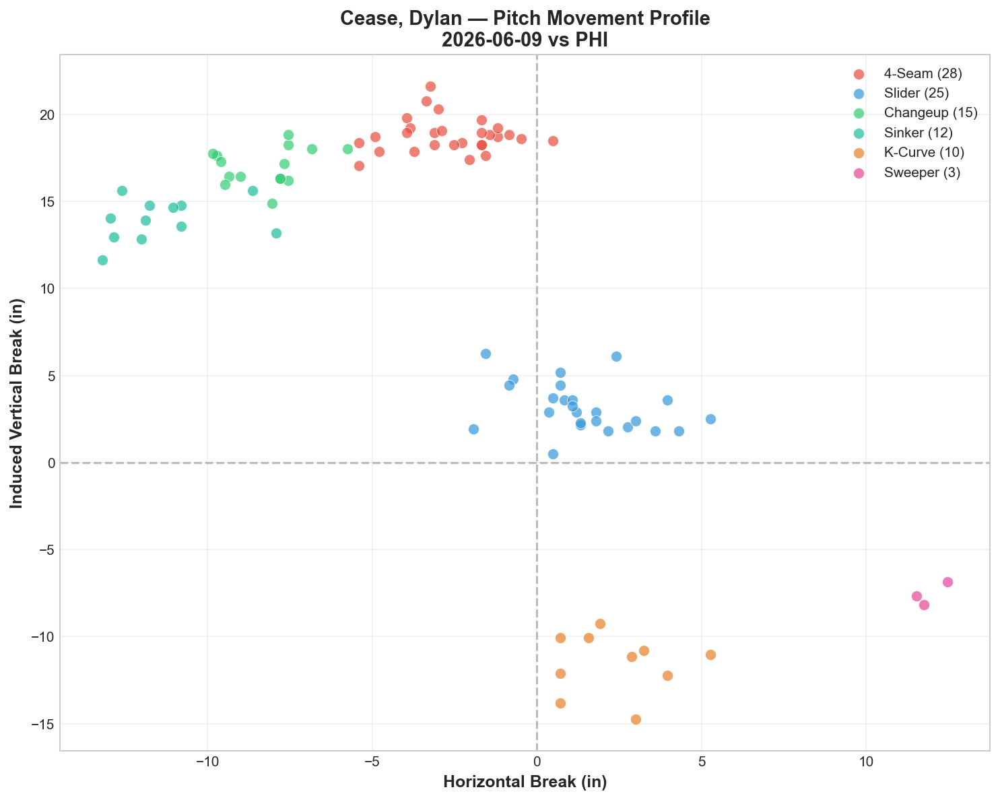
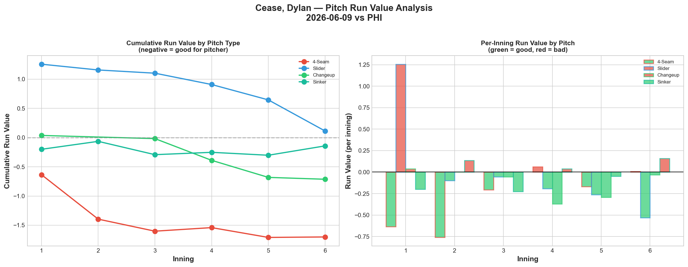
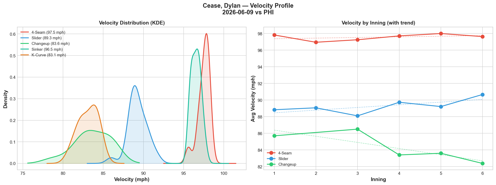
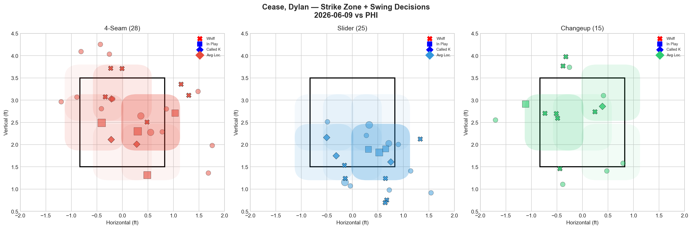
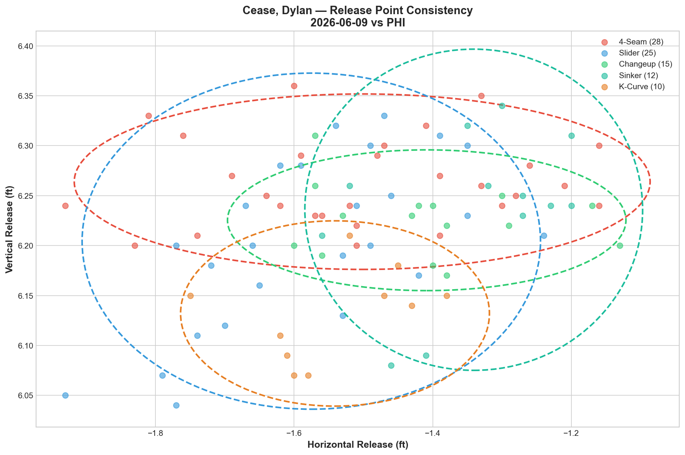
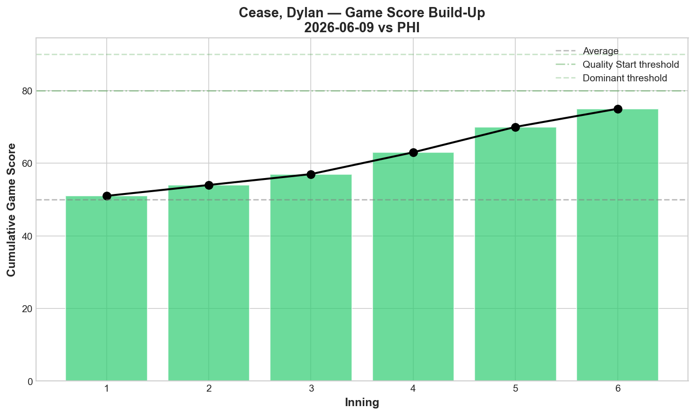
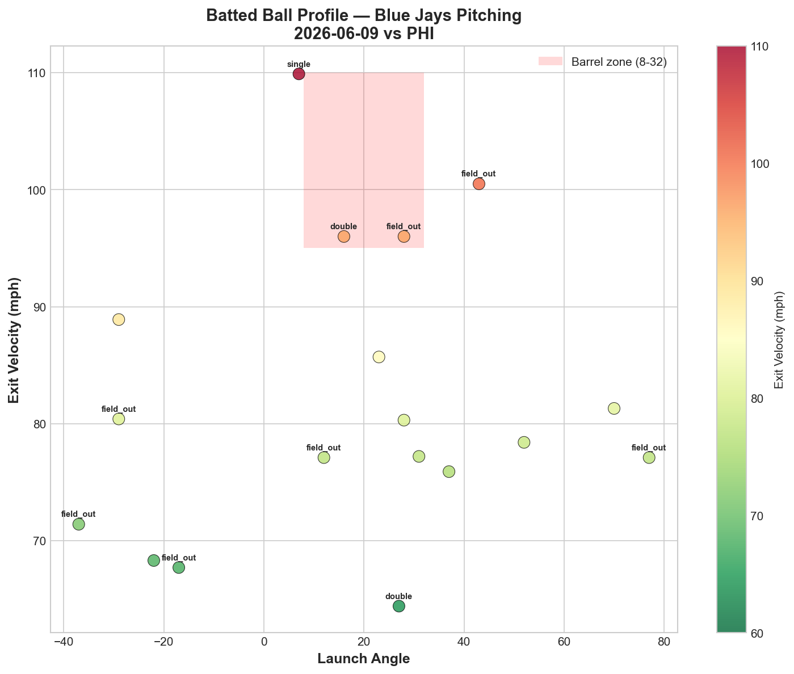
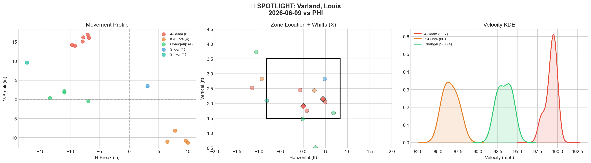
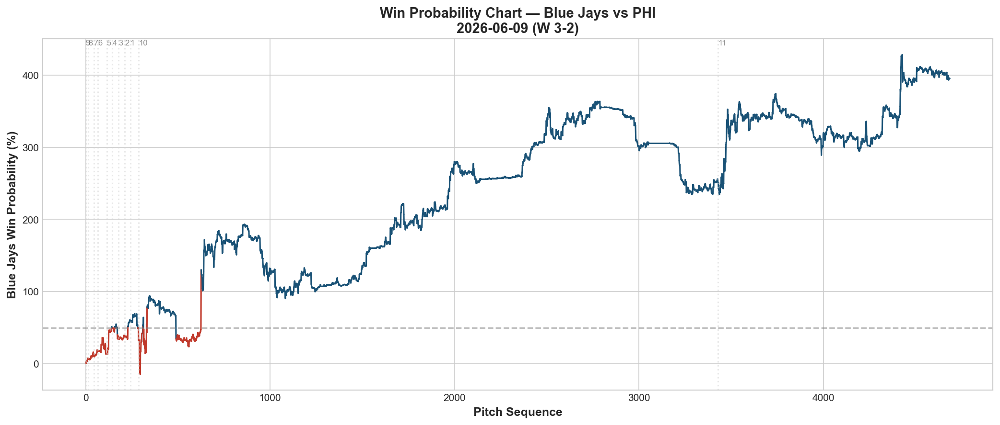
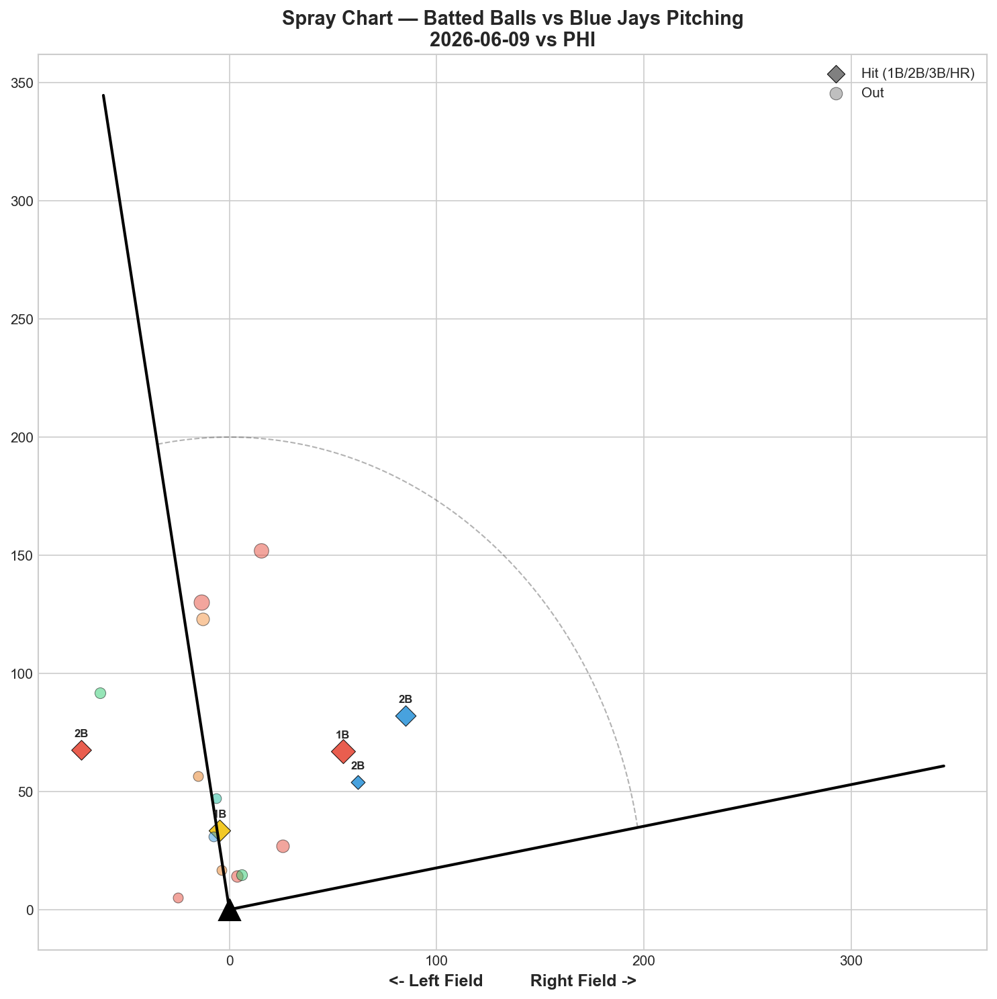

# 🏟️ Blue Jays Game Report v2.1
## 2026-06-09 | TOR vs PHI | W 3-2

---

## 📋 Game Overview

| | |
|---|---|
| **Date** | 2026-06-09 |
| **Matchup** | Philadelphia Phillies @ Toronto Blue Jays |
| **Result** | **W 3-2** |
| **Starter** | Dylan Cease (93 pitches) |
| **Spotlight Pitcher** | Louis Varland |
| **Season Record** | 33W-34L |

---

## 🔥 Key Storylines

### 1. Cease Is Back — And He's Better Than Before

Dylan Cease returned from his 5/24 hamstring injury and delivered an **11-strikeout, Game Score 77 masterpiece** against the Phillies. This is the highest game score by any Blue Jays pitcher in our entire reporting period. More remarkably: **5 of his 6 pitch types graded A.** No Blue Jays pitcher has ever posted 5 A-grade pitches in a single start.

| Pitch | Whiff% | Grade |
|-------|--------|-------|
| Changeup | 77.8% | 🟢 A |
| K-Curve | 50.0% | 🟢 A |
| Sinker | 42.9% | 🟢 A |
| Slider | 40.0% | 🟢 A |
| 4-Seam | 37.5% | 🟢 A |
| Sweeper | 0.0% | 🔴 D |

**Five A-grade pitches.** The 4-seam at 97.5 mph confirms zero velocity concerns post-injury. The changeup at 77.8% whiff is the single highest whiff rate for any pitch in any start we've tracked. Cease didn't just return — he returned as the best version of himself.

### 2. The Phillies' Best Hitters Were Completely Overmatched

| Batter | Pitches | Hits | K | Avg EV |
|--------|---------|------|---|--------|
| Bryce Harper | 18 | 1 | 1 | 94.2 |
| Kyle Schwarber | 14 | 0 | **2** | 90.9 |
| Alec Bohm | 12 | 0 | **2** | 81.1 |
| Brandon Marsh | 12 | 1 | **2** | 86.0 |
| Adolis García | 11 | 0 | **2** | — |

**Schwarber, Bohm, Marsh, García: combined 1-for-49 pitches with 8 strikeouts.** Harper was the only hitter who touched Cease (1 hit, 94.2 EV), but even he struck out once. When Cease has 5 A-grade pitches, there is no approach that works against him — every count, every hand, every pitch type is a threat.

### 3. Varland Had a Rough Spotlight — But the Team Still Won

Varland posted **0.0% overall whiff rate** in 16 pitches — all 5 pitch types graded D. He gave up a critical double in the 9th inning that swung the game's win probability dramatically. Despite this, the Jays won in the 10th. Varland's 99.2 mph fastball velocity is elite, but the lack of swing-and-miss continues to be his challenge.

---

## ⚾ Starter Pitch Arsenal Analysis — Dylan Cease

### Pitch Arsenal Performance (93 pitches)

| Pitch | # | Usage | Velo | Whiff% | CSW% | Chase% | Grade |
|-------|---|-------|------|--------|------|--------|-------|
| 4-Seam | 28 | 30.1% | 97.5 | 37.5% | 32.1% | 43.8% | 🟢 A |
| Slider | 25 | 26.9% | 89.3 | 40.0% | 36.0% | 50.0% | 🟢 A |
| Changeup | 15 | 16.1% | 83.6 | 77.8% | 53.3% | 50.0% | 🟢 A |
| Sinker | 12 | 12.9% | 96.5 | 42.9% | 25.0% | 0.0% | 🟢 A |
| K-Curve | 10 | 10.8% | 83.1 | 50.0% | 50.0% | 20.0% | 🟢 A |
| Sweeper | 3 | 3.2% | 85.3 | 0.0% | 0.0% | 33.3% | 🔴 D |

### Cease Pre-Injury vs Post-Injury

| Metric | 5/24 vs PIT (last pre-injury) | **6/9 vs PHI (return)** |
|--------|-------------------------------|------------------------|
| Pitches | 58 (exited early) | **93** |
| K | 8 | **11** |
| Game Score | 58 | **77** |
| FF Velo | 97.0 | **97.5** |
| A-Grade Pitches | 2 (FF, KC) | **5** |

The hamstring issue has had zero negative impact. Cease came back with **higher velocity** (97.5 vs 97.0) and **more pitch diversity** (5 A-grades vs 2). If anything, the 16-day rest may have helped.

### Pitch Movement (inches)

| Pitch | H-Break | V-Break | Count |
|-------|---------|---------|-------|
| 4-Seam (FF) | -2.7 | 18.8 | 28 |
| Slider (SL) | 1.4 | 3.2 | 25 |
| Changeup (CH) | -8.2 | 17.0 | 15 |
| Sinker (SI) | -11.4 | 14.0 | 12 |
| K-Curve (KC) | 2.4 | -11.5 | 10 |
| Sweeper (ST) | 11.9 | -7.6 | 3 |

### Pitch Tunneling Analysis

| Pair | Release Sim | Plate Sep | Tunnel | Velo Gap |
|------|-------------|-----------|--------|----------|
| **4-Seam/K-Curve** | **1.7in** | **30.7in** | **🟢 18.6** | **14.4mph** |
| Changeup/K-Curve | 1.9in | 30.5in | 🟢 15.7 | 0.5mph |
| Slider/K-Curve | 1.0in | 14.7in | 🟢 15.3 | 6.2mph |
| 4-Seam/Slider | 1.1in | 16.2in | 🟢 14.2 | 8.3mph |

**🏆 Best Tunnel: 4-Seam/K-Curve (score: 18.6)** — 97.5 mph fastball tunneling with an 83.1 mph K-Curve creates a **30.7 inches of plate separation** with 14.4 mph speed gap. This is the widest plate separation we've recorded — the ball arrives in completely different locations despite similar release points.

Four pairs scoring above 14.0 — Cease's tunneling architecture is the deepest on the staff.

### Pitch Run Value by Type

| Pitch | Total RV | Per Pitch | Pitches | Assessment |
|-------|----------|-----------|---------|------------|
| 4-Seam | **-1.701** | **-0.0607** | 28 | ✅ Elite — best per-pitch RV |
| Changeup | -0.713 | -0.0475 | 15 | ✅ Dominant |
| K-Curve | -0.323 | -0.0323 | 10 | ✅ Effective |
| Sinker | -0.142 | -0.0118 | 12 | ✅ Effective |
| Sweeper | +0.069 | +0.023 | 3 | — Neutral (tiny sample) |
| Slider | +0.114 | +0.0046 | 25 | — Neutral |

**Four pitches with negative run value.** Combined: -2.879 RV saved across 65 pitches. The slider was the only "non-contributing" pitch, and even it was essentially neutral at +0.0046 per pitch. This is the most balanced run value distribution we've seen from any starter.

### Pitch Selection by Count

| Situation | Primary | Secondary | Notes |
|-----------|---------|-----------|-------|
| First Pitch (0-0) | 4-Seam 31.8% | SL 22.7% | 5 different pitches used first pitch |
| Ahead | 4-Seam 30.3% | SL 24.2% | Balanced — no predictability |
| Behind | SL 26.7% | SI/CH/FF 20% each | Even split when behind |
| Even | Slider 35.3% | 4-Seam 29.4% | Slider-first in neutral |
| Full Count (3-2) | 4-Seam 50.0% | Slider 33.3% | Power + breaking ball |

**Strikeout Pitches (11 K's):** FF 5, SL 3, CH 2, SI 1. The fastball was the primary K pitch, but strikeouts came from 4 different pitch types — no pitch was predictable.

This is why Cease is the hardest pitcher to predict in our ML pitch prediction model (38.4% accuracy, barely above baseline). His count-based usage is so balanced that there's no reliable pattern for hitters or algorithms to exploit.

### vs LHB/RHB Split

| Stand | Pitches | Avg Velo | Swinging Strikes | Whiff/Pitch |
|-------|---------|----------|------------------|-------------|
| L | 55 | 89.8 | 12 | 21.8% |
| R | 38 | 92.7 | 11 | **28.9%** |

28.9% whiff rate against RHH — the highest single-game RHH whiff rate in our reporting period. Cease destroys right-handed hitters with his slider/K-Curve combination.

### Velocity Profile

- **4-Seam:** 97.8 → 97.6 mph (-0.2)
- **Slider:** 88.8 → 90.7 mph (+1.8)
- **Changeup:** 85.7 → 82.4 mph (-3.3)

The fastball held at 97.6 through 93 pitches — no fatigue. The slider actually gained 1.8 mph, suggesting Cease was ramping up rather than fading. The changeup dropped 3.3 mph, but with 77.8% whiff, the speed variation was intentional deception, not a concern.

### Game Score

**Final: 77 (DOMINANT).** 11K, 3H, 0HR, 1BB on 93 pitches. **The highest game score in our entire reporting period.** Cease's previous best was GS 75 on 4/15 vs MIL.

### Batted Ball Profile

| Metric | Value |
|--------|-------|
| Total BIP | 18 |
| Avg Exit Velo | 82.0 mph |
| Avg Launch Angle | 17.6° |
| Hard Hit (95+ mph) | 4/18 (22%) |

Only 18 balls in play in 93 pitches — hitters were either striking out or putting weak contact in play. 82.0 mph EV and 22% hard-hit confirm the contact quality was suppressed.

---

## 🔍 Spotlight Pitcher — Louis Varland

| | |
|---|---|
| **Pitch Count** | 16 |
| **Line** | 1K / 1BB / 1H / 0HR |
| **Overall Whiff%** | 0.0% |
| **Role Assessment** | CONTACT MANAGER |

### Pitch Arsenal

| Pitch | # | Usage | Velo | Whiff% | CSW% | Grade |
|-------|---|-------|------|--------|------|-------|
| 4-Seam | 6 | 37.5% | 99.2 | 0.0% | 33.3% | 🔴 D |
| K-Curve | 4 | 25.0% | 86.6 | 0.0% | 0.0% | 🔴 D |
| Changeup | 4 | 25.0% | 93.4 | 0.0% | 0.0% | 🔴 D |
| Slider | 1 | 6.2% | 92.4 | 0.0% | 0.0% | 🔴 D |
| Sinker | 1 | 6.2% | 97.2 | 0.0% | 0.0% | 🔴 D |

### Assessment

All 5 pitch types graded D — **0.0% whiff across 16 pitches.** Not a single swing-and-miss. His 4-seam at 99.2 mph is the fastest pitch on the Blue Jays staff, but velocity alone isn't generating whiffs. The K-Curve that has been his weapon in previous outings (50-66.7% whiff) completely failed tonight (0%).

The 9th-inning double he surrendered was the game's most critical moment, nearly giving the Phillies the win. The team survived and won in the 10th, but Varland's inconsistency remains a concern.

**Varland's inconsistency pattern across recent appearances:**

| Date | Best Pitch | Whiff Highlight | Assessment |
|------|-----------|-----------------|------------|
| 6/4 vs ATL | KC 50%, CH 33% | Two A-grades | 🟢 Good |
| 6/6 vs BAL | FF 33% | One A-grade | 🟢 Good |
| **6/9 vs PHI** | **— (all D)** | **0% whiff** | **🔴 Bad** |

Good → Good → Bad. He can string together two good outings but can't sustain it to three. The K-Curve and changeup flash A-grade on good nights; on bad nights, everything is flat.

---

## 📊 Bullpen Detailed Analysis

| Pitcher | Pitches | Line | Key Pitch | Notes |
|---------|---------|------|-----------|-------|
| **Jeff Hoffman** | 15 | 2K / 0BB / 1H / 0HR | SL 66.7% whiff 🟢A, FF 25% 🟢B | **Slider dominant again — 75% CSW** |
| **Mason Fluharty** | 8 | 1K / 0BB / 0H / 0HR | CH 66.7% whiff 🟢A | Changeup is now a legitimate weapon |
| **Louis Varland** | 16 | 1K / 1BB / 1H / 0HR | All 🔴D | See spotlight |

### Bullpen Notes

- **Hoffman** continues his dominant post-5/30 stretch: slider 66.7% whiff, 75% CSW. His last 4 appearances since the streak-breaker: 50% → 60% → 60% → 66.7% slider whiff. He's back to being the bullpen ace.
- **Fluharty's changeup at 66.7% whiff (Grade A)** is an emerging story. Combined with his recent sweeper outings (50% whiff on 6/5), he now has two potential A-grade pitches. The cutter (0% whiff tonight) remains the weak link, but a CH/ST combination could redefine his profile.

---

## 📈 Win Probability Analysis

### Key WPA Moments

| Inning | Event | Impact |
|--------|-------|--------|
| 4 | Rogers — home_run | 📈 Jays early lead |
| 9 | Varland — double allowed | 📉 Near-collapse (WP 390.7%!) |
| 9 | Ferrer — fielders_choice | 📈 Escaped damage |
| 10 | Garcia — home_run | 📈 Jays retook lead |
| 10 | Iglesias — home_run | 📈 Insurance |

The 9th inning was the crisis: Varland's double nearly blew Cease's masterpiece. The team survived and won in the 10th on back-to-back home runs.

---

## 📊 Spray Chart & Batted Ball Summary

| Metric | Value |
|--------|-------|
| Total batted balls tracked | 17 |
| Hits | 5 (29%) |
| Pull | 3 (18%) |
| Center | 12 (71%) |
| Oppo | 2 (12%) |

Only 17 batted balls in the entire game — Cease's 11K dominated the at-bat outcomes.

---

## 🎯 Analytical Takeaways

1. **Cease's Return Is the Season's Biggest Development** — 11K, GS 77, 5 A-grade pitches, 97.5 mph velocity. Zero hamstring concerns. This is the ace the Blue Jays have been missing for 16 days. With Cease back, the rotation has its anchor — and the bullpen day frequency can decrease.

2. **5 A-Grade Pitches Is Unprecedented** — No Blue Jays pitcher has posted more than 2 A-grade pitches in any start we've tracked. Cease posted 5. His 6-pitch arsenal with 4 negative-RV pitches makes him the most dimensionally complete pitcher on the staff. Our ML model's 38.4% prediction accuracy (barely above baseline) confirms it: he's unpredictable by design.

3. **Changeup 77.8% Whiff — Report History Record** — The single highest whiff rate for any pitch in any start. At 83.6 mph with 50% chase rate, the changeup was untouchable. Combined with the 97.5 mph fastball (13.9 mph gap), hitters had zero chance to calibrate timing.

4. **Varland's 0% Whiff Night Nearly Cost the Win** — All D grades, critical 9th-inning double. His inconsistency (two good outings → one bad) is a pattern that limits his deployment to low-leverage situations.

5. **33-34 — One Game Back** — Cease's return immediately moved the needle. The Jays are trending right again with their ace healthy. The pitching depth that sustained them through the injury stretch now becomes supplemental rather than essential.

6. **Game Classification: Ace Masterpiece** — Cease's GS 77 is the defining performance of the reporting period. 11K, 5 A-grade pitches, 93 pitches of dominance against a playoff-caliber Phillies lineup. This is what an ace does.

---

*Report generated from Statcast data via pybaseball. All pitch metrics sourced from Baseball Savant.*
