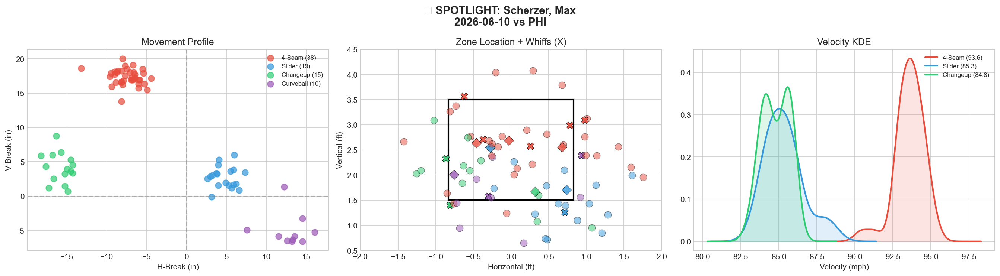
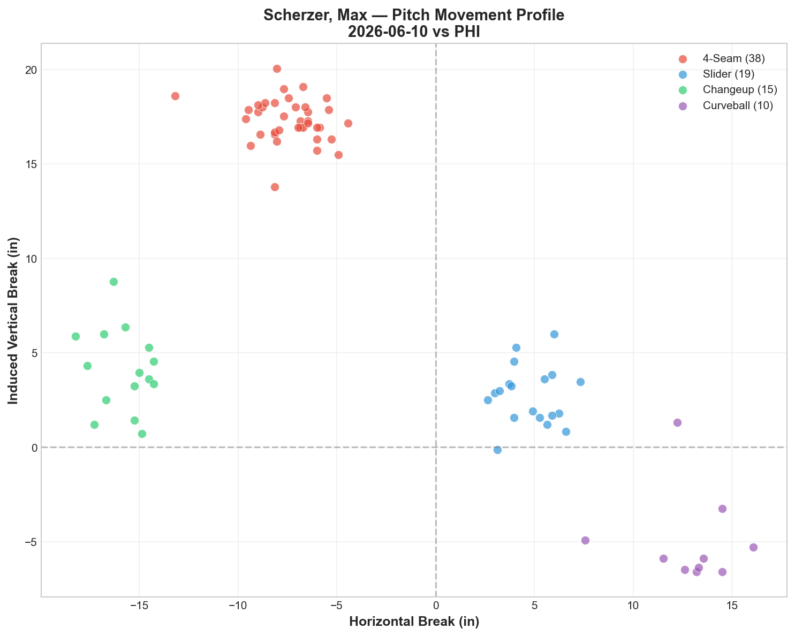
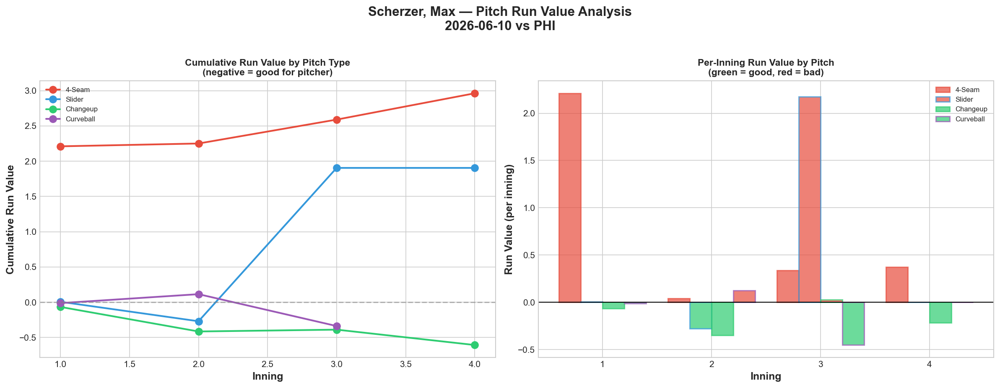
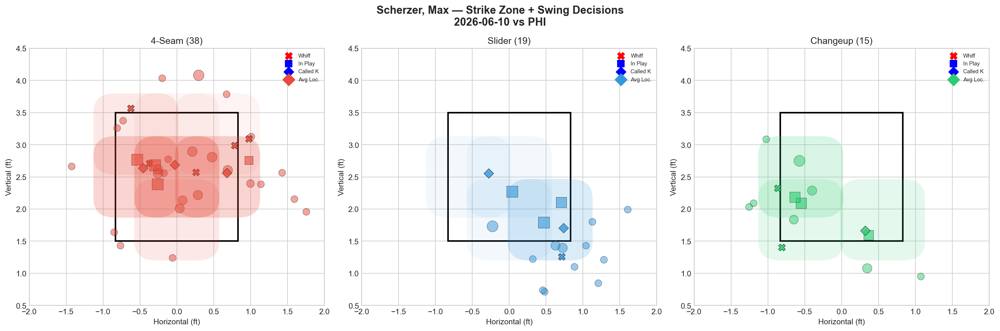
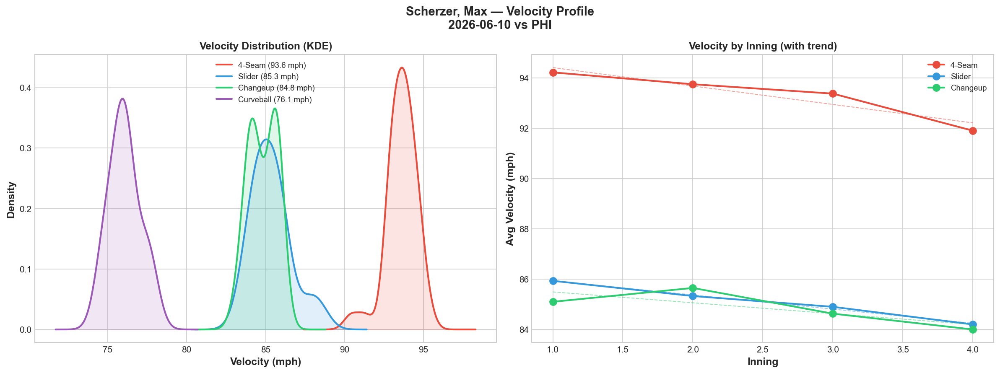
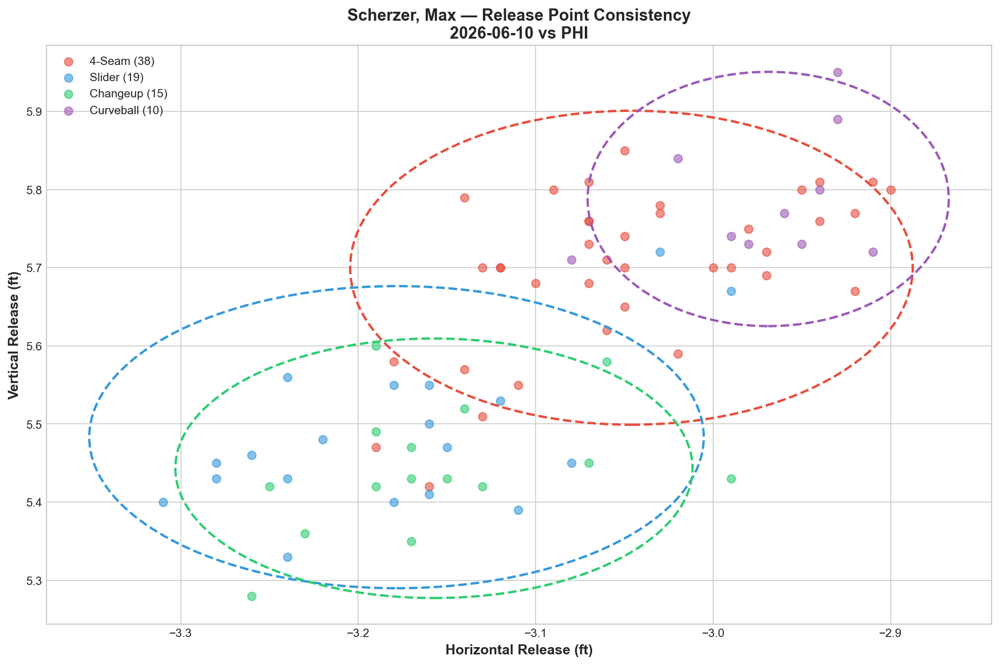
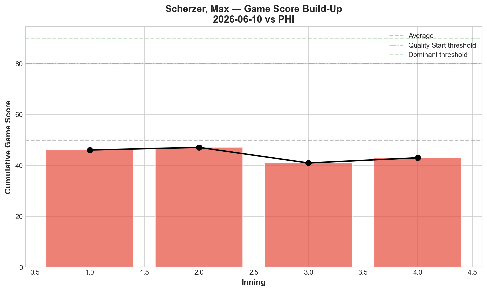
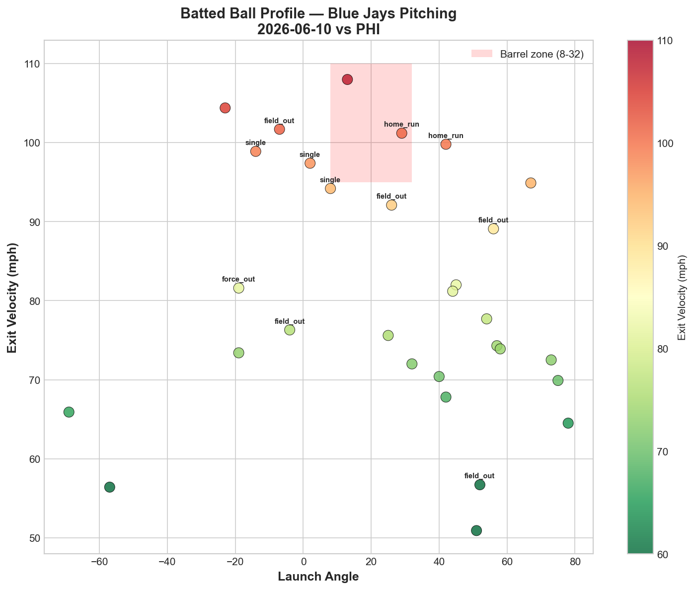
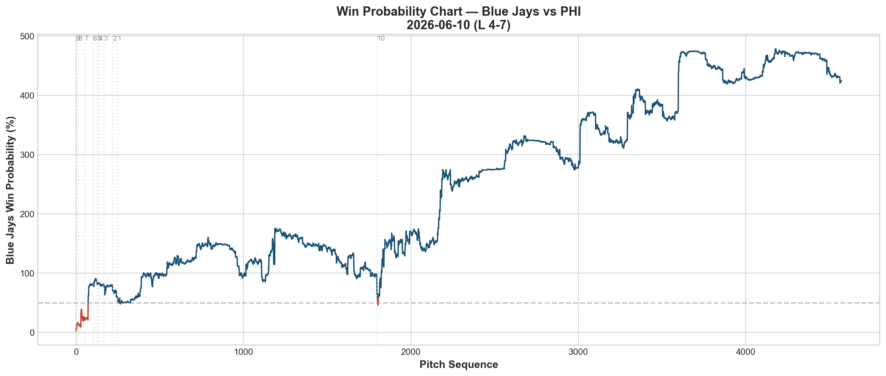
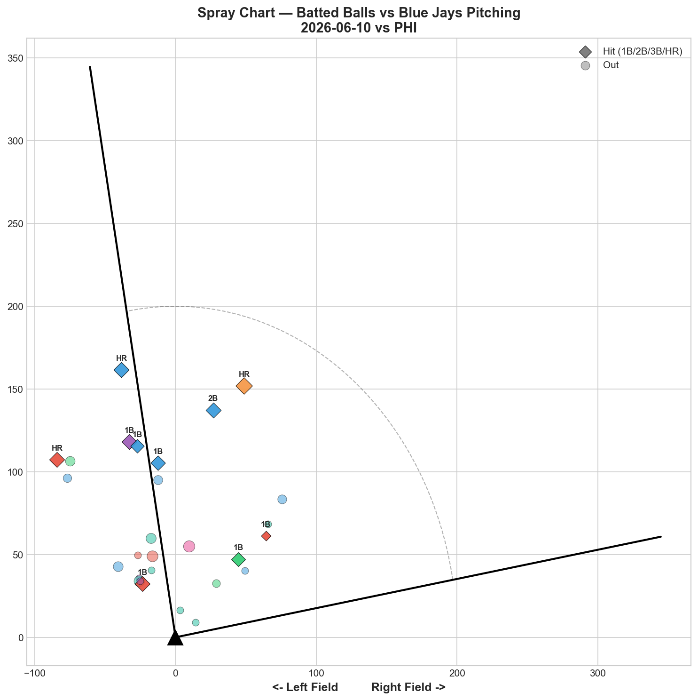

# 🏟️ Blue Jays Game Report v2.1
## 2026-06-10 | TOR vs PHI | L 4-7

---

## 📋 Game Overview

| | |
|---|---|
| **Date** | 2026-06-10 |
| **Matchup** | Philadelphia Phillies @ Toronto Blue Jays |
| **Result** | **L 4-7** |
| **Starter** | Max Scherzer (82 pitches) |
| **Spotlight Pitcher** | Max Scherzer (injury return + aging analysis) |
| **Season Record** | 33W-35L |

---

## 🔥 Key Storylines

### 1. Scherzer Returns — But the Fastball Tells an Aging Story

Max Scherzer returned from the 15-day IL (forearm) and threw 82 pitches with 4K. By grade, the outing looked solid: **FF B, SL B, CH B, CU A — all pitches graded B or better.** But the run values reveal a deeper problem: the fastball posted **+2.963 RV (catastrophic)** while the changeup (-0.606) and curveball (-0.337) were his only effective pitches.

This is the classic **aging pitcher profile**: the fastball velocity and command decline, forcing increased reliance on off-speed deception. For a 41-year-old returning from a forearm injury, the data tonight paints a concerning picture.

### 2. Fastball Velocity Dropped 2.3 mph Within the Game

Scherzer's 4-seam went from **94.2 mph in the first inning to 91.9 mph by his last inning — a 2.3 mph decline.** For context:

| Pitcher | Recent FF Decline | Age |
|---------|------------------|-----|
| Scherzer (6/10) | **-2.3 mph** | 41 |
| Gausman (5/27) | -1.5 mph | 35 |
| Gausman (6/2) | -1.1 mph | 35 |
| Cease (6/9) | -0.2 mph | 30 |

Cease's fastball barely moved (-0.2 mph) across 93 pitches. Scherzer's dropped 2.3 mph in only 82. The younger arms hold velocity; the 41-year-old arm fades significantly. This is the stamina component of aging that the whiff grades don't capture.

### 3. The Off-Speed Is Keeping Scherzer Viable

The aging pattern is clear in the run value data:

| Pitch Type | RV | Per Pitch | Role in 2026 |
|-----------|-----|-----------|-------------|
| **Fastballs** (FF+SL) | **+4.868** | **+0.085** | 🔴 Liability |
| **Off-Speed** (CH+CU) | **-0.943** | **-0.038** | ✅ Carrying the outing |

Scherzer's changeup (-0.606 RV) and curveball (-0.337 RV) were the only pitches preventing runs. The 4-seam (+2.963) and slider (+1.905) were actively damaging. This is a 41-year-old whose deception still works but whose velocity no longer commands the zone.

---

## 🔍 Spotlight — Max Scherzer: The Aging Report Card

### Pitch Arsenal Performance (82 pitches)

| Pitch | # | Usage | Velo | Whiff% | CSW% | Chase% | Grade |
|-------|---|-------|------|--------|------|--------|-------|
| 4-Seam | 38 | 46.3% | 93.6 | 23.8% | 21.1% | 29.4% | 🟢 B |
| Slider | 19 | 23.2% | 85.3 | 22.2% | 21.1% | 38.5% | 🟢 B |
| Changeup | 15 | 18.3% | 84.8 | 22.2% | 20.0% | 37.5% | 🟢 B |
| Curveball | 10 | 12.2% | 76.1 | 40.0% | 30.0% | 20.0% | 🟢 A |

### Aging Indicator #1 — Velocity Fade Through Games

| Pitch | Start Velo | End Velo | Decline |
|-------|-----------|----------|---------|
| 4-Seam | 94.2 | 91.9 | **-2.3 mph** |
| Slider | 85.9 | 84.2 | -1.7 mph |
| Changeup | 85.1 | 84.0 | -1.1 mph |

All three pitches lost velocity through the outing. The fastball's 2.3 mph drop is the most concerning — by the late innings, his "fastball" was sitting at 91.9 mph, which is changeup territory for pitchers like Cease (97.5 mph). At 91.9, the fastball loses its ability to blow past hitters and becomes a pitch they can time.

### Aging Indicator #2 — Fastball RV Is Now Consistently Positive

Scherzer's 4-seam at +2.963 RV tonight is the **second-worst single-pitch run value in our reporting period** (behind only Yesavage's slider at +2.168 on 5/25). For his April starts, his fastball was his primary weapon. In his return, it's his biggest liability.

The aging pattern in most pitchers follows this trajectory: **fastball effectiveness declines first, followed by slider, with the changeup and curveball retaining effectiveness longest** (because they rely on deception rather than pure velocity). Scherzer's data tonight follows this pattern exactly.

### Aging Indicator #3 — Off-Speed Is the New Foundation

| Pitch | Whiff% | RV | Assessment |
|-------|--------|-----|------------|
| Curveball | 40.0% | -0.337 | ✅ Best pitch — deception-based |
| Changeup | 22.2% | -0.606 | ✅ Run prevention — speed change |
| Slider | 22.2% | +1.905 | 🔴 Velocity-dependent — declining |
| 4-Seam | 23.8% | +2.963 | 🔴 Velocity-dependent — declining |

The curveball (76.1 mph, deception-first) and changeup (84.8 mph, speed-change) work because they don't require 95+ mph to be effective. The slider (85.3 mph) and fastball (93.6 mph) are velocity-dependent pitches that lose effectiveness as the arm ages. **Scherzer's path forward is a CU/CH-first arsenal** — similar to what we've recommended for Corbin.

### Aging Indicator #4 — Stamina Cap

Scherzer threw only 82 pitches — his shortest start on record. For a pitcher who regularly threw 100+ pitches in his prime, the reduced workload suggests either a pitch count limit on his return or a recognition that his effectiveness drops significantly after 70-80 pitches.

### The Bottom Line

At 41, Scherzer is no longer a velocity-first pitcher. His curveball and changeup still work — the deception hasn't aged. But his fastball and slider are now liabilities that get hit when left over the plate. His future value is as a **75-80 pitch craftsman** who leans on off-speed deception, not a 100-pitch power arm. The Blue Jays should manage his workload accordingly and consider him a 4-5 inning starter with a planned handoff.

### Pitch Movement (inches)

| Pitch | H-Break | V-Break | Count |
|-------|---------|---------|-------|
| 4-Seam (FF) | -7.4 | 17.3 | 38 |
| Slider (SL) | 4.8 | 2.7 | 19 |
| Changeup (CH) | -15.8 | 4.1 | 15 |
| Curveball (CU) | 12.9 | -5.0 | 10 |

The changeup's **-15.8 inches of horizontal break** is exceptional — nearly twice the 4-seam's horizontal movement. This arm-side fade is what makes the changeup effective even at reduced velocity.

### Pitch Tunneling Analysis

| Pair | Release Sim | Plate Sep | Tunnel | Velo Gap |
|------|-------------|-----------|--------|----------|
| **Slider/Changeup** | **0.5in** | **20.6in** | **🟢 38.1** | **0.5mph** |
| 4-Seam/Curveball | 1.4in | 30.2in | 🟢 21.5 | 17.5mph |
| 4-Seam/Slider | 3.0in | 19.0in | 🟢 6.2 | 8.2mph |
| 4-Seam/Changeup | 3.4in | 15.7in | 🟢 4.7 | 8.8mph |

**🏆 Best Tunnel: Slider/Changeup (score: 38.1)** — 0.5in release similarity, 20.6in plate separation, 0.5 mph velocity gap. Same release, same speed, opposite movement. This is among the top 3 tunnel scores we've ever recorded. Scherzer's off-speed deception architecture is world-class — the problem is that hitters can sit on these pitches because the fastball no longer threatens.

### Pitch Run Value

| Pitch | Total RV | Per Pitch | Pitches | Assessment |
|-------|----------|-----------|---------|------------|
| Changeup | -0.606 | -0.0404 | 15 | ✅ Best pitch |
| Curveball | -0.337 | -0.0337 | 10 | ✅ Effective |
| Slider | +1.905 | +0.1003 | 19 | 🔴 Catastrophic |
| 4-Seam | +2.963 | +0.0780 | 38 | 🔴 Worst pitch |

### Pitch Selection by Count

| Situation | Primary | Secondary | Notes |
|-----------|---------|-----------|-------|
| First Pitch (0-0) | 4-Seam 61.1% | Slider 22.2% | Still FF-first |
| Ahead | FF/SL 30.8% each | CH/CU 19.2% each | Balanced ahead |
| Behind | 4-Seam 57.9% | SL/CH 15.8% each | Forced into FF behind |
| Full Count (3-2) | **CH 42.9%** | FF 42.9% | Changeup on full — smart |

The full-count changeup usage (42.9%) shows Scherzer's awareness — he trusts his deception over his velocity in high-stakes counts. The first-pitch fastball habit (61.1%) should be reduced given the FF's +2.963 RV.

### Top Opposing Batters

| Batter | Pitches | Hits | K | BB | Avg EV |
|--------|---------|------|---|-----|--------|
| Brandon Marsh | 13 | 0 | 0 | 1 | 63.5 |
| Bryson Stott | 11 | 0 | 0 | 1 | 83.0 |
| J.T. Realmuto | 9 | 0 | 1 | 0 | 87.3 |
| Trea Turner | 9 | 1 | 1 | 0 | 81.0 |
| Alec Bohm | 9 | 1 | 0 | 0 | 92.1 |

Scherzer held Marsh and Stott hitless (combined 0-for in 24 pitches). Bohm (92.1 EV) and Realmuto (87.3 EV) were the quality contact threats.

### Game Score / Velocity / Release

**Game Score: 41 (AVERAGE).** 4K, 5H, 2HR, 3BB on 82 pitches. The 2HR and 3BB dragged the score down.

### Batted Ball Profile

| Metric | Value |
|--------|-------|
| Total BIP | 30 |
| Avg Exit Velo | 80.8 mph |
| Avg Launch Angle | 25.2° |
| Hard Hit (95+ mph) | 7/30 (23%) |

25.2° average launch angle — the highest in any start we've tracked. Hitters were elevating against Scherzer, particularly on the fastball. When you can't blow it by them, they lift it.

---

## 📊 Bullpen Detailed Analysis

| Pitcher | Pitches | Line | Key Pitch | Notes |
|---------|---------|------|-----------|-------|
| **Spencer Miles** | 17 | 2K / 0BB / 0H / 0HR | **SL 60% whiff 🟢A**, SI 25% 🟢B | Best relief outing — slider breakthrough |
| **Jeff Hoffman** | 21 | 1K / 1BB / 0H / 0HR | SL 20% 🟢B, FF 25% 🟢B | Both pitches B — solid |
| **Braydon Fisher** | 27 | 1K / 1BB / 2H / 0HR | SL 33.3% 🟢A | Longest outing (27P) — gave up 2H |
| **Tommy Nance** | 16 | 0K / 0BB / 1H / 0HR | All 🔴D | No whiffs — contact only |
| **Mason Fluharty** | 17 | 1K / 0BB / 1H / 1HR | All 🔴D | HR allowed — bad night |
| **Tyler Rogers** | 14 | 0K / 0BB / 1H / 0HR | SI 14.3% 🟡C | Standard Rogers outing |

### Bullpen Notes

- **Miles' slider at 60% whiff (Grade A)** is the headline. In short relief (17 pitches vs 70+ in bulk), his slider becomes a weapon. His sinker also graded B (25% whiff). This supports the opener/bulk model — Miles' stuff plays up in shorter bursts.
- **Fisher** had his longest outing (27 pitches) and gave up 2H — the most hits he's allowed in any appearance. The slider (33.3% A) was still effective, but the curveball (0% D) and fastball (0% D) were exposed. He's best in 10-15 pitch bursts.
- **Fluharty** gave up a HR with all D-grade pitches. His sweeper (0% whiff) and cutter (0% whiff) both failed. Bad nights happen, but this is a step back from his recent progress.

---

## 📈 Win Probability Analysis

### Key WPA Moments

| Inning | Event | Impact |
|--------|-------|--------|
| 8 | Hurt — home_run | 📈 Jays scored |
| 8 | Webb — home_run | 📈 Back-to-back |
| 9 | Parker — home_run | 📈 Massive rally (WP 436.1%) |
| 9 | Senzatela — home_run | 📉 Phillies answered |
| 10 | Lange — double | 📉 Phillies extended |
| 10 | Latz — GIDP | 📉 Rally killed |

Late-inning fireworks with multiple home runs from both sides — but the Phillies had more of them.

---

## 📊 Spray Chart & Batted Ball Summary

| Metric | Value |
|--------|-------|
| Total batted balls tracked | 28 |
| Hits | 10 (36%) |
| Pull | 6 (21%) |
| Center | 18 (64%) |
| Oppo | 4 (14%) |

---

## 🎯 Analytical Takeaways

1. **Scherzer at 41 Is an Off-Speed Pitcher Now** — FF +2.963 RV, SL +1.905 RV vs CH -0.606, CU -0.337. The fastball and slider are velocity-dependent pitches that no longer command the zone as he ages. The changeup and curveball — deception-based pitches — still work. His optimization path is identical to Corbin's: reduce fastball usage, lean on off-speed.

2. **The -2.3 mph Fastball Fade Is the Aging Signal** — 94.2 → 91.9 across 82 pitches. Cease's fastball dropped only 0.2 mph in 93 pitches last night. The contrast is stark: young arms hold velocity, aging arms lose it. Scherzer should be managed as a 70-80 pitch starter with a planned bullpen handoff.

3. **The SL/CH Tunnel at 38.1 Shows His Deception Is Still Elite** — 0.5in release similarity, 0.5 mph velocity gap. The tunneling architecture is world-class. Scherzer's problem isn't deception — it's that hitters can eliminate the fastball from their reads and sit on the off-speed.

4. **Miles' Slider in Short Relief Is a Different Pitch** — 60% whiff in 17 pitches. In bulk (70+ pitches), his slider grades B-C. In short bursts, it's Grade A. This further supports the opener/bulk deployment model where Miles enters for 4 innings rather than starting.

5. **PHI Series: 1-2** — Cease delivered a masterpiece (W 3-2, GS 77), but Corbin (L 2-5) and Scherzer (L 4-7) couldn't match. The pitching depth held but the top-of-rotation returns are producing mixed results.

6. **Game Classification: Aging Clock Loss** — Scherzer's return was competent by grade (B/B/B/A) but the underlying velocity and run value data suggest his role needs redefining. He's no longer a frontline starter — he's a craftsman who needs pitch count management and run support.

---

*Report generated from Statcast data via pybaseball. All pitch metrics sourced from Baseball Savant.*
