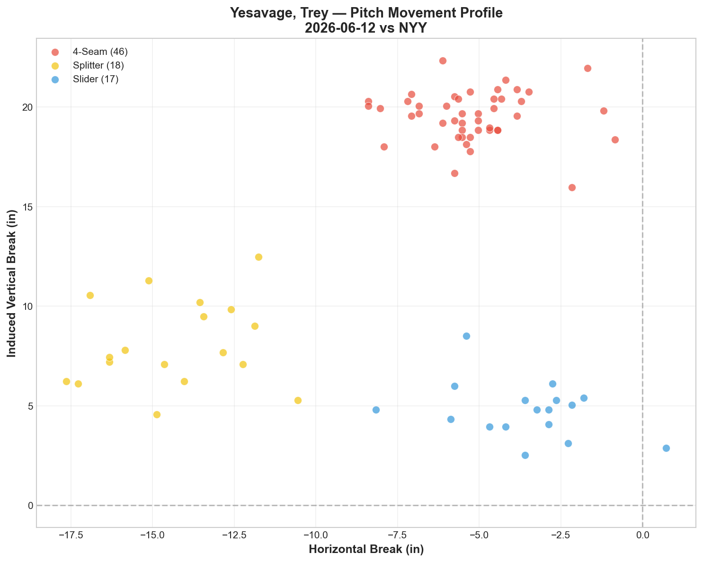
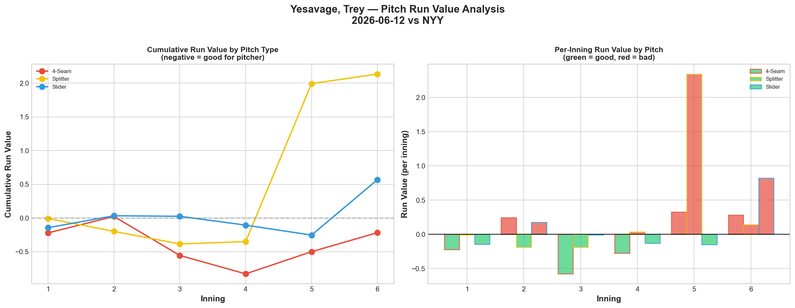
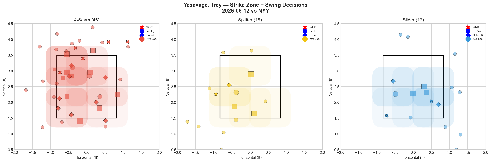
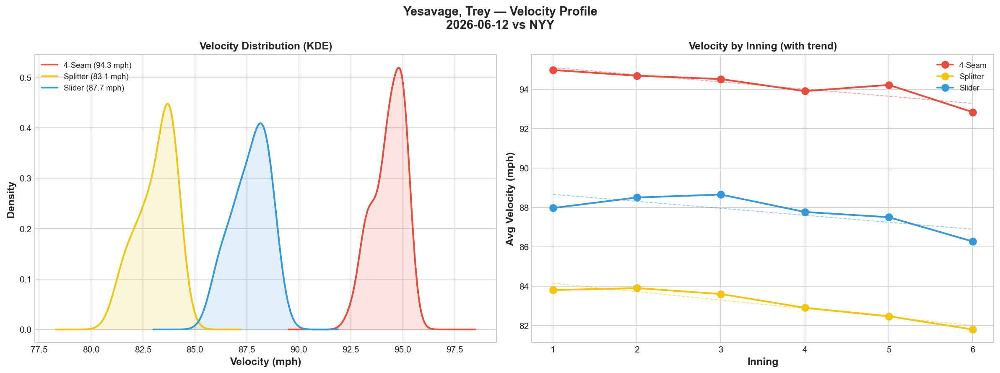
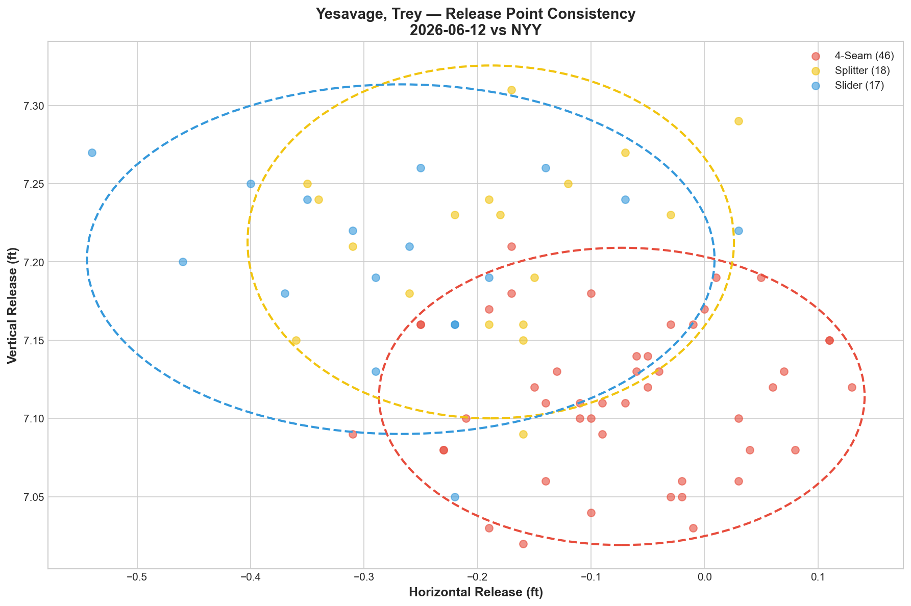
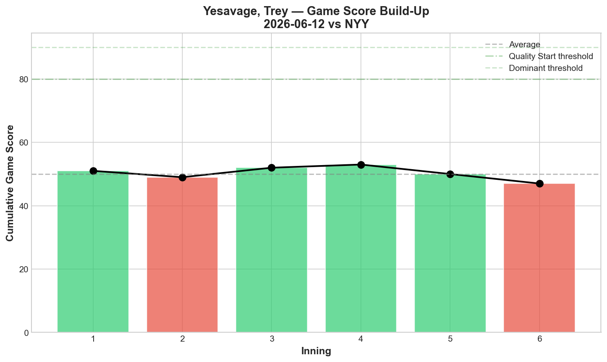
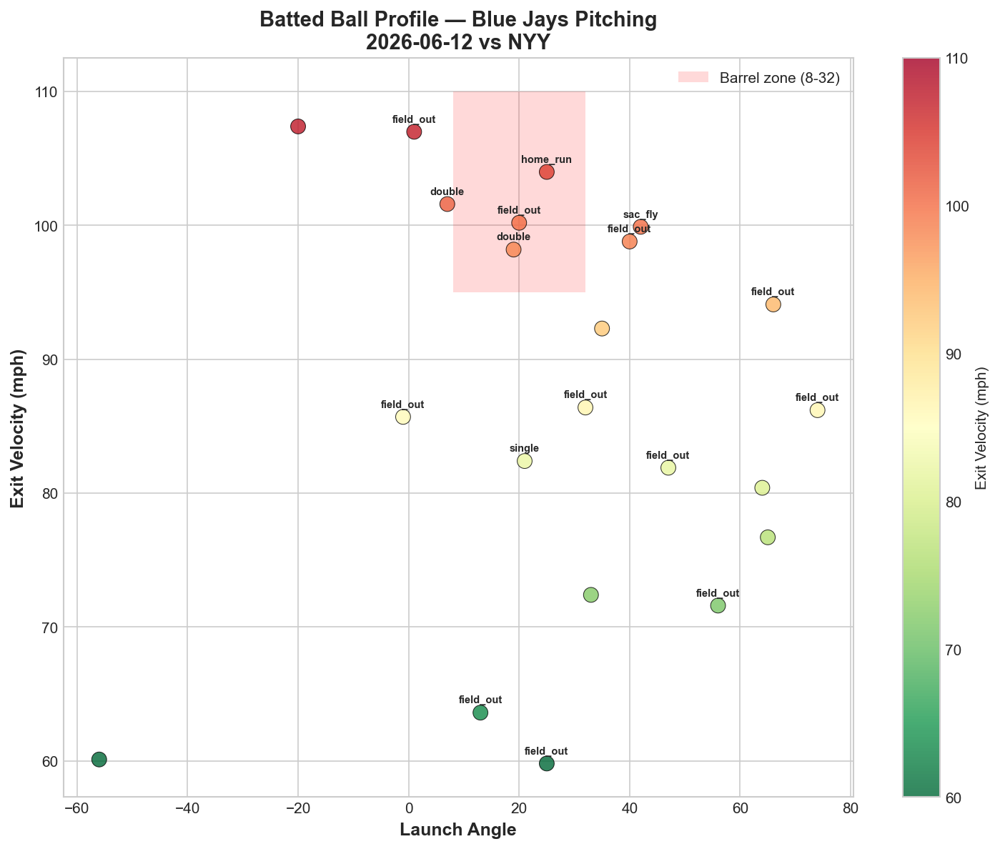
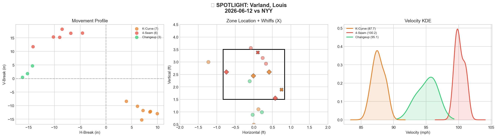
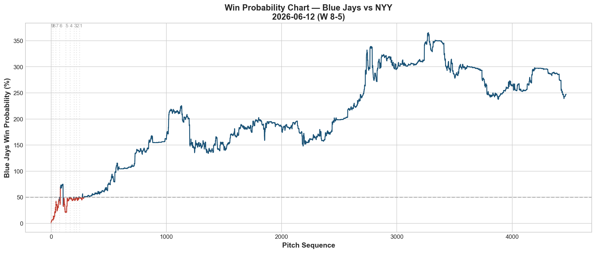
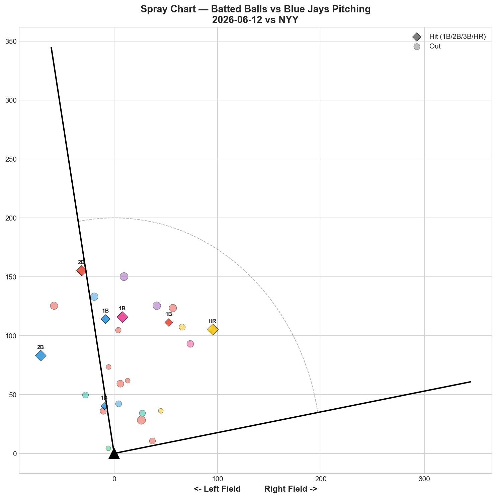

# 🏟️ Blue Jays Game Report v2.1
## 2026-06-12 | TOR vs NYY | W 8-5

---

## 📋 Game Overview

| | |
|---|---|
| **Date** | 2026-06-12 |
| **Matchup** | New York Yankees @ Toronto Blue Jays |
| **Result** | **W 8-5** |
| **Starter** | Trey Yesavage (81 pitches) |
| **Spotlight Pitcher** | Louis Varland |
| **Season Record** | 34W-35L |

---

## 🔥 Key Storylines

### 1. Yesavage's Walk Problem Has Become a Pattern — 6 BB Tonight

After walking 7 batters on 5/30, Yesavage walked **6 tonight** — his second game with 6+ walks in his last 3 starts. The walk trend across 5 starts is now undeniable:

| Start | BB | GS | Result |
|-------|----|----|--------|
| 5/20 vs NYY | 0 | 74 | **W** |
| 5/25 vs MIA | 2 | 64 | L |
| 5/30 vs BAL | **7** | 45 | L |
| 6/5 vs BAL | 2 | 52 | L |
| **6/12 vs NYY** | **6** | **44** | **W** |

**GS 74 → 64 → 45 → 52 → 44.** The overall downward trend is clear despite tonight's win. The offense bailed him out with 8 runs — something that won't happen every night. Two of his five starts have featured 6+ walks. That's an unsustainable rate.

### 2. The Splitter Collapsed — +2.136 RV (Worst Single-Pitch Outing)

The splitter, which was Yesavage's best pitch on 6/5 (-0.477 RV), posted **+2.136 RV tonight — the worst single-pitch run value in any Yesavage start.** At 14.3% whiff (Grade C) and +0.1187 per pitch, the splitter was actively destroying his outing. The whiff/RV disconnect continues but in a new direction: on 6/5, the slider had high whiffs but positive RV; tonight, the splitter simply didn't work at all.

### 3. Velocity Dropped Across All Three Pitches — A Stamina Concern

| Pitch | Start Velo | End Velo | Decline |
|-------|-----------|----------|---------|
| 4-Seam | 95.0 | 92.8 | **-2.1 mph** |
| Splitter | 83.8 | 81.8 | -2.0 mph |
| Slider | 88.0 | 86.3 | -1.7 mph |

**All three pitches lost significant velocity.** The 4-seam's -2.1 mph decline mirrors Scherzer's -2.3 mph fade yesterday — but Yesavage is 26 years old, not 41. This isn't aging; it's stamina. In only 81 pitches, his velocity dropped as much as Scherzer's did in 82. This suggests either fatigue accumulation from his workload or a mechanical efficiency issue that causes faster velocity drain.

### 4. Varland Bounced Back With His Best K-Curve Outing

After an all-D, 0% whiff disaster on 6/9, Varland returned with **K-Curve at 66.7% whiff (Grade A) and 4-seam at 100.2 mph with 25% whiff (Grade B).** Clean line: 2K, 0BB, 0H. The good Varland is legitimately elite — the problem is predicting which version shows up.

---

## ⚾ Starter Pitch Arsenal Analysis — Trey Yesavage

### Pitch Arsenal Performance (81 pitches)

| Pitch | # | Usage | Velo | Whiff% | CSW% | Chase% | Grade |
|-------|---|-------|------|--------|------|--------|-------|
| 4-Seam | 46 | 56.8% | 94.3 | 27.8% | 28.3% | 25.0% | 🟢 B |
| Splitter | 18 | 22.2% | 83.1 | 14.3% | 11.1% | 16.7% | 🟡 C |
| Slider | 17 | 21.0% | 87.7 | 33.3% | 23.5% | 0.0% | 🟢 A |

56.8% fastball usage — the highest of any Yesavage start. He leaned on the heater despite the whiff grade being lower than the slider. The slider at 33.3% whiff (Grade A) should have been the primary pitch.

### Yesavage Five-Start Trend — The Full Picture

| Start | GS | K | BB | FF RV | SL RV | FS RV | Best Pitch |
|-------|----|----|-----|-------|-------|-------|------------|
| 5/20 vs NYY | **74** | 8 | 0 | -0.851 | -2.006 | -0.915 | Slider |
| 5/25 vs MIA | 64 | 6 | 2 | -1.993 | +2.168 | -0.624 | 4-Seam |
| 5/30 vs BAL | 45 | 4 | **7** | +0.273 | +0.020 | +0.113 | Slider |
| 6/5 vs BAL | 52 | 5 | 2 | +1.806 | +1.896 | -0.477 | Splitter |
| **6/12 vs NYY** | **44** | **3** | **6** | **-0.217** | **+0.569** | **+2.136** | **4-Seam** |

**No pitch has been consistently effective across all 5 starts.** The 4-seam has been the "best pitch" in 2 of 5 starts (5/25, 6/12), the slider in 2 (5/20, 5/30), and the splitter in 1 (6/5). This volatility is Yesavage's defining characteristic — he doesn't have a reliable anchor pitch.

### Pitch Movement (inches)

| Pitch | H-Break | V-Break | Count |
|-------|---------|---------|-------|
| 4-Seam (FF) | -5.2 | 19.5 | 46 |
| Splitter (FS) | -14.3 | 8.1 | 18 |
| Slider (SL) | -3.6 | 4.8 | 17 |

### Pitch Tunneling Analysis

| Pair | Release Sim | Plate Sep | Tunnel | Velo Gap |
|------|-------------|-----------|--------|----------|
| **Splitter/Slider** | **1.0in** | **11.2in** | **🟢 11.7** | **4.5mph** |
| 4-Seam/Splitter | 1.8in | 14.6in | 🟢 8.0 | 11.2mph |
| 4-Seam/Slider | 2.6in | 14.9in | 🟢 5.8 | 6.7mph |

Tunneling scores are lower than his best outings (17.4 on 6/5, 13.0 on 5/30). The deception geometry is declining alongside the velocity.

### Pitch Run Value by Type

| Pitch | Total RV | Per Pitch | Pitches | Assessment |
|-------|----------|-----------|---------|------------|
| 4-Seam | -0.217 | -0.0047 | 46 | — Barely negative |
| Slider | +0.569 | +0.0335 | 17 | 🔴 Leaked despite A whiff |
| Splitter | +2.136 | +0.1187 | 18 | 🔴 Catastrophic |

- 🏆 **Most Effective:** 4-Seam (-0.0047 per pitch — marginal)
- ⚠️ **Least Effective:** Splitter (+0.1187 per pitch — worst in any Yesavage start)

### Pitch Selection by Count

| Situation | Primary | Secondary | Notes |
|-----------|---------|-----------|-------|
| First Pitch (0-0) | 4-Seam 56.0% | Slider 24.0% | Heavy FF first |
| Ahead | 4-Seam 52.2% | SL 26.1% | Still FF-dominant ahead |
| Behind | 4-Seam 54.5% | FS/SL 22.7% each | FF when behind |
| Even | **4-Seam 70.0%** | Splitter 30.0% | Nearly all FF in even counts |
| Full Count (3-2) | 4-Seam 100% | — | All fastballs |

**70% fastball in even counts, 100% in full counts.** Yesavage defaults to the fastball in pressure situations. With the FF posting only -0.0047 per pitch RV, this isn't disastrous — but the slider (A-grade whiff) should be getting more of these at-bats.

### vs LHB/RHB Split

| Stand | Pitches | Avg Velo | Swinging Strikes | Whiff/Pitch |
|-------|---------|----------|------------------|-------------|
| L | 64 | 90.4 | 7 | 10.9% |
| R | 17 | 90.6 | 1 | 5.9% |

Only 17 pitches to RHH — heavily LHH-skewed lineup. 5.9% whiff against righties continues to be a weak spot.

### Top Opposing Batters

| Batter | Pitches | Hits | K | BB | Avg EV |
|--------|---------|------|---|-----|--------|
| Ben Rice | 14 | 0 | 0 | 2 | 72.0 |
| Spencer Jones | 13 | 0 | 1 | 2 | 92.3 |
| Trent Grisham | 11 | 0 | 0 | 0 | 86.7 |
| Paul Goldschmidt | 9 | 0 | 0 | 0 | 88.3 |
| Ryan McMahon | 8 | 0 | 0 | 1 | **100.2** |

**Every listed top batter went hitless.** Rice, Jones, Grisham, Goldschmidt, McMahon: 0-for combined. But Rice drew 2 walks and Jones drew 2 walks — the free passes were the problem, not the contact. McMahon's 100.2 mph avg EV means when he did make contact, it was violent — the BABIP luck favored Yesavage tonight.

### Velocity / Release / Game Score

**Game Score: 44 (AVERAGE).** 3K, 3H, 1HR, 6BB on 81 pitches.

### Batted Ball Profile

| Metric | Value |
|--------|-------|
| Total BIP | 22 |
| Avg Exit Velo | 86.9 mph |
| Avg Launch Angle | 27.6° |
| Hard Hit (95+ mph) | 8/22 (**36%**) |

86.9 mph EV and 36% hard-hit rate — the highest contact quality numbers in any Yesavage start. The win was BABIP-driven — the hard-hit balls went to fielders.

---

## 🔍 Spotlight Pitcher — Louis Varland

| | |
|---|---|
| **Pitch Count** | 16 |
| **Line** | 2K / 0BB / 0H / 0HR |
| **Overall Whiff%** | 37.5% |
| **Role Assessment** | 🔥 ELITE RELIEVER |

### Pitch Arsenal

| Pitch | # | Usage | Velo | Whiff% | CSW% | Grade |
|-------|---|-------|------|--------|------|-------|
| K-Curve | 7 | 43.8% | 87.7 | **66.7%** | **57.1%** | 🟢 A |
| 4-Seam | 6 | 37.5% | **100.2** | 25.0% | 50.0% | 🟢 B |
| Changeup | 3 | 18.8% | 95.1 | 0.0% | 0.0% | 🔴 D |

### Assessment — The Two Varlands

| Date | K-Curve | 4-Seam | Whiff% | Line | Version |
|------|---------|--------|--------|------|---------|
| 6/4 vs ATL | 50% A | 33.3% A | — | 0K/0BB/0H | 🟢 Good |
| 6/6 vs BAL | — | 33.3% A | — | 0K/0BB/0H | 🟢 Good |
| 6/7 vs BAL | 66.7% A | — | — | 2K/0BB/1H | 🟢 Good |
| 6/9 vs PHI | 0% D | 0% D | 0% | 1K/1BB/1H | 🔴 Bad |
| **6/12 vs NYY** | **66.7% A** | **25% B** | **37.5%** | **2K/0BB/0H** | **🟢 Good** |

Good outings outnumber bad ones 4-to-1 in his last 5 appearances. The pattern is emerging: **when the K-Curve is working (50%+ whiff), Varland is elite. When it's off (0%), everything collapses.** The K-Curve is a binary switch — on or off, no in-between.

Tonight's **100.2 mph fastball** is the hardest pitch thrown by any Blue Jays pitcher this season. At that velocity with a K-Curve at 87.7 mph, the 12.5 mph speed differential creates an almost impossible timing challenge. When both pitches are working simultaneously (tonight), Varland is one of the most dynamic arms in the bullpen.

**Development recommendation:** The changeup (0% whiff in 3 of his last 4 outings) should be deprioritized. Varland's ceiling is a two-pitch reliever: **100 mph 4-seam + 87 mph K-Curve.** That's enough.

---

## 📊 Bullpen Detailed Analysis

| Pitcher | Pitches | Line | Key Pitch | Notes |
|---------|---------|------|-----------|-------|
| **Louis Varland** | 16 | 2K / 0BB / 0H / 0HR | KC 66.7% 🟢A, FF 100.2mph 🟢B | See spotlight — elite version |
| **Tyler Rogers** | 7 | 1K / 0BB / 0H / 0HR | SI 25% whiff 🟢B | Clean 7 pitches |
| **Mason Fluharty** | 13 | 1K / 0BB / 1H / 0HR | ST 40% whiff 🟢A | Sweeper continues to deliver |
| **Braydon Fisher** | 26 | 1K / 1BB / 2H / 0HR | All pitches 🔴D | **Second straight all-D outing** |

### Bullpen Notes

- **Fisher** had his second straight rough outing: 0% whiff across slider, curveball, and fastball. After posting 0% whiff on 6/10, he's now gone 2 consecutive appearances without a single swing-and-miss. For a pitcher whose identity is the SL/CU tunnel, two back-to-back failures is concerning. He may need a rest day.
- **Fluharty** continues the sweeper-first approach: 61.5% sweeper usage, 40% whiff (A). The cutter (0% D) is still the drag. His identity is clear.
- **Rogers** was efficient — 7 pitches, 1K, clean.

---

## 📈 Win Probability Analysis

### Key WPA Moments

| Inning | Event | Impact |
|--------|-------|--------|
| 6 | Agnos — double | 📈 Jays scored |
| 6 | Sterner — home_run | 📈 Extended lead |
| 7 | Stanek — home_run | 📈 Big insurance (WP 336.4%) |
| 7 | Orze — double | 📉 Yankees threatened (WP 298.5%) |
| 8 | Stanek — home_run | 📈 Clinching (WP 317.8%) |
| 9 | Burke — error | 📉 Late drama |

The offense delivered 8 runs — enough to overcome Yesavage's 6 walks and the bullpen's occasional leaks.

---

## 📊 Spray Chart & Batted Ball Summary

| Metric | Value |
|--------|-------|
| Total batted balls tracked | 26 |
| Hits | 7 (27%) |
| Pull | 7 (27%) |
| Center | 17 (65%) |
| Oppo | 2 (8%) |

---

## 🎯 Analytical Takeaways

1. **Yesavage's Walk Rate Is Now His Primary Concern** — 6 BB tonight, 7 BB on 5/30. Two of his last three starts have featured 6+ walks. GS 74→64→45→52→44. The stuff still flashes (slider 33.3% whiff tonight) but he can't throw strikes consistently enough to leverage it.

2. **The -2.1 mph Velocity Fade in 81 Pitches Is Worrying** — For a 26-year-old, losing 2.1 mph on the fastball in under 82 pitches is unusual. Combined with similar declines on the splitter (-2.0) and slider (-1.7), this suggests either workload fatigue or an efficiency issue. Yesavage may need to become a 70-75 pitch starter with an earlier handoff.

3. **No Yesavage Pitch Has Been Reliable Across 5 Starts** — FF best in 2 starts, SL best in 2, FS best in 1. Every outing is a different version of Yesavage. This unpredictability makes him hard to scout but also hard to build a rotation around.

4. **Varland's K-Curve Is a Binary Switch** — When it's on (50-66.7% whiff), he's elite. When it's off (0%), everything fails. Tonight it was emphatically on: 66.7% whiff, 57.1% CSW. The 100.2 mph fastball adds a velocity component that makes him unique.

5. **Fisher Needs Rest** — Two straight all-D outings with 0% whiff. His SL/CU tunnel that typically scores 30-40+ hasn't produced a single swing-and-miss in 2 games. Fatigue may be accumulating from his heavy usage across opener/bridge/closer roles.

6. **34-35 — One Game Back Again** — The offense carried a mediocre pitching performance. 8 runs against the Yankees buys margin, but this team can't rely on 8-run games. The pitching needs to stabilize.

7. **Game Classification: Offense Bailout Win** — Yesavage walked 6, the splitter posted +2.136 RV, and the hard-hit rate was 36%. The Jays won because of 8 runs of offense, not pitching quality. These wins are welcome but not sustainable.

---

*Report generated from Statcast data via pybaseball. All pitch metrics sourced from Baseball Savant.*
