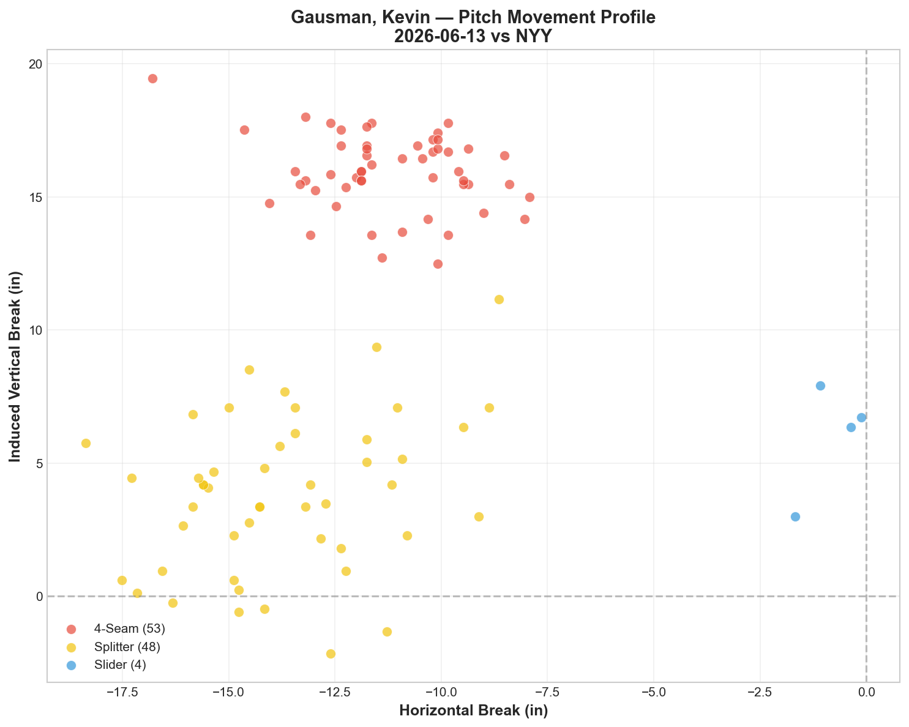
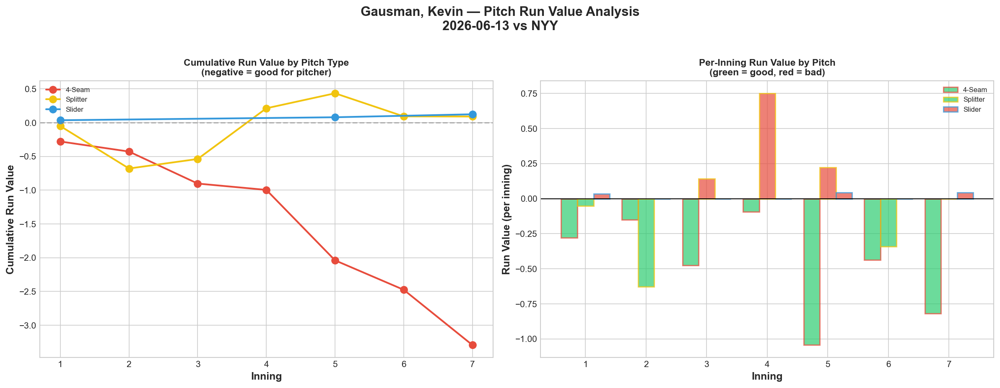
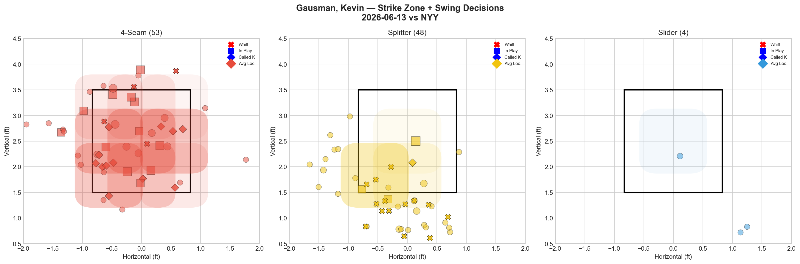
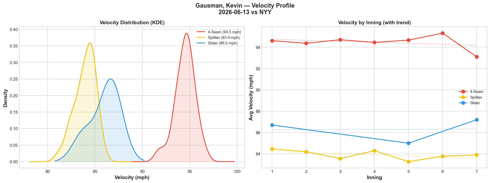
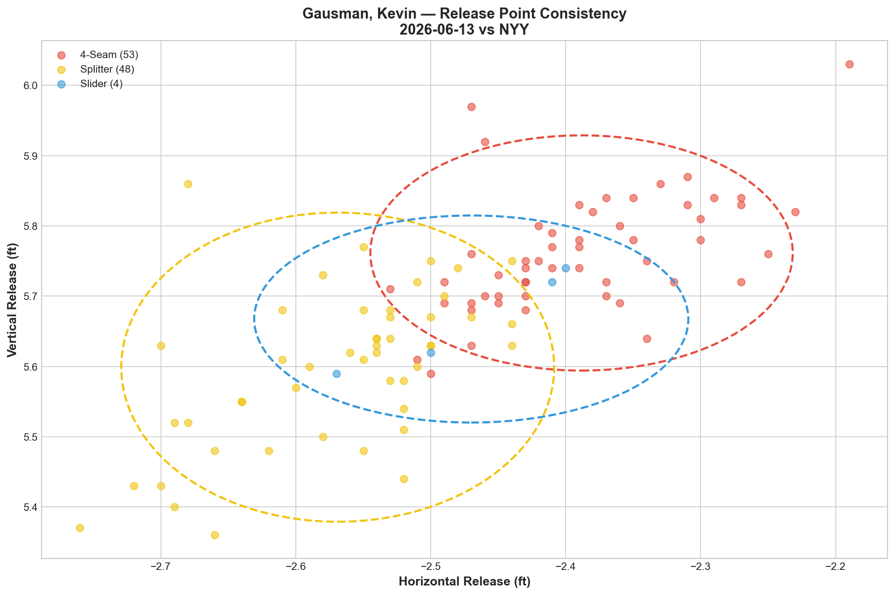
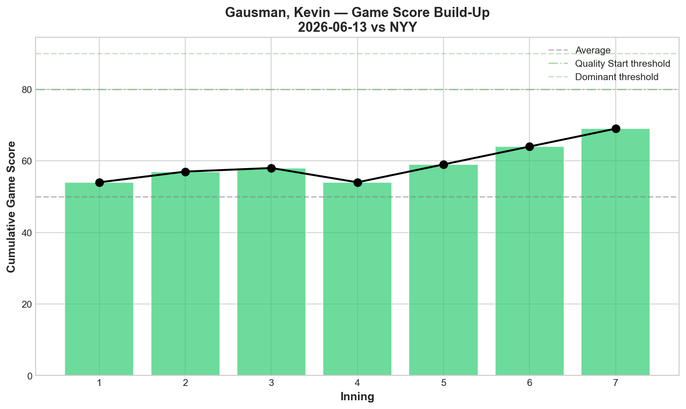
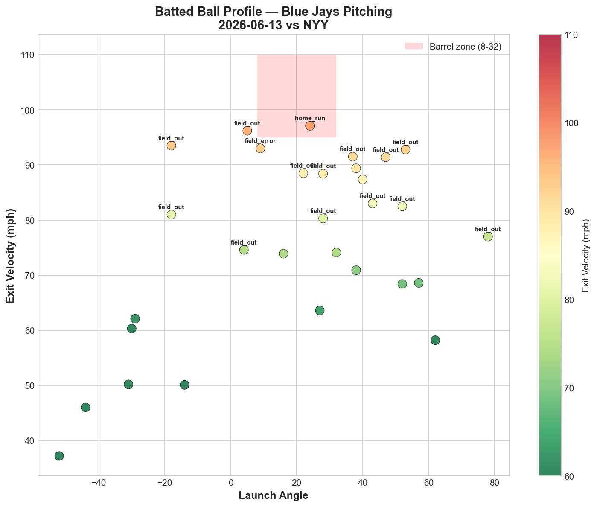
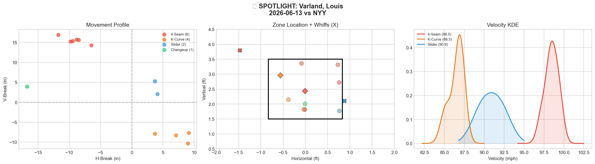
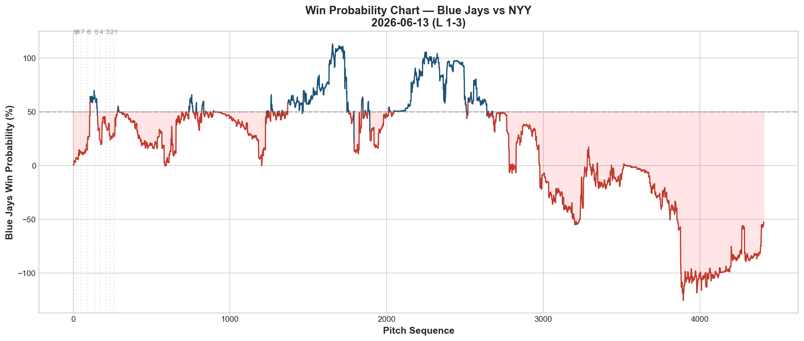
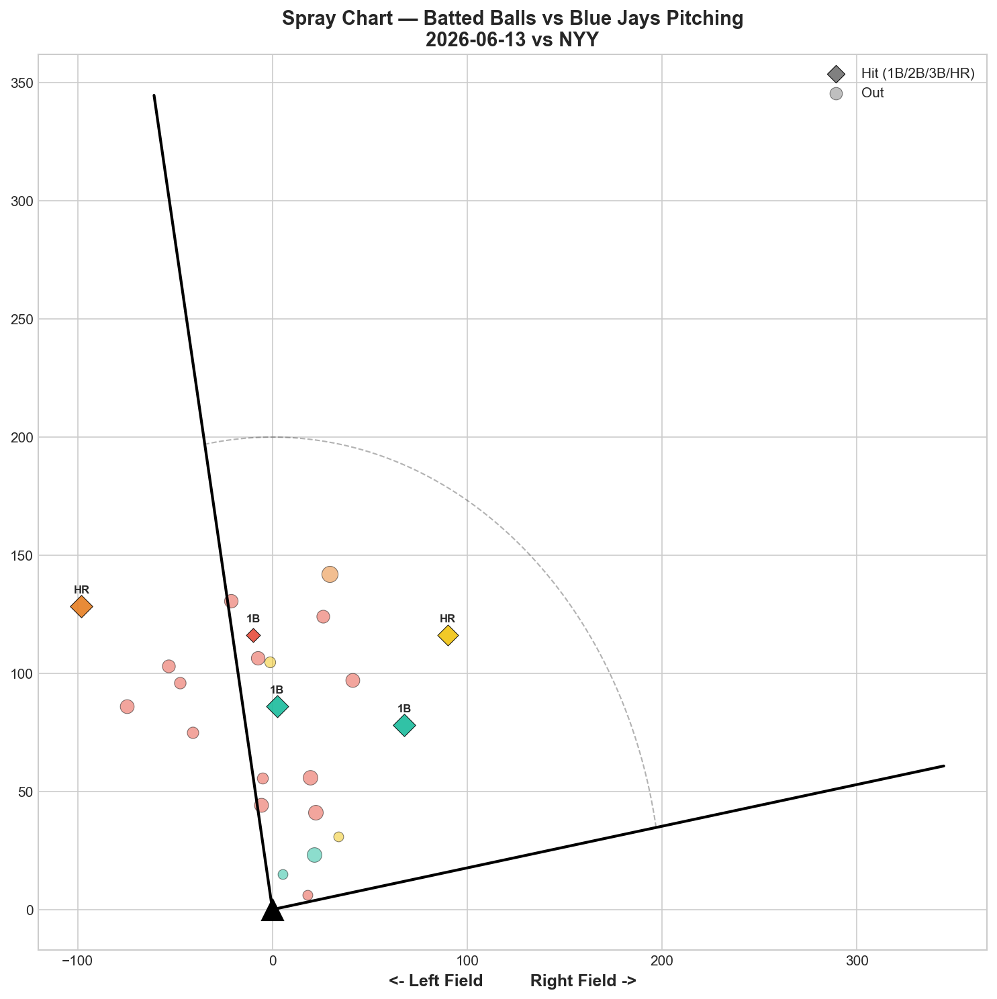

# 🏟️ Blue Jays Game Report v2.1
## 2026-06-13 | TOR vs NYY | L 1-3

---

## 📋 Game Overview

| | |
|---|---|
| **Date** | 2026-06-13 |
| **Matchup** | New York Yankees @ Toronto Blue Jays |
| **Result** | **L 1-3** |
| **Starter** | Kevin Gausman (105 pitches) |
| **Spotlight Pitcher** | Louis Varland |
| **Season Record** | 34W-36L |

---

## 🔥 Key Storylines

### 1. Gausman's Fastball Set a New Report Record — -3.293 RV

Kevin Gausman's 4-seam posted **-3.293 Run Value across 53 pitches** — the single best pitch performance in our entire reporting period, surpassing his own record of -2.337 from 6/7. The fastball prevented over 3 runs of expected value in one game. And he still lost.

**Gausman's fastball across his last 4 starts:**

| Start | FF RV | FF Per Pitch | Result |
|-------|-------|-------------|--------|
| 5/27 vs MIA | -1.050 | -0.0178 | W |
| 6/2 vs ATL | -0.748 | -0.0153 | L |
| 6/7 vs BAL | -2.337 | -0.0519 | W |
| **6/13 vs NYY** | **-3.293** | **-0.0621** | **L** |

Four straight starts where the fastball is his most effective pitch. The -0.0621 per pitch tonight is the most efficient per-pitch rate we've recorded from any Blue Jays pitcher on any pitch type. **Gausman is a fastball pitcher in 2026.** The data is now beyond debate.

### 2. The Best Pitching Performance That Lost — 7K, 7% Hard-Hit, 75.7 mph EV

Gausman held the Yankees to **75.7 mph average exit velocity and 7% hard-hit rate (2 of 30 balls in play).** Both are the lowest numbers in any game this reporting period. Only 5 hits in 23 batted balls. Game Score 69. Seven strikeouts. And the Blue Jays scored **1 run.**

This is the definition of a quality start wasted by the offense. Gausman did everything a pitcher can do — the team simply couldn't score.

### 3. Gausman Threw 105 Pitches — Season High

For the first time in our reporting period, Gausman reached **105 pitches** — his deepest outing of the season. The fastball velocity declined from 94.6 → 93.1 mph (-1.5), consistent with his typical late-outing fade but not at the alarming 2.3+ mph levels we saw from Scherzer and Yesavage. The splitter held at -0.6 mph decline. He could have gone further — but the game was already lost.

---

## ⚾ Starter Pitch Arsenal Analysis — Kevin Gausman

### Pitch Arsenal Performance (105 pitches)

| Pitch | # | Usage | Velo | Whiff% | CSW% | Chase% | Grade |
|-------|---|-------|------|--------|------|--------|-------|
| 4-Seam | 53 | 50.5% | 94.5 | 15.4% | 30.2% | 31.8% | 🟡 C |
| Splitter | 48 | 45.7% | 83.9 | 53.8% | 31.2% | 47.5% | 🟢 A |
| Slider | 4 | 3.8% | 86.0 | 0.0% | 0.0% | 0.0% | 🔴 D |

**A near-perfect two-pitch game.** The slider was essentially shelved (4 pitches, 3.8%). Gausman committed to a FF/FS binary approach: fastball when ahead or even, splitter as the putaway weapon. The result: 53.8% splitter whiff (A-grade) and 30.2% fastball CSW.

### The Splitter Paradox — 53.8% Whiff But +0.091 RV

The splitter generated elite swing-and-miss (53.8% whiff, 47.5% chase rate) and was the primary strikeout pitch (5 of 7 K's). Yet it posted **+0.091 RV — essentially neutral.** Meanwhile the fastball at only 15.4% whiff posted **-3.293 RV.**

This is the same whiff/RV disconnect we've documented across the staff. The splitter generates whiffs on chase pitches (47.5% chase rate) — pitches that are already balls. The fastball generates called strikes and weak contact in the zone — pitches that actually prevent runs. **Whiff rate measures deception; run value measures outcomes.** They are not the same thing.

### Gausman Five-Start Run Value Trend

| Start | FF RV | FS RV | SL RV | GS | Result |
|-------|-------|-------|-------|----|----|
| 5/27 vs MIA | -1.050 | +1.283 | +0.234 | 53 | W |
| 6/2 vs ATL | -0.748 | +0.285 | +0.541 | 62 | L |
| 6/7 vs BAL | -2.337 | +1.422 | +2.225 | 54 | W |
| **6/13 vs NYY** | **-3.293** | **+0.091** | **+0.124** | **69** | **L** |

The fastball has been negative RV in all 4 starts. The splitter has been positive in 3 of 4 — with tonight being his best splitter RV (+0.091, nearly neutral). This was his **best combined pitching performance** because the splitter finally stopped leaking value while the fastball posted its all-time best.

### Pitch Movement (inches)

| Pitch | H-Break | V-Break | Count |
|-------|---------|---------|-------|
| 4-Seam (FF) | -11.2 | 15.9 | 53 |
| Splitter (FS) | -13.7 | 3.8 | 48 |
| Slider (SL) | -0.8 | 6.0 | 4 |

### Pitch Tunneling Analysis

| Pair | Release Sim | Plate Sep | Tunnel | Velo Gap |
|------|-------------|-----------|--------|----------|
| 4-Seam/Slider | 1.5in | 14.4in | 🟢 9.6 | 8.5mph |
| Splitter/Slider | 1.4in | 13.1in | 🟢 9.1 | 2.0mph |
| 4-Seam/Splitter | 2.9in | 12.4in | 🟢 4.2 | 10.5mph |

Tunneling scores are lower than recent outings (FS/SL was 21.3 on 6/2, 17.0 on 6/7). With the slider at only 4 pitches, the FS/SL tunnel pair that defines Gausman's deception didn't get enough usage to score well. Tonight was a power approach (FF/FS), not a deception approach.

### Pitch Run Value by Type

| Pitch | Total RV | Per Pitch | Pitches | Assessment |
|-------|----------|-----------|---------|------------|
| 4-Seam | **-3.293** | **-0.0621** | 53 | ✅ **Report-history record** |
| Splitter | +0.091 | +0.0019 | 48 | — Neutral (best FS outing) |
| Slider | +0.124 | +0.031 | 4 | — (tiny sample) |

**Net: -3.078 RV.** This is the best total run value from any Gausman start. He prevented over 3 runs of expected value — and lost because the offense scored 1.

### Pitch Selection by Count

| Situation | Primary | Secondary | Notes |
|-----------|---------|-----------|-------|
| First Pitch (0-0) | 4-Seam 60.0% | Splitter 28.0% | FF-first |
| Ahead | **Splitter 66.7%** | 4-Seam 30.0% | Splitter as putaway |
| Behind | 4-Seam 59.3% | Splitter 40.7% | FF when behind |
| Even | 4-Seam 57.9% | Splitter 42.1% | Near 60-40 |
| Full Count (3-2) | FS/FF 50% each | — | Balanced |

The sequencing was textbook: **fastball to establish, splitter to finish.** 66.7% splitter ahead in the count is ideal deployment.

**Strikeout Pitches (7 K's):** FS 5, FF 2 — splitter as primary K weapon, fastball backing it up.

### vs LHB/RHB Split

| Stand | Pitches | Avg Velo | Swinging Strikes | Whiff/Pitch |
|-------|---------|----------|------------------|-------------|
| L | 86 | 89.0 | 16 | **18.6%** |
| R | 19 | 90.9 | 2 | 10.5% |

86 pitches to LHH — the Yankees stacked lefties against Gausman. His 18.6% whiff rate against LHH is his best same-side whiff this season.

### Top Opposing Batters

| Batter | Pitches | Hits | K | BB | Avg EV |
|--------|---------|------|---|-----|--------|
| Jasson Domínguez | 19 | 1 | 1 | 0 | 76.2 |
| Jazz Chisholm | 18 | 0 | 1 | 1 | 72.3 |
| Cody Bellinger | 15 | 0 | 1 | 0 | 74.4 |
| Ben Rice | 11 | 0 | 1 | 0 | 80.5 |
| Paul Goldschmidt | 10 | 0 | 0 | 0 | 86.1 |

**Chisholm 0-for in 18 pitches. Bellinger 0-for in 15. Goldschmidt 0-for in 10.** The Yankees' best hitters were completely suppressed. Average EV against the top 5 batters: 77.9 mph. Nobody barreled Gausman tonight.

### Velocity Profile

- **4-Seam:** 94.6 → 93.1 mph (-1.5)
- **Splitter:** 84.5 → 83.9 mph (-0.6)
- **Slider:** 86.7 → 87.2 mph (+0.5)

Typical Gausman fade — not alarming for 105 pitches. The splitter holding at only -0.6 is a positive sign.

### Game Score / Release / Batted Ball

**Game Score: 69 (QUALITY+).** 7K, 5H, 1HR, 2BB on 105 pitches. His best game score of the reporting period.

| Metric | Value |
|--------|-------|
| Total BIP | 30 |
| Avg Exit Velo | **75.7 mph** |
| Avg Launch Angle | 18.5° |
| Hard Hit (95+ mph) | **2/30 (7%)** |

**75.7 mph avg EV and 7% hard-hit rate — both report-history records.** Only 2 balls in play reached 95+ mph across 30 batted balls. This is total contact suppression.

---

## 🔍 Spotlight Pitcher — Louis Varland

| | |
|---|---|
| **Pitch Count** | 13 |
| **Line** | 1K / 0BB / 2H / 1HR |
| **Overall Whiff%** | 20.0% |
| **Role Assessment** | ✅ SOLID RELIEVER |

### Pitch Arsenal

| Pitch | # | Usage | Velo | Whiff% | CSW% | Grade |
|-------|---|-------|------|--------|------|-------|
| 4-Seam | 6 | 46.2% | 98.5 | 20.0% | 33.3% | 🟢 B |
| K-Curve | 4 | 30.8% | 86.5 | 0.0% | 25.0% | 🔴 D |
| Slider | 2 | 15.4% | 90.9 | 50.0% | 50.0% | 🟢 A |
| Changeup | 1 | 7.7% | 93.6 | 0.0% | 0.0% | 🔴 D |

### Assessment

Varland gave up the **critical 9th-inning home run (WP -92.5%)** that pushed the deficit from 1-2 to 1-3. His slider (50% whiff, Grade A) was effective and his fastball at 98.5 mph graded B — but the K-Curve (0% whiff, Grade D) failed again.

**Varland's Binary Switch — Updated Tracker:**

| Date | KC Grade | FF Grade | Line | Version |
|------|----------|----------|------|---------|
| 6/4 vs ATL | A (50%) | A (33%) | 0K/0BB/0H | 🟢 Good |
| 6/7 vs BAL | A (66.7%) | B (25%) | 2K/0BB/1H | 🟢 Good |
| 6/9 vs PHI | D (0%) | D (0%) | 1K/1BB/1H | 🔴 Bad |
| 6/12 vs NYY | A (66.7%) | B (25%) | 2K/0BB/0H | 🟢 Good |
| **6/13 vs NYY** | **D (0%)** | **B (20%)** | **1K/0BB/2H/1HR** | **🟡 Mixed** |

Tonight was a new pattern: **fastball worked (B), K-Curve didn't (D), slider saved him (A).** The slider at 50% whiff is becoming a potential secondary weapon alongside the K-Curve. But the K-Curve's on/off nature (66.7% → 0% → 66.7% → 0%) continues — he literally alternates between A and D grade every other appearance.

**Development note:** The slider (2 pitches, 50% whiff) has now graded A in 2 of his last 3 appearances. At 90.9 mph (between his 98.5 FF and 86.5 KC), it could become the bridge pitch that stabilizes his profile when the K-Curve is off.

---

## 📊 Bullpen Detailed Analysis

| Pitcher | Pitches | Line | Key Pitch | Notes |
|---------|---------|------|-----------|-------|
| **Louis Varland** | 13 | 1K / 0BB / 2H / 1HR | SL 50% 🟢A, FF 20% 🟢B | HR in 9th — see spotlight |
| **Tyler Rogers** | 22 | 1K / 0BB / 2H / 0HR | SI 10% 🟡C, SL 100% 🟢A (1P) | 95.5% sinker usage |

### Bullpen Notes

- Only **2 relievers used** — Gausman's 105 pitches meant minimal bullpen strain. This is the value of a deep starter outing, even in a loss.
- **Rogers** threw 21 sinkers (95.5% usage) at 83.7 mph with only 10% whiff (Grade C). His sinker-only approach continues to be exposed — the one slider he threw generated 100% whiff. He needs to throw more sliders.

---

## 📈 Win Probability Analysis

### Key WPA Moments

| Inning | Event | Impact |
|--------|-------|--------|
| 6 | De Los Santos — double | 📈 Jays scored |
| 7 | Ahlstrom — single | 📈 Jays rally |
| 8 | Morillo — home_run | 📈 Late push |
| 8 | Strahm — home_run | 📉 Yankees answered |
| 9 | Varland — HR allowed | 📉 Deficit widened (WP -92.5%) |
| 9 | Abreu — double play | 📉 Rally killed |

---

## 📊 Spray Chart & Batted Ball Summary

| Metric | Value |
|--------|-------|
| Total batted balls tracked | 23 |
| Hits | 5 (22%) |
| Pull | 3 (13%) |
| Center | 15 (65%) |
| Oppo | 5 (22%) |

22% hit rate — low. Gausman suppressed everything.

---

## 🎯 Analytical Takeaways

1. **Gausman's FF -3.293 RV Is the Report-History Record** — His fourth straight start as a "fastball pitcher." The 4-seam at -0.0621 per pitch is the most efficient pitch performance we've tracked from any pitcher on any pitch type. The splitter finally stopped leaking (+0.091, neutral). This was his best combined outing — GS 69, 7K, 75.7 mph EV, 7% hard-hit. And he lost 1-3.

2. **7% Hard-Hit Rate Is Historic Suppression** — Only 2 of 30 balls in play reached 95+ mph. 75.7 mph average EV. Gausman was unhittable tonight — the Yankees simply couldn't square him up. A loss with these underlying numbers is purely an offense failure.

3. **The 2-Pitch Approach Worked** — 50.5% FF, 45.7% FS, 3.8% SL. Gausman essentially shelved the slider and committed to a binary arsenal. The result was his best game of the season. The slider may not be necessary when the FF/FS combination is working at this level.

4. **Varland Alternates A/D on K-Curve Every Appearance** — 66.7% → 0% → 66.7% → 0%. It's literally alternating. The slider (50% whiff in 2 of last 3) is emerging as a stabilizer, but the K-Curve inconsistency limits his deployment predictability.

5. **34-36 — Offense Needs to Show Up** — Gausman's best start of the season wasted because the team scored 1 run. The pitching has carried this team for weeks; the offense needs to match. You can't win games 1-3 when your starter posts -3.078 total RV.

6. **Game Classification: Wasted Masterpiece** — Gausman threw 105 pitches of record-setting quality and lost because the offense provided 1 run of support. This is the most frustrating loss type — not because the pitching failed, but because it was perfect and still wasn't enough.

---

*Report generated from Statcast data via pybaseball. All pitch metrics sourced from Baseball Savant.*
