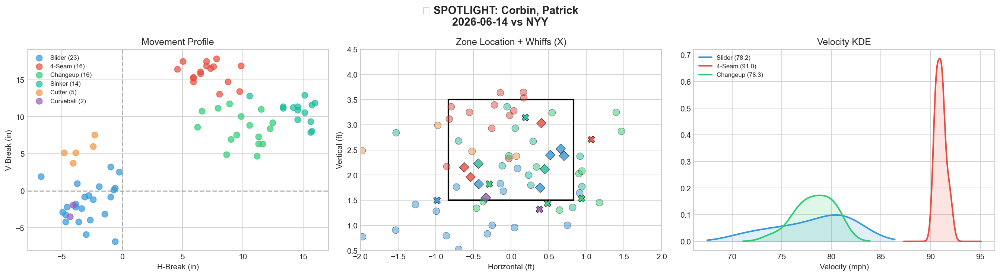
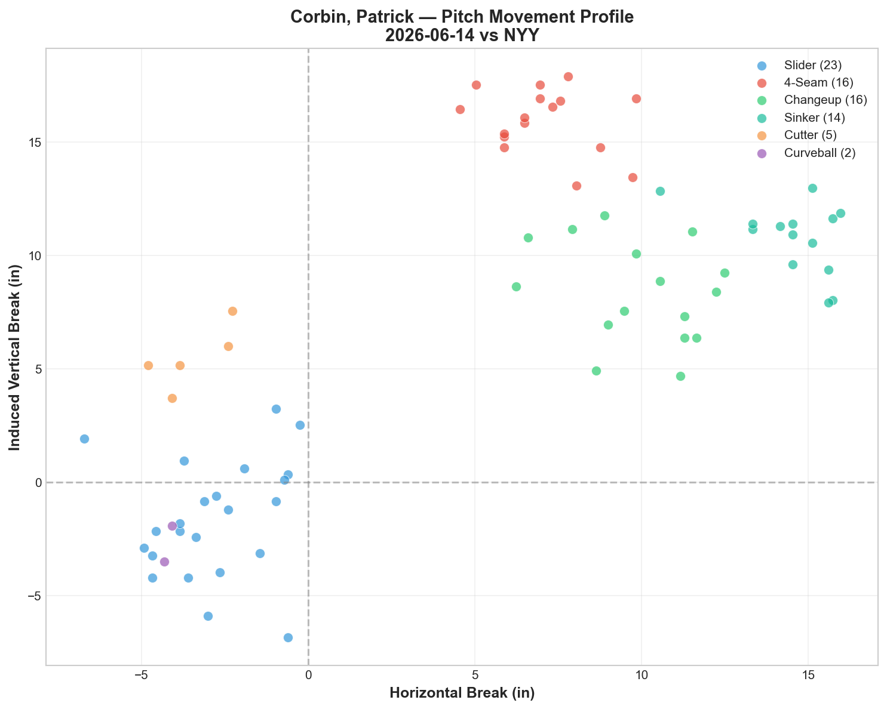
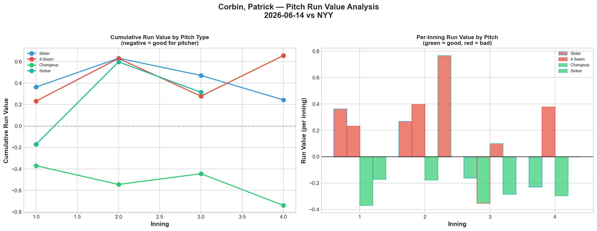
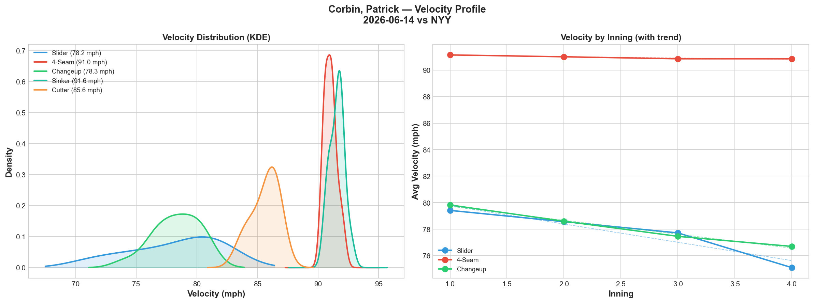
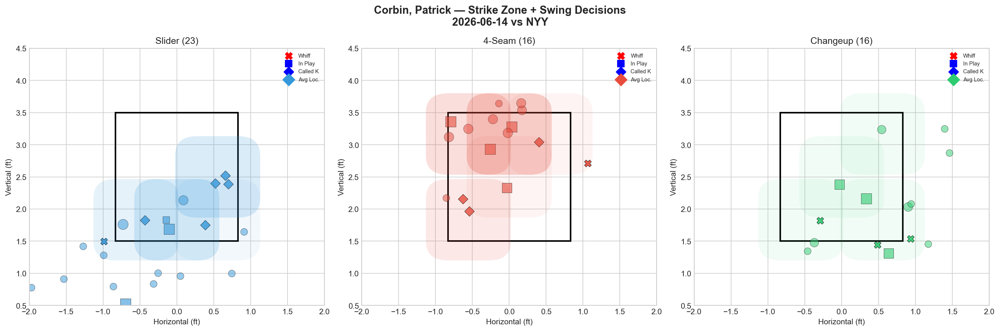
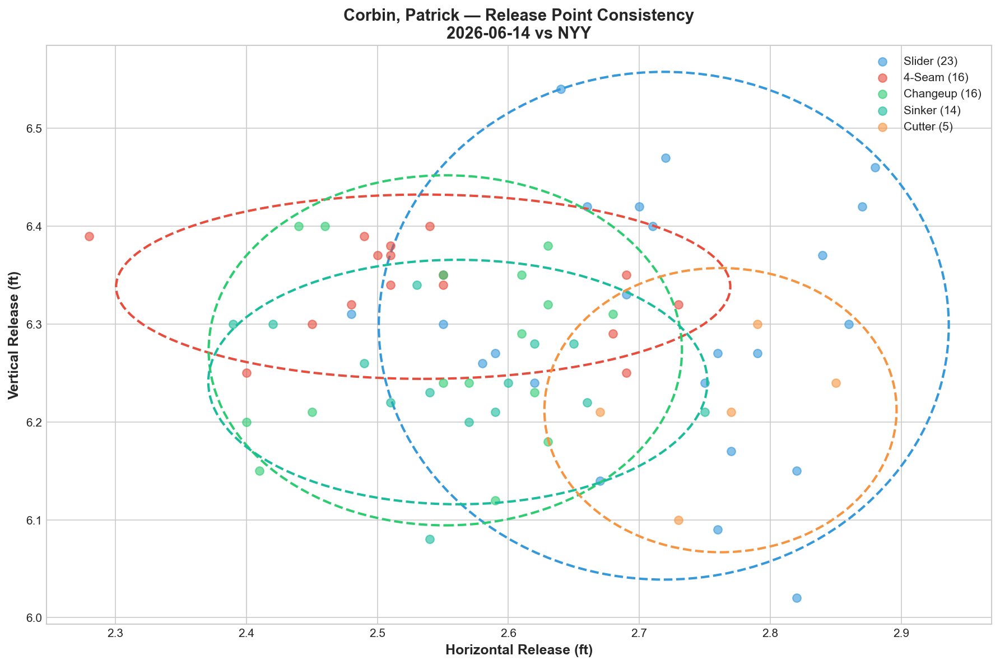
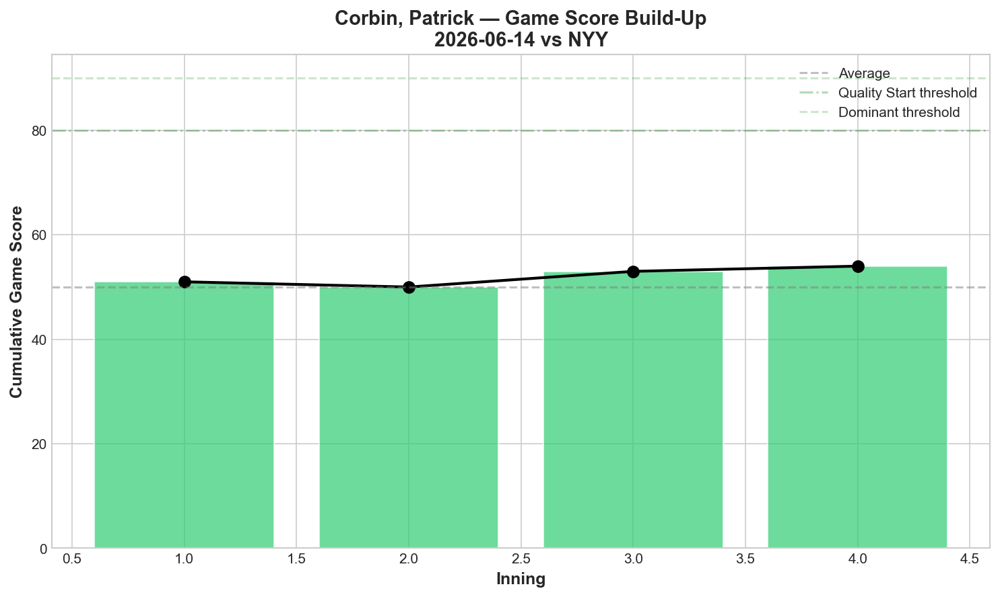
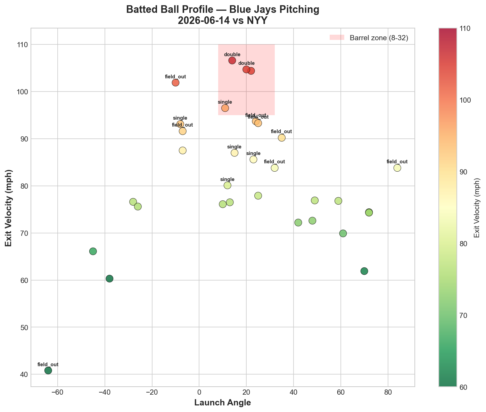
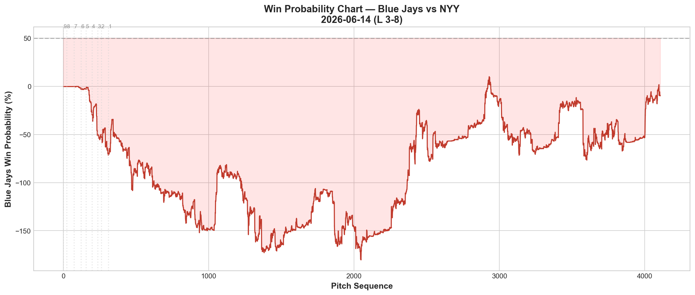
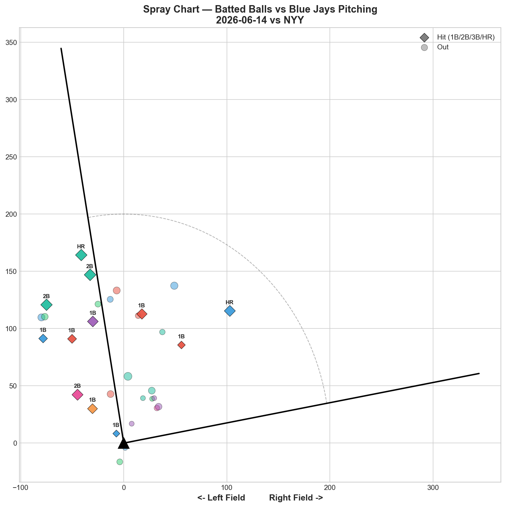

# 🏟️ Blue Jays Game Report v2.1
## 2026-06-14 | TOR vs NYY | L 3-8

---

## 📋 Game Overview

| | |
|---|---|
| **Date** | 2026-06-14 |
| **Matchup** | New York Yankees @ Toronto Blue Jays |
| **Result** | **L 3-8** |
| **Starter** | Patrick Corbin (76 pitches) |
| **Spotlight Pitcher** | Patrick Corbin |
| **Season Record** | 34W-37L |

---

## 🔥 Key Storylines

### 1. The Changeup Is Now Corbin's Best Pitch — 5 Straight Starts of Negative RV

The changeup posted **-0.739 RV tonight** — negative run value for the **fifth consecutive start.** No other Corbin pitch has posted negative RV in more than 2 consecutive starts. The case is no longer emerging or confirmed — it's established fact across a month of data.

| Start | CH RV | CH Whiff% | CH Usage | Best Pitch? |
|-------|-------|-----------|----------|-------------|
| 5/23 vs PIT | -1.079 | — | — | ✅ |
| 5/28 vs BAL | -0.090 | — | — | — |
| 6/3 vs ATL | -0.198 | 0.0% | 18.8% | ✅ |
| 6/8 vs PHI | -0.534 | 12.5% | 16.2% | ✅ |
| **6/14 vs NYY** | **-0.739** | **33.3%** | **21.1%** | **✅** |
| **Cumulative** | **-2.640** | — | — | — |

**-2.640 cumulative RV across 5 starts.** The changeup has prevented over 2.5 runs of expected value while the sinker has cost +5.395 in the same span. The optimization case hasn't changed: **changeup usage should be 30%+, sinker usage should be under 10%.**

### 2. Zero Walks — Corbin's First Clean Command Game

After 5 walks on both 6/3 and 6/8, Corbin threw **76 pitches with 0 BB tonight.** This is his first walk-free start in the reporting period. The walks had been his most damaging issue — tonight the problem was contact quality (7 hits) rather than free passes. Progress.

### 3. The Full Count Evolution Continues

| Date | Full Count Pitch Selection |
|------|--------------------------|
| 5/28 | Sinker 100% |
| 6/3 | Sinker 42.9%, Slider 28.6% |
| 6/8 | Slider 75%, Sinker 25% |
| **6/14** | **SI 30%, SL 30%, FF 20%, CH 20%** |

From 100% sinker on full counts to a **four-pitch distribution.** Corbin is now willing to throw any pitch in a 3-2 count. This is the most significant pitch selection evolution we've tracked on this staff — a pitcher rewriting his instincts in real time across starts.

---

## 🔍 Spotlight Pitcher — Patrick Corbin (5-Start Trend)

### Pitch Arsenal Performance (76 pitches)

| Pitch | # | Usage | Velo | Whiff% | CSW% | Chase% | Grade |
|-------|---|-------|------|--------|------|--------|-------|
| Slider | 23 | 30.3% | 78.2 | 16.7% | 26.1% | 14.3% | 🟡 C |
| 4-Seam | 16 | 21.1% | 91.0 | 9.1% | 25.0% | 60.0% | 🔴 D |
| Changeup | 16 | 21.1% | 78.3 | 33.3% | 18.8% | 41.7% | 🟢 A |
| Sinker | 14 | 18.4% | 91.6 | 10.0% | 21.4% | 50.0% | 🟡 C |
| Cutter | 5 | 6.6% | 85.6 | 0.0% | 0.0% | 0.0% | 🔴 D |
| Curveball | 2 | 2.6% | 66.2 | 100.0% | 100.0% | 100.0% | 🟢 A |

### The Complete Corbin Run Value Database — 5 Starts

| Pitch | 5/23 | 5/28 | 6/3 | 6/8 | 6/14 | **Total** | **Verdict** |
|-------|------|------|-----|-----|------|-----------|-------------|
| **Changeup** | -1.079 | -0.090 | -0.198 | -0.534 | -0.739 | **-2.640** | ✅ **Primary weapon** |
| **Slider** | -1.517 | -1.509 | +0.857 | +1.420 | +0.243 | **-0.506** | 🟡 Declining |
| **Curveball** | — | — | -0.086 | — | -0.068 | **-0.154** | ✅ Show-me |
| **Cutter** | -1.235 | +0.671 | +0.037 | +0.832 | +0.468 | **+0.773** | 🔴 Liability |
| **4-Seam** | +0.109 | -0.216 | +0.249 | +0.314 | +0.656 | **+1.112** | 🔴 Getting worse |
| **Sinker** | +1.486 | +1.634 | -0.058 | +1.019 | +0.314 | **+4.395** | 🔴 **Eliminate** |

**The complete picture across 5 starts:**
- Changeup: -2.640 (only pitch negative in all 5 starts)
- Slider: -0.506 (was dominant early, declining late)
- Sinker: +4.395 (worst pitch by far — 4+ runs of damage)
- 4-Seam: +1.112 (trending worse: +0.109 → +0.656)

The **optimal Corbin arsenal** based on 5 starts of data: CH primary (30%+), SL secondary (25%), CU occasional (5-10%), SI/FF/FC minimized.

### Pitch Movement (inches)

| Pitch | H-Break | V-Break | Count |
|-------|---------|---------|-------|
| Slider (SL) | -2.8 | -1.6 | 23 |
| 4-Seam (FF) | 7.1 | 15.9 | 16 |
| Changeup (CH) | 9.9 | 8.4 | 16 |
| Sinker (SI) | 14.6 | 10.8 | 14 |
| Cutter (FC) | -3.5 | 5.5 | 5 |
| Curveball (CU) | -4.2 | -2.7 | 2 |

### Pitch Tunneling Analysis

| Pair | Release Sim | Plate Sep | Tunnel | Velo Gap |
|------|-------------|-----------|--------|----------|
| **Changeup/Sinker** | **0.4in** | **5.2in** | **🟢 12.9** | **13.3mph** |
| Slider/Sinker | 2.0in | 21.3in | 🟢 10.6 | 13.4mph |
| 4-Seam/Changeup | 0.8in | 8.1in | 🟢 10.0 | 12.7mph |
| Slider/4-Seam | 2.3in | 20.1in | 🟢 8.9 | 12.9mph |
| Slider/Changeup | 2.0in | 16.2in | 🟢 8.0 | 0.2mph |

**Best Tunnel: CH/SI (12.9)** — but the CH/FF pair (10.0) is the more actionable one since the sinker should be reduced. The SL/CH pair at 8.0 with only 0.2 mph velocity gap remains an effective deception combo: same speed, opposite break.

### Pitch Run Value by Type

| Pitch | Total RV | Per Pitch | Pitches | Assessment |
|-------|----------|-----------|---------|------------|
| Changeup | **-0.739** | **-0.0462** | 16 | ✅ Best pitch (5th straight) |
| Curveball | -0.068 | -0.034 | 2 | ✅ (tiny sample) |
| Slider | +0.243 | +0.0106 | 23 | ⚠️ Marginal leak |
| Sinker | +0.314 | +0.0224 | 14 | 🔴 Continues leaking |
| Cutter | +0.468 | +0.0936 | 5 | 🔴 Worst per-pitch |
| 4-Seam | +0.656 | +0.041 | 16 | 🔴 Trending worse |

### Velocity Trend

- **Slider:** 79.4 → 75.1 mph (**-4.3 mph**)
- **4-Seam:** 91.1 → 90.8 mph (-0.3)
- **Changeup:** 79.8 → 76.7 mph (-3.1)

The slider's -4.3 mph drop is the second-largest we've tracked from Corbin (after -7.6 on 5/28). The off-speed pitches are fading through outings while the fastball holds. This suggests Corbin's arm tires on the breaking ball grip before the fastball grip.

### Top Opposing Batters

| Batter | Pitches | Hits | K | BB | Avg EV |
|--------|---------|------|---|-----|--------|
| José Caballero | 16 | 0 | 1 | 0 | 80.6 |
| Paul Goldschmidt | 12 | 2 | 0 | 0 | 82.8 |
| Ben Rice | 11 | 1 | 1 | 0 | 80.6 |
| Jasson Domínguez | 9 | 0 | 1 | 0 | 72.0 |
| Cody Bellinger | 7 | 0 | 0 | 0 | 82.8 |

**Goldschmidt** continued his strong series: 2 hits in 12 pitches. **Domínguez** and **Bellinger** were held hitless. Corbin held the Yankees' biggest names but gave up 7 total hits — the damage came from throughout the lineup.

### Game Score / Release / Batted Ball

**Game Score: 54 (QUALITY).** 3K, 7H, 0HR, 0BB on 76 pitches. The 0BB/0HR is encouraging — the 7H is the issue.

| Metric | Value |
|--------|-------|
| Total BIP | 32 |
| Avg Exit Velo | 81.6 mph |
| Avg Launch Angle | 18.9° |
| Hard Hit (95+ mph) | 5/32 (16%) |

---

## 📊 Bullpen Detailed Analysis

| Pitcher | Pitches | Line | Key Pitch | Notes |
|---------|---------|------|-----------|-------|
| **Jeff Hoffman** | 12 | 2K / 0BB / 0H / 0HR | **SL 75% whiff 🟢A, 62.5% CSW** | Elite slider continues |
| **Spencer Miles** | 38 | 2K / 1BB / 1H / 0HR | **FF 50% whiff 🟢A**, SI 20% 🟢B | Fastball breakthrough in relief |
| **Braydon Fisher** | 24 | 1K / 1BB / 2H / 1HR | CU 100% 🟢A, SL 28.6% 🟢B, FF 20% 🟢B | **Bounce-back — 3 pitches graded B+** |
| **Tommy Nance** | 9 | 0K / 1BB / 1H / 1HR | All 🔴D | Gave up HR — rough outing |
| **Mason Fluharty** | 9 | 0K / 1BB / 1H / 0HR | All 🔴D | Bad night — nothing worked |

### Bullpen Notes

- **Hoffman** is back to peak form: **slider 75% whiff and 62.5% CSW.** That's his second-highest slider whiff since the 5/30 streak-breaker. His post-recovery stretch: 50% → 60% → 60% → 66.7% → 66.7% → 20% → 75%. The 20% on 6/10 was the only dip in an otherwise dominant run.
- **Miles' fastball at 50% whiff (Grade A)** in relief is a breakthrough. His 4-seam at 96.6 mph generated swing-and-miss for the first time consistently. Combined with his sinker at 96.2 (Grade B), his velocity pitches work in short relief — further confirming the bulk/relief deployment over starting.
- **Fisher bounced back** from two consecutive all-D outings with 3 pitches grading B or higher. The curveball (100% whiff) returned. He did give up a HR, but the underlying stuff metrics are healthy again. The 2-game fatigue dip appears over.

---

## 📈 Win Probability Analysis

### Key WPA Moments

| Inning | Event | Impact |
|--------|-------|--------|
| 4 | Sánchez — home_run | 📉 Yankees scored (WP -125.2%) |
| 4 | McGreevy — home_run | 📉 Back-to-back |
| 6 | Antone — home_run | 📉 Extended (WP -169.4%) |
| 8 | Bachman — home_run | 📉 Buried (WP -145.2%) |
| 8 | Soriano — double | 📉 More damage |
| 9 | Fisher — HR allowed | 📉 Final blow |

A game where the Yankees hit home runs throughout — the pitching staff (not just Corbin) was homer-prone tonight.

---

## 📊 Spray Chart & Batted Ball Summary

| Metric | Value |
|--------|-------|
| Total batted balls tracked | 31 |
| Hits | 12 (39%) |
| Pull | 3 (10%) |
| Center | 21 (68%) |
| Oppo | 7 (23%) |

39% hit rate and 23% opposite-field — the Yankees were driving the ball the other way, especially on off-speed pitches.

---

## 🎯 Analytical Takeaways

1. **Corbin's Changeup: -2.640 Cumulative RV Across 5 Starts** — The single most consistent pitch on the Blue Jays staff, by any pitcher. Negative RV in every start. 33.3% whiff tonight (A-grade). Usage is still only 21.1% — it should be 30%+. The data case for a changeup-first Corbin has been building for a month.

2. **Full Count Evolution Complete** — 100% sinker (5/28) → four-pitch distribution (6/14). Corbin has fundamentally changed his approach to the most critical count in baseball. This is coachable improvement happening in real time across starts.

3. **0BB Tonight — Command Can Be Clean** — After 5+5 walks in his previous two starts, Corbin threw 76 pitches with zero walks. The command inconsistency is still a concern, but tonight proves the walks aren't structural — they're concentration-based.

4. **Hoffman's Slider at 75% Whiff** — His second-best performance since the 5/30 reset. The slider is the bullpen's most reliable individual pitch, period.

5. **Fisher's Stuff Bounced Back** — CU 100%, SL 28.6%, FF 20% — all B grade or better. The 2-game fatigue dip (6/12, 6/13 all-D) appears resolved. He still gave up a HR, but the whiff metrics are healthy.

6. **Miles' Fastball Works in Short Relief** — FF 50% whiff at 96.6 mph in 38 pitches. As a reliever, his velocity pitches generate swing-and-miss. As a starter/bulk, they don't. His role optimization is complete: opener/bulk behind Fisher or short relief.

7. **34-37 — The Slide Continues** — 3 straight losses to the Yankees. The pitching has been strong in spots (Gausman's masterpiece, Hoffman's slider) but the offense is drying up (1, 3, 3 runs in 3 games). The team needs the bats to wake up.

8. **Game Classification: Contact Loss** — 7H from Corbin, 12H total from the staff. The 0BB/0HR from Corbin was a step forward; the 7H was a step back. The Yankees punished the pitches in the zone while the walks disappeared.

---

*Report generated from Statcast data via pybaseball. All pitch metrics sourced from Baseball Savant.*
