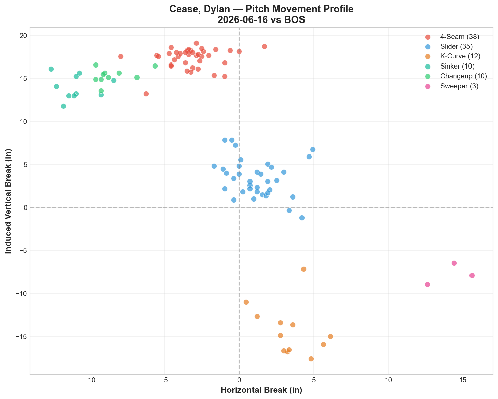
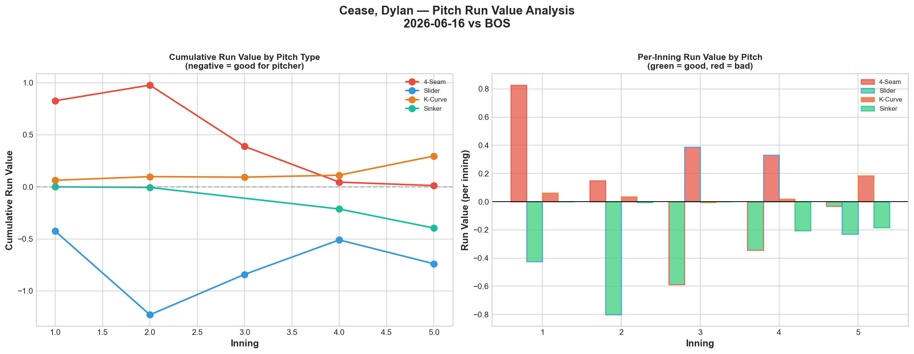
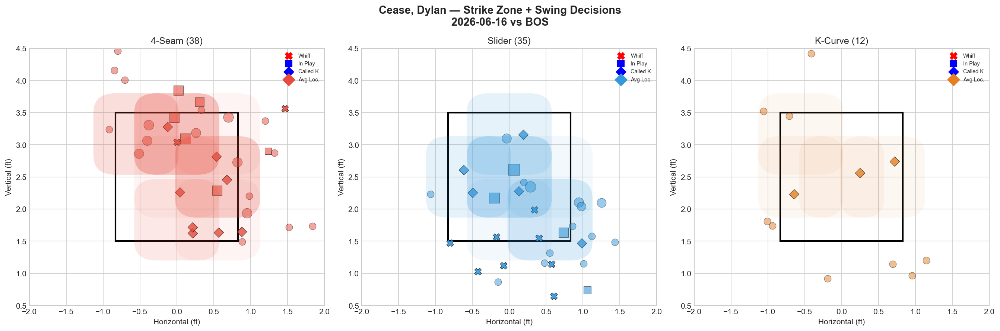
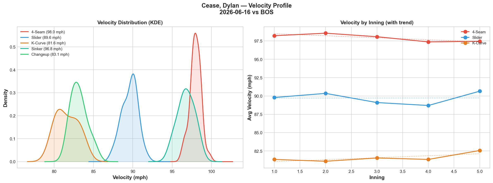
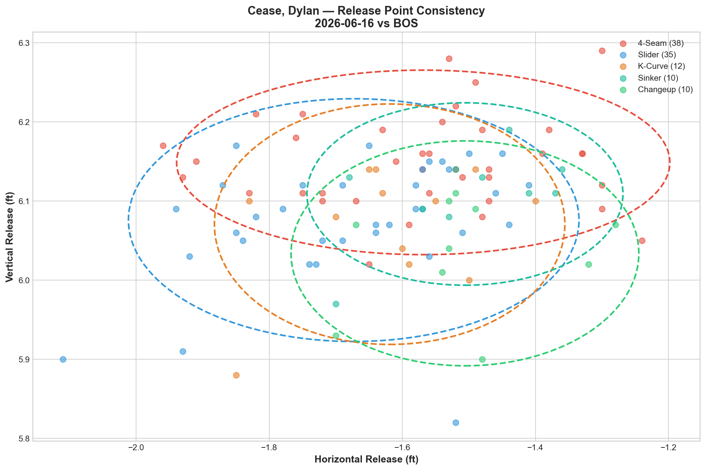
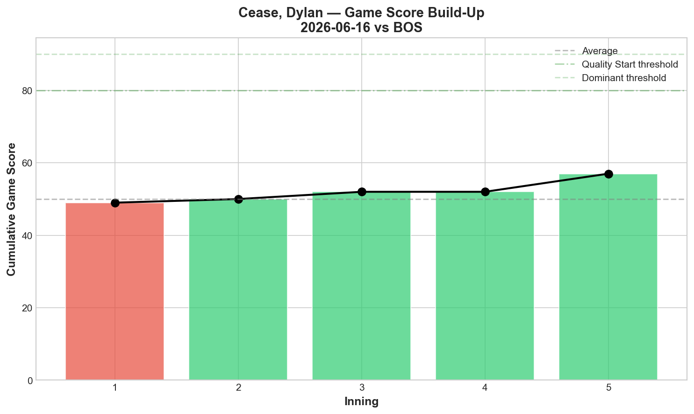
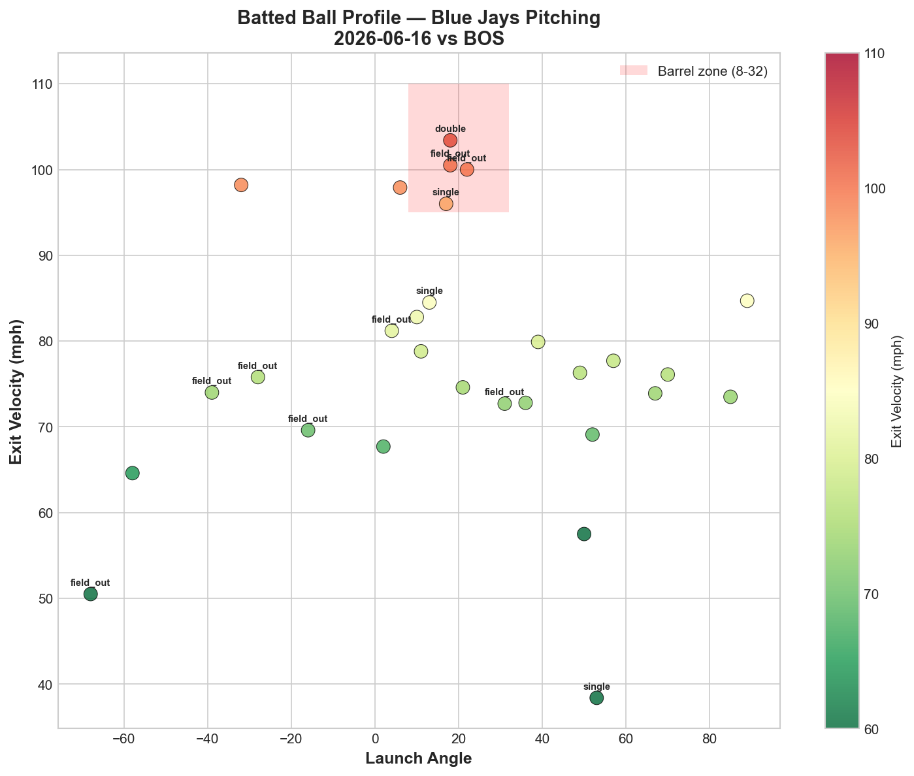
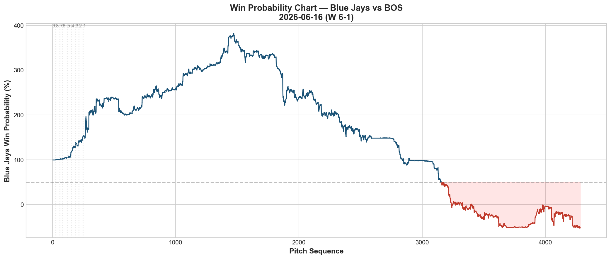
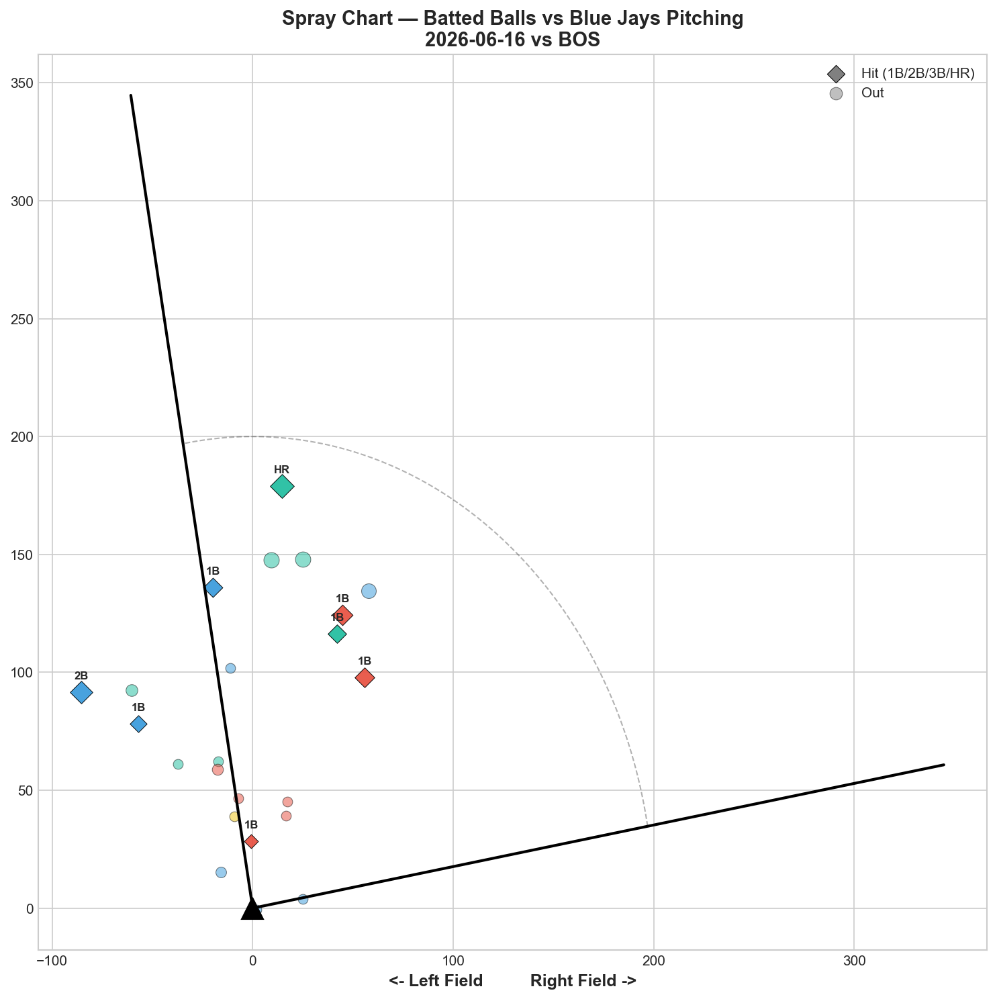

# 🏟️ Blue Jays Game Report v2.1
## 2026-06-16 | TOR @ BOS | W 6-1

---

## 📋 Game Overview

| | |
|---|---|
| **Date** | 2026-06-16 |
| **Matchup** | Toronto Blue Jays @ Boston Red Sox |
| **Result** | **W 6-1** |
| **Starter** | Dylan Cease (108 pitches) |
| **Spotlight Pitcher** | None |
| **Season Record** | 35W-37L |

---

## 🔥 Key Storylines

### 1. Cease Threw 108 Pitches at 98 mph — The Ace Is Fully Healthy

Dylan Cease threw **108 pitches — a new season high** — with his fastball averaging **98.0 mph.** That's higher than his 6/9 return (97.5 mph) and higher than his pre-injury velocity (97.0 on 5/24). Two post-injury starts: GS 77 (11K vs PHI), GS 59 (7K vs BOS). The hamstring is a non-issue. He's throwing harder and deeper than before the injury.

### 2. The K-Curve First-Pitch Strategy Is Fascinating

Cease threw his K-Curve on **39.1% of first pitches** — the most unusual first-pitch approach we've tracked from any starter. Most pitchers lead with fastballs; Cease led with an 81.6 mph breaking ball. The K-Curve itself posted 0% whiff (Grade D) — so why throw it first?

**The answer is in the tunneling data.** The FF/KC tunnel scored **29.0** (32.3in plate separation, 16.3 mph velocity gap). The SL/KC tunnel scored **27.4.** By showing hitters the K-Curve early, Cease established an 81 mph visual baseline — then his 98 mph fastball and 89 mph slider looked even faster by comparison. The K-Curve doesn't need to generate whiffs; it needs to make everything else harder to time.

This is pitch sequencing as a weapon, not individual pitch effectiveness.

### 3. Contreras Struck Out 3 Times in 13 Pitches

**Willson Contreras: 0-for, 3K in 13 pitches.** The Red Sox's most dangerous bat was completely dominated. Combined with Abreu (0-for, 1K, 2BB in 20 pitches) and Kiner-Falefa (0-for, 1K, 68.0 mph EV), Cease neutralized the heart of Boston's lineup.

---

## ⚾ Starter Pitch Arsenal Analysis — Dylan Cease

### Pitch Arsenal Performance (108 pitches)

| Pitch | # | Usage | Velo | Whiff% | CSW% | Chase% | Grade |
|-------|---|-------|------|--------|------|--------|-------|
| 4-Seam | 38 | 35.2% | 98.0 | 12.5% | 26.3% | 28.6% | 🟡 C |
| Slider | 35 | 32.4% | 89.6 | 45.5% | 42.9% | 59.1% | 🟢 A |
| K-Curve | 12 | 11.1% | 81.6 | 0.0% | 25.0% | 0.0% | 🔴 D |
| Sinker | 10 | 9.3% | 96.8 | 0.0% | 10.0% | 33.3% | 🔴 D |
| Changeup | 10 | 9.3% | 83.1 | 100.0% | 30.0% | 25.0% | 🟢 A |
| Sweeper | 3 | 2.8% | 84.0 | 0.0% | 33.3% | 0.0% | 🔴 D |

### Cease Two-Start Post-Injury Comparison

| Metric | 6/9 vs PHI | 6/16 vs BOS |
|--------|-----------|-------------|
| Pitches | 93 | **108** |
| K | 11 | 7 |
| FF Velo | 97.5 | **98.0** |
| A-Grade Pitches | **5** | 2 |
| Game Score | **77** | 59 |
| CH Whiff% | 77.8% | **100%** |
| SL Whiff% | 40.0% | **45.5%** |
| Result | W 3-2 | **W 6-1** |

The 6/9 start was historic (5 A-grades, GS 77). Tonight was a "normal ace" outing — still dominant enough to win 6-1, but with more variance across the arsenal. The changeup at 100% whiff (10 pitches) confirms it as his most devastating pitch. The slider at 45.5% whiff was his workhorse.

### Pitch Movement (inches)

| Pitch | H-Break | V-Break | Count |
|-------|---------|---------|-------|
| 4-Seam (FF) | -3.2 | 17.3 | 38 |
| Slider (SL) | 1.2 | 3.4 | 35 |
| K-Curve (KC) | 3.4 | -14.3 | 12 |
| Sinker (SI) | -10.9 | 14.0 | 10 |
| Changeup (CH) | -8.5 | 15.3 | 10 |
| Sweeper (ST) | 14.2 | -7.8 | 3 |

### Pitch Tunneling Analysis

| Pair | Release Sim | Plate Sep | Tunnel | Velo Gap |
|------|-------------|-----------|--------|----------|
| **4-Seam/K-Curve** | **1.1in** | **32.3in** | **🟢 29.0** | **16.3mph** |
| **Slider/K-Curve** | **0.7in** | **17.8in** | **🟢 27.4** | **8.0mph** |
| K-Curve/Changeup | 1.4in | 31.9in | 🟢 22.4 | 1.5mph |
| K-Curve/Sinker | 1.4in | 31.7in | 🟢 22.1 | 15.1mph |
| 4-Seam/Slider | 1.5in | 14.7in | 🟢 9.6 | 8.3mph |

**The K-Curve is a tunneling multiplier.** It scored 20+ with four different pitch pairs. The FF/KC pair at 29.0 (32.3in plate separation) is the second-highest tunnel score we've ever recorded. The K-Curve creates more tunneling value than any other single pitch on the staff — even at 0% whiff — because it sets up every other pitch geometrically.

### Pitch Run Value by Type

| Pitch | Total RV | Per Pitch | Pitches | Assessment |
|-------|----------|-----------|---------|------------|
| Slider | -0.739 | -0.0211 | 35 | ✅ Best pitch |
| Sinker | -0.396 | -0.0396 | 10 | ✅ Effective per-pitch |
| 4-Seam | +0.012 | +0.0003 | 38 | — Dead neutral |
| Sweeper | +0.030 | +0.010 | 3 | — (tiny sample) |
| Changeup | +0.221 | +0.0221 | 10 | ⚠️ Leaked despite 100% whiff |
| K-Curve | +0.296 | +0.0247 | 12 | ⚠️ Show-me pitch cost |

The changeup posted **+0.221 RV despite 100% whiff rate** — the most extreme whiff/RV disconnect in a single Cease start. Every swing at the changeup was a miss, but the pitch still produced positive run value through other outcomes (walks, hit-by-pitches, ball calls that extended counts). The slider (-0.739) was the true run-prevention weapon.

### Pitch Selection by Count

| Situation | Primary | Secondary | Notes |
|-----------|---------|-----------|-------|
| First Pitch (0-0) | **K-Curve 39.1%** | 4-Seam 30.4% | Breaking ball first — unique |
| Ahead | Slider 37.5% | 4-Seam 34.4% | Slider as putaway |
| Behind | 4-Seam 48.0% | Slider 24.0% | FF when behind |
| Even | Slider 44.4% | 4-Seam 22.2% | Slider dominant |
| Full Count (3-2) | Slider 50.0% | 4-Seam 40.0% | Slider on 3-2 — confident |

**The K-Curve first-pitch strategy** is deliberate: 39.1% on first pitches but only 3.1% when ahead. Cease shows the K-Curve early to establish the visual template, then attacks with slider and fastball for the rest of the at-bat. By the time hitters see the slider (45.5% whiff), their eyes are still adjusted to the 81 mph K-Curve — and the 89 mph slider looks 8 mph faster than it is.

**Strikeout Pitches (7 K's):** SL 4, FF 3 — slider as primary K weapon.

### vs LHB/RHB Split

| Stand | Pitches | Avg Velo | Swinging Strikes | Whiff/Pitch |
|-------|---------|----------|------------------|-------------|
| L | 52 | 91.4 | 8 | 15.4% |
| R | 56 | 91.7 | 7 | 12.5% |

Balanced whiff rates across both sides — consistent with Cease's "unpredictable by design" profile.

### Top Opposing Batters

| Batter | Pitches | Hits | K | BB | Avg EV |
|--------|---------|------|---|-----|--------|
| Wilyer Abreu | 20 | 0 | 1 | 2 | 77.3 |
| Ceddanne Rafaela | 18 | 2 | 1 | 0 | 82.2 |
| Willson Contreras | 13 | 0 | **3** | 0 | 83.0 |
| Isiah Kiner-Falefa | 12 | 0 | 1 | 0 | 68.0 |
| Marcelo Mayer | 12 | 0 | 1 | 1 | — |

**Contreras: 0-for, 3K.** Completely dominated. **Rafaela** was the only Red Sox hitter who solved Cease (2 hits). Everyone else was suppressed.

### Velocity Profile

- **4-Seam:** 98.2 → 97.4 mph (-0.8)
- **Slider:** 89.8 → 90.6 mph (+0.9)
- **K-Curve:** 81.4 → 82.6 mph (+1.2)

Fastball dropped only 0.8 mph across 108 pitches — elite stamina. The slider and K-Curve actually gained velocity through the outing.

### Game Score / Release / Batted Ball

**Game Score: 59 (QUALITY).** 7K, 6H, 0HR, 4BB on 108 pitches.

| Metric | Value |
|--------|-------|
| Total BIP | 29 |
| Avg Exit Velo | 77.7 mph |
| Avg Launch Angle | 20.0° |
| Hard Hit (95+ mph) | 6/29 (21%) |

77.7 mph EV and 21% hard-hit — consistent contact suppression.

---

## 📊 Bullpen Detailed Analysis

| Pitcher | Pitches | Line | Key Pitch | Notes |
|---------|---------|------|-----------|-------|
| **Louis Varland** | 19 | 3K / 1BB / 1H / 0HR | **CH 66.7% 🟢A, FF 50% 🟢A** | Two A-grade pitches — good version |
| **Tommy Nance** | 16 | 1K / 1BB / 2H / 1HR | CU 33.3% 🟢A, SL 75% 🟢A | Two A-grades but gave up HR |
| **Tyler Rogers** | 17 | 0K / 0BB / 1H / 0HR | SL 33.3% 🟢A | Clean — slider worked |
| **Jeff Hoffman** | 9 | 1K / 0BB / 0H / 0HR | SL 50% 🟢A | 9 pitches, perfect. Slider elite |

### Bullpen Notes

- **Varland** delivered the good version again: CH 66.7% + FF 50% — both A-grade. His 4-seam at 99.5 mph and changeup at 93.4 mph are a devastating speed pairing when both work. 3K in 19 pitches.
- **Nance** had two A-grade pitches (CU 33.3%, SL 75%) but gave up a HR and 2 hits. The stuff was there; one pitch caught too much plate.
- **Hoffman** was clinical: 9 pitches, 1K, 0H. Slider at 50% whiff and 66.7% CSW. He's now been consistently elite since the 5/30 reset.
- **Rogers** was clean — slider at 33.3% A. His slider continues to be effective in small doses.

---

## 📈 Win Probability Analysis

---

## 📊 Spray Chart & Batted Ball Summary

| Metric | Value |
|--------|-------|
| Total batted balls tracked | 23 |
| Hits | 8 (35%) |
| Pull | 4 (17%) |
| Center | 16 (70%) |
| Oppo | 3 (13%) |

---

## 🎯 Analytical Takeaways

1. **Cease at 108 Pitches and 98 mph Is a Healthy Ace** — Two post-injury starts: 93P/11K/GS77 then 108P/7K/GS59. Velocity up (97.5 → 98.0). Pitch count up (93 → 108). The hamstring injury is fully behind him. The Blue Jays have their ace back at full capacity.

2. **The K-Curve First-Pitch Strategy Is Brilliant Sequencing** — 0% whiff on the pitch itself, but it creates 29.0 and 27.4 tunnel scores with the fastball and slider. By establishing an 81 mph baseline early, every subsequent pitch looks faster. This is why Cease is the hardest pitcher to predict in our ML model (38.4% accuracy) — his sequencing is designed to disrupt, not just dominate.

3. **Changeup 100% Whiff But +0.221 RV** — The whiff/RV disconnect continues even for Cease. Every swing was a miss, but the pitch still produced positive value through non-swing outcomes. Whiff rate alone doesn't capture pitch effectiveness.

4. **Contreras 0-for-3K** — Cease's best individual matchup tonight. 13 pitches, 3 strikeouts against Boston's biggest threat.

5. **Bullpen Had 4 A-Grade Pitches Across 4 Relievers** — Varland (CH+FF), Nance (CU+SL), Rogers (SL), Hoffman (SL). The entire relief corps showed up tonight.

6. **35-37 — Trending Right** — Two straight Cease wins have the Jays climbing back. With the ace healthy and the bullpen performing, the foundation for a June push is in place.

7. **Game Classification: Ace Dominance** — Cease went 108 pitches, the offense gave him 6 runs, and the bullpen closed it clean. This is what a complete team win looks like when the ace is healthy.

---

*Report generated from Statcast data via pybaseball. All pitch metrics sourced from Baseball Savant.*
