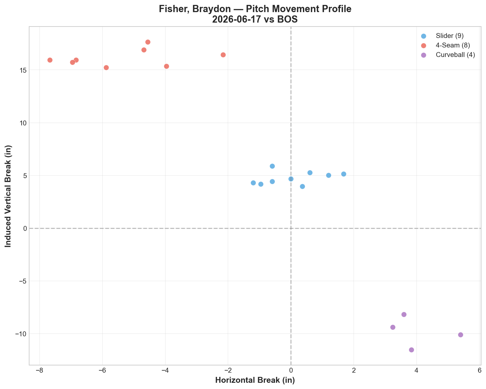
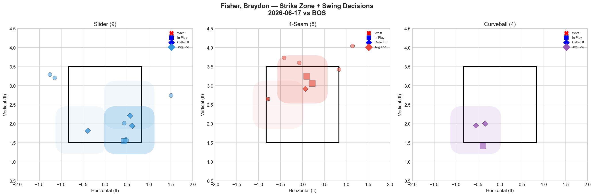
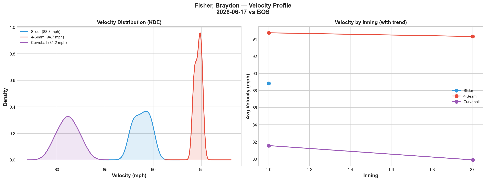
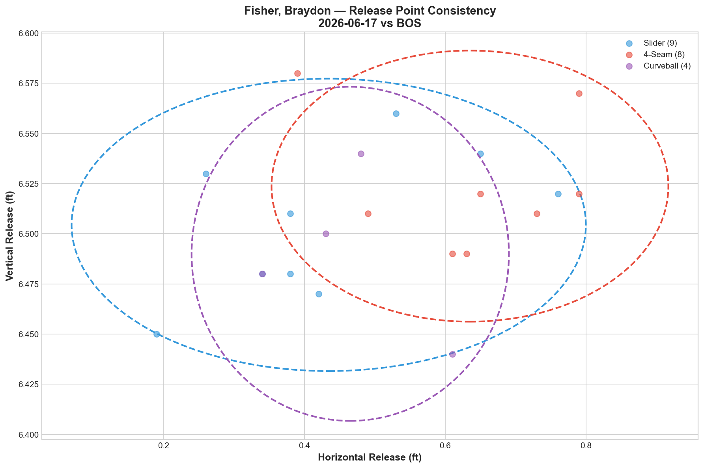
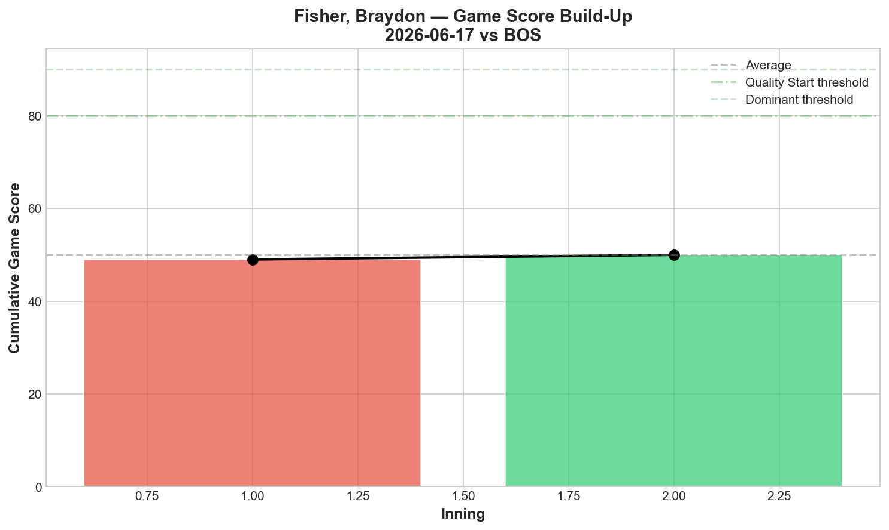
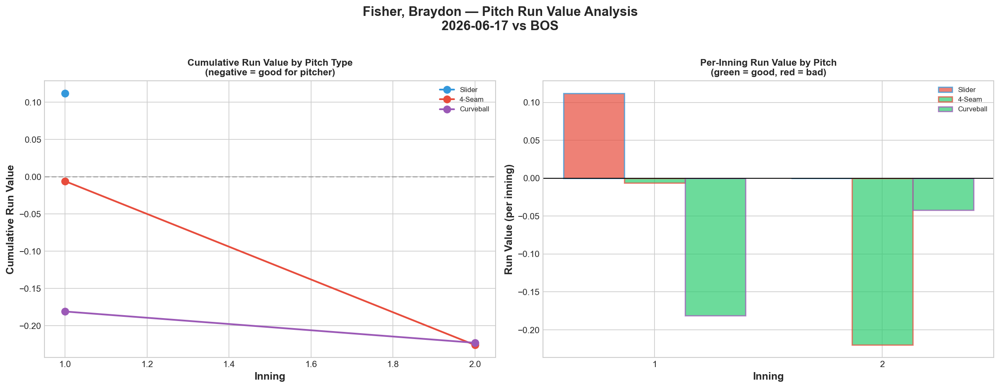
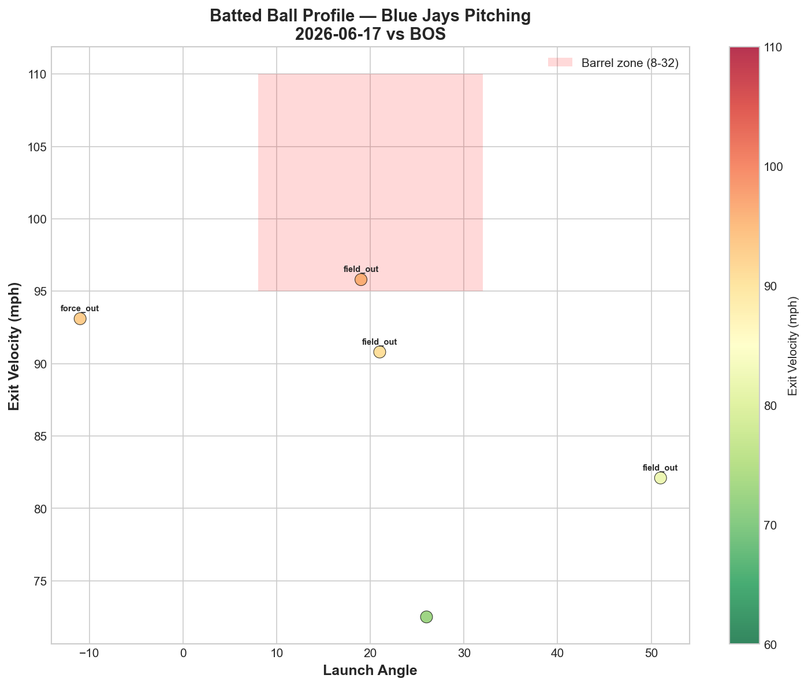
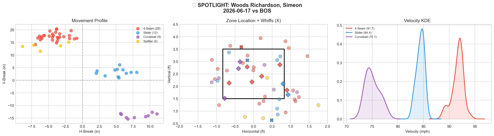
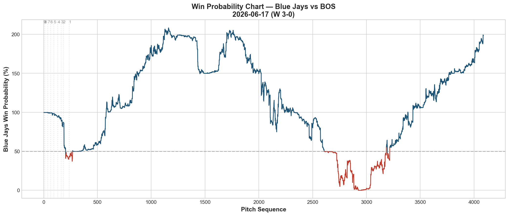
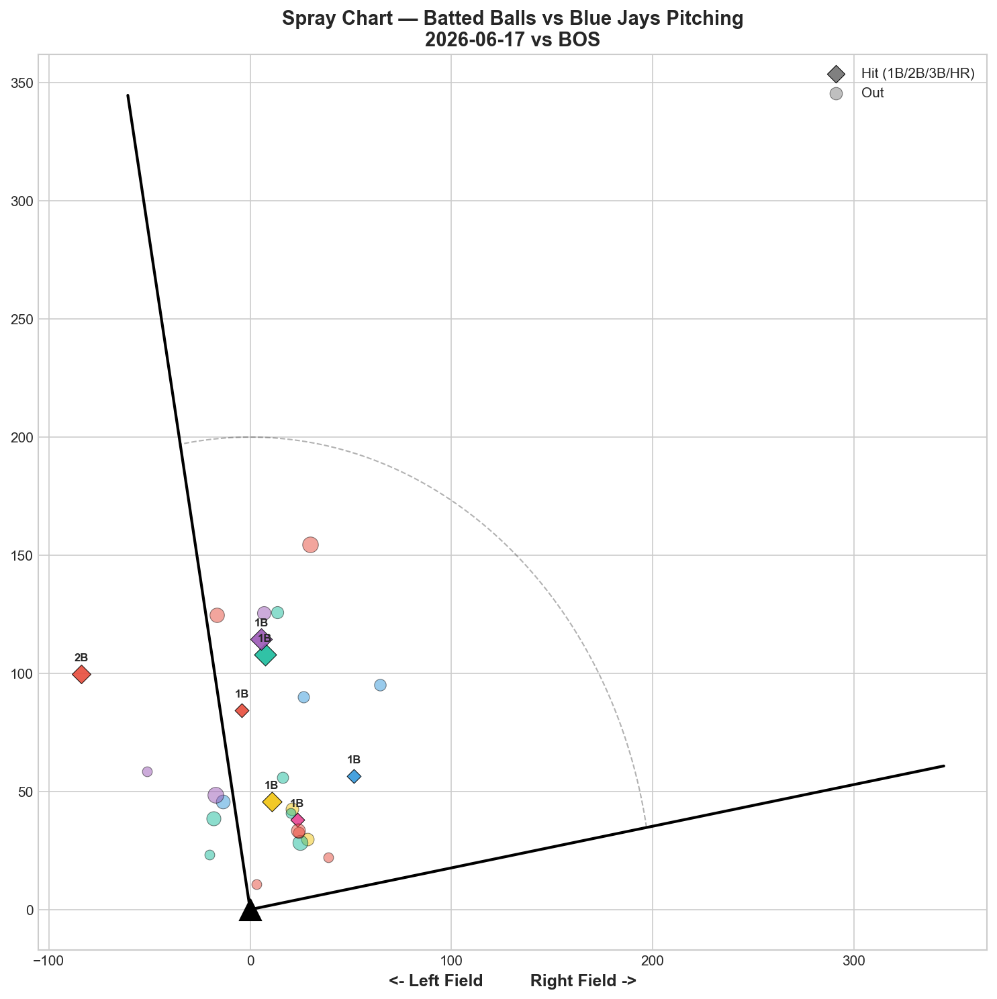

# 🏟️ Blue Jays Game Report v2.1
## 2026-06-17 | TOR @ BOS | W 3-0

---

## 📋 Game Overview

| | |
|---|---|
| **Date** | 2026-06-17 |
| **Matchup** | Toronto Blue Jays @ Boston Red Sox |
| **Result** | **W 3-0 (SHUTOUT)** |
| **Opener** | Braydon Fisher (21 pitches) |
| **Bulk Pitcher** | Simeon Woods Richardson (55 pitches, 3 IP) |
| **Spotlight Pitcher** | Simeon Woods Richardson |
| **Season Record** | 36W-37L |

**Seven pitchers combined for a road shutout at Fenway Park.** Fisher opened, Woods Richardson absorbed 3 innings, then Hoffman, Miles, Fluharty, Varland, and Rogers closed it out. **Bullpen day record: 6-0.**

---

## 🔥 Key Storylines

### 1. The Bullpen Day Formula Is Now 6-0

Every single bullpen day deployment this season has resulted in a win:

| Date | Opener | Bulk | Opponent | Score |
|------|--------|------|----------|-------|
| 5/21 | Fisher | Miles | @ NYY | **W 2-0** (shutout) |
| 5/26 | Fisher | Miles | vs MIA | **W 8-1** |
| 5/29 | Macko | Voth | @ BAL | **W 6-5** |
| 6/4 | Fluharty | Dallas | @ ATL | **W 7-2** |
| 6/6 | Fisher | Miles | vs BAL | **W 6-4** |
| **6/17** | **Fisher** | **SWR** | **@ BOS** | **W 3-0** (shutout) |

**6-0 with two shutouts.** Against the Yankees, Marlins, Orioles, Braves, and Red Sox — contenders and rebuilding teams alike. Combined run differential: +23 (32 runs scored, 9 allowed). The bullpen day is the single most successful tactical innovation of the Blue Jays' 2026 season.

### 2. Two Shutouts at Fenway — Fisher Opens Both

Both bullpen day shutouts have featured Fisher as the opener:
- **5/21 @ NYY:** Fisher 23P, 4K → Miles 63P → **W 2-0**
- **6/17 @ BOS:** Fisher 21P, 0K → SWR 55P → **W 3-0**

Fisher's SL/CU tunnel tonight scored **37.2** (0.4in release similarity, 15.1in plate separation). His opener tunnel scores across starts: 31.9 → 42.8 → 37.2. Consistently elite. He sets the table better than anyone on the staff.

### 3. Varland Delivered His Best Outing of the Season — 3 A-Grade Pitches in 10 Pitches

Louis Varland threw just **10 pitches and recorded 3 strikeouts with 0 hits.** Three of his four pitches graded A: **FF 50% whiff, SL 100% whiff, CH 100% whiff.** This is the most efficient outing by any Blue Jays reliever this season — 3K in 10 pitches is a 30% K rate per pitch.

---

## ⚾ Opener Pitch Arsenal Analysis — Braydon Fisher

### Pitch Arsenal Performance (21 pitches)

| Pitch | # | Usage | Velo | Whiff% | CSW% | Chase% | Grade |
|-------|---|-------|------|--------|------|--------|-------|
| Slider | 9 | 42.9% | 88.8 | 0.0% | 33.3% | 0.0% | 🔴 D |
| 4-Seam | 8 | 38.1% | 94.7 | 33.3% | 25.0% | 0.0% | 🟢 A |
| Curveball | 4 | 19.0% | 81.2 | 0.0% | 50.0% | 50.0% | 🔴 D |

The slider and curveball generated 0% whiff tonight — unusual for Fisher. But the **SL/CU tunnel at 37.2** was elite, and the 4-seam at 33.3% whiff (Grade A) carried the swing-and-miss. Fisher's opener value isn't always about individual pitch whiff rates — it's about the visual disruption his breaking ball tunnel creates for the bulk pitcher who follows.

### Key Tunneling

| Pair | Release Sim | Plate Sep | Tunnel | Velo Gap |
|------|-------------|-----------|--------|----------|
| **Slider/Curveball** | **0.4in** | **15.1in** | **🟢 37.2** | **7.7mph** |
| 4-Seam/Curveball | 2.1in | 27.6in | 🟢 13.3 | 13.5mph |

### Pitch Run Value

| Pitch | Total RV | Per Pitch | Assessment |
|-------|----------|-----------|------------|
| Curveball | -0.223 | -0.0558 | ✅ Best per-pitch |
| 4-Seam | -0.226 | -0.0282 | ✅ Effective |
| Slider | +0.112 | +0.0124 | ⚠️ Marginal leak |

Both the curveball and fastball posted negative RV — Fisher's opener contribution was net positive despite the low whiff rates.

---

## 🔍 Spotlight Pitcher — Simeon Woods Richardson (Bulk Role)

| | |
|---|---|
| **Role** | Bulk pitcher (entered after Fisher) |
| **Pitch Count** | 55 (up from 48 on 6/8) |
| **Line** | 1K / 3BB / 3H / 0HR |
| **Overall Whiff%** | 17.6% |
| **Role Assessment** | ✅ SOLID RELIEVER |

### Pitch Arsenal

| Pitch | # | Usage | Velo | Whiff% | CSW% | Grade |
|-------|---|-------|------|--------|------|-------|
| 4-Seam | 29 | 52.7% | 91.7 | 11.1% | 24.1% | 🟡 C |
| Slider | 12 | 21.8% | 84.4 | 40.0% | 33.3% | 🟢 A |
| Curveball | 9 | 16.4% | 75.1 | 0.0% | 33.3% | 🔴 D |
| Splitter | 5 | 9.1% | 87.1 | 0.0% | 0.0% | 🔴 D |

### Two-Outing Bulk Comparison

| Metric | 6/8 vs PHI | 6/17 vs BOS |
|--------|-----------|-------------|
| Pitches | 48 | **55** |
| K | **3** | 1 |
| BB | **0** | 3 |
| H | **1** | 3 |
| HR | 0 | 0 |
| SL Whiff% | 33.3% | **40.0%** |
| FF Whiff% | **25.0%** | 11.1% |
| FF CSW% | **42.1%** | 24.1% |

The slider improved (33.3% → 40.0% whiff) — it's now Grade A in both bulk outings, confirming it as his identity pitch. But the fastball declined significantly (25% → 11.1% whiff, 42.1% → 24.1% CSW), and the walks jumped (0 → 3).

**Two-outing assessment:** SWR's slider is a legitimate weapon. His fastball is inconsistent. The curveball (0% whiff tonight) and splitter (0%) aren't contributing. His path is similar to many arms on this staff: **become a two-pitch pitcher (FF + SL) and simplify.**

The pitch count increase from 48 → 55 is a positive step. His next audition should target 65+ pitches to test whether the slider holds deeper into outings.

### Comparison to Other Bulk Options

| Pitcher | Best Bulk | K/IP | BB/Outing | HR | Identity Pitch |
|---------|----------|------|-----------|-----|----------------|
| Miles | 63P, 6K vs NYY | High | 1 | 0 | CU 45.5% |
| Dallas | 68P, 2K vs ATL | Low | 2 | 0 | ST 33.3% |
| Voth | 70P, 0K vs BAL | None | 4 | 3 | CU 42.9% |
| **SWR (best)** | **48P, 3K vs PHI** | **Med** | **0** | **0** | **SL 33-40%** |

SWR's best outing (6/8 vs PHI: 3K, 0BB, 1H) is the cleanest bulk audition after Miles' debut. Tonight was a step back on command (3BB) but the slider's improvement to 40% whiff shows growth. He's earned more opportunities.

---

## 📊 Bullpen Detailed Analysis

| Pitcher | Pitches | Line | Key Pitch | Notes |
|---------|---------|------|-----------|-------|
| **Louis Varland** | 10 | **3K / 0BB / 0H** | **FF 50% 🟢A, SL 100% 🟢A, CH 100% 🟢A** | **3 A-grade pitches — season-best outing** |
| **Jeff Hoffman** | 25 | 0K / 0BB / 1H / 0HR | SL 0% 🔴D, FS 12.5% 🟡C | Off night for slider — but held clean |
| **Spencer Miles** | 22 | 1K / 1BB / 1H / 0HR | All 🔴D | Sinker-heavy (72.7%) — no whiffs |
| **Mason Fluharty** | 11 | 1K / 1BB / 1H / 0HR | FC 100% whiff 🟢A | Cutter A-grade — not the sweeper |
| **Tyler Rogers** | 11 | 0K / 0BB / 1H / 0HR | All 🔴D | Clean but no whiffs |

### Varland's 10-Pitch Masterpiece

**3 strikeouts in 10 pitches.** Three A-grade pitches (FF 50%, SL 100%, CH 100%). His fastball at **99.8 mph** was nearly triple digits. This is the best version of Varland — and it confirms the binary pattern:

| Recent | KC Grade | FF Grade | Other A's | Line | Version |
|--------|----------|----------|-----------|------|---------|
| 6/12 | A (66.7%) | B (25%) | — | 2K/0BB/0H | 🟢 Good |
| 6/13 | D (0%) | B (20%) | SL A | 1K/0BB/2H/1HR | 🟡 Mixed |
| 6/16 | D (0%) | A (50%) | CH A | 3K/1BB/1H | 🟢 Good |
| **6/17** | **D (0%)** | **A (50%)** | **SL+CH A** | **3K/0BB/0H** | **🟢 Best** |

**New pattern emerging:** Varland doesn't need the K-Curve to be elite. His last two good outings (6/16, 6/17) had K-Curve at D-grade but the **fastball + slider + changeup** combination carried. He may be developing beyond the K-Curve dependency — the slider (100% whiff tonight, 50% on 6/13) is becoming a real weapon.

### Other Notes

- **Hoffman's slider posted 0% whiff** for the second time in his last 4 outings. His pattern: 75% → 66.7% → 50% → 0%. The slider's effectiveness may be declining with increased usage. But he still held the Red Sox to 1H in 25 pitches — the veteran knows how to compete without his best stuff.
- **Fluharty's cutter at 100% whiff** is notable — typically his sweeper is the weapon and the cutter is the D-grade anchor. Tonight the roles reversed.

---

## 📈 Win Probability Analysis

### Key WPA Moments

| Inning | Event | Impact |
|--------|-------|--------|
| 2 | Aldegheri — home_run | 📈 Jays early lead |
| 3 | Rodón — home_run | 📈 Extended |
| 3 | Kirby — home_run | 📈 Comfortable cushion |
| 4 | Sproat — home_run | 📈 Built lead |
| 6 | Kelly — home_run | 📈 Insurance |
| 9 | Vesia — strikeout | 📈 Game sealed |

---

## 📊 Spray Chart & Batted Ball Summary

| Metric | Value |
|--------|-------|
| Total batted balls tracked | 27 |
| Hits | 7 (26%) |
| Pull | 2 (7%) |
| Center | 23 (85%) |
| Oppo | 2 (7%) |

**85% center-field contact, 7% pull, 0 HR allowed.** The pitching staff prevented the Red Sox from pulling with any authority.

---

## 🎯 Analytical Takeaways

1. **Bullpen Day: 6-0 With Two Shutouts** — The single most successful innovation of the 2026 season. Against contenders (NYY, ATL, BOS) and rebuilding teams (MIA, BAL). Run differential: +23 across 6 games. This isn't luck — it's a structural advantage built on Fisher's tunneling disruption and the depth of the bullpen.

2. **Woods Richardson's Slider Is His Future** — 40% whiff tonight (up from 33.3% on 6/8). It's been A-grade in both bulk outings. The fastball and command need work (3BB tonight), but the slider gives him a foundation. Pitch count stretched from 48 → 55 — next step is 65+.

3. **Varland's Best Outing: 3K in 10 Pitches, 3 A-Grade Pitches** — FF 50%, SL 100%, CH 100%. He's evolving beyond the K-Curve dependency — his slider and changeup are becoming A-grade weapons alongside the 99.8 mph fastball. The K-Curve may not even be necessary anymore.

4. **Fisher's SL/CU Tunnel at 37.2 Is Consistently Elite** — Three opener outings: 31.9, 42.8, 37.2. His value isn't measured by whiff rates or strikeouts — it's measured by the timing disruption he creates for whoever follows. Both shutouts have Fisher as the opener.

5. **Road Shutout at Fenway** — 7 pitchers, 0 runs allowed, 85% center-field contact. This is organizational pitching philosophy at its peak.

6. **36-37 — One Game From .500 Again** — Back-to-back wins in Boston (6-1, 3-0). Two dominant pitching performances. The team is trending in the right direction heading into the back half of June.

7. **Game Classification: System Shutout** — No single pitcher dominated (SWR's 1K in 55 pitches isn't dominant). But 7 pitchers combining for 0 runs is the system working perfectly. The whole is greater than the sum of its parts.

---

*Report generated from Statcast data via pybaseball. All pitch metrics sourced from Baseball Savant.*
