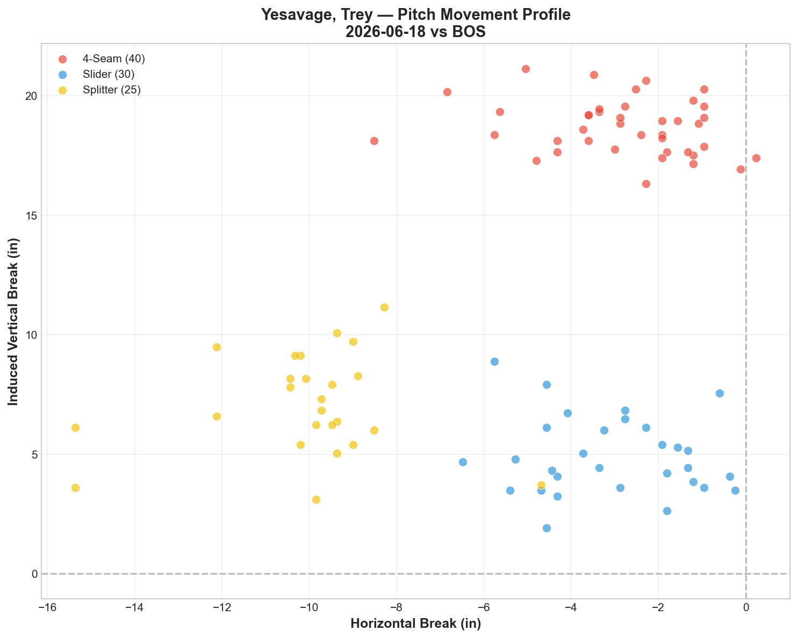
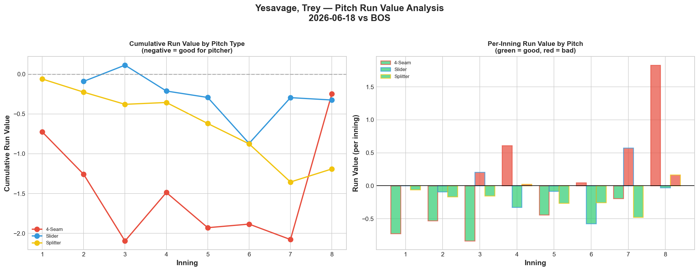
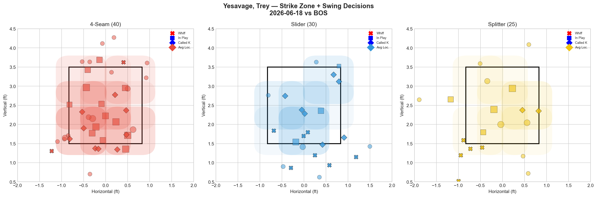
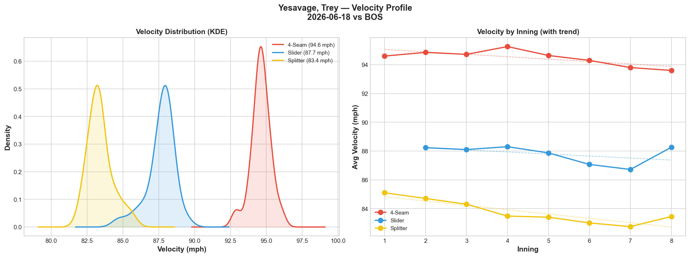
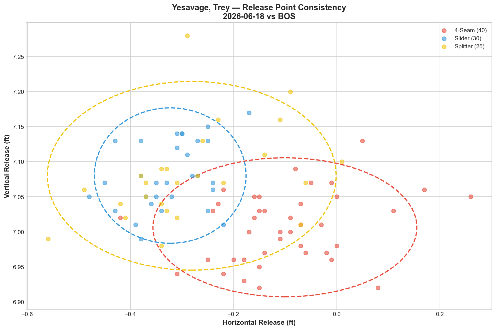
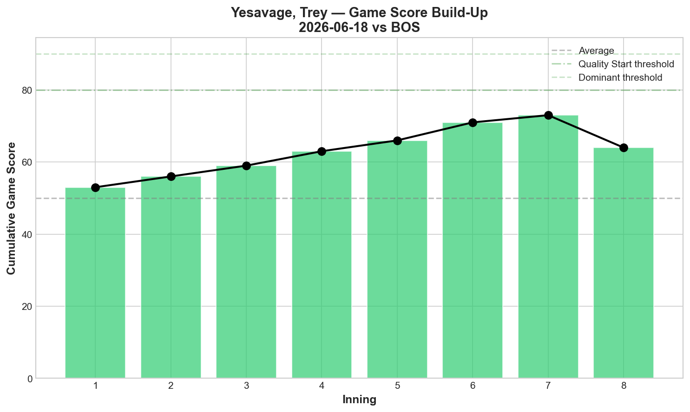
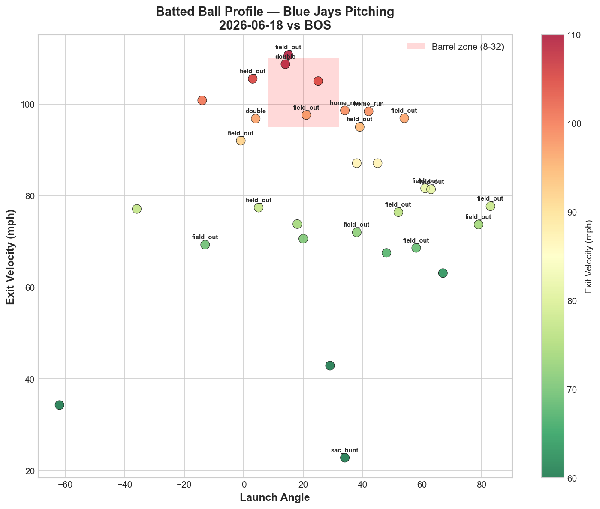
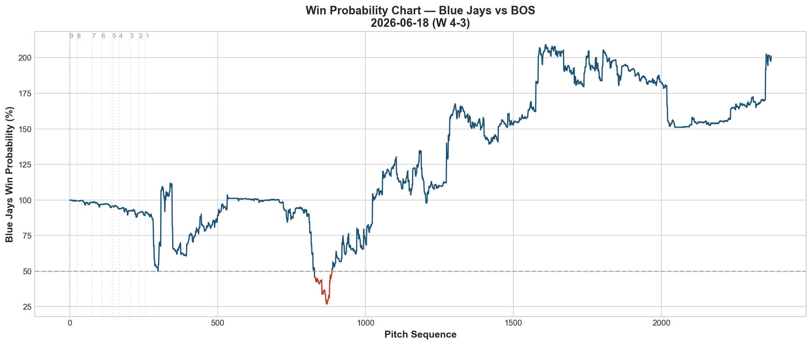
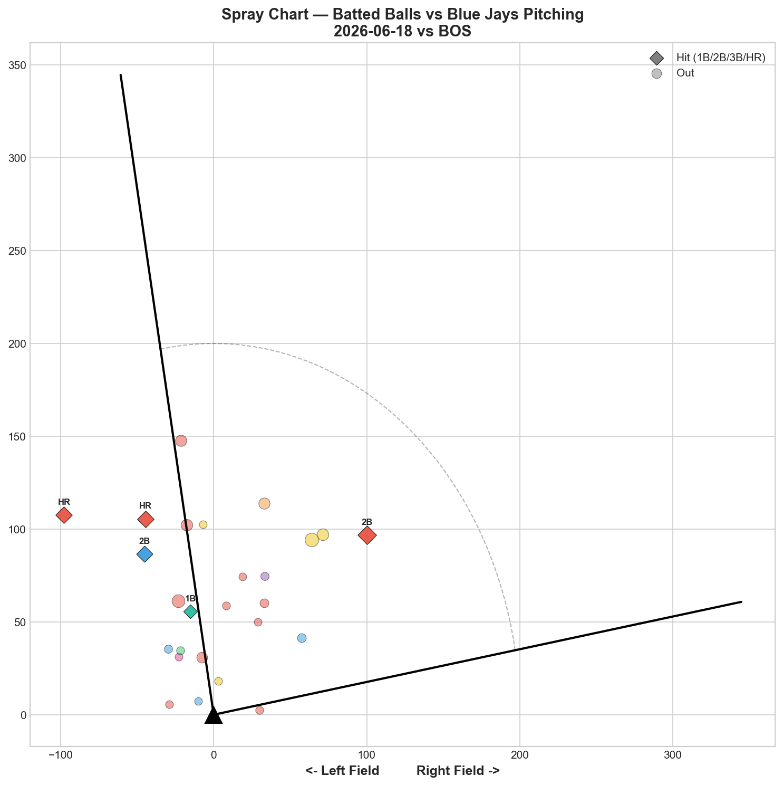

# 🏟️ Blue Jays Game Report v2.1
## 2026-06-18 | TOR @ BOS | W 4-3

---

## 📋 Game Overview

| | |
|---|---|
| **Date** | 2026-06-18 |
| **Matchup** | Toronto Blue Jays @ Boston Red Sox |
| **Result** | **W 4-3** |
| **Starter** | Trey Yesavage (95 pitches) |
| **Spotlight Pitcher** | None |
| **Season Record** | **37W-37L (.500)** |

---

## 🔥 Key Storylines

### 1. .500 Reached for the Third Time — On a 3-Game Win Streak

**37-37.** The Blue Jays have hit .500 for the third time this season (previously 28-28 on 5/28, 29-29 on 5/30). This time it comes on a 3-game sweep of Boston — the Jays' longest active winning streak. Cease dominated Game 1 (6-1), the bullpen shut out Game 2 (3-0), and now Yesavage delivered Game 3 (4-3).

### 2. Yesavage Threw His Best Start Since the 5/20 Masterpiece

**All three pitches posted negative Run Value** — the first time since his 5/20 GS 74 masterpiece that every pitch contributed positively:

| Pitch | Whiff% | Grade | RV | Assessment |
|-------|--------|-------|----|------------|
| Splitter | 41.7% | 🟢 A | **-1.191** | ✅ Dominant |
| Slider | 60.0% | 🟢 A | **-0.325** | ✅ Career-best whiff |
| 4-Seam | 9.5% | 🔴 D | **-0.248** | ✅ Negative despite D grade |

**-1.764 total RV across 95 pitches.** That's nearly 2 runs of value saved. The splitter (-1.191) was his best single-pitch performance since 5/20, and the slider at **60.0% whiff is his highest slider whiff rate ever.**

### 3. Zero Walks — The Pattern Is Now Crystal Clear

| Start | BB | All Negative RV? | GS | Result |
|-------|-----|------------------|----|----|
| 5/20 vs NYY | **0** | **✅ Yes** | **74** | **W** |
| 5/25 vs MIA | 2 | ❌ No | 64 | L |
| 5/30 vs BAL | **7** | ❌ No | 45 | L |
| 6/5 vs BAL | 2 | ❌ No | 52 | L |
| 6/12 vs NYY | **6** | ❌ No | 44 | W (bailout) |
| **6/18 vs BOS** | **0** | **✅ Yes** | **63** | **W** |

**The correlation is absolute:** when Yesavage walks 0, all pitches post negative RV and he delivers quality starts (GS 74, GS 63). When walks spike (6-7), everything collapses. There's no middle ground — it's binary. The walks aren't a symptom; they're the cause. When Yesavage is in the zone, his stuff plays. When he falls behind, it doesn't.

---

## ⚾ Starter Pitch Arsenal Analysis — Trey Yesavage

### Pitch Arsenal Performance (95 pitches)

| Pitch | # | Usage | Velo | Whiff% | CSW% | Chase% | Grade |
|-------|---|-------|------|--------|------|--------|-------|
| 4-Seam | 40 | 42.1% | 94.6 | 9.5% | 27.5% | 33.3% | 🔴 D |
| Slider | 30 | 31.6% | 87.7 | 60.0% | 53.3% | 47.4% | 🟢 A |
| Splitter | 25 | 26.3% | 83.4 | 41.7% | 28.0% | 35.3% | 🟢 A |

Two A-grade pitches and all three posting negative RV — this is the Yesavage profile that wins games.

### The Whiff/RV Disconnect RESOLVED

In his previous starts, high whiff rates didn't translate to negative RV (slider 38.5% whiff on 6/5 but +1.896 RV). Tonight, the conversion worked:

| Pitch | Whiff% | Chase% | RV | Whiff → Value? |
|-------|--------|--------|-----|----------------|
| Slider | 60.0% | 47.4% | -0.325 | ✅ Yes |
| Splitter | 41.7% | 35.3% | -1.191 | ✅ Yes |
| 4-Seam | 9.5% | 33.3% | -0.248 | ✅ Yes |

The difference: **chase rate + whiff rate alignment.** The slider's 47.4% chase rate combined with 60% whiff means hitters were chasing AND missing. On his bad nights, hitters chased but made contact on the chase pitches — tonight they missed them entirely. **The 0 walks meant Yesavage was ahead in counts more often, deploying his off-speed in pitcher's counts rather than desperation counts.**

### Pitch Movement (inches)

| Pitch | H-Break | V-Break | Count |
|-------|---------|---------|-------|
| 4-Seam (FF) | -2.8 | 18.7 | 40 |
| Slider (SL) | -3.1 | 4.9 | 30 |
| Splitter (FS) | -10.0 | 7.1 | 25 |

### Pitch Tunneling Analysis

| Pair | Release Sim | Plate Sep | Tunnel | Velo Gap |
|------|-------------|-----------|--------|----------|
| **Slider/Splitter** | **0.5in** | **7.3in** | **🟢 14.5** | **4.2mph** |
| 4-Seam/Splitter | 2.3in | 13.7in | 🟢 5.8 | 11.2mph |
| 4-Seam/Slider | 2.8in | 13.8in | 🟢 4.9 | 7.0mph |

**🏆 Best Tunnel: Slider/Splitter (14.5)** — 0.5in release similarity with 4.2 mph velocity gap. The SL/FS pair is Yesavage's identity tunnel — when both pitches are A-grade (tonight), the deception is elite.

### Pitch Run Value by Type

| Pitch | Total RV | Per Pitch | Pitches | Assessment |
|-------|----------|-----------|---------|------------|
| Splitter | **-1.191** | **-0.0476** | 25 | ✅ Best pitch — dominant |
| Slider | -0.325 | -0.0108 | 30 | ✅ Effective |
| 4-Seam | -0.248 | -0.0062 | 40 | ✅ Negative despite D whiff |

**Net: -1.764 RV.** All negative. Only the second time in 6 starts (after 5/20).

### Pitch Selection by Count

| Situation | Primary | Secondary | Notes |
|-----------|---------|-----------|-------|
| First Pitch (0-0) | 4-Seam 53.8% | Splitter 26.9% | FF-first approach |
| Ahead | Splitter 42.9% | Slider 39.3% | **Off-speed dominant ahead** |
| Behind | 4-Seam 58.8% | Slider 29.4% | FF when behind |
| Even | Slider 42.9% | 4-Seam 38.1% | Slider in neutral |
| Full Count (3-2) | 4-Seam 100% | — | All fastballs |

**Key: 82.2% off-speed when ahead (FS 42.9% + SL 39.3%).** This is the optimal Yesavage sequencing — establish with the fastball, finish with off-speed. When both the splitter and slider are Grade A and he's ahead in counts, hitters have zero chance.

**Strikeout Pitches (6 K's):** FS 3, SL 2, FF 1 — off-speed as primary K weapons.

### vs LHB/RHB Split

| Stand | Pitches | Avg Velo | Swinging Strikes | Whiff/Pitch |
|-------|---------|----------|------------------|-------------|
| L | 35 | 88.9 | 6 | 17.1% |
| R | 60 | 89.8 | 10 | 16.7% |

**Nearly identical whiff rates across both sides (17.1% vs 16.7%).** This is the best balanced split Yesavage has posted — previous starts were heavily skewed.

### Top Opposing Batters

| Batter | Pitches | Hits | K | BB | Avg EV |
|--------|---------|------|---|-----|--------|
| Connor Wong | 20 | 0 | **2** | 0 | 77.9 |
| Willson Contreras | 14 | 0 | 1 | 0 | 79.2 |
| Mickey Gasper | 14 | 1 | 0 | 0 | 84.8 |
| Wilyer Abreu | 13 | 0 | 1 | 0 | 84.6 |
| Jarren Duran | 8 | 0 | 1 | 0 | 83.5 |

**Wong: 0-for, 2K in 20 pitches. Contreras: 0-for, 1K in 14 pitches (2nd straight game shut down). Abreu: 0-for in 13. Duran: 0-for in 8.** The top 5 Red Sox hitters combined for 1 hit in 69 pitches. Yesavage dominated the entire lineup.

### Velocity Profile

- **4-Seam:** 94.6 → 93.6 mph (-1.0)
- **Slider:** 88.2 → 88.3 mph (+0.0)
- **Splitter:** 85.1 → 83.4 mph (-1.6)

Slider held perfectly flat. Splitter dropped 1.6 mph — within normal range. Fastball -1.0 is acceptable for 95 pitches.

### Game Score / Release / Batted Ball

**Game Score: 63 (QUALITY).** 6K, 5H, 1HR, 0BB on 95 pitches. His best GS since 5/20 (74).

| Metric | Value |
|--------|-------|
| Total BIP | 31 |
| Avg Exit Velo | 81.0 mph |
| Avg Launch Angle | 27.8° |
| Hard Hit (95+ mph) | 11/31 (35%) |

35% hard-hit rate is elevated, but the 81.0 mph avg EV and 19% hit rate on 26 batted balls tracked mean the contact wasn't finding gaps. The high launch angle (27.8°) produced fly outs rather than line drives.

---

## 📊 Bullpen Detailed Analysis

| Pitcher | Pitches | Line | Key Pitch | Notes |
|---------|---------|------|-----------|-------|
| **Tommy Nance** | 14 | 0K / 0BB / 1H / 0HR | SL 75% whiff 🟢A | Slider elite — consistent |
| **Mason Fluharty** | 5 | 0K / 0BB / 0H / 0HR | ST 66.7% CSW | Just 5 pitches — clean |

### Bullpen Notes

- Only **2 relievers used** — Yesavage's 95 pitches meant minimal bullpen strain. Back-to-back efficient starter outings (Cease 108P, Yesavage 95P) are preserving the bullpen.
- **Nance's slider at 75% whiff** is now consistently A-grade across appearances. It's becoming his most reliable pitch.

---

## 📈 Win Probability Analysis

### Key WPA Moments

| Inning | Event | Impact |
|--------|-------|--------|
| 1 | Leiter — home_run | 📈 Early Jays lead (WP 192.2%) |
| 4 | Manaea — single | 📈 Extended lead (WP 191.5%) |
| 8 | Yesavage — HR allowed | 📉 Red Sox pulled close |
| 8 | Doval — home_run | 📉 1-run game |
| 9 | Chapman — double | 📉 Late threat |
| 9 | Vesia — strikeout | 📈 Game saved |

---

## 📊 Spray Chart & Batted Ball Summary

| Metric | Value |
|--------|-------|
| Total batted balls tracked | 26 |
| Hits | 5 (19%) |
| Pull | 4 (15%) |
| Center | 19 (73%) |
| Oppo | 3 (12%) |

---

## 🎯 Analytical Takeaways

1. **Yesavage's Walk Rate Is the Binary Switch** — 0 BB = all negative RV, GS 63+, W. 6+ BB = positive RV, GS 44-45, L. There's no in-between. The walk rate determines everything else. When he's in the zone, his slider (60% whiff) and splitter (41.7% whiff) are unhittable. When he's falling behind, those same pitches get exposed.

2. **All Three Pitches Negative RV — First Time Since 5/20** — FS -1.191, SL -0.325, FF -0.248. Total -1.764. This is the version of Yesavage that wins games. The whiff/RV disconnect that plagued his 6/5 and 6/12 starts didn't appear tonight because he was ahead in counts.

3. **Slider 60% Whiff Is His Career Best** — 60% whiff with 53.3% CSW. The slider was his most dominant pitch by swing-and-miss, while the splitter (-1.191 RV) was his most dominant by run prevention. Two A-grade pitches working simultaneously.

4. **3-Game Sweep of Boston** — 6-1 (Cease), 3-0 (bullpen shutout), 4-3 (Yesavage). Combined: 13-4 across 3 games. The pitching staff allowed 4 runs total in 3 games. This is the best 3-game pitching stretch of the season.

5. **37-37 — .500 for the Third Time** — Every time the Jays reach .500, they've done it by winning close games with pitching. The formula works when the walks are controlled and the off-speed is deployed ahead in counts.

6. **Game Classification: Redemption Start** — After a GS 44 disaster on 6/12 (6 walks), Yesavage responded with GS 63, 0 walks, and all negative RV. This is the bounce-back the rotation needed.

---

*Report generated from Statcast data via pybaseball. All pitch metrics sourced from Baseball Savant.*
