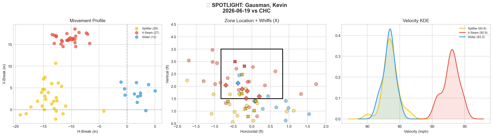
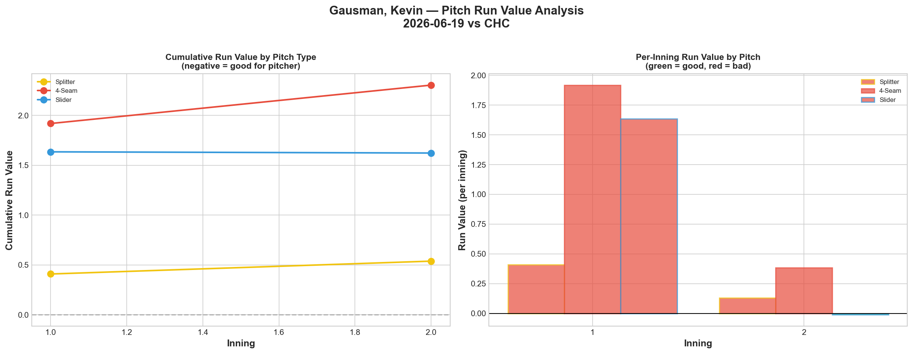
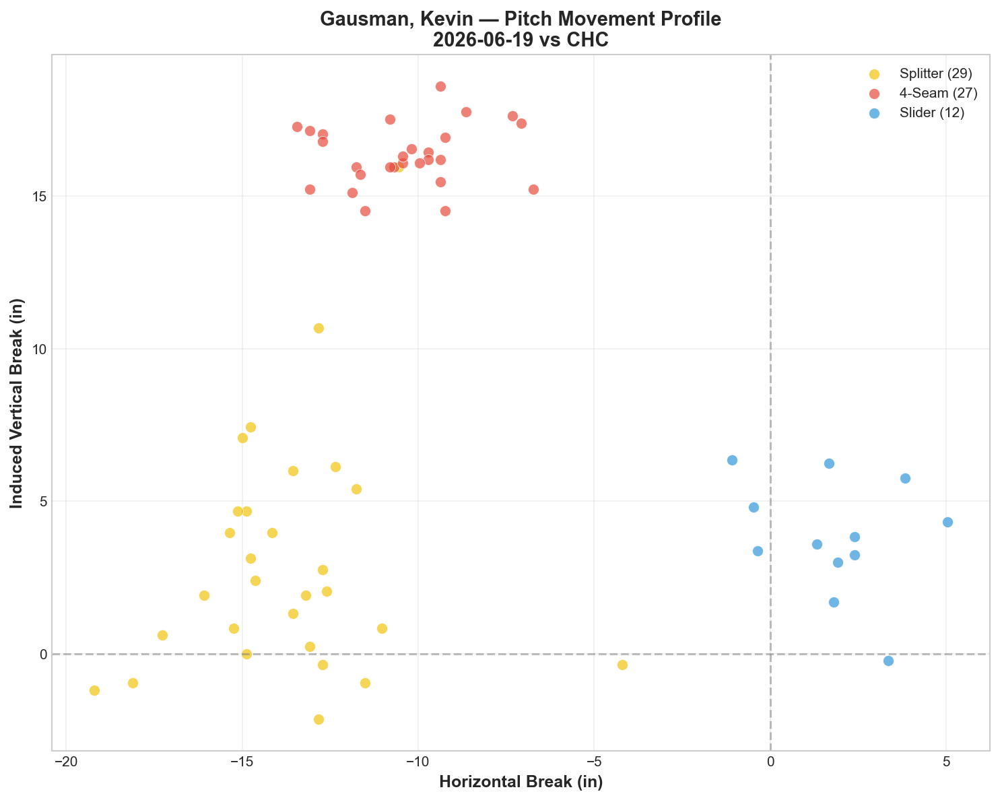
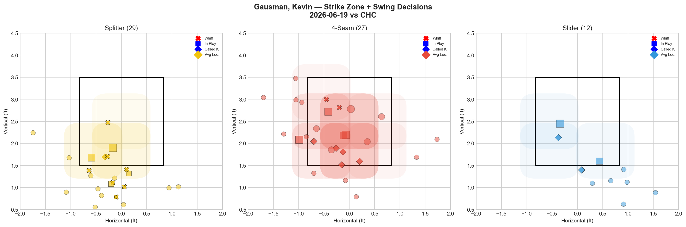
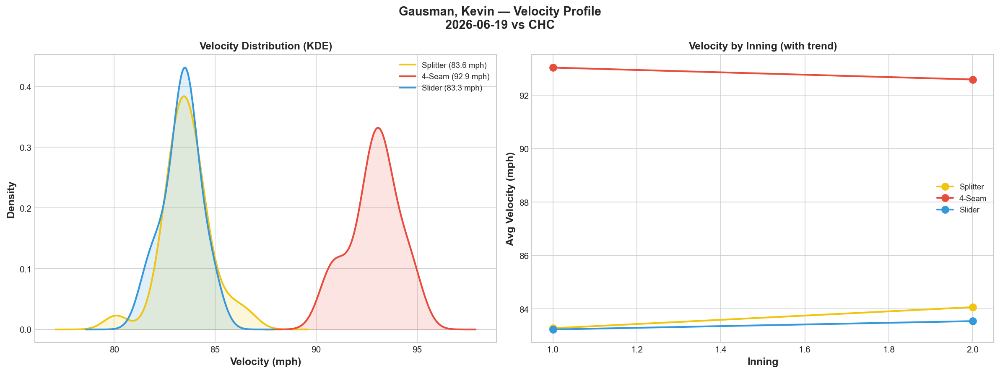
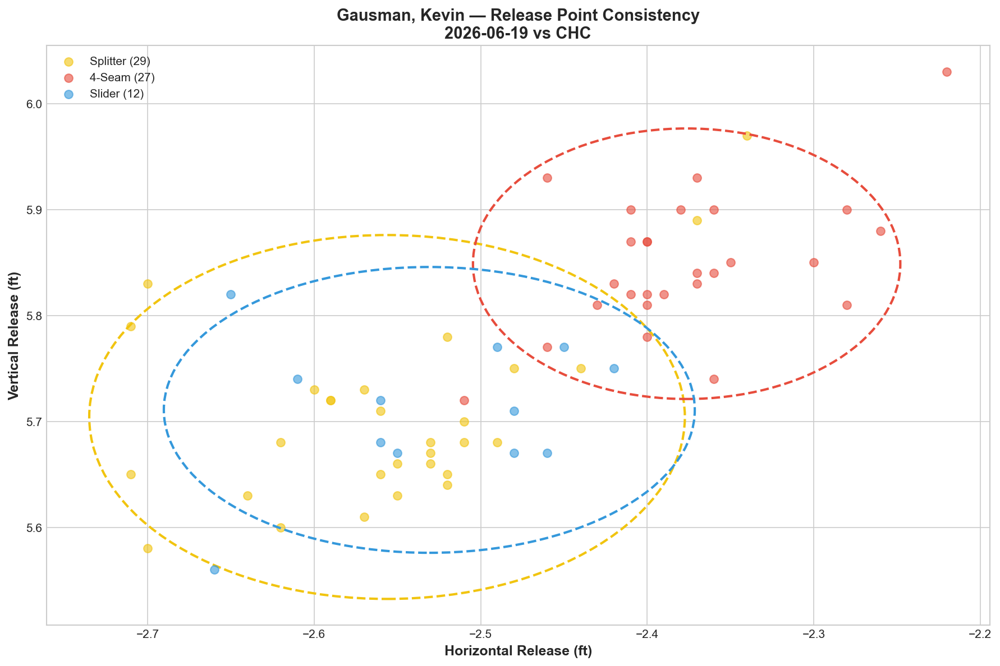
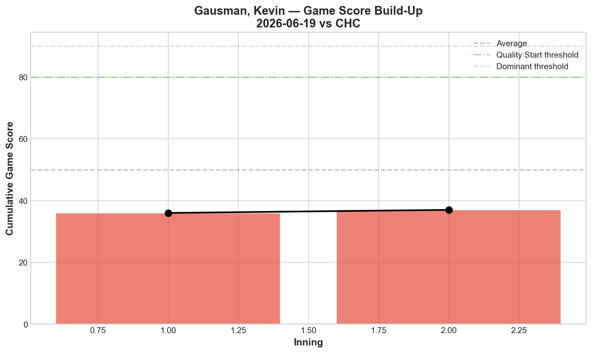
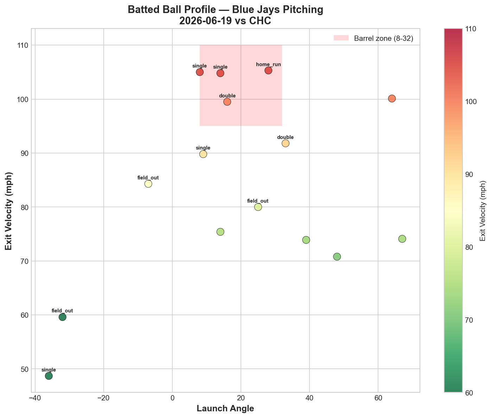
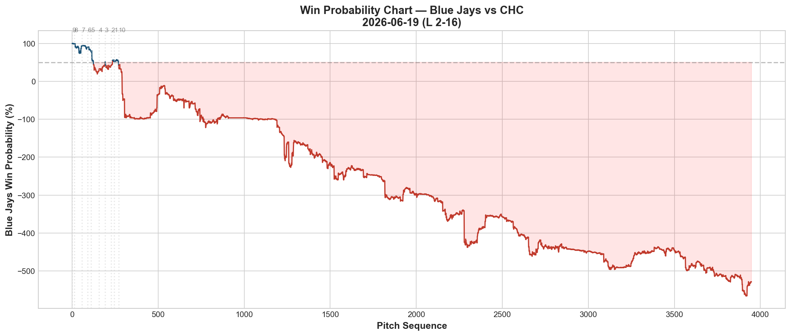
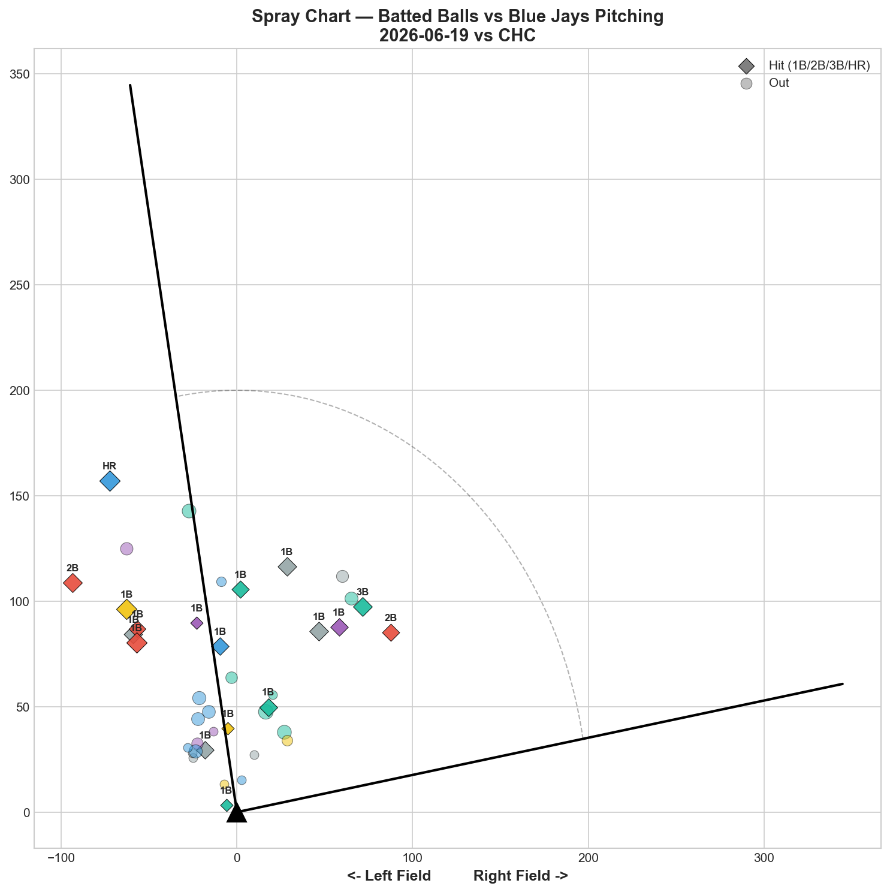

# 🏟️ Blue Jays Game Report v2.1
## 2026-06-19 | TOR @ CHC | L 2-16

---

## 📋 Game Overview

| | |
|---|---|
| **Date** | 2026-06-19 |
| **Matchup** | Toronto Blue Jays @ Chicago Cubs |
| **Result** | **L 2-16** |
| **Starter** | Kevin Gausman (89 pitches) |
| **Spotlight Pitcher** | Kevin Gausman |
| **Season Record** | 37W-38L |

---

## 🔥 Key Storylines

### 1. From Record-Setting Masterpiece to Career-Worst in 6 Days

Six days ago, Gausman posted **-3.293 fastball RV** — the single best pitch performance in our reporting history. Tonight: **+4.364 total RV, Game Score 27, 10 hits allowed in 89 pitches.** This is the worst single-game pitching performance we've tracked from any Blue Jays starter.

| Start | FF RV | FS RV | SL RV | Total RV | GS |
|-------|-------|-------|-------|----------|-----|
| 6/7 vs BAL | -2.337 | +1.422 | +2.225 | +1.310 | 54 |
| 6/13 vs NYY | **-3.293** | +0.091 | +0.124 | -3.078 | **69** |
| **6/19 vs CHC** | **+1.542** | **+1.834** | **+0.988** | **+4.364** | **27** |

**All three pitches posted positive RV for the first time in any Gausman start.** A **7.442 total RV swing** in 6 days from the same pitcher.

### 2. The Splitter Velocity Fade Is Now a Documented Pattern

The splitter dropped from **86.5 mph to 82.2 mph — a -4.3 mph decline.** This is the second time Gausman's splitter has faded 4+ mph in a single game:

| Start | FS Start Velo | FS End Velo | Decline | FS RV | Result |
|-------|-------------|-----------|---------|-------|--------|
| 5/27 vs MIA | 85.9 | 81.0 | **-4.9 mph** | +1.283 | W 2-1 |
| **6/19 vs CHC** | **86.5** | **82.2** | **-4.3 mph** | **+1.834** | **L 2-16** |

When the splitter velocity drops 4+ mph, it converges with the slider (83.0 mph tonight). The velocity gap between FS and SL shrinks to essentially zero — and hitters can no longer distinguish between them. The FS/SL tunnel that makes Gausman elite collapses when both pitches arrive at the same speed.

**This is a workload signal.** Gausman threw 105 pitches on 6/13. Four days later, his arm couldn't sustain splitter velocity. **Workload management recommendation: 90-pitch cap with 5+ days rest.**

### 3. GS 27 Is a Season Low by a Wide Margin

| Rank | GS | Pitcher | Date |
|------|-----|---------|------|
| **Worst** | **27** | **Gausman** | **6/19** |
| 2nd | 41 | Corbin | 6/8 |
| 2nd | 41 | Scherzer | 6/10 |
| 4th | 43 | Miles | 5/31 |
| 5th | 44 | Yesavage | 6/12 |

GS 27 is **14 points below the previous worst.** This wasn't a bad start — it was a collapse.

---

## 🔍 Spotlight Pitcher — Kevin Gausman (Collapse Analysis)

### Pitch Arsenal Performance (89 pitches)

| Pitch | # | Usage | Velo | Whiff% | CSW% | Chase% | Grade |
|-------|---|-------|------|--------|------|--------|-------|
| 4-Seam | 40 | 44.9% | 93.6 | 12.5% | 20.0% | 20.0% | 🟡 C |
| Splitter | 30 | 33.7% | 84.1 | 16.7% | 13.3% | 20.0% | 🟡 C |
| Slider | 19 | 21.3% | 83.0 | 33.3% | 15.8% | 12.5% | 🟢 A |

The slider still graded A by whiff (33.3%) but posted **+0.988 RV.** The whiff/RV disconnect is now a Gausman signature.

### Velocity Collapse

| Pitch | Start Velo | End Velo | Decline |
|-------|-----------|----------|---------|
| 4-Seam | 94.6 | 92.8 | -1.8 mph |
| Splitter | 86.5 | 82.2 | **-4.3 mph** |
| Slider | 82.7 | 83.5 | +0.8 mph |

When the splitter drops to 82.2 and the slider sits at 83.0, there's only **0.8 mph separation** — the FS/SL tunnel collapses.

### Gausman's Fastball Trend — The Streak Broke

| Start | FF RV | Assessment |
|-------|-------|------------|
| 5/27 vs MIA | -1.050 | ✅ |
| 6/2 vs ATL | -0.748 | ✅ |
| 6/7 vs BAL | -2.337 | ✅ Record |
| 6/13 vs NYY | -3.293 | ✅ New Record |
| **6/19 vs CHC** | **+1.542** | **🔴 Streak broken** |

### Pitch Tunneling

| Pair | Release Sim | Plate Sep | Tunnel | Velo Gap |
|------|-------------|-----------|--------|----------|
| **Splitter/Slider** | **0.9in** | **12.2in** | **🟢 14.1** | **1.1mph** |
| 4-Seam/Slider | 2.3in | 16.2in | 🟢 7.0 | 10.6mph |
| 4-Seam/Splitter | 2.7in | 10.6in | 🟢 3.9 | 9.5mph |

FS/SL tunnel at 14.1 — the **lowest Gausman tunnel score** we've tracked (previous best: 21.3).

### Pitch Run Value

| Pitch | Total RV | Per Pitch | Pitches | Assessment |
|-------|----------|-----------|---------|------------|
| 4-Seam | +1.542 | +0.0386 | 40 | 🔴 Reversed from record |
| Splitter | +1.834 | +0.0611 | 30 | 🔴 Worst FS outing |
| Slider | +0.988 | +0.052 | 19 | 🔴 A-whiff but positive RV |

### Top Opposing Batters

| Batter | Pitches | Hits | K | BB | Avg EV |
|--------|---------|------|---|-----|--------|
| Dansby Swanson | 12 | 2 | 0 | 0 | 79.1 |
| Byron Buxton | 11 | 2 | 0 | 0 | **100.2** |
| Seiya Suzuki | 10 | 2 | 0 | 0 | 94.3 |
| Cody Bellinger | 9 | 0 | 1 | 0 | 88.3 |
| Pete Crow-Armstrong | 7 | 0 | 1 | 0 | 70.2 |

**Buxton: 100.2 mph avg EV.** Destroying everything.

### Batted Ball Profile

| Metric | Value |
|--------|-------|
| Total BIP | 33 |
| Avg Exit Velo | **89.3 mph** |
| Avg Launch Angle | 20.3° |
| Hard Hit (95+ mph) | **14/33 (42%)** |

**89.3 mph avg EV and 42% hard-hit — both report-history worsts.** Compare to 6/13: 75.7 mph EV, 7% hard-hit.

---

## 📊 Bullpen Detailed Analysis

| Pitcher | Pitches | Line | Key Pitch | Notes |
|---------|---------|------|-----------|-------|
| **Adam Macko** | 31 | **3K / 0BB / 0H / 0HR** | **SL 50% 🟢A, FF 42.9% 🟢A** | **Dual A-grade AGAIN — untouched in blowout** |
| **Connor Seabold** | 25 | 1K / 0BB / 1H / 0HR | CU 100% 🟢A | Curveball breakthrough |
| **Hayden Juenger** | 36 | 0K / 2BB / 3H / 0HR | All 🔴D | 0 whiffs in 36 pitches |
| **Tommy Nance** | 11 | 0K / 0BB / 2H / 1HR | All 🔴D | Gave up HR |
| **Tyler Rogers** | 5 | 0K / 0BB / 1H / 0HR | All 🔴D | Mop-up |

### Macko Continues His Remarkable Run

Even in a 2-16 blowout, **Macko threw 31 pitches with 3K, 0H, 0BB.** Dual A-grade for the **third time in four appearances:**

| App | Date | SL Whiff | FF Whiff | A-Grades | H |
|-----|------|----------|----------|----------|---|
| 10 | 6/5 | 62.5% | — | 1 | 0 |
| 11 | 6/7 | 100% | 40% | **2** | 1 |
| 12 | 6/14 | 20% | — | 0 | 2 |
| **13** | **6/19** | **50%** | **42.9%** | **2** | **0** |

**12 of 13 career appearances, 0 HR allowed.** Macko should be getting higher-leverage innings.

---

## 📈 Win Probability Analysis

---

## 📊 Spray Chart & Batted Ball Summary

| Metric | Value |
|--------|-------|
| Total batted balls tracked | 37 |
| Hits | 15 (41%) |
| Pull | 7 (19%) |
| Center | 24 (65%) |
| Oppo | 6 (16%) |

---

## 🎯 Analytical Takeaways

1. **The Splitter Velocity Fade Is Gausman's Achilles' Heel** — -4.9 mph on 5/27, -4.3 mph tonight. When the splitter drops below 83 mph, it converges with the slider and the FS/SL tunnel collapses. The 105-pitch outing on 6/13 likely caused tonight's velocity fade. **90-pitch cap with 5+ days rest recommended.**

2. **+4.364 Total RV Is the Worst Starter Performance We've Tracked** — All three pitches positive. GS 27. 42% hard-hit. 89.3 mph avg EV. This is the data floor for Gausman.

3. **Gausman's Fastball Streak Broke After 4 Starts** — FF -1.050 → -0.748 → -2.337 → -3.293 → +1.542. The fastball that carried him through four elite outings became a liability.

4. **Macko Is the Blowout Silver Lining** — 3K, 0H, dual A-grade in a 2-16 loss. 13 appearances, consistent excellence. He needs higher-leverage deployment.

5. **37-38 — The .500 Stay Lasted 1 Game Again** — Third time reaching .500, third time immediately dropping back.

6. **Game Classification: Velocity Collapse** — When Gausman's splitter fades 4+ mph, the entire arsenal unravels. This is a workload management issue, not a stuff issue.

---

*Report generated from Statcast data via pybaseball. All pitch metrics sourced from Baseball Savant.*
