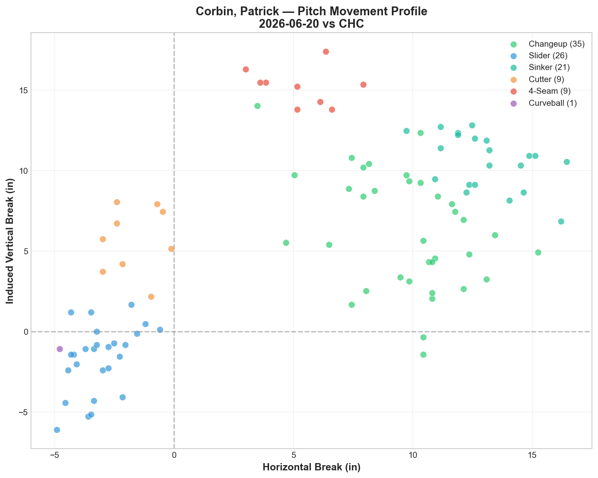
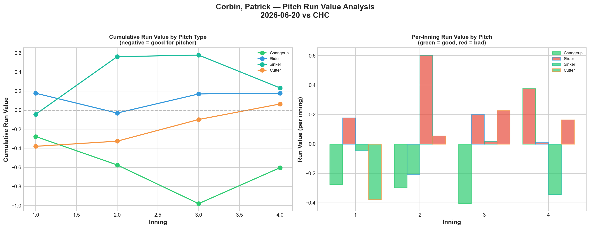
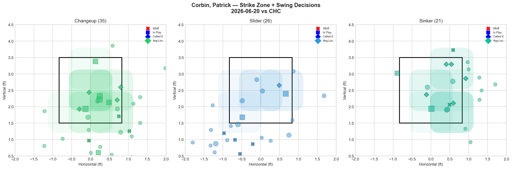
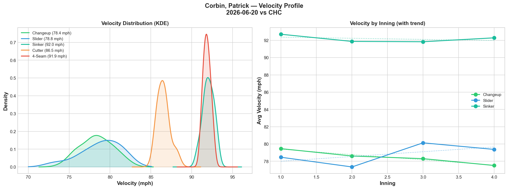
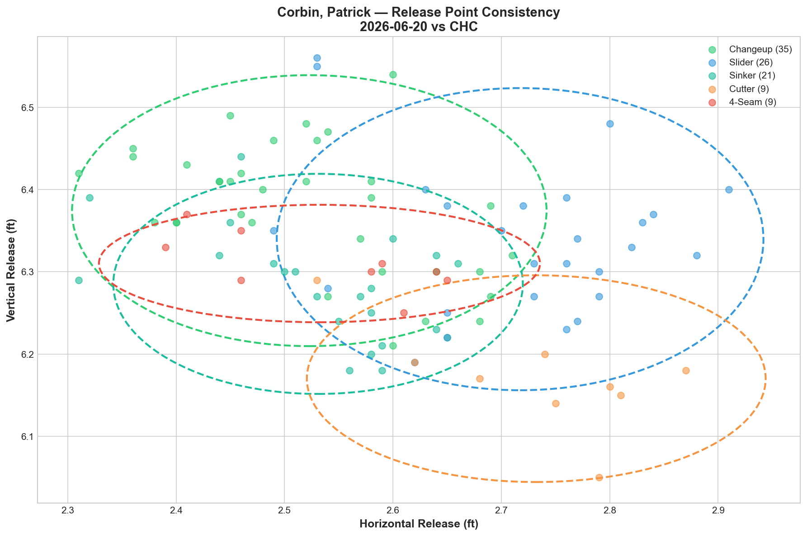
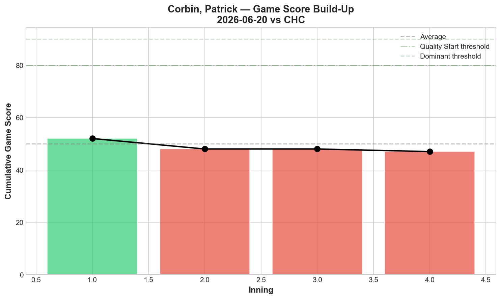
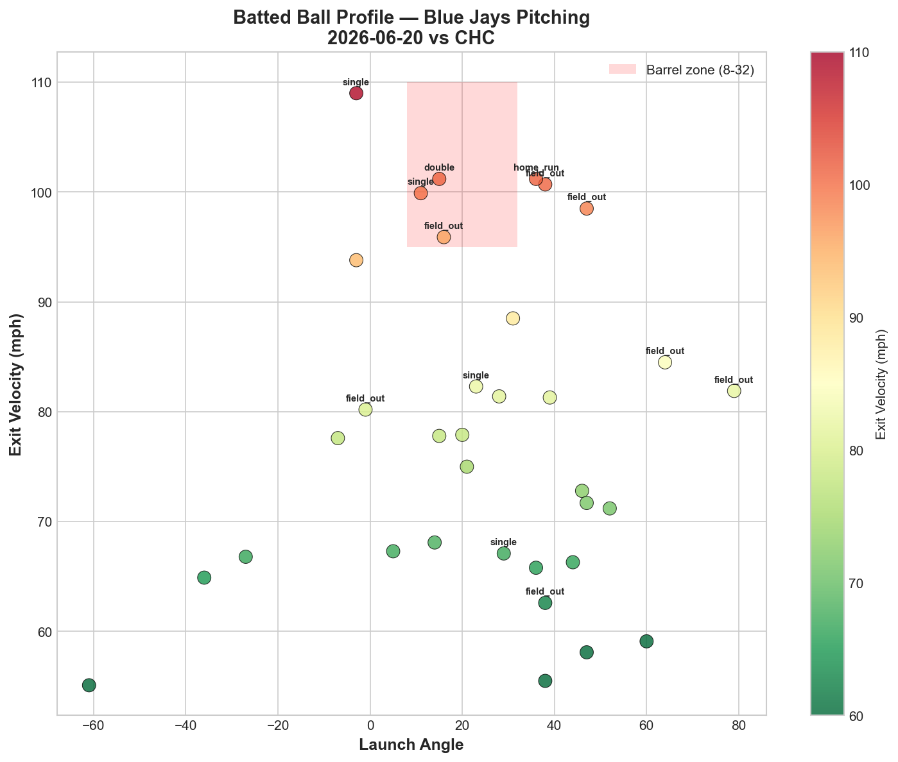
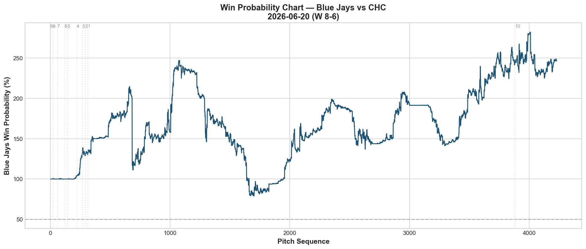
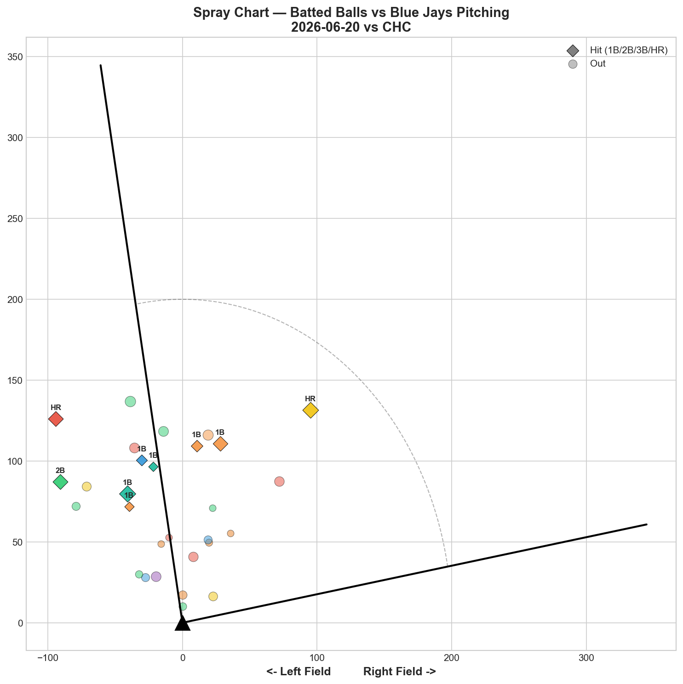

# 🏟️ Blue Jays Game Report v2.1
## 2026-06-20 | TOR @ CHC | W 8-6

---

## 📋 Game Overview

| | |
|---|---|
| **Date** | 2026-06-20 |
| **Matchup** | Toronto Blue Jays @ Chicago Cubs |
| **Result** | **W 8-6** |
| **Starter** | Patrick Corbin (101 pitches) |
| **Spotlight Pitcher** | None |
| **Season Record** | **38W-38L (.500)** |

---

## 🔥 Key Storylines

### 1. .500 Reached for the Fourth Time

**38-38.** The Blue Jays have hit .500 four times this season (5/28, 5/30, 6/18, and now 6/20). This time it comes on the heels of the Gausman disaster (2-16 on 6/19) — the offense and bullpen responded immediately with an 8-6 comeback win.

### 2. The Changeup Confirms Its Status — 6 Straight Starts of Negative RV

Corbin's changeup posted **-0.603 RV tonight** — negative for the **sixth consecutive start.** This is now a two-month pattern with zero exceptions.

| Start | CH RV | Cumulative |
|-------|-------|------------|
| 5/23 vs PIT | -1.079 | -1.079 |
| 5/28 vs BAL | -0.090 | -1.169 |
| 6/3 vs ATL | -0.198 | -1.367 |
| 6/8 vs PHI | -0.534 | -1.901 |
| 6/14 vs NYY | -0.739 | -2.640 |
| **6/20 vs CHC** | **-0.603** | **-3.243** |

**-3.243 cumulative RV across 6 starts.** No other pitch on the Blue Jays staff — starter or reliever — has sustained this level of consistency. Usage was 34.7% tonight, his highest changeup usage of the stretch. When Corbin leans on the changeup, results follow.

### 3. Corbin Threw 101 Pitches — Season High, Struck Out Only 0... Wait, 4 K's But Game Score 45

Despite 101 pitches (his deepest outing of the season), Corbin posted a modest **Game Score 45.** The 4-seam (used sparingly, 8.9%) posted a brutal **+1.066 RV in just 9 pitches (+0.1184 per pitch)** — the least efficient pitch we've seen from him. When Corbin strayed from his changeup/slider/sinker mix into the fastball, the results were disastrous on a per-pitch basis.

---

## ⚾ Starter Pitch Arsenal Analysis — Patrick Corbin

### Pitch Arsenal Performance (101 pitches)

| Pitch | # | Usage | Velo | Whiff% | CSW% | Chase% | Grade |
|-------|---|-------|------|--------|------|--------|-------|
| Changeup | 35 | 34.7% | 78.4 | 23.1% | 20.0% | 18.2% | 🟢 B |
| Slider | 26 | 25.7% | 78.8 | 30.8% | 19.2% | 40.0% | 🟢 A |
| Sinker | 21 | 20.8% | 92.0 | 22.2% | 33.3% | 27.3% | 🟢 B |
| Cutter | 9 | 8.9% | 86.5 | 0.0% | 22.2% | 0.0% | 🔴 D |
| 4-Seam | 9 | 8.9% | 91.9 | 16.7% | 11.1% | 60.0% | 🟡 C |
| Curveball | 1 | 1.0% | 68.0 | 0.0% | 0.0% | 0.0% | 🔴 D |

**Changeup at 34.7% usage — his highest ever.** Combined with the slider (25.7%), off-speed pitches accounted for **60.4% of his total pitches.** This is the arsenal shift the data has been calling for across 6 starts.

### The Complete 6-Start Corbin Database

| Pitch | Cumulative RV | Verdict |
|-------|---------------|---------|
| **Changeup** | **-3.243** | ✅✅ Confirmed primary weapon |
| **Slider** | ~-0.33 (est.) | 🟡 Inconsistent — great early, faded mid-stretch |
| **Curveball** | ~-0.20 (est.) | ✅ Show-me pitch, small sample |
| **Cutter** | ~+0.80 (est.) | 🔴 Consistent liability |
| **4-Seam** | ~+2.18 (est.) | 🔴 Getting worse each start |
| **Sinker** | ~+4.63 (est.) | 🔴🔴 Still the biggest liability overall |

Tonight's sinker (+0.233) was actually one of his better sinker outings — but the cumulative damage from 5/18, 5/28, and 6/8 keeps it as the clear worst pitch across the full sample.

### Pitch Tunneling Analysis

| Pair | Release Sim | Plate Sep | Tunnel | Velo Gap |
|------|-------------|-----------|--------|----------|
| **Sinker/4-Seam** | **0.3in** | **9.0in** | **🟢 30.4** | **0.2mph** |
| Changeup/4-Seam | 0.8in | 10.0in | 🟢 12.9 | 13.5mph |
| Slider/Sinker | 2.3in | 20.3in | 🟢 8.7 | 13.2mph |
| Slider/4-Seam | 2.2in | 18.9in | 🟢 8.4 | 13.1mph |

**Sinker/4-Seam tunnel: 30.4** — his highest tunnel score ever, with a near-identical release point (0.3in) and virtually no velocity gap (0.2mph). Ironically, his two weakest pitches by run value create his best tunneling geometry. This confirms they're mechanically the same pitch shape — but neither commands the zone effectively enough to capitalize on the deception.

### Pitch Run Value by Type

| Pitch | Total RV | Per Pitch | Pitches | Assessment |
|-------|----------|-----------|---------|------------|
| Changeup | **-0.603** | **-0.0172** | 35 | ✅ Best pitch (6th straight) |
| Curveball | +0.046 | +0.046 | 1 | — (tiny sample) |
| Cutter | +0.065 | +0.0072 | 9 | 🟡 Marginal |
| Slider | +0.179 | +0.0069 | 26 | 🟡 Marginal leak |
| Sinker | +0.233 | +0.0111 | 21 | 🟡 Better than usual |
| 4-Seam | +1.066 | +0.1184 | 9 | 🔴 Worst per-pitch ever |

### Pitch Selection by Count

| Situation | Primary | Secondary | Notes |
|-----------|---------|-----------|-------|
| First Pitch (0-0) | **Changeup 40.0%** | Sinker 30.0% | Changeup leads first pitch — new! |
| Ahead | Changeup 41.7% | Slider 33.3% | Off-speed dominant |
| Behind | Changeup 36.4% | Slider 27.3% | Still changeup-first even behind |
| Even | Changeup 33.3% | Slider 25.0% | Consistent approach |
| Full Count (3-2) | SL/SI 27.3% each | Cutter/FF 18.2% each | Diverse — no single pitch dominant |

**The changeup is now Corbin's default pitch in every count situation** — first pitch, ahead, behind, even. This is a complete arsenal transformation from the sinker-first approach we saw in May.

**Strikeout Pitches (4 K's):** SI 2, SL 2.

### Top Opposing Batters

| Batter | Pitches | Hits | K | BB | Avg EV |
|--------|---------|------|---|-----|--------|
| Nico Hoerner | 23 | 0 | 0 | 1 | 76.3 |
| Pete Crow-Armstrong | 16 | 0 | 2 | 1 | 68.8 |
| Matt Shaw | 14 | 1 | 1 | 0 | 78.8 |
| Seiya Suzuki | 11 | 1 | 0 | 1 | 73.9 |
| Alex Bregman | 9 | 1 | 0 | 0 | 67.6 |

**Hoerner 0-for in 23 pitches — Corbin's longest shutdown at-bat sequence of the season.** Crow-Armstrong also hitless with 2K. Contact quality was weak across the board (67.6-78.8 mph EV on contact).

### Velocity Profile

- **Changeup:** 79.5 → 77.5 mph (-1.9)
- **Slider:** 78.5 → 79.4 mph (+0.9)
- **Sinker:** 92.7 → 92.3 mph (-0.4)

The changeup lost velocity but the slider gained — both within normal range for 101 pitches.

### Game Score / Release / Batted Ball

**Game Score: 45 (AVERAGE).** 4K, 6H, 1HR, 3BB on 101 pitches — his deepest outing of the season by pitch count, but not his sharpest by outcome.

| Metric | Value |
|--------|-------|
| Total BIP | 34 |
| Avg Exit Velo | 78.3 mph |
| Avg Launch Angle | 23.6° |
| Hard Hit (95+ mph) | 7/34 (21%) |

78.3 mph average EV — weak contact overall despite the runs allowed. The damage came from a few well-placed hits rather than sustained hard contact.

---

## 📊 Bullpen Detailed Analysis

| Pitcher | Pitches | Line | Key Pitch | Notes |
|---------|---------|------|-----------|-------|
| **Louis Varland** | 28 | 2K / 0BB / 0H / 0HR | **KC 28.6% whiff 🟢B** | Longest Varland outing — clean |
| **Lazaro Estrada** | 32 | 0K / 2BB / 1H / 1HR | FF 20% 🟢B, SL 20% 🟢B, CU 50% 🟢A | Three graded pitches, gave up HR |
| **Jeff Hoffman** | 22 | 1K / 2BB / 0H / 0HR | SL 16.7% 🟡C | Off night by his standards |
| **Mason Fluharty** | 11 | 0K / 1BB / 2H / 0HR | All 🔴D | Rough outing |

### Bullpen Notes

- **Varland** threw his longest relief outing (28 pitches) with 2K, 0H. His K-Curve at 53.6% usage and 28.6% whiff (Grade B) was the primary weapon — not his typical elite version, but effective and durable.
- **Estrada** made a notable appearance: 3 pitches graded B or better (FF, SL, CU all positive whiff grades), but gave up a HR. The curveball at 50% whiff (Grade A) stands out — a new arm worth tracking.
- **Hoffman** had a rare off night: slider only 16.7% whiff (Grade C), well below his recent 50-75% range. Still allowed 0 hits in 22 pitches, showing his floor remains high even on "bad" nights.
- **Fluharty** struggled — 0% whiff across cutter, sweeper, and changeup. His inconsistency between elite (A-grade cutter/sweeper) and flat (all D) outings continues.

---

## 📈 Win Probability Analysis

### Key WPA Moments

| Inning | Event | Impact |
|--------|-------|--------|
| 7 | Adam — home_run | 📈 Jays rally (WP 256.6%) |
| 8 | Webb — home_run | 📉 Cubs answered |
| 8 | Alexander — single | 📉 Cubs threatened (WP 270.1%) |
| 9 | Ashby — home_run | 📈 Jays retook lead |
| 9 | Hill — strikeout | 📈 Held the lead |
| 10 | Ross — home_run | 📉 Extras drama |

A back-and-forth slugfest that went to extras — the bullpen and offense combined for the win after Corbin's uneven start.

---

## 📊 Spray Chart & Batted Ball Summary

| Metric | Value |
|--------|-------|
| Total batted balls tracked | 29 |
| Hits | 9 (31%) |
| Pull | 2 (7%) |
| Center | 22 (76%) |
| Oppo | 5 (17%) |

---

## 🎯 Analytical Takeaways

1. **The Changeup's 6-Start Streak Is the Season's Most Reliable Pitch Data Point** — -3.243 cumulative RV, negative in every single tracked start. Usage tonight (34.7%) was his highest yet. The organizational case for a changeup-first Corbin is no longer a recommendation — it's happening in real time.

2. **Corbin's Fastball Usage Should Be Reconsidered** — +1.066 RV in just 9 pitches tonight (+0.1184 per pitch) is his worst-ever per-pitch fastball performance. At only 8.9% usage, it's already rare — but every fastball thrown is a low-probability bet.

3. **101 Pitches Didn't Mean His Best Start** — Volume and quality aren't the same thing. GS 45 with 3BB and 1HR despite the deepest outing of his season. The changeup-heavy approach limited damage but didn't eliminate it.

4. **38-38 — Fourth Time at .500** — The pattern continues: reach .500, threaten to break through, regress. This time came directly after the worst loss of the season (2-16), showing resilience but not the sustained breakthrough the team needs.

5. **Estrada's Curveball Debut Note** — 50% whiff in a small sample. Worth tracking in future appearances as a potential complement to the bullpen's breaking ball depth.

6. **Game Classification: Grind-It-Out Win** — Not a dominant pitching performance from Corbin, but the offense (8 runs) and bullpen (Varland's clean 28 pitches) combined to overcome a shaky start and secure the extra-innings win.

---

*Report generated from Statcast data via pybaseball. All pitch metrics sourced from Baseball Savant.*
