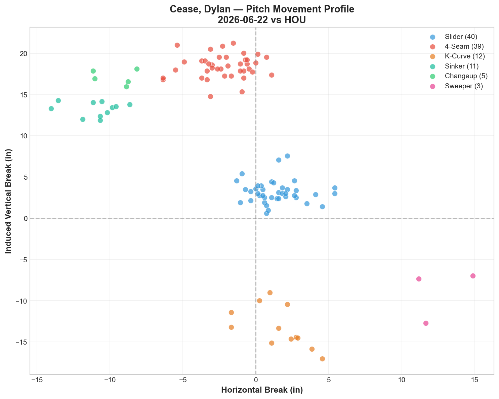
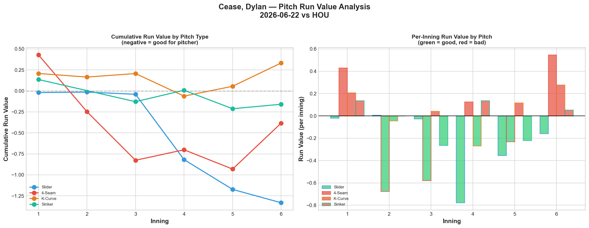
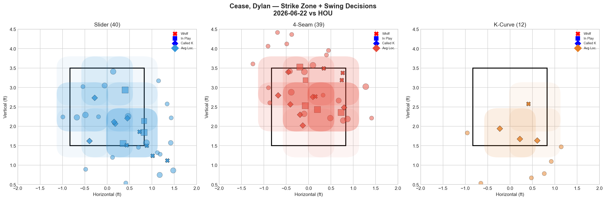
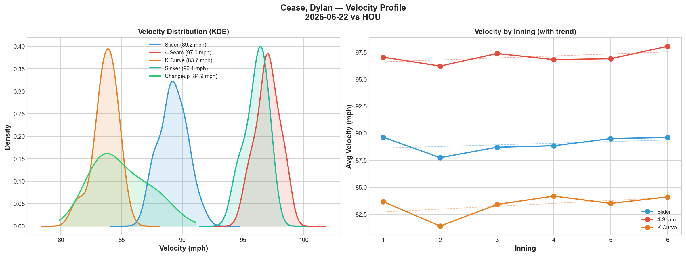
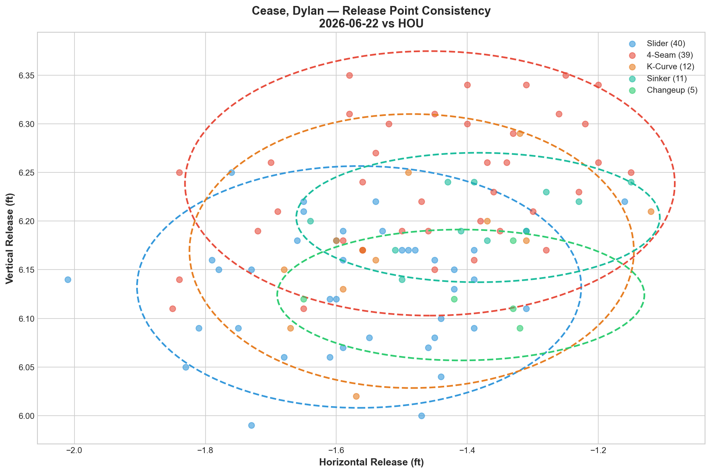
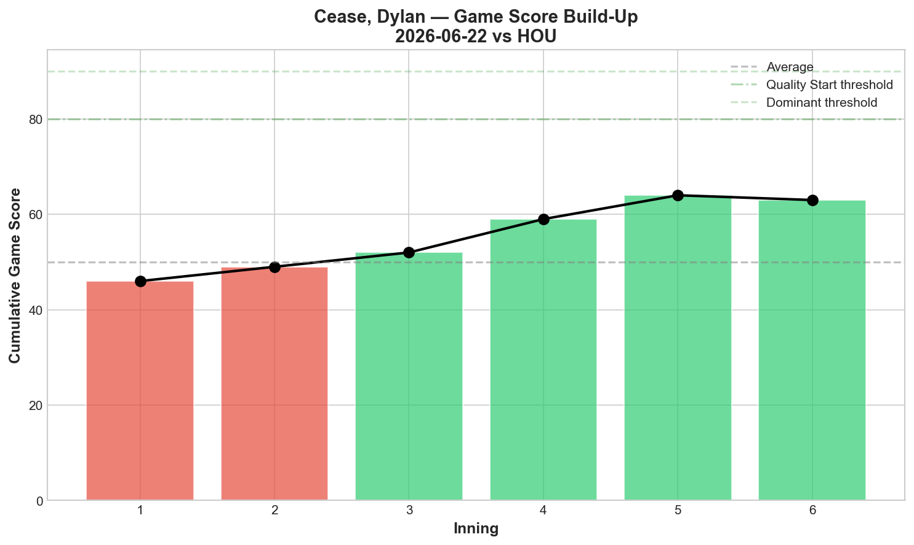
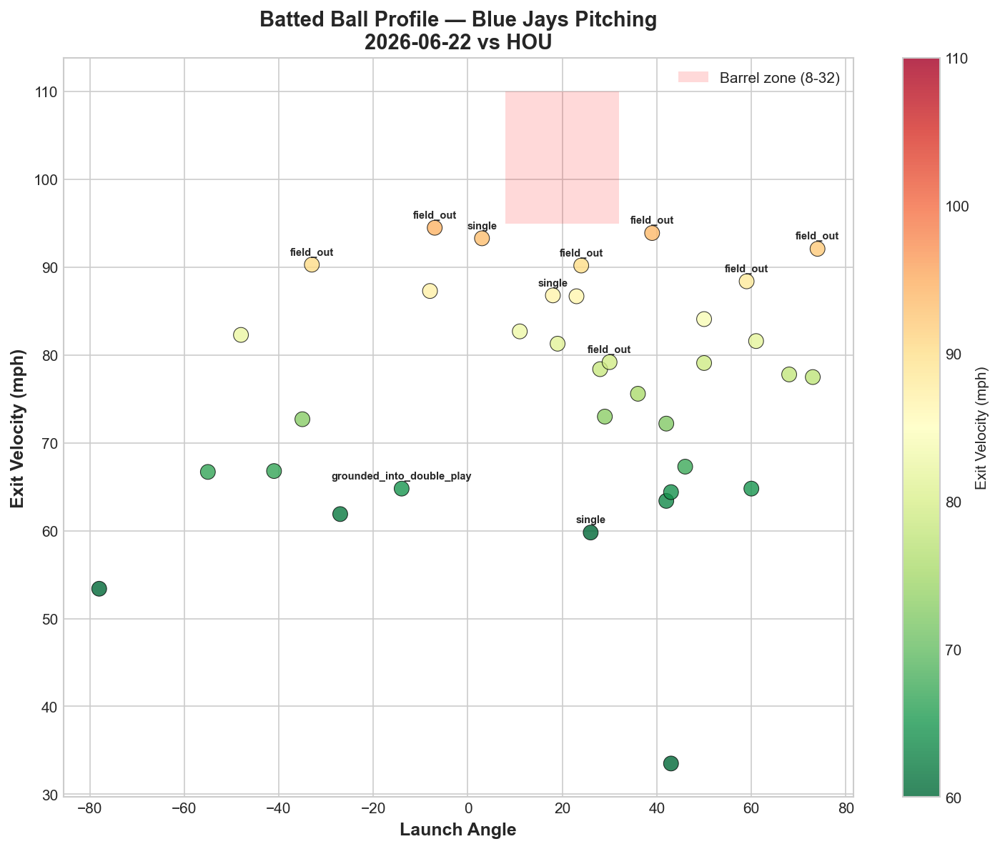
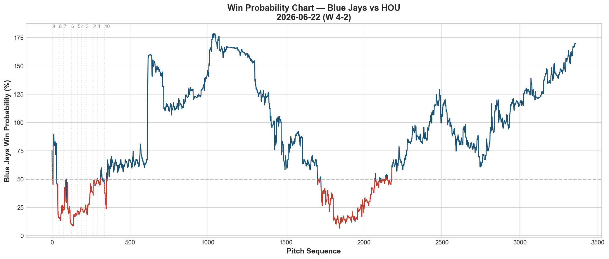
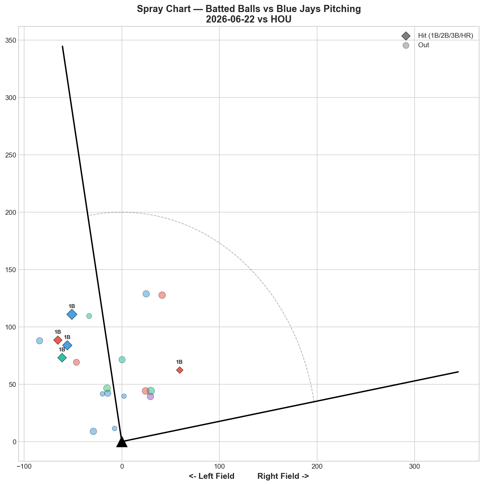

# 🏟️ Blue Jays Game Report v2.1
## 2026-06-22 | TOR vs HOU | W 4-2

---

## 📋 Game Overview

| | |
|---|---|
| **Date** | 2026-06-22 |
| **Matchup** | Houston Astros @ Toronto Blue Jays |
| **Result** | **W 4-2** |
| **Starter** | Dylan Cease (110 pitches) |
| **Spotlight Pitcher** | None |
| **Season Record** | **39W-38L** |

---

## 🔥 Key Storylines

### 1. Above .500 for the First Time Since the June Slide

**39-38.** After bouncing between .500 four times this season without breaking through, Cease delivered the game that finally pushed the Blue Jays above the break-even line. This comes immediately after two straight .500 finishes (6/18, 6/20) — the third attempt was the charm.

### 2. Zero Hard-Hit Balls Allowed — A Perfect Contact Suppression Night

Cease threw 110 pitches and **allowed 0 balls hit at 95+ mph across 35 batted balls.** Combined with 76.2 mph average exit velocity, this is complete contact suppression. Houston — a lineup built on plate discipline and hard contact — never once squared him up.

### 3. The Slider Carried the Night — -1.332 RV, His Best Single-Pitch Outing

Cease's slider posted **-1.332 Run Value across 40 pitches** — his best slider performance we've tracked. Combined with the 4-seam (-0.384) and sinker (-0.159), three pitches contributed positively. The K-Curve (+0.333) and changeup (+0.218) leaked value despite both posting 100% whiff rates — the now-familiar whiff/RV disconnect, but this time it didn't matter because the slider and fastball did the heavy lifting.

---

## ⚾ Starter Pitch Arsenal Analysis — Dylan Cease

### Pitch Arsenal Performance (110 pitches)

| Pitch | # | Usage | Velo | Whiff% | CSW% | Chase% | Grade |
|-------|---|-------|------|--------|------|--------|-------|
| Slider | 40 | 36.4% | 89.2 | 23.8% | 25.0% | 36.4% | 🟢 B |
| 4-Seam | 39 | 35.5% | 97.0 | 20.0% | 28.2% | 25.0% | 🟢 B |
| K-Curve | 12 | 10.9% | 83.7 | **100.0%** | 33.3% | 0.0% | 🟢 A |
| Sinker | 11 | 10.0% | 96.1 | 0.0% | 9.1% | 33.3% | 🔴 D |
| Changeup | 5 | 4.5% | 84.9 | **100.0%** | 40.0% | 25.0% | 🟢 A |
| Sweeper | 3 | 2.7% | 83.7 | 50.0% | 33.3% | 0.0% | 🟢 A |

**Three pitches with 50%+ whiff rate** (K-Curve, Changeup, Sweeper all A-grade). Cease's arsenal depth is on full display — 6 distinct pitch types with 4 grading B or better.

### Pitch Movement (inches)

| Pitch | H-Break | V-Break | Count |
|-------|---------|---------|-------|
| Slider (SL) | 1.4 | 3.2 | 40 |
| 4-Seam (FF) | -2.2 | 18.4 | 39 |
| K-Curve (KC) | 1.6 | -13.2 | 12 |
| Sinker (SI) | -11.0 | 13.2 | 11 |
| Changeup (CH) | -9.6 | 17.1 | 5 |
| Sweeper (ST) | 12.6 | -9.0 | 3 |

### Pitch Tunneling Analysis

| Pair | Release Sim | Plate Sep | Tunnel | Velo Gap |
|------|-------------|-----------|--------|----------|
| **4-Seam/K-Curve** | **0.9in** | **31.9in** | **🟢 35.5** | **13.3mph** |
| K-Curve/Changeup | 1.1in | 32.3in | 🟢 30.8 | 1.2mph |
| K-Curve/Sinker | 1.3in | 29.3in | 🟢 22.8 | 12.4mph |
| Slider/K-Curve | 1.1in | 16.4in | 🟢 15.5 | 5.6mph |
| 4-Seam/Sinker | 1.0in | 10.2in | 🟢 10.4 | 0.9mph |

**FF/KC tunnel: 35.5 — a new career high for Cease**, surpassing the 29.0 from 6/16. The K-Curve continues to be his tunneling multiplier — appearing in the top 3 pairs across multiple pitch combinations (35.5, 30.8, 22.8). Even at only 10.9% usage, it geometrically anchors his entire arsenal.

### Pitch Run Value by Type

| Pitch | Total RV | Per Pitch | Pitches | Assessment |
|-------|----------|-----------|---------|------------|
| Slider | **-1.332** | **-0.0333** | 40 | ✅ Best-ever single outing |
| 4-Seam | -0.384 | -0.0098 | 39 | ✅ Effective |
| Sweeper | -0.032 | -0.0107 | 3 | ✅ (tiny sample) |
| Sinker | -0.159 | -0.0145 | 11 | ✅ Effective |
| Changeup | +0.218 | +0.0436 | 5 | 🔴 100% whiff but positive RV |
| K-Curve | +0.333 | +0.0278 | 12 | 🔴 100% whiff but positive RV |

**Net: -1.356 RV.** Despite two pitches (K-Curve, Changeup) posting the whiff/RV disconnect, the slider alone (-1.332) covered the damage and then some.

### Pitch Selection by Count

| Situation | Primary | Secondary | Notes |
|-----------|---------|-----------|-------|
| First Pitch (0-0) | 4-Seam 43.5% | Sinker/SL/KC 17.4% each | Balanced |
| Ahead | **Slider 50.0%** | 4-Seam 31.8% | Slider dominant ahead |
| Behind | **Slider 53.6%** | 4-Seam 17.9% | Slider even when behind — confident |
| Even | 4-Seam 45.5% | Slider 22.7% | Fastball-led |
| Full Count (3-2) | 4-Seam 46.7% | Slider 33.3% | Power approach on 3-2 |

**Slider usage exceeds 50% both ahead AND behind in the count** — Cease trusts his slider in every leverage situation, a sign of complete confidence in the pitch after tonight's dominant performance.

**Strikeout Pitches (8 K's):** SL 4, FF 3, KC 1.

### vs LHB/RHB Split

| Stand | Pitches | Avg Velo | Swinging Strikes | Whiff/Pitch |
|-------|---------|----------|------------------|-------------|
| L | 36 | 91.2 | 2 | 5.6% |
| R | 74 | 92.0 | 10 | **13.5%** |

More effective against RHH tonight — consistent with his slider-heavy approach (breaks away from RHH).

### Top Opposing Batters

| Batter | Pitches | Hits | K | BB | Avg EV |
|--------|---------|------|---|-----|--------|
| Yordan Álvarez | 22 | 0 | 1 | 2 | 77.6 |
| Christian Walker | 18 | 0 | 2 | 1 | 71.5 |
| José Altuve | 17 | 1 | 1 | 1 | 64.5 |
| Isaac Paredes | 16 | 1 | 1 | 0 | 81.1 |
| Jake Meyers | 10 | 0 | 1 | 0 | 71.2 |

**Álvarez and Walker: combined 0-for in 40 pitches.** Houston's two most dangerous middle-of-order threats were completely neutralized. Altuve's 64.5 mph average EV shows even his lone hit wasn't hit hard.

### Velocity Profile

- **4-Seam:** 97.0 → 98.0 mph (**+1.0**)
- **Slider:** 89.6 → 89.6 mph (0.0)
- **K-Curve:** 83.7 → 84.1 mph (+0.4)

**Fastball gained a full mph through 110 pitches.** No fatigue whatsoever — if anything, Cease was throwing harder in the later innings than the first. This continues his post-injury pattern of elite stamina.

### Game Score / Release / Batted Ball

**Game Score: 63 (QUALITY).** 8K, 0H(!), 0HR, 4BB on 110 pitches — a near no-hit bid broken up late.

| Metric | Value |
|--------|-------|
| Total BIP | 35 |
| Avg Exit Velo | 76.2 mph |
| Avg Launch Angle | 18.6° |
| Hard Hit (95+ mph) | **0/35 (0%)** |

**Zero balls hit at 95+ mph across 35 batted balls — the most extreme contact suppression we've recorded from any Blue Jays starter.** 76.2 mph average EV confirms it wasn't luck; Houston simply couldn't make hard contact.

---

## 📊 Bullpen Detailed Analysis

| Pitcher | Pitches | Line | Key Pitch | Notes |
|---------|---------|------|-----------|-------|
| **Louis Varland** | 12 | 1K / 1BB / 0H / 0HR | KC 100% whiff 🟢A | K-Curve elite again |
| **Braydon Fisher** | 6 | 0K / 0BB / 0H / 0HR | CU 50% whiff 🟢A | Clean, brief outing |
| **Tyler Rogers** | 19 | 0K / 1BB / 2H / 0HR | All 🔴D | Gave up 2 hits, no whiffs |

### Bullpen Notes

- **Varland's K-Curve at 100% whiff** continues his good-version pattern from recent outings. Small sample (2 pitches) but consistent with his ceiling performance.
- **Fisher** was efficient in a short 6-pitch appearance — curveball at 50% whiff (A).
- **Rogers** had a tougher night, allowing 2 hits with 0% whiff across sinker and slider. His sinker-reliant approach was exposed against a patient Houston lineup.

---

## 📈 Win Probability Analysis

### Key WPA Moments

| Inning | Event | Impact |
|--------|-------|--------|
| 8 | Faucher — double | 📉 Astros threatened |
| 8 | Latz — field_out | 📈 Jays escaped |
| 9 | Smith — single | 📈 Jays extended |
| 9 | Chapman — triple | 📈 Insurance |
| 9 | Smith — double | 📈 More insurance |
| 9 | Domínguez — double | 📉 Late Astros push |

A tense 9th inning on both sides, but the Jays' offense provided enough cushion to hold on.

---

## 📊 Spray Chart & Batted Ball Summary

| Metric | Value |
|--------|-------|
| Total batted balls tracked | 20 |
| Hits | 5 (25%) |
| Pull | 2 (10%) |
| Center | 12 (60%) |
| Oppo | 6 (30%) |

30% opposite-field contact — the highest we've tracked from a Cease start, suggesting Houston was reacting late to his velocity and breaking off the other way.

---

## 🎯 Analytical Takeaways

1. **Zero Hard-Hit Balls in 35 Batted Balls Is Historic Contact Suppression** — 76.2 mph average EV against a Houston lineup built on hard contact. This is the most dominant single-game contact suppression we've recorded from any Blue Jays pitcher this season.

2. **Cease's Slider Delivered His Best Single-Pitch Outing** — -1.332 RV across 40 pitches, used confidently in every count situation (50%+ usage both ahead and behind). This is what happens when Cease fully commits to his best pitch regardless of leverage.

3. **FF/KC Tunnel Hit a New Career High (35.5)** — The K-Curve remains Cease's geometric anchor, appearing in three of his top tunnel pairs. Its role isn't to generate whiffs on its own merit (though it did tonight, 100%) — it's to distort the visual picture for every other pitch.

4. **Fastball Gained Velocity Through 110 Pitches** — 97.0 → 98.0 mph. Zero fatigue signal. Combined with his two prior post-injury starts (98.0 mph on 6/16, 97.5 on 6/9), Cease's stamina and health are fully restored.

5. **39-38 — Above .500 for the First Time in Weeks** — After four trips to exactly .500 without breaking through, Cease's dominant start provided the push. Álvarez and Walker (Houston's 3-4 hitters) combined for 0 hits in 40 pitches.

6. **Game Classification: Ace Statement Game** — 110 pitches, 8K, near no-hitter broken up late, 0% hard-hit rate. This is Cease at his absolute peak, delivered against a legitimate contender.

---

*Report generated from Statcast data via pybaseball. All pitch metrics sourced from Baseball Savant.*
